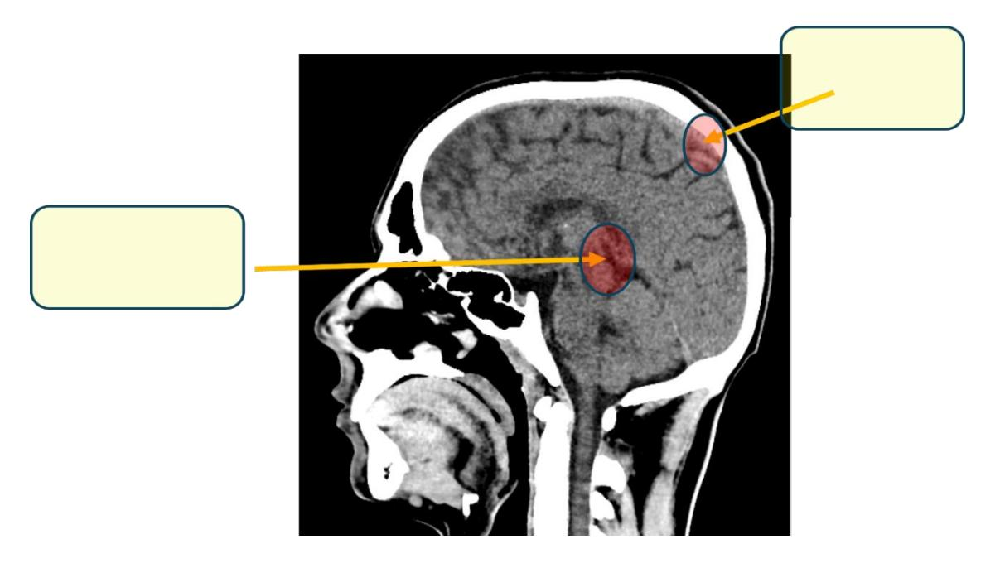
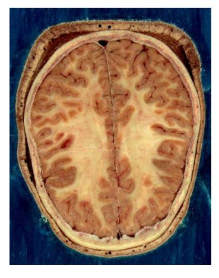
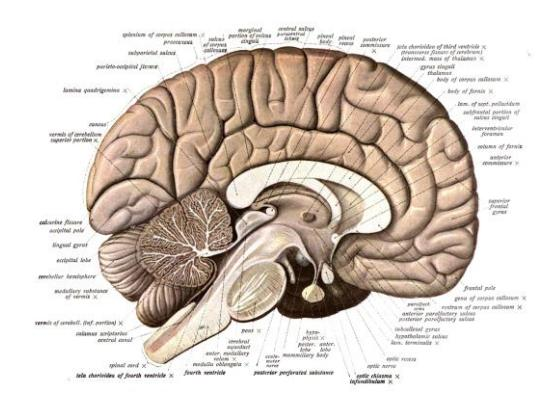
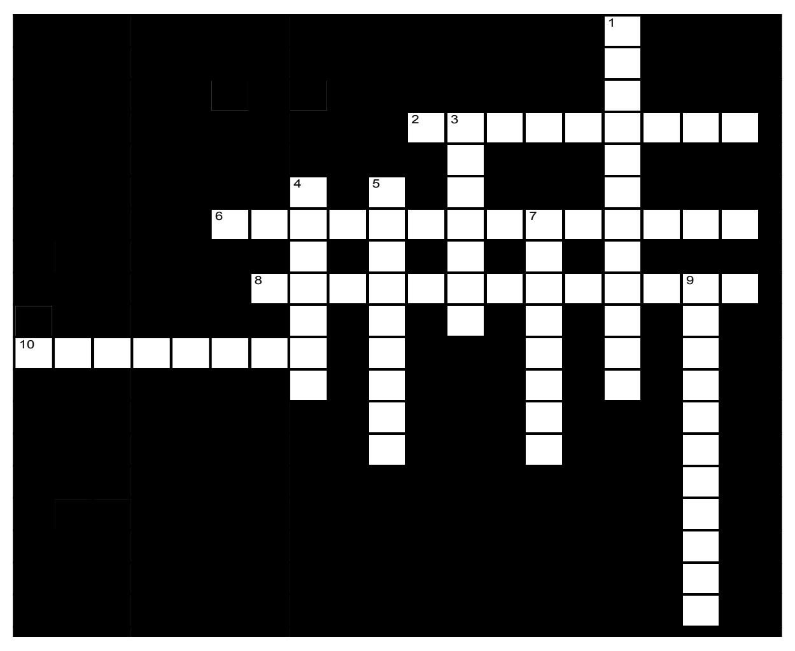

# **Anatomical Language**

## **Your objectives for this lab are to:**

-   Define and demonstrate the anatomical position.
-   Use the correct terminology to describe the planes of the body.
-   Identify the planes of view is several different views of the body.
-   Define and demonstrate the different anatomical positions.
-   Define and demonstrate the directional terms used in anatomy.
-   Define and apply the different anatomical regions.
-   Locate the major cavities and describe several of the organs that lie within each.
-   Identify the abdominopelvic cavities':
    -   Four quadrants and their organs
    -   Nine regions and their organs
-   Identify the serous membranes within the body and their respective layers.

## **Terms to learn:**

## **Regional Terms**

## **Anterior View**

-   Abdominal
-   Antebrachial
-   Antecubital
-   Axillary
-   Brachial
-   Buccal
-   Carpal
-   Cervical
-   Thoracic
-   Crural
-   Deltoid
-   Digital
-   Femoral
-   Frontal
-   Inguinal
-   Nasal
-   Oral
-   Orbital
-   Palmar
-   Patellar
-   Pectoral
-   Pedal
-   Pelvic
-   Pubic
-   Sternal
-   Tarsal

### **Posterior View**

-   Calcaneal
-   Cephalic
-   Gluteal
-   Lumbar
-   Occipital
-   Plantar
-   Sacral
-   Vertebral

## **Directional Terms**

-   Superior (cranial, cephalic)
-   Inferior (caudal)
-   Anterior (ventral)
-   Posterior (dorsal)
-   Medial
-   Lateral
-   Proximal
-   Distal
-   Intermediate
-   Superficial (external)
-   Deep (internal)

## **Planes**

-   Sagittal
-   Midsagittal
-   Parasagittal
-   Frontal (coronal)
-   Transverse (horizontal)
-   Oblique section
-   Cross-section vs. Longitudinal section

## **Body Cavities, Membranes, and Abdominopelvic Quadrants**

Be able to identify cavities, as well as organs found in each cavity.

## **Cavities**

-   Dorsal cavity
    -   Cranial cavity
    -   Spinal cavity
-   Ventral cavity
    -   Thoracic cavity
        -   Pleural cavities
        -   Pericardial cavity
        -   Mediastinum
    -   Abdominopelvic cavity
        -   Abdominal cavity
        -   Pelvic cavity

## **Abdominopelvic Quadrants – identify organs within each quadrant.**

-   Right upper quadrant
-   Left upper quadrant
-   Right lower quadrant
-   Left lower quadrant

## **Organ Systems**

**Know what organs are in each system, as well as the general functions of the system.**

-   Integumentary
-   Skeletal
-   Muscular
-   Nervous
-   Endocrine
-   Cardiovascular
-   Lymphatic
-   Respiratory
-   Digestive
-   Urinary
-   Reproductive

## **Prelab Activities**

## **Prelab Activity 1.1**

Definitions: define the terms that are essential to this chapter.

### Directional terms

+-----------------------+----------------------------------------------+
| Term                  | Definition                                   |
+=======================+==============================================+
| Anterior (or ventral) |                                              |
+-----------------------+----------------------------------------------+
| Posterior (or dorsal) |                                              |
+-----------------------+----------------------------------------------+
| Superior (or cranial) |                                              |
+-----------------------+----------------------------------------------+
| Inferior (or caudal)  |                                              |
+-----------------------+----------------------------------------------+
| Lateral               |                                              |
+-----------------------+----------------------------------------------+
| Medial                |                                              |
+-----------------------+----------------------------------------------+
| Proximal              |                                              |
+-----------------------+----------------------------------------------+
| Distal                |                                              |
+-----------------------+----------------------------------------------+
| Superficial           |                                              |
+-----------------------+----------------------------------------------+
| Deep                  |                                              |
+-----------------------+----------------------------------------------+

### Body Cavities

+----------------+------------------------------------+
| Term           | Definition                         |
+================+====================================+
| Cranial        |                                    |
+----------------+------------------------------------+
| Abdominal      |                                    |
+----------------+------------------------------------+
| Pericardial    |                                    |
+----------------+------------------------------------+
| Pleural        |                                    |
+----------------+------------------------------------+
| Ventral        |                                    |
+----------------+------------------------------------+

### Body Planes

+--------------------+----------------------------------------------+
| Term               | Definition                                   |
+====================+==============================================+
| Sagittal plane     |                                              |
+--------------------+----------------------------------------------+
| Midsagittal plane  |                                              |
+--------------------+----------------------------------------------+
| Parasagittal plane |                                              |
+--------------------+----------------------------------------------+
| Frontal plane      |                                              |
+--------------------+----------------------------------------------+
| Transverse plane   |                                              |
+--------------------+----------------------------------------------+
| Oblique plane      |                                              |
+--------------------+----------------------------------------------+

## **Prelab Activity 1.2**

## **Identification**

Identify the following cavities or structures in the body.

**Figure 1.1** Diagram of labeled body cavities.

**Table 1.1 Identification Table for Figure 1.1.**

+---------------+-------------------------------------------------------+
| Cavity number | Cavity or structures                                  |
+===============+=======================================================+
| 1             |                                                       |
+---------------+-------------------------------------------------------+
| 2             |                                                       |
+---------------+-------------------------------------------------------+
| 3             |                                                       |
+---------------+-------------------------------------------------------+
| 4             |                                                       |
+---------------+-------------------------------------------------------+
| 5             |                                                       |
+---------------+-------------------------------------------------------+
| 6             |                                                       |
+---------------+-------------------------------------------------------+
| 7             |                                                       |
+---------------+-------------------------------------------------------+
| a             |                                                       |
+---------------+-------------------------------------------------------+
| b             |                                                       |
+---------------+-------------------------------------------------------+
| c             |                                                       |
+---------------+-------------------------------------------------------+
| d             |                                                       |
+---------------+-------------------------------------------------------+
| e             |                                                       |
+---------------+-------------------------------------------------------+

## **Prelab Activity 1.3**

## **Identification**

Using the lab manual or your textbook, list the 12 organ systems of the body below and the major functions and organs in each: (Note: Male and female reproductive systems are counted as two systems, 11a and 11b, respectively).

**Table 1.2**. Identification of Organs and their Function

+--------------+--------------+--------------+
| Organ System | Function     | Organs       |
+==============+==============+==============+
| 1            |              |              |
+--------------+--------------+--------------+
| 2            |              |              |
+--------------+--------------+--------------+
| 3            |              |              |
+--------------+--------------+--------------+
| 4            |              |              |
+--------------+--------------+--------------+
| 5            |              |              |
+--------------+--------------+--------------+
| 6            |              |              |
+--------------+--------------+--------------+
| 7            |              |              |
+--------------+--------------+--------------+
| 8            |              |              |
+--------------+--------------+--------------+
| 9            |              |              |
+--------------+--------------+--------------+
| 10           |              |              |
+--------------+--------------+--------------+
| 11a          |              |              |
+--------------+--------------+--------------+
| 11b          |              |              |
+--------------+--------------+--------------+

## **Lab Activities**

## **Lab Activity 1.1**

## **Body Organization and Terminology Review**

**Anatomical Terminology**: Using the information in your textbook define the following anatomical terms:

### **Anatomical position**

**Figure 1.2**. Anatomical position.

#### **Prone and supine positions**

**Figure 1.3** Prone and supine diagrams.

## **Lab Activity 1.2**

## **Applying Directional Terms**; label the diagrams below:

## **List of directional terms**

-   Right
-   Left
-   superior
-   inferior
-   anterior
-   posterior
-   dorsal
-   ventral
-   cranial
-   caudal
-   medial
-   lateral
-   proximal
-   distal
-   superficial
-   deep

In the image below label the directional terms that are listed above

**Figure 1.4** Unlabeled directional terms diagram.

Indicate in the boxes provided the deep and superficial positions.

**Figure 1.5** Sagittal section of the head. The subject is an 18-year-old male who had blunt trauma to the head after a 25 m long jump during [motocross.](https://en.wikipedia.org/wiki/Motocross)

## **Lab Activity 1.3**

## **Labeling Anatomical and Regional Terminology**

-   Obtain labeling tape and one of the models or skeletons (e.g., a torso model, mini muscle person torso, skeleton)
-   Write the directional terms from activity 1.2 on the model.
-   Once you are done, have another group check your accuracy. Make corrections if needed.
-   Then, have your instructor or Lab Instructor check your accuracy.
-   Take pictures of your work to use as a study guide.

## **Lab Activity 1.4**

## **Applying Anatomical and Regional Terminology**

Use appropriate anatomical and regional terminology to fill in the blanks in the statements below.

+----+--------------------------------------------------------------------------------------------------------------------------------------------------------------------------------------------------------------------------------------------------------------------------------------------------+
| \# | Fill in the blank                                                                                                                                                                                                                                                                                |
+====+==================================================================================================================================================================================================================================================================================================+
| 1  | The elbow is located \_\_\_\_\_\_\_\_\_\_\_\_\_\_\_\_\_\_\_\_\_\_\_\_\_\_\_\_\_\_ to the wrist.                                                                                                                                                                                                  |
+----+--------------------------------------------------------------------------------------------------------------------------------------------------------------------------------------------------------------------------------------------------------------------------------------------------+
| 2  | The umbilicus is located \_\_\_\_\_\_\_\_\_\_\_\_\_\_\_\_\_\_\_\_\_\_\_\_\_\_\_\_\_\_ to the sternum.                                                                                                                                                                                            |
+----+--------------------------------------------------------------------------------------------------------------------------------------------------------------------------------------------------------------------------------------------------------------------------------------------------+
| 3  | The nose is located \_\_\_\_\_\_\_\_\_\_\_\_\_\_\_\_\_\_\_\_\_\_\_\_\_\_\_\_\_\_ to the ears.                                                                                                                                                                                                    |
+----+--------------------------------------------------------------------------------------------------------------------------------------------------------------------------------------------------------------------------------------------------------------------------------------------------+
| 4  | The mouth is located \_\_\_\_\_\_\_\_\_\_\_\_\_\_\_\_\_\_\_\_\_\_\_\_\_\_\_\_\_\_ to the chin.                                                                                                                                                                                                   |
+----+--------------------------------------------------------------------------------------------------------------------------------------------------------------------------------------------------------------------------------------------------------------------------------------------------+
| 5  | A papercut that does not penetrate the skin would be considered as a \_\_\_\_\_\_\_\_\_\_\_\_\_\_\_\_\_\_\_\_\_\_\_\_\_\_\_\_\_\_ wound; however, a puncture wound from a nail penetrating the skin would be considered as a \_\_\_\_\_\_\_\_\_\_\_\_\_\_\_\_\_\_\_\_\_\_\_\_\_\_\_\_\_\_ wound. |
+----+--------------------------------------------------------------------------------------------------------------------------------------------------------------------------------------------------------------------------------------------------------------------------------------------------+
| 6  | A wound on the elbow would be \_\_\_\_\_\_\_\_\_\_\_\_\_\_\_\_\_\_\_\_\_\_\_\_\_\_\_\_\_\_ to the elbow.                                                                                                                                                                                         |
+----+--------------------------------------------------------------------------------------------------------------------------------------------------------------------------------------------------------------------------------------------------------------------------------------------------+

## **Lab Activity 1.5**

## **Applying Anatomical and Regional Terminology**

Next, using the definition of anatomical position and correct anatomical language, take turns with your lab partner to give simple, one-movement verbal instructions to transition from the given starting positions (listed in the table below), so that the other person ends up in anatomical position. Write your detailed step-by-step instructions on the provided table.

+--------------------------------------------------------------------------------------------------------------------------------------------------------------------------------+-----------------------------------+-------------------------------------------------------+
| Starting Position                                                                                                                                                              | Image                             | Instructions Given to Move to Anatomical Position     |
+================================================================================================================================================================================+===================================+=======================================================+
| Example: Standing from a Half Spinal Twist with the feet placed to the left, the torso twisted away from you and the head facing at a slight angle to the right, away from you |  | Example:                                              |
|                                                                                                                                                                                |                                   |                                                       |
|                                                                                                                                                                                |                                   | -   Rotate the mental region anteriorly and medially. |
|                                                                                                                                                                                |                                   |                                                       |
|                                                                                                                                                                                |                                   | -   Rotate the entire body 180 degrees to the left.   |
|                                                                                                                                                                                |                                   |                                                       |
|                                                                                                                                                                                |                                   | -   Position palmar region anteriorly                 |
+--------------------------------------------------------------------------------------------------------------------------------------------------------------------------------+-----------------------------------+-------------------------------------------------------+
| 1: From lying face-up on the ground with their head, back, hands, and feet on the floor with both knees bent                                                                   |  |                                                       |
+--------------------------------------------------------------------------------------------------------------------------------------------------------------------------------+-----------------------------------+-------------------------------------------------------+
| 2: From a seated position on the floor with their legs straight and arms folded across their chest                                                                             |  |                                                       |
+--------------------------------------------------------------------------------------------------------------------------------------------------------------------------------+-----------------------------------+-------------------------------------------------------+

## **Lab Activity 1.6**

## **Sectioning/Body Planes**

Using your text, label the planes in the figure below. Draw an oblique plane in the brachial area of the right arm.

## **Body Planes**

-   Sagittal plane
-   Midsagittal plane
-   Parasagittal plane
-   Transverse plane
-   Coronal plane
-   Oblique plane

**Figure 1.9**. Human Anatomical Planes.

Indicate what type of planes were used in the following demonstrations:

**Figure 1.10** Human Head slice.

Plane:

**Figure 1.11** An anatomical illustration from Sobotta's Human Anatomy 1908.

Plane:

## **Lab Activity 1.7**

## **Regional Terminology**

-   Obtain tape and any of the following models (a torso model, mini muscle person torso, skeleton)
-   Write the following terms and attach them to your models.

## **Regions of the body,**

## **Axial Region:**

-   **Cephalic (head)**
    -   Cranial
    -   Pectoral
    -   Facial
    -   Frontal forehead
    -   Orbital eye
    -   Nasal nose
    -   Buccal cheek
    -   Oral mouth
    -   Mental chin
    -   Cervical/Nuchal neck

## **Appendicular:**

-   **Upper Extremity**
    -   Axillary armpit
    -   Brachial arm
    -   Cubital elbow
    -   Antebrachial forearm
    -   Carpal wrist
    -   Manual hand
    -   Digital finger

## **Trunk**

-   Thoracic chest
-   Sternal Clavicular
-   Acromial shoulder
-   Abdominal belly
-   Inguinal groin
-   Pubic genital
-   Coxal hip
-   Vertebral Vertebral column
-   Lumbar lower back
-   Sacral
-   Gluteal (buttocks)

## **Lower Extremity**

-   Femoral thigh
-   Popliteal back of knee
-   Patellar kneecap
-   Crural leg
-   Calcaneal heel
-   Tarsal ankle
-   Pedal foot

**Figure 1.12** The human body is shown in an anatomical position in an (a) anterior view and a (b) posterior view. The regions of the body are labeled in bold face.

## **Body Cavities and Associated Serous Membranes**

-   **Dorsal Cavity:**
    -   Cranial cavity
    -   Vertebral cavity

## **Ventral Cavity:**

-   Thoracic cavity
    -   Mediastinum
    -   Pleural cavities
    -   Pericardial cavity
    -   Diaphragm
-   Abdominopelvic cavity
    -   Abdominal cavity
    -   Pelvic cavity

## **Body Cavities and Associated Serous Membranes Continued**

## **Viscera:**

Ventral body cavities contain **membranes** = soft, thin, pliable layer of tissue:

-   **Visceral Membranes** cover the organs
-   **Parietal Membranes** line the body cavity
    -   There is a space between a visceral and parietal membrane, the **serous cavity**, into which **serous fluid** is secreted for **lubrication**.
-   Cavities referenced to the membranes.
    -   Pleura
    -   Pericardial
    -   Peritoneum

**Figure 1.13** Labeled body cavities.

## **Lab Activity 1.7**

## **Abdominopelvic Cavity Regions and Quadrants**

-   [**Abdominal**](https://commons.wikimedia.org/w/index.php?curid=29624323Abdominal) **quadrants**
    -   Right upper quadrant
    -   Right lower quadrant
    -   Left upper quadrant
    -   Left Lower Quadrant
-   **Abdominal regions**
    -   Epigastric
    -   Left and right hypochondriac
    -   Umbilical
    -   Left and right lumbar
    -   Hypogastric
    -   Left and right iliac

**Figure 1.14** Abdominal quadrants and regions with labels for identification.

## **Lab Activity 1.8**

## **Learning the Quadrants and Planes**

-   Obtain a large torso model.
-   Using the information in activity 1.7 and the torso:
    -   Properly identify the quadrant and the region
    -   Fill in the tables below. If there is more than one organ in a cavity, list at least two organs.

#### **Table 1.3. [Abdominal](https://commons.wikimedia.org/w/index.php?curid=29624323Abdominal) Quadrants**

+----------------------+----------------------------------------------+
| Quadrants            | Organs                                       |
+======================+==============================================+
| Right upper quadrant |                                              |
+----------------------+----------------------------------------------+
| Right lower quadrant |                                              |
+----------------------+----------------------------------------------+
| Left upper quadrant  |                                              |
+----------------------+----------------------------------------------+
| Left lower quadrant  |                                              |
+----------------------+----------------------------------------------+

#### **Table 1.4. Abdominal Regions**

+---------------------+----------------------------------------------+
| Regions             | Organs                                       |
+=====================+==============================================+
| left hypochondriac  |                                              |
+---------------------+----------------------------------------------+
| epigastric          |                                              |
+---------------------+----------------------------------------------+
| right hypochondriac |                                              |
+---------------------+----------------------------------------------+
| left lumbar         |                                              |
+---------------------+----------------------------------------------+
| umbilical           |                                              |
+---------------------+----------------------------------------------+
| right lumbar        |                                              |
+---------------------+----------------------------------------------+
| left iliac          |                                              |
+---------------------+----------------------------------------------+
| hypogastric         |                                              |
+---------------------+----------------------------------------------+
| right iliac         |                                              |
+---------------------+----------------------------------------------+

Figure 1.15 Organ Systems I.

Figure 1.16 Organ Systems II.

## **Lab Activity 1.9: Organ Systems**

Using your textbook, list the 12 organ systems of the body below and the organs in each: (Note: Male and female reproductive systems are counted as two systems here (i.e., 11a and 11b).

**Table 1.5 Organ systems and their Organs**

+--------------+--------------------------------------+
| Organ System | Organs                               |
+==============+======================================+
| 1            |                                      |
+--------------+--------------------------------------+
| 2            |                                      |
+--------------+--------------------------------------+
| 3            |                                      |
+--------------+--------------------------------------+
| 4            |                                      |
+--------------+--------------------------------------+
| 5            |                                      |
+--------------+--------------------------------------+
| 6            |                                      |
+--------------+--------------------------------------+
| 7            |                                      |
+--------------+--------------------------------------+
| 8            |                                      |
+--------------+--------------------------------------+
| 9            |                                      |
+--------------+--------------------------------------+
| 10           |                                      |
+--------------+--------------------------------------+
| 11a          |                                      |
+--------------+--------------------------------------+
| 11b          |                                      |
+--------------+--------------------------------------+

## **Post Lab Activity: Review material**

## **Post Lab Activity 1.1**

**Fill in the blanks.**

### Systems

-   The \_\_\_\_\_\_\_\_\_\_\_\_\_\_\_\_\_\_\_\_\_\_\_\_ system forms the external body covering.
-   The \_\_\_\_\_\_\_\_\_\_\_\_\_\_\_\_\_\_\_\_\_\_\_\_ system protects deeper tissues from injury.
-   The \_\_\_\_\_\_\_\_\_\_\_\_\_\_\_\_\_\_\_\_\_\_\_\_ system synthesizes vitamin D.
-   Organs of the \_\_\_\_\_\_\_\_\_\_\_\_\_\_\_\_\_\_\_\_\_\_\_\_ system secrete chemicals called hormones into the blood.
-   The \_\_\_\_\_\_\_\_\_\_\_\_\_\_\_\_\_\_\_\_\_\_\_\_ system keeps blood supplied with oxygen and disposes of unwanted carbon dioxide.
-   The \_\_\_\_\_\_\_\_\_\_\_\_\_\_\_\_\_\_\_\_\_\_\_\_ system produces sperm or eggs and sex hormones.

### Homeostasis

-   In a(n) \_\_\_\_\_\_\_\_\_\_\_\_\_\_\_\_\_\_\_\_\_\_\_\_ feedback system, a change in a condition is sensed and amplified.
-   In a(n) \_\_\_\_\_\_\_\_\_\_\_\_\_\_\_\_\_\_\_\_\_\_\_\_ feedback system, a change in a condition is sensed and returned toward its previous level.

### Position terms review:

-   The knees are \_\_\_\_\_\_\_\_\_\_\_\_\_\_\_\_\_\_\_\_\_\_\_\_ to the ankles.
-   The thumbs are \_\_\_\_\_\_\_\_\_\_\_\_\_\_\_\_\_\_\_\_\_\_\_\_ to the pinky fingers.
-   The spine is \_\_\_\_\_\_\_\_\_\_\_\_\_\_\_\_\_\_\_\_\_\_\_\_ to the breastbone.
-   The chest is \_\_\_\_\_\_\_\_\_\_\_\_\_\_\_\_\_\_\_\_\_\_\_\_ to the shoulder blades.
-   The pinky fingers are \_\_\_\_\_\_\_\_\_\_\_\_\_\_\_\_\_\_\_\_\_\_\_\_ to the thumbs.
-   The navel is \_\_\_\_\_\_\_\_\_\_\_\_\_\_\_\_\_\_\_\_\_\_\_\_ to the lower back.
-   The eyes are \_\_\_\_\_\_\_\_\_\_\_\_\_\_\_\_\_\_\_\_\_\_\_\_ to the bridge of the nose.
-   The breasts are \_\_\_\_\_\_\_\_\_\_\_\_\_\_\_\_\_\_\_\_\_\_\_\_ to the lungs.
-   The intestines \_\_\_\_\_\_\_\_\_\_\_\_\_\_\_\_\_\_\_\_\_\_\_\_ are to the neck.
-   The nose is \_\_\_\_\_\_\_\_\_\_\_\_\_\_\_\_\_\_\_\_\_\_\_\_ to the mouth.
-   The elbows are \_\_\_\_\_\_\_\_\_\_\_\_\_\_\_\_\_\_\_\_\_\_\_\_ to the wrists.
-   The mouth is \_\_\_\_\_\_\_\_\_\_\_\_\_\_\_\_\_\_\_\_\_\_\_\_ to the forehead.
-   The calf is \_\_\_\_\_\_\_\_\_\_\_\_\_\_\_\_\_\_\_\_\_\_\_\_ to the shin.
-   The heart is \_\_\_\_\_\_\_\_\_\_\_\_\_\_\_\_\_\_\_\_\_\_\_\_ to the ribcage.
-   The genitals are \_\_\_\_\_\_\_\_\_\_\_\_\_\_\_\_\_\_\_\_\_\_\_\_ to the hips.
-   The ankles are \_\_\_\_\_\_\_\_\_\_\_\_\_\_\_\_\_\_\_\_\_\_\_\_ to the shins.
-   The nipples are \_\_\_\_\_\_\_\_\_\_\_\_\_\_\_\_\_\_\_\_\_\_\_\_ to the knees.
-   The lips \_\_\_\_\_\_\_\_\_\_\_\_\_\_\_\_\_\_\_\_\_\_\_\_ are \_\_\_\_\_\_\_\_\_\_\_\_\_\_\_\_\_\_\_\_\_\_\_\_ and to the ears.
-   The brain is \_\_\_\_\_\_\_\_\_\_\_\_\_\_\_\_\_\_\_\_\_\_\_\_ to the skull.
-   The thighs are \_\_\_\_\_\_\_\_\_\_\_\_\_\_\_\_\_\_\_\_\_\_\_\_ to the feet.
-   The lower back is \_\_\_\_\_\_\_\_\_\_\_\_\_\_\_\_\_\_\_\_\_\_\_\_ to the navel.
-   The ribcage is \_\_\_\_\_\_\_\_\_\_\_\_\_\_\_\_\_\_\_\_\_\_\_\_ to the lungs.
-   The skin is \_\_\_\_\_\_\_\_\_\_\_\_\_\_\_\_\_\_\_\_\_\_\_\_ to the muscles.

### Regional terms review

-   "Nasal" refers to the \_\_\_\_\_\_\_\_\_\_\_\_\_\_\_\_\_\_\_\_\_\_\_\_.
-   "Oral" refers to the \_\_\_\_\_\_\_\_\_\_\_\_\_\_\_\_\_\_\_\_\_\_\_\_.
-   "Cervical" refers to the \_\_\_\_\_\_\_\_\_\_\_\_\_\_\_\_\_\_\_\_\_\_\_\_.
-   "Acromial" refers to the \_\_\_\_\_\_\_\_\_\_\_\_\_\_\_\_\_\_\_\_\_\_\_\_.
-   "Axillary" refers to the \_\_\_\_\_\_\_\_\_\_\_\_\_\_\_\_\_\_\_\_\_\_\_\_.
-   "Abdominal" refers to the \_\_\_\_\_\_\_\_\_\_\_\_\_\_\_\_\_\_\_\_\_\_\_\_.
-   "Brachial" refers to the \_\_\_\_\_\_\_\_\_\_\_\_\_\_\_\_\_\_\_\_\_\_\_\_.
-   "Antecubital" refers to the \_\_\_\_\_\_\_\_\_\_\_\_\_\_\_\_\_\_\_\_\_\_\_\_.
-   "Antebrachial" refers to the \_\_\_\_\_\_\_\_\_\_\_\_\_\_\_\_\_\_\_\_\_\_\_\_.
-   "Pelvic" refers to the \_\_\_\_\_\_\_\_\_\_\_\_\_\_\_\_\_\_\_\_\_\_\_\_.

### Planes

-   The \_\_\_\_\_\_\_\_\_\_\_\_\_\_\_\_\_\_\_\_\_\_\_\_ or \_\_\_\_\_\_\_\_\_\_\_\_\_\_\_\_\_\_\_\_\_\_\_\_ plane separates the anterior and posterior portions of an object
-   The \_\_\_\_\_\_\_\_\_\_\_\_\_\_\_\_\_\_\_\_\_\_\_\_or \_\_\_\_\_\_\_\_\_\_\_\_\_\_\_\_\_\_\_\_\_\_\_\_ plane separates the superior and inferior portions of an object.

### Cavities

-   The cranial cavity is within the \_\_\_\_\_\_\_\_\_\_\_\_\_\_\_\_\_\_\_\_\_\_\_\_ cavity.
-   The spinal or vertebral cavity is within the \_\_\_\_\_\_\_\_\_\_\_\_\_\_\_\_\_\_\_\_\_\_\_\_ cavity.
-   The thoracic cavity is within the \_\_\_\_\_\_\_\_\_\_\_\_\_\_\_\_\_\_\_\_\_\_\_\_ cavity.
-   The abdominopelvic cavity is within the \_\_\_\_\_\_\_\_\_\_\_\_\_\_\_\_\_\_\_\_\_\_\_\_ cavity.
-   The brain is found in the \_\_\_\_\_\_\_\_\_\_\_\_\_\_\_\_\_\_\_\_\_\_\_\_ cavity. Use the most specific, i.e., smallest cavity that is appropriate.
-   The spinal cord is found in the \_\_\_\_\_\_\_\_\_\_\_\_\_\_\_\_\_\_\_\_\_\_\_\_ cavity. Use the most specific, i.e., smallest cavity that is appropriate.

## **Post Lab Activity 1.2: Multiple choice questions**

1.  The coronal plane is also called the
    a.  Sagittal plane
    b.  Transverse plane
    c.  Oblique plane
    d.  Frontal plane
2.  The diaphragm separates the:
    a.  Cranial and spinal cavities
    b.  Thoracic and abdominal cavities
    c.  Abdominal and pelvic cavities
    d.  Dorsal and ventral cavities
3.  To make a banana split, you halve a banana into two long, thin, right, and left sides along the \_\_\_\_\_\_\_\_.
    a.  coronal plane
    b.  longitudinal plane
    c.  midsagittal plane
    d.  transverse plane
4.  The heart is within the \_\_\_\_\_\_\_\_.
    a.  cranial cavity
    b.  mediastinum
    c.  posterior (dorsal) cavity
    d.  All the above
5.  The naval is found in \_\_\_\_\_\_\_\_.
    a.  the iliac region
    b.  The lumbar region
    c.  The umbilical region
    d.  The hypochondriac region
6.  The thyroid and the adrenal glands compose the \_\_\_\_\_\_\_\_.
    a.  Lymphatic system
    b.  integumentary system
    c.  nervous system
    d.  endocrine system
7.  The body system responsible for structural support and movement is the \_\_\_\_\_\_\_\_.
    a.  cardiovascular system
    b.  endocrine system
    c.  muscular system
    d.  skeletal system
8.  What is the position of the body when it is in the “normal anatomical position?”
    a.  The person is prone with upper limbs, including palms, touching sides and lower limbs touching at sides.
    b.  The person is standing facing the observer, with upper limbs extended out at a ninety-degree angle from the torso and lower limbs in a wide stance with feet pointing laterally.
    c.  The person is supine with upper limbs, including palms, touching sides and lower limbs touching at sides.
    d.  None of the above
9.  Portion of a serous membrane that is in contact with an organ.
    a.  Mesentery
    b.  Parietal
    c.  Pleural
    d.  Visceral
    e.  Mediastinal
10. Away from the midline
    a.  Inferior
    b.  Medial
    c.  Lateral
    d.  Distal

## **Post Lab Activity 1.3: Crossword Puzzles**

**Figure 1.17** Systems of the body.

### **Across**

-   **2** Is affected by the removal of the thyroid gland (9)
-   **6** Includes the heart (14)
-   **8** Protects underlying organs from drying out and mechanical damage (13)
-   **10** Moves the limbs (8)

### **Down**

-   **1** Provides for conception and childbearing (12)
-   **3** Brain, nerves, sensory receptors (7)
-   **4** Rids the body of nitrogen-containing wastes (7)
-   **5** Breaks down food into small particles that can be absorbed (9)
-   **7** Provides support and levers on which the muscular system can act (8)
-   **9** Provides oxygen into the blood (11)

**Figure 1.18** Body cavities.

Note: The clues include the number of letters in a word in the parentheses at the end of the clue: e.g., "for one word; includes the heart (14)" or for two words; "a large organelle in eukaryotic organisms which protects the DNA (4,7)."

### **Across**

-   **4** Cavity surrounded by the rib cage, bounded inferiorly by the diaphragm. (8)
-   **5** Cavities lateral to the heart which contain the lungs (7)

### **Down**

-   **1** Medial portion of the thoracic cavity; consists of heart, thymus gland, trachea, and blood vessels (11)
-   **2** Small space enclosed by the pelvic bones. (6)
-   **3** Cavity bounded by the abdominal muscles (9)

## **Additional Learning Resources: (Robinson, 2019)**

-   **Watch** these three (3) videos to learn more about these critical, introductory concepts of A&P listed above.
    -   [https://www.youtube.com/watch?v=D4vayAF4atI&feature=yout](https://www.youtube.com/watch?v=D4vayAF4atI&feature=youtu.be) [u.be](https://www.youtube.com/watch?v=D4vayAF4atI&feature=youtu.be)
    -   [https://www.youtube.com/watch?v=4UJ4sylQsEM&feature=yo](https://www.youtube.com/watch?v=4UJ4sylQsEM&feature=youtu.be) [utu.be](https://www.youtube.com/watch?v=4UJ4sylQsEM&feature=youtu.be)
    -   Review of anatomical position, directional terms, and planes/sections. <https://www.youtube.com/watch?v=f6rZw7QkGLw> -
-   **Practice** anatomical terminology and labeling of regions, cavities, and membranes here:
    -   <https://webanatomy.umn.edu/ch1-topics> (regions and cavities)

### **Other resources**

-   **OpenStax:**
    -   <https://openstax.org/details/anatomy-and-physiology> OpenStax Anatomy & Physiology e-book. Not to be used as replacement for the required textbook but as an additional source of information, including chapter questions at the end of chapters. Unless otherwise noted, all content on [Open](http://faq.openoregon.org/openoregon.org) Oregon [Educational](http://faq.openoregon.org/openoregon.org) Resources is licensed under a [Creative](http://creativecommons.org/licenses/by/4.0/) Commons Attribution 4.0 [International](http://creativecommons.org/licenses/by/4.0/) License.
-   **KenHub:**
    -   [https://www.kenhub.com](https://www.kenhub.com/) Online anatomy tutorials, videos, and quizzes. Free registration. Many may be more detailed than might be needed at this level but professionally created and accurate.
-   **Miscellaneous:**
    -   [http://www.sumanasinc.com/webcontent/animations/biology.ht](http://www.sumanasinc.com/webcontent/animations/biology.html) [ml](http://www.sumanasinc.com/webcontent/animations/biology.html) – many links to video animations that have simple animations and explanations for some processes (i.e., Synaptic transmission, Action potential conduction (explaining changes that occur in voltage-controlled Na gates, etc.)

### **Answer Keys:**

### **Crosswords:**

**Systems of the body**

-   **Across: 2** Endocrine, **6** Cardiovascular, **8** Integumentary, **10** Muscular.
-   **Down: 1** Reproductive, **3** Nervous, **4** Urinary, **5** Digestive, **7** Skeletal, **9** Respiratory.

### **Body cavities:**

-   **Across: 4** Thoracic, **5** Pleural.
-   **Down: 1** Mediastinum, **2** Pelvic, **3** Abdominal.

### Chapter 1: Anatomical Language Glossary

+-------------------------+-------------------------------------------------------------------------------------------------------------------------------------------------------------------------------------------------------------------------------------------------------------------------------------+
| # Key Terms             | # Definitions                                                                                                                                                                                                                                                                       |
+-------------------------+-------------------------------------------------------------------------------------------------------------------------------------------------------------------------------------------------------------------------------------------------------------------------------------+
| abdominal               | of or pertaining to the abdomen; ventral.                                                                                                                                                                                                                                           |
+-------------------------+-------------------------------------------------------------------------------------------------------------------------------------------------------------------------------------------------------------------------------------------------------------------------------------+
| Abdominal cavity        | General region bounded by the abdominal wall and the pelvis. It contains the peritoneal cavity and the viscera.                                                                                                                                                                     |
+-------------------------+-------------------------------------------------------------------------------------------------------------------------------------------------------------------------------------------------------------------------------------------------------------------------------------+
| abdominopelvic cavity   | division of the anterior (ventral) cavity that houses the abdominal and pelvic viscera                                                                                                                                                                                              |
+-------------------------+-------------------------------------------------------------------------------------------------------------------------------------------------------------------------------------------------------------------------------------------------------------------------------------+
| anabolism               | assembly of more complex molecules from simpler molecules                                                                                                                                                                                                                           |
+-------------------------+-------------------------------------------------------------------------------------------------------------------------------------------------------------------------------------------------------------------------------------------------------------------------------------+
| anatomical position     | standard reference position used for describing locations and directions on the human body                                                                                                                                                                                          |
+-------------------------+-------------------------------------------------------------------------------------------------------------------------------------------------------------------------------------------------------------------------------------------------------------------------------------+
| anatomy                 | science that studies the form and composition of the body's structures                                                                                                                                                                                                              |
+-------------------------+-------------------------------------------------------------------------------------------------------------------------------------------------------------------------------------------------------------------------------------------------------------------------------------+
| antebrachial            | relating to the forearm.                                                                                                                                                                                                                                                            |
+-------------------------+-------------------------------------------------------------------------------------------------------------------------------------------------------------------------------------------------------------------------------------------------------------------------------------+
| antecubital             | pertaining to the surface of the arm in front of the elbow.                                                                                                                                                                                                                         |
+-------------------------+-------------------------------------------------------------------------------------------------------------------------------------------------------------------------------------------------------------------------------------------------------------------------------------+
| anterior                | describes the front or direction toward the front of the body; also referred to as ventral                                                                                                                                                                                          |
+-------------------------+-------------------------------------------------------------------------------------------------------------------------------------------------------------------------------------------------------------------------------------------------------------------------------------+
| anterior cavity         | larger body cavity located anterior to the posterior (dorsal) body cavity; includes the serous membrane-lined pleural cavities for the lungs, pericardial cavity for the heart, and peritoneal cavity for the abdominal and pelvic organs; also referred to as ventral cavity       |
+-------------------------+-------------------------------------------------------------------------------------------------------------------------------------------------------------------------------------------------------------------------------------------------------------------------------------+
| axillary                | of or pertaining to the armpit.                                                                                                                                                                                                                                                     |
+-------------------------+-------------------------------------------------------------------------------------------------------------------------------------------------------------------------------------------------------------------------------------------------------------------------------------+
| brachial                | pertaining to the upper limb                                                                                                                                                                                                                                                        |
+-------------------------+-------------------------------------------------------------------------------------------------------------------------------------------------------------------------------------------------------------------------------------------------------------------------------------+
| buccal                  | pertaining to or directed toward the cheek.                                                                                                                                                                                                                                         |
+-------------------------+-------------------------------------------------------------------------------------------------------------------------------------------------------------------------------------------------------------------------------------------------------------------------------------+
| calcaneal               | Of or pertaining to the calcaneus (heel bone).                                                                                                                                                                                                                                      |
+-------------------------+-------------------------------------------------------------------------------------------------------------------------------------------------------------------------------------------------------------------------------------------------------------------------------------+
| cardiovascular system   | System containing the heart and the blood vessels                                                                                                                                                                                                                                   |
+-------------------------+-------------------------------------------------------------------------------------------------------------------------------------------------------------------------------------------------------------------------------------------------------------------------------------+
| carpal                  | pertaining to the carpus, or wrist.                                                                                                                                                                                                                                                 |
+-------------------------+-------------------------------------------------------------------------------------------------------------------------------------------------------------------------------------------------------------------------------------------------------------------------------------+
| catabolism              | breaking down of more complex molecules into simpler molecules                                                                                                                                                                                                                      |
+-------------------------+-------------------------------------------------------------------------------------------------------------------------------------------------------------------------------------------------------------------------------------------------------------------------------------+
| caudal                  | describes a position below or lower than another part of the body proper; near or toward the tail (in humans, the coccyx, or lowest part of the spinal column); also referred to as inferior                                                                                        |
+-------------------------+-------------------------------------------------------------------------------------------------------------------------------------------------------------------------------------------------------------------------------------------------------------------------------------+
| cell                    | smallest independently functioning unit of all organisms; in animals, a cell contains cytoplasm, composed of fluid and organelles                                                                                                                                                   |
+-------------------------+-------------------------------------------------------------------------------------------------------------------------------------------------------------------------------------------------------------------------------------------------------------------------------------+
| cephalic                | Of or relate to the head                                                                                                                                                                                                                                                            |
+-------------------------+-------------------------------------------------------------------------------------------------------------------------------------------------------------------------------------------------------------------------------------------------------------------------------------+
| cervical                | pertaining to the neck or cervix of any organ or structure.                                                                                                                                                                                                                         |
+-------------------------+-------------------------------------------------------------------------------------------------------------------------------------------------------------------------------------------------------------------------------------------------------------------------------------+
| control center          | compares values to their normal range; deviations cause the activation of an effector                                                                                                                                                                                               |
+-------------------------+-------------------------------------------------------------------------------------------------------------------------------------------------------------------------------------------------------------------------------------------------------------------------------------+
| cranial                 | describes a position above or higher than another part of the body proper; also referred to as superior                                                                                                                                                                             |
+-------------------------+-------------------------------------------------------------------------------------------------------------------------------------------------------------------------------------------------------------------------------------------------------------------------------------+
| cranial cavity          | division of the posterior (dorsal) cavity that houses the brain                                                                                                                                                                                                                     |
+-------------------------+-------------------------------------------------------------------------------------------------------------------------------------------------------------------------------------------------------------------------------------------------------------------------------------+
| cross section           | A section formed by a plane cutting through an object, usually at right angles to an axis.                                                                                                                                                                                          |
+-------------------------+-------------------------------------------------------------------------------------------------------------------------------------------------------------------------------------------------------------------------------------------------------------------------------------+
| crural                  | of or relating to the leg, shank, or thigh.                                                                                                                                                                                                                                         |
+-------------------------+-------------------------------------------------------------------------------------------------------------------------------------------------------------------------------------------------------------------------------------------------------------------------------------+
| deep                    | describes a position farther from the surface of the body                                                                                                                                                                                                                           |
+-------------------------+-------------------------------------------------------------------------------------------------------------------------------------------------------------------------------------------------------------------------------------------------------------------------------------+
| deltoid                 | a large, triangular, multipennate muscle covering the shoulder joint                                                                                                                                                                                                                |
+-------------------------+-------------------------------------------------------------------------------------------------------------------------------------------------------------------------------------------------------------------------------------------------------------------------------------+
| development             | changes an organism goes through during its life                                                                                                                                                                                                                                    |
+-------------------------+-------------------------------------------------------------------------------------------------------------------------------------------------------------------------------------------------------------------------------------------------------------------------------------+
| differentiation         | process by which unspecialized cells become specialized in structure and function                                                                                                                                                                                                   |
+-------------------------+-------------------------------------------------------------------------------------------------------------------------------------------------------------------------------------------------------------------------------------------------------------------------------------+
| digestive system        | a complex network of organs that breaks down food into nutrients. It consists of the gastrointestinal tract plus the accessory organs of digestion.                                                                                                                                 |
+-------------------------+-------------------------------------------------------------------------------------------------------------------------------------------------------------------------------------------------------------------------------------------------------------------------------------+
| distal                  | describes a position farther from the point of attachment or the trunk of the body                                                                                                                                                                                                  |
+-------------------------+-------------------------------------------------------------------------------------------------------------------------------------------------------------------------------------------------------------------------------------------------------------------------------------+
| dorsal                  | describes the back or direction toward the back of the body; also referred to as posterior                                                                                                                                                                                          |
+-------------------------+-------------------------------------------------------------------------------------------------------------------------------------------------------------------------------------------------------------------------------------------------------------------------------------+
| dorsal cavity           | posterior body cavity that houses the brain and spinal cord; also referred to the posterior body cavity                                                                                                                                                                             |
+-------------------------+-------------------------------------------------------------------------------------------------------------------------------------------------------------------------------------------------------------------------------------------------------------------------------------+
| effector                | effector organ that can cause a change in a value                                                                                                                                                                                                                                   |
+-------------------------+-------------------------------------------------------------------------------------------------------------------------------------------------------------------------------------------------------------------------------------------------------------------------------------+
| endocrine system        | a network of glands that produce and release hormones into the bloodstream, which help regulate various bodily functions.                                                                                                                                                           |
+-------------------------+-------------------------------------------------------------------------------------------------------------------------------------------------------------------------------------------------------------------------------------------------------------------------------------+
| external                | Relating to, existing on, or connected with the outside or an outer part                                                                                                                                                                                                            |
+-------------------------+-------------------------------------------------------------------------------------------------------------------------------------------------------------------------------------------------------------------------------------------------------------------------------------+
| femoral                 | Pertaining to the femur or thigh.                                                                                                                                                                                                                                                   |
+-------------------------+-------------------------------------------------------------------------------------------------------------------------------------------------------------------------------------------------------------------------------------------------------------------------------------+
| frontal                 | of, relating to, or situated at the front                                                                                                                                                                                                                                           |
+-------------------------+-------------------------------------------------------------------------------------------------------------------------------------------------------------------------------------------------------------------------------------------------------------------------------------+
| frontal plane           | two-dimensional, vertical plane that divides the body or organ into anterior and posterior portions                                                                                                                                                                                 |
+-------------------------+-------------------------------------------------------------------------------------------------------------------------------------------------------------------------------------------------------------------------------------------------------------------------------------+
| gluteal                 | of or relating to the buttocks                                                                                                                                                                                                                                                      |
+-------------------------+-------------------------------------------------------------------------------------------------------------------------------------------------------------------------------------------------------------------------------------------------------------------------------------+
| growth                  | process of increasing in size                                                                                                                                                                                                                                                       |
+-------------------------+-------------------------------------------------------------------------------------------------------------------------------------------------------------------------------------------------------------------------------------------------------------------------------------+
| homeostasis             | steady state of body systems that living organisms maintain                                                                                                                                                                                                                         |
+-------------------------+-------------------------------------------------------------------------------------------------------------------------------------------------------------------------------------------------------------------------------------------------------------------------------------+
| horizontal plane        | a flat surface that is everywhere perpendicular to the vertical direction,                                                                                                                                                                                                          |
+-------------------------+-------------------------------------------------------------------------------------------------------------------------------------------------------------------------------------------------------------------------------------------------------------------------------------+
| inferior                | describes a position below or lower than another part of the body proper; near or toward the tail (in humans, the coccyx, or lowest part of the spinal column); also referred to as caudal                                                                                          |
+-------------------------+-------------------------------------------------------------------------------------------------------------------------------------------------------------------------------------------------------------------------------------------------------------------------------------+
| inguinal                | of, relating to, or situated in the region of the groin                                                                                                                                                                                                                             |
+-------------------------+-------------------------------------------------------------------------------------------------------------------------------------------------------------------------------------------------------------------------------------------------------------------------------------+
| Integumentary system    | the body's outer layer, consisting of the skin, hair, nails, and glands.                                                                                                                                                                                                            |
+-------------------------+-------------------------------------------------------------------------------------------------------------------------------------------------------------------------------------------------------------------------------------------------------------------------------------+
| intermediate            | One that is in a middle position or state.                                                                                                                                                                                                                                          |
+-------------------------+-------------------------------------------------------------------------------------------------------------------------------------------------------------------------------------------------------------------------------------------------------------------------------------+
| internal                | Of or situated on the inside.                                                                                                                                                                                                                                                       |
+-------------------------+-------------------------------------------------------------------------------------------------------------------------------------------------------------------------------------------------------------------------------------------------------------------------------------+
| lateral                 | Describes the side or direction toward the side of the body                                                                                                                                                                                                                         |
+-------------------------+-------------------------------------------------------------------------------------------------------------------------------------------------------------------------------------------------------------------------------------------------------------------------------------+
| left lower quadrant     | The region of the body that contains the left ovary, Fallopian tubes, and ovaries and rectosigmoid colon                                                                                                                                                                            |
+-------------------------+-------------------------------------------------------------------------------------------------------------------------------------------------------------------------------------------------------------------------------------------------------------------------------------+
| left upper quadrant     | The region of the body containing the stomach, spleen, and tail of pancreas                                                                                                                                                                                                         |
+-------------------------+-------------------------------------------------------------------------------------------------------------------------------------------------------------------------------------------------------------------------------------------------------------------------------------+
| longitudinal section    | a view or cut along the long axis of a structure, showing its lengthwise profile                                                                                                                                                                                                    |
+-------------------------+-------------------------------------------------------------------------------------------------------------------------------------------------------------------------------------------------------------------------------------------------------------------------------------+
| lymphatic system        | a part of the immune system and complementary to the circulatory system.                                                                                                                                                                                                            |
+-------------------------+-------------------------------------------------------------------------------------------------------------------------------------------------------------------------------------------------------------------------------------------------------------------------------------+
| medial                  | describes the middle or direction toward the middle of the body                                                                                                                                                                                                                     |
+-------------------------+-------------------------------------------------------------------------------------------------------------------------------------------------------------------------------------------------------------------------------------------------------------------------------------+
| mediastinum             | The region in mammals between the pleural sacs                                                                                                                                                                                                                                      |
+-------------------------+-------------------------------------------------------------------------------------------------------------------------------------------------------------------------------------------------------------------------------------------------------------------------------------+
| metabolism              | sum of all of the body's chemical reactions                                                                                                                                                                                                                                         |
+-------------------------+-------------------------------------------------------------------------------------------------------------------------------------------------------------------------------------------------------------------------------------------------------------------------------------+
| midsagittal             | divides the body into two parts, it vertically splits any object or organism into two relatively equal left and right halves                                                                                                                                                        |
+-------------------------+-------------------------------------------------------------------------------------------------------------------------------------------------------------------------------------------------------------------------------------------------------------------------------------+
| muscular system         | a set of tissues in the body with the ability to change shape                                                                                                                                                                                                                       |
+-------------------------+-------------------------------------------------------------------------------------------------------------------------------------------------------------------------------------------------------------------------------------------------------------------------------------+
| nasal                   | Of or related to the nose                                                                                                                                                                                                                                                           |
+-------------------------+-------------------------------------------------------------------------------------------------------------------------------------------------------------------------------------------------------------------------------------------------------------------------------------+
| negative feedback       | homeostatic mechanism that tends to stabilize an upset in the body's physiological condition by preventing an excessive response to a stimulus, typically as the stimulus is removed                                                                                                |
+-------------------------+-------------------------------------------------------------------------------------------------------------------------------------------------------------------------------------------------------------------------------------------------------------------------------------+
| nervous system          | the bodily system in vertebrates made up of the brain and spinal cord, nerves, ganglia, and parts of the receptor organs and that receives and interprets stimuli and transmits impulses to the effector organs                                                                     |
+-------------------------+-------------------------------------------------------------------------------------------------------------------------------------------------------------------------------------------------------------------------------------------------------------------------------------+
| oblique section         | a plane that can literally be any type of angle other than a horizontal or vertical angle.                                                                                                                                                                                          |
+-------------------------+-------------------------------------------------------------------------------------------------------------------------------------------------------------------------------------------------------------------------------------------------------------------------------------+
| occipital               | Of or pertaining to the occiput, or back part of the head                                                                                                                                                                                                                           |
+-------------------------+-------------------------------------------------------------------------------------------------------------------------------------------------------------------------------------------------------------------------------------------------------------------------------------+
| oral                    | something that can relate to the mouth                                                                                                                                                                                                                                              |
+-------------------------+-------------------------------------------------------------------------------------------------------------------------------------------------------------------------------------------------------------------------------------------------------------------------------------+
| orbital                 | relating to, or located near the orbit of the eye                                                                                                                                                                                                                                   |
+-------------------------+-------------------------------------------------------------------------------------------------------------------------------------------------------------------------------------------------------------------------------------------------------------------------------------+
| organ                   | functionally distinct structure composed of two or more types of tissues                                                                                                                                                                                                            |
+-------------------------+-------------------------------------------------------------------------------------------------------------------------------------------------------------------------------------------------------------------------------------------------------------------------------------+
| organ system            | group of organs that work together to carry out a particular function                                                                                                                                                                                                               |
+-------------------------+-------------------------------------------------------------------------------------------------------------------------------------------------------------------------------------------------------------------------------------------------------------------------------------+
| organism                | living being that has a cellular structure and that can independently perform all physiologic functions necessary for life                                                                                                                                                          |
+-------------------------+-------------------------------------------------------------------------------------------------------------------------------------------------------------------------------------------------------------------------------------------------------------------------------------+
| palmar                  | relating to, or involving the palm of the hand                                                                                                                                                                                                                                      |
+-------------------------+-------------------------------------------------------------------------------------------------------------------------------------------------------------------------------------------------------------------------------------------------------------------------------------+
| parasagittal            | Situated alongside of or adjacent to a sagittal location or a sagittal plane                                                                                                                                                                                                        |
+-------------------------+-------------------------------------------------------------------------------------------------------------------------------------------------------------------------------------------------------------------------------------------------------------------------------------+
| patellar                | Relating to the circular-triangular bone which articulates with the femur, covers, and protects the anterior articular surface of the knee joint.                                                                                                                                   |
+-------------------------+-------------------------------------------------------------------------------------------------------------------------------------------------------------------------------------------------------------------------------------------------------------------------------------+
| pectoral                | of, situated in or on, or worn on the chest                                                                                                                                                                                                                                         |
+-------------------------+-------------------------------------------------------------------------------------------------------------------------------------------------------------------------------------------------------------------------------------------------------------------------------------+
| pelvic                  | of, relating to, or located in or near the pelvis                                                                                                                                                                                                                                   |
+-------------------------+-------------------------------------------------------------------------------------------------------------------------------------------------------------------------------------------------------------------------------------------------------------------------------------+
| Pelvic cavity           | the body cavity that is bounded by the bones of the pelvis.                                                                                                                                                                                                                         |
+-------------------------+-------------------------------------------------------------------------------------------------------------------------------------------------------------------------------------------------------------------------------------------------------------------------------------+
| plantar                 | Of or relating to the sole of the foot                                                                                                                                                                                                                                              |
+-------------------------+-------------------------------------------------------------------------------------------------------------------------------------------------------------------------------------------------------------------------------------------------------------------------------------+
| proximal                | Situated close to                                                                                                                                                                                                                                                                   |
+-------------------------+-------------------------------------------------------------------------------------------------------------------------------------------------------------------------------------------------------------------------------------------------------------------------------------+
| pubic                   | of, relating to, or situated in or near the region of the pubes or the pubis                                                                                                                                                                                                        |
+-------------------------+-------------------------------------------------------------------------------------------------------------------------------------------------------------------------------------------------------------------------------------------------------------------------------------+
| pericardial cavity      | the fluid-filled space between the two layers of the pericardium                                                                                                                                                                                                                    |
+-------------------------+-------------------------------------------------------------------------------------------------------------------------------------------------------------------------------------------------------------------------------------------------------------------------------------+
| pericardium             | sac that encloses the heart peritoneum serous membrane that lines the abdominopelvic cavity and covers the organs found there                                                                                                                                                       |
+-------------------------+-------------------------------------------------------------------------------------------------------------------------------------------------------------------------------------------------------------------------------------------------------------------------------------+
| physiology              | science that studies the chemistry, biochemistry, and physics of the body's functions                                                                                                                                                                                               |
+-------------------------+-------------------------------------------------------------------------------------------------------------------------------------------------------------------------------------------------------------------------------------------------------------------------------------+
| plane                   | imaginary two-dimensional surface that passes through the body                                                                                                                                                                                                                      |
+-------------------------+-------------------------------------------------------------------------------------------------------------------------------------------------------------------------------------------------------------------------------------------------------------------------------------+
| pleura                  | serous membrane that lines the pleural cavity and covers the lungs                                                                                                                                                                                                                  |
+-------------------------+-------------------------------------------------------------------------------------------------------------------------------------------------------------------------------------------------------------------------------------------------------------------------------------+
| pleural cavities        | the space that is formed when the two layers of the pleura spread apart                                                                                                                                                                                                             |
+-------------------------+-------------------------------------------------------------------------------------------------------------------------------------------------------------------------------------------------------------------------------------------------------------------------------------+
| positive feedback       | mechanism that intensifies a change in the body's physiological condition in response to a stimulus                                                                                                                                                                                 |
+-------------------------+-------------------------------------------------------------------------------------------------------------------------------------------------------------------------------------------------------------------------------------------------------------------------------------+
| posterior               | describes the back or direction toward the back of the body; also referred to as dorsal                                                                                                                                                                                             |
+-------------------------+-------------------------------------------------------------------------------------------------------------------------------------------------------------------------------------------------------------------------------------------------------------------------------------+
| posterior cavity        | posterior body cavity that houses the brain and spinal cord; also referred to as dorsal cavity                                                                                                                                                                                      |
+-------------------------+-------------------------------------------------------------------------------------------------------------------------------------------------------------------------------------------------------------------------------------------------------------------------------------+
| pressure                | force exerted by a substance in contact with another substance                                                                                                                                                                                                                      |
+-------------------------+-------------------------------------------------------------------------------------------------------------------------------------------------------------------------------------------------------------------------------------------------------------------------------------+
| prone                   | face down                                                                                                                                                                                                                                                                           |
+-------------------------+-------------------------------------------------------------------------------------------------------------------------------------------------------------------------------------------------------------------------------------------------------------------------------------+
| proximal                | describes a position nearer to the point of attachment or the trunk of the body                                                                                                                                                                                                     |
+-------------------------+-------------------------------------------------------------------------------------------------------------------------------------------------------------------------------------------------------------------------------------------------------------------------------------+
| regional anatomy        | study of the structures that contribute to specific body regions                                                                                                                                                                                                                    |
+-------------------------+-------------------------------------------------------------------------------------------------------------------------------------------------------------------------------------------------------------------------------------------------------------------------------------+
| renewal                 | process by which worn-out cells are replaced                                                                                                                                                                                                                                        |
+-------------------------+-------------------------------------------------------------------------------------------------------------------------------------------------------------------------------------------------------------------------------------------------------------------------------------+
| reproduction            | process by which new organisms are generated                                                                                                                                                                                                                                        |
+-------------------------+-------------------------------------------------------------------------------------------------------------------------------------------------------------------------------------------------------------------------------------------------------------------------------------+
| reproductive system     | the system of organs and parts which function in reproduction                                                                                                                                                                                                                       |
+-------------------------+-------------------------------------------------------------------------------------------------------------------------------------------------------------------------------------------------------------------------------------------------------------------------------------+
| respiratory system      | a system of organs functioning in respiration                                                                                                                                                                                                                                       |
+-------------------------+-------------------------------------------------------------------------------------------------------------------------------------------------------------------------------------------------------------------------------------------------------------------------------------+
| responsiveness          | ability of an organisms or a system to adjust to changes in conditions                                                                                                                                                                                                              |
+-------------------------+-------------------------------------------------------------------------------------------------------------------------------------------------------------------------------------------------------------------------------------------------------------------------------------+
| right lower quadrant    | The region of the abdomen that contains the terminal ileum, appendix, and cecum                                                                                                                                                                                                     |
+-------------------------+-------------------------------------------------------------------------------------------------------------------------------------------------------------------------------------------------------------------------------------------------------------------------------------+
| right upper quadrant    | The abdominal region that contains the liver, duodenum, and head of pancreas                                                                                                                                                                                                        |
+-------------------------+-------------------------------------------------------------------------------------------------------------------------------------------------------------------------------------------------------------------------------------------------------------------------------------+
| sacral                  | of, relating to, or lying near the sacrum                                                                                                                                                                                                                                           |
+-------------------------+-------------------------------------------------------------------------------------------------------------------------------------------------------------------------------------------------------------------------------------------------------------------------------------+
| sagittal plane          | two-dimensional, vertical plane that divides the body or organ into right and left sides                                                                                                                                                                                            |
+-------------------------+-------------------------------------------------------------------------------------------------------------------------------------------------------------------------------------------------------------------------------------------------------------------------------------+
| section                 | in anatomy, a single flat surface of a three-dimensional structure that has been cut through                                                                                                                                                                                        |
+-------------------------+-------------------------------------------------------------------------------------------------------------------------------------------------------------------------------------------------------------------------------------------------------------------------------------+
| sensor (also, receptor) | reports a monitored physiological value to the control center                                                                                                                                                                                                                       |
+-------------------------+-------------------------------------------------------------------------------------------------------------------------------------------------------------------------------------------------------------------------------------------------------------------------------------+
| serosa                  | serosa membrane that covers organs and reduces friction; also referred to as serous membrane                                                                                                                                                                                        |
+-------------------------+-------------------------------------------------------------------------------------------------------------------------------------------------------------------------------------------------------------------------------------------------------------------------------------+
| serous membrane         | membrane that covers organs and reduces friction; also referred to as serosa                                                                                                                                                                                                        |
+-------------------------+-------------------------------------------------------------------------------------------------------------------------------------------------------------------------------------------------------------------------------------------------------------------------------------+
| set point               | ideal value for a physiological parameter; the level or small range within which a physiological parameter such as blood pressure is stable and optimally healthful, that is, within its parameters of homeostasis                                                                  |
+-------------------------+-------------------------------------------------------------------------------------------------------------------------------------------------------------------------------------------------------------------------------------------------------------------------------------+
| Skeletal system         | the framework of bones and connective tissues that supports the body, protects vital organs, and allows for movement.                                                                                                                                                               |
+-------------------------+-------------------------------------------------------------------------------------------------------------------------------------------------------------------------------------------------------------------------------------------------------------------------------------+
| spinal cavity           | division of the dorsal cavity that houses the spinal cord; also referred to as vertebral cavity                                                                                                                                                                                     |
+-------------------------+-------------------------------------------------------------------------------------------------------------------------------------------------------------------------------------------------------------------------------------------------------------------------------------+
| sternal                 | relating to or near the sternum (i.e., the main bone at the center of the chest)                                                                                                                                                                                                    |
+-------------------------+-------------------------------------------------------------------------------------------------------------------------------------------------------------------------------------------------------------------------------------------------------------------------------------+
| superficial             | describes a position nearer to the surface of the body                                                                                                                                                                                                                              |
+-------------------------+-------------------------------------------------------------------------------------------------------------------------------------------------------------------------------------------------------------------------------------------------------------------------------------+
| superior                | describes a position above or higher than another part of the body proper; also referred to as cranial                                                                                                                                                                              |
+-------------------------+-------------------------------------------------------------------------------------------------------------------------------------------------------------------------------------------------------------------------------------------------------------------------------------+
| supine                  | face up                                                                                                                                                                                                                                                                             |
+-------------------------+-------------------------------------------------------------------------------------------------------------------------------------------------------------------------------------------------------------------------------------------------------------------------------------+
| systemic anatomy        | study of the structures that contribute to specific body systems                                                                                                                                                                                                                    |
+-------------------------+-------------------------------------------------------------------------------------------------------------------------------------------------------------------------------------------------------------------------------------------------------------------------------------+
| tarsal                  | of or relating to the tarsus                                                                                                                                                                                                                                                        |
+-------------------------+-------------------------------------------------------------------------------------------------------------------------------------------------------------------------------------------------------------------------------------------------------------------------------------+
| thoracic                | of, relating to, located within, or involving the thorax                                                                                                                                                                                                                            |
+-------------------------+-------------------------------------------------------------------------------------------------------------------------------------------------------------------------------------------------------------------------------------------------------------------------------------+
| thoracic cavity         | division of the anterior (ventral) cavity that houses the heart, lungs, esophagus, and trachea                                                                                                                                                                                      |
+-------------------------+-------------------------------------------------------------------------------------------------------------------------------------------------------------------------------------------------------------------------------------------------------------------------------------+
| tissue                  | group of similar or closely related cells that act together to perform a specific function                                                                                                                                                                                          |
+-------------------------+-------------------------------------------------------------------------------------------------------------------------------------------------------------------------------------------------------------------------------------------------------------------------------------+
| transverse plane        | two-dimensional, horizontal plane that divides the body or organ into superior and inferior portions                                                                                                                                                                                |
+-------------------------+-------------------------------------------------------------------------------------------------------------------------------------------------------------------------------------------------------------------------------------------------------------------------------------+
| ventral                 | describes the front or direction toward the front of the body; also referred to as anterior                                                                                                                                                                                         |
+-------------------------+-------------------------------------------------------------------------------------------------------------------------------------------------------------------------------------------------------------------------------------------------------------------------------------+
| ventral cavity          | larger body cavity located anterior to the posterior (dorsal) body cavity; includes the serous membrane-lined pleural cavities for the lungs, pericardial cavity for the heart, and peritoneal cavity for the abdominal and pelvic organs; also referred to as anterior body cavity |
+-------------------------+-------------------------------------------------------------------------------------------------------------------------------------------------------------------------------------------------------------------------------------------------------------------------------------+
| vertebral               | of, relating to, or being vertebrae or the vertebral column                                                                                                                                                                                                                         |
+-------------------------+-------------------------------------------------------------------------------------------------------------------------------------------------------------------------------------------------------------------------------------------------------------------------------------+
