# **Cells**

## **Introduction:**

In this lab you will learn to identify the principle internal and external structures of the cell. The cell is the smallest structural and functional component of a living organism. During this session you will learn to identify the organelles, the subcomponents of the cell, from models and diagrams. You will also review the function of the cells as and the process of cell division. Finally, you will be using the microscope to review a select number of cell types.

### **Cellular Identification**

-   Identify organelles that are visible through a microscope.
-   Identify a function with each organelle.
-   Human cheek cell: Identify the nucleus, nucleolus, and plasma membrane.
-   Neuron: Identify endoplasmic reticulum

## **Terms to Learn: Model of typical animal cell. Identify the organelles and their function.**

-   Nucleus
-   Nucleolus
-   Plasma membrane/ cell membrane
-   Cytoplasm
-   Ribosomes
-   Smooth endoplasmic reticulum
-   Rough endoplasmic reticulum
-   Golgi apparatus
-   Vesicles
-   Lysosomes
-   Peroxisomes
-   Mitochondria
-   Centrioles
-   Cytoskeleton filaments

### **Plasma Membrane**

-   Describe the overall construction of the plasma membrane.
-   Identify the components of a plasma membrane.

## **Cell Cycle and Mitosis**

-   Identify the stages of the cell cycle.
-   Interphase
    -   G1
    -   S
    -   G2
-   M-phase: Mitosis
    -   Prophase
    -   Metaphase
    -   Anaphase
    -   Telophase
    -   Cytokinesis
-   Identify the function of the stages of the cell cycle.
-   Identify the events occurring during each stage of mitosis.

## **Prelab Activities**

## **Prelab Activity 3.1**

Define the terms that are essential to this chapter.

## **Cell Structure and Function**

| Term       | Definition |
|------------|------------|
| Cytoplasm  |            |
| Cytosol    |            |
| Organelles |            |

#### Orgarnelle Types:

| Term                         | Definition |
|------------------------------|------------|
| Rough Endoplasmic Reticulum  |            |
| Smooth Endoplasmic reticulum |            |
| Golgi apparatus              |            |
| Mitochondrion                |            |
| Lysosomes                    |            |
| Peroxisomes                  |            |
| Microfilaments               |            |
| Microtubules                 |            |
| Cilia                        |            |
| Flagella                     |            |
| Nucleus                      |            |
| Nucleolus                    |            |

### **Membrane Transport**

-   Passive Transport \_\_\_\_\_\_\_\_\_\_\_\_\_\_\_\_\_\_\_\_\_\_\_\_\_\_\_\_\_\_\_\_\_\_\_\_\_\_\_\_\_\_\_\_\_\_\_
-   Active Transport \_\_\_\_\_\_\_\_\_\_\_\_\_\_\_\_\_\_\_\_\_\_\_\_\_\_\_\_\_\_\_\_\_\_\_\_\_\_\_\_\_\_\_\_\_\_\_\_
-   Diffusion \_\_\_\_\_\_\_\_\_\_\_\_\_\_\_\_\_\_\_\_\_\_\_\_\_\_\_\_\_\_\_\_\_\_\_\_\_\_\_\_\_\_\_\_\_\_\_\_\_\_\_\_\_\_
-   Osmosis \_\_\_\_\_\_\_\_\_\_\_\_\_\_\_\_\_\_\_\_\_\_\_\_\_\_\_\_\_\_\_\_\_\_\_\_\_\_\_\_\_\_\_\_\_\_\_\_\_\_\_\_\_\_
-   Cell Cycle \_\_\_\_\_\_\_\_\_\_\_\_\_\_\_\_\_\_\_\_\_\_\_\_\_\_\_\_\_\_\_\_\_\_\_\_\_\_\_\_\_\_\_\_\_\_\_\_\_\_\_\_\_
-   Interphase \_\_\_\_\_\_\_\_\_\_\_\_\_\_\_\_\_\_\_\_\_\_\_\_\_\_\_\_\_\_\_\_\_\_\_\_\_\_\_\_\_\_\_\_\_\_\_\_\_\_\_\_\_
-   Mitosis \_\_\_\_\_\_\_\_\_\_\_\_\_\_\_\_\_\_\_\_\_\_\_\_\_\_\_\_\_\_\_\_\_\_\_\_\_\_\_\_\_\_\_\_\_\_\_\_\_\_\_\_\_\_\_

### **Stages of Interphase and Mitosis**

-   Interphase \_\_\_\_\_\_\_\_\_\_\_\_\_\_\_\_\_\_\_\_\_\_\_\_\_\_\_\_\_\_\_\_\_\_\_\_\_\_\_\_\_\_\_\_\_\_\_\_\_\_\_\_\_
-   G1 phase \_\_\_\_\_\_\_\_\_\_\_\_\_\_\_\_\_\_\_\_\_\_\_\_\_\_\_\_\_\_\_\_\_\_\_\_\_\_\_\_\_\_\_\_\_\_\_\_\_\_\_\_\_
-   S phase \_\_\_\_\_\_\_\_\_\_\_\_\_\_\_\_\_\_\_\_\_\_\_\_\_\_\_\_\_\_\_\_\_\_\_\_\_\_\_\_\_\_\_\_\_\_\_\_\_\_\_\_\_\_
-   G2 phase \_\_\_\_\_\_\_\_\_\_\_\_\_\_\_\_\_\_\_\_\_\_\_\_\_\_\_\_\_\_\_\_\_\_\_\_\_\_\_\_\_\_\_\_\_\_\_\_\_\_\_\_\_

## **Prelab Activity 3.2**

Identify the stages of mitosis and briefly describe their appearance.

**Table 3.1 Table of Events and Cell Characteristics**

| Stage       | Events | Appearance of cell |
|-------------|--------|--------------------|
| Prophase    |        |                    |
| Metaphase   |        |                    |
| Anaphase    |        |                    |
| Telophase   |        |                    |
| Cytokinesis |        |                    |

## **Prelab Activity 3.3**

Using your textbook identify the following structures of the cell.

Figure 3.1 Diagram of the cell.

|     |     |
|-----|-----|
| 1   |     |
| 2   |     |
| 3   |     |
| 4   |     |
| 5   |     |
| 6   |     |
| 7   |     |
| 8   |     |
| 9   |     |
| 10  |     |
| 11  |     |
| 12  |     |
| 13  |     |
| 14  |     |

### **Prelab Activity 3.4**

Cell Membrane Structure; Label the structures in this diagram of a typical cell membrane.

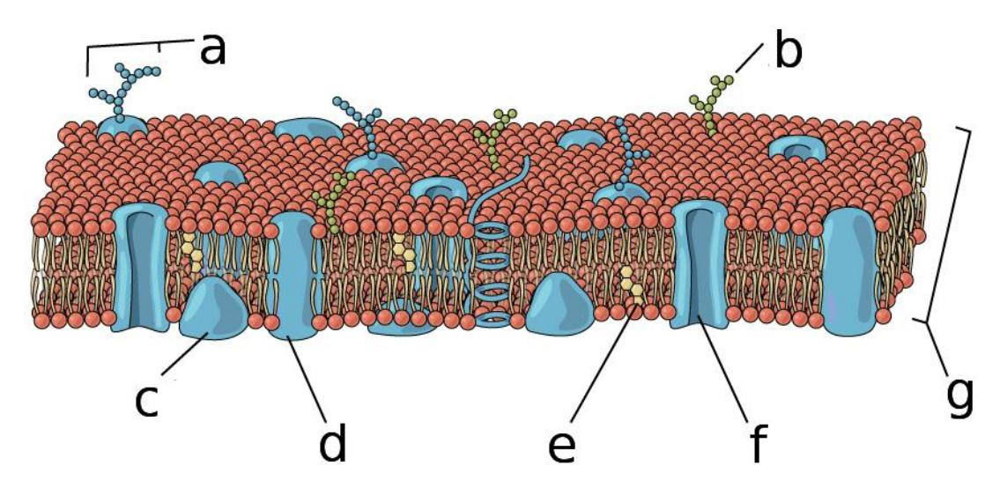

**Figure 3.2** Diagram of the cell membrane.

|     |     |
|-----|-----|
| a   |     |
| b   |     |
| c   |     |
| d   |     |
| e   |     |
| f   |     |
| g   |     |

## **Prelab Activity 3.5**

Cell Cycle: In the space below draw the phases and stages of the cell cycle:

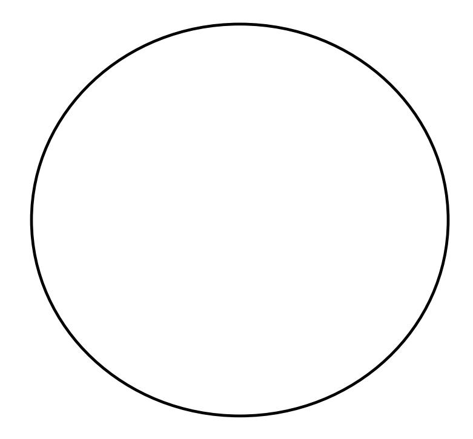

Define the following terms associated with the cell cycle.

-   Cytokinesis: \_\_\_\_\_\_\_\_\_\_\_\_\_\_\_\_\_\_\_\_\_\_\_\_\_\_\_\_\_\_\_\_\_\_\_\_\_\_\_\_\_\_\_\_\_\_\_
-   Interphase: \_\_\_\_\_\_\_\_\_\_\_\_\_\_\_\_\_\_\_\_\_\_\_\_\_\_\_\_\_\_\_\_\_\_\_\_\_\_\_\_\_\_\_\_\_\_\_
-   M-phase: \_\_\_\_\_\_\_\_\_\_\_\_\_\_\_\_\_\_\_\_\_\_\_\_\_\_\_\_\_\_\_\_\_\_\_\_\_\_\_\_\_\_\_\_\_\_\_
-   Chromosome: \_\_\_\_\_\_\_\_\_\_\_\_\_\_\_\_\_\_\_\_\_\_\_\_\_\_\_\_\_\_\_\_\_\_\_\_\_\_\_\_\_\_\_\_\_\_\_
-   Chromatin: \_\_\_\_\_\_\_\_\_\_\_\_\_\_\_\_\_\_\_\_\_\_\_\_\_\_\_\_\_\_\_\_\_\_\_\_\_\_\_\_\_\_\_\_\_\_\_

**Mitosis:** List the stages and processes of mitosis in M-phase:

-   \_\_\_\_\_\_\_\_\_\_\_\_\_\_\_\_\_\_\_\_\_\_\_\_\_\_\_\_\_\_\_\_\_\_\_\_\_\_\_\_\_\_\_\_\_\_\_
-   \_\_\_\_\_\_\_\_\_\_\_\_\_\_\_\_\_\_\_\_\_\_\_\_\_\_\_\_\_\_\_\_\_\_\_\_\_\_\_\_\_\_\_\_\_\_\_
-   \_\_\_\_\_\_\_\_\_\_\_\_\_\_\_\_\_\_\_\_\_\_\_\_\_\_\_\_\_\_\_\_\_\_\_\_\_\_\_\_\_\_\_\_\_\_\_
-   \_\_\_\_\_\_\_\_\_\_\_\_\_\_\_\_\_\_\_\_\_\_\_\_\_\_\_\_\_\_\_\_\_\_\_\_\_\_\_\_\_\_\_\_\_\_\_
-   \_\_\_\_\_\_\_\_\_\_\_\_\_\_\_\_\_\_\_\_\_\_\_\_\_\_\_\_\_\_\_\_\_\_\_\_\_\_\_\_\_\_\_\_\_\_\_

## **Lab Activities:**

## **Cell structure**

## **Lab Activity 3.1**

-   Identify and label all of the reproductive structures listed in the lists below for figures 3.3 to 3.4.
-   Ask your instructor to confirm the correctness of your identifications.
-   Create an enumerated model using the labeling tape to use as a practice quiz. Invite the neighboring group to take the practice quiz during the lab.
-   Photograph your work for later use as a study guide.
-   If time allows create a five-minute video reviewing the parts and functions of the male reproductive system.

## **Terms: Parts of the Cell**

-   Cell membrane
-   Cytoplasm (cytosol)
-   Chromatin
-   Chromosomes
-   Nucleus
-   Nuclear envelope
-   Nucleolus
-   Cytoskeleton
-   Lysosome
-   Centrioles
-   Flagellum
-   Microvilli
-   Cilia
-   Golgi apparatus
-   Rough endoplasmic reticulum
-   Smooth endoplasmic reticulum
-   Ribosome
-   Mitochondria
-   Peroxisome

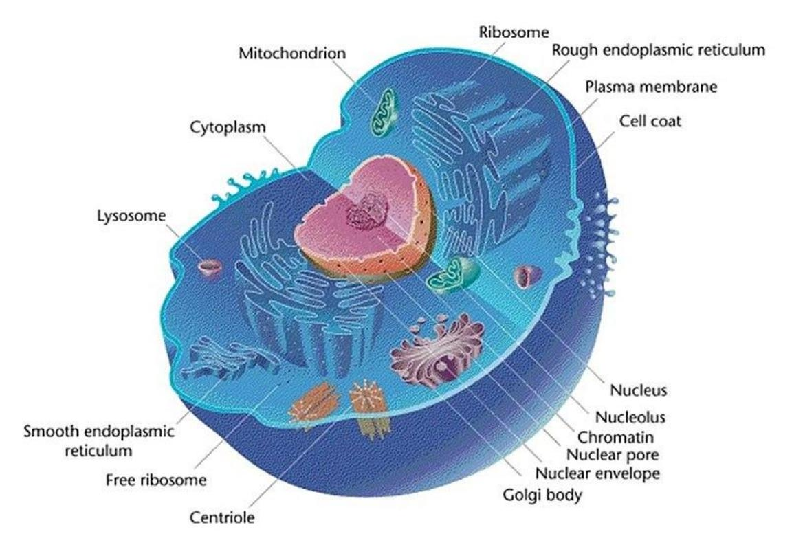

**Figure 3.3** A Typical Animal Cell with Labeled Organelles.

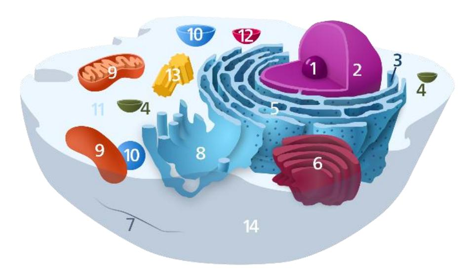

**Figure 3.4** Diagram of the Cell.

Organelles in the cell above are labelled as follows:

|  |  |
|-------------|----------------------------------------------------------|
| 1 | Nucleolus |
| 2 | Nucleus |
| 3 | Ribosome (dots as part of 5) |
| 4 | Vesicle |
| 5 | Rough endoplasmic reticulum |
| 6 | Golgi apparatus (or Golgi body) |
| 7 | Cytoskeleton |
| 8 | Smooth endoplasmic reticulum |
| 9 | Mitochondrion |
| 10 | Vacuole |
| 11 | Cytosol (fluid that contains organelles; with which, comprises cytoplasm) |
| 12 | Lysosome |
| 13 | Centrosome |
| 14 | Cell membrane |

### **Membrane Structure**

Review the material related to the composition of a cell's membrane. You should be able to answer the following questions.

-   What are the primary macromolecules that make up the membrane?
-   What are the functions of the following components:
    -   Phospholipids
    -   Cholesterol
    -   Proteins

## **Components of the cell membrane continued.**

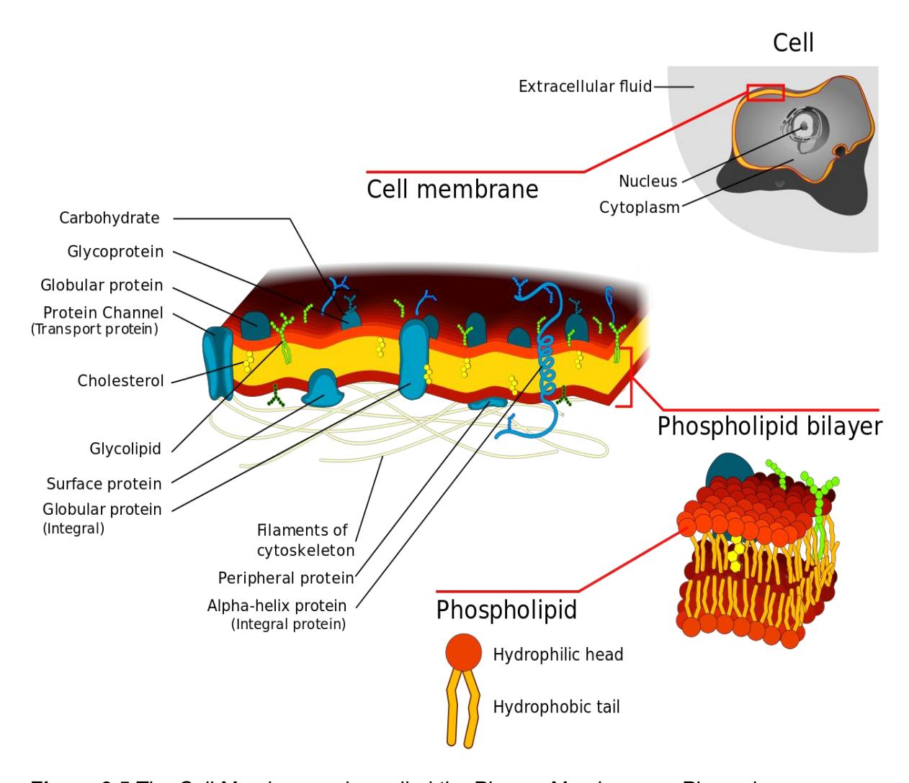

**Figure 3.5** The Cell Membrane, also called the Plasma Membrane or Plasmalemma.

## **Lab Activity 3.1 continued**

-   Obtain tape and one of the models of the cell.
-   Identify and label the cell organelles on the model.
-   Complete the table below (Table 3.1)
-   Once you are done, have another group check your accuracy. Make corrections if needed.
-   Then, have your Instructor or Lab Instructor check your accuracy. Identify the following structures and their function in the model below:

**Figure 3.6** Classroom Model of an Animal Cell: 3B Scientific

## **Lab Activity 3.2**

Using the information in table 3.2 review the cells structures and function(s) then complete the table below.

**Table 3.1 Identify the Organelles and their Function.**

| Structure                    | Model Number | Organelle function |
|------------------------------|--------------|--------------------|
| Plasma membrane              |              |                    |
| Cilia                        |              |                    |
| Microvilli                   |              |                    |
| Nucleolus                    |              |                    |
| Nucleus                      |              |                    |
| Nuclear envelope             |              |                    |
| Nuclear pore                 |              |                    |
| Ribosome                     |              |                    |
| Vesicle                      |              |                    |
| Peroxisome                   |              |                    |
| Lysosome                     |              |                    |
| Golgi apparatus              |              |                    |
| Mitochondrion                |              |                    |
| Rough endoplasmic reticulum  |              |                    |
| Smooth endoplasmic reticulum |              |                    |
| Centriole                    |              |                    |

**Table 3.2 Parts of a Typical Animal Cell**

| Name | Function | Features | Appearance |
|------------------|------------------|------------------|------------------|
| Centriole | Anchor for cytoskeleton, organizes cell division by forming spindle fibers | Visible only when active nuclear division takes place (mitosis) | 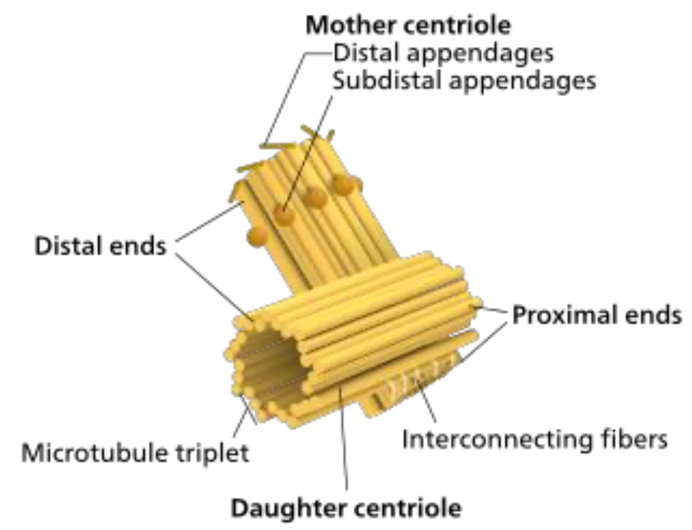 |
| Chromatin | A complex of DNA and protein found in eukaryotic cells whose primary function is to package long DNA molecules into more compact, denser structures | Most of the coloration of the nucleus is from the chromatin, except for that of the nucleolus. | 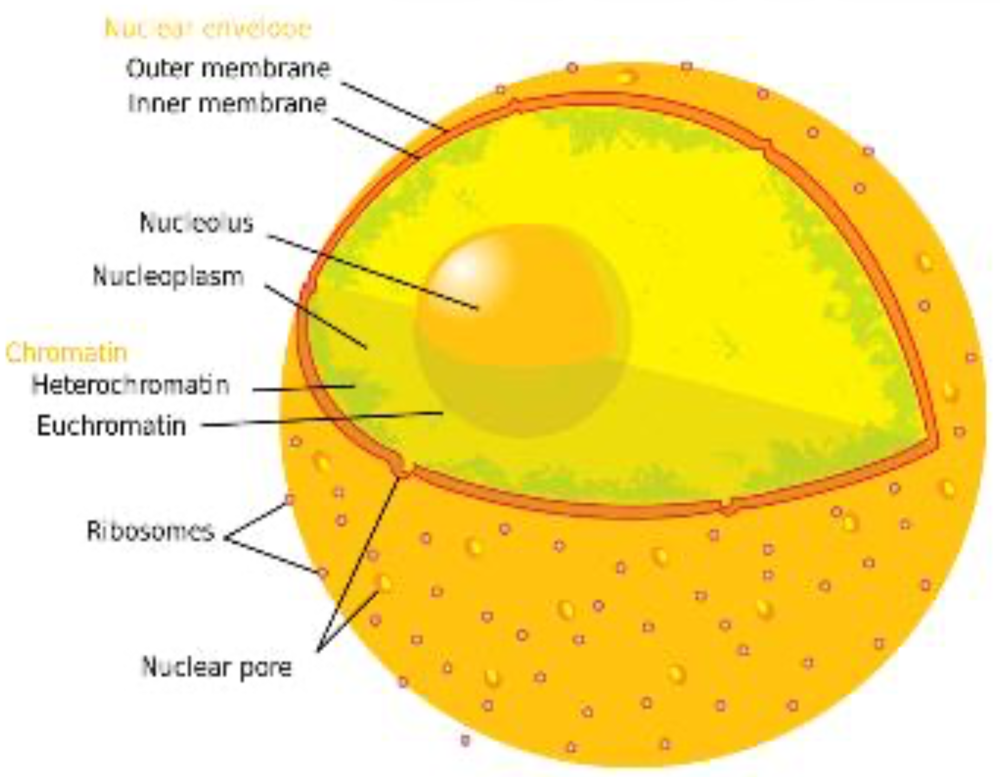 |
| Cytoplasm | All of the material within a eukaryotic cell, enclosed by the cell membrane, except for the cell nucleus | A clear sol-gel that may contain granular substances in it. | 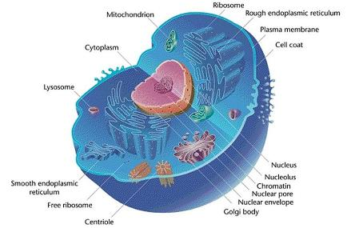 |
| Cytoskeleton | A complex, dynamic network of protein filaments present in the cytoplasm of all cells, excluding bacteria and archaea. Primary function is to organize cell constituents, give the cell its shape and is responsible for locomotion within the cell as well as of the cell itself. | Not visible under a light microscope. | 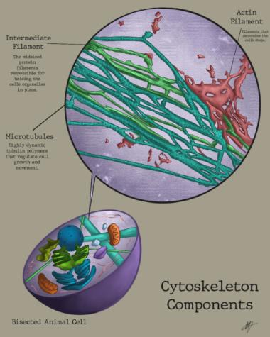 |
| Rough Endoplasmic Reticulum | Translation and folding of new proteins (rough endoplasmic reticulum) | Not visible under a light microscope. | 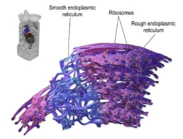 |
| Smooth Endoplasmic Reticulum | Site of lipid synthesis (Smooth Endoplasmic Reticulum) and detoxification of metabolic byproducts. | Not visible under a light microscope. | 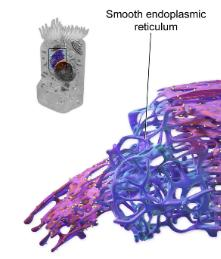 |
| Golgi Apparatus | Processes, modifies, and packages proteins and lipids for transport within the cell or for secretion outside the cell. | Not visible under a light microscope. | 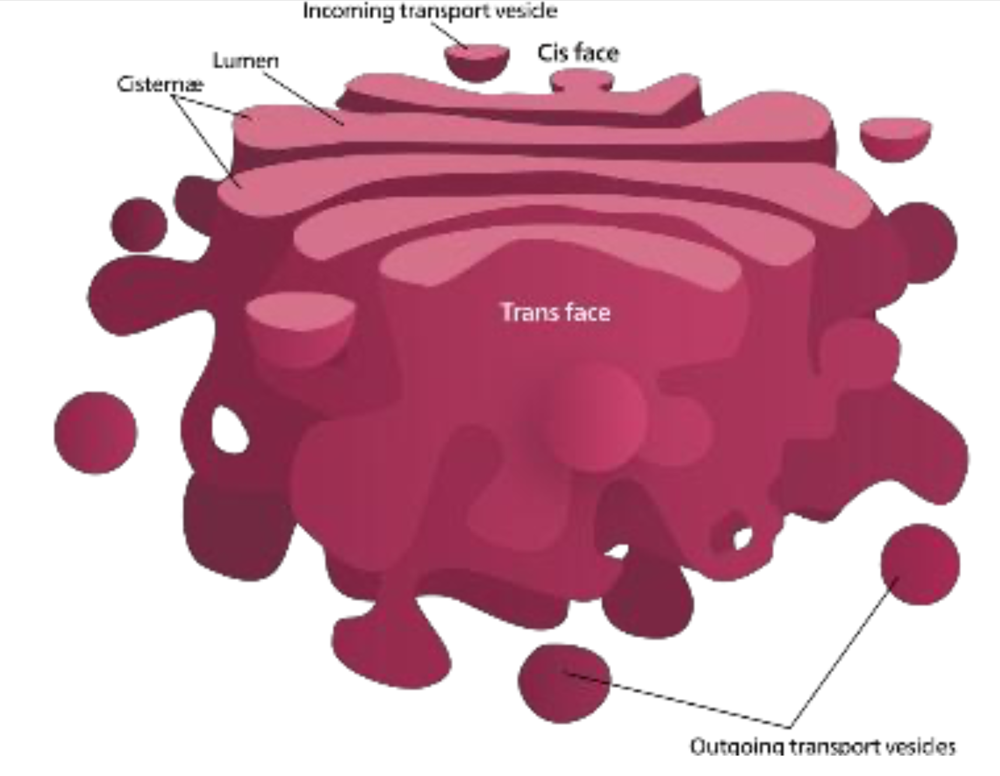 |
| Lysosome | Breakdown of large molecules (e.g., proteins + polysaccharides) | Not visible under a light microscope. | 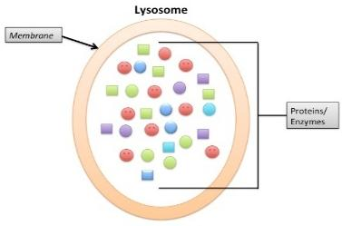 |
| Mitochondrion | Generate energy for the cell | Not visible under a light microscope. | 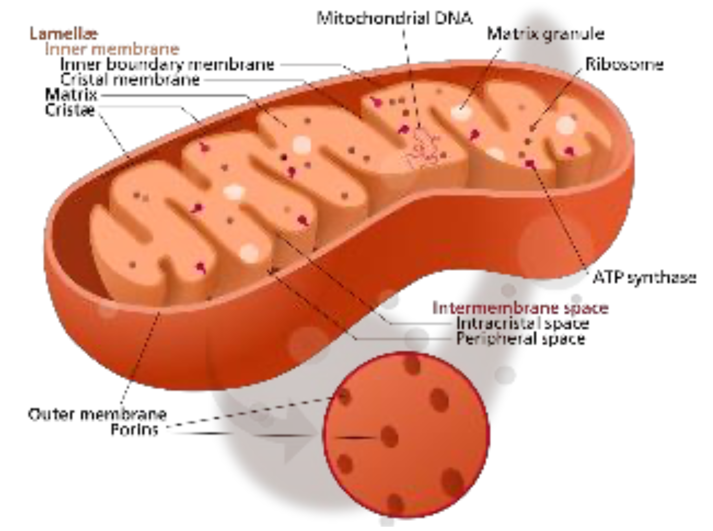 |
| Nucleolus | A specialized region within the nucleus; pre-ribosome production | A small dark circular structure under a light microscope | {alt="Figure 3.8"} |
| Nucleus | DNA maintenance, controls all activities of the cell, RNA transcription | Stains the darkest of all of the structures | {alt="Figure 3.8"} |
| Peroxisome | A membrane-bound organelle, breakdown of metabolic hydrogen peroxide | Not visible under a light microscope | 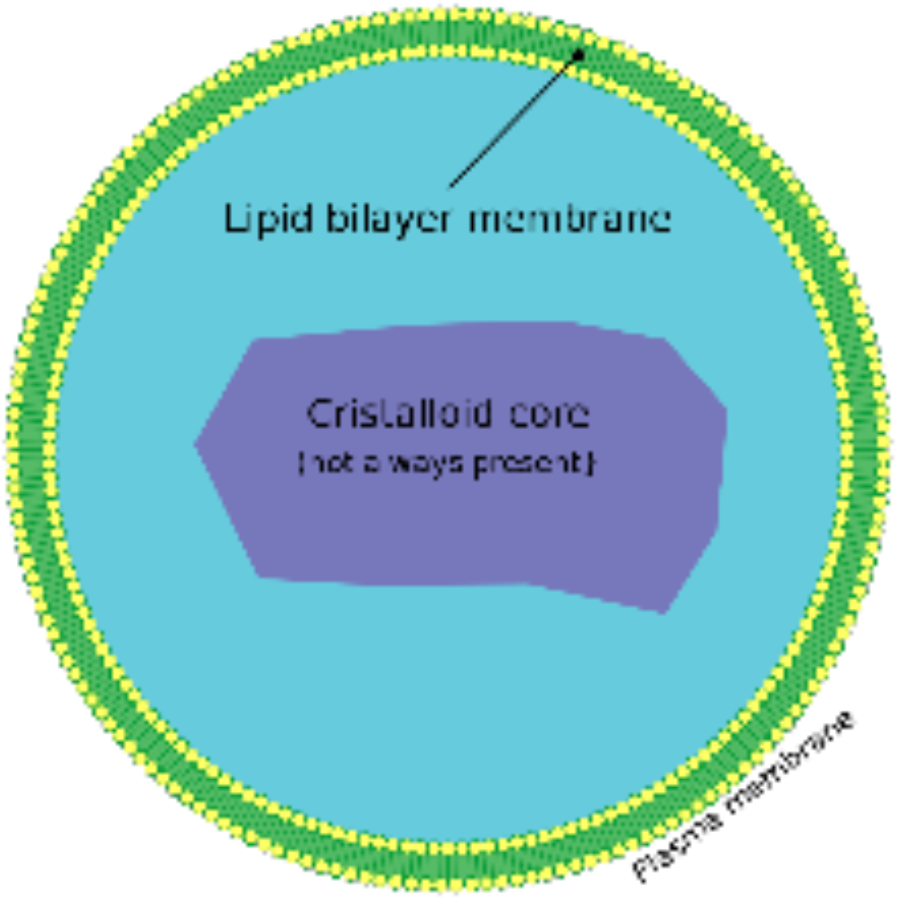 |
| Plasma Membrane | Separates the interior of all cells from the outside environment (the extracellular space) which protects the cell from its environment. | The outer border of the cell is often visible with the light microscope. | 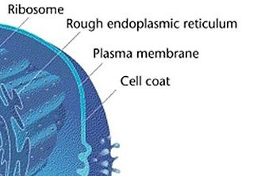 |
| Ribosome | Site where protein synthesis takes place | Not visible under a light microscope | 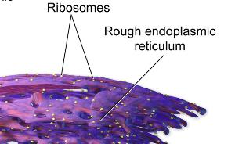 |

### **Microscope Review of Prepared slides**:

-   Blood
-   Cardiac Muscle
-   Motor Neuron
-   Simple Cuboidal Epithelium
-   Simple Squamous Epithelium

## **Lab Activity 3.3**

In the spaces provided below draw the cell at 400X. Label the parts of the cell that you can see; for example, the nucleus, nucleolus, striations, intercalated disc, cytoplasm, dendrite(s), axon, and plasma membrane. When possible, indicate the color of stain used on the tissue.

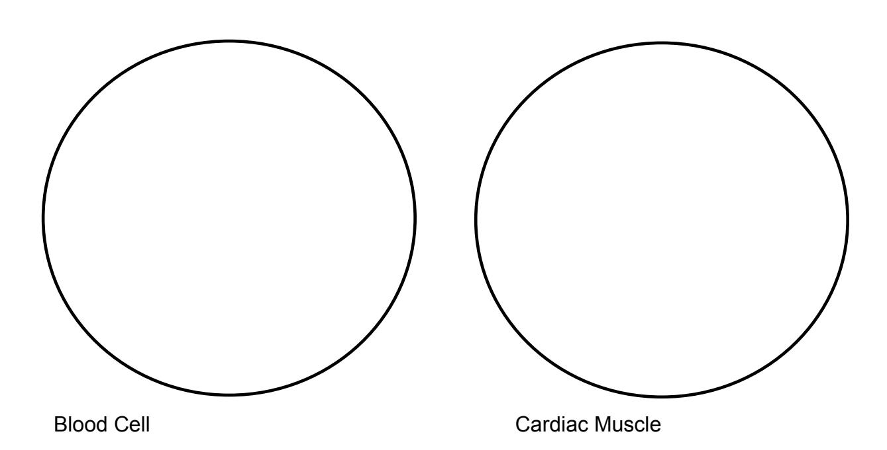

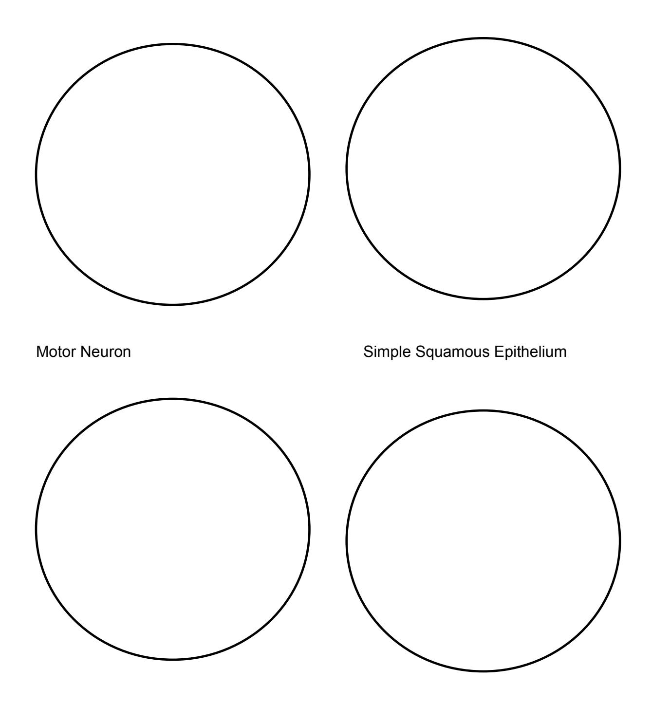

Simple Cuboidal Epithelium

## **Cell cycle**

## **Lab Activity 3.4**

Examine the phases of the cell cycle.

**Figure 3.20:**The Eukaryotic Cell Cycle.

### **Mitosis and Meiosis**

Be able to identify mitosis and meiosis and distinguish them from one another.

-   Interphase
-   Prophase
-   Metaphase
-   Anaphase
-   Telophase
-   Cytokinesis

**Figure 3.21 A series of cell diagrams showing the mitosis division of eukaryotic cells.**

## **Lab Activity 3.5 Examine the phases of the mitosis from the figures below.**

On this page you will find two photos of cells undergoing mitosis in the whitefish blastula. Use these images to test your ability to recognize the phases of mitosis. Identify and label the five stages of mitosis as well as interphase.

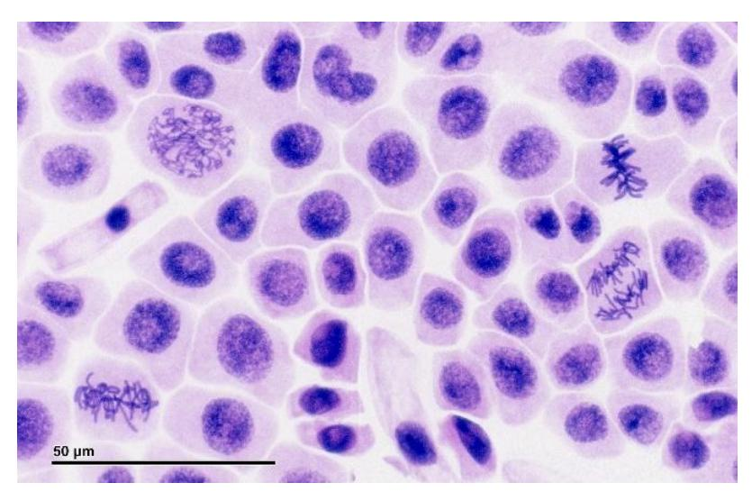

**Figure 3.22a** Bright Field Microscopy Image of Root Meristem of Onion Showing Cells in Prophase, Metaphase, Anaphase, Telophase of Mitosis (Magnification: 1600x)

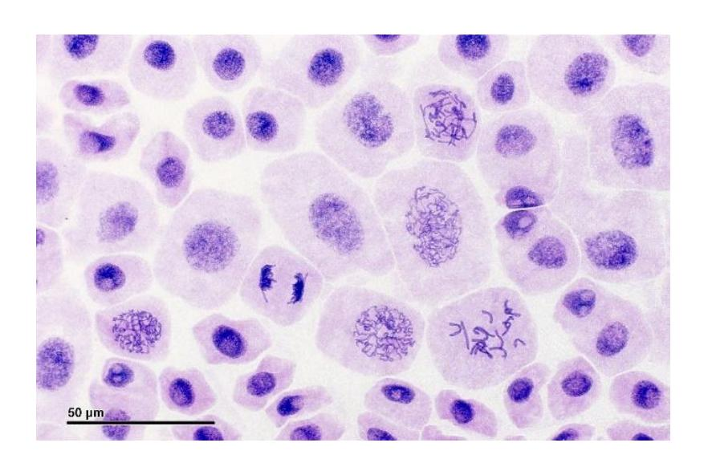

**Figure 3.22b** [Mitosis:](https://en.wikipedia.org/wiki/Mitosis) Pressed, Root Meristem of Onion.

Examine the phases of mitosis from the figures below.

-   Obtain a slide of whitefish blastulas. View the slide using a total magnification of 100X, then 400X.
-   Search through the blastula cells and locate **two (2)** of each phase: interphase, prophase, metaphase, and anaphase. As you work, have a fellow classmate and/or your instructor verify your accuracy.

**Figure 3.23** Stages of Mitosis and Cytokinesis.

## **Post Lab Activities: material review**

## **Post Lab Activity 3.1**

1.  The smallest independent unit that is alive is the \_\_\_\_\_\_\_\_\_\_\_\_\_\_\_\_\_\_\_\_\_\_\_\_.
2.  The region in a human cell that houses the bulk of the genetic material is the \_\_\_\_\_\_\_\_\_\_\_\_\_\_\_\_\_\_\_\_\_\_\_\_.
3.  Most of the cellular machinery in human cells is in the \_\_\_\_\_\_\_\_\_\_\_\_\_\_\_\_\_\_\_\_\_\_\_\_.
4.  The basic structure of a cell's membrane is a(n) \_\_\_\_\_\_\_\_\_\_\_\_\_\_\_\_\_\_\_\_\_\_\_\_\_\_\_\_\_\_\_\_\_\_\_\_\_\_\_\_\_\_\_\_\_\_\_ bilayer with associated proteins that can be either \_\_\_\_\_\_\_\_\_\_\_\_\_\_\_\_\_\_\_\_\_\_\_\_\_\_\_\_\_\_\_\_\_\_\_\_\_\_\_\_\_\_\_\_\_\_\_ or \_\_\_\_\_\_\_\_\_\_\_\_\_\_\_\_\_\_\_\_\_\_\_\_\_\_\_\_\_\_\_\_\_\_\_\_\_\_\_\_\_\_\_\_\_\_\_.

## **Post Lab Activity 3.2**

**Multiple choice questions:**

1.  Because they are embedded within the membrane, ion channels are examples of \_\_\_\_\_\_\_\_\_\_\_\_\_\_\_\_\_\_\_\_\_.
    a)  receptor proteins
    b)  integral proteins
    c)  peripheral proteins
    d)  glycoproteins
2.  Which of the following structures could be found within the nucleolus? \_\_\_\_\_\_\_\_\_\_\_\_\_\_\_\_\_\_\_\_\_
    a)  chromatin
    b)  histones
    c)  ribosomes
    d)  nucleosomes
3.  Choose the term that best completes the following analogy: Cytoplasm is to cytosol as a swimming pool containing chlorine and flotation toys is to \_\_\_\_\_\_\_\_\_\_\_\_\_\_\_\_\_\_\_\_\_.
    a)  the walls of the pool
    b)  the chlorine
    c)  the flotation toys
    d)  the water
4.  The rough ER has its name due to what associated structures? \_\_\_\_\_\_\_\_\_\_\_\_\_\_\_\_\_\_\_\_\_
    a)  Golgi apparatus
    b)  ribosomes
    c)  lysosomes
    d)  proteins
5.  Which of the following is a function of the rough ER? \_\_\_\_\_\_\_\_\_\_\_\_\_\_\_\_\_\_\_\_\_
    a)  production of proteins
    b)  detoxification of certain substances
    c)  synthesis of steroid hormones
    d)  regulation of intracellular calcium concentration
6.  Which of the following organelles produces large quantities of ATP when both glucose and oxygen are available to the cell? \_\_\_\_\_\_\_\_\_\_\_\_\_\_\_\_\_\_\_\_\_
    a)  mitochondria
    b)  peroxisomes
    c)  lysosomes
    d)  ER
7.  Which of the following phases is characterized by preparation for DNA synthesis? \_\_\_\_\_\_\_\_\_\_\_\_\_\_\_\_\_\_\_\_\_
    a)  G0
    b)  G1
    c)  G2
    d)  S

## **Post Lab Activity 3.3 Matching**

## **Table 3.2 Complete the Matching Activity**

| Name | Description |
|---------------------------|---------------------------------------------|
| 1\) \_\_\_\_\_\_\_\_\_\_ Interphase | a\) The first stage of mitosis |
| 2\) \_\_\_\_\_\_\_\_\_\_ G2 Phase | b\) The division of the cytoplasm of a cell |
| 3\) \_\_\_\_\_\_\_\_\_\_ Metaphase | c\) The cell grows physically larger, making the molecular building blocks it will need in later steps. |
| 4\) \_\_\_\_\_\_\_\_\_\_ S phase | d\) Occurs when the cell synthesizes a complete copy of the DNA. |
| 5\) \_\_\_\_\_\_\_\_\_\_ Mitosis or M phase | e\) The cell grows a second time to reorganize its contents in preparation for mitosis. |
| 6\) \_\_\_\_\_\_\_\_\_\_ Prophase | f\) The summary of the G1, S, G2 phases |
| 7\) \_\_\_\_\_\_\_\_\_\_ G1 phase | g\) The process when the cell separates its DNA into two sets and divides its cytoplasm, forming two new cells. |
| 8\) \_\_\_\_\_\_\_\_\_\_ Cytokinesis | h\) Observed when the chromosomes move toward opposite ends of the nuclear spindle |
| 9\) \_\_\_\_\_\_\_\_\_\_ Telophase | i\) Occurs when the cell's chromosomes condense and move together, aligning in the center of the dividing cell. |
| 10\) \_\_\_\_\_\_\_\_\_\_ Anaphase | j\) The final stage in cell division |

## **Post Lab Activity 3.4 Crosswords**

Complete the crossword activity.

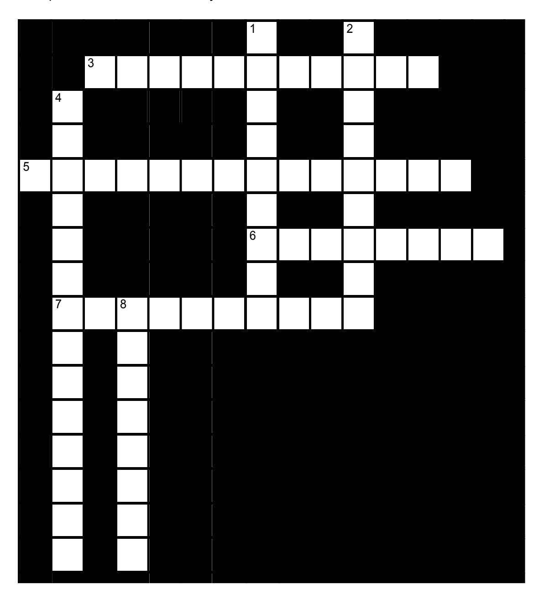

**Figure 3.24** The Cell.

### **Across**

-   **3** a large organelle in eukaryotic organisms which protects the DNA (4,7)

-   **5** a network of lipids and proteins that forms the boundary between a cell's contents and the outside of the cell. (6,8)

-   **6** specialized vesicles within cells that digest large molecules using hydrolytic enzymes. (8)

-   **7** membrane-bound organelles involved in lipid metabolism and the conversion of reactive oxygen species such as hydrogen peroxide into safer molecules like water and oxygen. (10)

### **Down**

-   **1** the site in the nucleus where the several different parts of ribosomes are produced and exported (9)

-   **2** small structures made of microtubules which exists as part of the centrosome (9)

-   **4** an organelle in eukaryotic organisms that moves molecules from the endoplasmic reticulum to their destination. (5,9)

-   **8** an organelle in the cytoplasm of a living cell; the site of protein synthesis (8)

## **Post Lab Activity 3.5 Matching**

### **Table 3.3 Complete the Matching Activity**

Note: Except for the letters, Table 3.3 is a duplicate of Table 3.2. I decided not to remove the duplicates and keep the same activity and table numbers as in the source without skipping numbers.

| Name | Description |
|--------------------------|---------------------------------------------|
| 1\) \_\_\_\_\_\_\_\_\_\_ Interphase | a\) The first stage of mitosis |
| 2\) \_\_\_\_\_\_\_\_\_\_ G2 Phase | b\) The division of the cytoplasm of a cell |
| 3\) \_\_\_\_\_\_\_\_\_\_ Metaphase | c\) The cell grows physically larger, making the molecular building blocks it will need in later steps. |
| 4\) \_\_\_\_\_\_\_\_\_\_ S phase | d\) Occurs when the cell synthesizes a complete copy of the DNA. |
| 5\) \_\_\_\_\_\_\_\_\_\_ Mitosis or M phase | e\) The cell grows a second time to reorganize its contents in preparation for mitosis. |
| 6\) \_\_\_\_\_\_\_\_\_\_ Prophase | f\) The summary of the G1, S, G2 phases |
| 7\) \_\_\_\_\_\_\_\_\_\_ G1 phase | g\) The process when the cell separates its DNA into two sets and divides its cytoplasm, forming two new cells. |
| 8\) \_\_\_\_\_\_\_\_\_\_ Cytokinesis | h\) Observed when the chromosomes move toward opposite ends of the nuclear spindle |
| 9\) \_\_\_\_\_\_\_\_\_\_ Telophase | i\) Occurs when the cell's chromosomes condense and move together, aligning in the center of the dividing cell. |
| 10\) \_\_\_\_\_\_\_\_\_\_ Anaphase | j\) The final stage in cell division |

### **Labeling**

### **Post Lab Activity 3.6**

Label the following stages of the nucleus and of mitosis

### **Cell nucleus**

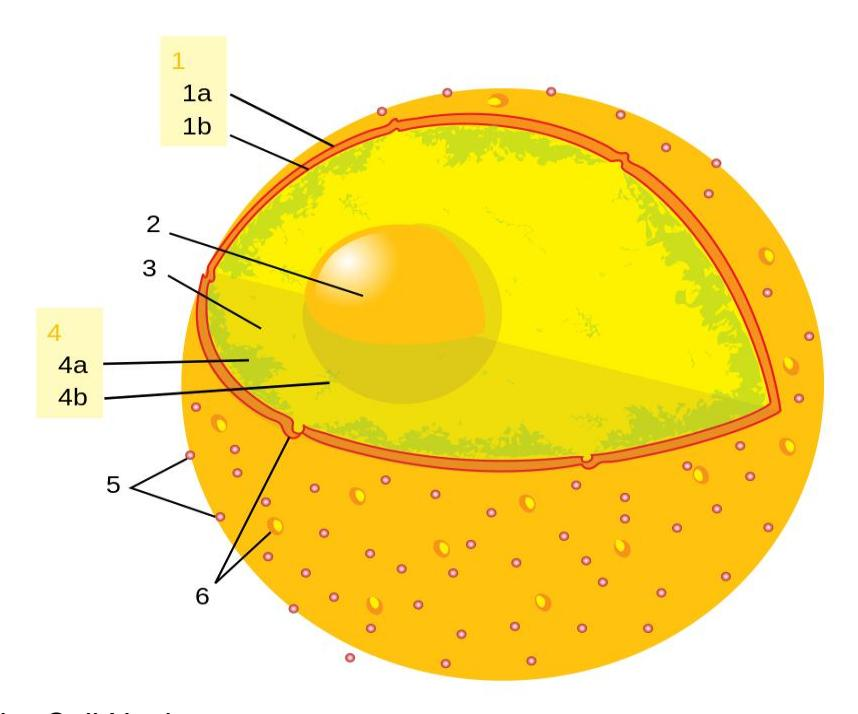

**Figure 3.25** The Cell Nucleus.

**Table 3.4 Answers for Figure 3.25 above**

| Number | Structure |
|--------|-----------|
| 1a     |           |
| 1b     |           |
| 2      |           |
| 3      |           |
| 4a     |           |
| 4b     |           |
| 5      |           |
| 6      |           |

### **Stages of Mitosis**

**Figure 3.26** Label the Stages of the Cell Cycle and Mitosis.

**Table 3.5 Matching Answers for the Stages of Mitosis**

| Letter | Stage of mitosis |
|--------|------------------|
| a      |                  |
| b      |                  |
| c      |                  |
| e      |                  |

## **Additional Learning Resources:**

## **Cells:**

-   **Watch** this video for cell model #1: <https://youtu.be/Pl4vA35FfXA>
-   **Watch** this video for cell model #2: <https://www.youtube.com/watch?v=MKUzCNjNTVw>
-   **Watch** this video to learn about comparisons/contrasts between specialized cells (RBCs, neurons, simple squamous cells, and sperm): <https://www.youtube.com/watch?v=ESIX4P-mnNQ>
-   **Anatomy and Physiology - Bit by Bit. Podcast from Dr. Steven Sullivan of Bucks County Community College. He has others as well (homeostasis; membrane transport, etc.) that are good for A&P students:** [https://podcasts.apple.com/us/podcast/episode-3-cells-and-theplasma-membrane/id1480060049?i=1000453911723](https://podcasts.apple.com/us/podcast/episode-3-cells-and-the-plasma-membrane/id1480060049?i=1000453911723)
-   **Watch** this video<https://youtu.be/UAaTEjYmxso> to learn about the endomembrane system. What is the primary role of the endomembrane system?

## **Mitosis**

-   **Watch** this video for the whitefish blastula slide: <http://youtu.be/42IkhVM7YKA?hd=1>
-   **Watch** this video to learn about mitosis: <https://www.youtube.com/watch?v=C6hn3sA0ip0>
-   **Tutorial:** University of Arizona: [http://www.biology.arizona.edu/cell\\\_bio/tutorials/cell\\\_cycle/main.html](http://www.biology.arizona.edu/cell_bio/tutorials/cell_cycle/main.html)
-   **Tutorial:** Cells alive mitosis animation;<https://www.cellsalive.com/mitosis.htm>

## **Membrane transport:**

-   **Play this interactive cell membrane simulation:** [https://contrib.pbslearningmedia.org/WGBH/conv19/tdc02-intmembraneweb/index.html](https://contrib.pbslearningmedia.org/WGBH/conv19/tdc02-int-membraneweb/index.html)
-   **Cell Membrane Transport - Transport Across A Membrane - How Do Things Move Across A Cell Membrane**: <https://www.youtube.com/watch?v=J5pWH1r3pgU> Published by What's Up Dude, Jan 15, 2018.
-   **Play this interactive osmosis simulation:** <https://nhpbs.pbslearningmedia.org/resource/arct15-sci-osmosis/osmosis/>
-   **Open this website to review the structure of the cell membrane and transport.** Multiple videos created by Wendy Riggs: [https://www.youtube.com/playlist?list=PL5GRRRmaGVqUASeRrzWFlmqoj2x](https://www.youtube.com/playlist?list=PL5GRRRmaGVqUASeRrzWFlmqoj2xPcWoXI) [PcWoXI](https://www.youtube.com/playlist?list=PL5GRRRmaGVqUASeRrzWFlmqoj2xPcWoXI) -,
-   **Play** a simplified video of types of movement across a cell membrane: <https://www.youtube.com/watch?v=Ptmlvtei8hw>

## **Answers**

#### **Crossword puzzle:**

The Cell:

-   **Across: 3** Cell nucleus, **5** Plasma membrane, **6** Lysosome, **7** Peroxisome.
-   **Down: 1** Nucleolus, **2** Centriole, **4** Golgi apparatus, **8** Ribosome.

**Chapter 3: Cells Glossary**

| Terms | Definitions |
|----------------------------|--------------------------------------------|
| active transport | form of transport across the cell membrane that requires input of cellular energy |
| amphipathic | describes a molecule that exhibits a difference in polarity between its two ends, resulting in a difference in water solubility |
| anaphase | third stage of mitosis (and meiosis), during which sister chromatids separate into two new nuclear regions of a dividing cell |
| anticodon | consecutive sequence of three nucleotides on a tRNA molecule that is complementary to a specific codon on an mRNA molecule |
| autolysis | breakdown of cells by their own enzymatic action |
| autophagy | lysosomal breakdown of a cell's own components |
| cell cycle | life cycle of a single cell, from its birth until its division into two new daughter cells |
| cell membrane | membrane surrounding all animal cells, composed of a lipid bilayer interspersed with various molecules; also known as plasma membrane |
| centriole | small, self-replicating organelle that provides the origin for microtubule growth and moves DNA during cell division |
| centromere | region of attachment for two sister chromatids |
| centrosome | cellular structure that organizes microtubules during cell division |
| channel protein | membrane-spanning protein that has an inner pore which allows the passage of one or more substances |
| checkpoint | progress point in the cell cycle during which certain conditions must be met in order for the cell to proceed to a subsequence phase |
| chromatin | substance consisting of DNA and associated proteins |
| chromosome | condensed version of chromatin |
| cilia | small appendage on certain cells formed by microtubules and modified for movement of materials across the cellular surface |
| cleavage furrow | contractile ring that forms around a cell during cytokinesis that pinches the cell into two halves |
| codon | consecutive sequence of three nucleotides on an mRNA molecule that corresponds to a specific amino acid |
| concentration gradient | difference in the concentration of a substance between two regions |
| cytokinesis | final stage in cell division, where the cytoplasm divides to form two separate daughter cells |
| cytoplasm | internal material between the cell membrane and nucleus of a cell, mainly consisting of a water-based fluid called cytosol, within which are all the other organelles and cellular solute and suspended materials |
| cytoskeleton | "skeleton" of a cell; formed by rod-like proteins that support the cell's shape and provide, among other functions, locomotive abilities |
| cytosol | clear, semi-fluid medium of the cytoplasm, made up mostly of water |
| diffusion | movement of a substance from an area of higher concentration to one of lower concentration |
| diploid | condition marked by the presence of a double complement of genetic material (two sets of chromosomes, one set inherited from each of two parents) |
| DNA polymerase | enzyme that functions in adding new nucleotides to a growing strand of DNA during DNA replication |
| DNA replication | process of duplicating a molecule of DNA |
| electrical gradient | difference in the electrical charge (potential) between two regions |
| endocytosis | import of material into the cell by formation of a membrane-bound vesicle |
| endoplasmic reticulum (ER) | cellular organelle that consists of interconnected membrane-bound tubules, which may or may not be associated with ribosomes (rough type or smooth type, respectively) |
| exocytosis | export of a substance out of a cell by formation of a membrane-bound vesicle |
| exon | one of the coding regions of an mRNA molecule that remain after splicing |
| extracellular fluid (ECF) | fluid exterior to cells; includes the interstitial fluid, blood plasma, and fluid found in other reservoirs in the body |
| facilitated diffusion | diffusion of a substance with the aid of a membrane protein |
| flagellum | appendage on certain cells formed by microtubules and modified for movement |
| G0 phase | phase of the cell cycle, usually entered from the G1 phase; characterized by long or permanent periods where the cell does not move forward into the DNA synthesis phase |
| G1 phase | first phase of the cell cycle, after a new cell is born |
| G2 phase | third phase of the cell cycle, after the DNA synthesis phase |
| gene | functional length of DNA that provides the genetic information necessary to build a protein |
| gene expression | active interpretation of the information coded in a gene to produce a functional gene product |
| genome | entire complement of an organism's DNA; found within virtually every cell |
| glycocalyx | coating of sugar molecules that surrounds the cell membrane |
| glycoprotein | protein that has one or more carbohydrates attached |
| Golgi apparatus | cellular organelle formed by a series of flattened, membrane-bound sacs that functions in protein modification, tagging, packaging, and transport |
| helicase | enzyme that functions to separate the two DNA strands of a double helix during DNA replication |
| histone | family of proteins that associate with DNA in the nucleus to form chromatin |
| homologous | describes two copies of the same chromosome (not identical), one inherited from each parent |
| hydrophilic | describes a substance or structure attracted to water |
| hydrophobic | describes a substance or structure repelled by water |
| hypertonic | describes a solution concentration that is higher than a reference concentration |
| hypotonic | describes a solution concentration that is lower than a reference concentration |
| integral protein | membrane-associated protein that spans the entire width of the lipid bilayer |
| intermediate | type of cytoskeletal filament made of keratin, characterized by an |
| filament | intermediate thickness, and playing a role in resisting cellular tension |
| interphase | entire life cycle of a cell, excluding mitosis |
| interstitial fluid (IF) | fluid in the small spaces between cells not contained within blood vessels |
| intracellular fluid (ICF) | fluid in the cytosol of cells |
| intron | non-coding regions of a pre-mRNA transcript that may be removed during splicing |
| isotonic | describes a solution concentration that is the same as a reference concentration |
| kinetochore | region of a centromere where microtubules attach to a pair of sister chromatids |
| ligand | molecule that binds with specificity to a specific receptor molecule |
| lysosome | membrane-bound cellular organelle originating from the Golgi apparatus and containing digestive enzymes |
| messenger RNA (mRNA) | nucleotide molecule that serves as an intermediate in the genetic code between DNA and protein |
| metaphase | second stage of mitosis (and meiosis), characterized by the linear alignment of sister chromatids in the center of the cell |
| metaphase plate | linear alignment of sister chromatids in the center of the cell, which takes place during metaphase |
| microfilament | the thinnest of the cytoskeletal filaments; composed of actin subunits that function in muscle contraction and cellular structural support |
| microtubule | the thickest of the cytoskeletal filaments, composed of tubulin subunits that function in cellular movement and structural support |
| microvilli | tiny, finger-like projections on the surface of certain cells, primarily found in the small intestine, kidney tubules, and respiratory tract, that dramatically increase the cell's surface area for enhanced absorption and secretion of substances like nutrients, ions, and water |
| mitochondrion | one of the cellular organelles bound by a double lipid bilayer that function primarily in the production of cellular energy (ATP) |
| mitosis | division of genetic material, during which the cell nucleus breaks down and two new, fully functional, nuclei are formed |
| mitotic phase | phase of the cell cycle in which a cell undergoes mitosis |
| mitotic spindle | network of microtubules, originating from centrioles, which arranges and pulls apart chromosomes during mitosis |
| mutation | change in the nucleotide sequence in a gene within a cell's DNA |
| nuclear envelope | membrane that surrounds the nucleus, consisting of a double lipid-bilayer |
| nuclear pore | one of the small, protein-lined openings found scattered throughout the nuclear envelope |
| nucleolus | small region of the nucleus that functions in ribosome synthesis |
| nucleosome | unit of chromatin consisting of a DNA strand wrapped around histone proteins |
| nucleus | cell's central organelle; contains the cell's DNA |
| organelle | any of several different types of membrane-enclosed specialized structures in the cell that perform specific functions for the cell |
| osmosis | diffusion of water molecules down their concentration gradient across a selectively permeable membrane |
| passive transport | form of transport across the cell membrane that does not require input of cellular energy |
| peripheral protein | membrane-associated protein that does not span the width of the lipid bilayer, but is attached peripherally to integral proteins, membrane lipids, or other components of the membrane |
| peroxisome | membrane-bound organelle that contains enzymes primarily responsible for detoxifying harmful substances |
| phagocytosis | endocytosis of large particles |
| pinocytosis | endocytosis of fluid |
| polypeptide | chain of amino acids linked by peptide bonds |
| polyribosome | simultaneous translation of a single mRNA transcript by multiple ribosomes |
| promoter | region of DNA that signals transcription to begin at that site within the gene |
| prophase | first stage of mitosis (and meiosis), characterized by breakdown of the nuclear envelope and condensing of the chromatin to form chromosomes |
| proteome | full complement of proteins produced by a cell (determined by the cell's specific gene expression) |
| reactive oxygen species (ROS) | a group of extremely reactive peroxides and oxygen-containing radicals that may contribute to cellular damage |
| receptor protein | molecule that contains a binding site for another specific molecule (called a ligand) |
| receptor-mediated endocytosis | endocytosis of ligands attached to membrane-bound receptors |
| ribosomal RNA (rRNA) | RNA that makes up the subunits of a ribosome |
| ribosome | cellular organelle that functions in protein synthesis |
| rough endoplasmic reticulum | an organelle with ribosomes on its surface that synthesizes proteins and enzymes. |
| RNA polymerase | enzyme that unwinds DNA and then adds new nucleotides to a growing strand of RNA for the transcription phase of protein synthesis |
| S phase | stage of the cell cycle during which DNA replication occurs |
| selective permeability | feature of any barrier that allows certain substances to cross but excludes others |
| sister chromatid | one of a pair of identical chromosomes, formed during DNA replication |
| sodium-potassium pump (also, Na+/K+ pump) | membrane-embedded protein pump that uses ATP to move Na+ out of a cell and K+ into the cell |
| somatic cell | all cells of the body excluding gamete cells |
| smooth endoplasmic reticulum | the region of the endoplasmic reticulum that is not occupied by ribosomes and is involved in the formation of distinct lipids. |
| splicing | the process of modifying a pre-mRNA transcript by removing certain, typically non-coding, regions |
| stem cell | cell that is oligo-, multi-, or pluripotent that has the ability to produce additional stem cells rather than becoming further specialized |
| telophase | final stage of mitosis (and meiosis), preceding cytokinesis, characterized by the formation of two new daughter nuclei |
| transcription | process of producing an mRNA molecule that is complementary to a particular gene of DNA |
| transcription factor | one of the proteins that regulate the transcription of genes |
| transfer RNA (tRNA) | molecules of RNA that serve to bring amino acids to a growing polypeptide strand and properly place them into the sequence |
| translation | process of producing a protein from the nucleotide sequence code of an mRNA transcript |
| triplet | consecutive sequence of three nucleotides on a DNA molecule that, when transcribed into an mRNA codon, corresponds to a particular amino acid |
| vesicle | membrane-bound structure that contains materials within or outside of the cell |
