# **Skeletal System: Appendicular division**

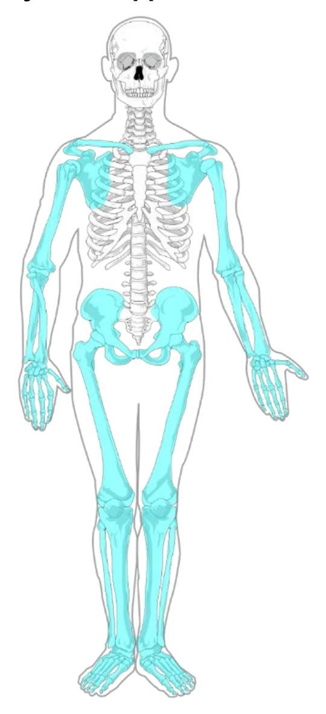

**Figure 8.1** The Appendicular Skeleton

### **Your objectives for this lab are to:**

-   Identify the major divisions of the skeleton, axial vs appendicular, and which bones belong to each group.
-   Provide examples of each type of bone classification by shape
-   Identify disarticulated bones as left or right. Be able to describe how you made this determination.
-   Identify the 24 bones and select bone markings on articulated skeletons (or portions of the skeleton) and disarticulated bones. The list below specifies the appendicular bones you need to know, and the specific bone markings required for each bone.

### **Terms**

## **Pectoral Girdle and Upper Extremities**

-   Clavicle:
    -   Sternal end
    -   Acromial end
-   Scapula,
    -   Spine
    -   Acromion process
    -   Coracoid process
    -   Glenoid fossa/cavity
-   Humerus
    -   Greater tubercle
    -   Lesser tubercle
    -   Head
    -   Coronoid fossa
    -   Olecranon fossa
    -   Trochlea
    -   Capitulum
-   Medial epicondyle
-   Lateral epicondyle
-   Ulna
-   Olecranon process,
-   Trochlear process
-   Coronoid process
-   Radial notch
-   Styloid process (medial)
-   Radius
    -   Styloid process (lateral)
    -   Head
    -   Radial tuberosity
-   Hand
-   Carpals
-   Metacarpals
-   Phalanges

## **Pelvic Girdle and Lower Extremities**

-   Pelvic bones (Os Coxae)
    -   Ilium,
    -   Ischium
    -   Pubis/pubic bone
    -   Iliac crest
    -   Obturator foramen
    -   Greater sciatic arch
    -   Acetabulum
    -   Pubic Arch
    -   Pubic symphysis
    -   Ischial tuberosity
-   Femur
-   Head
-   Neck
-   Greater trochanter
-   Lesser trochanter
-   Medial and lateral condyles
-   Tibia
-   Medial and lateral condyles
-   Tibial tuberosity
-   Anterior crest
-   Medial malleolus
-   Fibula
    -   Head
    -   Lateral malleolus
-   Patella
-   Foot
-   Tarsals
-   talus,
-   calcaneus,
-   cuboid,
-   navicular,
-   cuneiform bones
    -   medial
    -   intermediate
    -   lateral
-   Metatarsals
-   Phalanges

## **Prelab Activities**

## **Prelab Activity 8.1: Definitions**

### Appendicular Skeleton

-   Pectoral girdle \_\_\_\_\_\_\_\_\_\_\_\_\_
-   Clavicle \_\_\_\_\_\_\_\_\_\_\_\_\_
-   Scapula \_\_\_\_\_\_\_\_\_\_\_\_\_
-   Humerus \_\_\_\_\_\_\_\_\_\_\_\_\_
-   Radius \_\_\_\_\_\_\_\_\_\_\_\_\_
-   Ulna \_\_\_\_\_\_\_\_\_\_\_\_\_
-   Carpals \_\_\_\_\_\_\_\_\_\_\_\_\_
-   Metacarpals \_\_\_\_\_\_\_\_\_\_\_\_\_
-   Digits (phalanges) \_\_\_\_\_\_\_\_\_\_\_\_\_

### Pelvic Girdle

1.  Os Coxa \_\_\_\_\_\_\_\_\_\_\_\_\_
2.  Femur \_\_\_\_\_\_\_\_\_\_\_\_\_
3.  Tibia \_\_\_\_\_\_\_\_\_\_\_\_\_
4.  Fibula \_\_\_\_\_\_\_\_\_\_\_\_\_
5.  Tarsals \_\_\_\_\_\_\_\_\_\_\_\_\_
6.  Metatarsals \_\_\_\_\_\_\_\_\_\_\_\_\_
7.  Phalanges (digits) \_\_\_\_\_\_\_\_\_\_\_\_\_

### Other Definitions

1.  Ligaments \_\_\_\_\_\_\_\_\_\_\_\_\_
2.  Tendons \_\_\_\_\_\_\_\_\_\_\_\_\_

## **Prelab Activity 8.2**

Label the appendicular skeletal bones.

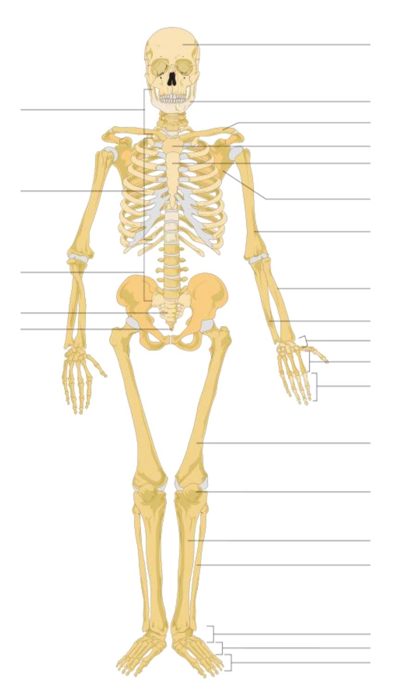

**Figure 8.2** Unlabeled Human Skeleton.

## **Appendicular Skeleton**

## **Lab Activity 8.1**

-   Review the material in your text on the two divisions of the skeletal system.
-   Form your assigned groups and obtain a skeleton and a set of disarticulated bones from the storage area.
-   Identify and label the bones found in the appendicular skeleton.
-   Have your instructor review your work for correctness.
-   Then take a picture of your finished work for later review.

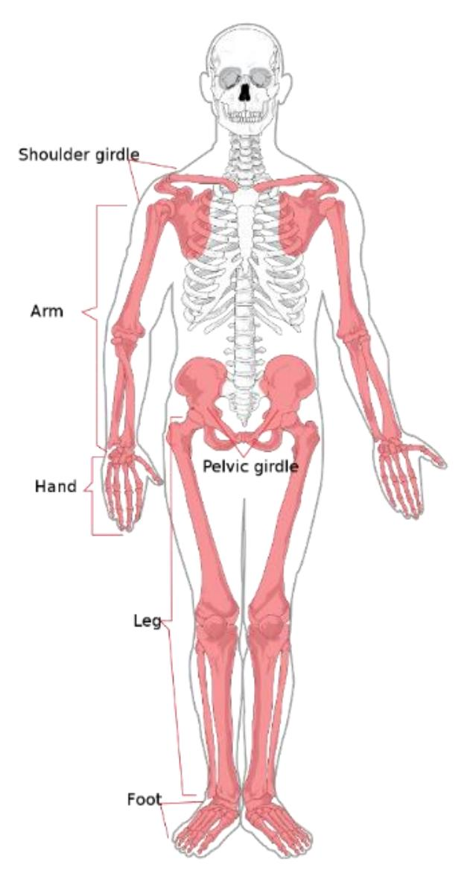

**Figure 8.3** The Appendicular Skeleton.

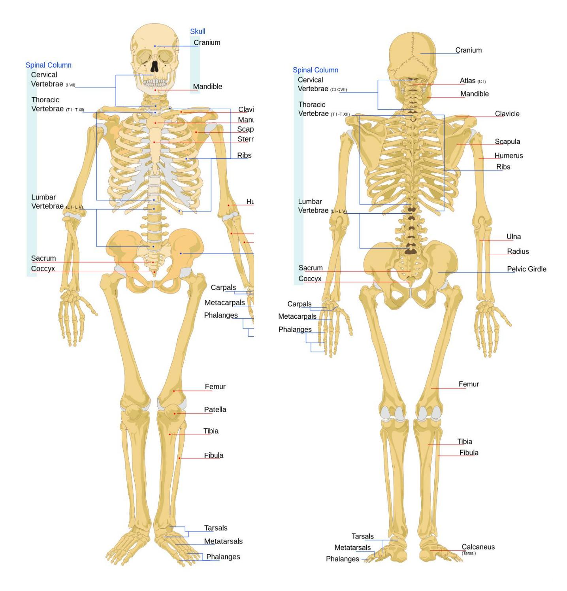

**Figure 8.4** Bones of the Appendicular Skeleton (Anterior View).

**Figure 8.5** Bones of the appendicular skeleton (Posterior View).

## **Pectoral Girdle**

## **Lab Activity 8.2**

-   Review the material in your text on the appendicular division of the skeletal system.
-   Obtain a box of disarticulated bones from the storage area.
-   Identify and label the bones found in the pectoral girdle of the appendicular skeleton.
-   Have your instructor review your work for correctness.
-   Then take a picture of your finished work for later review.
-   Clavicle:
    -   Sternal end
    -   Acromial end
-   Scapula,
    -   Spine
    -   Acromion process
    -   Coracoid process
    -   Glenoid fossa/cavity

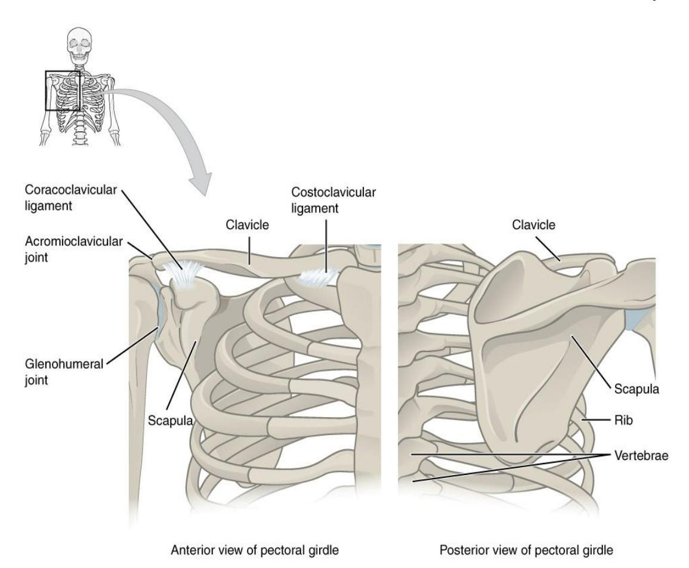

**Figure 8.6** Anterior and Posterior View of the Pectoral Girdle.

## **The Clavicles**

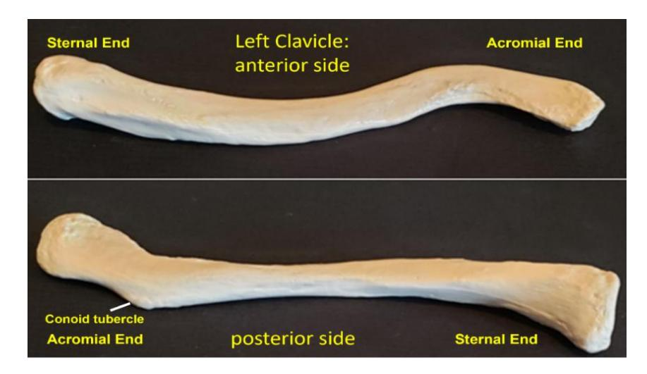

**Figure 8.7** The Clavicle. Top view shows the anterior side of the left clavicle; Bottom view shows the posterior side of the left clavicle.

## **The Scapula**

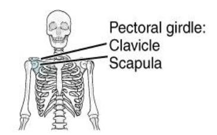

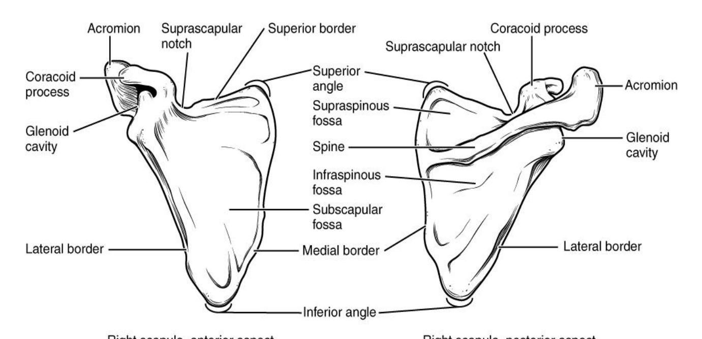

**Figure 8.8** The Scapula (Anterior and Posterior Aspects).

## **Bones of the Upper Limb (Arm)**

## **Lab Activity 8.3**

-   Break up into your assigned groups. Obtain an articulated skeleton and a box of disarticulated bones from the classroom lab supplies.
-   Use the information from your text and the following pages to locate and identify the bones of the upper limb and each bone's markings (surface features).
-   Use some labelling tape to identify each bone's markings and have another group check your work for correctness. Have your instructor review your material as well.
-   Remember to take some pictures of your work to include in your study guide.

### **Terms**

-   Humerus
-   Greater tubercle
-   Lesser tubercle
-   Head
-   Coronoid fossa
-   Olecranon fossa
-   Trochlea
-   Capitulum
-   Medial epicondyle
-   Lateral epicondyle

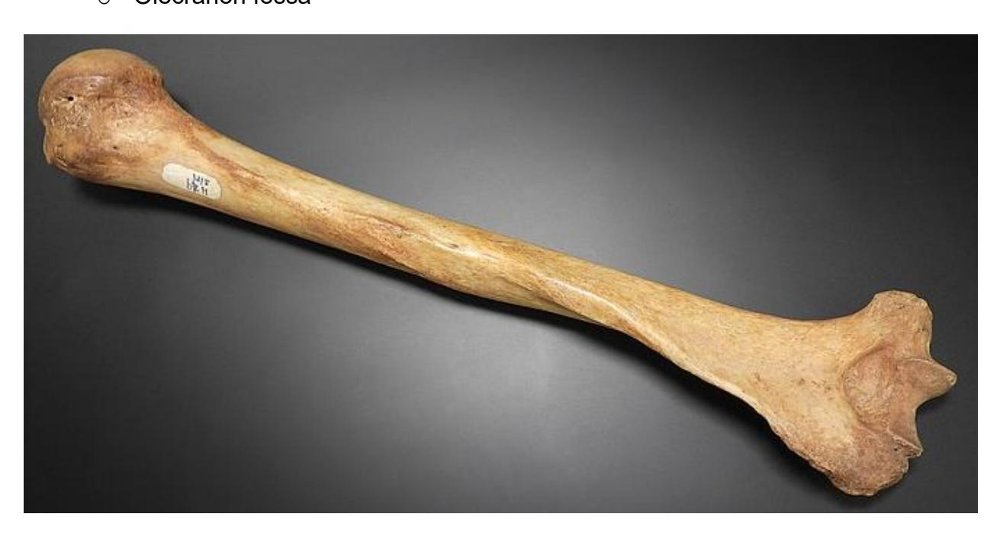

**Figure 8.9** Humerus (Posterior View).

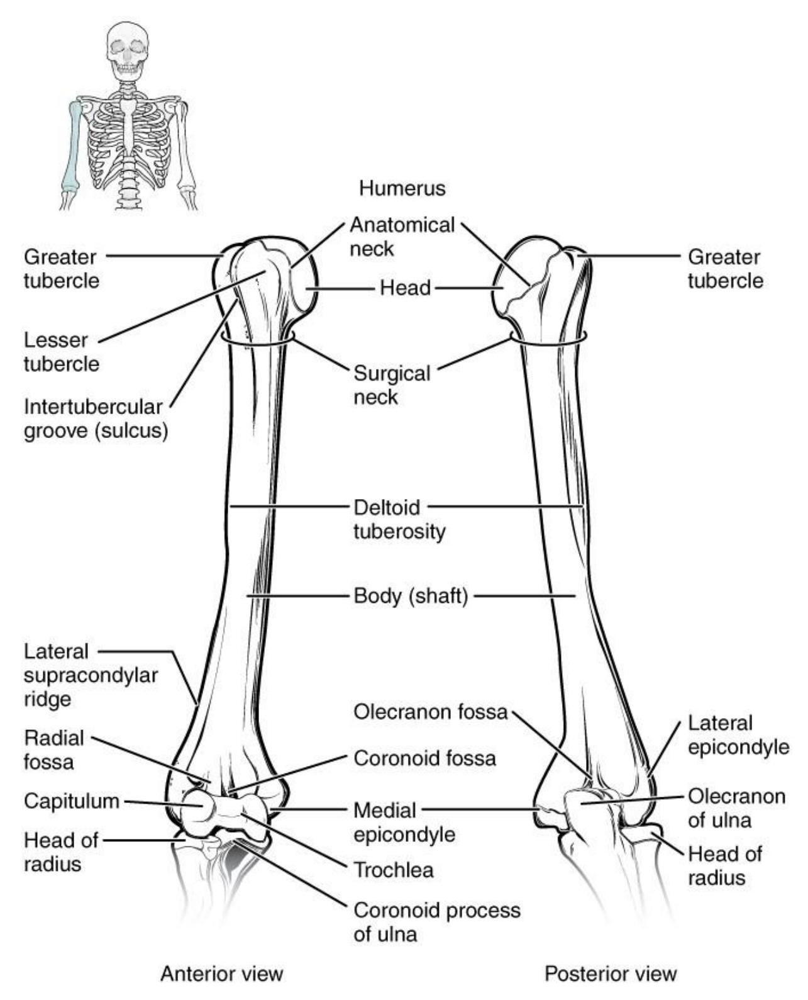

Figure 8.10 The Humerus and Elbow.

### **Terms**

-   Ulnar
    -   Olecranon process,
    -   Trochlear process
    -   Coronoid process
    -   Radial notch
    -   Styloid process (medial)
-   Radius
-   Styloid process (lateral)
-   Head
-   Radial tuberosity

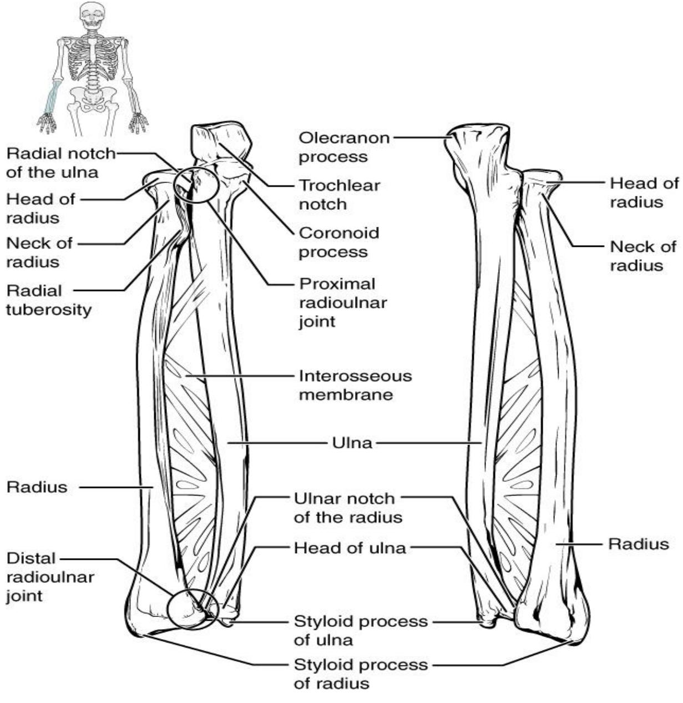

**Figure 8.11** Ulna and Radius.

-   Hand
    -   Carpals Metacarpals Phalanges

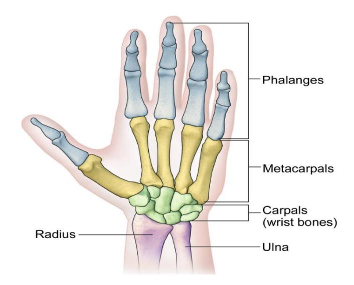

**Figure 8.12a** Anatomy of the Hand (Anterior View).

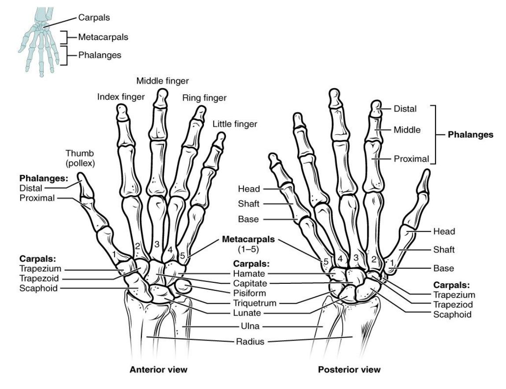

**Figure 8.12b** Anatomy of the Hand.

## **The Lower limb (leg)**

## **Pelvic Girdle**

### **Lab Activity 8.5**

-   Break up into your assigned groups. Obtain an articulated skeleton and a box of bones from the classroom lab supplies.

-   Use the information from your text and the following pages to locate and identify the bones of the pelvic girdle and each bone's markings (surface features).

-   Use some labelling tape to identify each bone's markings and have another group check your work for correctness. Have your instructor review your material as well.

-   Remember to take some pictures of your work to include in your study guide.

-   Pelvic girdle Pelvic bones (Os Coxae)

    -   Ilium,
    -   Ischium
    -   Pubis/pubic bone

-   Features

    -   Iliac crest
    -   Obturator foramen
    -   Greater sciatic arch
    -   Acetabulum
    -   Pubic Arch
    -   Pubic symphysis
    -   Ischial tuberosity

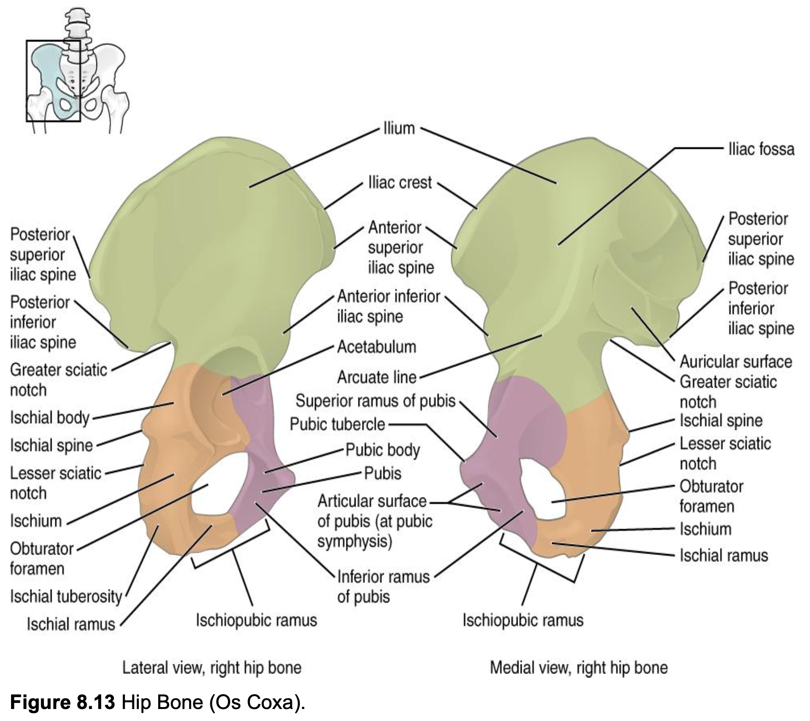

Figure 8.13 Hip Bone (Os Coxa).

-   Os Coxa
    -   Ilium
    -   Iliac fossa
    -   Iliac crest
    -   Posterior superior iliac spine Anterior superior iliac spine
    -   Posterior inferior iliac spine
    -   Anterior inferior iliac spine
    -   Acetabulum
    -   Auricular surface
    -   Greater sciatic notch
    -   Lesser sciatic notch
    -   Arcuate line
    -   Superior ramus of pubis
    -   Inferior ramus of pubis
    -   Ischial body
    -   Ischial spine
    -   Pubic tubercle
    -   Pubic body
    -   Ischial spine
    -   Pubis
    -   Articular surface of pubis (at pubic Ischium symphysis)
    -   Ischium
    -   Ischial ramus
    -   Ischiopubic ramus
    -   Obturator foramen
    -   Ischial tuberosity

## **Pelvis**

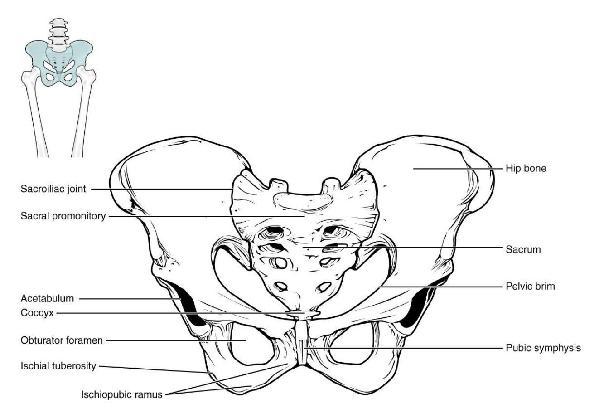

Figure 8.14 The Pelvis.

### **Pelvises: Female and Male**

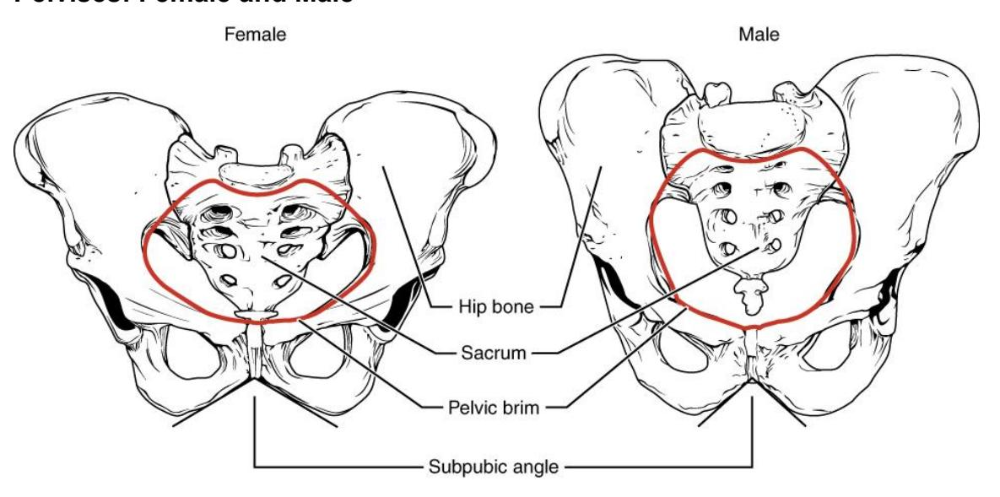

**Figure 8.15** Female and Male Pelvic Girdles.

Lab activity 8.4 is missing in the source; I decided to keep the original activity numbers.

## **The Lower Limb (leg)**

## **Lab Activity 8.6**

-   Break up into your assigned groups. Obtain an articulated skeleton and a box of bones from the classroom lab supplies.
-   Use the information from your text and the following pages to locate and identify the bones of the lower limb (leg) and each bone's markings (surface features).
-   Use some labelling tape to identify each bone's markings and have another group check your work for correctness. Have your instructor review your material as well.
-   Remember to take some pictures of your work to include in your study guide.

### **Terms**

-   Femur
    -   Head
    -   Neck
    -   Greater trochanter
    -   Lesser trochanter
    -   Medial and lateral condyles

• Patella

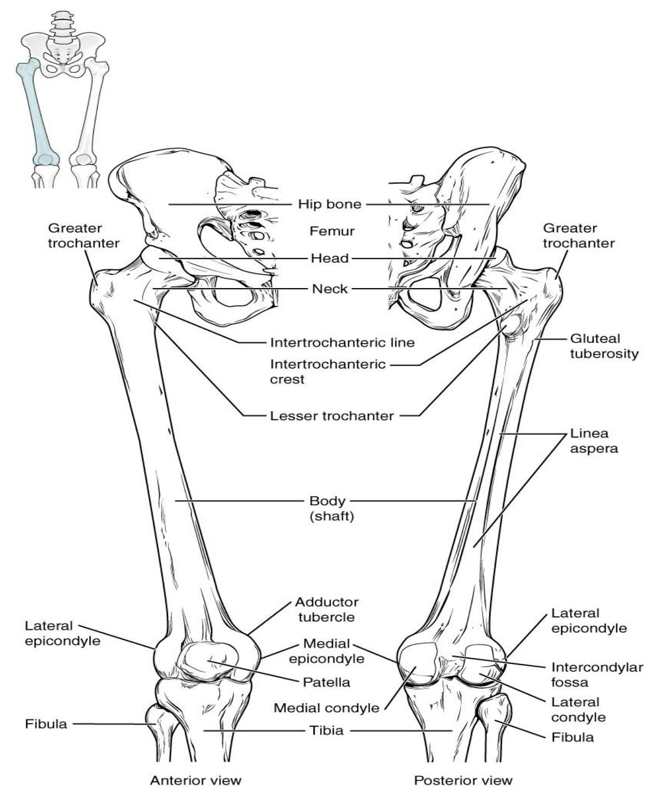

Figure 8.16 Femur and Patella.

### **Terms**

-   Tibia
-   Medial and lateral condyles
-   Tibial tuberosity
-   Anterior crest
-   Medial malleolus
-   Fibula
-   Head
-   Lateral malleolus

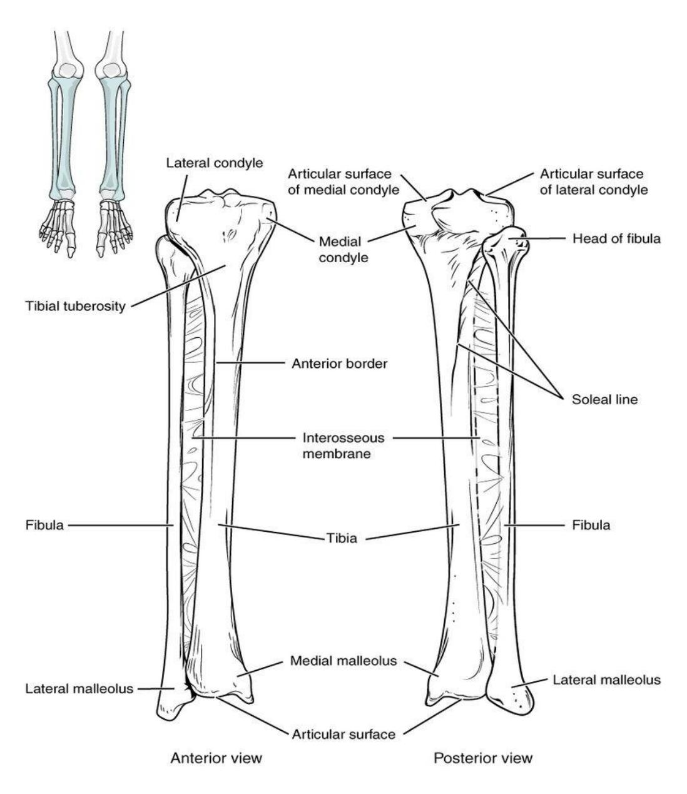

**Figure 8.17** Tibia and Fibula.

## **Foot**

-   Tarsals
    -   talus,
    -   calcaneus,
    -   cuboid,
    -   navicular,
    -   cuneiform bones
        -   medial
        -   intermediate
        -   lateral
-   Metatarsals
-   Phalanges

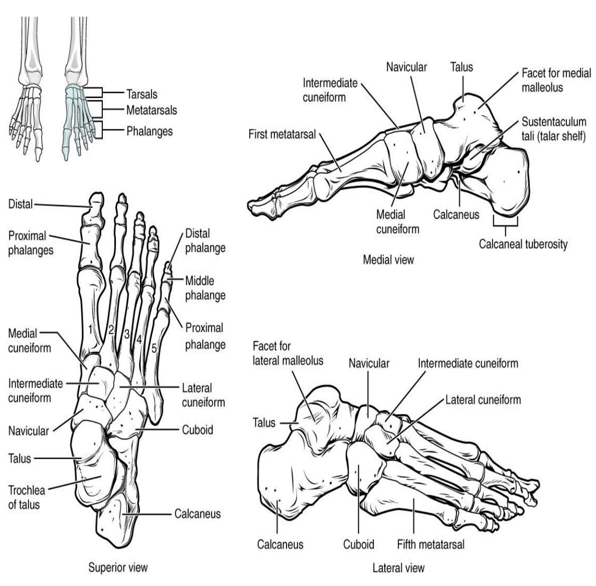

**Figure 8.18** Bones of the Foot.

## **Additional Learning Resources**

**Watch** these videos to learn about bones and markings of the appendicular skeleton:

-   Bones of the upper extremity: <https://www.youtube.com/watch?v=7v2pwRwyWqU>
-   Bones of the lower extremity: <https://www.youtube.com/watch?v=5ohJGtD3vRY>
-   Bones of the pelvis:<https://www.youtube.com/watch?v=W8i7jlFa7qc>

**Watch** these videos to help you identify left vs right for appendicular bones:

-   <https://www.youtube.com/watch?v=0KPR9NSuGOA&feature=youtu.be> **(most appendicular bones)**
-   <https://www.youtube.com/watch?v=kKGeEcrTMg8> **(ilium, ischium, pubis)**
-   <https://www.youtube.com/watch?v=dVzlkGmm4Fg> **(scapula)**

**More Practice** identifying bones and markings with these websites:

-   <https://webanatomy.umn.edu/various-bones>
-   <https://webanatomy.umn.edu/skulls-skeletons>
-   <https://pierceanatomy.weebly.com/>
-   <https://www.getbodysmart.com/skeletal-system>
-   <http://www.personal.psu.edu/faculty/j/a/jas43/skel/skeletal.htm>
-   this site [(http://openstax.org/l/handbone)](http://openstax.org/l/handbone) to explore the bones and joints of the hand.
-   Watch this video [(http://openstax.org/l/3Dpelvis)](http://openstax.org/l/3Dpelvis) for a 3-D view of the pelvis and its associated ligaments. What is the large opening in the bony pelvis, located between the ischium and pubic regions, and what two parts of the pubis contribute to the formation of this opening?
-   Use this tutorial [(http://openstax.org/l/footbones)](http://openstax.org/l/footbones) to review the bones of the foot. Which tarsal bones are in the proximal, intermediate, and distal groups?
-   Visit this site [(http://openstax.org/l/kneesurgery)](http://openstax.org/l/kneesurgery) to watch a virtual knee replacement surgery. The prosthetic knee components must be properly aligned to function properly. How is this alignment ensured?

## **Testing your understanding**

**Post Lab Activity 8.1: Labeling**

**Label all of the following figures of the bones.**

Label the appendicular skeletal bones.

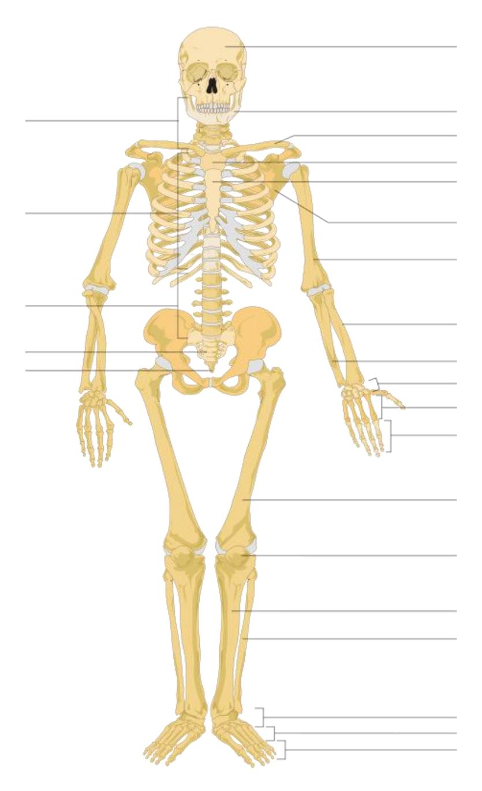

**Figure 8.19** The Human Skeleton.

Identify and label seven (7) features of this bone (anterior view)

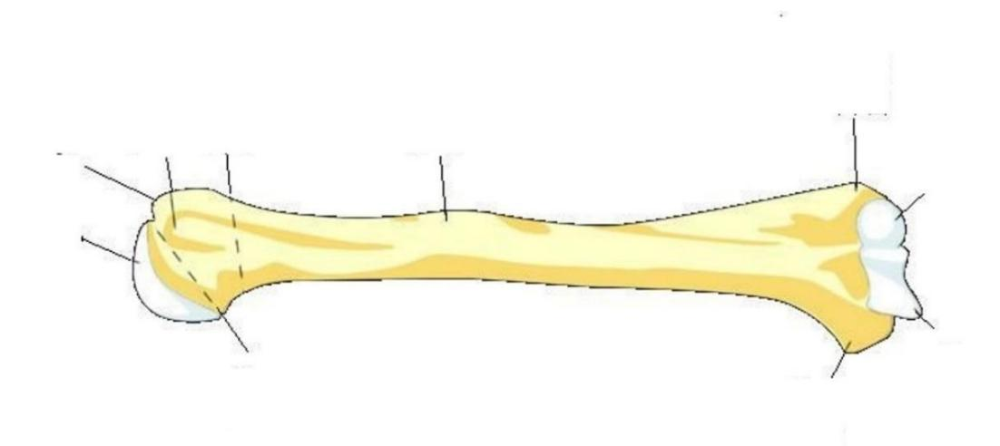

**Figure 8.20** Anterior View of the Humerus.

Identify and label all of the bones and their features of this structure.

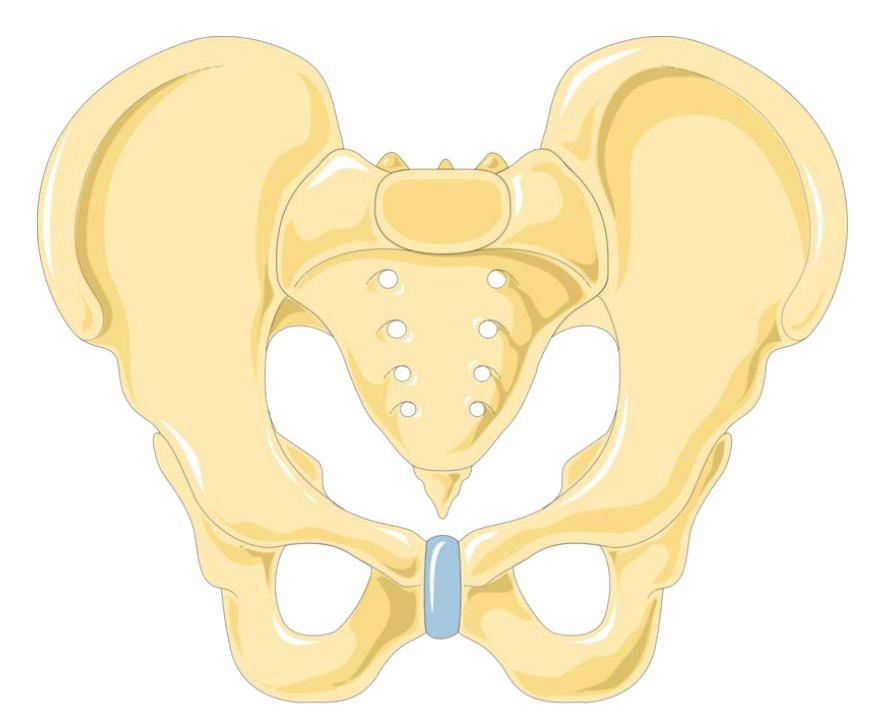

**Figure 8.21** The Pelvic Girdle **(Anterior View).**

## **Post Lab Activity 8.2: Crossword Puzzles**

Complete the crossword puzzle.

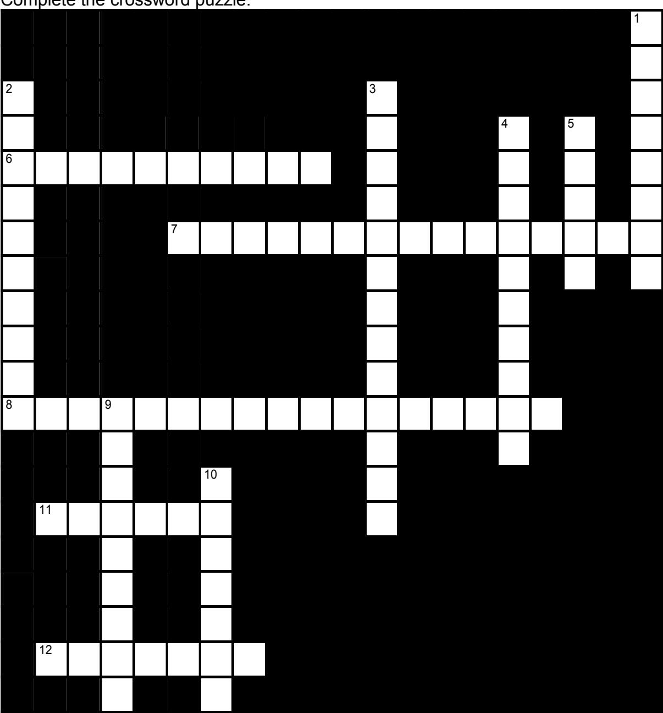

**Figure 18.22** Appendicular skeleton.

### **Across**

-   6 The \_\_\_\_\_, formed by all three bones that make up the coxal bone, articulates with the femur. (10)
-   7 The lateral end of the clavicle articulates with the \_\_\_\_\_ of the \_\_\_\_\_. (8,7)
-   8 The shoulder girdle consists of the \_\_\_\_\_ and the \_\_\_\_\_. (8,9)
-   11 The \_\_\_\_\_ is formed by the two hip bones, the sacrum, and the coccyx. (6)
-   12 The medial end of the clavicle articulates with the \_\_\_\_\_. (7)

### **Down**

-   1 The upper limbs are attached to the trunk by the \_\_\_\_\_ girdle (8)
-   2 The superior surface of the \_\_\_\_\_ of the \_\_\_\_\_ articulates with the capitulum of the humerus. (4,6)
-   3 The \_\_\_\_\_ of the scapula articulates with the humerus. (7,6)
-   4 The hip bones are called the \_\_\_\_\_. (5,5)
-   5 Three bones fuse to form each coxal bone. The superior portion of the coxal bone is formed by the \_\_\_\_\_. (5)
-   9 The heads of the metacarpals articulate with the \_\_\_\_\_. (9)
-   10 The \_\_\_\_\_ forms the posteroinferior portion of the coxal bone. (7)

## **Answer keys**

## **Appendicular Skeleton**

**Across: 6** Acetabulum, **7** Acromion scapula, **8** Scapulae clavicles, **11** Pelvis, **12**

Sternum.

**Down: 1** Pectoral, **2** Head radius, **3** Glenoid cavity, **4** Coxal bones, **5** Ilium, **9** Phalanges, **10** Ischium.

**Chapter 8: Skeletal System: Appendicular Division Glossary**

| Terms | Definitions |
|----------------|--------------------------------------------------------|
| acetabulum | large, cup-shaped cavity located on the lateral side of the hip bone; formed by the junction of the ilium, pubis, and ischium portions of the hip bone |
| acromial end of the clavicle | lateral end of the clavicle that articulates with the acromion of the scapula |
| acromial process | acromion of the scapula |
| acromioclavicular joint | articulation between the acromion of the scapula and the acromial end of the clavicle |
| acromion | flattened bony process that extends laterally from the scapular spine to form the bony tip of the shoulder |
| anatomical neck | line on the humerus located around the outside margin of the humeral head |
| ankle joint | joint that separates the leg and foot portions of the lower limb; formed by the articulations between the talus bone of the foot inferiorly, and the distal end of the tibia, medial malleolus of the tibia, and lateral malleolus of the fibula superiorly |
| anterior border of the tibia | narrow, anterior margin of the tibia that extends inferiorly from the tibial tuberosity |
| anterior inferior iliac spine | small, bony projection located on the anterior margin of the ilium, below the anterior superior iliac spine |
| anterior superior iliac spine | rounded, anterior end of the iliac crest |
| arm | region of the upper limb located between the shoulder and elbow joints; contains the humerus bone |
| calcaneus heel bone | calcaneus heel bone: posterior, inferior tarsal bone that forms the heel of the foot |
| capitate | from the lateral side, the third of the four distal carpal bones; articulates with the scaphoid and lunate proximally, the trapezoid laterally, the hamate medially, and primarily with the third metacarpal distally |
| capitulum | knob-like bony structure located anteriorly on the lateral, distal end of the humerus |
| carpal bone | one of the eight small bones that form the wrist and base of the hand; these are grouped as a proximal row consisting of (from lateral to medial) the scaphoid, lunate, triquetrum, and pisiform bones, and a distal row containing (from lateral to medial) the trapezium, trapezoid, capitate, and hamate bones |
| carpal tunnel | passageway between the anterior forearm and hand formed by the carpal bones and flexor retinaculum |
| clavicle | collarbone: elongated bone that articulates with the manubrium of the sternum medially and the acromion of the scapula laterally |
| coracoid process | short, hook-like process that projects anteriorly and laterally from the superior margin of the scapula |
| coronoid fossa | depression on the anterior surface of the humerus above the trochlea; this space receives the coronoid process of the ulna when the elbow is maximally flexed |
| coronoid process of the ulna | projecting bony lip located on the anterior, proximal ulna; forms the inferior margin of the trochlear notch |
| coxal bone | hip bone |
| cuboid tarsal | bone that articulates posteriorly with the calcaneus bone, medially with the lateral cuneiform bone, and anteriorly with the fourth and fifth metatarsal bones |
| deltoid tuberosity | roughened, V-shaped region located laterally on the mid-shaft of the humerus |
| elbow joint | joint located between the upper arm and forearm regions of the upper limb; formed by the articulations between the trochlea of the humerus and the trochlear notch of the ulna, and the capitulum of the humerus and the head of the radius |
| femur (thigh bone) | the single bone of the thigh |
| fibula | thin, non-weight-bearing bone found on the lateral side of the leg |
| fibular notch | wide groove on the lateral side of the distal tibia for articulation with the fibula at the distal tibiofibular joint |
| foot | portion of the lower limb located distal to the ankle joint |
| forearm | region of the upper limb located between the elbow and wrist joints; contains the radius and ulna bones |
| fossa (plural = fossae) | shallow depression on the surface of a bone |
| glenohumeral joint | shoulder joint; formed by the articulation between the glenoid cavity of the scapula and the head of the humerus |
| glenoid cavity (also, glenoid fossa) | shallow depression located on the lateral scapula, between the superior and lateral borders |
| gluteal tuberosity | roughened area on the posterior side of the proximal femur, extending inferiorly from the base of the greater trochanter |
| greater pelvis (also, greater pelvic cavity or false pelvis) | broad space above the pelvic brim defined laterally by the fan-like portion of the upper ilium |
| greater sciatic foramen | pelvic opening formed by the greater sciatic notch of the hip bone, the sacrum, and the sacrospinous ligament |
| greater sciatic notch | large, U-shaped indentation located on the posterior margin of the ilium, superior to the ischial spine |
| greater trochanter | large, bony expansion of the femur that projects superiorly from the base of the femoral neck |
| greater tubercle | enlarged prominence located on the lateral side of the proximal humerus |
| hallux | big toe; digit 1 of the foot |
| hamate | from the lateral side, the fourth of the four distal carpal bones; articulates with the lunate and triquetrum proximally, the fourth and fifth metacarpals distally, and the capitate laterally |
| hand | region of the upper limb distal to the wrist joint |
| head of the femur | rounded, proximal end of the femur that articulates with the acetabulum of the hip bone to form the hip joint |
| head of the fibula | small, knob-like, proximal end of the fibula; articulates with the inferior aspect of the lateral condyle of the tibia |
| head of the humerus | smooth, rounded region on the medial side of the proximal humerus; articulates with the glenoid fossa of the scapula to form the glenohumeral (shoulder) joint |
| head of the radius | disc-shaped structure that forms the proximal end of the radius; articulates with the capitulum of the humerus as part of the elbow joint, and with the radial notch of the ulna as part of the proximal radioulnar joint |
| head of the ulna | small, rounded distal end of the ulna; articulates with the ulnar notch of the distal radius, forming the distal radioulnar joint |
| coxal bone; | hip bone, single bone that forms the pelvic girdle; consists of three areas, the ilium, ischium, and pubis |
| hip joint | joint located at the proximal end of the lower limb; formed by the articulation between the acetabulum of the hip bone and the head of the femur |
| humerus | single bone of the upper arm |
| iliac crest | curved, superior margin of the ilium |
| iliac fossa | shallow depression found on the anterior and medial surfaces of the upper ilium |
| ilium | superior portion of the hip bone |
| infraspinous fossa | broad depression located on the posterior scapula, inferior to the spine |
| intercondylar fossa | deep depression on the posterior side of the distal femur that separates the medial and lateral condyles |
| intermediate cuneiform | middle of the three cuneiform tarsal bones; articulates posteriorly with the navicular bone, medially with the medial cuneiform bone, laterally with the lateral cuneiform bone, and anteriorly with the second metatarsal bone |
| intertrochanteric crest | short, prominent ridge running between the greater and lesser trochanters on the posterior side of the proximal femur |
| intertrochanteric line | small ridge running between the greater and lesser trochanters on the anterior side of the proximal femur |
| ischial ramus | bony extension projecting anteriorly and superiorly from the ischial tuberosity; joins with the inferior pubic ramus to form the ischiopubic ramus |
| ischial spine | pointed, bony projection from the posterior margin of the ischium that separates the greater sciatic notch and lesser sciatic notch |
| ischial tuberosity | large, roughened protuberance that forms the posteroinferior portion of the hip bone; weight-bearing region of the pelvis when sitting |
| ischium | posteroinferior portion of the hip bone |
| knee joint | joint that separates the thigh and leg portions of the lower limb; formed by the articulations between the medial and lateral condyles of the femur, and the medial and lateral condyles of the tibia |
| lateral border of the scapula | diagonally oriented lateral margin of the scapula |
| Lateral condyle | one of the two projections on the lower extremity of the femur. |
| lateral cuneiform | most lateral of the three cuneiform tarsal bones; articulates posteriorly with the navicular bone, medially with the intermediate cuneiform bone, laterally with the cuboid bone, and anteriorly with the third metatarsal bone |
| lateral malleolus | expanded distal end of the fibula |
| leg | portion of the lower limb located between the knee and ankle joints |
| lesser pelvis (also, lesser pelvic cavity or true pelvis) | narrow space located within the pelvis, defined superiorly by the pelvic brim (pelvic inlet) and inferiorly by the pelvic outlet |
| lesser sciatic foramen | pelvic opening formed by the lesser sciatic notch of the hip bone, the sacrospinous ligament, and the sacrotuberous ligament |
| lesser sciatic notch | shallow indentation along the posterior margin of the ischium, inferior to the ischial spine |
| lesser trochanter | small, bony projection on the medial side of the proximal femur, at the base of the femoral neck |
| lesser tubercle | small, bony prominence located on anterior side of the proximal humerus |
| lunate | from the lateral side, the second of the four proximal carpal bones; articulates with the radius proximally, the capitate and hamate distally, the scaphoid laterally, and the triquetrum medially |
| Medial condyle |  |
| medial cuneiform | most medial of the three cuneiform tarsal bones; articulates posteriorly with the navicular bone, laterally with the intermediate cuneiform bone, and anteriorly with the first and second metatarsal bones |
| medial malleolus bony | expansion located on the medial side of the distal tibia |
| metacarpal | one of the five long bones that form the palm of the hand; numbered 1-5, starting on the lateral (thumb) side of the hand |
| metatarsal bone | one of the five elongated bones that forms the anterior half of the foot; numbered 1-5, starting on the medial side of the foot |
| navicular tarsal | bone that articulates posteriorly with the talus bone, laterally with the cuboid bone, and anteriorly with the medial, intermediate, and lateral cuneiform bones |
| neck of the femur | narrowed region located inferior to the head of the femur |
| neck of the radius | narrowed region immediately distal to the head of the radius |
| obturator foramen | large opening located in the anterior hip bone, between the pubis and ischium regions |
| olecranon fossa | large depression located on the posterior side of the distal humerus; this space receives the olecranon process of the ulna when the elbow is fully extended |
| olecranon process | expanded posterior and superior portions of the proximal ulna; forms the bony tip of the elbow |
| os coxa | also known as the hip bone, is a large, flat bone that forms part of the pelvis. |
| patella | kneecap; the largest sesamoid bone of the body; articulates with the distal femur |
| patellar surface | smooth groove located on the anterior side of the distal femur, between the medial and lateral condyles; site of articulation for the patella |
| pectoral girdle | shoulder girdle; the set of bones, consisting of the scapula and clavicle, which attaches each upper limb to the axial skeleton |
| pelvic brim | pelvic inlet; the dividing line between the greater and lesser pelvic regions; formed by the superior margin of the pubic symphysis, the pectineal lines of each pubis, the arcuate lines of each ilium, and the sacral promontory |
| pelvic girdle | hip girdle: consists of a single hip bone, which attaches a lower limb to the sacrum of the axial skeleton |
| pelvic inlet | pelvic brim |
| pelvic outlet | inferior opening of the lesser pelvis; formed by the inferior margin of the pubic symphysis, right and left ischiopubic rami and sacrotuberous ligaments, and the tip of the coccyx |
| pelvis | ring of bone consisting of the right and left hipbones, the sacrum, and the coccyx |
| phalanx bone of the foot (plural = phalanges) | one of the 14 bones that form the toes; these include the proximal and distal phalanges of the big toe, and the proximal, middle, and distal phalanx bones of toes two through five |
| phalanx bone of the hand (plural = phalanges) | one of the 14 bones that form the thumb and fingers; these include the proximal and distal phalanges of the thumb, and the proximal, middle, and distal phalanx bones of the fingers two through five |
| pisiform | from the lateral side, the fourth of the four proximal carpal bones; articulates with the anterior surface of the triquetrum |
| pollex | (also, thumb) digit 1 of the hand |
| pubic arch | bony structure formed by the pubic symphysis, and the bodies and inferior pubic rami of the right and left pubic bones |
| pubic body | enlarged, medial portion of the pubic region of the hip bone |
| pubic symphysis | joint formed by the articulation between the pubic bodies of the right and left hip bones |
| pubic tubercle | small bump located on the superior aspect of the pubic body |
| pubis | anterior portion of the hip bone |
| radial fossa | small depression located on the anterior humerus above the capitulum; this space receives the head of the radius when the elbow is maximally flexed |
| radial notch of the ulna | small, smooth area on the lateral side of the proximal ulna; articulates with the head of the radius as part of the proximal radioulnar joint |
| radial tuberosity | oval-shaped, roughened protuberance located on the medial side of the proximal radius |
| radius | bone located on the lateral side of the forearm |
| sacroiliac joint | joint formed by the articulation between the auricular surfaces of the sacrum and ilium |
| scaphoid from the lateral side, | the first of the four proximal carpal bones; articulates with the radius proximally, the trapezoid, trapezium, and capitate distally, and the lunate medially |
| scapula | shoulder blade bone located on the posterior side of the shoulder |
| shaft of the femur | cylindrically shaped region that forms the central portion of the femur |
| shaft of the fibula | elongated, slender portion located between the expanded ends of the fibula |
| shaft of the humerus narrow, | elongated, central region of the humerus |
| shaft of the radius narrow, | elongated, central region of the radius |
| shaft of the tibia | triangular-shaped, central portion of the tibia |
| shaft of the ulna | elongated, central region of the ulna |
| spine of the scapula | prominent ridge passing mediolaterally across the upper portion of the posterior scapular surface |
| sternal end of the clavicle | medial end of the clavicle that articulates with the manubrium of the sternum |
| sternoclavicular joint | articulation between the manubrium of the sternum and the sternal end of the clavicle; forms the only bony attachment between the pectoral girdle of the upper limb and the axial skeleton |
| styloid process of the radius | pointed projection located on the lateral end of the distal radius |
| styloid process of the ulna | short, bony projection located on the medial end of the distal ulna |
| subscapular fossa | broad depression located on the anterior (deep) surface of the scapula |
| superior angle of the scapula | corner of the scapula between the superior and medial borders of the scapula |
| superior border of the scapula | superior margin of the scapula |
| suprascapular notch | small notch located along the superior border of the scapula, medial to the coracoid process |
| supraspinous fossa | narrow depression located on the posterior scapula, superior to the spine |
| surgical neck | region of the humerus where the expanded, proximal end joins with the narrower shaft |
| talus | tarsal bone that articulates superiorly with the tibia and fibula at the ankle joint; also articulates inferiorly with the calcaneus bone and anteriorly with the navicular bone |
| tarsal bone | one of the seven bones that make up the |
| posterior foot | includes the calcaneus, talus, navicular, cuboid, medial cuneiform, intermediate cuneiform, and lateral cuneiform bones |
| thigh | portion of the lower limb located between the hip and knee joints |
| tibia | shin bone; the large, weight-bearing bone located on the medial side of the leg |
| tibial tuberosity | elevated area on the anterior surface of the proximal tibia |
| trapezium | from the lateral side, the first of the four distal carpal bones; articulates with the scaphoid proximally, the first and second metacarpals distally, and the trapezoid medially |
| trapezoid | from the lateral side, the second of the four distal carpal bones; articulates with the scaphoid proximally, the second metacarpal distally, the trapezium laterally, and the capitate medially |
| triquetrum | from the lateral side, the third of the four proximal carpal bones; articulates with the lunate laterally, the hamate distally, and has a facet for the pisiform |
| trochlea | pulley-shaped region located medially at the distal end of the humerus; articulates at the elbow with the trochlear notch of the ulna |
| trochlear notch | large, C-shaped depression located on the anterior side of the proximal ulna; articulates at the elbow with the trochlea of the humerus |
| ulna | bone located on the medial side of the forearm |
| ulnar notch of the radius | shallow, smooth area located on the medial side of the distal radius; articulates with the head of the ulna at the distal radioulnar joint |
| ulnar tuberosity | roughened area located on the anterior, proximal ulna inferior to the coronoid process |
