# **Muscular System; Gross Anatomy**

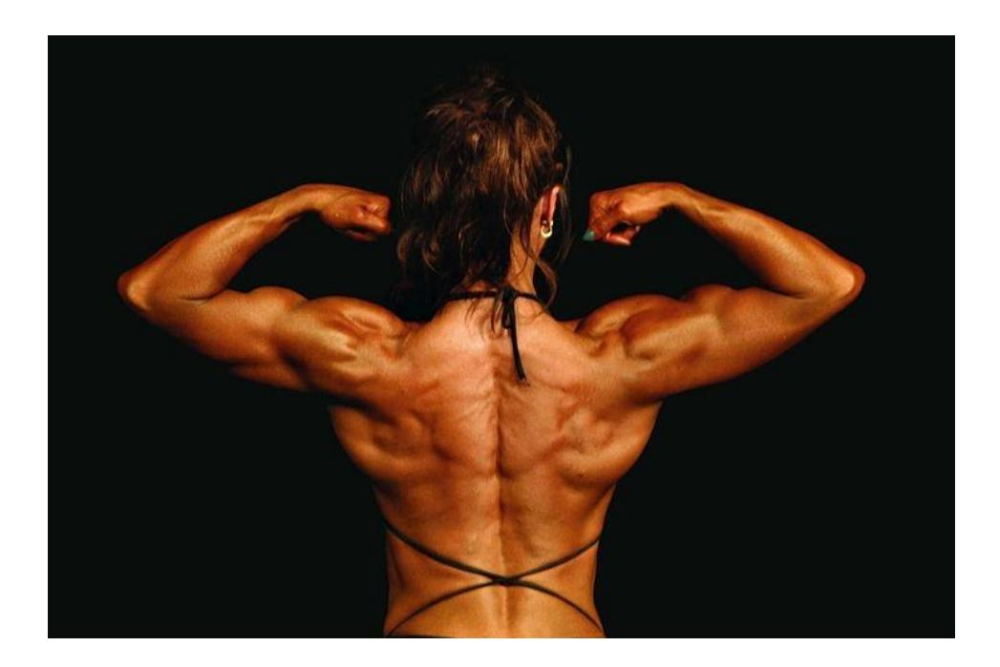

**Figure 11.1 Bodybuilding.**

## **By the end of the class, you will be able to:**

-   Identify the designated muscles of the head, neck upper torso and trunk on a model, a figure, or a diagram.
-   For selected muscles identify the points of attachment (i.e., their origin and insertion) and their actions.

### **Gross Anatomy of the Muscular System**

### **Head and Neck**

-   Frontalis

-   Occipitalis

-   Epicranial aponeurosis

-   Orbicularis oculi

-   Orbicularis oris

-   Zygomaticus major

-   Temporalis

-   Masseter

-   Buccinator

-   Sternocleidomastoid

## **Thorax and Abdomen (Anterior and Posterior)**

-   Pectoralis major

-   Pectoralis minor

-   Serratus anterior

-   Rectus abdominis

-   Rectus sheath

-   Linea alba

-   External oblique

-   Internal oblique

-   Transversus abdominis

-   Trapezius

-   Latissimus dorsi

-   Erector spinae collective of spinalis, longissimus and iliocostalis

### **Shoulder and Upper Limb**

-   Deltoid Rotator cuff

-   Supraspinatus

-   Infraspinatus

-   Teres minor

-   Subscapularis

-   Biceps brachii

-   Brachialis

-   Brachioradialis

-   Triceps brachii

-   Flexors anterior/from medial epicondyle

-   Extensors posterior/from lateral epicondyle

## **Hip and Lower Limb**

-   Gluteus maximus
-   Gluteus medius/minimus
-   Iliopsoas
    -   Iliacus
    -   Psoas major
-   Sartorius
-   Adductor group of thigh
-   Gracilis
-   Quadriceps femoris
    -   Rectus femoris
-   Vastus lateralis
-   Vastus intermedius
-   Vastus medialis
-   Hamstrings
    -   Biceps femoris
    -   Semitendinosus
    -   Semimembranosus
-   Gastrocnemius
-   Soleus
-   Tibialis anterior

## **Origins, Insertions, and Actions of:**

-   Sternocleidomas toid

-   Temporalis

-   Masseter

-   Biceps brachii

-   Brachialis

-   Triceps brachii

-   Sartorius

-   Rectus femoris

-   Hamstrings (generally)

-   Gastrocnemius

-   Soleus

-   Tibialis anterior

## **Prelab Activities**

## **Prelab Activity 11.1**

### **Definitions**

### **Terms**

-   Muscle Origin \_\_\_\_\_\_\_\_\_\_\_\_\_\_\_\_\_\_\_\_\_\_\_\_\_\_\_\_\_\_\_\_\_\_\_\_\_\_\_\_\_\_\_\_\_\_\_\_\_\_\_\_\_
-   Muscle Insertion \_\_\_\_\_\_\_\_\_\_\_\_\_\_\_\_\_\_\_\_\_\_\_\_\_\_\_\_\_\_\_\_\_\_\_\_\_\_\_\_\_\_\_\_\_\_\_\_\_\_\_\_\_
-   Prime mover \_\_\_\_\_\_\_\_\_\_\_\_\_\_\_\_\_\_\_\_\_\_\_\_\_\_\_\_\_\_\_\_\_\_\_\_\_\_\_\_\_\_\_\_\_\_\_\_\_\_\_\_\_
-   Synergists \_\_\_\_\_\_\_\_\_\_\_\_\_\_\_\_\_\_\_\_\_\_\_\_\_\_\_\_\_\_\_\_\_\_\_\_\_\_\_\_\_\_\_\_\_\_\_\_\_\_\_\_\_
-   Antagonists \_\_\_\_\_\_\_\_\_\_\_\_\_\_\_\_\_\_\_\_\_\_\_\_\_\_\_\_\_\_\_\_\_\_\_\_\_\_\_\_\_\_\_\_\_\_\_\_\_\_\_\_\_

#### Names of the muscles

-   Dorsal \_\_\_\_\_\_\_\_\_\_\_\_\_\_\_\_\_\_\_\_\_\_\_\_\_\_\_\_\_\_\_\_\_\_\_\_\_\_\_\_\_\_\_\_\_\_\_\_\_\_\_\_\_
-   Major \_\_\_\_\_\_\_\_\_\_\_\_\_\_\_\_\_\_\_\_\_\_\_\_\_\_\_\_\_\_\_\_\_\_\_\_\_\_\_\_\_\_\_\_\_\_\_\_\_\_\_\_\_
-   Medialis \_\_\_\_\_\_\_\_\_\_\_\_\_\_\_\_\_\_\_\_\_\_\_\_\_\_\_\_\_\_\_\_\_\_\_\_\_\_\_\_\_\_\_\_\_\_\_\_\_\_\_\_\_
-   Medius \_\_\_\_\_\_\_\_\_\_\_\_\_\_\_\_\_\_\_\_\_\_\_\_\_\_\_\_\_\_\_\_\_\_\_\_\_\_\_\_\_\_\_\_\_\_\_\_\_\_\_\_\_
-   Minimus \_\_\_\_\_\_\_\_\_\_\_\_\_\_\_\_\_\_\_\_\_\_\_\_\_\_\_\_\_\_\_\_\_\_\_\_\_\_\_\_\_\_\_\_\_\_\_\_\_\_\_\_\_
-   Deltoid \_\_\_\_\_\_\_\_\_\_\_\_\_\_\_\_\_\_\_\_\_\_\_\_\_\_\_\_\_\_\_\_\_\_\_\_\_\_\_\_\_\_\_\_\_\_\_\_\_\_\_\_\_
-   Orbicularis \_\_\_\_\_\_\_\_\_\_\_\_\_\_\_\_\_\_\_\_\_\_\_\_\_\_\_\_\_\_\_\_\_\_\_\_\_\_\_\_\_\_\_\_\_\_\_\_\_\_\_\_\_
-   Oblique \_\_\_\_\_\_\_\_\_\_\_\_\_\_\_\_\_\_\_\_\_\_\_\_\_\_\_\_\_\_\_\_\_\_\_\_\_\_\_\_\_\_\_\_\_\_\_\_\_\_\_\_\_
-   Rectus \_\_\_\_\_\_\_\_\_\_\_\_\_\_\_\_\_\_\_\_\_\_\_\_\_\_\_\_\_\_\_\_\_\_\_\_\_\_\_\_\_\_\_\_\_\_\_\_\_\_\_\_\_
-   Origin \_\_\_\_\_\_\_\_\_\_\_\_\_\_\_\_\_\_\_\_\_\_\_\_\_\_\_\_\_\_\_\_\_\_\_\_\_\_\_\_\_\_\_\_\_\_\_\_\_\_\_\_\_
-   Insertion \_\_\_\_\_\_\_\_\_\_\_\_\_\_\_\_\_\_\_\_\_\_\_\_\_\_\_\_\_\_\_\_\_\_\_\_\_\_\_\_\_\_\_\_\_\_\_\_\_\_\_\_\_
-   Head \_\_\_\_\_\_\_\_\_\_\_\_\_\_\_\_\_\_\_\_\_\_\_\_\_\_\_\_\_\_\_\_\_\_\_\_\_\_\_\_\_\_\_\_\_\_\_\_\_\_\_\_\_
-   Abductor \_\_\_\_\_\_\_\_\_\_\_\_\_\_\_\_\_\_\_\_\_\_\_\_\_\_\_\_\_\_\_\_\_\_\_\_\_\_\_\_\_\_\_\_\_\_\_\_\_\_\_\_\_
-   Adductor \_\_\_\_\_\_\_\_\_\_\_\_\_\_\_\_\_\_\_\_\_\_\_\_\_\_\_\_\_\_\_\_\_\_\_\_\_\_\_\_\_\_\_\_\_\_\_\_\_\_\_\_\_
-   Extensor \_\_\_\_\_\_\_\_\_\_\_\_\_\_\_\_\_\_\_\_\_\_\_\_\_\_\_\_\_\_\_\_\_\_\_\_\_\_\_\_\_\_\_\_\_\_\_\_\_\_\_\_\_
-   Flexor \_\_\_\_\_\_\_\_\_\_\_\_\_\_\_\_\_\_\_\_\_\_\_\_\_\_\_\_\_\_\_\_\_\_\_\_\_\_\_\_\_\_\_\_\_\_\_\_\_\_\_\_\_\_\_\_

## **Prelab Activity 11.2**

## **Complete the table.**

Using your text, complete the following table of a muscles actions, origin(s), and insertion(s).

Table 11.1. Muscle Origins Insertions and Actions:

| Muscle                 | Action | Origin | Insertion |
|------------------------|--------|--------|-----------|
| Sternocleidomastoid    |        |        |           |
| Temporalis             |        |        |           |
| Masseter               |        |        |           |
| Biceps brachii         |        |        |           |
| Brachialis             |        |        |           |
| Triceps brachii        |        |        |           |
| Sartorius              |        |        |           |
| Rectus femoris         |        |        |           |
| Hamstrings (generally) |        |        |           |
| Gastrocnemius          |        |        |           |
| Soleus                 |        |        |           |
| Tibialis anterior      |        |        |           |

## **Prelab Activity 11.3**

## **Identifications**

### **Identify and label the muscles**

In the following diagrams (Figures 11.2 a & b to 11.4) label the muscles that are contained within the list of objectives for this system. Use your text and the diagrams below as a reference.

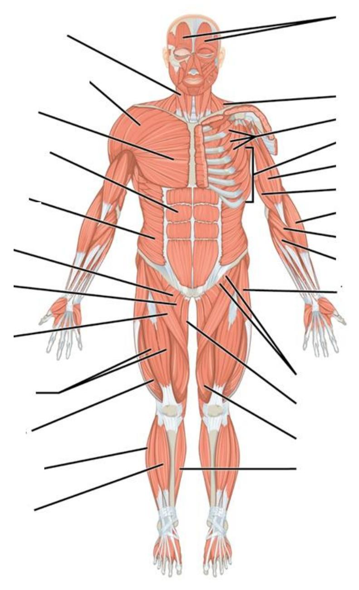

**11.2a Anterior View**

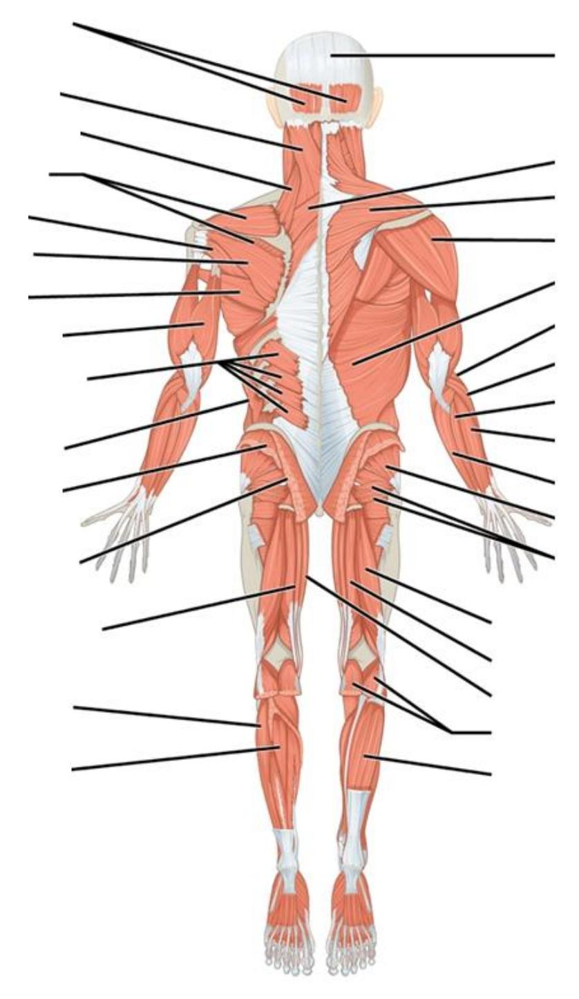

## **11.2b Posterior View**

**Figures 11.2 a & b** Anterior and Posterior Views of the Skeletal Muscle System.

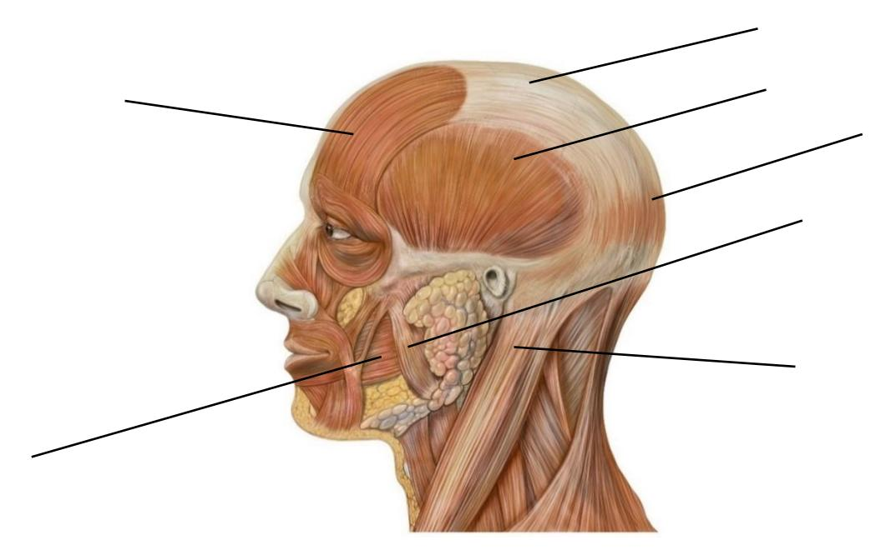

**Figure 11.3** Head Lateral Anatomy.

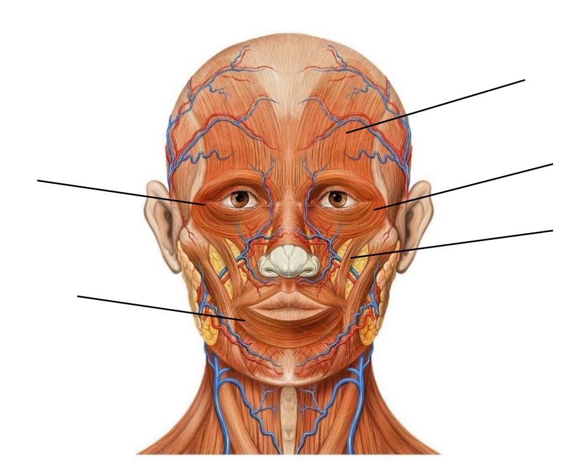

**Figure 11.4** Head Anatomy, Anterior View.

## **Lab Activities**

### **Lab activity 11.1**

### **Skeletal Muscle Structure and Function**

## **Muscular System Gross Anatomy**

Review the table of Muscle Terminology (table 11.2) to become familiar with terms used to name muscles. Compare those names to the muscles in figures 11.5 a & b.

**Table 11.2. List of Medical Roots, Suffixes, and Prefixes**

| Example   | Latin or Greek Translation | interpretation               |
|-----------|----------------------------|------------------------------|
| Function  | ad                         | to, toward                   |
|           | ab                         | away from                    |
|           | anti                       | against                      |
|           | ductor                     | something that moves         |
|           | muscul(o)                  | muscle                       |
|           | stalsis                    | contraction                  |
|           | stasis                     | stopping, standing           |
| Location: | externus                   | outside                      |
|           | internus                   | inside                       |
|           | apo                        | to the side of               |
|           | epi                        | on top of                    |
|           | dorsi or dorsal            | backside                     |
|           | infra                      | lower                        |
|           | supra                      | upper                        |
|           | medialis                   | medial (toward the inside)   |
|           | lateralis                  | lateral (toward the outside) |
|           | major                      | large or sometimes upper     |
|           | minor                      | small or sometimes lower     |
|           | post                       | denotes "after" or "behind"  |

Table 11.2. List of Medical Roots, Suffixes, and Prefixes Continued

| Relative muscle size: | vastus | large |
|----|----|----|
|  | longis | long |
|  | longissimus | longest |
|  | brevis | short (brief) |
|  | maximus | large |
|  | medius | medium |
|  | minimus | small |
| Shape: | deltoid | shaped like a triangle |
|  | orbicularis | orbit, circular muscle |
| Fascicular orientation: | oblique | angled |
|  | rectus | straight |
|  |  |  |
| Attachment location: | origin | the point where a structure arises and does not move during contraction |
|  | insertion | the structure that the muscle attached to and tends to be moved during contraction |
| Number of heads: | bi | two |
|  | tri | three |
|  | quad | four |
|  |  |  |

## **Major Muscles of the Body**

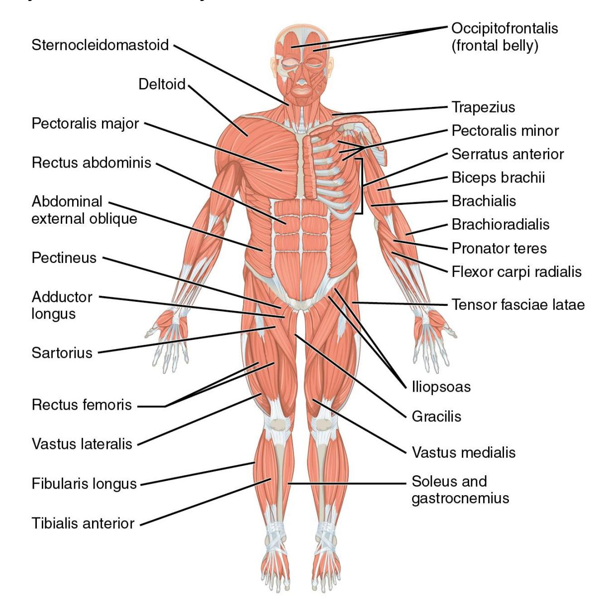

**Figure 11.5a** Anterior Aspect (Superficial Muscles).

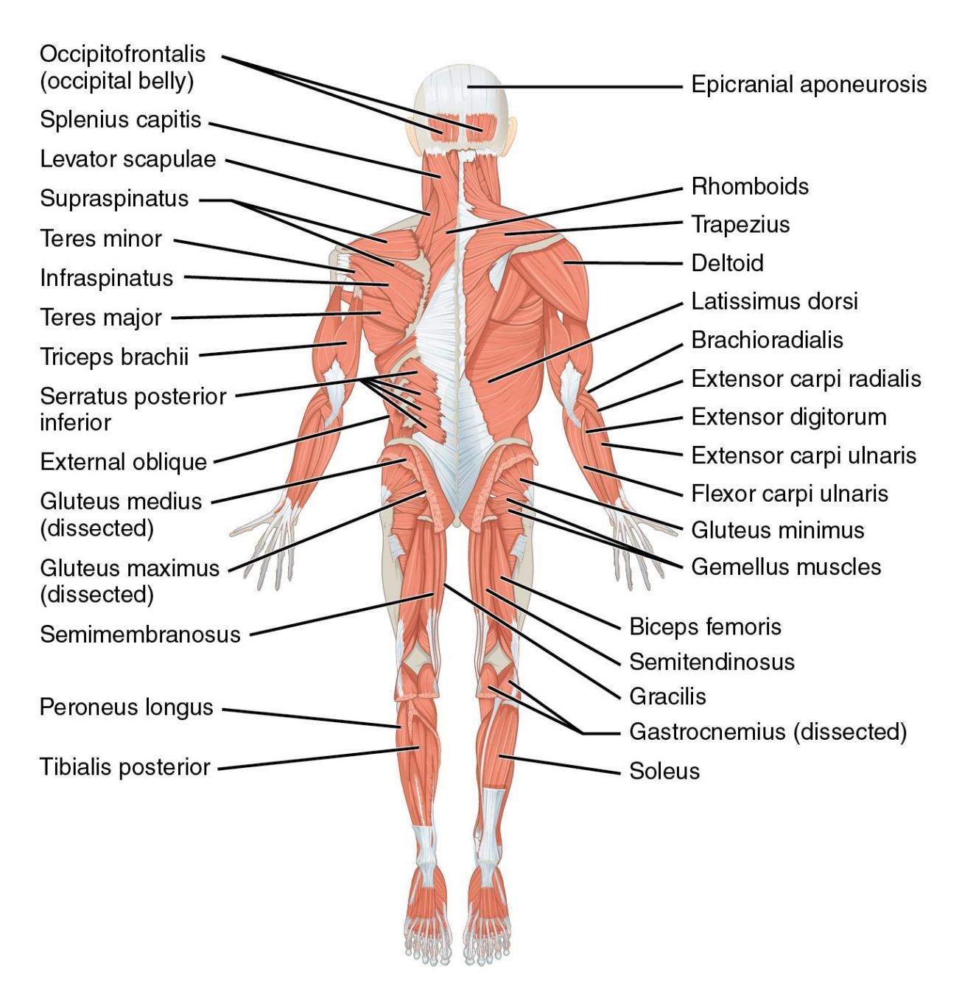

**Figure 11.5b** Posterior Aspect (Superficial Muscles).

## **Muscles of the Head and Neck**

### **Terms**

-   Frontalis

-   *Epicranial aponeurosis*

-   Occipitalis

-   Temporalis

-   Buccinator

-   Masseter

-   Sternocleidomastoid

-   Orbicularis oculi

-   Orbicularis oris

-   Zygomaticus major

### **Lab activity 11.2**

-   Review the material in your text on the muscles of the head and neck (Chapter 7.10; pp. 217-220)

-   Obtain a muscular model of the head from the classroom lab supplies and a roll of labelling tape.

-   Use the information from your text and Figure 11.6 to identify and label the muscles of the skull model.

-   Complete table 11.2.

-   Take a picture of the finished skull and include it in your study guide.

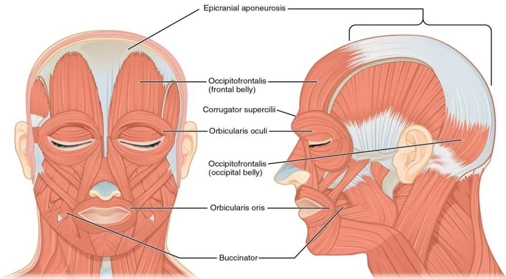

**Figure 11.6** Illustration of the Muscles of the Face and Head.

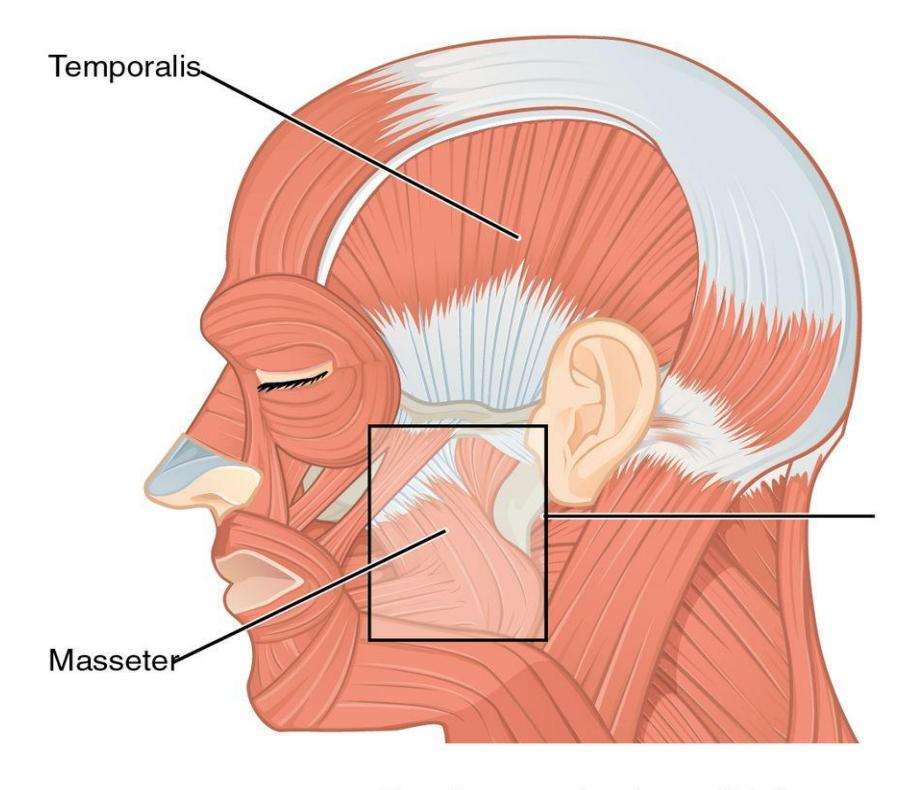

**Figure 11.7** Muscles of the Jaw.

## **Lab Activity 11.2 continued.**

Complete the table by naming the origin and insertion as well as the action for the listed facial muscles.

**Table 11.2 Review of the Facial Muscles**

| Muscle Name         | Origin and insertion | Action |
|---------------------|----------------------|--------|
| Sternocleidomastoid |                      |        |
| Temporalis          |                      |        |
| Masseter            |                      |        |
| Platysma            |                      |        |
| Buccinator          |                      |        |

## **Muscles of the Chest, Shoulder, Back, and Upper Limb**

## **Thorax and Abdomen (Anterior and Posterior)**

### **Terms**

-   Pectoralis major

-   Pectoralis minor

-   Serratus anterior

-   Rectus abdominis

-   *Rectus sheath*

-   *Linea alba*

-   External oblique

-   Internal oblique

-   Transversus abdominis

-   Trapezius

-   Latissimus dorsi

-   Erector spinae: collective group

    -   Spinalis
    -   Longissimus
    -   Iliocostalis

## **Lab Activity 11.3**

-   Review the material in your text on the muscles of the chest, shoulder, and upper limb (Chapter 7.11; pp. 225-229). The information on the erector spinae muscles is located on pp. 220-221 in table 7.4.

-   Identify the origin(s) , insertion(s) and action of the muscles as directed by your Instructor.

-   Obtain a model of the torso from the classroom lab supplies and a roll of labelling tape.

-   Use the information from your text to label the muscles of the chest, shoulder and back.

-   Take a picture of the finished skull and include it in your study guide.

-   Create a five-minute video identifying the muscles of the chest, shoulder, back and upper limb

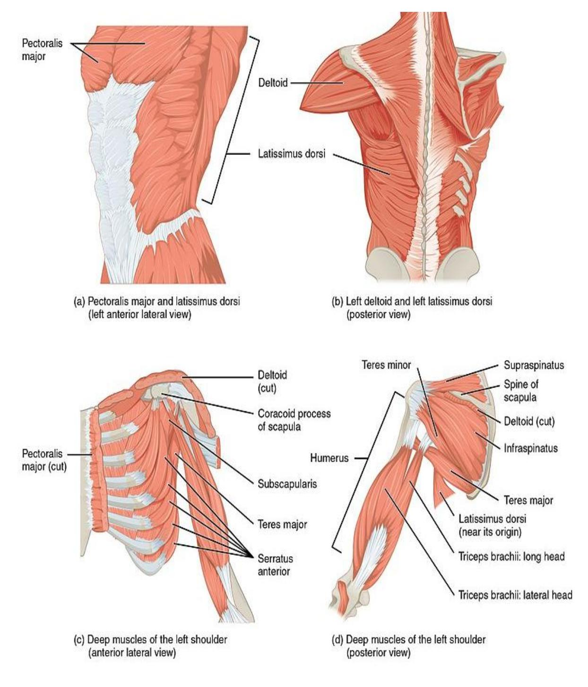

Figure 11.8 Muscles that Move the Humerus.

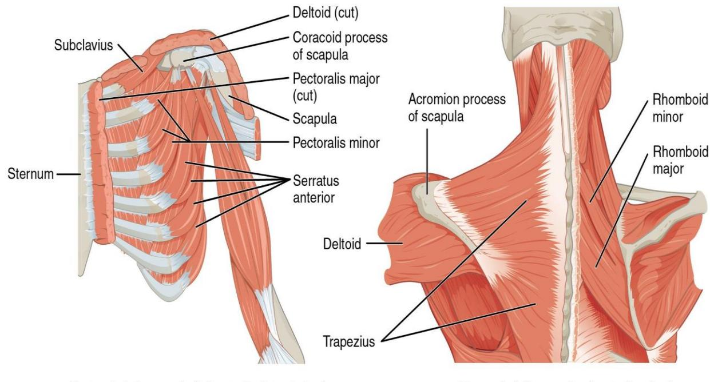

**Figure 11.9** Muscles that Stabilize the Pectoral Girdle.

## **Shoulder and Upper Limb Muscles**

### **Terms**

-   Deltoid
-   Rotator cuff
    a)  Supraspinatus
    b)  Infraspinatus
    c)  Teres minor
    d)  Subscapularis
-   Biceps brachii
-   Brachialis
-   Brachioradialis
-   Triceps brachii
-   Flexors anterior/from medial epicondyle
-   Extensors posterior/from lateral epicondyle

## **Lab Activity 11.4**

-   Obtain a model of the arm from the storage area in the lab.

-   Use the figures below (figures 11.10 11.15) to locate the required muscles on the models. As you work, palpate the muscles, and make notes about their appearance.

-   You also need to know their origins, insertions, and actions.

-   Identify and label the muscles listed above and photograph them. Invite your Instructor to verify their correctness.

-   Complete table 11.3 below using your textbook as a guide.

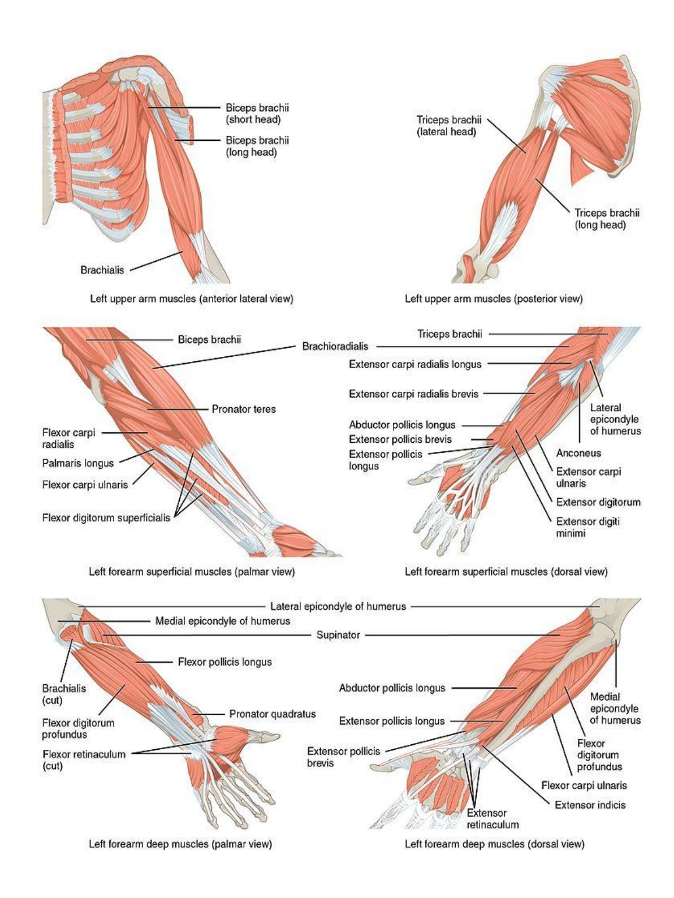

Figure 11.10 Muscles that Move the Forearm.

## **Shoulder**

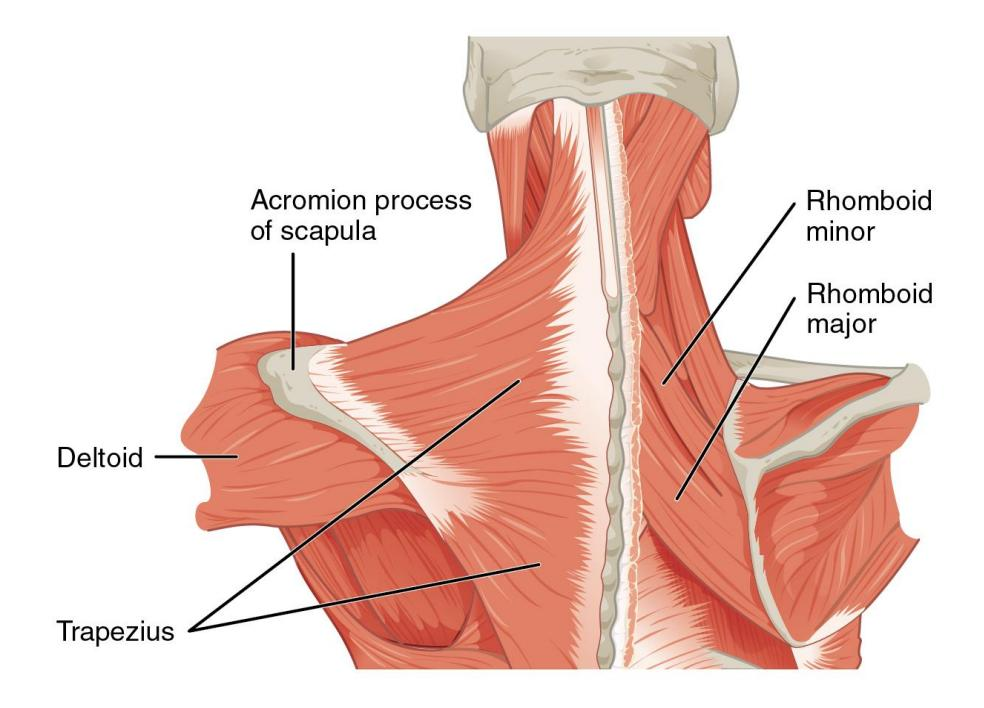

**Figure 11.11** Muscles that Stabilize the Pectoral Girdle.

## **Upper Arm**

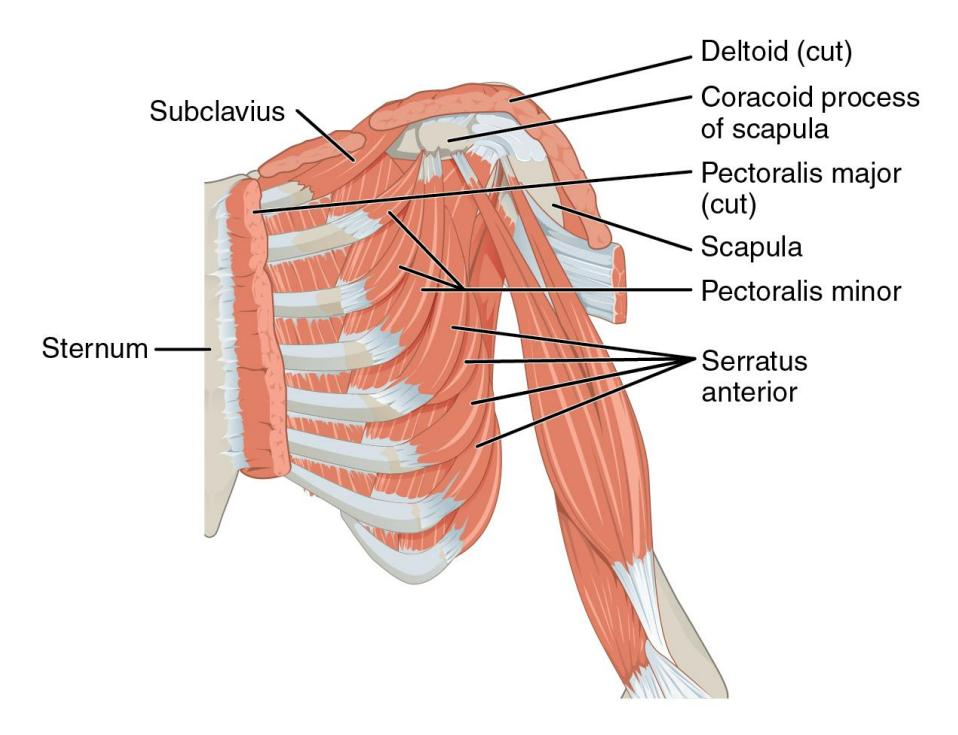

**Figure 11.12** Anterior Shoulder Muscles.

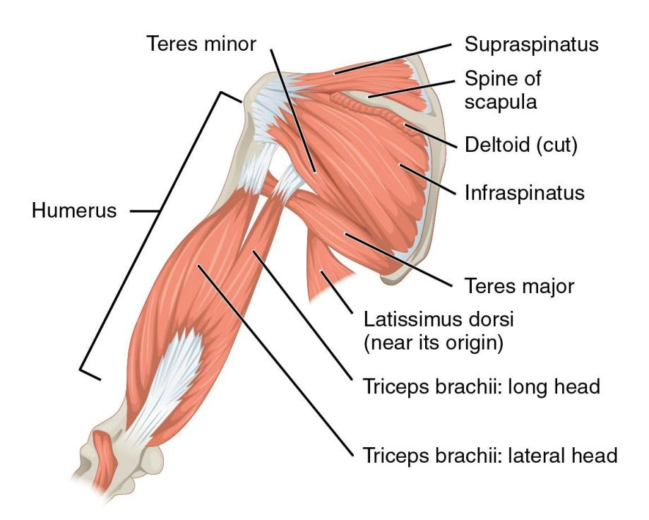

**Figure 11.13** Posterior Shoulder Muscles.

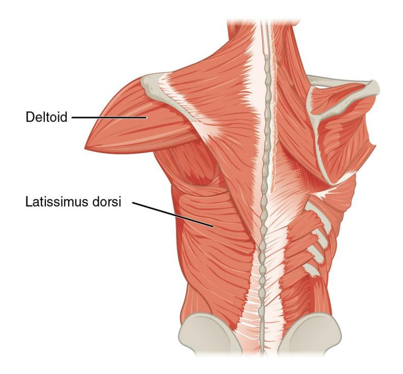

**Figure 11.14** Muscles that Move the Humerus.

## **Forearm Muscles**

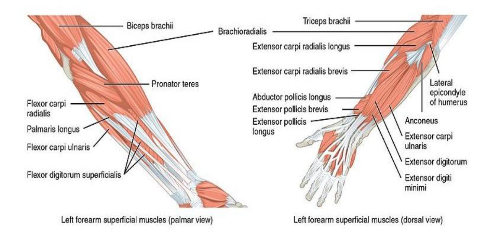

**Figure 11.15** Forearm Muscles: Palmer and Dorsal Aspects.

### **Lab Activity 11.5**

Complete this table using the information from your text.

**Table 11.3 Muscle Origins, Insertions and Actions of the Shoulder and Upper Limb Muscles.**

| Muscle          | Origin | Insertion | Action |
|-----------------|--------|-----------|--------|
| Biceps brachii  |        |           |        |
| Brachialis      |        |           |        |
| Triceps brachii |        |           |        |
| Deltoid         |        |           |        |

### **Muscles of the Abdomen**

## **Thorax and Abdomen, Anterior and Posterior Aspects**

### **Terms**

-   Pectoralis major

-   Pectoralis minor

-   Serratus anterior

-   Rectus abdominis

-   Rectus sheath

-   Linea alba External oblique

-   Internal oblique

-   Transversus abdominis

-   Trapezius

-   Latissimus dorsi

-   Erector spinae collectively

    -   spinalis,
    -   longissimus,
    -   iliocostalis

### **Lab Activity 11.6**

-   Obtain a human muscle model from the storage area in the lab.

-   Use the figures below (figures 11.16 11.18) to locate the required superficial muscles on the models. As you work, palpate the muscles, and make notes about their appearance.

-   You also need to know their origins, insertions, and actions as instructed by your instructor.

-   Identify and label the muscles listed above and photograph them. Invite your Instructor to verify their correctness.

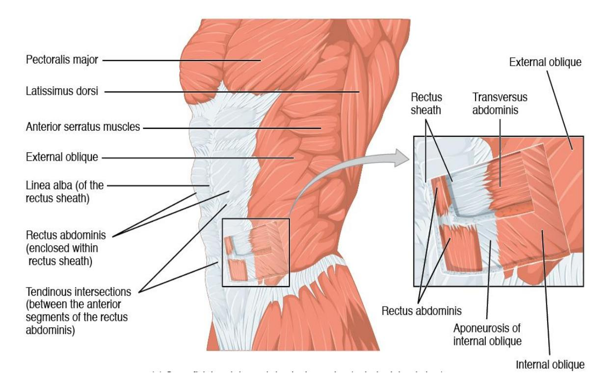

**Figure 11.16** Anterior Abdominal Muscles.

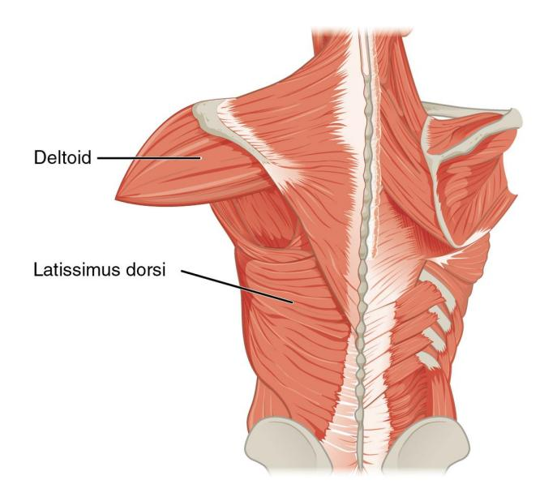

**Figure 11.17** Muscles that Move the Humerus.

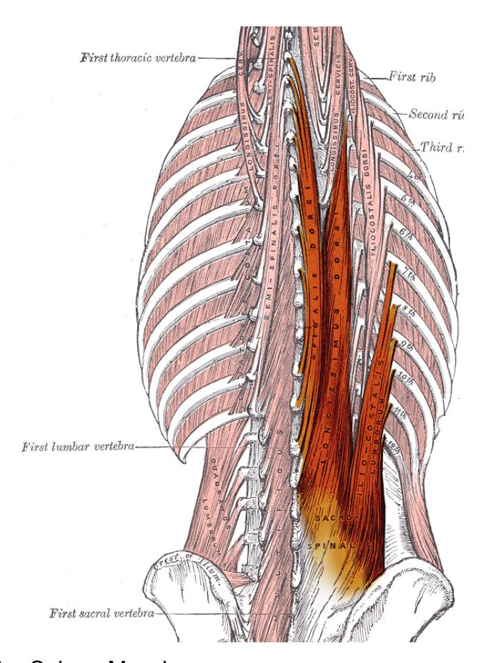

**Figure 11.18** Erector Spinae Muscles.

## **Muscles of the Hip and Lower Limb Anterior Hip Muscles**

### **Terms**

-   Iliopsoas

    -   Iliacus
    -   Psoas major

-   Sartorius

-   Adductor group of the thigh

-   Quadriceps femoris

    -   Rectus femoris
    -   Vastus lateralis
    -   Vastus intermedius
    -   Vastus medialis

### **Lab Activity 11.7**

-   Obtain a leg muscle model from the storage area in the lab.

-   Use the figures below (figures 11.19 11.21) to locate the required superficial muscles on the models. As you work, palpate the muscles, and make notes about their appearance.

-   You also need to know their origins, insertions, and actions as instructed by your instructor.

-   Identify and label the muscles listed above and photograph them. Invite your Instructor to verify their correctness.

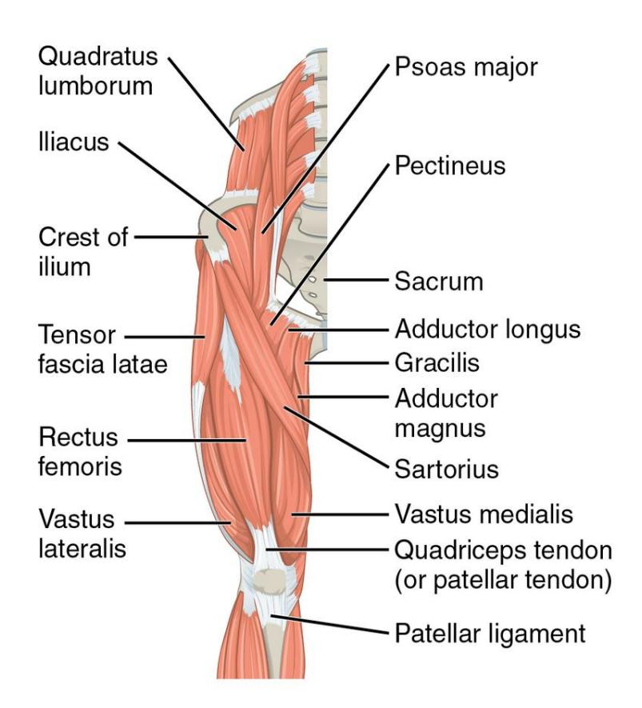

**Figure 11.19** Anterior Hip Muscles that Move the Femur.

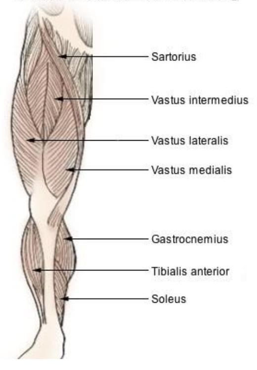

**Figure 11.20** Lower Extremity Muscles with the Rectus Femoris Removed.

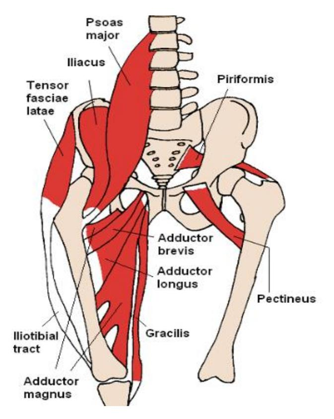

**Figure 11.21.** Anterior Hip Muscles (Adductor Muscles).

### **Lab Activity 11.8**

Complete the table below using information from your text.

**Table 11.4 Muscle Origins, Insertions and Actions of the Anterior Hip Muscles**

| Muscle         | Origin | Insertion | Action |
|----------------|--------|-----------|--------|
| Sartorius      |        |           |        |
| Rectus femoris |        |           |        |

## **Posterior Hip Muscles**

### **Terms**

-   Gluteus maximus

-   Gluteus medius

-   Gluteus minimus

-   Gracilis

-   Adductor group of thighs

-   Hamstrings

    -   Biceps femoris
    -   Semitendinosus
    -   Semimembranosus

### **Lab Activity 11.9**

-   Use the pictures below to locate the required muscles on the models. As you work, palpate the muscles, and make notes about their appearance.

-   You also need to know the origins, insertions, and actions of the muscles in table.

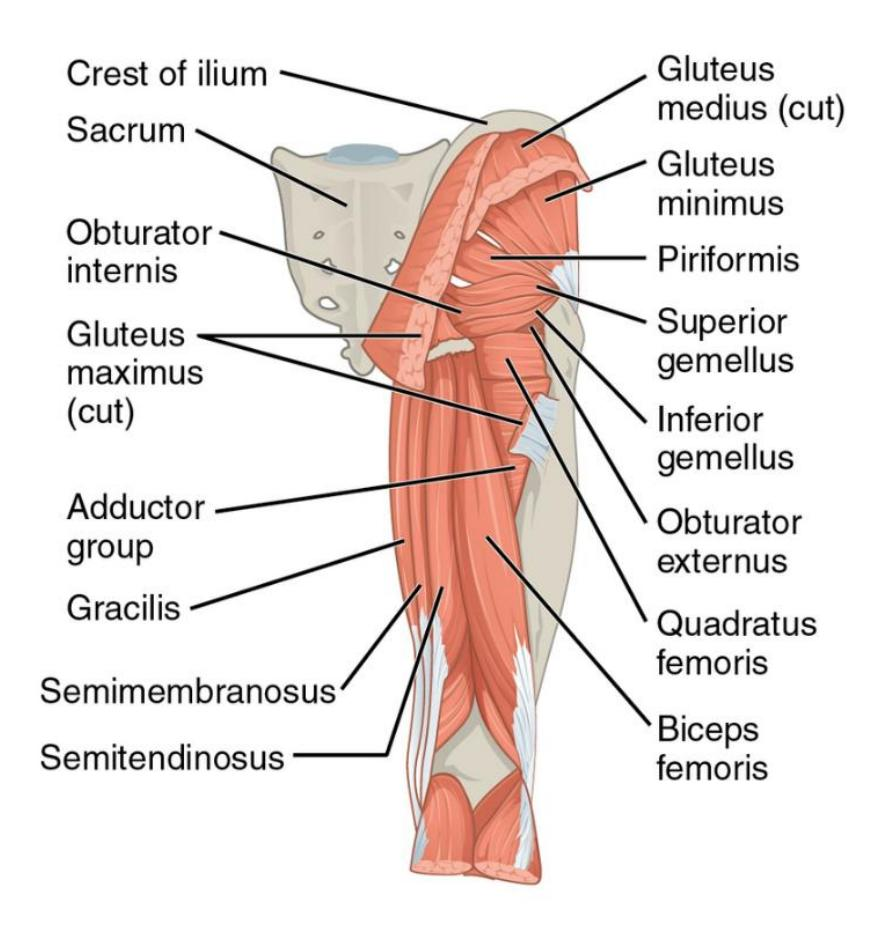

**Figure 11.22** Gluteal Muscles of the Upper Leg.

### **Lab Activity 11.10:**

Complete the following table using the information from your textbook.

**Table 11.5 Muscle Origins, Insertions and Actions of the Muscles of the Posterior Hip**

| Muscle          | Origin | Insertion | Action |
|-----------------|--------|-----------|--------|
| Gluteus maximus |        |           |        |
| Gluteus medius  |        |           |        |
| Gracilis        |        |           |        |
| Biceps femoris  |        |           |        |
| Rectus femoris  |        |           |        |

## **Lower Limb**

## **Leg muscles**

### **Terms**

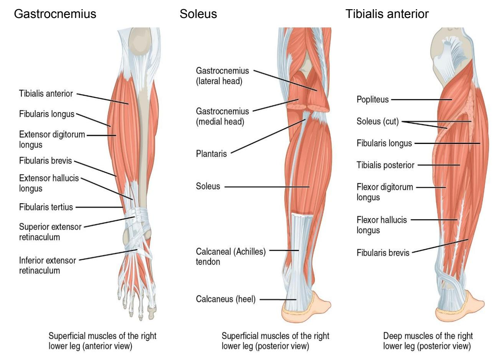

**Figure 11.23** Muscles of the Lower Leg.

**Lab Activity 11.11:** Complete the table below using information from your textbook.

**Table 11.6 Muscle Origins, Insertions and Actions of the Muscles of the Hip and Lower Limb**

| Muscle            | Origin | Insertion | Action |
|-------------------|--------|-----------|--------|
| Gastrocnemius     |        |           |        |
| Soleus            |        |           |        |
| Rectus femoris    |        |           |        |
| Tibialis anterior |        |           |        |

## **Post Lab Activities**

## **Check Your Understanding:**

## **Post Lab Activity 11.1: Answer the question.**

Describe the different criteria that contribute to how skeletal muscles are named.

## **Post Lab Activity 11.2**

### **Identification**

Identify the following muscles and/or facia in diagrams 11.24 to 11.26.

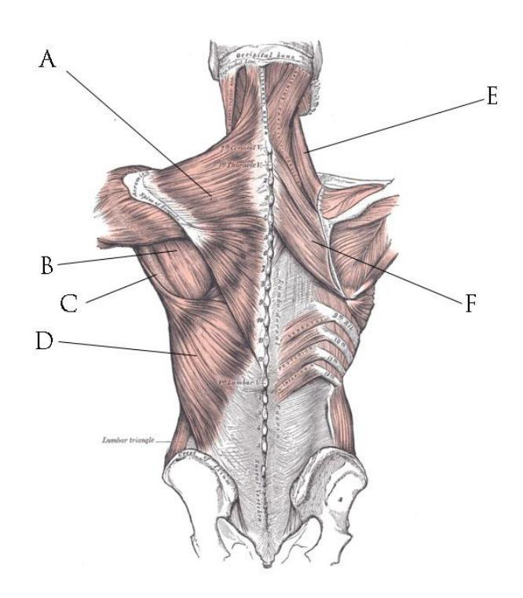

**Figure 11.24** Back Muscles.

Identify the facial muscle or facia in Figure 11.25.

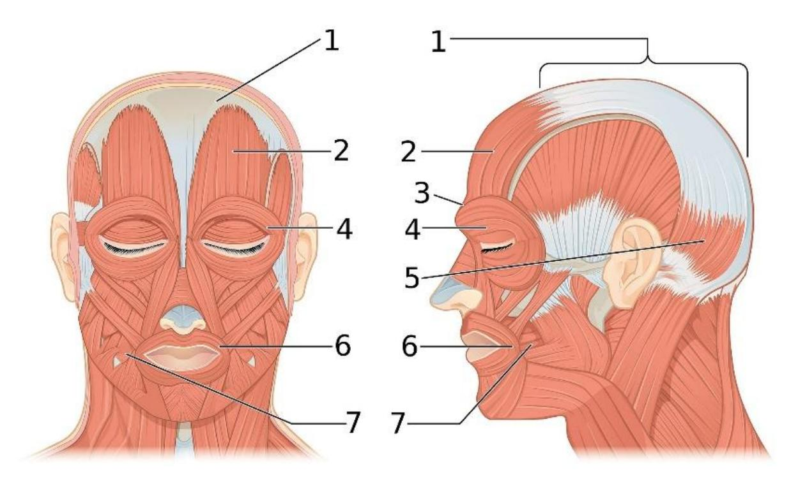

**Figure 11.25** Anterior and Lateral Aspects of the Face.

**Table 11.7 Anterior and Lateral Aspects of the Face.**

| Number | Muscle |
|--------|--------|
| 1      |        |
| 2      |        |
| 3      |        |
| 4      |        |
| 5      |        |
| 6      |        |
| 7      |        |

Identify and label the muscle or facia from your list on Figure 11.26.

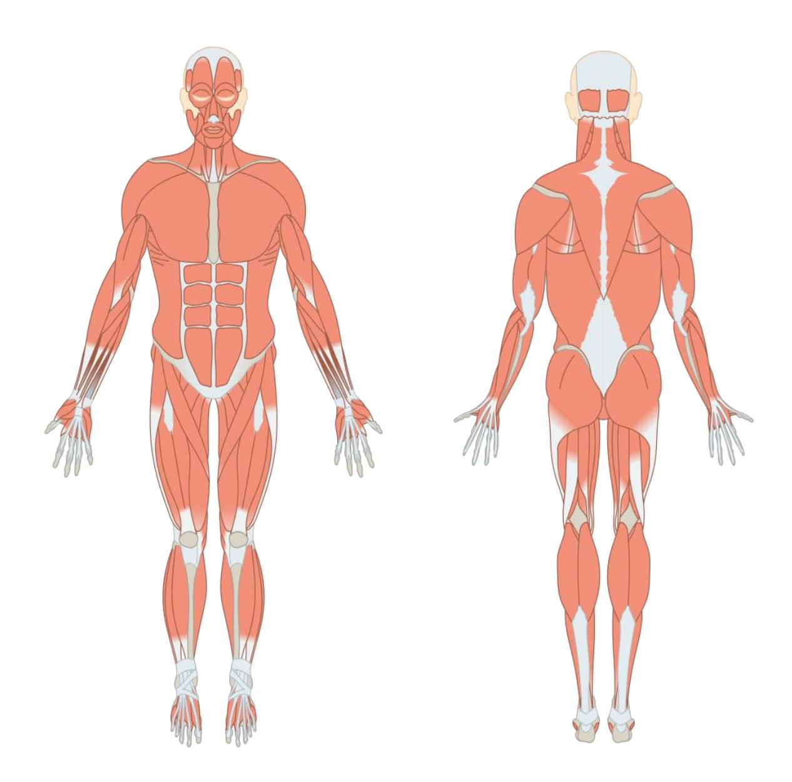

**Figure 11.26.** Muscles Front and Back.

## **Post Lab Activity 11.3**

### **Crosswords**

Complete the following crossword puzzles.

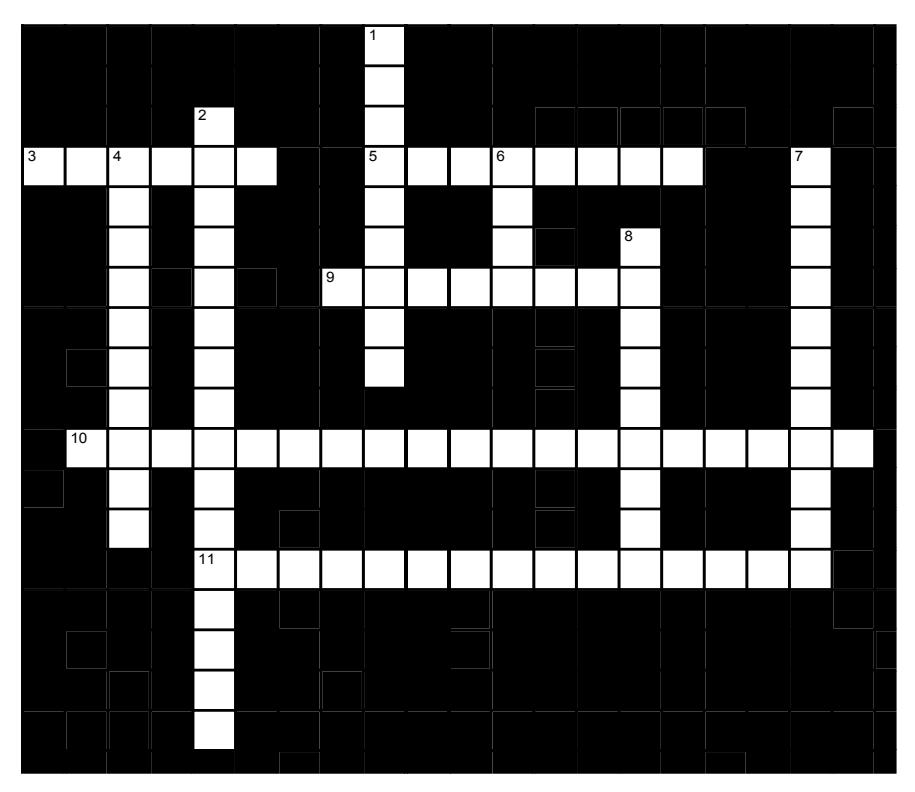

**Figure 11.27** Head and Neck Actions.

### **Across**

-   **3** The direction of a muscle's pull is determined by the direction of the \_\_\_\_\_. (6)
-   **5** The \_\_\_\_\_ pulls the mouth down, tensing the skin of the neck. (8)
-   **9** The \_\_\_\_\_ is the prime mover in jaw elevation: it pulls the ramus of the mandible toward the zygomatic arch. (8)
-   **10** The \_\_\_\_\_ muscles (one on each side) pull the mastoid process of the skull toward the sternum and clavicle. When both contract together, they flex the neck. (19)
-   **11** To purse the lips when we want to kiss or whistle, we contract the \_\_\_\_\_. (11,4)

### **Down**

-   **1** The prime mover for inspiration (breathing in) is the \_\_\_\_\_, which presses into the abdominal cavity, expanding the thoracic cavity as it does. (9)
-   **2** One winks, blinks, or squints by contracting the \_\_\_\_\_. (11,5)
-   **4** To widen the mouth, or compress puffed cheeks, we contract the \_\_\_\_\_. (10)
-   **6** (True/False) A muscle cannot lengthen itself. (4)
-   **7** The corners of the mouth are raised during a smile by the \_\_\_\_\_ (11)
-   **8** The \_\_\_\_\_ raises the eyebrows. (9)

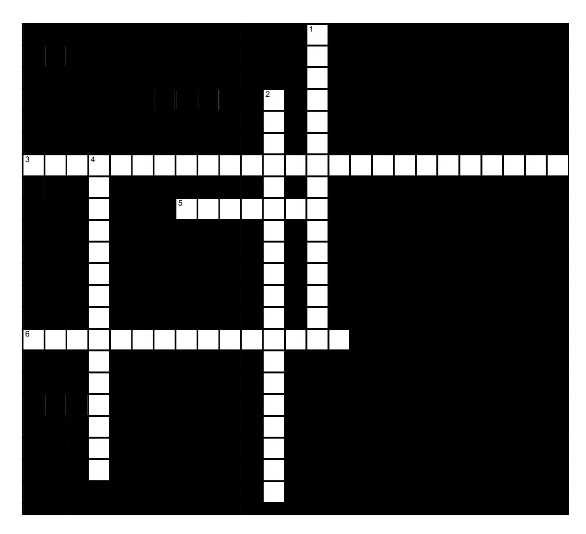

**Figure 11.28** Thoracic Muscles.

### **Across**

-   **3** For abduction beyond horizontal (to bring arm above head) the \_\_\_\_\_ and \_\_\_\_\_ must raise and rotate the scapula, so that the glenoid cavity faces upward. (9,8,8)
-   **5** The \_\_\_\_ is used to flex the shoulder from the adducted position by pulling the humerus upward, toward the clavicle. (7)
-   **6** The \_\_\_\_\_ extends the shoulder by pulling the intertubercular groove of the humerus toward the vertebral column. (10,5)

### **Down**

-   **1** The \_\_\_\_\_, a pair of segmented muscles, pulls the xiphoid process and costal cartilages of the ribs toward the pubic crest and symphysis, thereby flexing the lumbar vertebrae. (6,9)
-   **2** Contracting the \_\_\_\_ on one side results in head rotation. (19)
-   **4** The \_\_\_\_\_ flexes the shoulder from the abducted position by pulling the intertubercular groove of the humerus toward the sternum. (10,5)

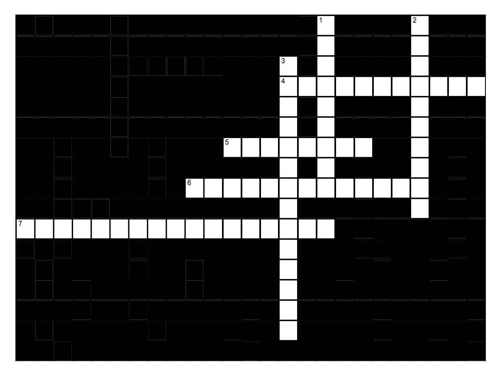

**Figure 11.29** Shoulder and Upper Limb.

### **Across**

-   **4** The glenoid cavity is so shallow and the range of motion so great that the shoulder is held together primarily by the tendons of the muscles that surround it. The four muscles whose tendons contribute the most stability are together called the \_\_\_\_\_. (7,4)
-   **5** Flexors are on the \_\_\_\_\_ of the forearm. (8)
-   **6** The \_\_\_\_\_ pulls the radial tuberosity of the radius toward the shoulder, flexing the elbow (6,7)
-   **7** The \_\_\_\_\_ pulls the posterior surfaces of several bones of the hand toward the lateral epicondyle of the humerus, resulting in both finger and wrist extension. (8,9)

### **Down**

-   **1** Extensors are on the \_\_\_\_\_ of the forearm. (9)
-   **2** The \_\_\_\_\_ pulls the coronoid process of the ulna toward the humerus, thus flexing the elbow. (10)
-   **3** The \_\_\_\_ extends the forearm by pulling the olecranon process toward the superior, posterior shaft of the humerus and toward the scapula. (7,7)

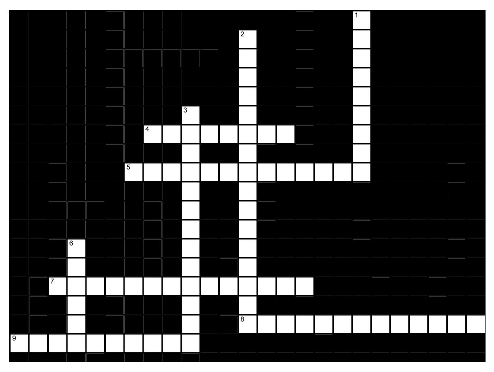

**Figure 11.30** Muscles: Hip and Leg.

### **Across**

-   **4** The \_\_\_\_\_ pulls the medial surface of the tibia toward the pubis, thus adducting the thigh. (8)
-   **5** The \_\_\_\_\_ pulls the greater trochanter of the femur toward the iliac crest, abducting the thigh. (7,6)
-   **7** The \_\_\_\_\_ pulls the femur toward the dorsal ilium, sacrum, and coccyx, extending the hip. (7,7)
-   **8** The \_\_\_\_\_ pulls the tibial tuberosity toward the ilium, extending the knee (6,7)
-   **9** The \_\_\_\_\_ pull the fibula and tibia toward the ischial tuberosity of the Os coxa; with the knee locked, this extends the hip. (10)

### **Down**

-   **1** The \_\_\_\_\_ pulls the femur toward the iliac crest, sacrum, and lumbar vertebrae, thus flexing the hip. (9)
-   **2** The \_\_\_\_\_ pulls the foot toward the lateral tibial condyle and proximal tibia, dorsiflexing the ankle. (8,8)
-   **3** The \_\_\_\_\_ pulls the calcaneus toward the distal end of the femur, plantar flexing the ankle. It is most powerful when the knee is straight. (13)
-   **6** The \_\_\_\_\_ pulls the calcaneus toward the proximal ends of the tibia and fibula, plantar flexing the ankle. (6)

### **Crossword Puzzle Solutions**

## **Figure 11.27. Head and neck actions**

-   **Across: 3** Fibers, **5** Platysma, **9** Masseter, **10** Sternocleidomastoid, **11** Orbicularis oris.
-   **Down: 1** Diaphragm, **2** Orbicularis oculi, **4** Buccinator, **6** TRUE, **7** Zygomaticus, **8** Frontalis.

## **Figure 11.28. Thoracic muscles**

-   **Across: 3** Trapezius serratus anterior, **5** Deltoid, **6** Latissimus dorsi.
-   **Down: 1** Rectus abdominis, **2** Sternocleidomastoid, **4** Pectoralis major.

## **Figure 11.29. Shoulder and upper limb**

-   **Across: 4** Rotator cuff, **5** Anterior, **6** Biceps brachii, **7** Extensor digitorum.
-   **Down: 1** Posterior, **2** Brachialis, **3** Triceps brachii.

## **Figure 11.30. Muscles; hip and leg**

-   **Across: 4** Gracilis, **5** Gluteus medius, **7** Gluteus maximus, **8** Rectus femoris, **9** Hamstrings.
-   **Down: 1** Iliopsoas, **2** Tibialis anterior, **3** Gastrocnemius, **6** Soleus.

**Chapter 11: Muscular System; Gross Anatomy**

| Terms | Definitions |
|----|----|
| abduct | move away from midline in the sagittal plane |
| abductor | moves the bone away from the midline |
| adductor | moves the bone toward the midline |
| agonist | (also, prime mover) muscle whose contraction is responsible for producing a particular motion |
| anal triangle | posterior triangle of the perineum that includes the anus |
| antagonist | muscle that opposes the action of an agonist |
| anterior scalene | a muscle anterior to the middle scalene |
| appendicular | of the arms and legs |
| axial | of the trunk and head |
| belly | bulky central body of a muscle |
| bi | two |
| biceps brachii | two-headed muscle that crosses the shoulder and elbow joints to flex the forearm while assisting in supinating it and flexing the arm at the shoulder |
| biceps femoris | hamstring muscle |
| brachialis | muscle deep to the biceps brachii that provides power in flexing the forearm. |
| brachioradialis | muscle that can flex the forearm quickly or help lift a load slowly |
| brevis | short |
| buccinator | buccinator |
| calcaneal tendon | also, Achilles tendon) strong tendon that inserts into the calcaneal bone of the ankle |
| circular | (also, sphincter) fascicles that are concentrically arranged around an opening |
| compressor urethrae | deep perineal muscle in females |
| convergent | fascicles that extend over a broad area and converge on a common attachment site |
| deglutition | swallowing |
| deltoid | shoulder muscle that abducts the arm as well as flexes and medially rotates it, and extends and laterally rotates it |
| diaphragm | skeletal muscle that separates the thoracic and abdominal cavities and is dome shaped at rest |
| dorsal group | region that includes the extensor digitorum brevis |
| epicranial aponeurosis | (also, galea aponeurosis) flat broad tendon that connects the frontalis and occipitalis |
| erector spinae group | large muscle mass of the back; primary extensor of the vertebral column |
| extensor | muscle that increases the angle at the joint |
| extensor carpi radialis brevis | muscle that extends and abducts the hand at the wrist |
| extensor carpi ulnaris | muscle that extends and adducts the hand |
| extensor digitorum | muscle that extends the hand at the wrist and the phalanges |
| external intercostal | superficial intercostal muscles that raise the rib cage |
| external oblique | superficial abdominal muscle with fascicles that extend inferiorly and medially |
| extrinsic eye muscles | originate outside the eye and insert onto the outer surface of the white of the eye, and create eyeball movement |
| extrinsic muscles of the hand | muscles that move the wrists, hands, and fingers and originate on the arm |
| fascicle | muscle fibers bundled by perimysium into a unit |
| fibularis brevis | (also, peroneus brevis) muscle that plantar flexes the foot at the ankle and everts it at the intertarsal joints |
| fibularis longus (also, peroneus longus) | (also, peroneus longus) muscle that plantar flexes the foot at the ankle and everts it at the intertarsal joints |
| fixator | synergist that assists an agonist by preventing or reducing movement at another joint, thereby stabilizing the origin of the agonist |
| flexion | flexion |
| flexor | muscle that decreases the angle at the joint |
| flexor carpi radialis | muscle that flexes and abducts the hand at the wrist |
| flexor carpi ulnaris | muscle that flexes and adducts the hand at the wrist |
| frontalis | front part of the occipitofrontalis muscle |
| fusiform | muscle that has fascicles that are spindle shaped to create large bellies |
| gastrocnemius | most superficial muscle of the calf |
| gluteal group | muscle group that extends, flexes, rotates, adducts, and abducts the femur |
| gluteus maximus | largest of the gluteus muscles that extends the femur |
| gluteus medius | muscle deep to the gluteus maximus that abducts the femur at the hip |
| gluteus minimus | smallest of the gluteal muscles and deep to the gluteus medius |
| Gracilis | muscle that adducts the thigh and flexes the leg at the knee |
| hamstring group | three long muscles on the back of the leg |
| iliacus | a flat, triangular muscle which fills the iliac fossa. It forms the lateral portion of iliopsoas. |
| iliopsoas group | muscle group consisting of iliacus and psoas major muscles, which flexes the thigh at the hip, rotates it laterally, and flexes the trunk of the body onto the hip |
| iliotibial tract | muscle that inserts onto the tibia; made up of the gluteus maximus and connective tissues of the tensor fasciae latae |
| infraspinatus | muscle that laterally rotates the arm |
| insertion | end of a skeletal muscle that is attached to the structure (usually a bone) that is moved when the muscle contracts |
| intercostal muscles | muscles that span the spaces between the ribs |
| internal intercostal muscles | the intermediate intercostal muscles that draw the ribs together |
| internal oblique | flat, intermediate abdominal muscle with fascicles that run perpendicular to those of the external oblique |
| intrinsic muscles of the hand | muscles that move the wrists, hands, and fingers and originate in the palm |
| lateralis | to the outside |
| latissimus dorsi | broad, triangular axial muscle located on the inferior part of the back |
| linea alba | white, fibrous band that runs along the midline of the trunk |
| longissimus group | intermediately placed muscles of the erector spinae |
| longus | long |
| masseter | main muscle for chewing that elevates the mandible to close the mouth |
| mastication | chewing |
| maximus | largest |
| medialis | to the inside |
| medius | medium |
| minimus | smallest |
| multipennate | pennate muscle that has a tendon branching within it |
| oblique | at an angle |
| occipitalis | posterior part of the occipitofrontalis muscle |
| occipitofrontalis orbicularis oculi | muscle that makes up the scalp with a frontal belly and an occipital belly circular muscle that closes the eye |
| orbicularis oris | circular muscle that moves the lips |
| origin | end of a skeletal muscle that is attached to another structure (usually a bone) in a fixed position |
| parallel | fascicles that extend in the same direction as the long axis of the muscle |
| pectineus | muscle that abducts and flexes the femur at the hip |
| pectoral girdle | shoulder girdle, made up of the clavicle and scapula |
| pectoralis major | thick, fan-shaped axial muscle that covers much of the superior thorax |
| pectoralis minor | muscle that moves the scapula and assists in inhalation |
| pelvic diaphragm | muscular sheet that comprises the levator ani and the ischiococcygeus |
| pelvic girdle | hips, a foundation for the lower limb |
| pennate | fascicles that are arranged differently based on their angles to the tendon diamond-shaped region between the pubic symphysis, coccyx, and |
| perineum | ischial tuberosities |
| prime mover | (also, agonist) principle muscle involved in an action |
| psoas major | muscle that, along with the iliacus, makes up the iliopsoas |
| quadratus femoris | muscle deep to the gluteus maximus on the lateral surface of the thigh that laterally rotates the femur at the hip |
| quadriceps femoris group | four muscles, which extend and stabilize the knee |
| quadriceps tendon | (also, patellar tendon) tendon common to all four quadriceps muscles, inserts into the patella |
| rectus | straight |
| rectus abdominis | long, linear muscle that extends along the middle of the trunk |
| rectus femoris | quadricep muscle on the anterior aspect of the thigh |
| rectus sheaths | tissue that makes up the linea alba |
| rotator cuff | (also, musculotendinous cuff) the circle of tendons around the shoulder joint |
| sartorius | band-like muscle that flexes, abducts, and laterally rotates the leg at the hip |
| semimembranosus | hamstring muscle |
| semitendinosus | hamstring muscle |
| serratus anterior | large and flat muscle that originates on the ribs and inserts onto the scapula |
| soleus | wide, flat muscle deep to the gastrocnemius |
| spinalis group | medially placed muscles of the erector spinae |
| sternocleidomastoid | major muscle that laterally flexes and rotates the head |
| subscapularis | muscle that originates on the anterior scapula and medially rotates the arm |
| supraspinatus | muscle that abducts the arm |
| synergist | muscle whose contraction helps a prime mover in an action |
| temporalis | muscle that retracts the mandible |
| tensor fascia lata | muscle that flexes and abducts the thigh |
| teres major | muscle that extends the arm and assists in adduction and medial rotation of it |
| teres minor | muscle that laterally rotates and extends the arm |
| tibialis anterior | muscle located on the lateral surface of the tibia |
| tibialis posterior | muscle that plantar flexes and inverts the foot |
| transversospinales | muscles that originate at the transverse processes and insert at the spinous processes of the vertebrae |
| transversus abdominis | deep layer of the abdomen that has fascicles arranged transversely around the abdomen |
| trapezius | muscle that stabilizes the upper part of the back |
| tri | three |
| triceps brachii | three-headed muscle that extends the forearm |
| unipennate | pennate muscle that has fascicles located on one side of the tendon |
| urogenital triangle | anterior triangle of the perineum that includes the external genitals |
| vastus intermedius | quadricep muscle that is between the vastus lateralis and vastus medialis and is deep to the rectus femoris |
| vastus lateralis | quadricep muscle on the lateral aspect of the thigh |
| vastus medialis | quadricep muscle on the medial aspect of the thigh |
