# **Nervous System Microanatomy**

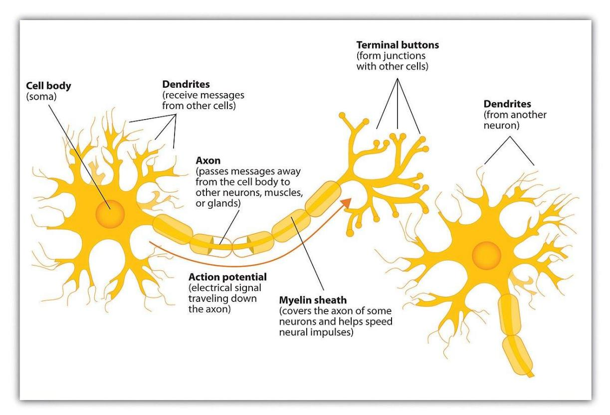

**Figure 12.1** Diagram of the Neuron.

## **Your objectives for this lab are:**

-   In a neuron diagram, identify and describe the location and function(s) of a
    -   Unipolar neuron
    -   Bipolar neuron
    -   Multipolar neuron
-   In a neuron/ nervous cell model, identify and explain the function(s) of
    -   Neurons, and its
    -   Cell body/soma
    -   Nucleus
    -   Axon
    -   Dendrite
    -   Axon hillock
    -   Myelin sheath
    -   Schwann cell
    -   Axon terminal
    -   Node of Ranvier

## **Your objectives continued:**

-   In a neuron/ nervous tissue smear slide, identify and describe the function(s) of
    -   Neurons, and its
        -   Cell body/soma
        -   Nucleus
    -   Glial cells
-   In a neuron/ nervous tissue model and smear slide, identify and describe the function(s) of
    -   Neurons, and its
    -   Cell body/soma
    -   Nucleus
    -   Axon
    -   Dendrite
    -   Axon hillock
-   In a peripheral nerve cross section slide, identify and describe the function(s) of
    -   Epineurium
    -   Fascicle
    -   Perineurium
    -   Myelin sheath
    -   Neuron
    -   Satellite cells
-   Describe the function of the glial cells, including astrocytes, ependymal cells, Schwann cells, oligodendrocytes, and satellite cells.

## **Pre-lab Activities**

## **Prelab Activity 12.1**

## **Definitions**

| Term                   | Definition |
|------------------------|------------|
| Neuron                 |            |
| cell body              |            |
| nucleus                |            |
| nucleolus              |            |
| neurofibrils           |            |
| Nissl bodies           |            |
| axon                   |            |
| axon hillock           |            |
| dendrite               |            |
| synapse                |            |
| pre-synaptic terminal  |            |
| post-synaptic terminal |            |
| Schwann cells          |            |
| Nodes of Ranvier       |            |
| White Matter           |            |
| Gray Matter            |            |

## **Types of Neuroglial Cells:**

**PNS**

|                                 |     |
|---------------------------------|-----|
| Schwann cells (Neurolemmocytes) |     |
| Satellite cells                 |     |

**CNS**

|                  |     |
|------------------|-----|
| Astrocytes       |     |
| Oligodendrocytes |     |
| Microglia        |     |
| Ependymal cells  |     |

## **Prelab Activity 12.2**

## **Fill in the Blank**

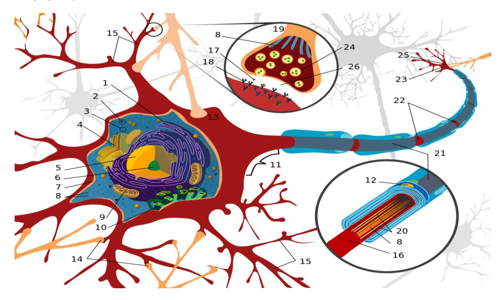

**Figure 12.2** Structures of the Neuron.

**Table 12.1. Identification of the Structures of the Neuron**

| Structure Number | Name |
|------------------|------|
| 1                |      |
| 3                |      |
| 4                |      |
| 5                |      |
| 6                |      |
| 7                |      |
| 9                |      |
| 11               |      |
| 12               |      |
| 14               |      |
| 15               |      |
| 16               |      |
| 18               |      |
| 20               |      |
| 21               |      |
| 22               |      |
| 23               |      |

## **Lab Activities**

## **Classification of Neurons by Shape**

### **Terms**

• Unipolar neuron • Bipolar neuron • Multipolar neuron

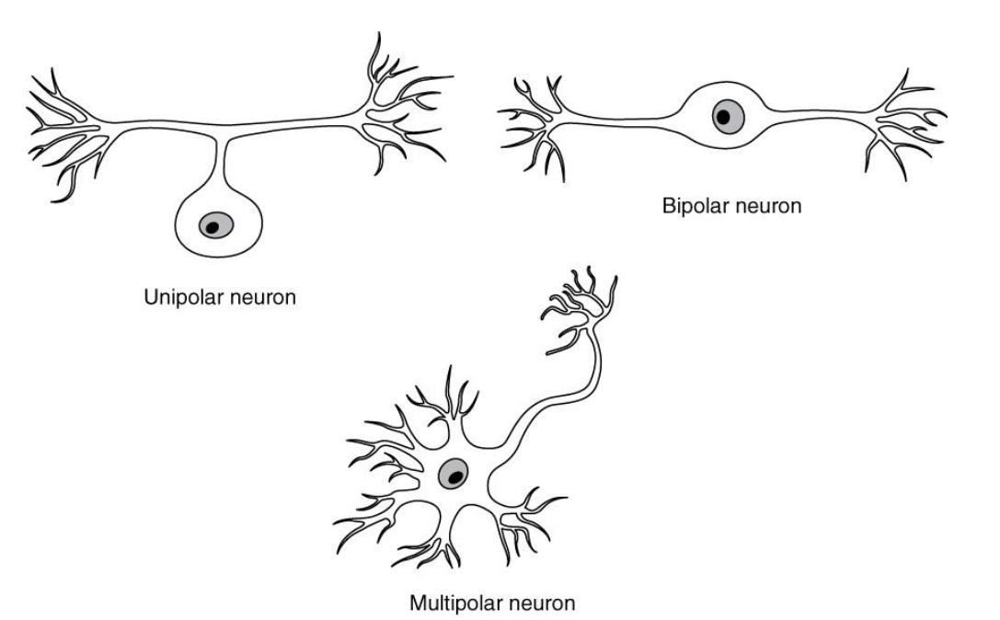

**Figure 12.3** Neuron Classification Based on Shape.

## **Structures of the neuron**

-   Cell body (Soma)

-   Dendrites

-   Axon hillock

-   Axon

-   Axon terminal

-   Schwann cell

-   Node (of Ranvier)

-   Myelin sheath

Also, distinguish gray matter from white matter, in terms of what each is made of, and where each is found**.**

## **Lab Activity 12.1. Neurons and glial cells**

-   Obtain a slide of motor neurons or nervous tissue smear.
-   View the slide using the 10x or 40x objective, as directed by your instructor.
    -   Use the structures listed above to identify the structures listed in the objectives and describe their functions.
    -   In the space below, draw a neuron you see in your slide. Label the soma, nucleus, axon, dendrite, axon hillock, and a glial cell.
-   Take a picture of the tissue and download it into your study guide. Label the diagram.

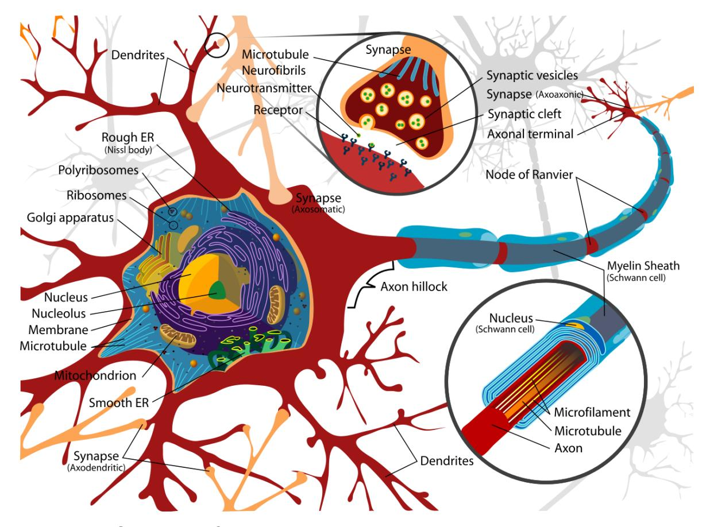

**Figure 12.4** Structures of the neuron

### **Lab Activity 12.2: Identify Features of a Neuron.**

-   Set up into your lab groups and obtain a model of a motor neuron.
-   Use the information above to identify the structures listed in the objectives and describe their functions.
-   Label the model.
    -   In the space below, draw the neuron in the box below. Label the cell body (soma), dendrites, axon, axon hillock, axon terminal, Schwann cell, node (of Ranvier) and the myelin sheath.
-   Take a picture of the labeled cell for your study guide.

## **Support Cells: Neuroglial Cells**

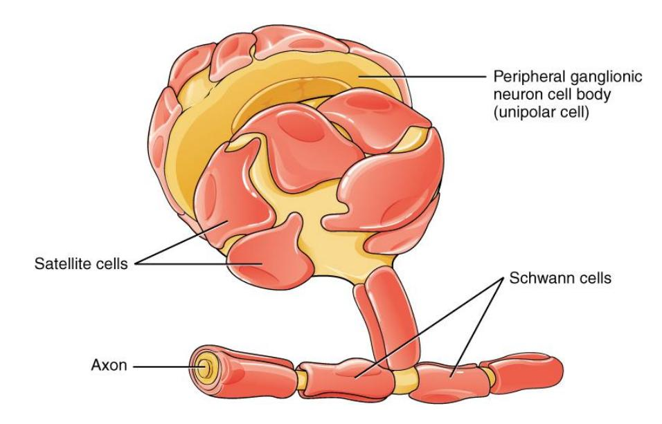

**Figure 12.5** Neuroglia of the Peripheral Nervous System.

## **Glial Cells of the PNS**

-   Schwann Cells (Neurolemmocytes)
-   Satellite cells

### **Glial Cells of the CNS**

-   Oligodendrocytes:

-   Astrocytes:

-   Microglia:

-   Ependymal cells:

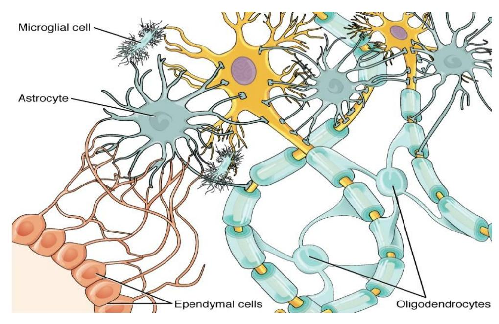

**Figure 12.6 Neuroglia of the CNS**

## **The Spinal Cord in Histology Slides**

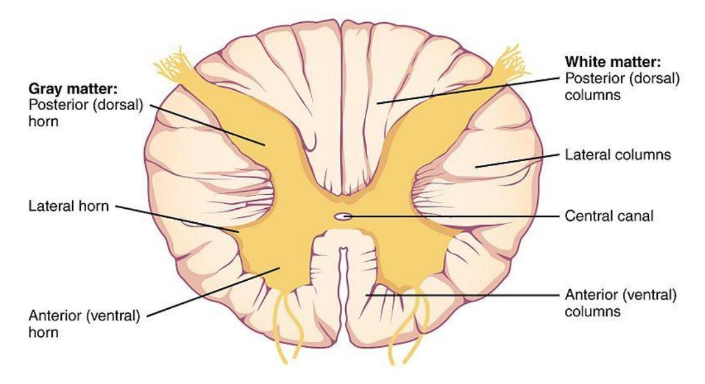

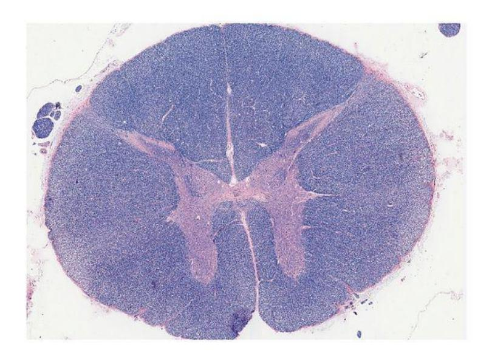

**Figure 12.7** Cross Section of the Spinal Cord.

### **Lab Activity 12.3: The Spinal Cord in Histology Slides**

-   Obtain a slide of motor neurons or nervous tissue smear.
-   View the slide using the 10x or 40x objective, as directed by your instructor.
    -   Use the information above to identify the structures listed in the objectives and describe their functions.
    -   In the space below, draw a neuron seen in your slide. Label the cross section of the spinal cord.
-   Take a picture of the tissue and download it into your study guide. Label the diagram.

Note: I corrected all of the post lab activity numbers below, which should be 12 but are 13 in the source.

## **Post Lab Activities: Check Your Understanding**

## **Post Lab Activity 12.1**

### Identifications

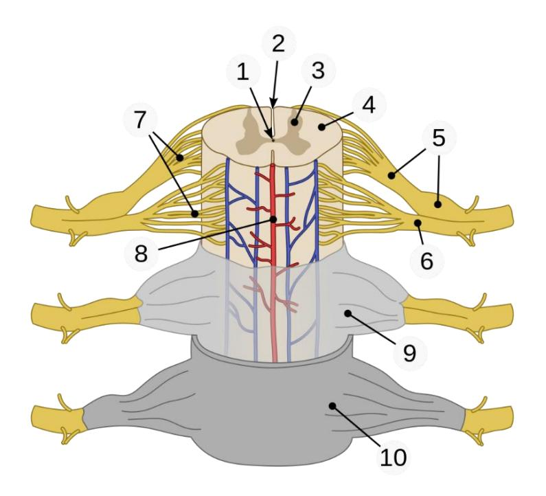

Figure 12.8 Spinal Cord Components.

|     |     |
|-----|-----|
| 1\. |     |
| 2\. |     |
| 3\. |     |
| 4\. |     |
| 5\. |     |
| 6\. |     |
| 7   |     |

## **Post Lab Activity 12.2**

### **Crossword Puzzle(s)**

Complete the following crossword puzzles.

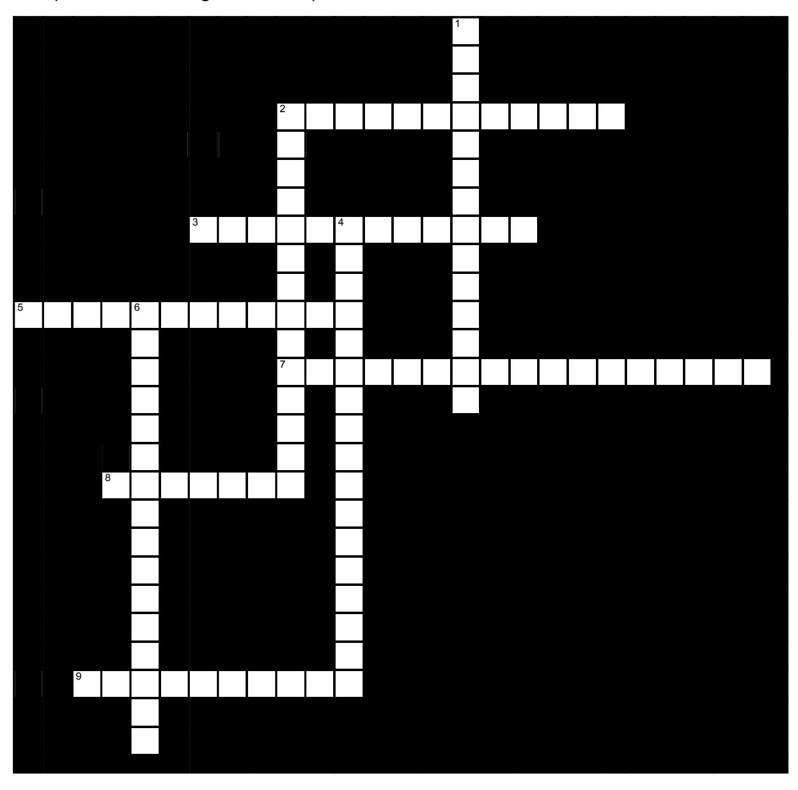

**Figure 12.9** Nervous System Anatomy.

### **Across**

-   2 \_\_\_\_\_ are cells which produce the myelin sheath in the peripheral nervous system, but not in the central nervous system. (7,5)

-   3 A(n) \_\_\_\_\_ is a coating wrapped around neuronal axons which insulates them and protects them. (6,6)

-   5 The PNS has two major divisions: the \_\_\_\_ division and the \_\_\_\_\_ division. (7,5)

-   7 The brain and spinal cord make up the \_\_\_\_\_ nervous system. All other nerves are part of the \_\_\_\_\_ nervous system. (7,10)

-   8 \_\_\_\_\_ are excitable cells that transmit electrical signals. (7)

-   9 In the CNS, \_\_\_\_\_ are supporting cells which guide the migration of young neurons. (10)

### **Down**

-   1 In the CNS, \_\_\_\_ are cells which line the fluid-filled cavities, and which produce, transport, and circulate the fluid surrounding the brain and spinal cord. (9,5)

-   2 \_\_\_\_\_ are cells in the PNS which surround the cell bodies of neurons which are grouped in ganglia. They maintain the microenvironment and provide insulation. (9,5)

-   4 The two principal cell types of the nervous system are \_\_\_\_\_ and supporting cells called \_\_\_\_\_. (7,5,5)

-   6 \_\_\_\_\_ are cells which produce the myelin sheath in the central nervous system, but not in the peripheral nervous system. (16)

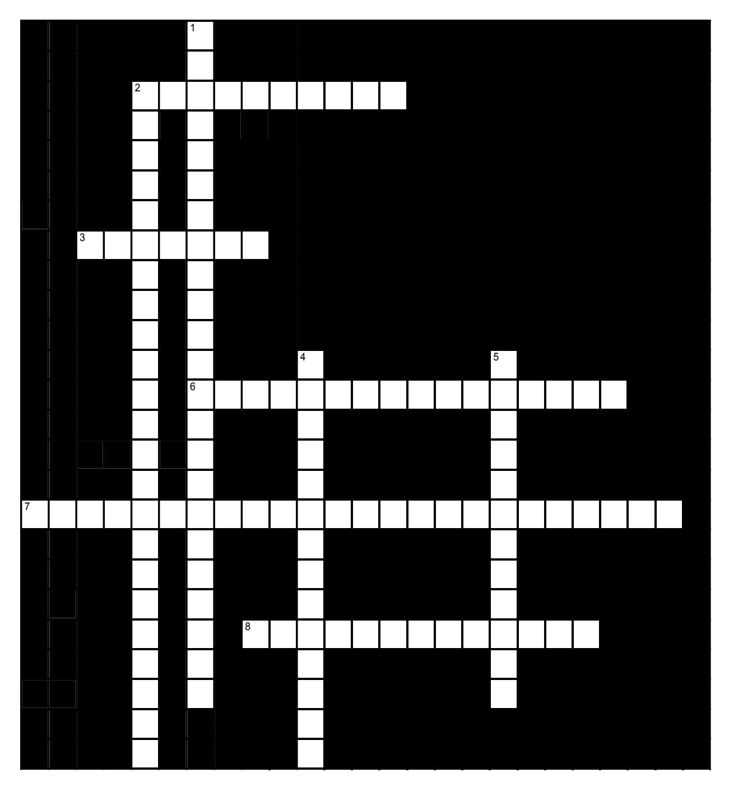

**Figure 12.10** Nervous System Physiology.

### **Across**

-   2 The speed of an action potential is greatest when it is traveling through an axon which is \_\_\_\_\_. (10)

-   3 A(n) \_\_\_\_\_ is a junction between a neuron and another cell which allows the transfer of information. (7)

-   6 The myelin sheath of axons in the CNS is formed by \_\_\_\_\_. (16)

-   7 Neurons can be classified functionally as \_\_\_\_, \_\_\_\_\_ or \_\_\_\_\_. (7,5,12)

-   8 The \_\_\_\_\_ is the fluid-filled space separating the pre- and postsynaptic cells. (8,5)

### **Down**

-   1 The \_\_\_\_ neuron conducts the signal to a synapse, while the \_\_\_\_\_ cell responds or conducts a signal away from it. (11,12)

-   2 White matter is composed of \_\_\_\_. (10,8,5)

-   4 Saltatory conduction depends on the presence of \_\_\_\_\_, which are gaps through which ions in the extracellular fluid can reach the neuron's plasma membrane. (5,2,7)

-   5 40. In the PNS, the myelin sheath is formed by \_\_\_\_\_. (7,5)

## **Post Lab Activity 12.3: Fill in the blanks.**

1.  The \_\_\_\_\_\_\_ supports and protects the neuron.
2.  The \_\_\_\_\_\_\_\_ of the nerve is also called a soma.
3.  The \_\_\_\_\_ is a long cytoplasmic process that uniformly maintains its diameter.
4.  The neuron contains \_\_\_\_\_\_\_ that receives information.
5.  The \_\_\_\_\_\_\_\_ is often referred to as a nerve fiber.
6.  The enlarged area between the neuron cell body and the axon.
7.  The \_\_\_\_ is the area of rough endoplasmic reticulum located in the neuron cell body. Proteins are manufactured here.
8.  \_\_\_\_\_\_\_\_\_\_ are extensions of an axon that form synapses with other neurons.

## **Solutions**

## **Identification**

### **Parts of human spinal cord**

1 central canal 2 posterior median sulcus 3 gray matter 4 white matter 5 dorsal root (left), dorsal root ganglion (right) 6 ventral root 7 fascicles 8 anterior spinal artery 9 arachnoid mater 10 dura mater.

## **Fill in the blanks.**

-   The *neuroglia* supports and protects the neuron.
-   The *Cell body* of the nerve is also called a soma.
-   The *axon* is a long cytoplasmic process that uniformly maintains its diameter.
-   The neuron contains *dendrites* that receive information.
-   The *axon* is often referred to as a nerve fiber.
-   The enlarged area between the neuron cell body and the axon is referred to as the *axon hillock*.
-   The *Nissl body* is the area of rough endoplasmic reticulum located in the neuron cell body. Proteins are manufactured here.
-   *Presynaptic terminal* are Extensions of an axon that form synapses with other neurons.

## **Crosswords**

### **Figure 12.9. Nervous System Anatomy**

-   **Across: 2** Schwann cells, **3** Myelin sheath, **5** Sensory motor, **7** Central peripheral, **8** Neurons, **9** Astrocytes.
-   **Down: 1** Ependymal cells, **2** Satellite cells, **4** Neurons glial cells, **6** Oligodendrocytes.

### **Figure 12.10. Nervous System Physiology**

-   **Across: 2** Myelinated, **3** Synapse, **6** Oligodendrocytes, **7** Sensory motor interneurons, **8** Synaptic cleft.
-   **Down: 1** Presynaptic postsynaptic, **2** Myelinated neuronal axons, **4** Nodes of Ranvier, **5** Schwann cells.

**Chapter 12: Nervous System Microanatomy Glossary**

| Terms | Definitions |
|-----------------|-------------------------------------------------------|
| absolute refractory period | time during an action period when another action potential cannot be generated because the voltage-gated Na+ channel is inactivated |
| action potential | change in voltage of a cell membrane in response to a stimulus that results in transmission of an electrical signal; unique to neurons and muscle fibers |
| activation gate | part of the voltage-gated Na+ channel that opens when the membrane voltage reaches threshold |
| astrocyte | glial cell type of the CNS that provides support for neurons and maintains the blood-brain barrier |
| autonomic nervous system (ANS) | functional division of the nervous system that is responsible for homeostatic reflexes that coordinate control of cardiac and smooth muscle, as well as glandular tissue |
| Auditory cortex | a part of the brain located in the temporal lobe that processes sound information, including aspects like pitch and location. |
| axon | single process of the neuron that carries an electrical signal (action potential) away from the cell body toward a target cell |
| axon hillock | tapering of the neuron cell body that gives rise to the axon |
| axon segment | single stretch of the axon insulated by myelin and bounded by nodes of Ranvier at either end (except for the first, which is after the initial segment, and the last, which is followed by the axon terminal) |
| axon terminal | end of the axon, where there are usually several branches extending toward the target cell |
| bipolar | shape of a neuron with two processes extending from the neuron cell body-the axon and one dendrite |
| blood-brain barrier (BBB) | physiological barrier between the circulatory system and the central nervous system that establishes a privileged blood supply, restricting the flow of substances into the CNS |
| brain | the large organ of the central nervous system composed of white and gray matter, contained within the cranium and continuous with the spinal cord |
| Broca's area | a small but vital region in the brain responsible for producing speech and processing language. |
| central nervous system (CNS) | anatomical division of the nervous system located within the cranial and vertebral cavities, namely the brain and spinal cord |
| cerebral cortex | outermost layer of gray matter in the brain, where conscious perception takes place |
| cerebrospinal fluid (CSF) | circulatory medium within the CNS that is produced by ependymal cells in the choroid plexus filtering the blood |
| chemical synapse | connection between two neurons, or between a neuron and its target, where a neurotransmitter diffuses across a short distance |
| cholinergic system | neurotransmitter system of acetylcholine, which includes its receptors and the enzyme acetylcholinesterase |
| choroid plexus | specialized structure containing ependymal cells that line blood capillaries and filter blood to produce CSF in the four ventricles of the brain |
| continuous conduction | slow propagation of an action potential along an unmyelinated axon owing to voltage-gated Na+ channels located along the entire length of the cell membrane |
| dendrite | one of many branchlike processes that extends from the neuron cell body and functions as a contact for incoming signals (synapses) from other neurons or sensory cells |
| depolarization | change in a cell membrane potential from rest toward zero |
| electrical synapse | connection between two neurons, or any two electrically active cells, where ions flow directly through channels spanning their adjacent cell membranes |
| enteric nervous system (ENS) | neural tissue associated with the digestive system that is responsible for nervous control through autonomic connections |
| ependymal cell | glial cell type in the CNS responsible for producing cerebrospinal fluid |
| excitable membrane | cell membrane that regulates the movement of ions so that an electrical signal can be generated |
| excitatory postsynaptic potential (EPSP) | graded potential in the postsynaptic membrane that is the result of depolarization and makes an action potential more likely to occur |
| ganglion | localized collection of neuron cell bodies in the peripheral nervous system |
| gated | property of a channel that determines how it opens under specific conditions, such as voltage change or physical deformation |
| glial cell | one of the various types of neural tissue cells responsible for maintenance of the tissue, and largely responsible for supporting neurons |
| graded potential | change in the membrane potential that varies in size, depending on the size of the stimulus that elicits it |
| gray matter | regions of the nervous system containing cell bodies of neurons with few or no myelinated axons; actually, may be more pink or tan in color, but called gray in contrast to white matter |
| Gustatory cortex |  |
| inhibitory postsynaptic potential (IPSP) | graded potential in the postsynaptic membrane that is the result of hyperpolarization and makes an action potential less likely to occur |
| initial segment | first part of the axon as it emerges from the axon hillock, where the electrical signals known as action potentials are generated |
| leakage channel | ion channel that opens randomly and is not gated to a specific event, also known as a non-gated channel |
| ligand-gated channels | another name for an ionotropic receptor for which a neurotransmitter is the ligand |
| mechanically gated channel ion | ion channel that opens when a physical event directly affects the structure of the protein |
| membrane potential | distribution of charge across the cell membrane, based on the charges of ions |
| microglia | glial cell type in the CNS that serves as the resident component of the immune system |
| multipolar | shape of a neuron that has multiple processes-the axon and two or more dendrites |
| muscarinic receptor | type of acetylcholine receptor protein that is characterized by also binding to muscarine and is a metabotropic receptor |
| myelin | lipid-rich insulating substance surrounding the axons of many neurons, allowing for faster transmission of electrical signals |
| myelin sheath | lipid-rich layer of insulation that surrounds an axon, formed by oligodendrocytes in the CNS and Schwann cells in the PNS; facilitates the transmission of electrical signals |
| nerve | cord-like bundle of axons located in the peripheral nervous system that transmits sensory input and response output to and from the central nervous system |
| neuron | neural tissue cell that is primarily responsible for generating and propagating electrical signals into, within, and out of the nervous system |
| neurotransmitter | chemical signal that is released from the synaptic end bulb of a neuron to cause a change in the target cell |
| nicotinic receptor | type of acetylcholine receptor protein that is characterized by also binding to nicotine and is an ionotropic receptor |
| node of Ranvier | gap between two myelinated regions of an axon, allowing for strengthening of the electrical signal as it propagates down the axon |
| nonspecific channel | channel that is not specific to one ion over another, such as a nonspecific cation channel that allows any positively charged ion across the membrane |
| nucleus (in the nervous system) | a localized collection of neuron cell bodies that are functionally related; a 'center' of neural function |
| Olfactory cortex |  |
| oligodendrocyte | glial cell type in the CNS that provides the myelin insulation for axons in tracts |
| peripheral nervous system (PNS) | anatomical division of the nervous system that is largely outside the cranial and vertebral cavities, namely all parts except the brain and spinal cord |
| postsynaptic potential (PSP) | graded potential in the postsynaptic membrane caused by the binding of neurotransmitter to protein receptors |
| precentral gyrus of the frontal cortex region of the cerebral cortex | responsible for generating motor commands, where the upper motor neuron cell body is located |
| Primary motor area | an area in the frontal lobe that plans and executes voluntary movements by working with other brain areas and the spinal cord. The primary motor cortex initiates movements |
| Primary sensory area | the primary cortical regions of the five sensory systems in the brain (taste, olfaction, touch, hearing and vision). Except for the olfactory system, they receive sensory information from thalamic nerve projections. |
| process (in cells) | an extension of a cell body; in the case of neurons, this includes the axon and dendrites |
| propagation | movement of an action potential along the length of an axon |
| receptor potential | graded potential in a specialized sensory cell that directly causes the release of neurotransmitter without an intervening action potential |
| refractory period | time after the initiation of an action potential when another action potential cannot be generated |
| relative refractory period | time during the refractory period when a new action potential can only be initiated by a stronger stimulus than the current action potential because voltage-gated K+ channels are not closed |
| repolarization | return of the membrane potential to its normally negative voltage at the end of the action potential |
| resistance | property of an axon that relates to the ability of particles to diffuse through the cytoplasm; this is inversely proportional to the fiber diameter |
| response | nervous system function that causes a target tissue (muscle or gland) to produce an event as a consequence to stimuli |
| resting membrane potential | the difference in voltage measured across a cell membrane under steady state conditions, typically -70 mV |
| saltatory conduction | quick propagation of the action potential along a myelinated axon owing to voltage gated Na+ channels being present only at the nodes of Ranvier |
| satellite cell | glial cell type in the PNS that provides support for neurons in the ganglia |
| Schwann cell | glial cell type in the PNS that provides the myelin insulation for axons in nerves |
| sensation | nervous system function that receives information from the environment and translates it into the electrical signals of nervous tissue |
| soma | in neurons, that portion of the cell that contain the nucleus; the cell body, as opposed to the cell processes (axons and dendrites) |
| somatic nervous system (SNS) | functional division of the nervous system that is concerned with conscious perception, voluntary movement, and skeletal muscle reflexes |
| spatial summation | combination of graded potentials across the neuronal cell membrane caused by signals from separate presynaptic elements that add up to initiate an action potential |
| spinal cord | organ of the central nervous system found within the vertebral cavity and connected with the periphery through spinal nerves; mediates reflex behaviors |
| stimulus | an event in the external or internal environment that registers as activity in a sensory neuron |
| summate | to add together, as in the cumulative change in postsynaptic potentials toward reaching threshold in the membrane, either across a span of the membrane or over a certain amount of time |
| synapse | narrow junction across which a chemical signal passes from neuron to the next, initiating a new electrical signal in the target cell |
| synaptic cleft | small gap between cells in a chemical synapse where neurotransmitter diffuses from the presynaptic element to the postsynaptic element |
| synaptic end bulb | swelling at the end of an axon where neurotransmitter molecules are released onto a target cell across a synapse |
| temporal summation | combination of graded potentials at the same location on a neuron resulting in a strong signal from one input |
| thalamus | region of the central nervous system that acts as a relay for sensory pathways |
| thermoreceptor | type of sensory receptor capable of transducing temperature stimuli into neural action potentials |
| threshold | membrane voltage at which an action potential is initiated |
| tract | bundle of axons in the central nervous system having the same function and point of origin |
| unipolar | shape of a neuron which has only one process that includes both the axon and dendrite |
| ventricle | central cavity within the brain where CSF is produced and circulates |
| Visual cortex | part of the brain located in the occipital lobe that processes visual information received from the eyes. |
| voltage-gated channel | ion channel that opens because of a change in the charge distributed across the membrane where it is located |
| white matter | regions of the nervous system containing mostly myelinated axons, making the tissue appear white because of the high lipid content of myelin |
