# **Nervous System**

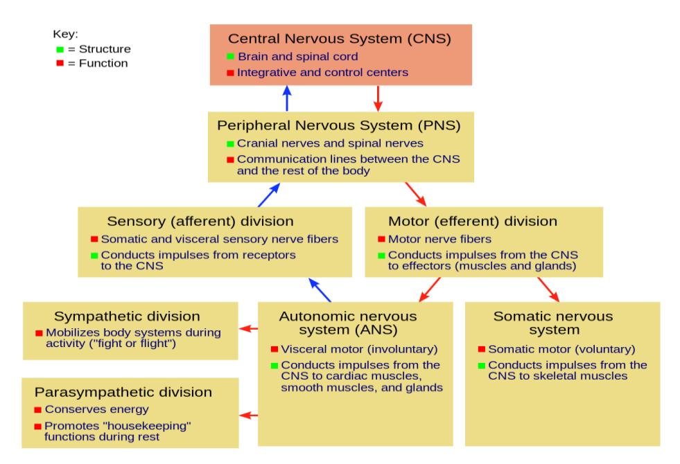

**Figure 13.1** Diagram of the Nervous System.

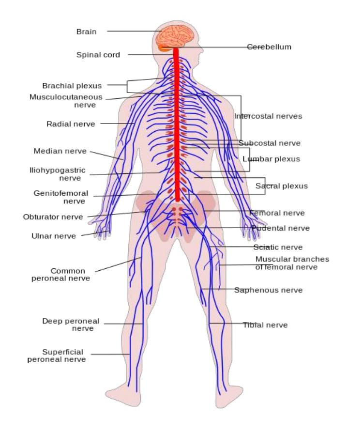

**Figure 13.2** Diagram of the Central and Peripheral Nervous Systems.

## **Your objectives for this lab are to:**

-   Identify and describe the structural features of the nervous system and explain their functional roles in receiving, integrating, and conducting information.
-   In models and diagrams of the human brain, you should be able to identify and list the function(s) of
    -   Cerebrum, fornix
    -   Ventricles: Lateral ventricles, Third ventricles, Fourth ventricle, cerebral aqueduct
    -   Cerebral hemispheres, right and left, longitudinal fissure, falx cerebri, Tentorium cerebelli.
    -   Convolutions Sulcus and gyrus, Central sulcus
    -   Corpus callosum
    -   Lobes: Frontal lobe, Parietal lobe, Temporal lobe, Occipital lobe
    -   Diencephalon: Pineal gland, Thalamus, Hypothalamus
    -   Choroid plexus
    -   Pituitary gland
    -   Brainstem: Midbrain, Pons, Medulla
    -   Cerebellum; Arbor Vitae
    -   Meninges: Dura mater, Arachnoid mater, Pia mater
        -   Epidural space, Sub arachnoid space, Arachnoid granulation, Superior sagittal sinus,
    -   Cerebrum functional centers:
        -   Primary motor area
        -   Primary somatosensory area
        -   Broca's area
        -   Wernicke's area
        -   Visual cortex
        -   Auditory cortex
    -   Dural venous sinuses
-   Spinal Cord Structure
    -   Horns (gray matter)
        -   Dorsal (posterior) horn
        -   Ventral (anterior) horn
    -   Columns (white matter)
        -   Posterior column
-   Lateral column
-   Anterior column
-   Central canal
-   Cauda equina
-   Dorsal root
-   Dorsal root ganglion
-   Posterior median sulcus
-   Anterior median fissure
    -   Ventral root
    -   Conus medullaris
-   Meninges for Spinal Cord
    -   Central canal of the spinal cord
    -   Dura mater
    -   Dural sinuses
    -   Epidural space
    -   Arachnoid mater
    -   Subarachnoid space
    -   Pia mater
-   Spinal Nerves
    -   Cervical plexus
    -   Intercostal nerves
    -   Brachial plexus
    -   Lumbar plexus
    -   Sacral plexus Dorsal chain ganglia
-   Cranial nerves
-   Olfactory bulbs and tracts
-   Optic nerve
    -   Optic chiasma
    -   Optic tract

## **In a dissected sheep brain or diagram, you should be able to identify and list the function(s) of the:**

-   Ventricles: Lateral ventricles, Third ventricles, Fourth ventricle
-   Cerebrum
    -   Cerebral hemispheres, right and left.
    -   Convolutions Sulcus and gyrus
-   Corpus callosum
-   Lobes: Frontal lobe, Parietal lobe, Temporal lobe, Occipital lobe
-   Diencephalon: Pineal gland, Thalamus, Hypothalamus
-   Pituitary gland
-   Brainstem: Midbrain, Pons, Medulla oblongata
-   Cerebellum
    -   Arbor vitae
-   Meninges: Dura mater, Pia mater
-   Optic nerve, optic chiasma, and optic tract
-   Olfactory bulb and olfactory nerve
-   Cerebrospinal fluid,
    -   Explain its function.

## **Prelab Activities**

## **Prelab Activity 13.1**

## **Definitions**

Using your textbook define all of the key terms in this chapter.

| Terms:       | Definitions |
|--------------|-------------|
| Gray matter  |             |
| White matter |             |

### Brain General Regions:

| Terms:            | Definitions |
|-------------------|-------------|
| Cerebrum          |             |
| Occipital lobe    |             |
| Temporal lobe     |             |
| Frontal lobe      |             |
| Parietal lobe     |             |
| Cerebellum        |             |
| Brain Stem        |             |
| Midbrain          |             |
| Pons              |             |
| Medulla oblongata |             |
| Diencephalon      |             |
| Thalamus          |             |
| Hypothalamus      |             |

## **General Functions**

### **Association Areas (i.e., the Cerebral Processing Centers)**

-   Precentral gyrus (primary motor area) \_\_\_\_\_\_\_\_\_\_\_\_\_\_\_\_\_\_\_\_\_\_\_\_\_\_\_\_\_\_\_
-   Post-central gyrus (primary somatosensory cortex) \_\_\_\_\_\_\_\_\_\_\_\_\_\_\_\_\_\_\_\_\_\_\_\_\_\_\_\_\_\_\_\_\_\_\_\_\_\_\_\_\_\_\_\_\_\_\_\_\_\_\_\_\_\_\_\_\_\_\_\_\_\_
-   General Interpretative area \_\_\_\_\_\_\_\_\_\_\_\_\_\_\_\_\_\_\_\_\_\_\_\_\_\_\_\_\_\_\_\_\_\_\_\_\_\_\_
-   Wernicke's Area \_\_\_\_\_\_\_\_\_\_\_\_\_\_\_\_\_\_\_\_\_\_\_\_\_\_\_\_\_\_\_\_\_\_\_\_\_\_\_\_\_\_\_\_\_\_\_\_
-   Broca's Area \_\_\_\_\_\_\_\_\_\_\_\_\_\_\_\_\_\_\_\_\_\_\_\_\_\_\_\_\_\_\_\_\_\_\_\_\_\_\_\_\_\_\_\_\_\_\_\_\_\_\_

## **Diencephalon**

-   Thalamus \_\_\_\_\_\_\_\_\_\_\_\_\_\_\_\_\_\_\_\_\_\_\_\_\_\_\_\_\_\_\_\_\_\_\_\_\_\_\_\_\_\_\_\_\_\_\_\_\_\_\_\_\_
-   Hypothalamus \_\_\_\_\_\_\_\_\_\_\_\_\_\_\_\_\_\_\_\_\_\_\_\_\_\_\_\_\_\_\_\_\_\_\_\_\_\_\_\_\_\_\_\_\_\_\_\_\_\_
-   Pituitary gland \_\_\_\_\_\_\_\_\_\_\_\_\_\_\_\_\_\_\_\_\_\_\_\_\_\_\_\_\_\_\_\_\_\_\_\_\_\_\_\_\_\_\_\_\_\_\_\_\_\_
-   Pineal gland \_\_\_\_\_\_\_\_\_\_\_\_\_\_\_\_\_\_\_\_\_\_\_\_\_\_\_\_\_\_\_\_\_\_\_\_\_\_\_\_\_\_\_\_\_\_\_\_\_\_\_
-   Optic nerves \_\_\_\_\_\_\_\_\_\_\_\_\_\_\_\_\_\_\_\_\_\_\_\_\_\_\_\_\_\_\_\_\_\_\_\_\_\_\_\_\_\_\_\_\_\_\_\_\_\_\_
-   Optic chiasma \_\_\_\_\_\_\_\_\_\_\_\_\_\_\_\_\_\_\_\_\_\_\_\_\_\_\_\_\_\_\_\_\_\_\_\_\_\_\_\_\_\_\_\_\_\_\_\_\_\_
-   Optic tract \_\_\_\_\_\_\_\_\_\_\_\_\_\_\_\_\_\_\_\_\_\_\_\_\_\_\_\_\_\_\_\_\_\_\_\_\_\_\_\_\_\_\_\_\_\_\_\_\_\_\_\_\_
-   Midbrain \_\_\_\_\_\_\_\_\_\_\_\_\_\_\_\_\_\_\_\_\_\_\_\_\_\_\_\_\_\_\_\_\_\_\_\_\_\_\_\_\_\_\_\_\_\_\_\_\_\_\_\_\_\_
-   Pons \_\_\_\_\_\_\_\_\_\_\_\_\_\_\_\_\_\_\_\_\_\_\_\_\_\_\_\_\_\_\_\_\_\_\_\_\_\_\_\_\_\_\_\_\_\_\_\_\_\_\_\_\_\_\_\_\_
-   Medulla \_\_\_\_\_\_\_\_\_\_\_\_\_\_\_\_\_\_\_\_\_\_\_\_\_\_\_\_\_\_\_\_\_\_\_\_\_\_\_\_\_\_\_\_\_\_\_\_\_\_\_\_\_\_\_

## **Cerebellum**

-   Arbor vitae \_\_\_\_\_\_\_\_\_\_\_\_\_\_\_\_\_\_\_\_\_\_\_\_\_\_\_\_\_\_\_\_\_\_\_\_\_\_\_\_\_\_\_\_\_\_\_\_\_\_\_\_

## **CNS - Brain & Spinal Cord Meninges**

-   Meninges \_\_\_\_\_\_\_\_\_\_\_\_\_\_\_\_\_\_\_\_\_\_\_\_\_\_\_\_\_\_\_\_\_\_\_\_\_\_\_\_\_\_\_\_\_\_\_\_\_\_\_\_\_
-   Dura mater \_\_\_\_\_\_\_\_\_\_\_\_\_\_\_\_\_\_\_\_\_\_\_\_\_\_\_\_\_\_\_\_\_\_\_\_\_\_\_\_\_\_\_\_\_\_\_\_\_\_\_\_
-   Dural sinuses \_\_\_\_\_\_\_\_\_\_\_\_\_\_\_\_\_\_\_\_\_\_\_\_\_\_\_\_\_\_\_\_\_\_\_\_\_\_\_\_\_\_\_\_\_\_\_\_\_\_
-   Epidural space \_\_\_\_\_\_\_\_\_\_\_\_\_\_\_\_\_\_\_\_\_\_\_\_\_\_\_\_\_\_\_\_\_\_\_\_\_\_\_\_\_\_\_\_\_\_\_\_\_
-   Arachnoid mater \_\_\_\_\_\_\_\_\_\_\_\_\_\_\_\_\_\_\_\_\_\_\_\_\_\_\_\_\_\_\_\_\_\_\_\_\_\_\_\_\_\_\_\_\_\_\_\_
-   Subarachnoid space \_\_\_\_\_\_\_\_\_\_\_\_\_\_\_\_\_\_\_\_\_\_\_\_\_\_\_\_\_\_\_\_\_\_\_\_\_\_\_\_\_\_\_\_\_
-   Villi \_\_\_\_\_\_\_\_\_\_\_\_\_\_\_\_\_\_\_\_\_\_\_\_\_\_\_\_\_\_\_\_\_\_\_\_\_\_\_\_\_\_\_\_\_\_\_\_\_\_\_\_\_\_\_\_\_\_
-   Pia mater \_\_\_\_\_\_\_\_\_\_\_\_\_\_\_\_\_\_\_\_\_\_\_\_\_\_\_\_\_\_\_\_\_\_\_\_\_\_\_\_\_\_\_\_\_\_\_\_\_\_\_\_\_

## **Organization of spinal cord**

-   epidural space \_\_\_\_\_\_\_\_\_\_\_\_\_\_\_\_\_\_\_\_\_\_\_\_\_\_\_\_\_\_\_\_\_\_\_\_\_\_\_\_\_\_\_\_\_\_\_\_\_
-   white columns \_\_\_\_\_\_\_\_\_\_\_\_\_\_\_\_\_\_\_\_\_\_\_\_\_\_\_\_\_\_\_\_\_\_\_\_\_\_\_\_\_\_\_\_\_\_\_\_\_\_
    -   posterior funiculus \_\_\_\_\_\_\_\_\_\_\_\_\_\_\_\_\_\_\_\_\_\_\_\_\_\_\_\_\_\_\_\_\_\_\_\_\_\_\_\_\_\_\_\_
    -   anterior funiculus \_\_\_\_\_\_\_\_\_\_\_\_\_\_\_\_\_\_\_\_\_\_\_\_\_\_\_\_\_\_\_\_\_\_\_\_\_\_\_\_\_\_\_\_\_
    -   lateral funiculus \_\_\_\_\_\_\_\_\_\_\_\_\_\_\_\_\_\_\_\_\_\_\_\_\_\_\_\_\_\_\_\_\_\_\_ \_\_\_\_\_\_\_\_\_\_
-   gray matter \_\_\_\_\_\_\_\_\_\_\_\_\_\_\_\_\_\_\_\_\_\_\_\_\_\_\_\_\_\_\_\_\_\_\_\_\_\_\_\_\_\_\_\_\_\_\_\_\_\_\_\_
-   gray commissure \_\_\_\_\_\_\_\_\_\_\_\_\_\_\_\_\_\_\_\_\_\_\_\_\_\_\_\_\_\_\_\_\_\_\_\_\_\_\_\_\_\_\_\_\_\_\_
-   posterior horn \_\_\_\_\_\_\_\_\_\_\_\_\_\_\_\_\_\_\_\_\_\_\_\_\_\_\_\_\_\_\_\_\_\_\_\_\_\_\_\_\_\_\_\_\_\_\_\_\_\_
-   anterior horn \_\_\_\_\_\_\_\_\_\_\_\_\_\_\_\_\_\_\_\_\_\_\_\_\_\_\_\_\_\_\_\_\_\_\_\_\_\_\_\_\_\_\_\_\_\_\_\_\_\_\_
-   lateral horn \_\_\_\_\_\_\_\_\_\_\_\_\_\_\_\_\_\_\_\_\_\_\_\_\_\_\_\_\_\_\_\_\_\_\_\_\_\_\_\_\_\_\_\_\_\_\_\_\_\_\_\_
-   central canal \_\_\_\_\_\_\_\_\_\_\_\_\_\_\_\_\_\_\_\_\_\_\_\_\_\_\_\_\_\_\_\_\_\_\_\_\_\_\_\_\_\_\_\_\_\_\_\_\_\_
-   posterior median sulcus \_\_\_\_\_\_\_\_\_\_\_\_\_\_\_\_\_\_\_\_\_\_\_\_\_\_\_\_\_\_\_\_\_\_\_\_\_\_\_\_\_\_
-   anterior median fissure \_\_\_\_\_\_\_\_\_\_\_\_\_\_\_\_\_\_\_\_\_\_\_\_\_\_\_\_\_\_\_\_\_\_\_\_\_\_\_\_\_\_\_

## **Prelab Activity 13.2**

Identify the following structures (Figures 13.3 to 13.7).

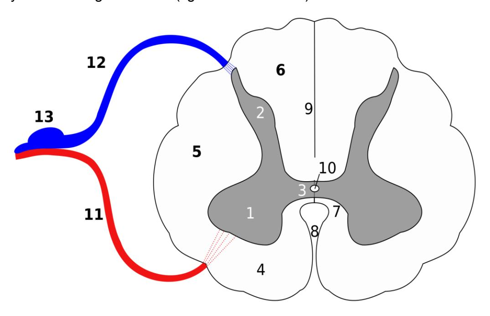

Figure 13.3 Unlabeled Spinal Cord Cross Section.

1.  

2.  

3.  

4.  

5.  

6.  

7.  

8.  

9.  

10. 

11. 

12. 

13. 

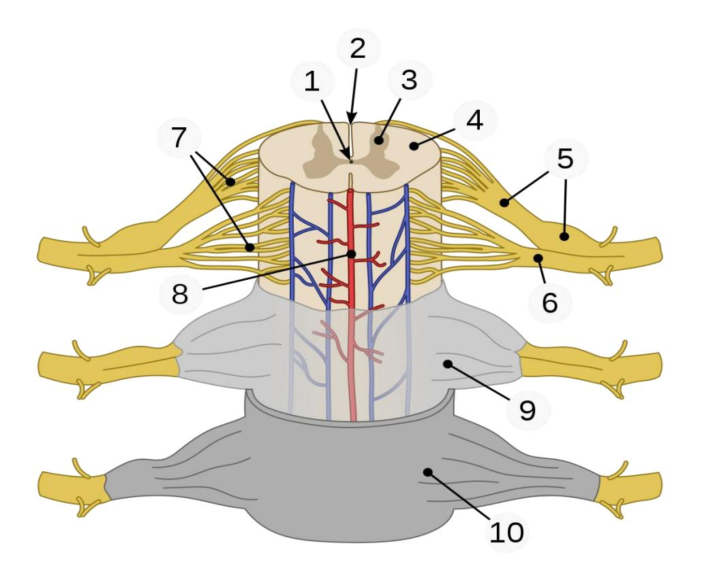

**Figure 13.4** Meninges and Structures of the Spinal Cord.

Identify the labelled structures, except number 8.

| 1\. | 6\.  |
|-----|------|
| 2\. | 7\.  |
| 3\. | 9\.  |
| 4\. | 10\. |
| 5\. |      |

Label the structures and regions of Figure 13.5.

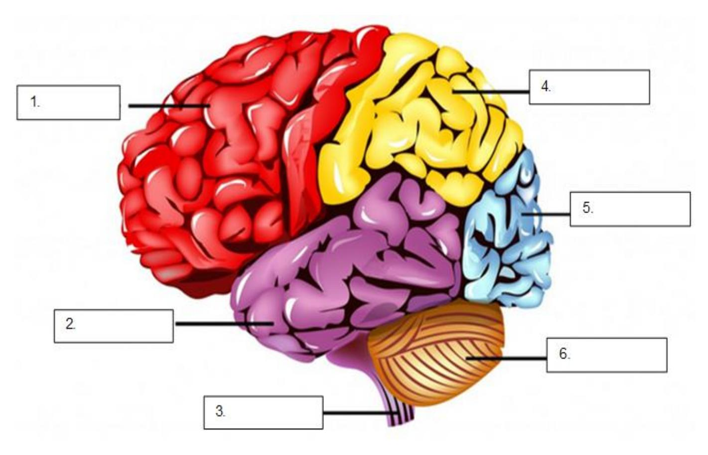

**Figure 13.5** The Human Brain.

|     |     |
|-----|-----|
| 1\. | 4\. |
| 2\. | 5\. |
| 3\. | 6\. |

Identify the following meningeal structures of the brain:

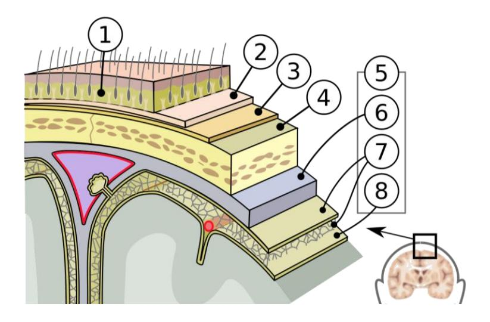

**Figure 13.6** Meninges of the Brain.

1.  \_\_\_\_\_\_\_\_\_\_\_\_\_\_\_\_\_\_\_\_\_\_\_\_\_
2.  \_\_\_\_\_\_\_\_\_\_\_\_\_\_\_\_\_\_\_\_\_\_\_\_\_
3.  \_\_\_\_\_\_\_\_\_\_\_\_\_\_\_\_\_\_\_\_\_\_\_\_\_
4.  \_\_\_\_\_\_\_\_\_\_\_\_\_\_\_\_\_\_\_\_\_\_\_\_\_
5.  \_\_\_\_\_\_\_\_\_\_\_\_\_\_\_\_\_\_\_\_\_\_\_\_\_
6.  \_\_\_\_\_\_\_\_\_\_\_\_\_\_\_\_\_\_\_\_\_\_\_\_\_
7.  \_\_\_\_\_\_\_\_\_\_\_\_\_\_\_\_\_\_\_\_\_\_\_\_\_
8.  \_\_\_\_\_\_\_\_\_\_\_\_\_\_\_\_\_\_\_\_\_\_\_\_\_

Label all of the regions and structures in the brain. When possible, indicate their function.

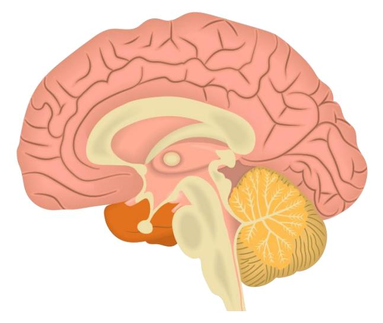

**Figure 13.7** The Mid-Sagittal Section of the Brain.

## **Lab Activities**

### **Brain**

## **Terms**

## **Cerebrum: Structural**

-   Frontal lobe

-   Parietal lobe

-   Temporal lobe

-   Occipital lobe

-   Gyrus

-   Sulcus

-   Central sulcus

-   Lateral sulcus\*

-   Longitudinal fissure

-   Corpus callosum

-   White matter

-   Gray matter

## **Lab Activity 13.1**

-   From the models' storage area obtain a plastic model of the human brain.

-   As a group, identify and label the structures and regions. Palpate the structures you are identifying. Then take a picture for your later reference.

-   Have another group, or your instructor review your demonstrations.

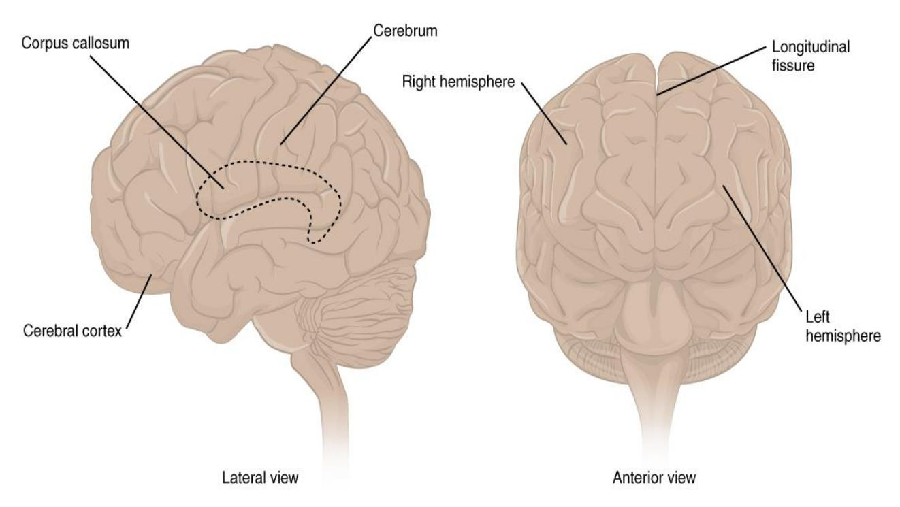

**Figure 13.8** Diagram of the Cerebrum.

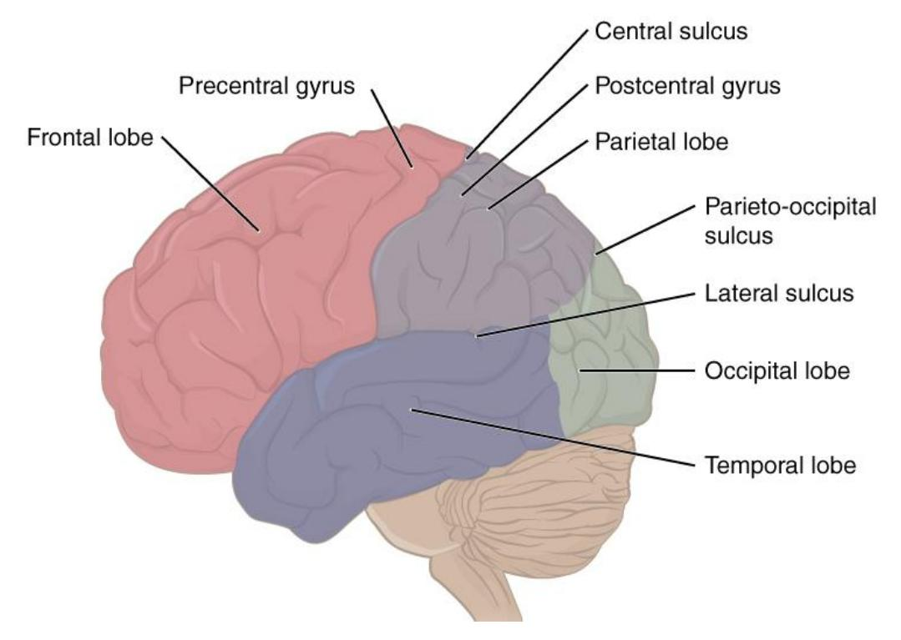

**Figure 13.9 Lobes of Cerebral Cortex**

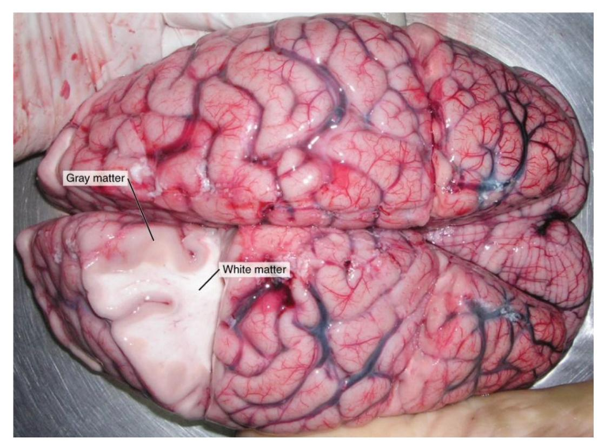

**Figure 13.10** White and Gray Matter in a Human Brain.

## **Lab Activity 13.2**

-   As a group, identify and label the functional regions of the brain, diencephalon, the cerebellum as well as the brain stem. Palpate the regions and structures you are identifying. Then take a picture for your later reference.
-   Have another group, or your instructor review your demonstrations.

### **Cerebrum: Functional Regions**

-   Primary motor area

-   Primary somatosensory area

-   Broca's area

-   Wernicke's area

-   Visual cortex

-   Auditory cortex

-   Olfactory cortex

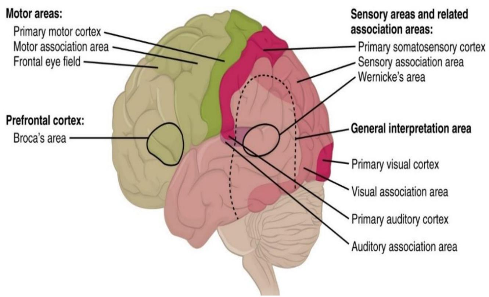

**Figure 13.11** The Cortical Areas of the Brain.

## **Diencephalon**

-   Thalamus

-   Hypothalamus

-   Pineal body/gland

-   Fornix

-   Pituitary gland

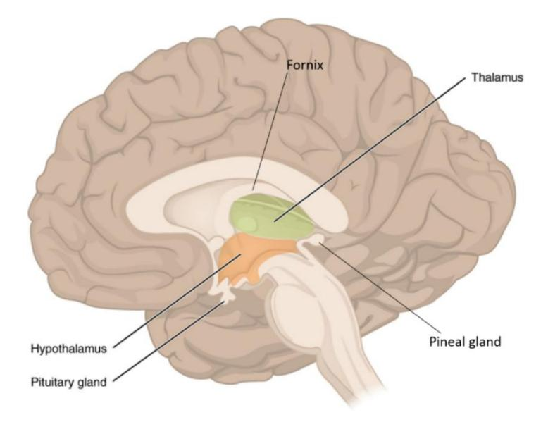

**Figure 13.12** The Diencephalon.

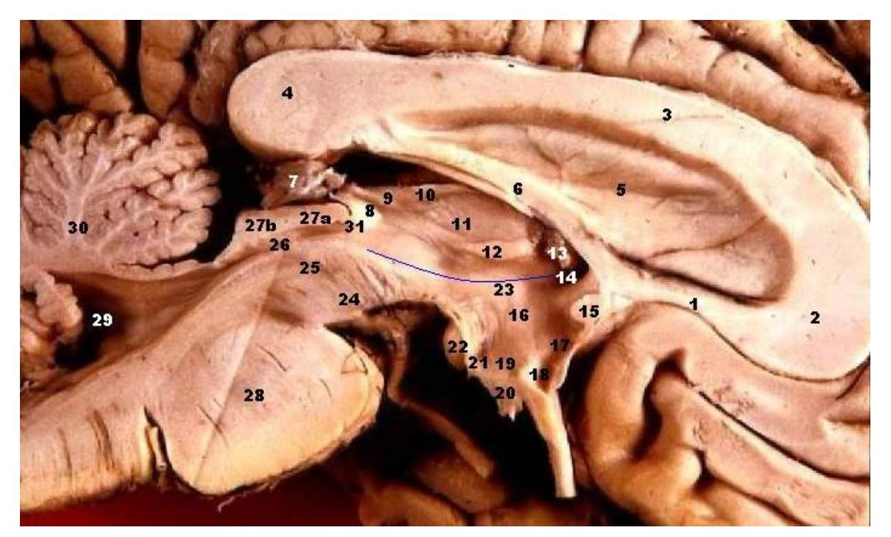

**Figure 13.13** Human Brain (Left Midsagittal View – Closeup).

## **Cerebellum**

### **Terms**

• Arbor vitae

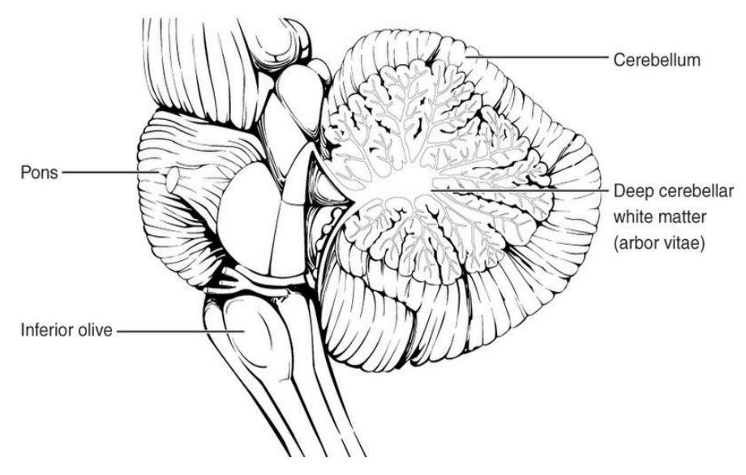

**Figure 13.14 Cerebellum**

### **Brain Stem**

### **Terms**

• Midbrain • Pons • Medulla Oblongata

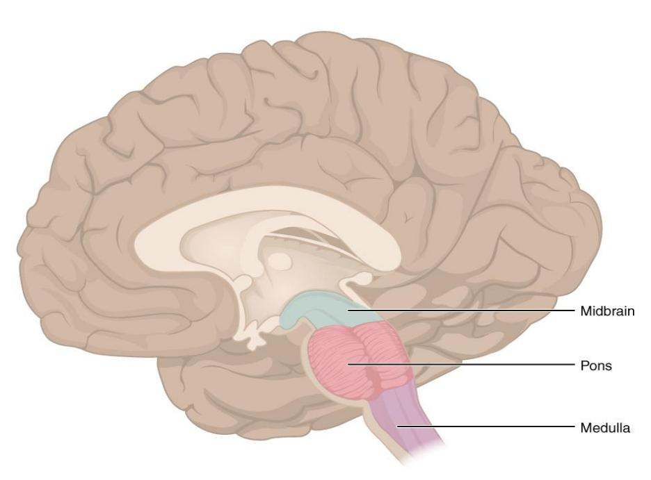

**Figure 13.15** Brain Stem.

## **Lab Activity 13.3**

Identify the structures in figure 13.17.

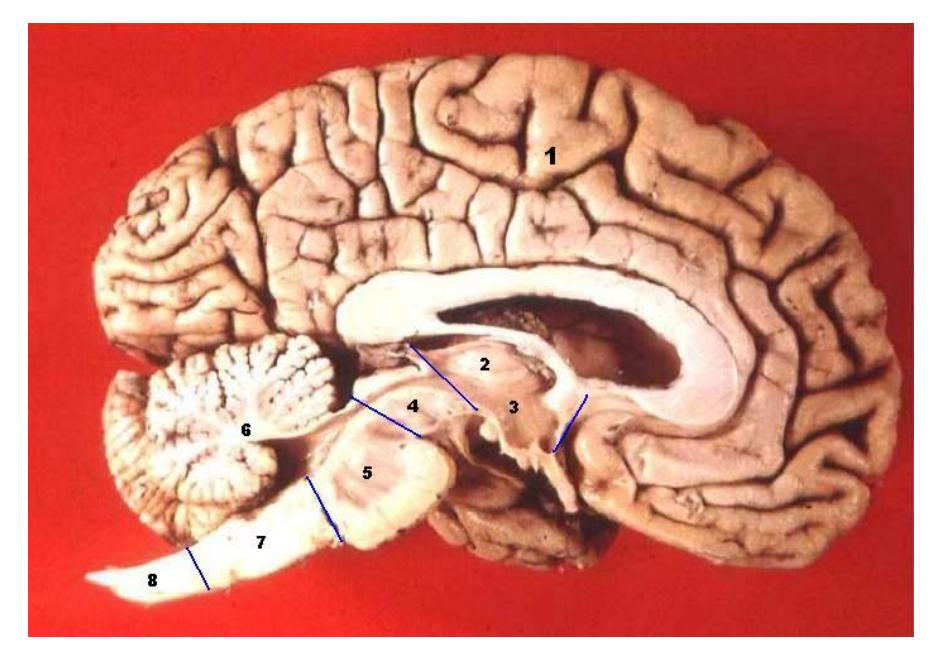

**Figure 13.16** The Human Brain - Midsagittal Cut.

1.  \_\_\_\_\_\_\_\_\_\_\_\_\_\_\_\_\_\_\_\_\_
2.  \_\_\_\_\_\_\_\_\_\_\_\_\_\_\_\_\_\_\_\_\_
3.  \_\_\_\_\_\_\_\_\_\_\_\_\_\_\_\_\_\_\_\_\_
4.  \_\_\_\_\_\_\_\_\_\_\_\_\_\_\_\_\_\_\_\_\_
5.  \_\_\_\_\_\_\_\_\_\_\_\_\_\_\_\_\_\_\_\_\_
6.  \_\_\_\_\_\_\_\_\_\_\_\_\_\_\_\_\_\_\_\_\_
7.  \_\_\_\_\_\_\_\_\_\_\_\_\_\_\_\_\_\_\_\_\_
8.  \_\_\_\_\_\_\_\_\_\_\_\_\_\_\_\_\_\_\_\_\_

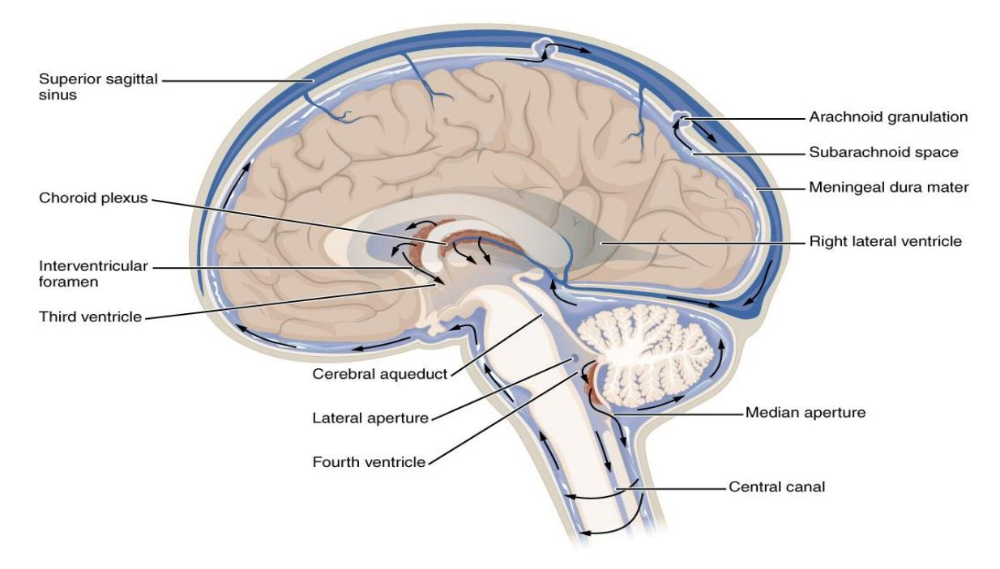

### **Figure 13.17** Cerebrospinal Fluid Circulation.

## **Meninges of the Brain**

## **Terms**

-   Dura mater
    -   Falx cerebri
    -   Tentorium cerebelli
    -   Dural venous sinuses
        -   Superior sagittal sinus
-   Arachnoid mater
    -   Arachnoid granulation
    -   Choroid plexuses
    -   Subarachnoid space
-   Pia mater

## **Lab Activity 13.4**

As a group obtain one of the brain meninges models.

-   Locate and label as many of the structures listed above. Ask your instructor for assistance, if needed.
-   Finally review the review the meninges on the spinal cord models or plaques.

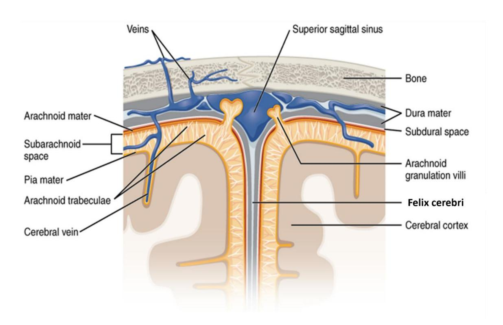

**Figure 13.18** Meningeal Layers including the Felix Cerebri.

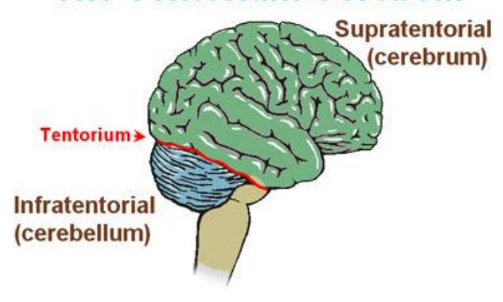

**Figure 13.19** The Tentorium Cerebelli

## **Other Structures**

Optic nerves

-   Olfactory bulbs and tracts
-   Optic chiasm

## **Lab Activity 13.5.**

As a group, obtain one of the brain models locate and label the cranial nerves listed above.

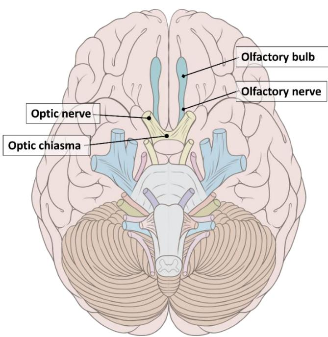

**Figure 13.20** Select Human Cranial Nerves.

## **Spinal Cord Structures**

### **Terms**

-   Dorsal (Posterior) root
-   Dorsal root ganglion
-   Ventral (Anterior) root
-   Horns (gray matter)
    -   Dorsal (posterior) horn
    -   Ventral (anterior) horn
-   Columns (white matter)
    -   Posterior column (funiculus)
    -   Lateral column (funiculus)
    -   Anterior column (funiculus)
-   Central canal
-   Conus medullaris
-   Cauda equina

## **Lab Activity 13.6.**

As a group, obtain one of the spinal cord cross section models.

-   Locate and label as many of the structures listed above.
-   Ask your instructor for assistance, if needed.
-   Take pictures of your labeled model for a later review.

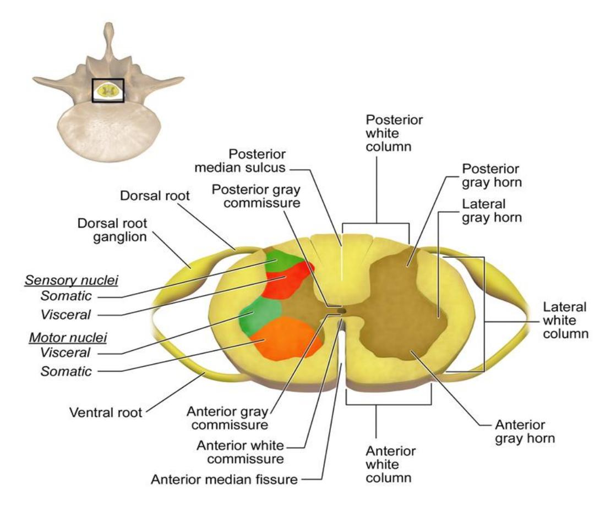

**Figure 13.21** Organization of the Spinal Cord (Cross Section).

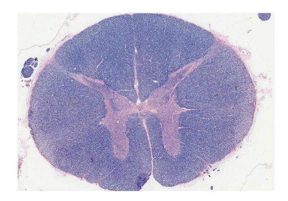

**Figure 13.22** Spinal Cord Cross Section.

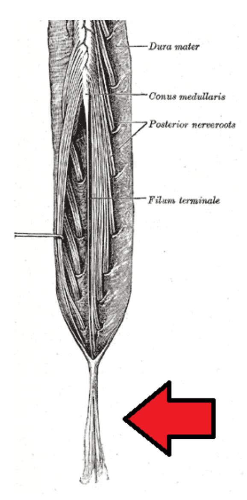

**Figure 13.23** Cauda Equina and Conus Medullaris (Posterior View, with Cauda Equina Pointed Out)**.**

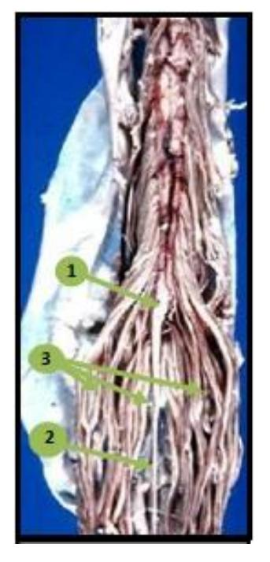

**Figure 13.24** Image of a Human Cauda Equina (Anterior View). The numbers depicted identify the three regions below the spinal cord: 1 Conus medullaris, #2 Filum terminale, and #3 Cauda equina.

## **Meninges of the Spinal Cord**

-   Central canal of the spinal cord

-   Dura mater

-   Dural sinuses

-   Epidural space

-   Arachnoid mater

-   Subarachnoid space

-   Pia mater

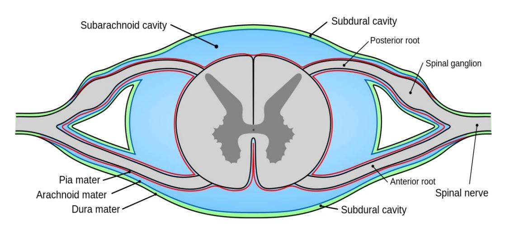

**Figure 13.25** The Meninges of the Spinal Cord.

## **Meninges:**

-   Dura mater
    -   Dural sinuses
    -   Epidural space
-   Arachnoid mater
    -   Subarachnoid space
-   Pia mater

## **Spinal cord:**

-   Horns (gray matter)
    -   Dorsal (posterior) horn
    -   Ventral (anterior) horn
-   Columns (white matter)
    -   Posterior column (funiculus)
    -   Lateral column (funiculus)
    -   Anterior column (funiculus)
-   Central canal of the spinal cord
-   Dorsal (Posterior) root
-   Dorsal root ganglion
-   Ventral (Anterior) root

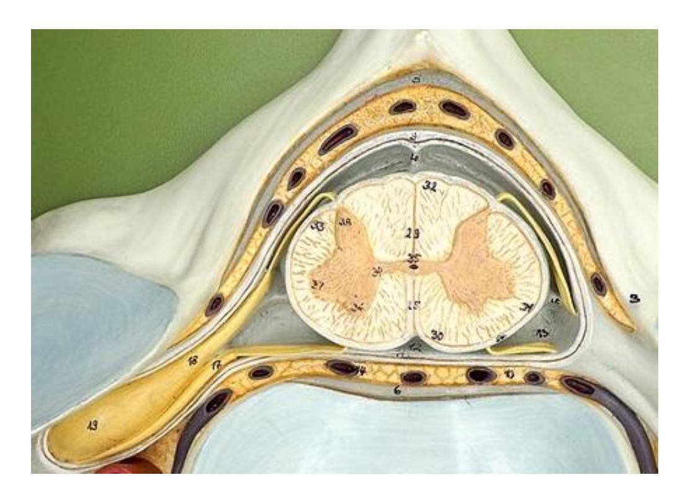

**Figure 13.26** Spinal Cord Cross Section.

## **Dissection of the Sheep Brain**

-   Cerebrum

    -   All four lobes
    -   Corpus callosum

-   Cerebellum

    -   Arbor vitae

-   Diencephalon

    -   Thalamus
    -   Hypothalamus

-   Pineal gland/body

-   Pituitary gland

-   Brain stem

    -   Midbrain
    -   Pons
    -   Medulla oblongata

-   Optic nerve

    -   Optic chiasm
    -   Optic tract

-   Olfactory bulbs and tracts

## **Lab Activity 13.7: Dissection of the Sheep or Pig Brains**

The objective of this activity is to carefully dissect a sheep brain and to locate and identify the structures noted in the list above. You will form teams of two to three. Obtain the following materials from the staging area on the side of the lab: dissection tray, brain, set of dissection tools, dissection pins and some tape for labeling the parts following the dissection.

**Note: This is a gloves and goggles lab so everyone must be wearing gloves and goggles during the dissection.**

*Read the following steps carefully before you begin.*

1.  Place the sheep's brain in the tray with the dorsal side on the top as noted in Fig 13.28 . The brains may have a thick tough membrane covering the entire structure. This is the dura mater. You need to carefully remove this covering using your scissors. You need to carefully cut around the cerebellum, pituitary gland, or optic nerve so you do not remove these structures. Your instructor will demonstrate the procedure.

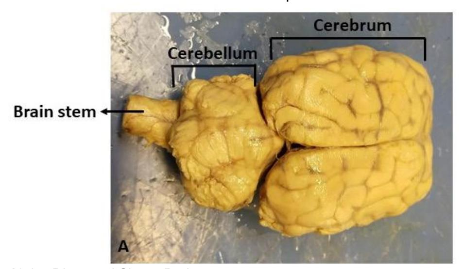

**Figure 13.27** Dissected Sheep Brain.

2.  After the dura mater is removed, you can identify the cerebrum and its longitudinal fissure separating the left and right cerebral hemispheres as well as the cerebellum.

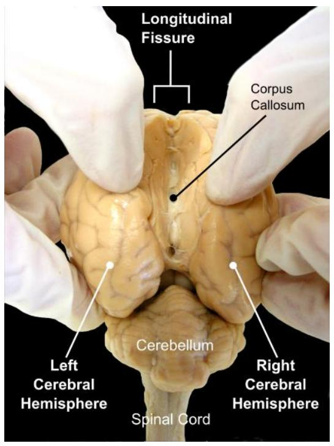

**Figure 13.28** Sheep Brain (Opening the Longitudinal Fissure).

3.  Reposition the brain so that the ventral side is facing you (Fig 13.30). Identify the cerebellum, optic chiasma, optic nerves. If it is still attached locate the pituitary gland.

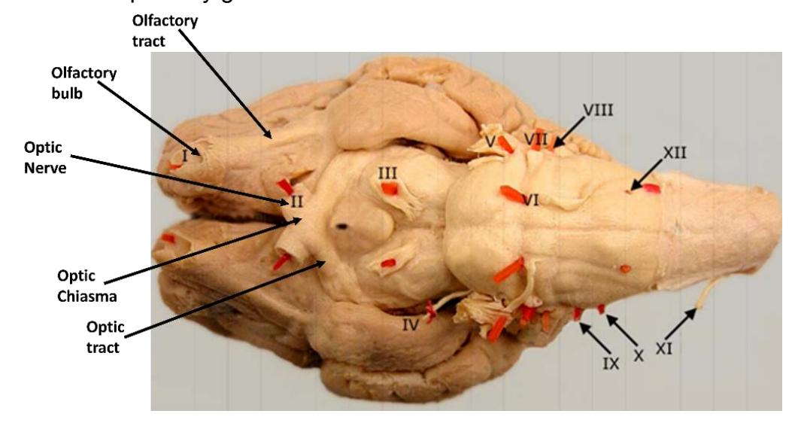

**Figure 13.29** Cranial Nerves of the Sheep.

4.  Reposition the brain back to the dorsal side. Locate the longitudinal fissure. Now, with a scalpel gently make a cut through the fissure. This will butterfly the brain into two left and right halves (Fig 13.31). Be sure to cut all the way through the pituitary gland if it is present.

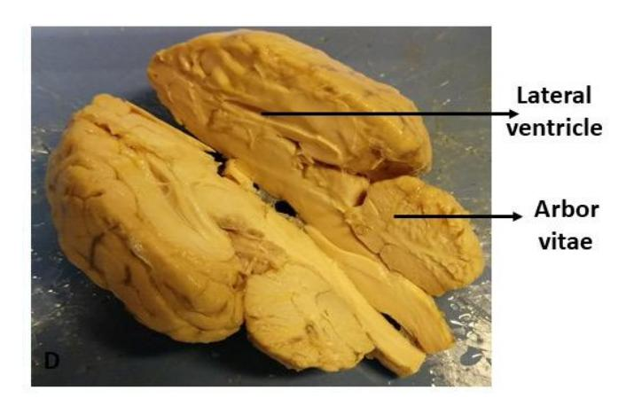

**Figure 13.30** Dissected Sheep Brain (Mid-Sagittal Section).

5.  Locate the following structures on either of the halves: pia mater, gyri and sulci, the cerebrum, and its lobes(frontal, temporal, parietal, and occipital), thalamus, hypothalamus, pineal gland, pons, medulla, corpus collosum, lateral ventricles, third ventricle, cerebellum, pituitary gland, olfactory bulb, and olfactory nerve.

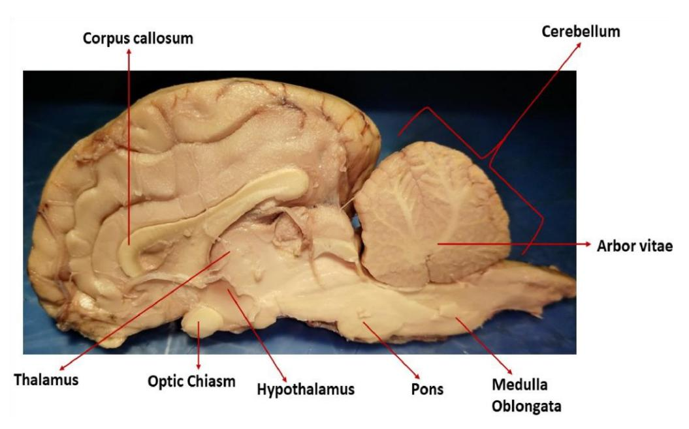

**Figure 13.31** Dissected Sheep Brain (Right Lobe, Mid-Sagittal section).

6.  Compare the structures that you see in your dissection specimen to those in the human brain models.
7.  Place dissection pins in the brain structures you need to identify from the dissection objectives above. Print the name of the structure on some tape and attach it to the proper pins. Take a picture of the labelled brain for your study guide.
8.  When you are done observing the pig/sheep brain specimen and have completed the exercise, dispose of it as directed by your instructor. Wash and dry your dissection instruments, pins, and tray. Return these to the staging area. Clean the tables with Lysol and wait for additional directions from your instructor.

**Watch** these videos to learn about the sheep brain dissection and the meninges:

### **Sheep brain dissection videos:**

1.  Sheep Brain Dissection: "Sheep brain dissection \| Dr. Basu's Easy Anatomy & Physiology" [https://youtu.be/yCztTjEt8ok?si=aPOCp0\\\_rEtO278T7.](https://youtu.be/yCztTjEt8ok?si=aPOCp0_rEtO278T7)
2.  Anatomy of the sheep brain video for anatomy class practice for the practical exam. Scientist Cindy. [**https://youtu.be/U3foQgifBVA?si=hQFcXZ0bDSKmROL2**](https://youtu.be/U3foQgifBVA?si=hQFcXZ0bDSKmROL2){.uri}.

## **Meninges Videos**

-   Meninges of the Brain \| 3D Anatomy Tutorial. AnatomyZone. Meninges. [https://youtu.be/XSMPB7y41E8?si=Iv-Ma2t0k\\\_QQ7T-T](https://youtu.be/XSMPB7y41E8?si=Iv-Ma2t0k_QQ7T-T)
-   Meninges and Dural venous sinuses. [The Noted Anatomist.](https://www.youtube.com/@TheNotedAnatomist) [https://youtu.be/WTu31680f6s?si=1EG9QbJqP0l-aPIY.](https://youtu.be/WTu31680f6s?si=1EG9QbJqP0l-aPIY)
-   Spinal Cord, Spinal Nerves, and Meninges. Dr. P. [https://youtu.be/rVcykBTmsX4?si=ForFSv4QN5n5434K.](https://youtu.be/rVcykBTmsX4?si=ForFSv4QN5n5434K)

## **Post Lab Activities**

## **Check Your Understanding**

### **Post Lab Activity 13.1**

Describe the differences in the composition between gray and white matter. Provide examples of where each is found in the brain.

### **Crossword Puzzles**

Complete the following crosswords.

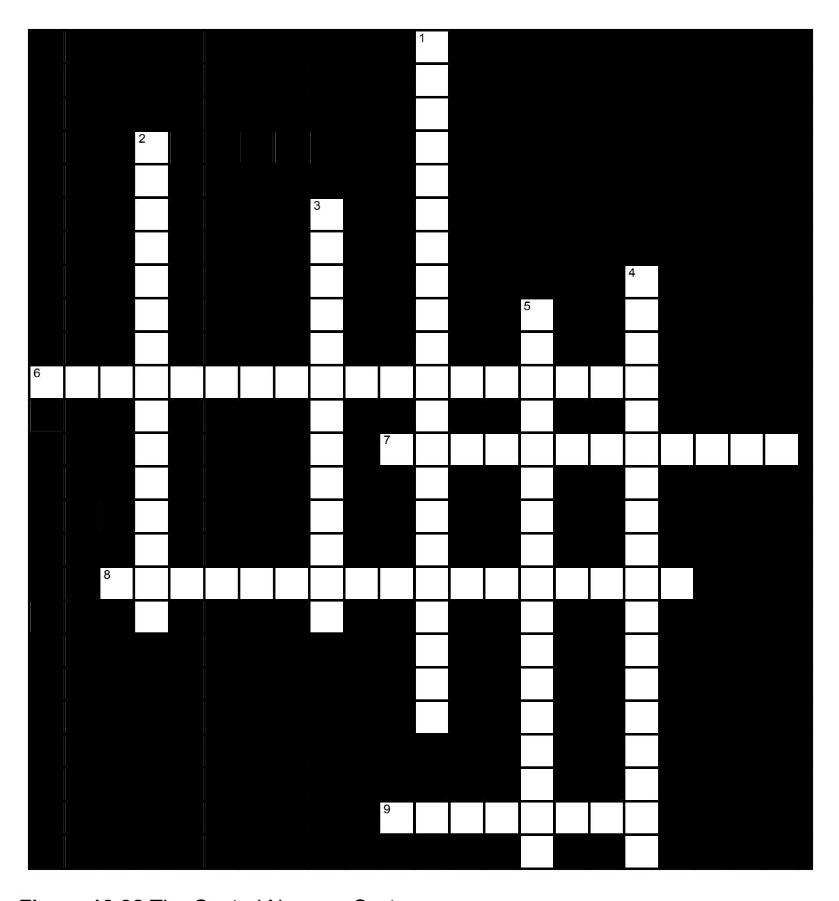

**Figure 13.32** The Central Nervous System.

### **Across**

-   6 In the inferior regions, there is a gap between the \_\_\_\_\_ and the \_\_\_\_\_ into which anesthetics are often introduced ("epidural" - "upon the dura") (4,5,9)

-   7 The butterfly-shaped central core of gray matter in the spinal cord can be divided into three regions. The \_\_\_\_\_ contains the cell bodies of somatic motor neurons. (8,4)

-   8 Neurons of the dorsal horn receive signals from those in the \_\_\_\_\_. Their own axons extend to reach neurons in the brain stem, diencephalon, etc. (6,4,7)

-   9 \_\_\_\_\_ are white-matter columns consisting of the myelinated axons of neurons associated with the spinal cord. (8)

### **Down**

-   1 After circulation the CSF returns to the blood by passing through the \_\_\_\_\_, which are clusters of the arachnoid mater which project into the dural sinuses and act as one-way valves. (9,12)

-   2 The axons of the neurons from the \_\_\_\_\_ and \_\_\_\_\_ horns emerge together as the ventral roots. (7,8)

-   3 The butterfly-shaped central core of gray matter in the spinal cord can be divided into three regions. The \_\_\_\_\_ contains interneurons. (9,4)

-   4 \_\_\_\_\_ fills the ventricles and surrounds the brain and spinal cord, acting as a shock absorber, distributing nutritive materials, removing wastes, and providing a chemically stable environment. (13,5)

-   5 After the CSF is formed, it circulates from the lateral ventricles to the third and fourth ventricles, and from there to the \_\_\_\_-\_\_ \_\_\_\_ and central canal of the spinal cord. (3-9,5)

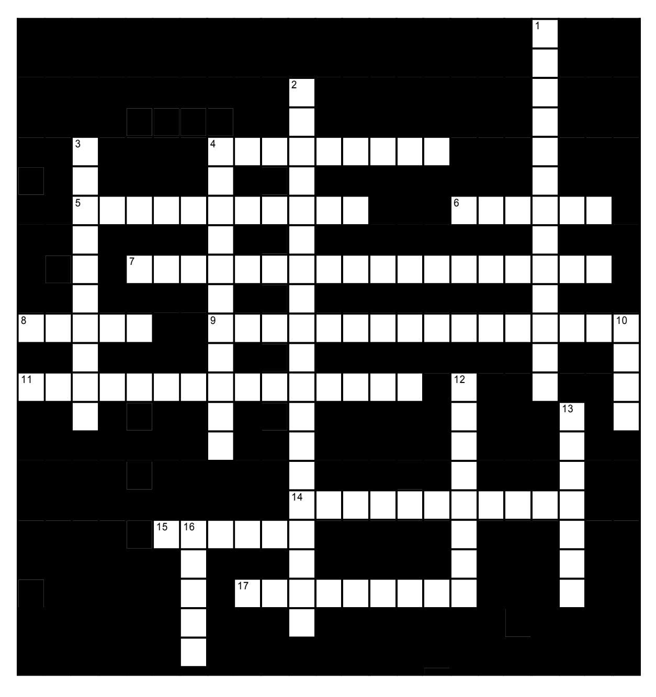

**Figure 13.33** Brain: Anatomical and Functional Regions.

### **Across**

-   4 A patient who is able to speak but who chooses words at random and is unable to connect thought to language is likely to have damage to \_\_\_\_ area. (9)

-   5 The \_\_\_\_\_ areas of the cerebral cortex allow us to integrate and consider information. (11)

-   6 The outermost layer of an organ or structure (such as the cerebrum or kidney) is often referred to as the \_\_\_\_\_. (6)

-   7 Gray matter is found in the cortex of the \_\_\_\_ and \_\_\_\_\_. (8,10)

-   8 The \_\_\_\_\_ areas of the cerebral cortex control voluntary movement. (5)

-   9 The \_\_\_\_\_ cortex allows us to perceive sound and is located in the \_\_\_\_\_ lobes. (8,8)

-   11 White matter is composed of \_\_\_\_ \_\_\_\_. (10,5)

-   14 The folds and convolutions of the cerebral hemispheres are named for their three-dimensional forms. The shallow grooves are called \_\_\_\_\_ (singular, \_\_\_\_\_). (5,6)

-   15 A patient who is unable to speak despite having a clear concept of what is conceived (e.g., wanting coffee but unable to think of the word 'coffee') has most likely incurred damage to \_\_\_\_\_ area (6)

-   17 The folds and convolutions of the cerebral hemispheres are named for their three-dimensional forms. The ridges are called \_\_\_\_\_ (singular, \_\_\_\_\_). (4,5)

### **Down**

-   1 The visual cortex is responsible for sight and is located in the \_\_\_\_\_ \_\_\_\_\_. (9,4)

-   2 The two hemispheres of the brain are separated by a deep cleft called the \_\_\_\_ \_\_\_. (12,7)

-   3 \_\_\_ \_\_\_ is found in the central region of all major CNS areas. (4,6)

-   4 \_\_\_\_\_ \_\_\_\_ surrounds the central core of gray matter in the CNS. (5,6)

-   10 The \_\_\_\_\_ hemisphere usually controls math and logic. (4)

-   12 The folds and convolutions of the cerebral hemispheres are named for their three-dimensional forms. The deep grooves between gyri or regions are called \_\_\_\_\_. (8)

-   13 The \_\_\_\_\_ areas of the cerebral cortex are responsible for conscious awareness of sensation. (7)

-   16 The \_\_\_\_\_ hemisphere usually controls visual and spatial skills, emotion, and artistic skills. (5)

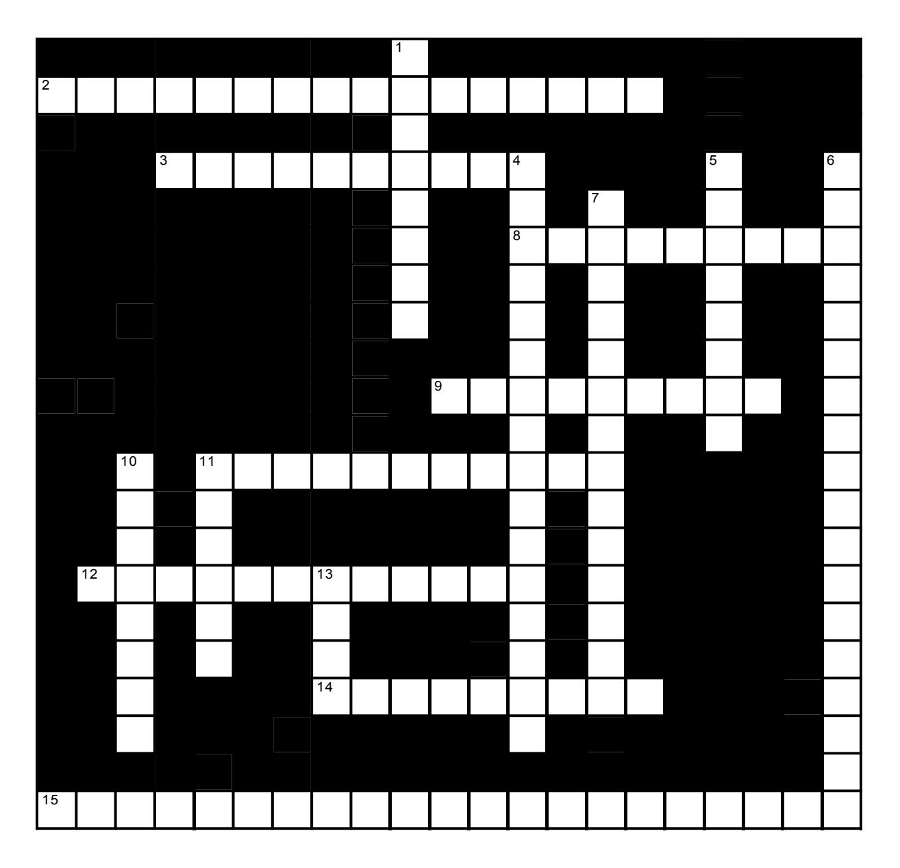

**Figure 13.34** Brain components.

### **Across**

-   2 Much of the influence of the hypothalamus is due to the release of hormones which control the release of other hormones: appropriately enough, their names usually include the phrase, "\_\_\_\_\_\_ \_\_\_\_\_\_". (9,7)

-   3 Integration of impulses from the motor cortex and sensory pathways, and comparison of actual to intended motion, is the function of the \_\_\_\_\_. (10)

-   8 The tough, fibrous, double-layered, outermost meninx is the \_\_\_\_ \_\_\_\_\_. (4,5)

-   9 The continuation of automatic behaviors necessary for survival (e.g., breathing) is controlled by the \_\_\_\_ \_\_\_\_. (5,4)

-   11 The separation between the cerebral hemispheres is reinforced by an extension of the dura mater called the \_\_\_\_ \_\_\_\_\_ (4,7)

-   12 The thalamus, hypothalamus, and epithalamus constitute the \_\_\_\_\_. (12)

-   14 The type of memory that allows us to complete actions without committing them to permanent memory is called \_\_\_-\_\_\_\_\_ memory. (5-4)

-   15 The wide, cerebrospinal fluid containing space is between the \_\_\_\_\_ mater and the pia mater and is called the \_\_\_-\_\_\_\_\_\_\_ space. (9,3-9)

### **Down**

-   1 Afferent impulses converge in the \_\_\_\_\_, where those of similar function are sorted and relayed on as a group. (8)

-   4 Respiratory rate, heart rate, and blood pressure are primarily controlled by various nuclei in the \_\_\_\_\_\_ \_\_\_\_\_ of the brain stem. (7,9)

-   5 The \_\_\_ is the innermost meninx: it clings tightly to the surface of the brain, even in the sulci. (3,5)

-   6 \_\_\_\_\_ fills the ventricles and surrounds the brain and spinal cord, acting as a shock absorber, distributing nutritive materials, removing wastes, and providing a chemically stable environment. (13,5)

-   7 The \_\_\_\_\_\_ \_\_\_\_\_\_ is the middle meninx. (9,5)

-   10 The \_\_\_\_\_ are a set of three connective tissue membranes that surround the CNS. (8)

-   11 The \_\_\_\_\_ is a bundle of nerve tracts linking structures in the limbic system to one another. (6)

-   13 Respiration is in part regulated by nuclei of the fibers of which are part of the brain stem. (4)

### **Post Lab Activity 13.1**

### **Identification**

Identify the structures for the following diagrams. (Figures 13.36 to 13.40)

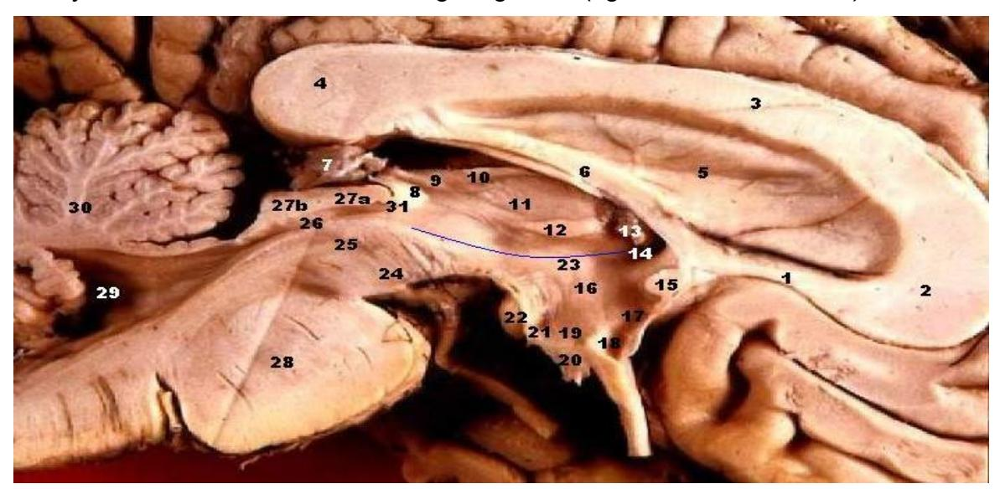

**Figure 13.35** Human Brain Left (Mid-Sagittal View, Closeup).

**Table 13.1 Identify the Structures in Figure 13.36 above**

| Number | Identify the structure |
|--------|------------------------|
| 2-4    |                        |
| 6      |                        |
| 11     |                        |
| 16     |                        |
| 20     |                        |
| 22     |                        |
| 28     |                        |
| 30     |                        |

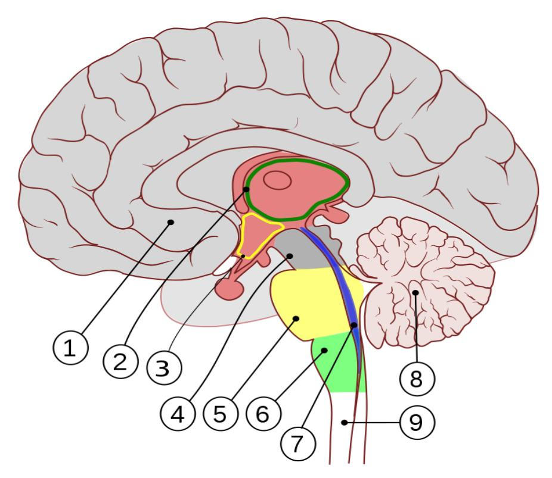

**Figure 13.36** Sagittal Section of the Human Brain, Right Lobe.

**Label the indicated structures on the diagram. Include the function of these structures in the space below.**

**Table 13.2 Identification of Regions of the Brain as well as their Function**

| Number | Identify the Structure | Identify the Function |
|--------|------------------------|-----------------------|
| 1\.    |                        |                       |
| 2\.    |                        |                       |
| 3\.    |                        |                       |
| 4\.    |                        |                       |
| 5\.    |                        |                       |
| 6\.    |                        |                       |
| 7\.    |                        |                       |
| 8\.    |                        |                       |
| 9\.    |                        |                       |

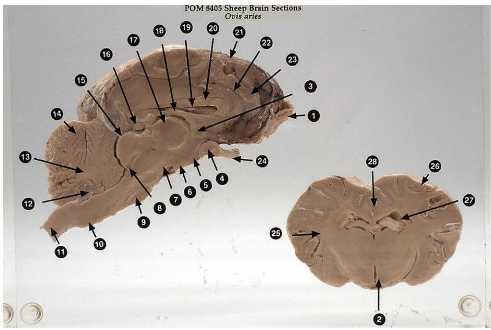

**Figure 13.37** Sheep Brain Cross Section.

**Table 13.3 Identify the following structures in the sheep brain mid sagittal section:**

| Answer number | Structure                |
|---------------|--------------------------|
|               | Cerebrum                 |
|               | Corpus callosum          |
|               | Cerebellum               |
|               | Arbor vitae              |
|               | Diencephalon             |
|               | Thalamus                 |
|               | Hypothalamus             |
|               | Pineal gland/body        |
|               | Pituitary gland          |
|               | Brain stem               |
|               | Midbrain                 |
|               | Pons                     |
|               | Medulla oblongata        |
|               | Optic nerve              |
|               | Optic chiasm             |
|               | Optic tract              |
|               | Olfactory bulbs & tracts |

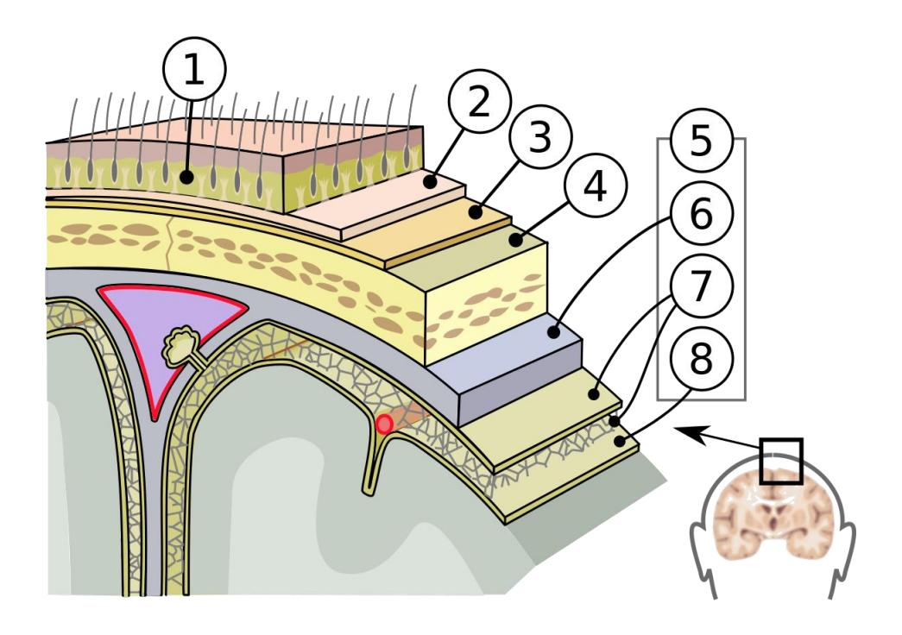

**Figure 13.38** Unlabeled Meninges.

**Table 13.4 Identify the Layers of the Meninges in Figure 13.36 above:**

| Number | Identify the structure |
|--------|------------------------|
| 1\.    |                        |
| 2\.    |                        |
| 3\.    |                        |
| 4\.    |                        |
| 5\.    |                        |
| 6\.    |                        |
| 7\.    |                        |
| 8\.    |                        |
| 9\.    |                        |

Identify and label the parts of the brain in this mid-sagittal section of the brain.

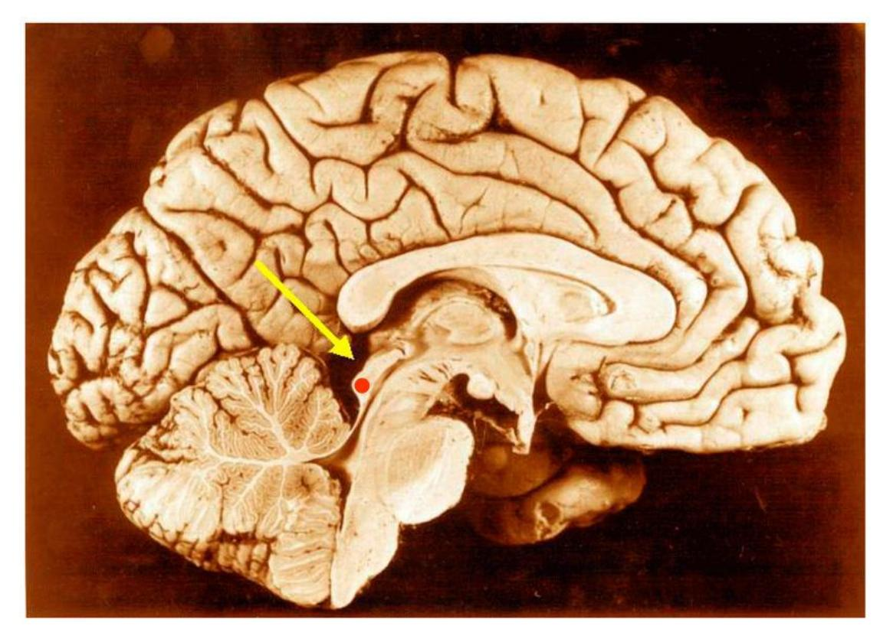

**Figure 13.39** The Inferior Colliculus (Red Dot) in a Human Brain.

Label the diagram of the spinal cord cross section in Figure 13.38

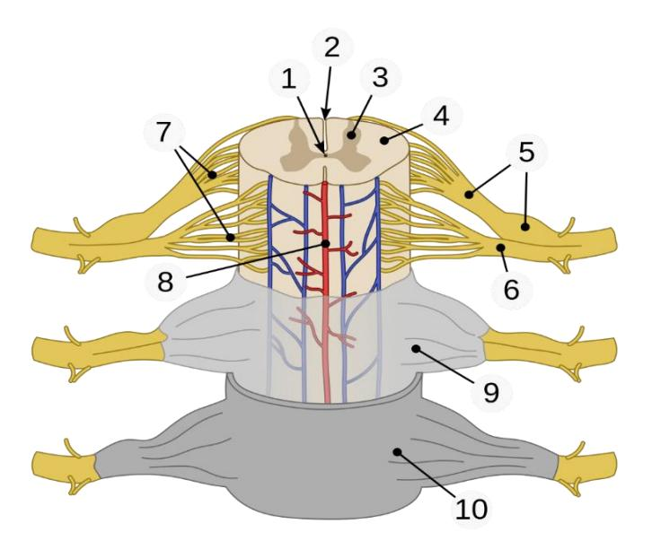

**Figure 13.40** Spinal Cord Cross Section.

Match the following structures with the terms below.

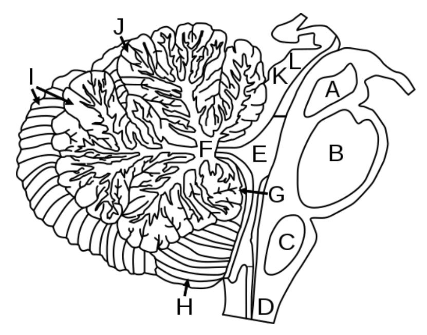

**Figure 13.41** Diagram of the Human Midbrain.

-   Midbrain

-   Fourth ventricle

-   Arbor vitae

-   Pons

-   Medulla oblongata

-   Spinal cord

-   A

-   B

-   C:

-   D:

-   E:

-   F:

Identify all of the regions and structures of the brain.

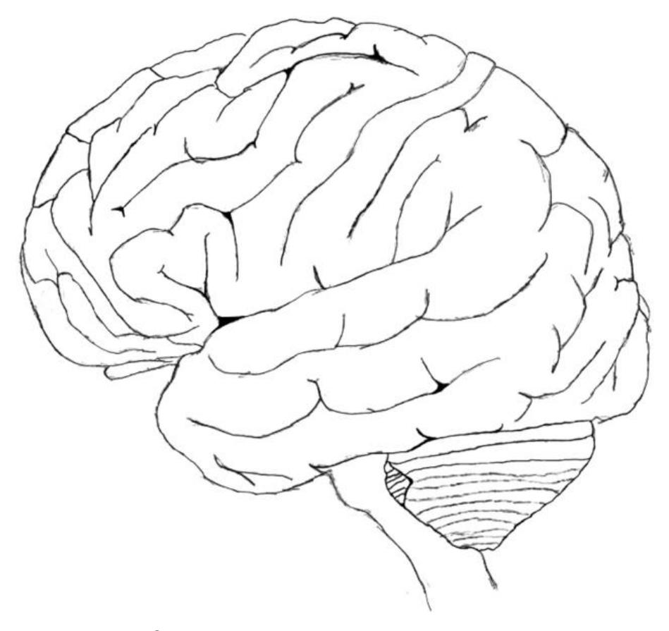

**Figure 13.42** Left Lateral Brain.

## **Additional Learning Resources (see electronic document in Canvas to access weblinks):**

-   **Watch** these **two** videos to locate brain structures listed above for the human brain models:
    -   <https://www.youtube.com/watch?v=qzKHMgK9yYU>AND
    -   <https://www.youtube.com/watch?v=xQ6-e0sF7Yk>
-   **Watch** these **two** videos to locate brain structures listed above for the dissected sheep brains:
    -   [https://www.youtube.com/watch?v=\\\_HlhRyEFHeo](https://www.youtube.com/watch?v=_HlhRyEFHeo) AND
    -   <https://www.youtube.com/watch?v=rrbyBm6SVSc>
-   **Watch** this video to see human brain dissection and an explanation of functions:
    -   [https://www.youtube.com/watch?v=xB7rXw\\\_3gVY&t=336s](https://www.youtube.com/watch?v=xB7rXw_3gVY&t=336s)
-   **Practice identifying parts of the brain here:**
    -   <https://pierceanatomy.weebly.com/nervous-212080-902958.html>
    -   [https://www.purposegames.com/game/sheep-brain-anatomy-quizswagyolo-game](https://www.purposegames.com/game/sheep-brain-anatomy-quiz-swagyolo-game)
-   Sheep brain dissection guides:
    -   The Sheep Brain Atlas (Michigan State University): <https://brains.anatomy.msu.edu/brains/sheep/index.html>
    -   Sheep brain dissection guide (The University of Scranton): <https://www.scranton.edu/faculty/cannon/sheep/pge2.html>
    -   Sheep brain dissection (California State University Northridge): : [https://www.csun.edu/%7Evcpsy00i/dissfa01/Table\\\_of\\\_contents.html.](https://www.csun.edu/~vcpsy00i/dissfa01/Table_of_contents.html)

## **Answer Keys**

**Figure 13.43** Identify the following structures: A: Midbrain B: Pons C: Medulla oblongata D: Spinal cord E: Fourth ventricle F: Arbor vitae.

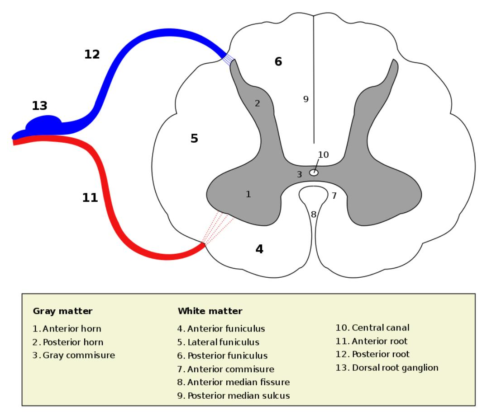

**Figure 13.44** Spinal cord section.

## **Crosswords**

## **Figure 13.32. The Central Nervous system.**

-   **Across: 6** Dura mater vertebrae, **7** Anterior horn, **8** Dorsal root ganglia, **9** Funiculi.
-   **Down: 1** Arachnoid granulations, **2** Lateral anterior, **3** Posterior horn, **4** Cerebrospinal fluid, **5** Sub-arachnoid space

## **Figure 13.33. Brain: anatomical and functional regions.**

-   **Across: 4** Wernicke's, **5** Association, **6** Cortex, **7** Cerebrum cerebellum, **8** Motor, **9** Auditory temporal, **11** Myelinated axons, **14** Sulci sulcus, **15** Broca's, **17** Gyri gyrus.
-   **Down: 1** Occipital lobe, **2** Longitudinal fissure, **3** Gray matter, **4** White matter, **10** Left, **12** Fissures, **13** Sensory, **16** Right.

## **Figure 13.34. Brain components.**

-   **Across: 2** Releasing hormone, **3** Cerebellum, **8** Dura mater, **9** Brain stem, **11** Falx cerebri, **12** Diencephalon, **14** Short-term, **15** Arachnoid sub-arachnoid.
-   **Down: 1** Thalamus, **4** Medulla oblongata, **5** Pia mater, **6** Cerebrospinal fluid, **7** Arachnoid mater, **10** Meninges, **11** Fornix, **13** Pons.

## **Key: Figure 13.35 Human Brain Left (Mid-Sagittal View, Closeup)**

1.  Corpus callosum, Rostrum
2.  Corpus callosum, Genu
3.  Corpus callosum, Corpus
4.  Corpus callosum, Splenium
5.  Septum pellucidum
6.  Fornix, Corpus
7.  Glandula epiphysialis
8.  Recessus pinealis
9.  Habenula
10. Stria medullaris thalami
11. Thalamus (Pars dorsalis)
12. Adhaesio interthalamica
13. Plexus choroideus
14. Foramen interventriculare
15. Comissura anterior
16. Hypothalamus
17. Lamina terminalis
18. Recessus supraopticus
19. Recessus infundibuli
20. Infundibulum
21. Tuber cinerum
22. Corpora mamillaria
23. Sulcus hypothalamicus (blue line)
24. Mesencephalon (Crus cerebri)
25. Tegmentum mesencephali
26. Aqaeductus mesencephali
27. Tectum mesencephali, a) Colliculus superior b) C. inferior
28. Pons
29. Ventriculus quartus
30. Cerebellum
31. Comissura posterior

**Chapter 13: Nervous System Gross Anatomy Glossary**

| Term | Definition |
|----------------------------|----------------------------------------|
| abducens nerve | sixth cranial nerve; responsible for contraction of one of the extraocular muscles |
| amygdala | nucleus deep in the temporal lobe of the cerebrum that is related to memory and emotional behavior |
| anterior column | white matter between the anterior horns of the spinal cord composed of many different groups of axons of both ascending and descending tracts |
| anterior horn | gray matter of the spinal cord containing multipolar motor neurons, sometimes referred to as the ventral horn |
| anterior median fissure | deep midline feature of the anterior spinal cord, marking the separation between the right and left sides of the cord |
| arachnoid granulation (villus) | out pocket of the arachnoid membrane into the dural sinuses that allows for reabsorption of CSF into the blood |
| arachnoid mater | middle layer of the meninges named for the spider-web-like trabeculae that extend between it and the pia mater |
| arachnoid trabeculae | filaments between the arachnoid and pia mater within the subarachnoid space |
| Arbor vitae | the cerebellar white matter, so called for its branched, tree-like appearance. |
| ascending tract | central nervous system fibers carrying sensory information from the spinal cord or periphery to the brain |
| basal forebrain | nuclei of the cerebrum related to modulation of sensory stimuli and attention through broad projections to the cerebral cortex, loss of which is related to Alzheimer's disease |
| basal nuclei | nuclei of the cerebrum (with a few components in the upper brain stem and diencephalon) that are responsible for assessing cortical movement commands and comparing them with the general state of the individual through broad modulatory activity of dopamine neurons; largely related to motor functions, as evidenced through the symptoms of Parkinson's and Huntington's diseases |
| brachial plexus | nerve plexus associated with the lower cervical spinal nerves and first thoracic spinal nerve |
| brain stem | region of the adult brain that includes the midbrain, pons, and medulla oblongata and develops from the mesencephalon, metencephalon, and myelencephalon of the embryonic brain |
| Broca's area | region of the frontal lobe associated with the motor commands necessary for speech production and located only in the cerebral hemisphere responsible for language production, which is the left side in approximately 95 percent of the population |
| cauda equina | bundle of spinal nerve roots that descend from the lower spinal cord below the first lumbar vertebra and lie within the vertebral cavity; has the appearance of a horse's tail |
| caudate | nucleus deep in the cerebrum that is part of the basal nuclei; along with the putamen, it is part of the striatum |
| central canal of the spinal cord | hollow space within the spinal cord that is the remnant of the center of the neural tube |
| central sulcus | surface landmark of the cerebral cortex that marks the boundary between the frontal and parietal lobes |
| cerebellum | region of the adult brain connected primarily to the pons that developed from the metencephalon (along with the pons) and is largely responsible for comparing information from the cerebrum with sensory feedback from the periphery through the spinal cord |
| cerebral aqueduct | connection of the ventricular system between the third and fourth ventricles located in the midbrain |
| cerebral cortex | outer gray matter covering the forebrain, marked by wrinkles and folds known as gyri and sulci |
| cerebral hemisphere | one half of the bilaterally symmetrical cerebrum |
| cerebrum | region of the adult brain that develops from the telencephalon and is responsible for higher neurological functions such as memory, emotion, and consciousness |
| cervical plexus | nerve plexus associated with the upper cervical spinal nerves |
| choroid plexus | specialized structures containing ependymal cells lining blood capillaries that filter blood to produce CSF in the four ventricles of the brain |
| circle of Willis | unique anatomical arrangement of blood vessels around the base of the brain that maintains perfusion of blood into the brain even if one component of the structure is blocked or narrowed |
| Columns of the spinal cord | the white matter of the spinal cord is separated into columns. Ascending tracts of nervous system fibers in these columns carry sensory information up to the brain, whereas descending tracts carry motor commands from the brain. |
| common carotid | artery blood vessel that branches off the aorta (or the brachiocephalic artery on the right) and supplies blood to the head and neck |
| Conus medullaris | conus medullaris or conus terminalis is the tapered, lower end of the spinal cord. |
| corpus callosum | large white matter structure that connects the right and left cerebral hemispheres |
| cranial nerve | one of twelve nerves connected to the brain that are responsible for sensory or motor functions of the head and neck |
| cranial nerve ganglion | sensory ganglion of cranial nerves |
| descending tract | central nervous system fibers carrying motor commands from the brain to the spinal cord or periphery |
| diencephalon | region of the adult brain that retains its name from embryonic development and includes the thalamus and hypothalamus |
| dorsal (posterior) nerve root | axons entering the posterior horn of the spinal cord |
| dorsal (posterior) root ganglion | sensory ganglion attached to the posterior nerve root of a spinal nerve |
| dura mater | tough, fibrous, outer layer of the meninges that is attached to the inner surface of the cranium and vertebral column and surrounds the entire CNS |
| dural sinus | any of the venous structures surrounding the brain, enclosed within the dura mater, which drain blood from the CNS to the common venous return of the jugular veins |
| endoneurium | innermost layer of connective tissue that surrounds individual axons within a nerve |
| enteric nervous system | peripheral structures, namely ganglia and nerves, which are incorporated into the digestive system organs |
| enteric plexus | neuronal plexus in the wall of the intestines, which is part of the enteric nervous system |
| epidural space | the potential space between the dura mater and vertebrae. |
| epineurium | outermost layer of connective tissue that surrounds an entire nerve |
| epithalamus | region of the diencephalon containing the pineal gland |
| esophageal plexus | neuronal plexus in the wall of the esophagus that is part of the enteric nervous system |
| extraocular muscles six | six skeletal muscles that control eye movement within the orbit |
| facial nerve | cranial nerve; responsible for contraction of the facial muscles and for part of the sense of taste, as well as causing saliva production |
| Falx cerebri | a large, crescent-shaped fold of dura mater that descends vertically into the longitudinal fissure to separate the cerebral hemispheres. |
| fascicle | small bundles of nerve or muscle fibers enclosed by connective tissue |
| femoral nerve | systemic nerve of the anterior leg that arises from the lumbar plexus |
| foramen magnum | large opening in the occipital bone of the skull through which the spinal cord emerges and the vertebral arteries enter the cranium |
| forebrain | anterior region of the adult brain that develops from the prosencephalon and includes the cerebrum and diencephalon |
| fourth ventricle | the portion of the ventricular system that is in the region of the brain stem and opens into the subarachnoid space through the median and lateral apertures |
| frontal lobe | region of the cerebral cortex directly beneath the frontal bone of the cranium |
| gastric plexuses | neuronal networks in the wall of the stomach that are part of the enteric nervous system |
| glossopharyngeal nerve | ninth cranial nerve; responsible for contraction of muscles in the tongue and throat and for part of the sense of taste, as well as causing saliva production |
| gray matter | a major component of the central nervous system, consisting of neuronal cell bodies, neuropil, glial cells, synapses, and capillaries. |
| gyrus | ridge formed by convolutions on the surface of the cerebrum or cerebellum |
| hindbrain | posterior region of the adult brain that develops from the rhombencephalon and includes the pons, medulla oblongata, and cerebellum |
| hippocampus | gray matter deep in the temporal lobe that is important for long-term memory formation |
| Horns of the spinal cord (gray matter) | gray matter of the spinal cord is separated into horns: the dorsal (or posterior) horn, which processes sensory information; the ventral (or anterior) horn, which contains motor neurons; and the lateral horn, which is involved in autonomic functions. |
| hypoglossal nerve | twelfth cranial nerve; responsible for contraction of muscles of the tongue |
| hypothalamus | major region of the diencephalon that is responsible for coordinating autonomic and endocrine control of homeostasis |
| inferior colliculus | half of the midbrain tectum that is part of the brain stem auditory pathway |
| inferior olive | nucleus in the medulla that is involved in processing information related to motor control |
| intercostal nerve | systemic nerve in the thoracic cavity that is found between two ribs |
| internal carotid | artery branch from the common carotid artery that enters the cranium and supplies blood to the brain |
| interventricular foramina | openings between the lateral ventricles and third ventricle allowing for the passage of CSF |
| jugular veins | blood vessels that return 'used' blood from the head and neck |
| kinesthesia | general sensory perception of movement of the body |
| lateral apertures | pair of openings from the fourth ventricle to the subarachnoid space on either side and between the medulla and cerebellum |
| lateral column | white matter of the spinal cord between the posterior horn on one side and the axons from the anterior horn on the same side; composed of many different groups of axons, of both ascending and descending tracts, carrying motor commands to and from the brain |
| lateral horn | region of the spinal cord gray matter in the thoracic, upper lumbar, and sacral regions that is the central component of the sympathetic division of the autonomic nervous system |
| lateral sulcus | surface landmark of the cerebral cortex that marks the boundary between the temporal lobe and the frontal and parietal lobes |
| lateral ventricles | portions of the ventricular system that are in the region of the cerebrum |
| limbic cortex | collection of structures of the cerebral cortex that are involved in emotion, memory, and behavior and are part of the larger limbic system |
| limbic system | structures at the edge (limit) of the boundary between the forebrain and hindbrain that are most associated with emotional behavior and memory formation |
| longitudinal fissure | large separation along the midline between the two cerebral hemispheres |
| lumbar plexus | nerve plexus associated with the lumbar spinal nerves |
| lumbar puncture | procedure used to withdraw CSF from the lower lumbar region of the vertebral column that avoids the risk of damaging CNS tissue because the spinal cord ends at the upper lumbar vertebrae |
| meninges | protective outer coverings of the CNS composed of connective tissue |
| mesencephalon | primary vesicle of the embryonic brain that does not significantly change through the rest of embryonic development and becomes the midbrain |
| midbrain | midbrain middle region of the adult brain that develops from the mesencephalon |
| nerve plexus | network of nerves without neuronal cell bodies included |
| occipital lobe | region of the cerebral cortex directly beneath the occipital bone of the cranium |
| oculomotor nerve | third cranial nerve; responsible for contraction of four of the extraocular muscles, the muscle in the upper eyelid, and pupillary constriction |
| olfaction | special sense responsible for smell, which has a unique, direct connection to the cerebrum |
| olfactory nerve | first cranial nerve; responsible for the sense of smell |
| olfactory bulb | a neural structure of the vertebrate forebrain involved in olfaction, the sense of smell. |
| olfactory nerve | olfactory bulb and nerve |
| Optic chiasm | the part of the brain where the optic nerves cross. It is located at the bottom of the brain immediately inferior to the hypothalamus |
| optic nerve | second cranial nerve; responsible for visual sensation |
| parietal lobe | region of the cerebral cortex directly beneath the parietal bone of the cranium |
| perineurium | layer of connective tissue surrounding fascicles within a nerve |
| pia mater | thin, innermost membrane of the meninges that directly covers the surface of the CNS |
| Pineal body or gland | small endocrine gland found in most vertebrates, which produces melatonin; in humans, located in the epithalamus, in a groove where the two halves of the thalamus join |
| Pituitary gland | Endocrine gland at the base of the brain. Referred to as the 'master gland' |
| plexus | network of nerves or nervous tissue |
| postcentral gyrus | primary motor cortex located in the frontal lobe of the cerebral cortex |
| posterior columns | white matter of the spinal cord that lies between the posterior horns of the gray matter, sometimes referred to as the dorsal column; composed of axons of ascending tracts that carry sensory information up to the brain |
| posterior horn | gray matter region of the spinal cord in which sensory input arrives, sometimes referred to as the dorsal horn |
| posterior median sulcus | midline feature of the posterior spinal cord, marking the separation between right and left sides of the cord |
| posterolateral sulcus | feature of the posterior spinal cord marking the entry of posterior nerve roots and the separation between the posterior and lateral columns of the white matter |
| precentral gyrus | ridge just posterior to the central sulcus, in the parietal lobe, where somatosensory processing initially takes place in the cerebrum |
| prefrontal lobe | specific region of the frontal lobe anterior to the more specific motor function areas, which can be related to the early planning of movements and intentions to the point of being personality-type functions |
| premotor area | region of the frontal lobe responsible for planning movements that will be executed through the primary motor cortex |
| prevertebral ganglia | autonomic ganglia that are anterior to the vertebral column and functionally related to the sympathetic chain ganglia |
| primary vesicle | initial enlargements of the anterior neural tube during embryonic development that develop into the forebrain, midbrain, and hindbrain |
| sacral plexus | nerve plexus associated with the lower lumbar and sacral spinal nerves |
| sympathetic chain ganglia | a series of nerve clusters located alongside the spinal column that are part of the sympathetic nervous system. |
| sciatic nerve | systemic nerve from the sacral plexus that is a combination of the tibial and fibular nerves and extends across the hip joint and gluteal region into the upper posterior leg |
| somatosensation | general senses related to the body, usually thought of as the senses of touch, which would include pain, temperature, and proprioception |
| spinal accessory nerve | nerve eleventh cranial nerve; responsible for contraction of neck muscles |
| spinal nerve | one of 31 nerves connected to the spinal cord |
| straight sinus | dural sinus that drains blood from the deep center of the brain to collect with the other sinuses |
| subarachnoid space | space between the arachnoid mater and pia mater that contains CSF and the fibrous connections of the arachnoid trabeculae |
| substantia nigra pars compacta | nuclei within the basal nuclei that release dopamine to modulate the function of the striatum; part of the motor pathway |
| substantia nigra pars reticulata | nuclei within the basal nuclei that serve as an output center of the nuclei; part of the motor pathway |
| sulcus | groove formed by convolutions in the surface of the cerebral cortex |
| superior colliculus | half of the midbrain tectum that is responsible for aligning visual, auditory, and somatosensory spatial perceptions |
| superior sagittal sinus | dural sinus that runs along the top of the longitudinal fissure and drains blood from the majority of the outer cerebrum |
| sympathetic chain ganglia | autonomic ganglia in a chain along the anterolateral aspect of the vertebral column that are responsible for contributing to homeostatic mechanisms of the autonomic nervous system |
| systemic nerve | nerve in the periphery distal to a nerve plexus or spinal nerve |
| tectum | region of the midbrain, thought of as the roof of the cerebral aqueduct, which is subdivided into the inferior and superior colliculi |
| temporal lobe | region of the cerebral cortex directly beneath the temporal bone of the cranium |
| Tentorium cerebelli | Also, the cerebellar tentorium, is a structure in the brain that separates the cerebellum from the cerebrum, dividing the cranial cavity into supratentorial and infratentorial regions |
| terminal ganglion | autonomic ganglia that are near or within the walls of organs that are responsible for contributing to homeostatic mechanisms of the autonomic nervous system |
| thalamus | major region of the diencephalon that is responsible for relaying information between the cerebrum and the hindbrain, spinal cord, and periphery |
| Thoracic nerves | a set of 12 pairs of spinal nerves (T1 to T12) that emerge from the thoracic spine and are responsible for motor and sensory functions in the upper back, chest, and abdomen. |
| third ventricle | portion of the ventricular system that is in the region of the diencephalon |
| trigeminal nerve | fifth cranial nerve; responsible for cutaneous sensation of the face and contraction of the muscles of mastication |
| trochlear nerve | fourth cranial nerve; responsible for contraction of one of the extraocular muscles |
| vagus nerve | tenth cranial nerve; responsible for the autonomic control of organs in the thoracic and upper abdominal cavities |
| ventral (anterior) nerve root | axons emerging from the anterior or lateral horns of the spinal cord |
| ventricles | remnants of the hollow center of the neural tube that are spaces for cerebrospinal fluid to circulate through the brain |
| vestibulocochlear nerve | eighth cranial nerve; responsible for the sensations of hearing and balance |
| Wernicke's area | a region in the brain located in the temporal lobe, primarily responsible for the comprehension of spoken and written language. |
| White matter | The areas of the central nervous system that are mainly made up of myelinated axons, also called tracts. |
