# **Special Senses**

## **Lab Summary:**

This lab will give you an opportunity to study the special senses of hearing and sight.

### **Your objectives for this lab are:**

## **Ear, Hearing, and Equilibrium**

• In a model or diagram of the ear, identify and describe the functions of the following:

## **Outer Ear**

-   Auricle
-   External auditory canal
-   Tympanic membrane

## **Middle Ear**

-   Malleus
-   Incus
-   Stapes
-   Auditory (Eustachian) tube
-   Oval window
-   Round window

## **Inner Ear**

-   Semicircular canals
-   Ampullae
-   Vestibulocochlear nerve
-   Vestibule
-   Cochlea

## **Structures within the Cochlea**

-   Cochlear duct
-   Scala vestibuli
-   Scala tympani
-   Vestibular membrane
-   Basilar membrane
-   Tectorial membrane
-   Organ of Corti (spiral organ)
-   Hair cells
-   In a model or diagram of the ear, trace the pathway of soundwaves from the external ear through the stimulation of receptors for the sense of hearing.

## **Structure and Function of the Eye**

In a model, dissected specimen, or diagram of the eye, identify and describe the functions of the following external and accessory structures:

## **Structure of the Eye**

-   Sclera
-   Cornea
-   Choroid
-   Iris
-   Pupil
-   Ciliary body
-   Suspensory ligaments
-   Lens
-   Retina
-   Optic disk
-   Macula fovea
-   Anterior chamber
-   Aqueous humor
-   Posterior chamber
-   Vitreous humor
-   Pigment cell
-   Photoreceptor
-   Rods
-   Cones
-   Bipolar cell
-   Ganglion cell

## **Accessory Structures**

-   Lacrimal gland
-   Lacrimal punctum
-   Lacrimal canal
-   Lacrimal sac
-   Nasolacrimal duct
-   **External muscles of the Eye:** Identify the structures and functions of muscles associated with movement of the eye. Also identify the controlling cranial nerve for each of the following muscles:
    -   Superior oblique muscle
    -   Superior rectus muscle
    -   Inferior oblique muscle
    -   Inferior rectus muscle
    -   Lateral rectus muscle
    -   Medial rectus muscle
-   Describe the cellular structure of the retina.
-   Trace the pathway of light as it moves through the eyeball.

## **Prelab Activities**

## **Prelab Activity 14.1**

## **Definitions**

Define the following terms.

## **Structure of the Eye**:

-   Outer fibrous tunic \_\_\_\_\_\_\_\_\_\_\_\_\_\_\_\_\_\_\_\_\_\_\_\_\_\_\_\_\_\_\_\_\_\_\_\_\_\_\_\_\_\_\_\_\_
    -   Sclera \_\_\_\_\_\_\_\_\_\_\_\_\_\_\_\_\_\_\_\_\_\_\_\_\_\_\_\_\_\_\_\_\_\_\_\_\_\_\_\_\_\_\_\_\_\_\_\_\_\_\_
    -   cornea \_\_\_\_\_\_\_\_\_\_\_\_\_\_\_\_\_\_\_\_\_\_\_\_\_\_\_\_\_\_\_\_\_\_\_\_\_\_\_\_\_\_\_\_\_\_\_\_\_\_
-   Middle vascular tunic \_\_\_\_\_\_\_\_\_\_\_\_\_\_\_\_\_\_\_\_\_\_\_\_\_\_\_\_\_\_\_\_\_\_\_\_\_\_\_\_\_\_\_
    -   choroid \_\_\_\_\_\_\_\_\_\_\_\_\_\_\_\_\_\_\_\_\_\_\_\_\_\_\_\_\_\_\_\_\_\_\_\_\_\_\_\_\_\_\_\_\_\_\_\_\_\_
    -   ciliary body \_\_\_\_\_\_\_\_\_\_\_\_\_\_\_\_\_\_\_\_\_\_\_\_\_\_\_\_\_\_\_\_\_\_\_\_\_\_\_\_\_\_\_\_\_\_
    -   ciliary process \_\_\_\_\_\_\_\_\_\_\_\_\_\_\_\_\_\_\_\_\_\_\_\_\_\_\_\_\_\_\_\_\_\_\_\_\_\_\_\_\_\_\_\_
    -   Ciliary muscles \_\_\_\_\_\_\_\_\_\_\_\_\_\_\_\_\_\_\_\_\_\_\_\_\_\_\_\_\_\_\_\_\_\_\_\_\_\_\_\_\_\_\_\_
    -   suspensory ligaments \_\_\_\_\_\_\_\_\_\_\_\_\_\_\_\_\_\_\_\_\_\_\_\_\_\_\_\_\_\_\_\_\_\_\_\_\_\_
    -   lens \_\_\_\_\_\_\_\_\_\_\_\_\_\_\_\_\_\_\_\_\_\_\_\_\_\_\_\_\_\_\_\_\_\_\_\_\_\_\_\_\_\_\_\_\_\_\_\_\_\_\_\_
    -   iris \_\_\_\_\_\_\_\_\_\_\_\_\_\_\_\_\_\_\_\_\_\_\_\_\_\_\_\_\_\_\_\_\_\_\_\_\_\_\_\_\_\_\_\_\_\_\_\_\_\_\_\_\_
    -   pupil \_\_\_\_\_\_\_\_\_\_\_\_\_\_\_\_\_\_\_\_\_\_\_\_\_\_\_\_\_\_\_\_\_\_\_\_\_\_\_\_\_\_\_\_\_\_\_\_\_\_\_\_
-   Inner nervous tunic \_\_\_\_\_\_\_\_\_\_\_\_\_\_\_\_\_\_\_\_\_\_\_\_\_\_\_\_\_\_\_\_\_\_\_\_\_\_\_\_\_\_\_\_
    -   Retina \_\_\_\_\_\_\_\_\_\_\_\_\_\_\_\_\_\_\_\_\_\_\_\_\_\_\_\_\_\_\_\_\_\_\_\_\_\_\_\_\_\_\_\_\_\_\_\_\_\_
    -   photoreceptors \_\_\_\_\_\_\_\_\_\_\_\_\_\_\_\_\_\_\_\_\_\_\_\_\_\_\_\_\_\_\_\_\_\_\_\_\_\_\_\_\_\_\_\_
    -   rods \_\_\_\_\_\_\_\_\_\_\_\_\_\_\_\_\_\_\_\_\_\_\_\_\_\_\_\_\_\_\_\_\_\_\_\_\_\_\_\_\_\_\_\_\_\_\_\_\_\_\_\_
    -   rhodopsin pigment \_\_\_\_\_\_\_\_\_\_\_\_\_\_\_\_\_\_\_\_\_\_\_\_\_\_\_\_\_\_\_\_\_\_\_\_\_\_\_\_\_
    -   cones \_\_\_\_\_\_\_\_\_\_\_\_\_\_\_\_\_\_\_\_\_\_\_\_\_\_\_\_\_\_\_\_\_\_\_\_\_\_\_\_\_\_\_\_\_\_\_\_\_\_\_
    -   pigmented epithelium \_\_\_\_\_\_\_\_\_\_\_\_\_\_\_\_\_\_\_\_\_\_\_\_\_\_\_\_\_\_\_\_\_\_\_\_\_\_\_
    -   receptor cells \_\_\_\_\_\_\_\_\_\_\_\_\_\_\_\_\_\_\_\_\_\_\_\_\_\_\_\_\_\_\_\_\_\_\_\_\_\_\_\_\_\_\_\_\_
    -   bipolar neurons \_\_\_\_\_\_\_\_\_\_\_\_\_\_\_\_\_\_\_\_\_\_\_\_\_\_\_\_\_\_\_\_\_\_\_\_\_\_\_\_\_\_\_
    -   ganglion cells \_\_\_\_\_\_\_\_\_\_\_\_\_\_\_\_\_\_\_\_\_\_\_\_\_\_\_\_\_\_\_\_\_\_\_\_\_\_\_\_\_\_\_\_\_
    -   optic nerve \_\_\_\_\_\_\_\_\_\_\_\_\_\_\_\_\_\_\_\_\_\_\_\_\_\_\_\_\_\_\_\_\_\_\_\_\_\_\_\_\_\_\_\_\_\_\_
    -   optic disc \_\_\_\_\_\_\_\_\_\_\_\_\_\_\_\_\_\_\_\_\_\_\_\_\_\_\_\_\_\_\_\_\_\_\_\_\_\_\_\_\_\_\_\_\_\_\_\_
    -   blind spot \_\_\_\_\_\_\_\_\_\_\_\_\_\_\_\_\_\_\_\_\_\_\_\_\_\_\_\_\_\_\_\_\_\_\_\_\_\_\_\_\_\_\_\_\_\_\_\_
    -   macula lutea \_\_\_\_\_\_\_\_\_\_\_\_\_\_\_\_\_\_\_\_\_\_\_\_\_\_\_\_\_\_\_\_\_\_\_\_\_\_\_\_\_\_\_\_\_
    -   fovea centralis \_\_\_\_\_\_\_\_\_\_\_\_\_\_\_\_\_\_\_\_\_\_\_\_\_\_\_\_\_\_\_\_\_\_\_\_\_\_\_\_\_\_\_\_
    -   Focal point \_\_\_\_\_\_\_\_\_\_\_\_\_\_\_\_\_\_\_\_\_\_\_\_\_\_\_\_\_\_\_\_\_\_\_\_\_\_\_\_\_\_\_\_\_\_\_
-   Accessory Structures \_\_\_\_\_\_\_\_\_\_\_\_\_\_\_\_\_\_\_\_\_\_\_\_\_\_\_\_\_\_\_\_\_\_\_\_\_\_\_\_\_\_
    -   Lacrimal gland \_\_\_\_\_\_\_\_\_\_\_\_\_\_\_\_\_\_\_\_\_\_\_\_\_\_\_\_\_\_\_\_\_\_\_\_\_\_\_\_\_\_\_\_
    -   Lacrimal punctum \_\_\_\_\_\_\_\_\_\_\_\_\_\_\_\_\_\_\_\_\_\_\_\_\_\_\_\_\_\_\_\_\_\_\_\_\_\_\_\_\_
    -   Lacrimal canal \_\_\_\_\_\_\_\_\_\_\_\_\_\_\_\_\_\_\_\_\_\_\_\_\_\_\_\_\_\_\_\_\_\_\_\_\_\_\_\_\_\_\_\_
    -   Lacrimal sac \_\_\_\_\_\_\_\_\_\_\_\_\_\_\_\_\_\_\_\_\_\_\_\_\_\_\_\_\_\_\_\_\_\_\_\_\_\_\_\_\_\_\_\_\_\_
    -   Nasolacrimal duct \_\_\_\_\_\_\_\_\_\_\_\_\_\_\_\_\_\_\_\_\_\_\_\_\_\_\_\_\_\_\_\_\_\_\_\_\_\_\_\_\_

## **Structure of the Ear**:

-   Outer Ear \_\_\_\_\_\_\_\_\_\_\_\_\_\_\_\_\_\_\_\_\_\_\_\_\_\_\_\_\_\_\_\_\_\_\_\_\_\_\_\_\_\_\_\_\_\_\_\_\_\_\_
    -   Auricle \_\_\_\_\_\_\_\_\_\_\_\_\_\_\_\_\_\_\_\_\_\_\_\_\_\_\_\_\_\_\_\_\_\_\_\_\_\_\_\_\_\_\_\_\_\_\_\_
    -   External auditory canal \_\_\_\_\_\_\_\_\_\_\_\_\_\_\_\_\_\_\_\_\_\_\_\_\_\_\_\_\_\_\_\_\_\_\_
    -   Tympanic membrane \_\_\_\_\_\_\_\_\_\_\_\_\_\_\_\_\_\_\_\_\_\_\_\_\_\_\_\_\_\_\_\_\_\_\_\_
-   Middle Ear \_\_\_\_\_\_\_\_\_\_\_\_\_\_\_\_\_\_\_\_\_\_\_\_\_\_\_\_\_\_\_\_\_\_\_\_\_\_\_\_\_\_\_\_\_\_\_\_\_
    -   Malleus \_\_\_\_\_\_\_\_\_\_\_\_\_\_\_\_\_\_\_\_\_\_\_\_\_\_\_\_\_\_\_\_\_\_\_\_\_\_\_\_\_\_\_\_\_\_\_
    -   Incus \_\_\_\_\_\_\_\_\_\_\_\_\_\_\_\_\_\_\_\_\_\_\_\_\_\_\_\_\_\_\_\_\_\_\_\_\_\_\_\_\_\_\_\_\_\_\_\_\_
    -   Stapes \_\_\_\_\_\_\_\_\_\_\_\_\_\_\_\_\_\_\_\_\_\_\_\_\_\_\_\_\_\_\_\_\_\_\_\_\_\_\_\_\_\_\_\_\_\_\_
    -   Auditory (Eustachian) tube \_\_\_\_\_\_\_\_\_\_\_\_\_\_\_\_\_\_\_\_\_\_\_\_\_\_\_\_\_\_\_\_
    -   Oval window \_\_\_\_\_\_\_\_\_\_\_\_\_\_\_\_\_\_\_\_\_\_\_\_\_\_\_\_\_\_\_\_\_\_\_\_\_\_\_\_\_\_\_
    -   Round window \_\_\_\_\_\_\_\_\_\_\_\_\_\_\_\_\_\_\_\_\_\_\_\_\_\_\_\_\_\_\_\_\_\_\_\_\_\_\_\_\_
-   Inner Ear
    -   Semicircular canals \_\_\_\_\_\_\_\_\_\_\_\_\_\_\_\_\_\_\_\_\_\_\_\_\_\_\_\_\_\_\_\_\_\_\_\_\_
    -   Ampullae \_\_\_\_\_\_\_\_\_\_\_\_\_\_\_\_\_\_\_\_\_\_\_\_\_\_\_\_\_\_\_\_\_\_\_\_\_\_\_\_\_\_\_\_\_
    -   Vestibulocochlear nerve \_\_\_\_\_\_\_\_\_\_\_\_\_\_\_\_\_\_\_\_\_\_\_\_\_\_\_\_\_\_\_\_\_\_
    -   Vestibule \_\_\_\_\_\_\_\_\_\_\_\_\_\_\_\_\_\_\_\_\_\_\_\_\_\_\_\_\_\_\_\_\_\_\_\_\_\_\_\_\_\_\_\_\_
    -   Cochlea \_\_\_\_\_\_\_\_\_\_\_\_\_\_\_\_\_\_\_\_\_\_\_\_\_\_\_\_\_\_\_\_\_\_\_\_\_\_\_\_\_\_\_\_\_\_
-   Structures within the Cochlea
    -   Cochlear duct \_\_\_\_\_\_\_\_\_\_\_\_\_\_\_\_\_\_\_\_\_\_\_\_\_\_\_\_\_\_\_\_\_\_\_\_\_\_\_\_\_\_
    -   Scala vestibuli \_\_\_\_\_\_\_\_\_\_\_\_\_\_\_\_\_\_\_\_\_\_\_\_\_\_\_\_\_\_\_\_\_\_\_\_\_\_\_\_\_
    -   Scala tympani \_\_\_\_\_\_\_\_\_\_\_\_\_\_\_\_\_\_\_\_\_\_\_\_\_\_\_\_\_\_\_\_\_\_\_\_\_\_\_\_\_\_
    -   Vestibular membrane \_\_\_\_\_\_\_\_\_\_\_\_\_\_\_\_\_\_\_\_\_\_\_\_\_\_\_\_\_\_\_\_\_\_\_
    -   Basilar membrane \_\_\_\_\_\_\_\_\_\_\_\_\_\_\_\_\_\_\_\_\_\_\_\_\_\_\_\_\_\_\_\_\_\_\_\_\_\_
    -   Tectorial membrane \_\_\_\_\_\_\_\_\_\_\_\_\_\_\_\_\_\_\_\_\_\_\_\_\_\_\_\_\_\_\_\_\_\_\_\_\_
    -   Organ of Corti (spiral organ) \_\_\_\_\_\_\_\_\_\_\_\_\_\_\_\_\_\_\_\_\_\_\_\_\_\_\_\_\_\_
    -   Hair cells \_\_\_\_\_\_\_\_\_\_\_\_\_\_\_\_\_\_\_\_\_\_\_\_\_\_\_\_\_\_\_\_\_\_\_\_\_\_\_\_\_\_\_\_\_

### **Prelab Activity 14.2**

### **Identifications**

### **Label the following Structures of the Ear and Eye in figures 14.1 – 14.5.**

Label the diagram of the ear.

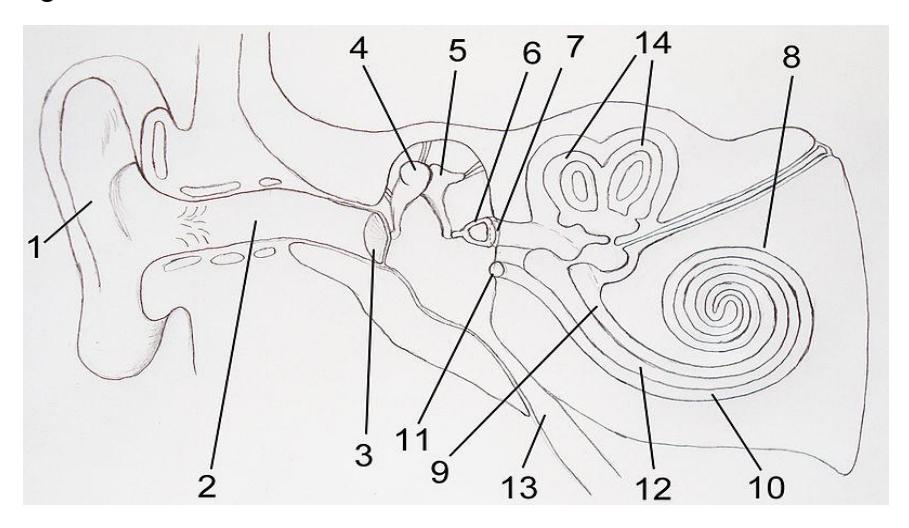

**Figure 14.1** Diagram of the Ear.

|     |     |
|-----|-----|
| 1\. | 8\. |
| 2\. | 9\. |
| 3\. | 10  |
| 4\. | 11  |
| 5\. | 12  |
| 6\. | 13  |
| 7\. | 14  |

Label the bony labyrinth.

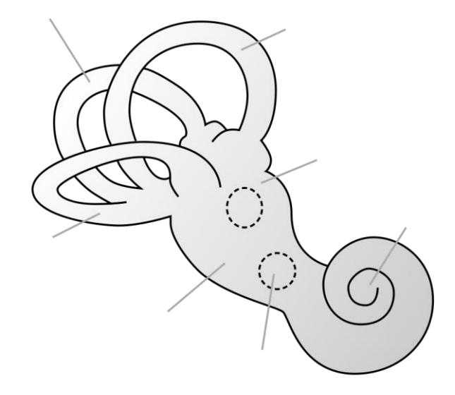

**Figure 14.2** The Bony Labyrinth, Unlabeled.

Identify the cochlear structures in figure 14.3.

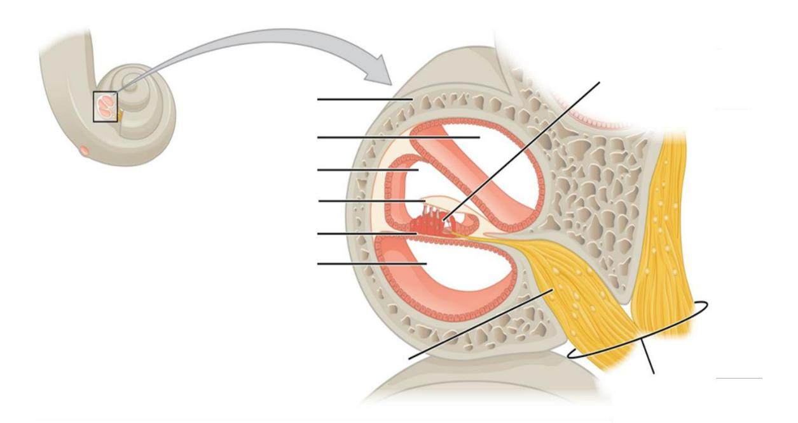

**Figure 14.3** The Cochlea, Unlabeled.

Identify the structure of the anterior eye.

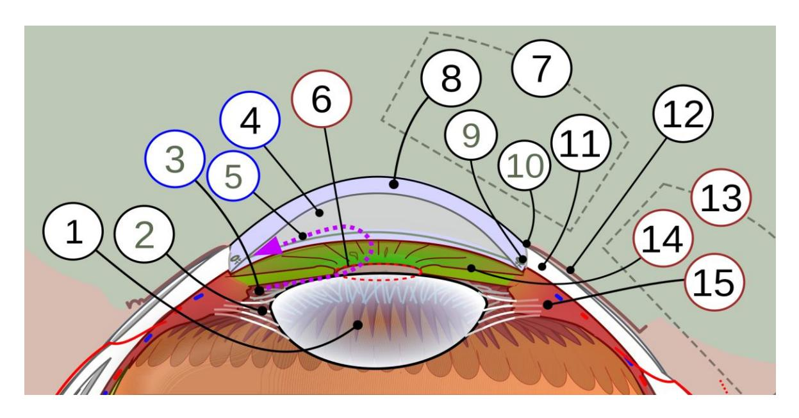

**Figure 14.4** Schematic Diagram of the Anterior Segment of the Human Eye (Horizontal Section of the Right Eye).

|     |     |
|-----|-----|
| 1   | 9   |
| 2   | 10  |
| 3   | 11  |
| 4   | 12  |
| 5   | 13  |
| 6   | 14  |
| 7   | 15  |
| 8   |     |

Label the structures in the sagittal section of the eye.

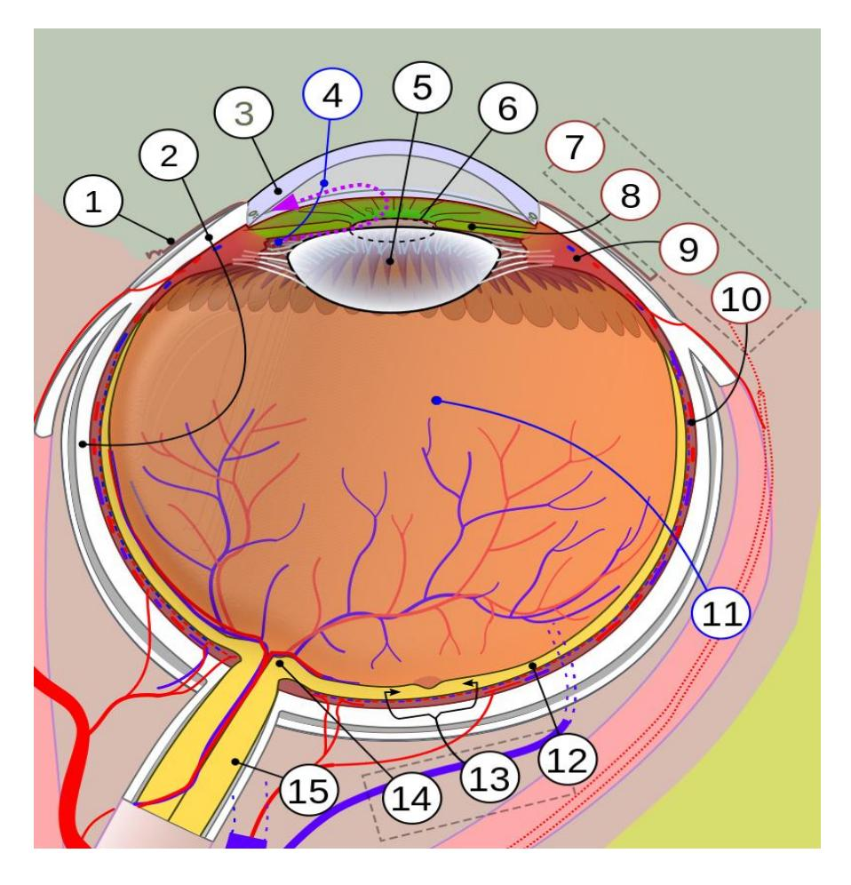

Figure 14.5 Labeled Diagram of the Human Eye.

|     |     |
|-----|-----|
| 1   | 9   |
| 2   | 10  |
| 3   | 11  |
| 4   | 12  |
| 5   | 13  |
| 6   | 14  |
| 7   | 15  |
| 8   |     |

## **Lab Activities**

## **Ear, Hearing, and Equilibrium**

### **Lab Activity 14.1 (figures 14.6 to 14.8)**

Go to the area where the ears and eyes are stored and obtain the model of the ear.

-   Collaborate with your group to identify and label the structures found in the regions of the outer, middle, and inner ear. Invite the group next to you to check your work, then have your instructor check your work.
-   Take a picture of the work for later reference before the upcoming practical and if you have time have a classmate record a video while you review the structures of the ear you need to review.

## **Outer Ear**

### **Terms**

-   Auricle
-   External auditory canal
-   Tympanic membrane

**Figure 14.6** Anatomy of the Ear and Location of the Mastoid Bone.

### **Middle Ear**

### **Terms**

-   Malleus

-   Incus

-   Stapes

-   Auditory (Eustachian) tube

-   Oval window

• Round window

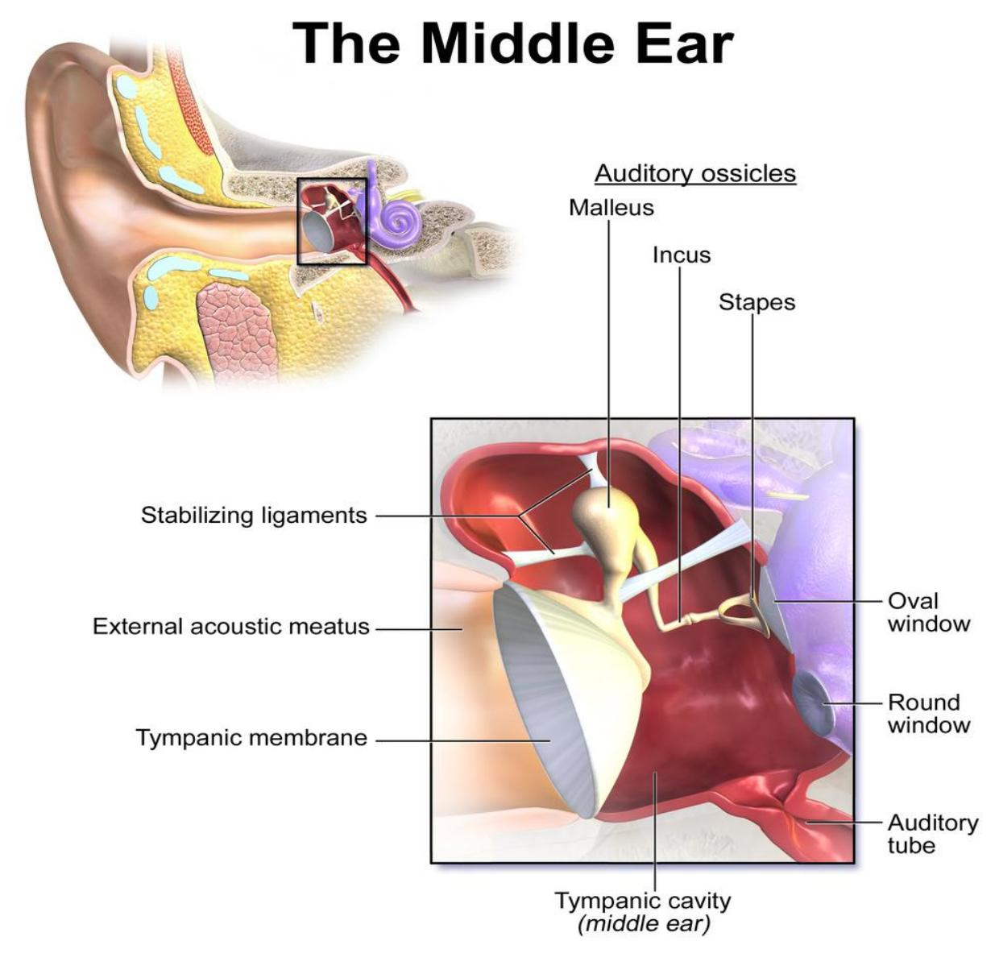

**Figure 14.7** The Middle Ear.

## **Inner Ear**

-   Semicircular canals

-   Ampullae

-   Vestibulocochlear nerve

-   Vestibule

-   Cochlea

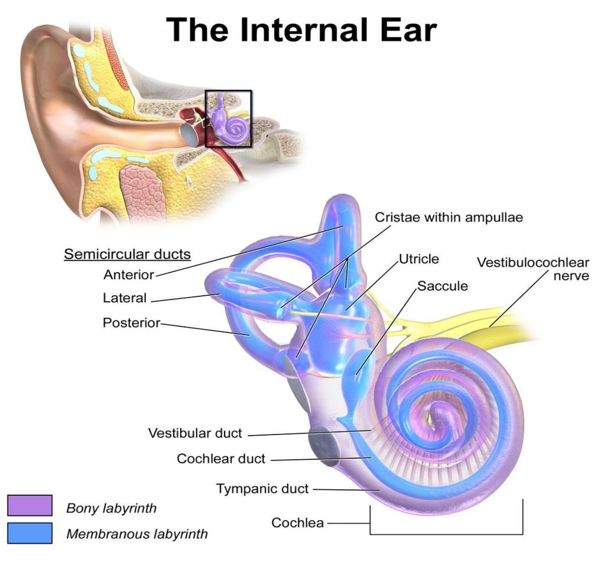

**Figure 14.8** The Inner Ear.

## **Structures within the Cochlea**

### **Terms**

-   Cochlear duct

-   Scala vestibuli

-   Scala tympani

-   Vestibular

-   membrane

-   Basilar membrane

-   Tectorial membrane

-   Organ of Corti (spiral organ)

-   Hair cells

## **Lab Activity 14.2. Cochlear Structures. (figure 14.9)**

Obtain a model of the cochlea from the storage area in the lab.

-   Collaborate with your group to identify and label the structures found in the cochlea. Include the function of the structures in processing sound. Invite the group next to you to check your work, then have your instructor check your work.
-   Take a picture of the work for later reference before the upcoming practical and if you have time have a classmate record a video while you review the structures of the cochlea you need to review.

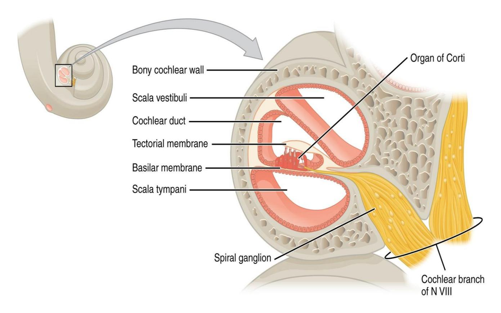

**Figure 14.9** The Cochlea

## **Structure of the Eye**

### **Terms**

-   Sclera

-   Cornea

-   Choroid

-   Iris

-   Pupil

-   Ciliary body

-   Suspensory ligaments

-   Lens

-   Retina

-   Optic disk

-   Macula lutea

-   Fovea centralis

-   Anterior chamber

-   Aqueous humor

-   Posterior chamber

-   Vitreous humor

-   Rods

-   Cones

-   Bipolar cell

-   Ganglion cell

## **Lab Activity 14.3**

## **Structures of the Eye. (figures 14.10 to 14.13)**

Obtain a 3-D model of the eye from the storage area(s) in the lab. There may be several different types of models in the lab, so I recommend that you become familiar with each of them.

-   Collaborate with your group to identify and label the structures found in the eye. Include the function of the structures as well. Be able to identify the retinal photoreceptors by their structure and function.
-   Invite the group next to you to check your work, then have your instructor check your work.
-   Take a picture of the work for later reference before the upcoming practical and if you have time have a classmate record a video while you review the structures of the eye you need to review.

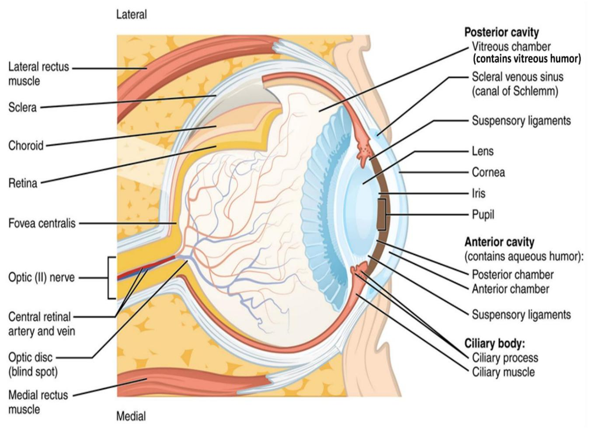

**Figure 14.10** Structure of the Eye (Transverse View).

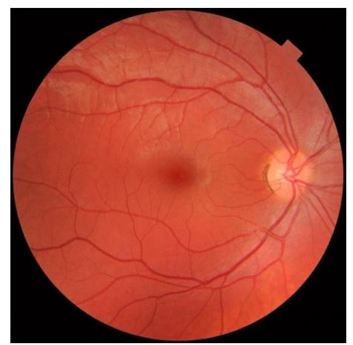

**Figure 14.11** Macula Lutea of the Right Eye.

## **Photoreceptors of the Eye**

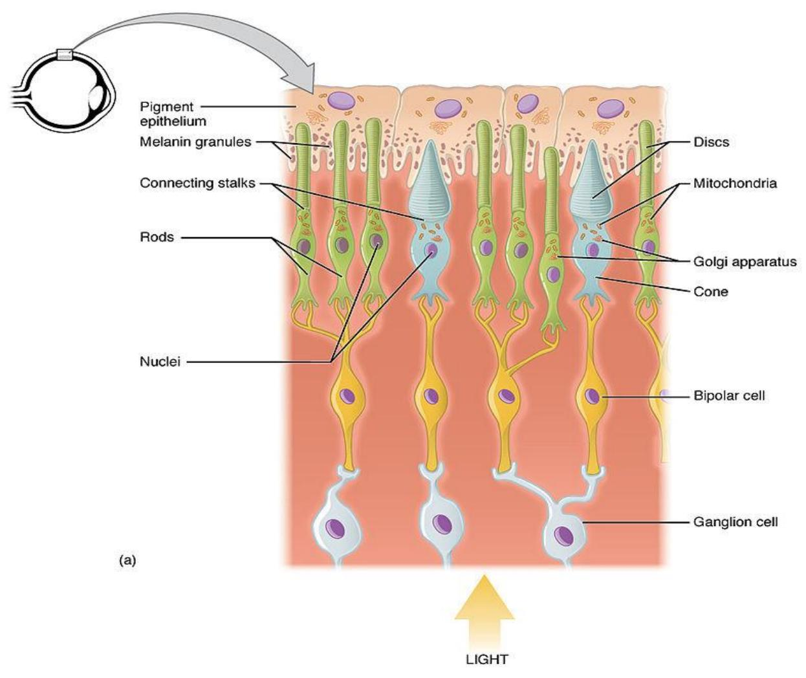

**Figure 14.12** Rods and Cones.

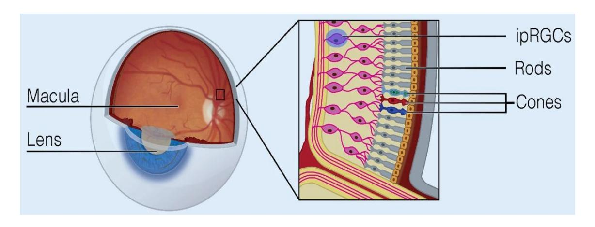

**Figure 14.13** Retinal Photoreceptors.

### **Lab Activity 14.4. (figure 14.14 and 14.15)**

In a model or diagram of Accessory structures of the eye and the external muscles of the eye, identify the structures and functions of muscles associated with movement of the eye.

• Also identify the controlling cranial nerve for each of the following eye muscles, if directed by your instructor.

### **Accessory Structures**

-   Lacrimal gland

-   Lacrimal punctum

-   Lacrimal canal

-   Lacrimal sac

-   Nasolacrimal duct

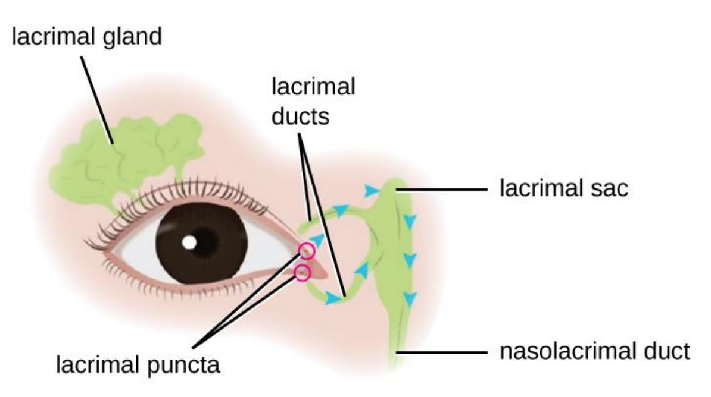

**Figure 14.14** The Accessory Structures of the Eye.

## **External Muscles of the Eye Terms**

-   Superior oblique
-   Superior rectus
-   Inferior oblique
-   Inferior rectus
-   Lateral rectus
-   Medial rectus

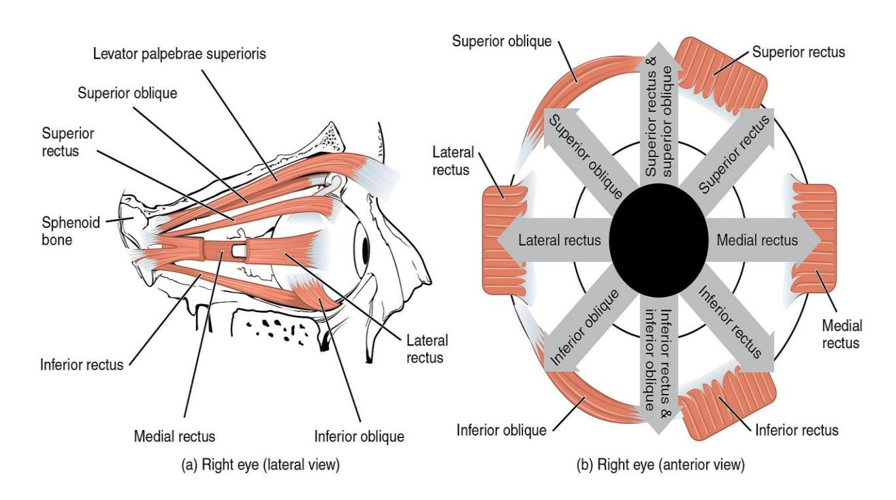

**Figure 14.15** External Muscles of the Eye.

## **Cow Eye Dissection Instructions**

## **Materials Needed**

-   Goggles and gloves

-   Preserved Cow Eye

-   Dissecting Kit with Scalpels

-   Dissecting tray and paper towels

1.  Examine the outside of the eye. Locate the **sclera (i.e.,** the whites of the eye). This tough, outer covering of the eyeball has fat and muscle attached to it.
2.  Locate the covering over the front of the eye, the **cornea**. Because of preservatio0n the cornea should look cloudy; however, when the cow was alive, it was clear.
3.  Cut away the excess fat and muscle, this may only be necessary if fat is covering the cornea of the eye and is in your way. Fat around the backside of the eye can be left alone. Flip the eye over to find the **optic nerve** where it exits out the back of the eye do not remove this structure. You may have to remove some excess fat and tissue to see it well. It will be stronger and more rope-like than the surrounding fat tissue.

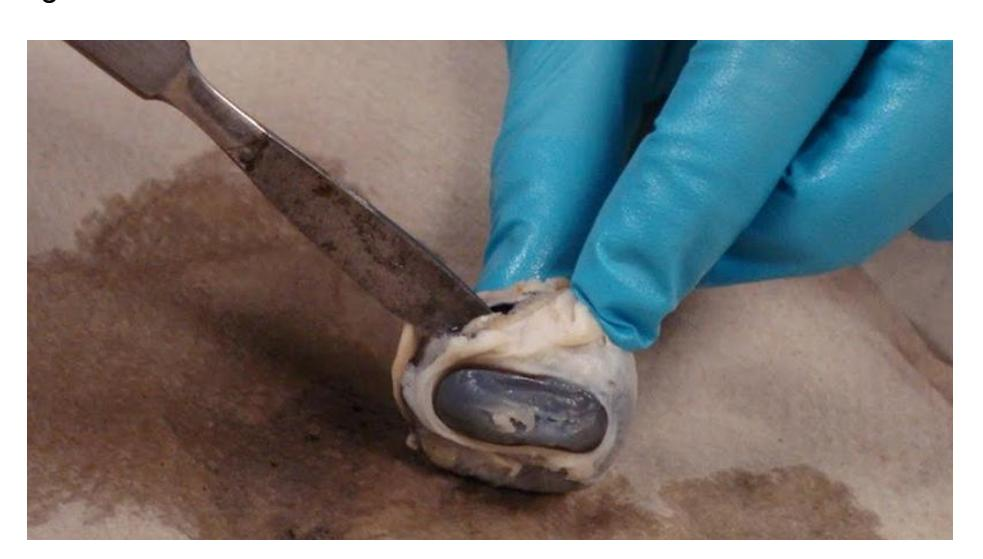

**Figure 14.16** The Cow Eye being Dissected on a Paper Towel.

4.  Use a scalpel or scissors to make an incision in the cornea. In this case you want to make a coronal incision, in back of the cornea, so that you will separate the anterior portion of the eye from the posterior end.

Please note, the cornea is tougher than it appears and may require some force to puncture, be careful when using the scalpel. Press the scalpel downwards into the dissecting pan away from you. Once the cornea is broken, clear liquid will leak (or squirt) out – this liquid is the **aqueous humor**.

5.  Use a scalpel or scissors to make an incision in the sclera so that you can cut around the outside of the eye. Your goal is to separate the eye into a front and a back half.

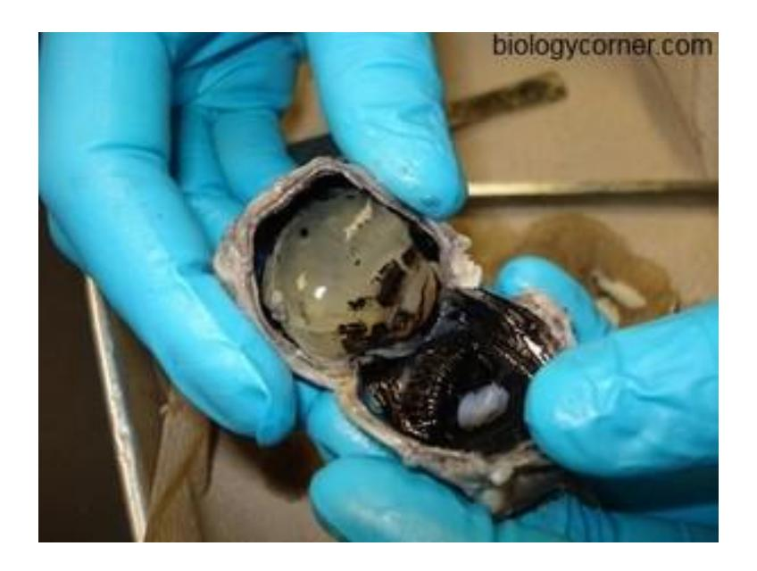

**Figure 14.17** Dissected Cow Eye Showing Internal Structures.

6.  Separate the inner parts of the eye.

-   The gelatinous liquid in the middle of the eye is the **vitreous humor** , which will also contain a hard, sphere-shaped **lens**.
-   Find the cornea (which you punctured in step 1) and then the disk-shaped **iris** behind it.
-   The iris will be dark in color and contain a center opening, the **pupil**.

7.  The image below shows how each part of the eye appears when it has been separated. Take a photo of your own eye for comparison.

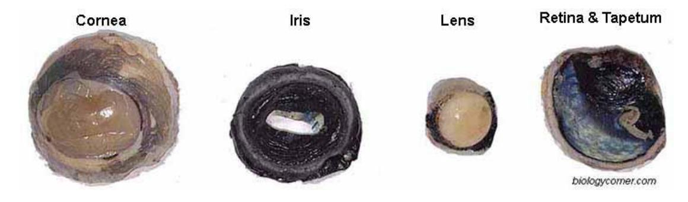

**Figure 14.18** Dissected Cow Eye Internal Structures.

8.  The posterior section of the eye contains two layers, a very thin layer of cells that is easy to scrape off (and may fall off on its own), which is the **retina**. Behind, the retina is a blue, reflective layer known as the **tapetum** as you can see in the figure above.
9.  The retina will converge at a point in the eye where it connects with the optic nerve. This is the **optic disk**. It may be easiest to find by scraping off the retina and locating the spot where it remains closely attached. Flipping the eye over will also show how that spot is directly in front of the optic nerve.
10. Label the Cow Eye (use your text of the descriptions above). Take a picture of the labeled eye to keep as a reference.

### **Additional Learning Resources**

**Watch** these videos to learn more about the introductory concepts of the eye and the ear:

## **The Eye**

-   The structure of the eye. Khan academy.
    -   [https://www.khanacademy.org/science/health-and-medicine/nervoussystem-and-sensory-infor/sight-vision/v/vision-structure-of-the-eye.](https://www.khanacademy.org/science/health-and-medicine/nervous-system-and-sensory-infor/sight-vision/v/vision-structure-of-the-eye)
    -   Eye Dissection GCSE A Level Biology NEET Practical Skills by [Ava](https://www.youtube.com/@avaheartsbiology3548) [Hearts Biology](https://www.youtube.com/@avaheartsbiology3548)
        -   [https://www.youtube.com/watch?v=1oKBwNYxhw4.](https://www.youtube.com/watch?v=1oKBwNYxhw4)
    -   Eye Dissection \|\| The Eyes Have It \[EDU\]
        -   [https://youtu.be/uJXkrdA87XQ?si=2Q6fLsMMlqbiwcmP.](https://youtu.be/uJXkrdA87XQ?si=2Q6fLsMMlqbiwcmP)
    -   Sheep eye dissection virtual practical exam practice quiz for anatomy by Scientist Cindy
        -   [https://youtu.be/2-NEppo7764?si=uatG\\\_GcnXyV0L7sK.](https://youtu.be/2-NEppo7764?si=uatG_GcnXyV0L7sK)
    -   Extraocular Muscles \| Eye Anatomy by Anatomy Zone
        -   [https://youtu.be/f\\\_rb6FMVHPk?si=2I4aUhwB-\\\_kT8BrQ.](https://youtu.be/f_rb6FMVHPk?si=2I4aUhwB-_kT8BrQ)

### **The Ear**

-   Ear Anatomy 1, Overview of the Ear by [Professor Bob Long](https://www.youtube.com/@professorboblong-humananat6996) [https://youtu.be/xfu6Tfc6lyI?si=hDfu5-5KY5tdN4Qa.](https://youtu.be/xfu6Tfc6lyI?si=hDfu5-5KY5tdN4Qa)
-   Ear Anatomy \| Review and Practice by Anatomy Hero [https://youtu.be/tpKXlWct\\\_0k?si=xpAHeu1Pl7Z6X2RZ.](https://youtu.be/tpKXlWct_0k?si=xpAHeu1Pl7Z6X2RZ)

## **Post Lab Activities**

## **Test Your Understanding**:

## **Post Lab Activity 14.1**

## **Crossword Puzzles**

Complete the following crossword puzzles.

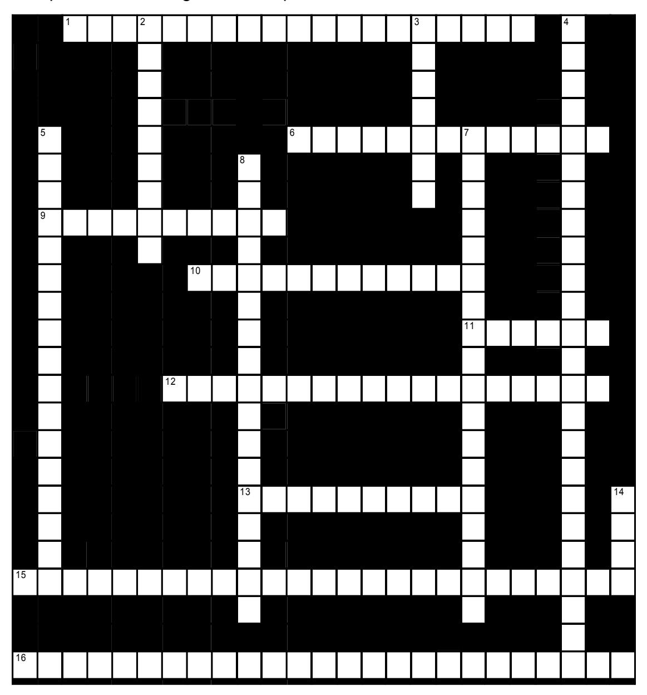

**Figure 14.19** The Eye.

### **Across**

-   1 Posterior to the ciliary body is the \_\_\_\_\_ a dark brown membrane that contains the \_\_\_\_ (7,5,7)

-   6 The posterior cavity of the eye is filled with \_\_\_\_\_, a jelly-like substance (8,5)

-   9 The iris lies between the \_\_\_\_ and the \_\_\_\_\_ (6,4)

-   10 The anterior cavity of the eye is filled with \_\_\_\_\_, a clear fluid similar to blood plasma (7,5)

-   11 The eye itself has an outer wall composed of three layers, or '\_\_\_\_\_.' (6)

-   12 The region of the retina where the axons of the retinal ganglion cells leave the eye is called the \_\_\_\_\_ or \_\_\_\_\_, (5,4,5,4)

-   13 The axons of the retinal ganglion cells run along the surface of the retina before leaving the eye as the \_\_\_\_\_. (5,5)

-   15 The only region of the eye capable of high-acuity vision (such as that used to read fine print) consists of the \_\_\_\_\_ and \_\_\_\_\_. (6,5,5,9)

-   16 The lacrimal apparatus includes the \_\_\_\_\_, which produces tears, and the ducts that drain excess liquid into the \_\_\_\_\_. (8,5,5,7)

### **Down**

-   2 There are two types of photoreceptor cell: \_\_\_\_\_, which respond to as little as a single photon of light, regardless of color, and \_\_\_\_\_, which are less sensitive but respond color. (4,5)

-   3 Vitreous humor functions to \_\_\_\_\_ the retina. (7)

-   4 The \_\_\_\_\_ is the outermost layer of the eyeball: in the front it is clear, forming the \_\_\_\_\_. The surrounding areas are white and form the \_\_\_\_\_. (7,5,6,6)

-   5 The \_\_\_\_\_ (or \_\_\_\_\_) is the middle layer of the eyeball's wall. (8,5,4)

-   7 The \_\_\_\_\_ (or \_\_\_\_) is the innermost layer of the eye. (7,5,6)

-   8 \_\_\_\_\_ are transparent mucous membranes that line the eyelids and the anterior surface of the eyeball (except for the \_\_\_\_). Their major function is to produce a lubricating mucus that prevents the eye from drying. (11,6)

-   14 In the front of the eye, the vascular tunic (or uvea) forms the \_\_\_\_\_. (4)

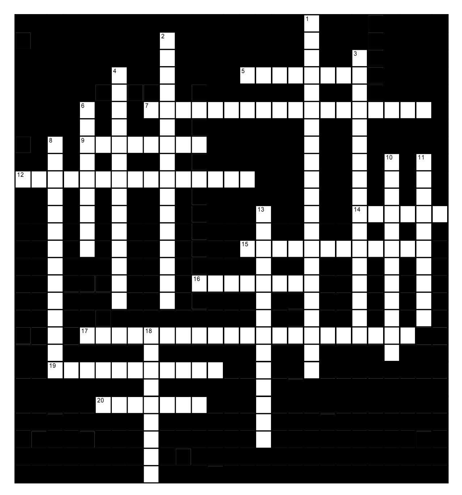

**Figure 14.20** The Ear.

### **Across**

-   5 The swollen regions at the entrance to each semicircular canal are the \_\_\_\_\_ (8)

-   7 The small bones of the middle ear are the \_\_\_\_, \_\_\_\_\_ and \_\_\_\_\_. (7,5,6)

-   9 The semicircular canals are compartments of the inner ear which sense the \_\_\_\_\_ of the head. (8)

-   12 Movement of fluid in the inner ear causes movement of the fibers of the \_\_\_\_\_, which are much like the strings of an instrument. (7,8)

-   14 Each crista ampullaris has hair cells which extend into a soft ridge called the \_\_\_\_\_ (6)

-   15 The actual organ within the cochlea which is responsible for hearing is the \_\_\_\_\_. (5,2,5)

-   16 The three bones of the middle ear are collectively called the \_\_\_\_\_. (8)

-   17 The pharyngotympanic tube (aka Eustachian tube) connects the \_\_\_\_\_ to the \_\_\_\_\_. (6,3,5,7)

-   19 The vestibule is a compartment of the inner ear which is the major system involved in \_\_\_\_\_. (11)

-   20 The cochlea is a snail shaped organ in the inner ear which is responsible for \_\_\_\_\_. (7)

### **Down**

-   1 As vibrations in the ear cause the eardrum to vibrate, the eardrum pushes against the \_\_\_\_\_. (7,5,3,6)

-   2 The \_\_\_\_\_ is the boundary between the outer and the middle ear. (8,8)

-   3 Electrically encoded impulses representing sound are conducted from the ear to the brain by the \_\_\_\_\_ nerve. (17)

-   4 Ultimately, signals from the auditory pathway find their way to the \_\_\_\_\_. (8,6)

-   6 As the eardrum vibrates, the ossicles move, and their movement is converted to motion of the \_\_\_\_\_. (9)

-   8 The \_\_\_\_\_ allows air pressure in the middle ear to equalize with the external environment. (10,4)

-   10 The part of the inner ear that is formed from the \_\_\_\_\_ bone is called the \_\_\_\_\_ labyrinth. (8,4)

-   11 The three small bones of the middle ear transmit vibratory motion from the eardrum to the \_\_\_\_\_. (4,6)

-   13 The vestibule contains two chambers: the \_\_\_\_\_, and slightly inferomedial to that, the \_\_\_\_\_. (7,7)

-   18 The inner ear is also called the \_\_\_\_. (9)

## **Post Lab Activity 14.2**

Complete the following questions.

1.  Light first enters the eye through the lens.
    A)  True
    B)  False
2.  What is the white layer that surrounds the eye?
    A)  Cornea
    B)  Retina
    C)  Ciliary body
    D)  Sclera
3.  Which one of the following correctly lists the order of the parts through which light passes?
    A)  cornea, vitreous humor, lens, posterior cavity
    B)  cornea, posterior cavity, lens, vitreous humor
    C)  lens, vitreous humor, cornea, posterior cavity
    D)  cornea, lens, vitreous humor, posterior cavity

-   What is the function of the muscles surrounding the eye? How do they affect vision?

\

-   Why does the optic nerve cause a blind spot?

\

-   When you compare the modes of a human eye to that of a dissected cow eye what anatomical difference(s) did you observe?

\

## **Post Lab Activity 14.3**

### **Identifications**

Complete the following diagrams for Figures 14.19 to 14.20.

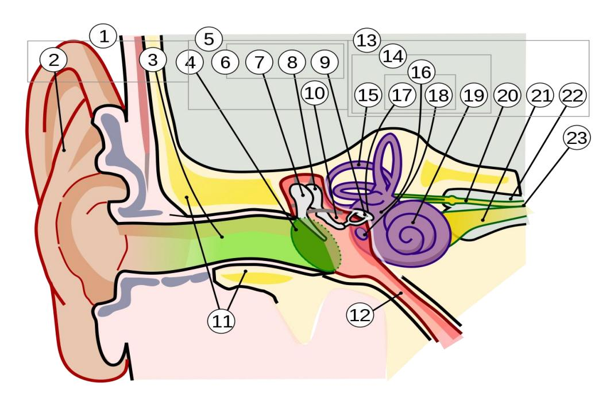

Figure 14.19 Anatomy of the Human Ear.

| 1   | 14  |
|-----|-----|
| 2   | 15  |
| 3   | 16  |
| 4   | 17  |
| 5   | 18  |
| 6   | 19  |
| 7   | 20  |
| 8   | 21  |
| 9   | 22  |
| 10  | 23  |
| 11  |     |
| 12  |     |
| 13  |     |

Identify the structures of the eye and explain their function.

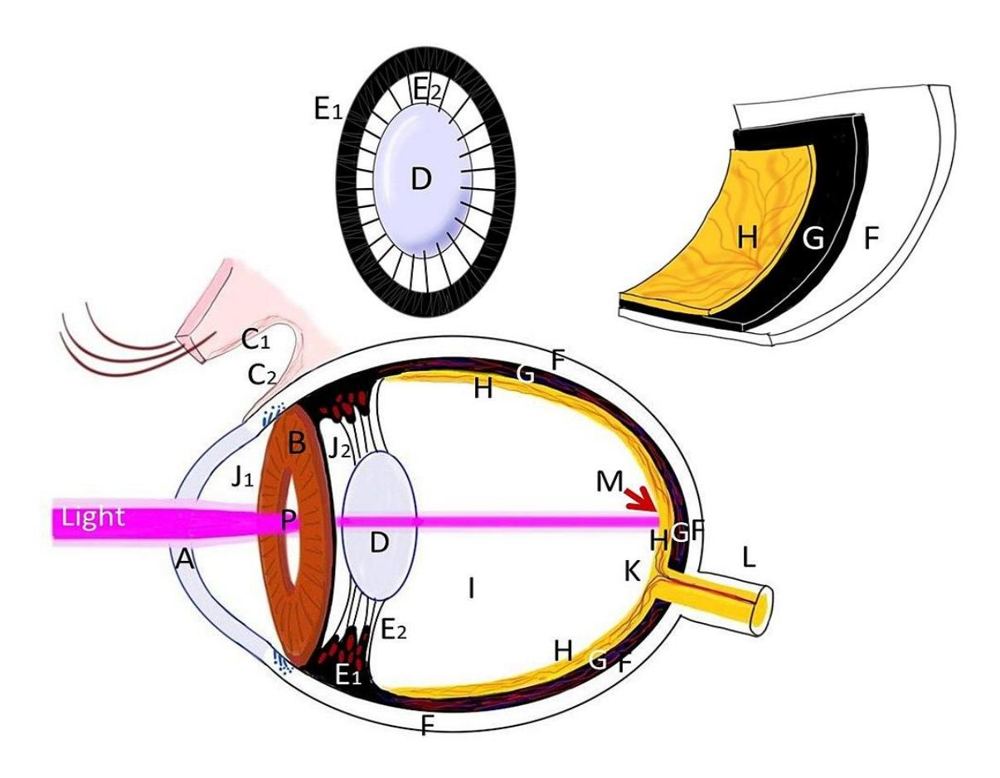

**Figure 14.20** Eyeball Diagram.

## **Post Lab Activity 14.4**

## **Matching**

Match these terms with their correct definitions.

### Table 41.1 The Ear

| Answer | Definition | Term |
|------------------------|------------------------|------------------------|
|  | a spiral-shaped cavity in the bony labyrinth | a\) Auricle |
|  | the innermost part of the vertebrate ear. | b\) Cerumen |
|  | a bone in the middle ear that is connected to the oval window c) | External auditory meatus |
|  | Waxy substance secreted by the ear | d\) Tympanic membrane |
|  | one of three small bones in the middle ear which receives vibrations from the malleus, | e\) Oval window |
|  | the visible part of the ear that is outside the head | f\) Incus |
|  | Membrane-covered opening that leads from the middle ear to the vestibule of the inner ear | g\) Stapes |
|  | Membrane separating the external ear from the middle ear | h\) Cochlea |
|  | Tube running from the outer ear to the middle ear | i\) Inner ear |

### Table 14.2 The Eye

| Answer | Definition | Term |
|------------------------|------------------------|------------------------|
|  | The small channels in each eyelid that drain lacrimal fluid, | a\) Lacrimal gland |
|  | Any of several small ducts that carry tears from the lacrimal glands. | b\) Lacrimal apparatus |
|  | The system containing the orbital structures for tear production and drainage | c\) Lacrimal sac |
|  | Carries tears from the lacrimal sac of the eye into the nasal cavity | d\) Lacrimal canaliculus |
|  | Paired, exocrine gland that secretes the aqueous layer of the tear film | e\) Lacrimal duct |
|  | Small channels in each eyelid that drain lacrimal fluid | f\) Nasolacrimal duct |

### Table 14.3 The Eye

| Answer | Definition | Term |
|------------------------|------------------------|------------------------|
|  | a thin, annular structure in the eye responsible for controlling the diameter and size of the pupil | a\) Anterior chamber |
|  | The chamber located between the cornea and the iris. | b\) Aqueous humor |
|  | Transparent, watery, fluid similar to plasma. | c\) Posterior chamber |
|  | Photoreceptor cells in the retina | d\) Vitreous humor |
|  | the chamber located between the iris and ciliary processes. | e\) Rods and cones |
|  | the clear gel that fills the space between the lens and the retina of the eyeball | f\) iris |

## **Answer Keys**

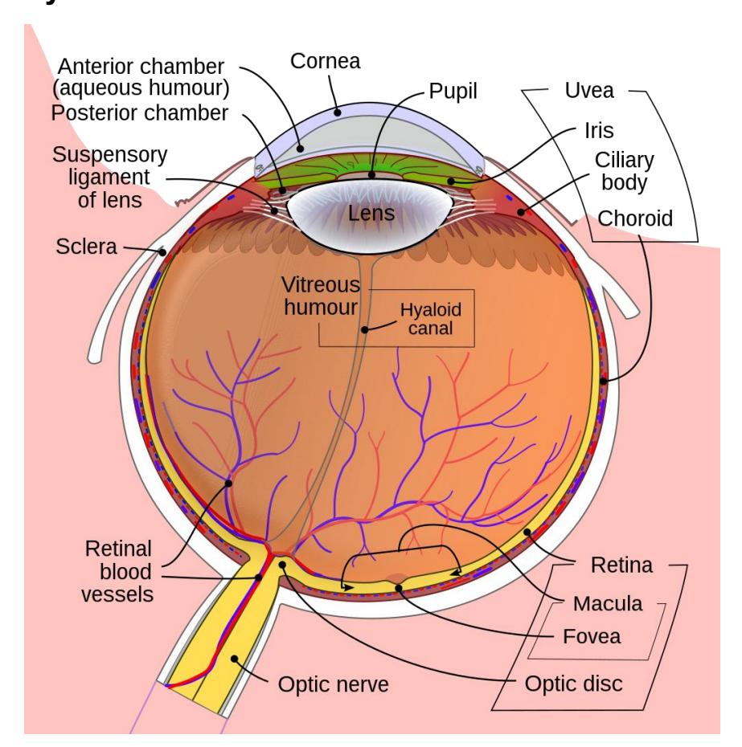

**Figure 14.23** Annotated Diagram of the Human Eye

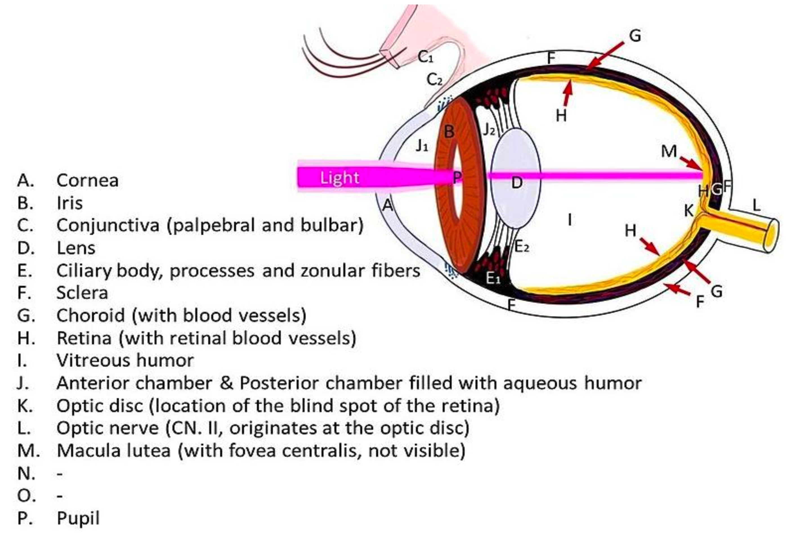

**Figure 14.24** Eyeball Diagram Key

### **Crosswords**

### **Figure 14.21 The Eye**

-   **Across: 1** Choroid blood vessels, **6** Vitreous humor, **9** Cornea lens, **10** Aqueous humor, **11** Tunics, **12** Optic disk blind spot, **13** Optic nerve, **15** Macula lutea fovea centralis, **16** Lacrimal gland nasal passage.
-   **Down: 2** Rods cones, **3** Support, **4** Fibrous tunic cornea sclera, **5** Vascular tunic uvea, **7** Sensory tunic retina, **8** Conjunctiva cornea, **14** Iris.

## **Figure 14.22 The Ear**

-   **Across: 5** Ampullae, **7** Malleus incus stapes, **9** Rotation, **12** Basilar membrane, **14** Cupula, **15** Organ of Corti, **16** Ossicles, **17** Middle ear nasal pharynx, **19** Equilibrium, **20** Hearing.
-   **Down: 1** Malleus incus and stapes, **2** Tympanic membrane, **3** Vestibulocochlear, **4** Auditory cortex, **6** Perilymph, **8** Eustachian tube, **10** Temporal bony, **11** Oval window, **13** Utricle saccule, **18** Labyrinth.

### **Chapter 14: Special Senses Glossary**

| Key Terms | Definitions |
|--------------|----------------------------------------------------------|
| ampulla | (in the ear) the structure at the base of a semicircular canal that contains the hair cells and cupula for transduction of rotational movement of the head |
| Anterior chamber | the aqueous humor-filled space inside the eye between the iris and the cornea's innermost surface, the endothelium. |
| aqueous humor | watery fluid that fills the anterior chamber containing the cornea, iris, ciliary body, and lens of the eye |
| ascending pathway | fiber structure that relays sensory information from the periphery through the spinal cord and brain stem to other structures of the brain |
| association area | region of cortex connected to a primary sensory cortical area that further processes the information to generate more complex sensory perceptions |
| audition | sense of hearing |
| auricle | fleshy external structure of the ear |
| basilar membrane | (in the ear) the floor of the cochlear duct on which the organ of Corti sits |
| bipolar cell | cell type in the retina that connects the photoreceptors to the RGCs |
| Broca's area | region of the frontal lobe associated with the motor commands necessary for speech production |
| capsaicin | molecule that activates nociceptors by interacting with a temperature- sensitive ion channel and is the basis for 'hot' sensations in spicy food |
| cerebral peduncles | segments of the descending motor pathway that make up the white matter of the ventral midbrain |
| cervical enlargement | region of the ventral (anterior) horn of the spinal cord that has a larger population of motor neurons for the greater number of and finer control of muscles of the upper limb |
| chemoreceptor | sensory receptor cell that is sensitive to chemical stimuli, such as in taste, smell, or pain |
| chief sensory nucleus | component of the trigeminal nuclei that is found in the pons |
| choroid | highly vascular tissue in the wall of the eye that supplies the outer retina with blood |
| ciliary body | smooth muscle structure on the interior surface of the iris that controls the shape of the lens through the zonule fibers |
| circadian rhythm | internal perception of the daily cycle of light and dark based on retinal activity related to sunlight |
| cochlea | auditory portion of the inner ear containing structures to transduce sound stimuli |
| cochlear duct | space within the auditory portion of the inner ear that contains the organ of Corti and is adjacent to the scala tympani and scala vestibuli on either side |
| cone photoreceptor | one of the two types of retinal receptor cell that is specialized for color vision through the use of three photopigments distributed through three separate populations of cells |
| contralateral | word meaning 'on the opposite side,' as in axons that cross the midline in a fiber tract |
| cornea | fibrous covering of the anterior region of the eye that is transparent so that light can pass through it |
| dorsal column system | ascending tract of the spinal cord associated with fine touch and proprioceptive sensations |
| equilibrium | sense of balance that includes sensations of position and movement of the head |
| external ear | structures on the lateral surface of the head, including the auricle and the ear canal back to the tympanic membrane |
| fibrous tunic | outer layer of the eye primarily composed of connective tissue known as the sclera and cornea |
| fovea | exact center of the retina at which visual stimuli are focused for maximal acuity, where the retina is thinnest, at which there is nothing but photoreceptors |
| free nerve | ending configuration of a sensory receptor neuron with dendrites in the connective tissue of the organ, such as in the dermis of the skin, which are most often sensitive to chemical, thermal, and mechanical stimuli |
| general sense | any sensory system that is distributed throughout the body and incorporated into organs of multiple other systems, such as the walls of the digestive organs or the skin |
| gustation | sense of taste |
| gustatory receptor cells | sensory cells in the taste bud that transduce the chemical stimuli of gustation |
| hair cells | mechanoreceptor cells found in the inner ear that transduce stimuli for the senses of hearing and balance |
| incus (also, anvil) | ossicle of the middle ear that connects the malleus to the stapes |
| inferior colliculus | last structure in the auditory brainstem pathway that projects to the thalamus and superior colliculus |
| inferior oblique | extraocular muscle responsible for lateral rotation of the eye |
| inferior rectus | extraocular muscle responsible for looking down |
| inner ear | structure within the temporal bone that contains the sensory apparati of hearing and balance |
| inner segment | (in the eye) the section of a photoreceptor that contains the nucleus and other major organelles for normal cellular functions |
| inner synaptic layer | layer in the retina where bipolar cells connect to RGCs |
| ipsilateral | word meaning on the same side, as in axons that do not cross the midline in a fiber tract |
| iris | colored portion of the anterior eye that surrounds the pupil |
| kinesthesia | sense of body movement based on sensations in skeletal muscles, tendons, joints, and the skin |
| Lacrimal canal | the small channels in each eyelid that drain lacrimal fluid, from the lacrimal puncta to the lacrimal sac. |
| lacrimal duct (nasolacrimal duct) | duct in the medial corner of the orbit that drains tears into the nasal cavity |
| lacrimal gland | gland lateral to the orbit that produces tears to wash across the surface of the eye |
| Lacrimal sac | the upper part of the nasolacrimal duct, which collects tears from the eye and drains them into the nasal cavity. |
| lateral rectus | extraocular muscle responsible for abduction of the eye |
| lens | component of the eye that focuses light on the retina |
| levator palpebrae superioris | muscle that causes elevation of the upper eyelid, controlled by fibers in the oculomotor nerve |
| lumbar enlargement | region of the ventral (anterior) horn of the spinal cord that has a larger population of motor neurons for the greater number of muscles of the lower limb |
| macula | enlargement at the base of a semicircular canal at which transduction of equilibrium stimuli takes place within the ampulla. It contains the fovea centralis in its center and provides the best phototropic visual acuity. |
| Macula fovea | An oval area in the retina, 3 to 5 mm in diameter, usually located temporal to the posterior pole of the eye and slightly below the level of the optic disk. |
| malleus (also, hammer) | ossicle that is directly attached to the tympanic membrane |
| mechanoreceptor | receptor cell that transduces mechanical stimuli into an electrochemical signal |
| medial geniculate nucleus | thalamic target of the auditory brain stem that projects to the auditory cortex |
| medial rectus | extraocular muscle responsible for adduction of the eye |
| middle ear | space within the temporal bone between the ear canal and bony labyrinth where the ossicles amplify sound waves from the tympanic membrane to the oval window |
| neural tunic | layer of the eye that contains nervous tissue, namely the retina |
| olfaction sense of smell | olfaction sense of smell |
| olfactory bulb | central target of the first cranial nerve; located on the ventral surface of the frontal lobe in the cerebrum |
| olfactory epithelium | region of the nasal epithelium where olfactory neurons are located |
| olfactory sensory neuron | receptor cell of the olfactory system, sensitive to the chemical stimuli of smell, the axons of which compose the first cranial nerve |
| optic chiasm | decussation point in the visual system at which medial retina fibers cross to the other side of the brain |
| optic disc | spot on the retina at which RGC axons leave the eye and blood vessels of the inner retina pass |
| optic nerve | second cranial nerve, which is responsible visual sensation |
| optic tract | name for the fiber structure containing axons from the retina posterior to the optic chiasm representing their CNS location |
| organ of Corti | structure in the cochlea in which hair cells transduce movements from sound waves into electrochemical signals |
| ossicles | three small bones in the middle ear |
| otolith | layer of calcium carbonate crystals located on top of the otolithic membrane |
| otolithic membrane | gelatinous substance in the utricle and saccule of the inner ear that contains calcium carbonate crystals and into which the stereocilia of hair cells are embedded |
| outer segment | ( in the eye) the section of a photoreceptor that contains opsin molecules that transduce light stimuli |
| outer synaptic layer | layer in the retina at which photoreceptors connect to bipolar cells |
| oval window | membrane at the base of the cochlea where the stapes attaches, marking the beginning of the scala vestibuli |
| palpebral conjunctiva | membrane attached to the inner surface of the eyelids that covers the anterior surface of the cornea |
| papilla for gustation | a bump-like projection on the surface of the tongue that contains taste buds |
| photoreceptor | receptor cell specialized to respond to light stimuli |
| premotor cortex | cortical area anterior to the primary motor cortex that is responsible for planning movements |
| Pigment cell | An animal cell, such as a melanocyte or a chromatophore, that contains pigment. |
| Posterior chamber | a narrow space behind the peripheral part of the iris, and in front of the suspensory ligament of the lens and the ciliary processes. |
| primary sensory cortex | cortex region of the cerebral cortex that initially receives sensory input from an ascending pathway from the thalamus and begins the processing that will result in conscious perception of that modality |
| proprioception | sense of position and movement of the body |
| proprioceptor receptor | cell that senses changes in the position and kinesthetic aspects of the body |
| pupil | open hole at the center of the iris that light passes through into the eye |
| receptor cell | cell that transduces environmental stimuli into neural signals |
| retina | nervous tissue of the eye at which phototransduction takes place |
| rhodopsin | photopigment molecule found in the rod photoreceptors |
| rod | photoreceptor one of the two types of retinal receptor cell that is specialized for low-light vision |
| round window | membrane that marks the end of the scala tympani |
| saccule | structure of the inner ear responsible for transducing linear acceleration in the vertical plane |
| scala tympani | portion of the cochlea that extends from the apex to the round window |
| scala vestibuli | portion of the cochlea that extends from the oval window to the apex |
| sclera white of the eye | sclera white of the eye |
| semicircular canals | structures within the inner ear responsible for transducing rotational movement information |
| sensory homunculus | topographic representation of the body within the somatosensory cortex demonstrating the correspondence between neurons processing stimuli and sensitivity |
| sensory modality | a particular system for interpreting and perceiving environmental stimuli by the nervous system |
| somatosensation | general sense associated with modalities lumped together as touch |
| special sense | any sensory system associated with a specific organ structure, namely smell, taste, sight, hearing, and balance |
| stapes (also, stirrup) | ossicle of the middle ear that is attached to the inner ear |
| stereocilia | array of apical membrane extensions in a hair cell that transduce movements when they are bent |
| stretch reflex | response to activation of the muscle spindle stretch receptor that causes contraction of the muscle to maintain a constant length |
| superior oblique | extraocular muscle responsible for medial rotation of the eye |
| superior rectus | extraocular muscle responsible for looking up |
| Suspensory ligaments | A ligament that supports an organ or body part, especially a fibrous membrane that holds the lens of the eye in place. |
| taste buds | structures within a papilla on the tongue that contain gustatory receptor cells |
| tectorial membrane | component of the organ of Corti that lays over the hair cells, into which the stereocilia are embedded |
| tectospinal tract | extrapyramidal connections between the superior colliculus and spinal cord |
| thermoreceptor sensory | receptor specialized for temperature stimuli |
| topographical | relating to positional information |
| transduction | process of changing an environmental stimulus into the electrochemical signals of the nervous system |
| trochlea | cartilaginous structure that acts like a pulley for the superior oblique muscle |
| tympanic membrane | ear drum |
| utricle | structure of the inner ear responsible for transducing linear acceleration in the horizontal plane |
| vascular tunic | middle layer of the eye primarily composed of connective tissue with a rich blood supply |
| vestibule | (in the ear) the portion of the inner ear responsible for the sense of equilibrium |
| visceral sense | sense associated with the internal organs |
| vision | special sense of sight based on transduction of light stimuli |
| visual acuity | property of vision related to the sharpness of focus, which varies in relation to retinal position |
| vitreous humor | viscous fluid that fills the posterior chamber of the eye |
| working memory | function of the prefrontal cortex to maintain a representation of information that is not in the immediate environment |
