# **Cardiovascular System: Blood and Heart**

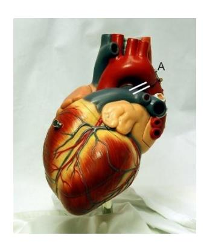

**Figure 16.1** Photograph of a Heart Model.

## **Objectives: After studying this chapter, you will be able to:**

## **Blood**

-   Identify the primary functions of blood, its fluid and cellular components, and its physical characteristics.
-   Discuss the structure and function of red blood cells and hemoglobin.
-   Classify and characterize white blood cells.
-   Describe the structure of platelets and explain the process of hemostasis.
-   Understand the principles of blood typing and be able to interpret the results of a blood typing test.

## **Cardiac tissue**

-   Compare and contrast cardiac tissue histology with skeletal and smooth muscle.

## **Heart (models and sheep heart dissection)**

-   Describe the location of the human heart.
-   Identify and describe the interior and exterior parts of the human heart.
-   Name and located the major external and internal anatomical features and structures of the heart on a chart, model, diagram or preserved specimen (see the important structures listed below)
-   Explain the cardiac cycle.
-   Explain the cardiac conduction system.
-   Describe the process and purpose of an electrocardiogram.
-   Define and describe the pulmonary and systemic circuits.
-   Describe the features and operation of the atrioventricular and semilunar valves.
-   Trace the pathway of blood through the heart.
-   Describe the blood supply to the heart from the structures contained in your list.

## **Structures to identify**

You must be able to identify the following structures on a paper figure, a sheep heart, and/or plastic heart model(s) for the lab quiz.

## **Muscle tissues**

-   Cardiac muscle
-   Skeletal Muscle
-   Smooth muscle

## **Blood**

-   Red blood cells
-   White blood cells
-   Platelets

## **Structures of the Heart Right Side**

-   Vena Cavae
    -   Superior vena cava
    -   Inferior vena cava
-   Right atrium
    -   Pectinate muscles
    -   Right. Auricle
    -   Fossa ovalis
-   Tricuspid valve
-   Right ventricle
    -   Chordae tendineae
    -   Trabeculae carneae
    -   Papillary muscles
-   Pulmonary trunk
-   Pulmonary valve
-   R./L. pulmonary arteries
-   Capillaries of the Lungs

## **Pericardium and the heart wall**

-   Parietal pericardium
    -   Fibrous pericardium
    -   Serous pericardium
-   Pericardial cavity
-   Epicardium (Visceral pericardium)
-   Myocardium
-   Endocardium

## **Left Side**

-   R./L. pulmonary veins
-   Left atrium
    -   Pectinate muscles
    -   Left Auricle
    -   Papillary muscles
-   Bicuspid (Mitral) valve
-   Left ventricle
    -   Chordae tendineae
    -   Trabeculae carneae
    -   Papillary muscles
-   Aorta
-   Aortic valve
-   Ascending Aorta
-   Aortic Arch

## **Coronary circulation**

-   R./L. coronary arteries
-   Cardiac veins (general)
-   Coronary sinus

## **Prelab Activities**

## **Prelab Activity 16.1**

## **Definitions**

-   Blood \_\_\_\_\_\_\_\_\_\_\_\_\_\_\_\_\_\_\_\_\_\_\_\_\_\_\_\_\_\_\_\_\_\_\_\_\_\_\_\_\_\_\_\_\_\_\_\_\_\_\_\_\_\_\_\_
-   Red blood cells \_\_\_\_\_\_\_\_\_\_\_\_\_\_\_\_\_\_\_\_\_\_\_\_\_\_\_\_\_\_\_\_\_\_\_\_\_\_\_\_\_\_\_\_\_\_\_\_
-   White blood cells \_\_\_\_\_\_\_\_\_\_\_\_\_\_\_\_\_\_\_\_\_\_\_\_\_\_\_\_\_\_\_\_\_\_\_\_\_\_\_\_\_\_\_\_\_\_\_
-   Platelets \_\_\_\_\_\_\_\_\_\_\_\_\_\_\_\_\_\_\_\_\_\_\_\_\_\_\_\_\_\_\_\_\_\_\_\_\_\_\_\_\_\_\_\_\_\_\_\_\_\_\_\_\_\_

## **Heart Structures**

-   Right atrium \_\_\_\_\_\_\_\_\_\_\_\_\_\_\_\_\_\_\_\_\_\_\_\_\_\_\_\_\_\_\_\_\_\_\_\_\_\_\_\_\_\_\_\_\_\_\_\_\_\_\_
-   Right ventricle \_\_\_\_\_\_\_\_\_\_\_\_\_\_\_\_\_\_\_\_\_\_\_\_\_\_\_\_\_\_\_\_\_\_\_\_\_\_\_\_\_\_\_\_\_\_\_\_\_
-   Left atrium \_\_\_\_\_\_\_\_\_\_\_\_\_\_\_\_\_\_\_\_\_\_\_\_\_\_\_\_\_\_\_\_\_\_\_\_\_\_\_\_\_\_\_\_\_\_\_\_\_\_\_\_
-   Auricles \_\_\_\_\_\_\_\_\_\_\_\_\_\_\_\_\_\_\_\_\_\_\_\_\_\_\_\_\_\_\_\_\_\_\_\_\_\_\_\_\_\_\_\_\_\_\_\_\_\_\_\_\_\_
-   Left ventricle \_\_\_\_\_\_\_\_\_\_\_\_\_\_\_\_\_\_\_\_\_\_\_\_\_\_\_\_\_\_\_\_\_\_\_\_\_\_\_\_\_\_\_\_\_\_\_\_\_\_
-   Epicardium \_\_\_\_\_\_\_\_\_\_\_\_\_\_\_\_\_\_\_\_\_\_\_\_\_\_\_\_\_\_\_\_\_\_\_\_\_\_\_\_\_\_\_\_\_\_\_\_\_\_\_\_
-   Myocardium \_\_\_\_\_\_\_\_\_\_\_\_\_\_\_\_\_\_\_\_\_\_\_\_\_\_\_\_\_\_\_\_\_\_\_\_\_\_\_\_\_\_\_\_\_\_\_\_\_\_\_
-   Endocardium \_\_\_\_\_\_\_\_\_\_\_\_\_\_\_\_\_\_\_\_\_\_\_\_\_\_\_\_\_\_\_\_\_\_\_\_\_\_\_\_\_\_\_\_\_\_\_\_\_\_
-   Pectinate muscles \_\_\_\_\_\_\_\_\_\_\_\_\_\_\_\_\_\_\_\_\_\_\_\_\_\_\_\_\_\_\_\_\_\_\_\_\_\_\_\_\_\_\_\_\_\_
-   Trabeculae carneae \_\_\_\_\_\_\_\_\_\_\_\_\_\_\_\_\_\_\_\_\_\_\_\_\_\_\_\_\_\_\_\_\_\_\_\_\_\_\_\_\_\_\_\_\_
-   Pulmonary trunk \_\_\_\_\_\_\_\_\_\_\_\_\_\_\_\_\_\_\_\_\_\_\_\_\_\_\_\_\_\_\_\_\_\_\_\_\_\_\_\_\_\_\_\_\_\_\_
-   Superior vena cava \_\_\_\_\_\_\_\_\_\_\_\_\_\_\_\_\_\_\_\_\_\_\_\_\_\_\_\_\_\_\_\_\_\_\_\_\_\_\_\_\_\_\_\_\_
-   Inferior vena cava \_\_\_\_\_\_\_\_\_\_\_\_\_\_\_\_\_\_\_\_\_\_\_\_\_\_\_\_\_\_\_\_\_\_\_\_\_\_\_\_\_\_\_\_\_\_
-   R./L. pulmonary arteries \_\_\_\_\_\_\_\_\_\_\_\_\_\_\_\_\_\_\_\_\_\_\_\_\_\_\_\_\_\_\_\_\_\_\_\_\_\_\_\_\_
-   R./L. pulmonary veins \_\_\_\_\_\_\_\_\_\_\_\_\_\_\_\_\_\_\_\_\_\_\_\_\_\_\_\_\_\_\_\_\_\_\_\_\_\_\_\_\_\_\_
-   Aorta \_\_\_\_\_\_\_\_\_\_\_\_\_\_\_\_\_\_\_\_\_\_\_\_\_\_\_\_\_\_\_\_\_\_\_\_\_\_\_\_\_\_\_\_\_\_\_\_\_\_\_\_\_\_\_\_
-   R./L. coronary arteries \_\_\_\_\_\_\_\_\_\_\_\_\_\_\_\_\_\_\_\_\_\_\_\_\_\_\_\_\_\_\_\_\_\_\_\_\_\_\_\_\_\_\_
-   Cardiac veins (general) \_\_\_\_\_\_\_\_\_\_\_\_\_\_\_\_\_\_\_\_\_\_\_\_\_\_\_\_\_\_\_\_\_\_\_\_\_\_\_\_\_\_
-   Coronary sinus \_\_\_\_\_\_\_\_\_\_\_\_\_\_\_\_\_\_\_\_\_\_\_\_\_\_\_\_\_\_\_\_\_\_\_\_\_\_\_\_\_\_\_\_\_\_\_\_
-   Tricuspid valve \_\_\_\_\_\_\_\_\_\_\_\_\_\_\_\_\_\_\_\_\_\_\_\_\_\_\_\_\_\_\_\_\_\_\_\_\_\_\_\_\_\_\_\_\_\_\_\_\_
-   Bicuspid valve \_\_\_\_\_\_\_\_\_\_\_\_\_\_\_\_\_\_\_\_\_\_\_\_\_\_\_\_\_\_\_\_\_\_\_\_\_\_\_\_\_\_\_\_\_\_\_\_\_
-   Chordae tendineae \_\_\_\_\_\_\_\_\_\_\_\_\_\_\_\_\_\_\_\_\_\_\_\_\_\_\_\_\_\_\_\_\_\_\_\_\_\_\_\_\_\_\_\_\_
-   Papillary muscles \_\_\_\_\_\_\_\_\_\_\_\_\_\_\_\_\_\_\_\_\_\_\_\_\_\_\_\_\_\_\_\_\_\_\_\_\_\_\_\_\_\_\_\_\_\_\_
-   Pulmonary valve \_\_\_\_\_\_\_\_\_\_\_\_\_\_\_\_\_\_\_\_\_\_\_\_\_\_\_\_\_\_\_\_\_\_\_\_\_\_\_\_\_\_\_\_\_\_\_
-   Aortic valve \_\_\_\_\_\_\_\_\_\_\_\_\_\_\_\_\_\_\_\_\_\_\_\_\_\_\_\_\_\_\_\_\_\_\_\_\_\_\_\_\_\_\_\_\_\_\_\_\_\_\_
-   Interatrial septum \_\_\_\_\_\_\_\_\_\_\_\_\_\_\_\_\_\_\_\_\_\_\_\_\_\_\_\_\_\_\_\_\_\_\_\_\_\_\_\_\_\_\_\_\_\_\_
-   Fossa ovalis \_\_\_\_\_\_\_\_\_\_\_\_\_\_\_\_\_\_\_\_\_\_\_\_\_\_\_\_\_\_\_\_\_\_\_\_\_\_\_\_\_\_\_\_\_\_\_\_\_\_\_
-   Interventricular septum \_\_\_\_\_\_\_\_\_\_\_\_\_\_\_\_\_\_\_\_\_\_\_\_\_\_\_\_\_\_\_\_\_\_\_\_\_\_\_\_\_\_
-   Ligamentum arteriosum \_\_\_\_\_\_\_\_\_\_\_\_\_\_\_\_\_\_\_\_\_\_\_\_\_\_\_\_\_\_\_\_\_\_\_\_\_\_\_\_\_\_
-   Sinoatrial node \_\_\_\_\_\_\_\_\_\_\_\_\_\_\_\_\_\_\_\_\_\_\_\_\_\_\_\_\_\_\_\_\_\_\_\_\_\_\_\_\_\_\_\_\_\_\_\_\_
-   Atrioventricular node \_\_\_\_\_\_\_\_\_\_\_\_\_\_\_\_\_\_\_\_\_\_\_\_\_\_\_\_\_\_\_\_\_\_\_\_\_\_\_\_\_\_\_\_
-   Atrioventricular bundle (bundle of His) \_\_\_\_\_\_\_\_\_\_\_\_\_\_\_\_\_\_\_\_\_\_\_\_\_\_\_\_\_\_
-   Bundle branches \_\_\_\_\_\_\_\_\_\_\_\_\_\_\_\_\_\_\_\_\_\_\_\_\_\_\_\_\_\_\_\_\_\_\_\_\_\_\_\_\_\_\_\_\_\_\_
-   Purkinje fibers \_\_\_\_\_\_\_\_\_\_\_\_\_\_\_\_\_\_\_\_\_\_\_\_\_\_\_\_\_\_\_\_\_\_\_\_\_\_\_\_\_\_\_\_\_\_\_\_\_

## **Prelab Activity 16.2**

## **Identification**

Name the numbered heart structures (chamber or blood vessel)

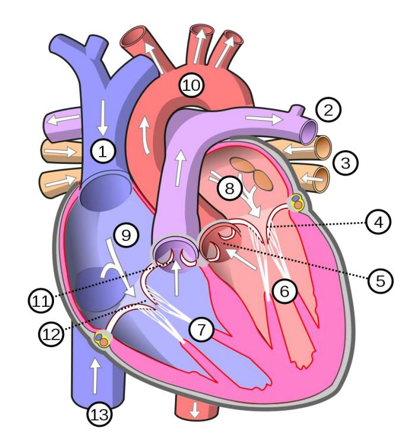

Figure 16.2 Diagram of the Human Heart.

|      |     |
|------|-----|
| 1\.  |     |
| 2\.  |     |
| 3\.  |     |
| 4\.  |     |
| 5\.  |     |
| 6\.  |     |
| 7\.  |     |
| 8\.  |     |
| 9\.  |     |
| 10\. |     |

## **Prelab Activity 16.3:**

Identify the following structures

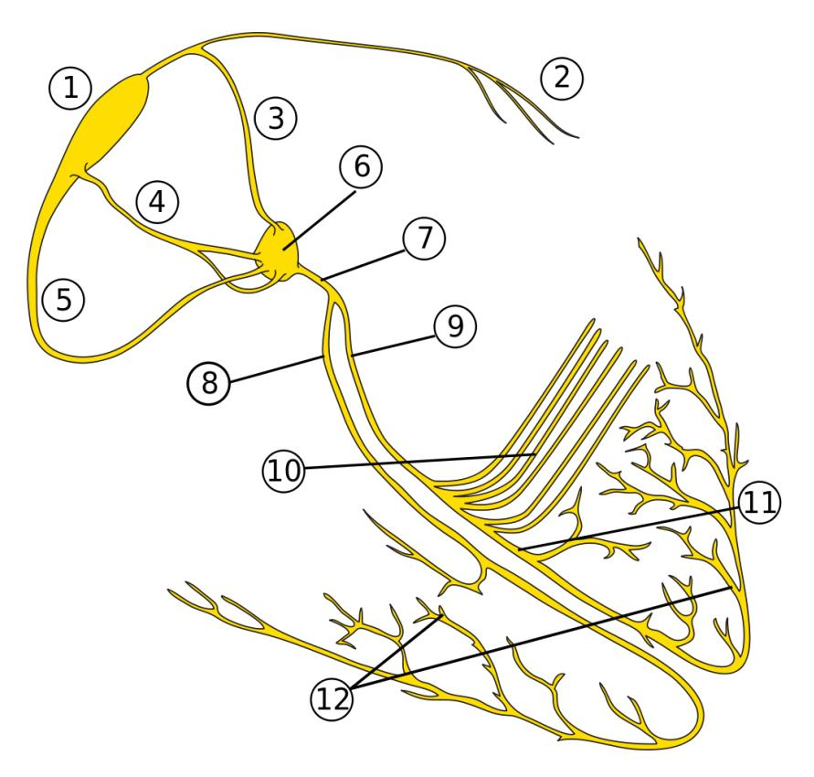

**Figure 16.3** Electrical Conduction System of the Heart.

| Structure number | Heart electrical conduction structure |
|------------------|---------------------------------------|
| 1                |                                       |
| 6                |                                       |
| 7                |                                       |
| 8                |                                       |
| 9                |                                       |
| 12               |                                       |

## **Lab Activities**

## **Cardiovascular System**

## **Muscular tissue**

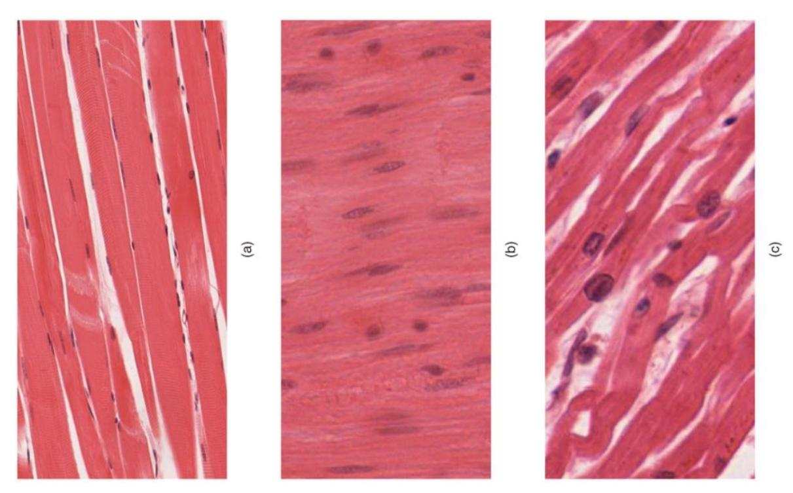

**Figure 16.4** Histology of Muscle Tissues.

## **Lab Activity 16.1. Comparing skeletal and cardiac muscle.**

Take the information from your textbook, fill in the table with the characteristics of the following muscle cells.

| Characteristics             | Skeletal | Smooth | Cardiac |
|-----------------------------|----------|--------|---------|
| Cell shape                  |          |        |         |
| Cells branched/unbranched   |          |        |         |
| Number of nuclei            |          |        |         |
| Voluntary/Involuntary       |          |        |         |
| Striations present          |          |        |         |
| Intercalated disks present? |          |        |         |

## **Blood Cells and Blood Typing Terms**

-   Red blood cells
-   White blood cells
-   Platelets

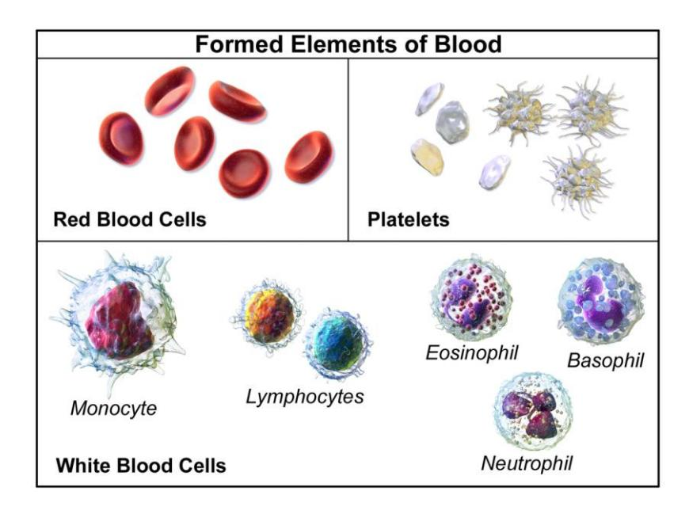

**Figure 16.5** Blood's Formed Elements.

## **Lab Activity 16.2.**

Identify and describe the structure and function of the formed elements of the blood.

| Characteristics        | Erythrocyte | Lymphocyte | Platelet |
|------------------------|-------------|------------|----------|
| Cell shape             |             |            |          |
| Nucleus present/absent |             |            |          |
| Number of nuclei       |             |            |          |
| Function               |             |            |          |

## **General Circulation**

-   Pulmonary system circulation
-   Systemic system circulation

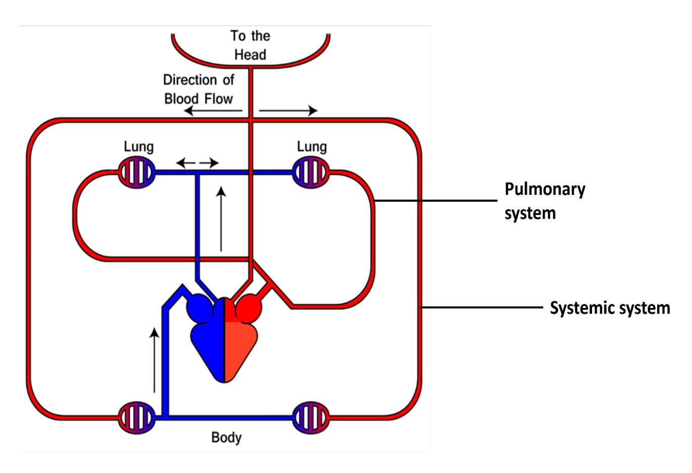

**Figure 16.6** Circulations Systems of the Heart.

## **Pericardium and the heart wall**

### **Terms**

-   Parietal pericardium

    -   Fibrous pericardium
    -   Serous pericardium

-   Pericardial cavity

-   Visceral pericardium (epicardium)

-   Myocardium

-   Endocardium

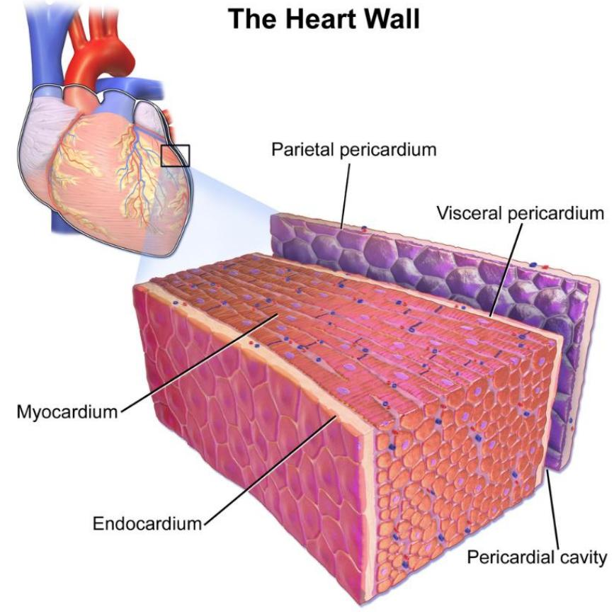

**Figure 16.7** The Heart Wall.

## **Lab Activity 16.3. The heart wall.**

Obtain a 3-D and a HubbardTM Scientific model of the heart, label the following structures.

-   Epicardium
-   Myocardium
-   Endocardium.
-   Indicate where you would expect to find the pericardial cavity and the parietal pericardium.
-   Take pictures of the labelled model(s).

## **Heart Structure**

## **Lab Activity 16.4. Internal and external structures of the heart**

Pair up into groups and use the labeled diagram at the left to identify the structures of the heart, the associated structures and external circulation on one of the lab models. (The structure can be a vessel, a chamber, a valve, or another feature related to heart anatomy; Figures 16.7-16.10).

-   Obtain a roll of tape and a sharpie to label the structures.
-   Take a picture of the unlabeled and labeled model to add to your study guide. Have your instructor review your work.
-   Prepare a five-minute demonstration identifying the parts of the heart.

## **Heart Terms**

## **Right Side**

-   Vena Cavae
    -   Superior vena cava
    -   Inferior vena cava
-   Right atrium
    -   Pectinate muscles
    -   Right. Auricle
    -   Fossa ovalis
-   Tricuspid valve
-   Right ventricle
    -   Chordae tendineae
    -   Trabeculae carneae
    -   Papillary muscles
-   Pulmonary trunk
    -   Pulmonary valve
-   R./L. pulmonary arteries
-   Capillaries of the Lungs

## **Left Side**

-   R./L. pulmonary veins
-   Left atrium
    -   Pectinate muscles
    -   Left Auricle
    -   Papillary muscles
-   Bicuspid (Mitral) valve
-   Left ventricle
    -   Chordae tendineae
    -   Trabeculae carneae
    -   Papillary muscles
-   Aorta
    -   Aortic valve
-   Ascending Aorta
-   Aortic Arch

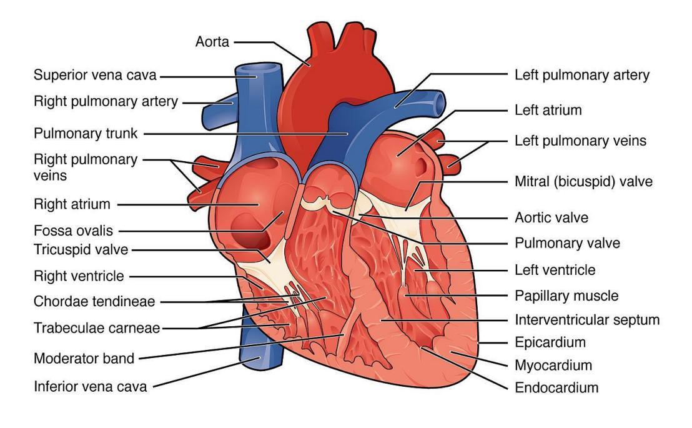

**Figure 16.8** Internal Anatomy of the Heart.

## **Associated structures**

-   Interatrial septum
-   Interventricular septum
-   Ligamentum arteriosum

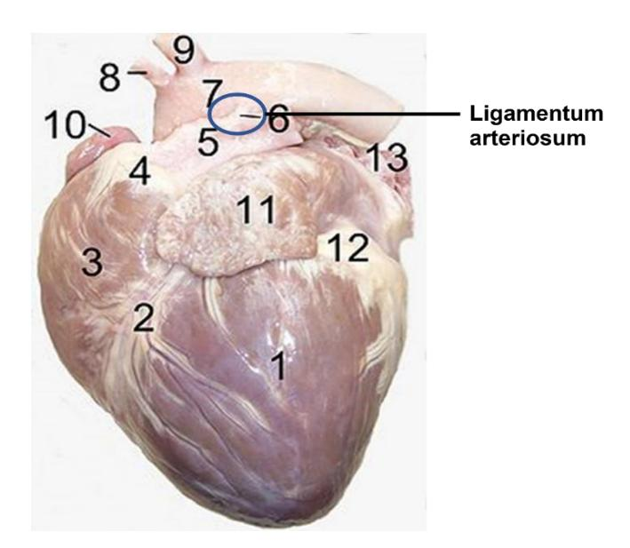

**Figure 16.9** Ligamentum Arteriosum on the Dog Heart.

## **Coronary Circulation**

-   R./L. coronary arteries
-   Cardiac veins (general)
-   Coronary sinus

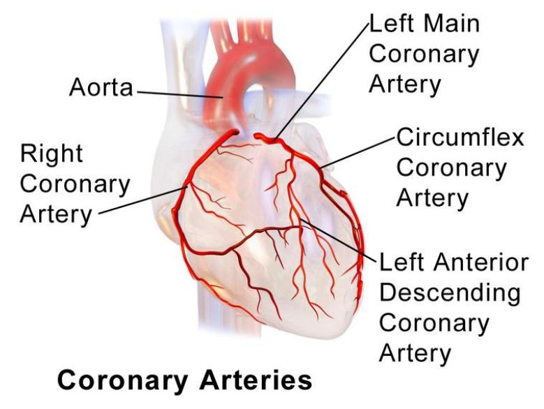

**Figure 16.10** Coronary Arteries, Anterior View.

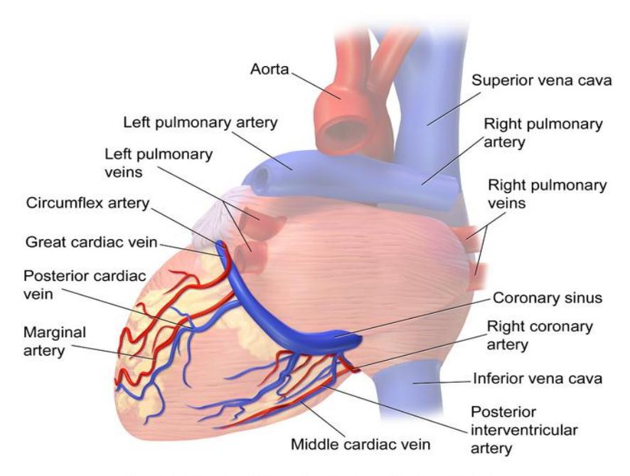

**Figure 16.11** Coronary Circulation Posterior View.

## **Electrical Conduction System of the Heart**

### **Terms**

-   Sinoatrial node
-   Atrioventricular node
-   Atrioventricular bundle (bundle of His)
-   Bundle branches
-   Purkinje fibers

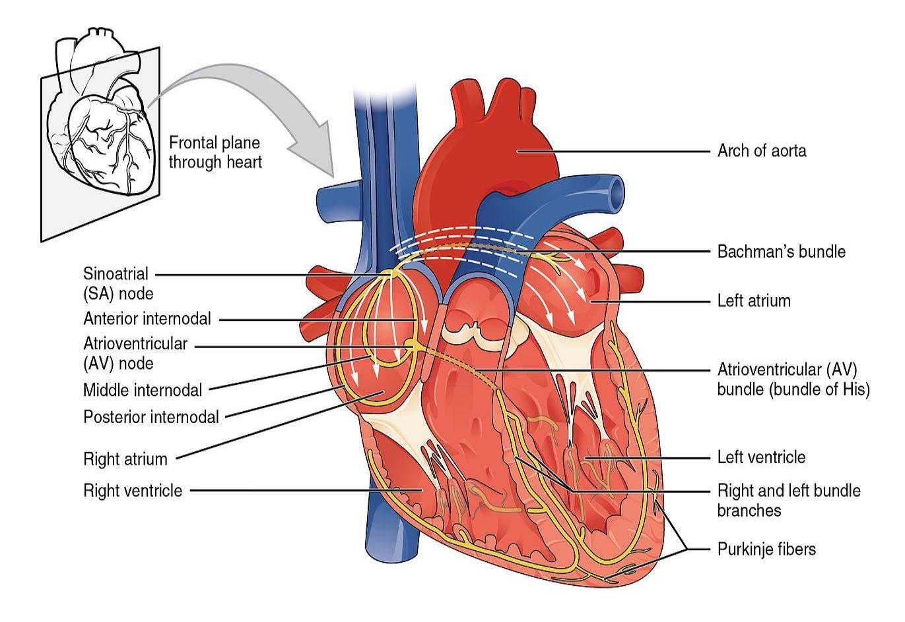

**Figure 16.12** Electrical Conduction System of the Heart.

### **Lab Activity 16.5. Internal and external structures of the heart**

-   Pair up into groups and use the labeled diagram above to identify the electrical conduction system of the heart on one of the lab 3-D and/or HubbardTM Scientific models.
-   Obtain a roll of tape and a sharpie to label the structures.
-   Take a picture of the unlabeled and labeled model to add to your study guide. Have your instructor review your work.

## **Sheep Heart Dissection:**

## **Lab Activity 16.6. Sheep heart dissection**

Form groups of three (3) to dissect the sheep heart. Each person will have a specific job during this operation; the surgeon, the assistant and one person documenting the work by taking pictures or drawing diagrams of the procedure.

**Lab safety:** Globes, safety goggles and proper clothing are required. Follow your Instructor's instructions.

### **Equipment needed:**

-   Dissecting equipment
    -   Gloves and goggles
    -   Dissection tray
    -   Scalpel
    -   Probes
    -   Scissors
    -   Dissecting pins
    -   Pipe cleaners
    -   Preserved heart.

1.  The picture below is the anterior view of a preserved sheep's heart. Note that the anterior side has an interventricular sulcus containing the left anterior descending coronary artery embedded within the fat. In this figure, the area to the right of the sulcus is the left side of the heart. If the fibrous pericardium is intact, slit it open with a scalpel or cut it with scissors, then cut it from the attachments. Note how the visceral pericardium differs from the parietal pericardium.

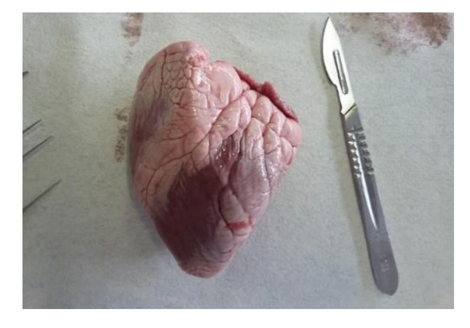

**Figure 16.13** Sheep Heart Anterior View.

2.  Examine the external surface of the heart. Determine which side is superior (broad, with large blood vessels issuing from it) and which side is inferior (the apex is pointed). Locate the pulmonary trunk. This large vessel delivers blood to the lungs from the right side of the heart. It is located in the middle of the anterior side of the heart.

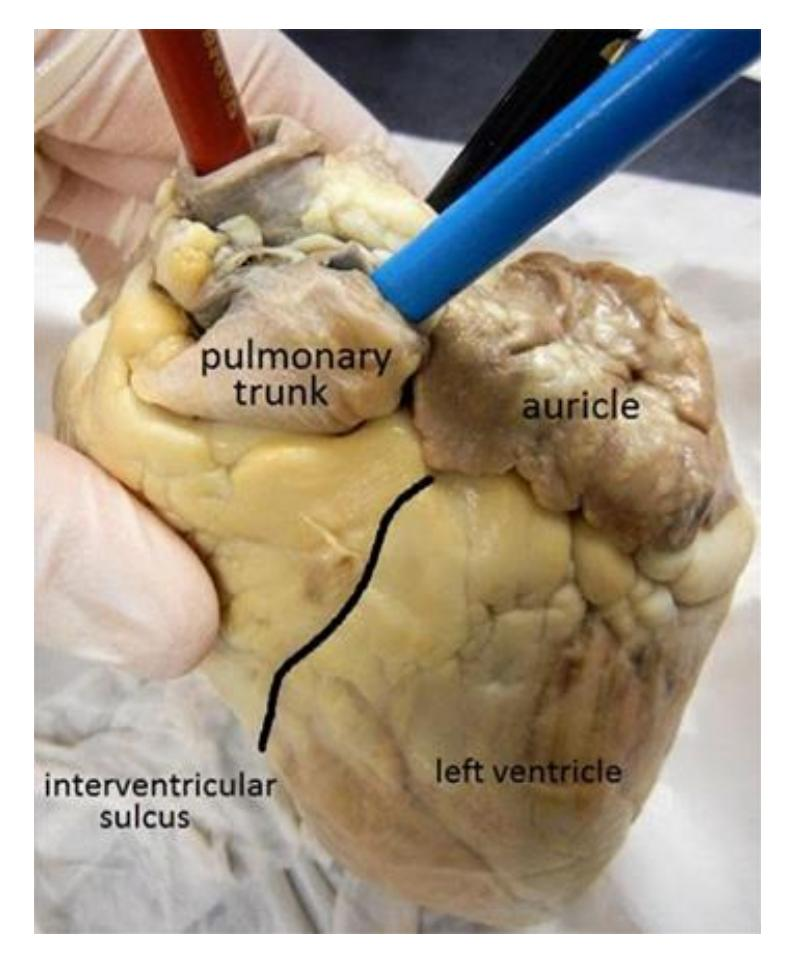

**Figure 16.14** Anterior Aspect of the Sheep Heart.

3.  Locate the auricles, the dog-ear-shaped external extensions of the atria on the superior region of the heart. The rest of the heart will be the ventricles. You should be able to distinguish between the right and left ventricles by palpating the heart with your gloved hand. The right ventricle is smaller and thinner-walled and will feel less firm when you squeeze it. You should also be able to feel the interventricular sulcus as well.
4.  Take your dissecting knife and make a single coronal cut through the ventricle up to the atria /base of the heart. This will divide the heart into anterior and posterior halves. Open the two halves so that you can observe the internal features of the heart.

<!-- -->

5.  Look at the heart wall. Identify the epicardium, the myocardium, and the endocardium. Identify the left ventricle from the right ventricle. As was noted above, the left ventricle which serves the systemic circulation is thicker than the right ventricle which pumps blood through the pulmonary system.

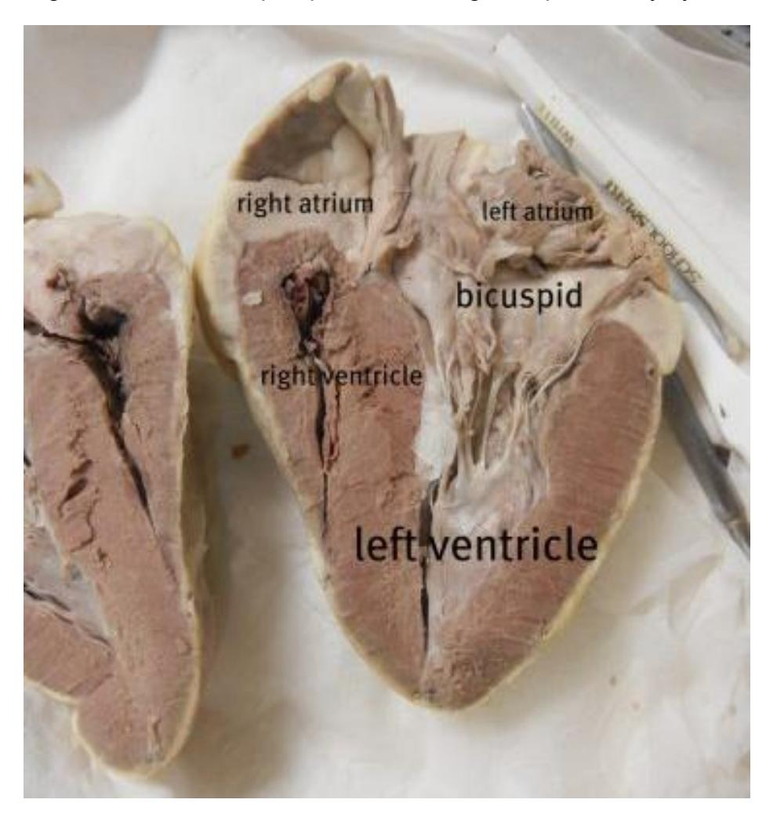

**Figure 16.15** Dissected Sheep Heart.

6.  Within the interior of the heart identify the AV valves (bicuspid and tricuspid) and their features, including the chordae tendineae and their attachment to the papillary muscles. Within the walls of the ventricles, you should be able to see and feel the trabeculae carneae, or muscular ridges that are distinct from the papillary muscle. The thick interventricular septum between the right and left ventricles should be very evident. Note that the walls of the left ventricle are much thicker than those of the right ventricle. In the atria, you may be able to see and feel the ridges of the pectinate muscles.

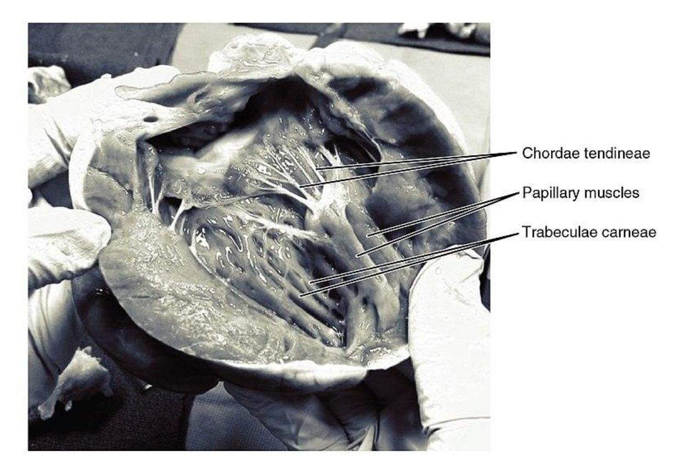

**Figure 16.15** Chordae Tendineae and Papillary Muscles.

7.  Create or upload a picture of your dissected sheep heart to your computer study guide. On your image, label the right and left ventricles, the right and left atria, the bicuspid and tricuspid valves, the papillary muscles, the chordae tendineae, the interventricular septum, the pulmonary trunk, and the aorta.
8.  Call your instructor to review and discuss your dissection. Following your review, discard your specimen in the biohazard waste container. Wash and dry your tray and instruments, then clean your bench area.

### **Lab Activity 16.6 Tracing blood flow through the sheep heart.**

• Beginning with a drop of blood in the superior / inferior vena cavae, trace and list the pathway taken by a drop of blood as it travels throughout the heart and the pulmonary system. Include as many heart chambers, structures, great vessels, and valves as you can. You will end at the **Aorta**.

### **Terms**

## **Cardiac Cycle**

-   Systole
-   Diastole

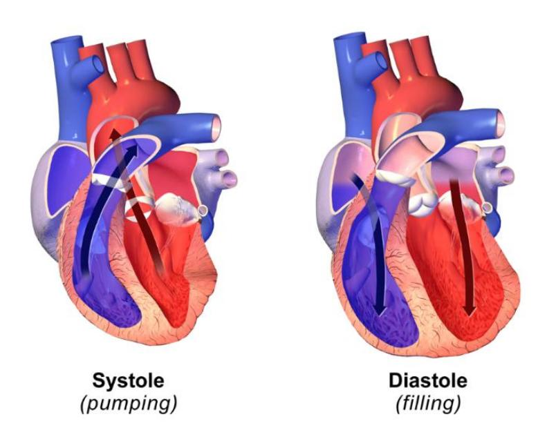

**Figure 16.17** Cardiac Systole and Diastole.

• Cardiac (ventricular) systole: Both AV valves (the tricuspid and the mitral) are closed by back-pressure as the ventricles are contracted and their blood volumes are ejected through the newly-opened pulmonary valve and aortic valve into the [pulmonary trunk](https://en.wikipedia.org/wiki/Pulmonary_trunk) and aorta respectively.

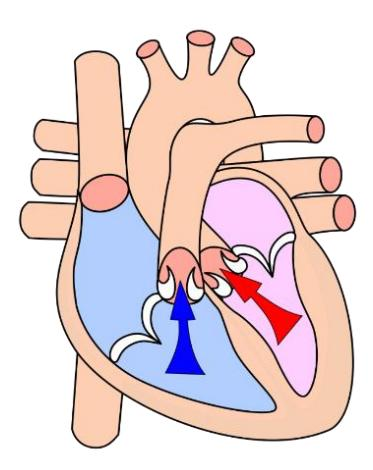

**Figure 16.18** Cardiac (Ventricular) Systole. Both AV Valves lose due to backpressure as the ventricles contract. Their blood volumes are ejected through the newly opened semilunar valves (*pulmonary valve* and *aortic valve)* into the pulmonary trunk and aorta, respectively.

• Cardiac diastole: Both AV valves (tricuspid and the mitral are open to enable blood to flow directly into both left and right ventricles, where it is collected for the next contraction.

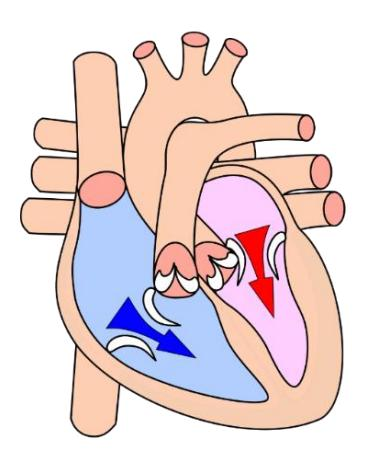

**Figure 16.19** Cardiac Diastole. Both AV valves open to enable blood to flow Directly into both left and right ventricles.

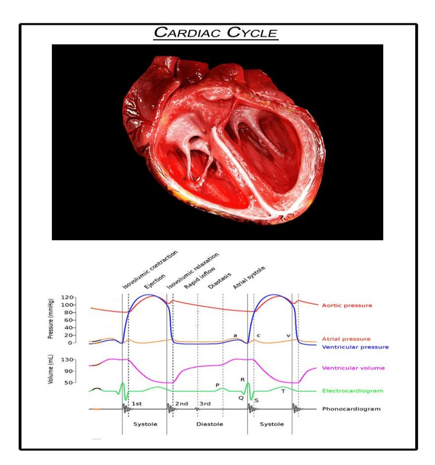

**Figure 16.20** Cardiac Systole, Diastole, and the Cardiac Cycle.

## **Electrocardiogram:**

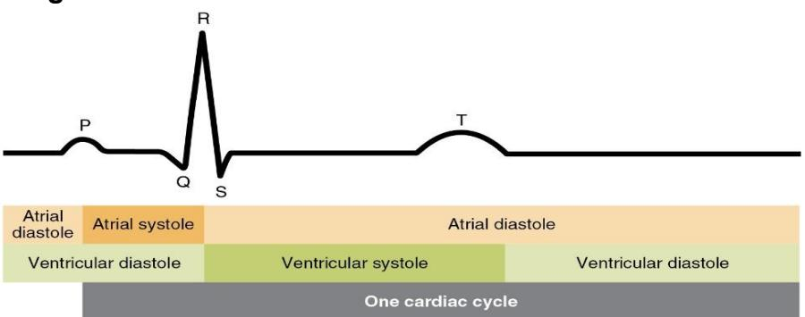

**Figure 16.21** Electrocardiogram.

## **The Cardiac Cycle:**

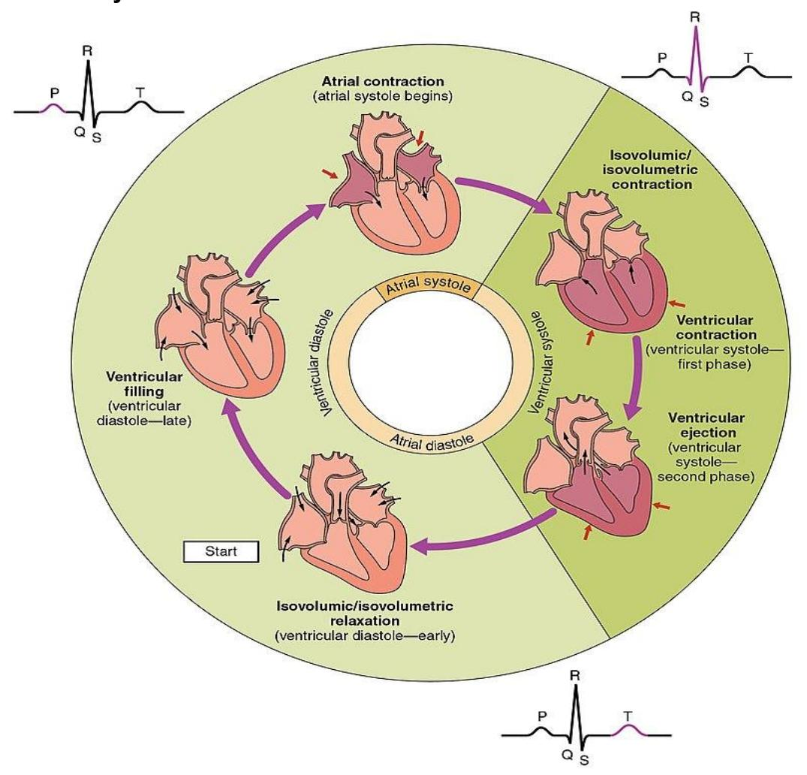

**Figure 16.22** Cardiac Cycle Phases.

## **Post Lab Activities**

## **Check Your Understanding:**

## **Post Lab Activity 16.1**

Answer the following questions concerning the cardiac cycle.

-   Which letter(s) describes the deflection for ventricular depolarization?

-   Which letter(s) describes the T-wave deflection?

-   Which letter(s) describes the deflection for atrial depolarization?

-   What is occurring in the heart to cause the P wave?

-   What is occurring in the heart to cause the QRS wave complex?

-   What is occurring in the heart to cause the T wave?

## **Post Lab Activity 16.2:**

| Answer | Term | Definition |
|----|----|----|
|  | 1\) atrioventricular valve | a\) a one-way valve between the atrium and the ventricle |
|  | 2\) bicuspid valve | b\) cone shaped muscular structures in the ventricles. |
|  | 3\) chordae tendineae | c\) Valve between the left atrium and left ventricle |
|  | 4\) papillary muscles | d\) one way valve with three flaps or cusps located in the aorta or pulmonary trunk |
|  | 5\) semilunar valve | e\) Valve between the right atrium and right ventricle |
|  | 6\) Tricuspid valve | f\) connective tissue strands between the papillary muscles and the atrioventricular valves |

## **Matching**

Match the following terms with the correct parts in figure 16.22.

a)  Aorta
b)  Aortic valve
c)  Left atrium (Atrium sinistrum)
d)  Left ventricle
e)  Inferior Vena Cave (Venea cava Inferior)
f)  Mitral valve
g)  Pulmonary artery
h)  Pulmonary valve
i)  Pulmonary vein
j)  Right atrium (Atrium dextra)
k)  Superior Vena Cave (Venea cava Superior)
l)  Right ventricle
m)  Tricuspid valve

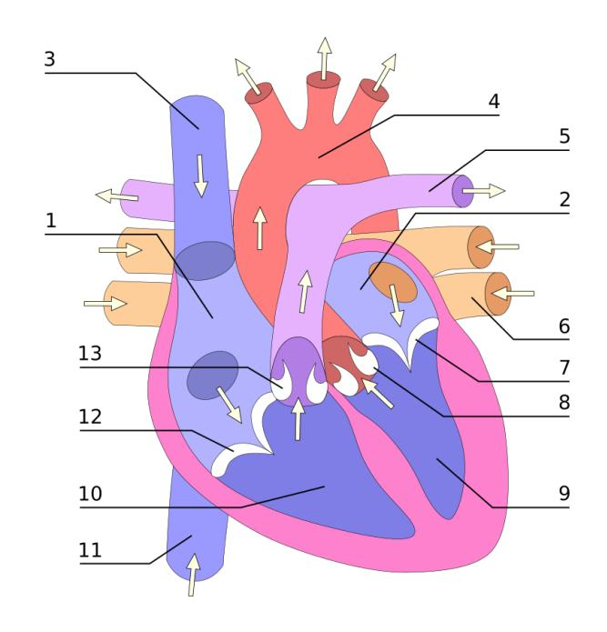

**Figure 16.23** The Heart, Unlabeled.

1)  \_\_\_\_\_\_\_\_\_\_
2)  \_\_\_\_\_\_\_\_\_\_
3)  \_\_\_\_\_\_\_\_\_\_
4)  \_\_\_\_\_\_\_\_\_\_
5)  \_\_\_\_\_\_\_\_\_\_
6)  \_\_\_\_\_\_\_\_\_\_
7)  \_\_\_\_\_\_\_\_\_\_
8)  \_\_\_\_\_\_\_\_\_\_
9)  \_\_\_\_\_\_\_\_\_\_
10) \_\_\_\_\_\_\_\_\_\_
11) \_\_\_\_\_\_\_\_\_\_
12) \_\_\_\_\_\_\_\_\_\_
13) \_\_\_\_\_\_\_\_\_\_

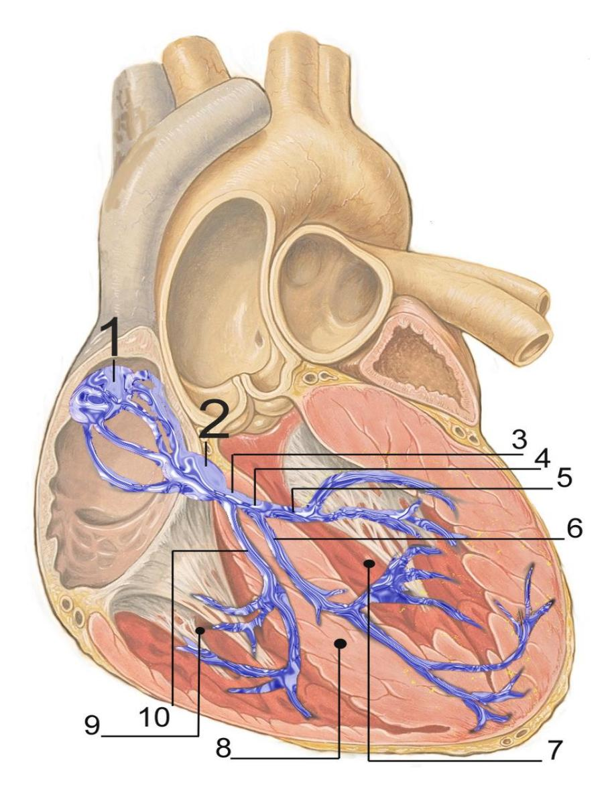

Figure 16.24 Electrical System of the Heart, Unlabeled.

Name the numbered heart structures (chamber or blood vessel)

|     |     |
|-----|-----|
| 1   | 6   |
| 2   | 7   |
| 3   | 8   |
| 4   | 9   |
| 5   | 10  |

## **Crosswords**

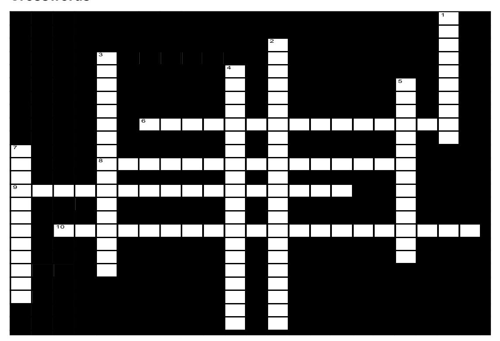

**Figure 16.25** Heart – 3

### **Across**

**6** \_\_\_\_ refers to the time during which a chamber is contracting, while \_\_\_\_ refers to the period of relaxation. (7,8)

**8** The Purkinje fibers conduct the electrical signal around the \_\_\_ into the \_\_\_\_\_ walls. (4,11)

**9** The QRS complex is caused by the action potentials form the \_\_ \_\_\_\_ of the heart all the way through the \_\_\_\_. (2,4,10)

**10** During fetal development there is a connection called the ductus arteriosus between the pulmonary trunk and the aorta. In the adult all that remains of this is the \_\_ \_\_\_. (10,10)

### **Down**

**1** The \_\_\_ is the highest, strongest peak on a normal ECG. (3,7)

**2** The bundle branches provide an electrical pathway form the AV bundle through the \_\_\_\_ \_\_\_\_ to the Purkinje fibers. (16,6)

**3** A(n) \_\_\_ is a recording of all of the action potentials generated by the cardiac nodes and fibers at any given instant. (17)

**4** If the SA node fails the \_\_\_\_ \_\_ acts and a backup initiator for the heartbeat. (16,4)

**5** The normal beat of the heart is initiated by the \_\_\_ \_\_\_ (10,4)

**7** During fetal development, the two atria are connected by the \_\_\_\_ to allow blood to bypass the incomplete pulmonary circuit. (7,5)

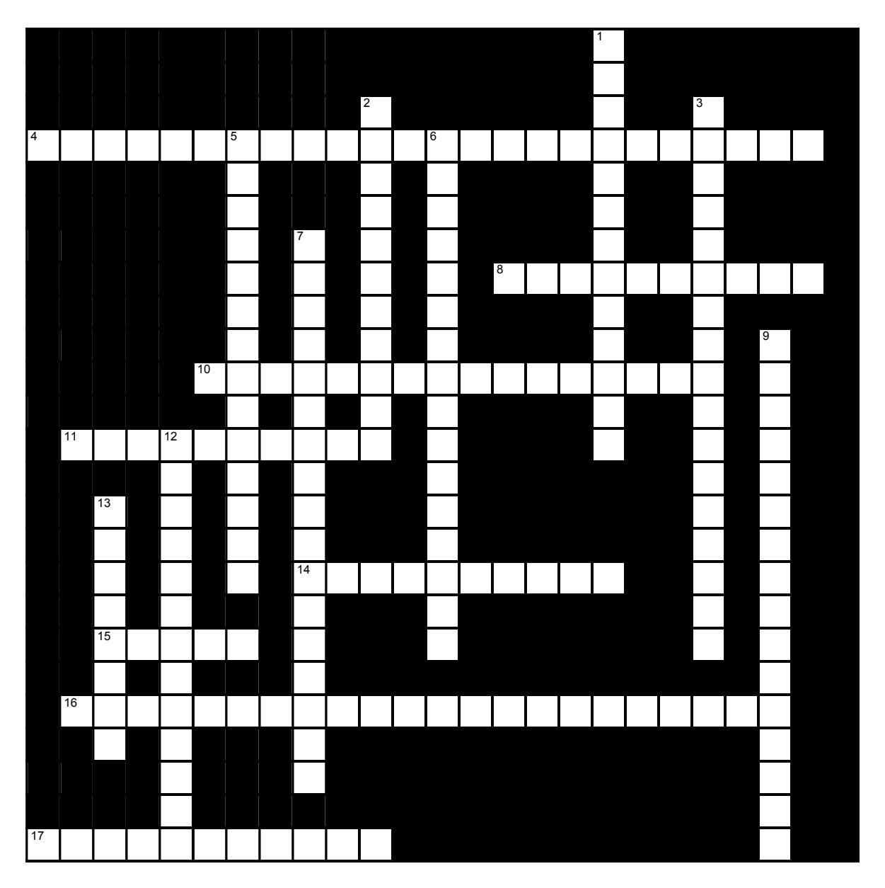

**Figure 16.26** Cardiovascular System and the Heart

### **Across**

-   4 The \_\_\_\_ collects blood from the greater cardiac veins and delivers it into the \_\_\_\_ near the fossa ovalis. (8,5,5,6)

-   8 The \_\_\_\_ make up most of the heart's volume (10)

-   10 The \_\_\_ \_\_\_\_ \_\_\_ returns blood from the regions below the diaphragm. (8,4,4)

-   11 the muscular wall is the heart is called the \_\_\_. (10)

-   14 The \_\_\_ \_\_ receives the blood form the lungs (4,6)

-   15 The uppermost chambers of the heart are the \_\_\_. (5)

-   16 The right atrium receives blood from at least three veins; the superior and inferior \_\_\_ \_\_\_ and the \_\_\_\_ \_\_\_\_. (4,5,8,5)

-   17 the heart is found in the \_\_\_ (the Cavity) and 2/3 of it lies to the left of the midsternal line. (11)

### **Down**

-   1 The force needed to pump the blood through the body is greater than the lungs, so the strongest muscle of the heart forms the myocardium of the \_\_\_ \_\_\_\_. (4,9)

-   2 The inner layer of the heart and the blood vessels is a layer of squamous epithelium referred to as the \_\_\_\_\_. (11)

-   3 The inner walls of the ventricles of the heart are marked by ridges of muscle called the \_\_\_\_ \_\_\_\_ (10,7)

-   5 Which chamber pumps blood to the lungs? (5,9)

-   6 The \_\_\_\_ \_\_\_\_ \_\_\_ returns blood from the regions above the diaphragm. (8,4,4)

-   7 Blood has to travel further in the \_\_\_\_ circuit than in the \_\_\_\_\_ circuit; therefore, there is more friction, and more strength is required to keep it moving. (8,9)

-   9 Nipple shaped muscles called the \_\_\_ \_\_\_ project from the inner walls of the ventricle. These are attached to the chordae tendineae and the valves above them to prevent blood backflow during each contraction cycle. (9,7)

-   12 The \_\_\_ arteries supply the heart with oxygen. These arise at the base of the \_\_\_\_. (8,5)

-   13 The \_\_\_ of the heart is the widest part; the \_\_\_\_ is the narrowest end. (4,4)

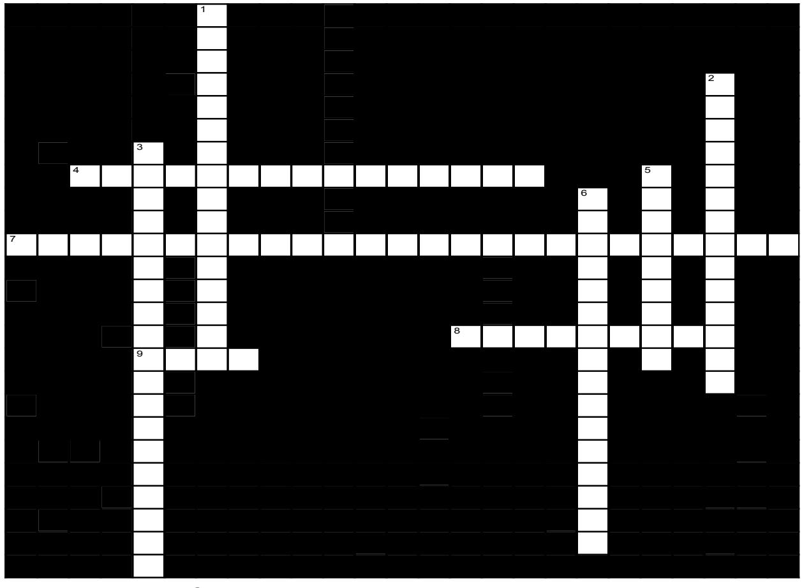

**Figure 16.27** Heart Structures - 2.

### **Across**

-   4 There are collagen cords called the \_\_\_ \_\_\_ anchoring the AV valves to the muscular protrusions of the ventricle's walls. (7,8)

-   7 AV valves are one-way valves which allow blood to flow from the \_\_\_ to the \_\_\_. They are closed as the \_\_\_\_ contract. (5,10,10)

-   8 The aortic semilunar valve separates the \_\_\_ ventricle from the \_\_\_\_ . (4,5)

-   9 The Semilunar valves \_\_\_ during contraction of the ventricles. (4)

### **Down**

-   1 The semilunar closed due to \_\_\_ \_\_\_\_ from blood in the vessels. (8,8)

-   2 The pulmonary semilunar valve separates the \_\_\_ ventricle from the \_\_\_\_ artery. (5,9)

-   3 The two large arteries leaving the heart are the \_\_\_ and the \_\_\_ \_\_. (5,9,5)

-   5 To prevent the AV valves from opening backwards by blood pressure, there are collagen cords connecting them to the \_\_\_\_ muscles. (9)

-   6 Cardiac muscle fibers are joined at their ends at a region called the \_\_\_ \_\_\_ (12,4)

## **Keys**

## **Figure 16.24: Heart – 3**

-   **Across: 6** Systole diastole, **8** Apex ventricular, **9** AV node ventricles, **10** Ligamentum arteriosum.
-   **Down: 1** ORS complex, **2** Interventricular septum, **3** Electrocardiogram, **4** Atrioventricular node, **5** Sinoatrial node, **7** Foramen ovale.

### **Figure 16.25: Cardiovascular System and the Heart**

-   **Across: 4** Coronary sinus right atrium**, 8** Ventricles, **10** Inferior vena cava**, 11** Myocardium, **14** Left atrium, **15** Atria, **16** Vena cavae coronary sinus**, 17** Mediastinum.
-   **Down: 1** Left ventricle, **2** Endothelium, **3** Trabeculae carneae, **5** Right ventricle, **6** Superior vena cava, **7** Systemic pulmonary, **9** Papillary muscles**, 12** Coronary aorta, **13** Base apex.

## **Figure 16.26: Heart Structures - 2.**

-   **Across: 4** Chordae tendineae, **7** Atria ventricles ventricles, **8** Left aorta, **9** Open.
-   **Down: 1** Backward pressure, **2** Right pulmonary, **3** Aorta pulmonary trunk, **5** Papillary, **6** Intercalated disk.

**Chapter 16: Cardiovascular System: Blood and Heart**

| Terms | Definitions |
|----|----|
| anastomosis (plural = anastomoses) | area where vessels unite to allow blood to circulate even if there may be partial blockage in another branch |
| anterior cardiac veins | vessels that parallel the small cardiac arteries and drain the anterior surface of the right ventricle; bypass the coronary sinus and drain directly into the right atrium |
| anterior interventricular artery (also, left anterior descending artery or LAD) | major branch of the left coronary artery that follows the anterior interventricular sulcus |
| anterior interventricular sulcus | sulcus located between the left and right ventricles on the anterior surface of the heart |
| aortic valve (also, aortic semilunar valve) | valve located at the base of the aorta |
| artificial pacemaker | medical device that transmits electrical signals to the heart to ensure that it contracts and pumps blood to the body |
| atrial reflex (also, called Bainbridge reflex) | autonomic reflex that responds to stretch receptors in the atria that send impulses to the cardioaccelerator area to increase HR when venous flow into the atria increases |
| atrioventricular (AV) node | clump of myocardial cells located in the inferior portion of the right atrium within the atrioventricular septum; receives the impulse from the SA node, pauses, and then transmits it into specialized conducting cells within the interventricular septum |
| atrioventricular bundle (also, bundle of His) | group of specialized myocardial conductile cells that transmit the impulse from the AV node through the interventricular septum; form the left and right atrioventricular bundle branches |
| atrioventricular bundle branches (also, left, or right bundle branches) | specialized myocardial conductile cells that arise from the bifurcation of the atrioventricular bundle and pass through the interventricular septum; lead to the Purkinje fibers and also to the right papillary muscle via the moderator band |
| atrioventricular septum | cardiac septum located between the atria and ventricles; atrioventricular valves are located here |
| atrioventricular valves | one-way valves located between the atria and ventricles; the valve on the right is called the tricuspid valve, and the one on the left is the mitral or bicuspid valve |
| atrium (plural = atria) | upper or receiving chamber of the heart that pumps blood into the lower chambers just prior to their contraction; the right atrium receives blood from the systemic circuit that flows into the right ventricle; the left atrium receives blood from the pulmonary circuit that flows into the left ventricle |
| auricle | extension of an atrium visible on the superior surface of the heart |
| autorhythmicity | ability of cardiac muscle to initiate its own electrical impulse that triggers the mechanical contraction that pumps blood at a fixed pace without nervous or endocrine control |
| Bachmann's bundle (also, interatrial band) | group of specialized conducting cells that transmit the impulse directly from the SA node in the right atrium to the left atrium |
| Bainbridge reflex (also, called atrial reflex) | autonomic reflex that responds to stretch receptors in the atria that send impulses to the cardioaccelerator area to increase HR when venous flow into the atria increases |
| baroreceptor reflex autonomic | autonomic reflex in which the cardiac centers monitor signals from the baroreceptor stretch receptors and regulate heart function based on blood flow |
| bundle branches | offshoots of the bundle of His which transmit cardiac action potentials (electrical signals) from the bundle of His to Purkinje fibers in heart ventricles. |
| bicuspid valve (also, mitral valve or left atrioventricular valve) | valve located between the left atrium and ventricle; consists of two flaps of tissue |
| bundle of His (also, atrioventricular bundle) | group of specialized myocardial conductile cells that transmit the impulse from the AV node through the interventricular septum; form the left and right atrioventricular bundle branches |
| cardiac cycle | period of time between the onset of atrial contraction (atrial systole) and ventricular relaxation (ventricular diastole) |
| cardiac notch | depression in the medial surface of the inferior lobe of the left lung where the apex of the heart is located |
| cardiac output (CO) | amount of blood pumped by each ventricle for one minute; equals HR multiplied by SV |
| cardiac plexus | paired complex network of nerve fibers near the base of the heart that receive sympathetic and parasympathetic stimulations to regulate HR |
| cardiac reflexes | series of autonomic reflexes that enable the cardiovascular centers to regulate heart function based upon sensory information from a variety of visceral sensors |
| cardiac reserve | difference between maximum and resting CO |
| cardiac skeleton (also, skeleton of the heart) | reinforced connective tissue located within the atrioventricular septum; includes four rings that surround the openings between the atria and ventricles, and the openings to the pulmonary trunk and aorta; the point of attachment for the heart valves |
| cardiogenic area | area near the head of the embryo where the heart begins to develop 18-19 days after fertilization |
| cardiogenic cords | two strands of tissue that form within the cardiogenic area |
| cardiomyocyte | muscle cell of the heart |
| chordae tendineae | string-like extensions of tough connective tissue that extend from the flaps of the atrioventricular valves to the papillary muscles |
| circumflex artery | branch of the left coronary artery that follows coronary sulcus |
| coronary arteries | branches of the ascending aorta that supply blood to the heart; the left coronary artery feeds the left side of the heart, the left atrium and ventricle, and the interventricular septum; the right coronary artery feeds the right atrium, portions of both ventricles, and the heart conduction system |
| coronary sinus | large, thin-walled vein on the posterior surface of the heart that lies within the atrioventricular sulcus and drains the heart myocardium directly into the right atrium |
| coronary sulcus | sulcus that marks the boundary between the atria and ventricles |
| coronary veins | vessels that drain the heart and generally parallel the large surface arteries |
| diastole | period of time when the heart muscle is relaxed, and the chambers fill with blood |
| ejection fraction | portion of the blood that is pumped or ejected from the heart with each contraction; mathematically represented by SV divided by EDV |
| electrocardiogram (ECG) also abbreviated as EKG | surface recording of the electrical activity of the heart that can be used for diagnosis of irregular heart function |
| end diastolic volume (EDV) (also, preload) | the amount of blood in the ventricles at the end of atrial systole just prior to ventricular contraction |
| end systolic volume (ESV) | amount of blood remaining in each ventricle following systole |
| endocardial tubes | stage in which lumens form within the expanding cardiogenic cords, forming hollow structures |
| endocardium | innermost layer of the heart lining the heart chambers and heart valves; composed of endothelium reinforced with a thin layer of connective tissue that binds to the myocardium |
| endothelium | layer of smooth, simple squamous epithelium that lines the endocardium and blood vessels |
| epicardial coronary arteries | surface arteries of the heart that generally follow the sulci |
| epicardium | innermost layer of the serous pericardium and the outermost layer of the heart wall |
| filling time | duration of ventricular diastole during which filling occurs |
| foramen ovale | opening in the fetal heart that allows blood to flow directly from the right atrium to the left atrium, bypassing the fetal pulmonary circuit |
| fossa ovalis | oval-shaped depression in the interatrial septum that marks the former location of the foramen ovale |
| Frank-Starling mechanism | relationship between ventricular stretch and contraction in which the force of heart contraction is directly proportional to the initial length of the muscle fiber |
| great cardiac vein | vessel that follows the interventricular sulcus on the anterior surface of the heart and flows along the coronary sulcus into the coronary sinus on the posterior surface; parallels the anterior interventricular artery and drains the areas supplied by this vessel |
| heart block | interruption in the normal conduction pathway |
| heart bulge | prominent feature on the anterior surface of the heart, reflecting early cardiac development |
| heart rate (HR) | number of times the heart contracts (beats) per minute |
| heart sounds | sounds heard via auscultation with a stethoscope of the closing of the atrioventricular valves ('lub') and semilunar valves ('dub') |
| hypertrophic cardiomyopathy | pathological enlargement of the heart, generally for no known reason |
| inferior vena cava | large systemic vein that returns blood to the heart from the inferior portion of the body |
| interatrial band (also, Bachmann's bundle) | group of specialized conducting cells that transmit the impulse directly from the SA node in the right atrium to the left atrium |
| interatrial septum | cardiac septum located between the two atria; contains the fossa ovalis after birth |
| intercalated disc | physical junction between adjacent cardiac muscle cells; consisting of desmosomes, specialized linking proteoglycans, and gap junctions that allow passage of ions between the two cells |
| internodal pathways | specialized conductile cells within the atria that transmit the impulse from the SA node throughout the myocardial cells of the atrium and to the AV node |
| interventricular septum | cardiac septum located between the two ventricles |
| isovolumic contraction (also, isovolumetric contraction) | initial phase of ventricular contraction in which tension and pressure in the ventricle increase, but no blood is pumped or ejected from the heart |
| isovolumic ventricular relaxation phase | initial phase of the ventricular diastole when pressure in the ventricles drops below pressure in the two major arteries, the pulmonary trunk, and the aorta, and blood attempts to flow back into the ventricles, producing the dicrotic notch of the ECG and closing the two semilunar valves |
| left atrioventricular valve (also, mitral valve or bicuspid valve) | valve located between the left atrium and ventricle; consists of two flaps of tissue |
| Ligamentum arteriosum | a small ligament attaching the aorta to the pulmonary artery. It serves no function in adults but is the remnant of the ductus arteriosus formed within three weeks after birth. |
| marginal arteries | branches of the right coronary artery that supply blood to the superficial portions of the right ventricle |
| mesoderm | one of the three primary germ layers that differentiate early in embryonic development |
| mesothelium | simple squamous epithelial portion of serous membranes, such as the superficial portion of the epicardium (the visceral pericardium) and the deepest portion of the pericardium (the parietal pericardium) |
| middle cardiac vein | vessel that parallels and drains the areas supplied by the posterior interventricular artery; drains into the great cardiac vein |
| mitral valve (also, left atrioventricular valve or bicuspid valve) | valve located between the left atrium and ventricle; consists of two flaps of tissue |
| moderator band | band of myocardium covered by endocardium that arises from the inferior portion of the interventricular septum in the right ventricle and crosses to the anterior papillary muscle; contains conductile fibers that carry electrical signals followed by contraction of the heart |
| murmur | unusual heart sound detected by auscultation; typically related to septal or valve defects |
| myocardial conducting cells | specialized cells that transmit electrical impulses throughout the heart and trigger contraction by the myocardial contractile cells |
| myocardial contractile cells | bulk of the cardiac muscle cells in the atria and ventricles that conduct impulses and contract to propel blood |
| myocardium | thickest layer of the heart composed of cardiac muscle cells built upon a framework of primarily collagenous fibers and blood vessels that supply it and the nervous fibers that help to regulate it |
| P wave | component of the electrocardiogram that represents the depolarization of the atria |
| pacemaker | cluster of specialized myocardial cells known as the SA node that initiates the sinus rhythm |
| papillary muscle | extension of the myocardium in the ventricles to which the chordae tendineae attach |
| pectinate muscles | muscles muscular ridges seen on the anterior surface of the right atrium |
| pericardial cavity | cavity surrounding the heart filled with a lubricating serous fluid that reduces friction as the heart contracts |
| pericardial sac (also, pericardium) | membrane that separates the heart from other mediastinal structures; consists of two distinct, fused sublayers: the fibrous pericardium and the parietal pericardium |
| pericardium (also, pericardial sac) | membrane that separates the heart from other mediastinal structures; consists of two distinct, fused sublayers: the fibrous pericardium and the parietal pericardium |
| posterior cardiac vein | vessel that parallels and drains the areas supplied by the marginal artery branch of the circumflex artery; drains into the great cardiac vein |
| posterior interventricular artery (also, posterior descending artery) | branch of the right coronary artery that runs along the posterior portion of the interventricular sulcus toward the apex of the heart and gives rise to branches that supply the interventricular septum and portions of both ventricles |
| posterior interventricular sulcus | sulcus located between the left and right ventricles on the posterior surface of the heart |
| pulmonary arteries | left and right branches of the pulmonary trunk that carry deoxygenated blood from the heart to each of the lungs |
| pulmonary capillaries | capillaries surrounding the alveoli of the lungs where gas exchange occurs carbon dioxide exits the blood and oxygen enters |
| pulmonary circuit | circuit blood flow to and from the lungs |
| pulmonary trunk | large arterial vessel that carries blood ejected from the right ventricle; divides into the left and right pulmonary arteries |
| pulmonary valve (also, pulmonary semilunar valve, the pulmonic valve, or the right semilunar valve) | valve at the base of the pulmonary trunk that prevents backflow of blood into the right ventricle; consists of three flaps |
| pulmonary veins | veins that carry highly oxygenated blood into the left atrium, which pumps the blood into the left ventricle, which in turn pumps oxygenated blood into the aorta and to the many branches of the systemic circuit |
| Purkinje fibers | specialized myocardial conduction fibers that arise from the bundle branches and spread the impulse to the myocardial contraction fibers of the ventricles |
| QRS complex | component of the electrocardiogram that represents the depolarization of the ventricles and includes, as a component, the repolarization of the atria |
| right atrioventricular valve (also, tricuspid valve) | valve located between the right atrium and ventricle; consists of three flaps of tissue |
| semilunar valves | valves located at the base of the pulmonary trunk and at the base of the aorta |
| septum (plural = septa) | walls or partitions that divide the heart into chambers |
| septum primum | flap of tissue in the fetus that covers the foramen ovale within a few seconds after birth |
| sinoatrial (SA) node | known as the pacemaker, a specialized clump of myocardial conducting cells located in the superior portion of the right atrium that has the highest inherent rate of depolarization that then spreads throughout the heart |
| sinus rhythm | normal contractile pattern of the heart |
| sinus venosus | develops into the posterior portion of the right atrium, the SA node, and the coronary sinus |
| small cardiac vein | parallels the right coronary artery and drains blood from the posterior surfaces of the right atrium and ventricle; drains into the coronary sinus, middle cardiac vein, or right atrium |
| spontaneous depolarization (also, prepotential depolarization) | ) the mechanism that accounts for the autorhythmic property of cardiac muscle; the membrane potential increases as sodium ions diffuse through the always-open sodium ion channels and causes the electrical potential to rise |
| stroke volume (SV) | amount of blood pumped by each ventricle per contraction; also, the difference between EDV and ESV |
| sulcus (plural = sulci) | fat-filled groove visible on the surface of the heart; coronary vessels are also located in these areas |
| superior vena cava | large systemic vein that returns blood to the heart from the superior portion of the body |
| systemic circuit | blood flow to and from virtually all of the tissues of the body |
| systole | period of time when the heart muscle is contracting |
| T wave | component of the electrocardiogram that represents the repolarization of the ventricles |
| target heart rate | range in which both the heart and lungs receive the maximum benefit from an aerobic workout |
| trabeculae carneae | ridges of muscle covered by endocardium located in the ventricles |
| tricuspid valve | term used most often in clinical settings for the right atrioventricular valve |
| truncus arteriosus | portion of the primitive heart that will eventually divide and give rise to the ascending aorta and pulmonary trunk |
| valve | (in the cardiovascular system) a specialized structure located within the heart or vessels that ensures one-way flow of blood |
| ventricle | one of the primary pumping chambers of the heart located in the lower portion of the heart; the left ventricle is the major pumping chamber on the lower left side of the heart that ejects blood into the systemic circuit via the aorta and receives blood from the left atrium; the right ventricle is the major pumping chamber on the lower right side of the heart that ejects blood into the pulmonary circuit via the pulmonary trunk and receives blood from the right atrium |
| ventricular ejection phase | second phase of ventricular systole during which blood is pumped from the ventricle |
