# **Cardiovascular System; the Arteries and Veins**

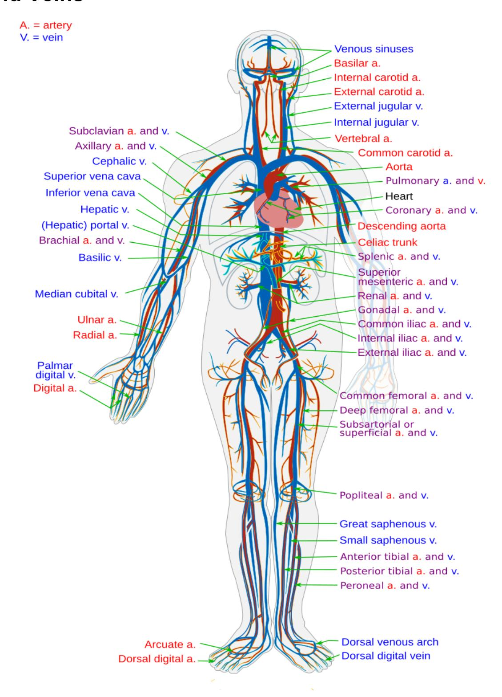

**Figure 17.1** The Systemic Blood Vessels.

## **Learning Objectives, by the end of this lesson, you will be able to:**

-   Compare and contrast the anatomical structure of arteries, arterioles, capillaries, venules, and veins.
-   Describe the anatomy of blood vessel walls and the tissues that compose each and state the function of each layer.
-   Correlate differences in artery, vein, and capillary structure with the functions of these vessels
-   Recognize and differentiate an artery and a vein in a picture, on a diagram or on a model.
-   List or identify the major arteries branching from the aorta and indicate the body region supplied by each (see the table below) Identify and describe the hepatic portal system.
-   List or identify the major veins draining to the superior or inferior vena cava, and the body region drained by each (see the below table).
-   Label the major blood vessels of the pulmonary and systemic circulations.
-   Compare and contrast pulmonary circulation from systemic circulation.
-   Compare fetal circulation to that of an individual after birth and identify the following structures of importance:
    -   Ductus arteriosus
    -   Ligamentum arteriosum
    -   Foramen ovale

## **Blood Vessels**

Blood Vessel Structure

-   Tunica intima
-   Tunica media
-   Tunica externa/adventitia
-   Be able to distinguish between arteries and veins by their walls.

## **Specific Arteries**

-   Aorta
    -   Ascending aorta
    -   Aortic arch
    -   Descending aorta
-   Brachiocephalic trunk
-   Common carotid
    -   Internal carotid
    -   External carotid
-   Subclavian
-   Axillary
-   Brachial
-   Radial
-   Ulnar

## **Specific Veins**

-   Superior vena cava

-   Brachiocephalic

-   Internal jugular

-   External jugular

-   Subclavian

-   Axillary

-   Brachial

-   Radial

-   Ulnar

-   Basilic

-   Vertebral

-   Celiac trunk

-   Superior mesenteric

-   Inferior mesenteric

-   Renal

-   Gonadal

-   Common iliac

    -   External iliac
    -   Internal iliac

-   Femoral

-   Anterior tibial

-   Posterior tibial

-   Cephalic

-   Median cubital

-   Inferior vena cava

-   Hepatic portal

-   Hepatic

-   Renal

-   Common iliac

-   Femoral

-   Great saphenous

## **Prelab Activities:**

### **Prelab Activity: 17.1**

### **Blood Vessels**

-   Tunica intima \_\_\_\_\_\_\_\_\_\_\_\_\_\_\_\_\_\_\_\_\_\_\_\_\_\_\_\_\_\_\_\_\_\_
-   Tunica media \_\_\_\_\_\_\_\_\_\_\_\_\_\_\_\_\_\_\_\_\_\_\_\_\_\_\_\_\_\_\_\_\_\_
-   Tunica externa/adventitia \_\_\_\_\_\_\_\_\_\_\_\_\_\_\_\_\_\_\_\_\_\_\_\_\_\_\_\_\_\_\_\_\_\_

### Specific Arteries

-   Aorta \_\_\_\_\_\_\_\_\_\_\_\_\_\_\_\_\_\_\_\_\_\_\_\_\_\_\_\_\_\_\_\_\_\_
-   Ascending aorta \_\_\_\_\_\_\_\_\_\_\_\_\_\_\_\_\_\_\_\_\_\_\_\_\_\_\_\_\_\_\_\_\_\_
-   Aortic arch \_\_\_\_\_\_\_\_\_\_\_\_\_\_\_\_\_\_\_\_\_\_\_\_\_\_\_\_\_\_\_\_\_\_
-   Descending aorta \_\_\_\_\_\_\_\_\_\_\_\_\_\_\_\_\_\_\_\_\_\_\_\_\_\_\_\_\_\_\_\_\_\_
-   Brachiocephalic trunk \_\_\_\_\_\_\_\_\_\_\_\_\_\_\_\_\_\_\_\_\_\_\_\_\_\_\_\_\_\_\_\_\_\_
-   Common carotid \_\_\_\_\_\_\_\_\_\_\_\_\_\_\_\_\_\_\_\_\_\_\_\_\_\_\_\_\_\_\_\_\_\_
-   Internal carotid \_\_\_\_\_\_\_\_\_\_\_\_\_\_\_\_\_\_\_\_\_\_\_\_\_\_\_\_\_\_\_\_\_\_
-   External carotid \_\_\_\_\_\_\_\_\_\_\_\_\_\_\_\_\_\_\_\_\_\_\_\_\_\_\_\_\_\_\_\_\_\_
-   Subclavian \_\_\_\_\_\_\_\_\_\_\_\_\_\_\_\_\_\_\_\_\_\_\_\_\_\_\_\_\_\_\_\_\_\_
-   Axillary \_\_\_\_\_\_\_\_\_\_\_\_\_\_\_\_\_\_\_\_\_\_\_\_\_\_\_\_\_\_\_\_\_\_
-   Brachial \_\_\_\_\_\_\_\_\_\_\_\_\_\_\_\_\_\_\_\_\_\_\_\_\_\_\_\_\_\_\_\_\_\_
-   Radial \_\_\_\_\_\_\_\_\_\_\_\_\_\_\_\_\_\_\_\_\_\_\_\_\_\_\_\_\_\_\_\_\_\_
-   Ulnar \_\_\_\_\_\_\_\_\_\_\_\_\_\_\_\_\_\_\_\_\_\_\_\_\_\_\_\_\_\_\_\_\_\_
-   Vertebral \_\_\_\_\_\_\_\_\_\_\_\_\_\_\_\_\_\_\_\_\_\_\_\_\_\_\_\_\_\_\_\_\_\_
-   Celiac trunk \_\_\_\_\_\_\_\_\_\_\_\_\_\_\_\_\_\_\_\_\_\_\_\_\_\_\_\_\_\_\_\_\_\_
-   Superior mesenteric \_\_\_\_\_\_\_\_\_\_\_\_\_\_\_\_\_\_\_\_\_\_\_\_\_\_\_\_\_\_\_\_\_\_
-   Inferior mesenteric \_\_\_\_\_\_\_\_\_\_\_\_\_\_\_\_\_\_\_\_\_\_\_\_\_\_\_\_\_\_\_\_\_\_
-   Renal \_\_\_\_\_\_\_\_\_\_\_\_\_\_\_\_\_\_\_\_\_\_\_\_\_\_\_\_\_\_\_\_\_\_
-   Gonadal \_\_\_\_\_\_\_\_\_\_\_\_\_\_\_\_\_\_\_\_\_\_\_\_\_\_\_\_\_\_\_\_\_\_
-   Common iliac \_\_\_\_\_\_\_\_\_\_\_\_\_\_\_\_\_\_\_\_\_\_\_\_\_\_\_\_\_\_\_\_\_\_
-   External iliac \_\_\_\_\_\_\_\_\_\_\_\_\_\_\_\_\_\_\_\_\_\_\_\_\_\_\_\_\_\_\_\_\_\_
-   Internal iliac \_\_\_\_\_\_\_\_\_\_\_\_\_\_\_\_\_\_\_\_\_\_\_\_\_\_\_\_\_\_\_\_\_\_
-   Femoral \_\_\_\_\_\_\_\_\_\_\_\_\_\_\_\_\_\_\_\_\_\_\_\_\_\_\_\_\_\_\_\_\_\_
-   Anterior tibial \_\_\_\_\_\_\_\_\_\_\_\_\_\_\_\_\_\_\_\_\_\_\_\_\_\_\_\_\_\_\_\_\_\_
-   Posterior tibial \_\_\_\_\_\_\_\_\_\_\_\_\_\_\_\_\_\_\_\_\_\_\_\_\_\_\_\_\_\_\_\_\_\_

## **Specific Veins**

-   Superior vena cava \_\_\_\_\_\_\_\_\_\_\_\_\_\_\_\_\_\_\_\_\_\_\_\_\_\_\_\_\_\_\_\_\_\_
-   Brachiocephalic \_\_\_\_\_\_\_\_\_\_\_\_\_\_\_\_\_\_\_\_\_\_\_\_\_\_\_\_\_\_\_\_\_\_
-   Internal jugular \_\_\_\_\_\_\_\_\_\_\_\_\_\_\_\_\_\_\_\_\_\_\_\_\_\_\_\_\_\_\_\_\_\_
-   External jugular \_\_\_\_\_\_\_\_\_\_\_\_\_\_\_\_\_\_\_\_\_\_\_\_\_\_\_\_\_\_\_\_\_\_
-   Subclavian \_\_\_\_\_\_\_\_\_\_\_\_\_\_\_\_\_\_\_\_\_\_\_\_\_\_\_\_\_\_\_\_\_\_
-   Axillary \_\_\_\_\_\_\_\_\_\_\_\_\_\_\_\_\_\_\_\_\_\_\_\_\_\_\_\_\_\_\_\_\_\_
-   Brachial \_\_\_\_\_\_\_\_\_\_\_\_\_\_\_\_\_\_\_\_\_\_\_\_\_\_\_\_\_\_\_\_\_\_
-   Radial \_\_\_\_\_\_\_\_\_\_\_\_\_\_\_\_\_\_\_\_\_\_\_\_\_\_\_\_\_\_\_\_\_\_
-   Ulnar \_\_\_\_\_\_\_\_\_\_\_\_\_\_\_\_\_\_\_\_\_\_\_\_\_\_\_\_\_\_\_\_\_\_
-   Basilic \_\_\_\_\_\_\_\_\_\_\_\_\_\_\_\_\_\_\_\_\_\_\_\_\_\_\_\_\_\_\_\_\_\_
-   Cephalic \_\_\_\_\_\_\_\_\_\_\_\_\_\_\_\_\_\_\_\_\_\_\_\_\_\_\_\_\_\_\_\_\_\_
-   Median cubital \_\_\_\_\_\_\_\_\_\_\_\_\_\_\_\_\_\_\_\_\_\_\_\_\_\_\_\_\_\_\_\_\_\_
-   Inferior vena cava \_\_\_\_\_\_\_\_\_\_\_\_\_\_\_\_\_\_\_\_\_\_\_\_\_\_\_\_\_\_\_\_\_\_
-   Hepatic portal \_\_\_\_\_\_\_\_\_\_\_\_\_\_\_\_\_\_\_\_\_\_\_\_\_\_\_\_\_\_\_\_\_\_
-   Hepatic \_\_\_\_\_\_\_\_\_\_\_\_\_\_\_\_\_\_\_\_\_\_\_\_\_\_\_\_\_\_\_\_\_\_
-   Renal \_\_\_\_\_\_\_\_\_\_\_\_\_\_\_\_\_\_\_\_\_\_\_\_\_\_\_\_\_\_\_\_\_\_
-   Common iliac \_\_\_\_\_\_\_\_\_\_\_\_\_\_\_\_\_\_\_\_\_\_\_\_\_\_\_\_\_\_\_\_\_\_
-   Femoral \_\_\_\_\_\_\_\_\_\_\_\_\_\_\_\_\_\_\_\_\_\_\_\_\_\_\_\_\_\_\_\_\_\_
-   Great saphenous \_\_\_\_\_\_\_\_\_\_\_\_\_\_\_\_\_\_\_\_\_\_\_\_\_\_\_\_\_\_\_\_\_\_

## **Lab Activities**

## **Blood Vessel Structure, Arteries, and Veins**

## **Lab Activity 17.1**

Break up into your assigned groups. Obtain a 3-D model of the veins and arteries.

-   Use the information from your text and the following pages to locate and identify the veins and artery, the layers found in each and the valves in the veins.
-   Use some labelling tape to identify each vessel layer or structures. Have another group check your work for correctness. Have your instructor review your material as well.
-   Remember to take some pictures of your work to include in your study guide.

## **Blood Vessel Structure Terms**

-   Artery

-   Vein

-   Valve

-   Tunica intima

-   Tunica media

-   Tunica externa/adventitia

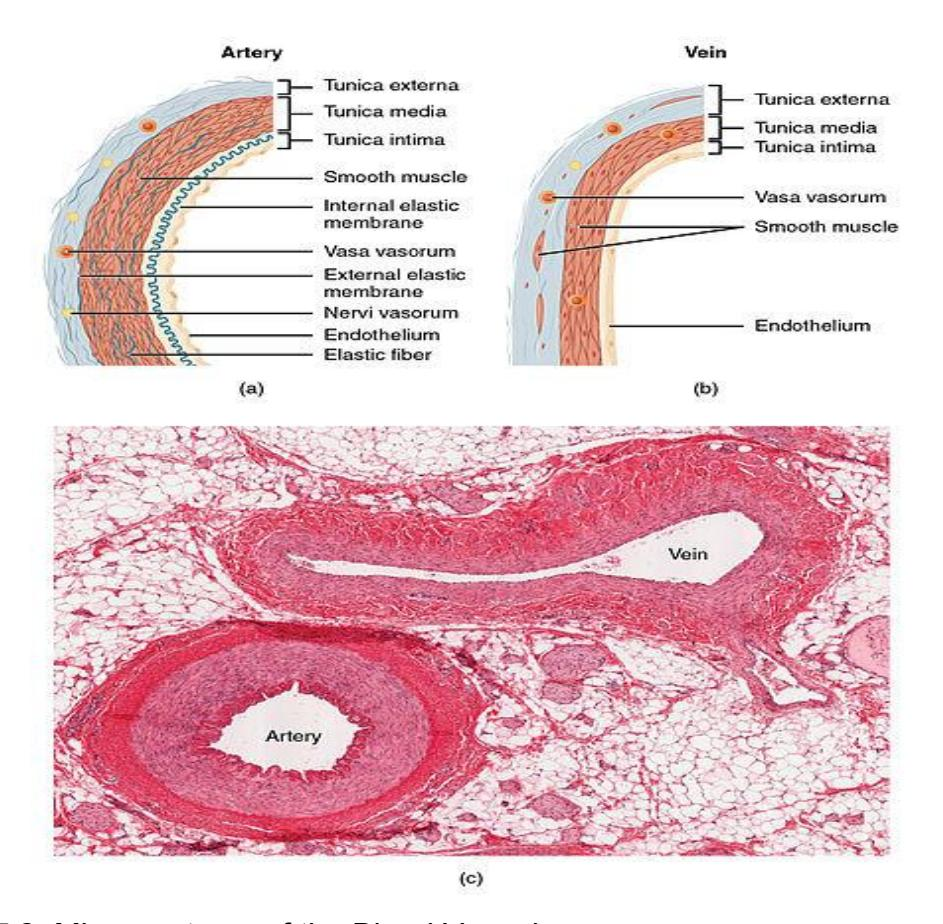

**Figure 17.2** Microanatomy of the Blood Vessels.

## **Specific Arteries of the Systemic System Terms**

-   Aorta

    -   Ascending aorta
    -   Aortic arch
    -   Descending aorta

-   Brachiocephalic trunk

-   Right and Left Common Carotid

    -   Internal carotid
    -   External carotid

-   Right and Left Vertebral

-   Right and Left Subclavian

-   Axillary

-   Brachial

-   Radial

-   Ulnar

-   Celiac trunk

-   Superior mesenteric

-   Inferior mesenteric

-   Renal

-   Gonadal

-   Common iliac

    -   External iliac
    -   Internal iliac

-   Femoral

-   Anterior tibial

-   Posterior tibial

## **Lab Activity 17.2**

Break up into your assigned groups. Obtain a plaque, 3-D model of the veins and arteries or an unlabeled diagram of the circulatory system. Use the information from your text and the following pages ( figures 17.3 – 17.12) to locate and identify the veins and arteries in the body.

-   Use labelling tape to identify each vessel on the model. Have another group check your work for correctness. Have your instructor review your material as well.
-   Remember to take some pictures of your work to include in your study guide.

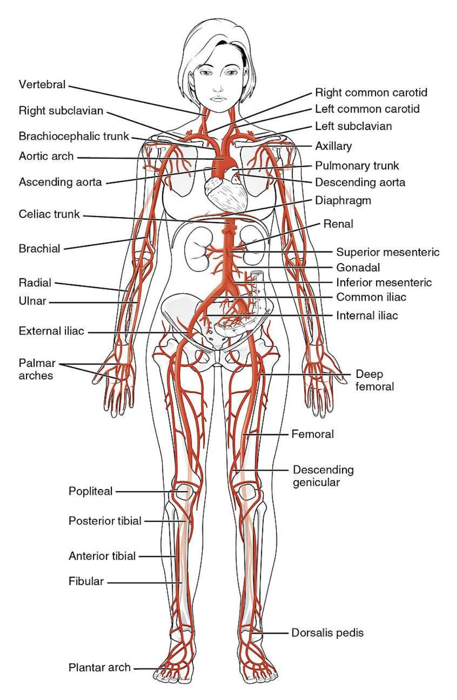

**Figure 17.3** The Major Systemic Arteries.

## **Arteries of the Head and Neck Terms**

### **Aorta**

-   Ascending aorta
-   Aortic arch
-   Descending aorta

## **Aortic Arch Branches**

-   Brachiocephalic trunk
    -   Right Common Carotid
        -   Internal carotid
        -   External carotid
    -   Right Subclavian
        -   Right vertebral
        -   Right axillary
-   Left Common carotid.
    -   Internal carotid
    -   External carotid
-   Left Subclavian
    -   Left vertebral.
    -   Left axillary

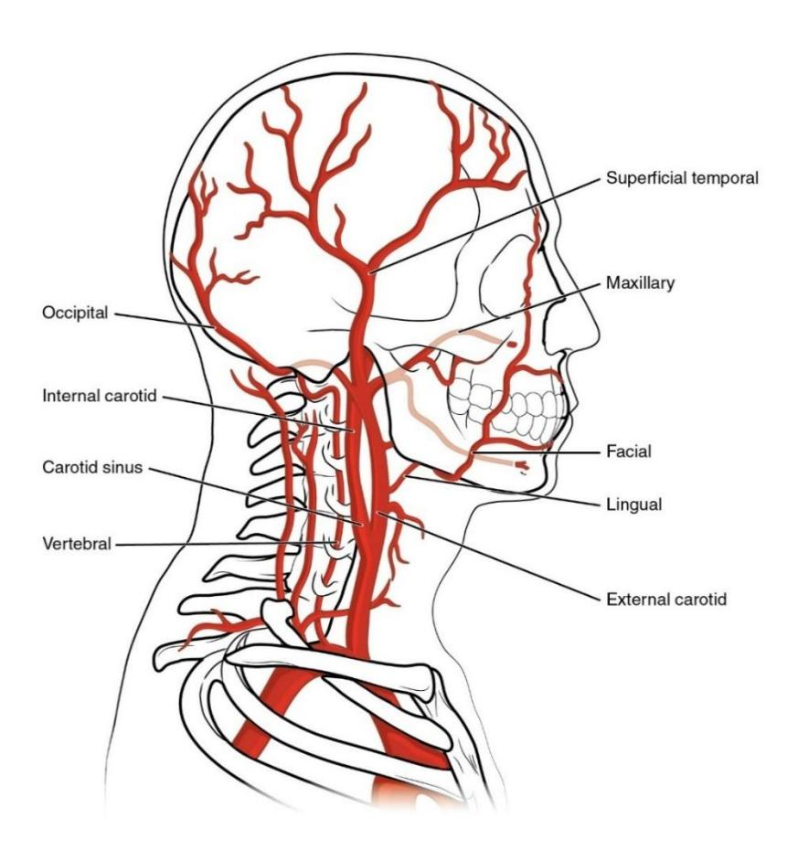

**Figure 17.4** Major Arteries of the Head.

## **Arteries of the Upper Limbs Terms**

• Right and left subclavian • Axillary • Brachial • Radial • Ulnar

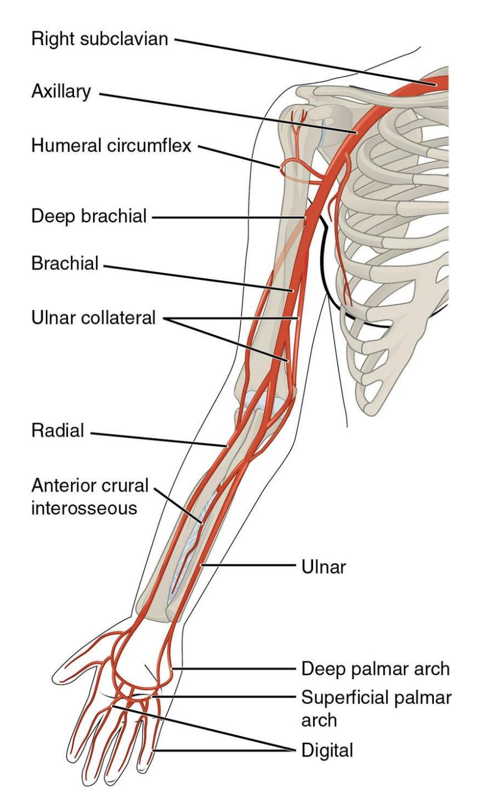

**Figure 17.5** Arteries of the Upper Limbs.

## **Arteries of the Thoracic and Abdominal Regions**

### **Terms**

## **Aorta Regions**

-   Descending Aorta
-   Thoracic Aorta
-   Abdominal Aorta

## **Abdominal Aorta Branches**

-   Celiac trunk
    -   Superior mesenteric
    -   Inferior mesenteric
-   Renal
-   Gonadal
-   Common iliac

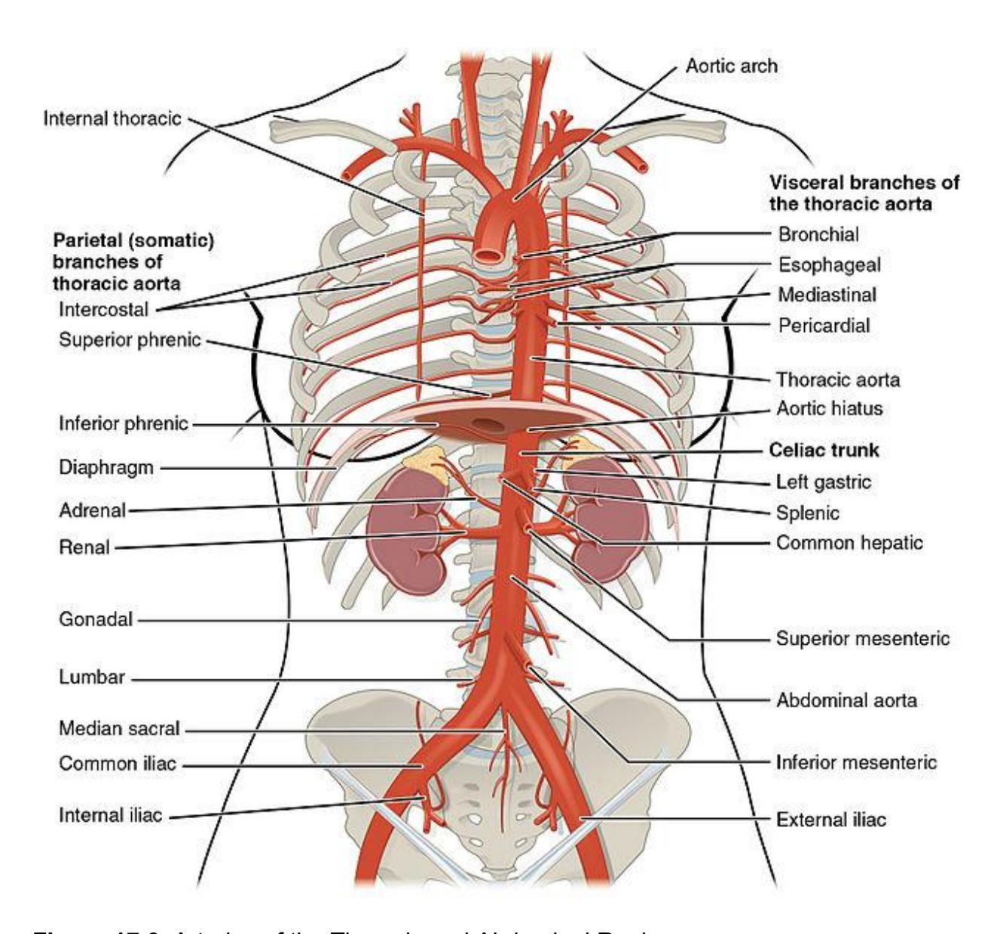

**Figure 17.6** Arteries of the Thoracic and Abdominal Regions.

## **Arteries of the Lower Limbs**

-   Common iliac
    -   External iliac
    -   Internal iliac
-   Femoral
-   Anterior tibial
-   Posterior tibial

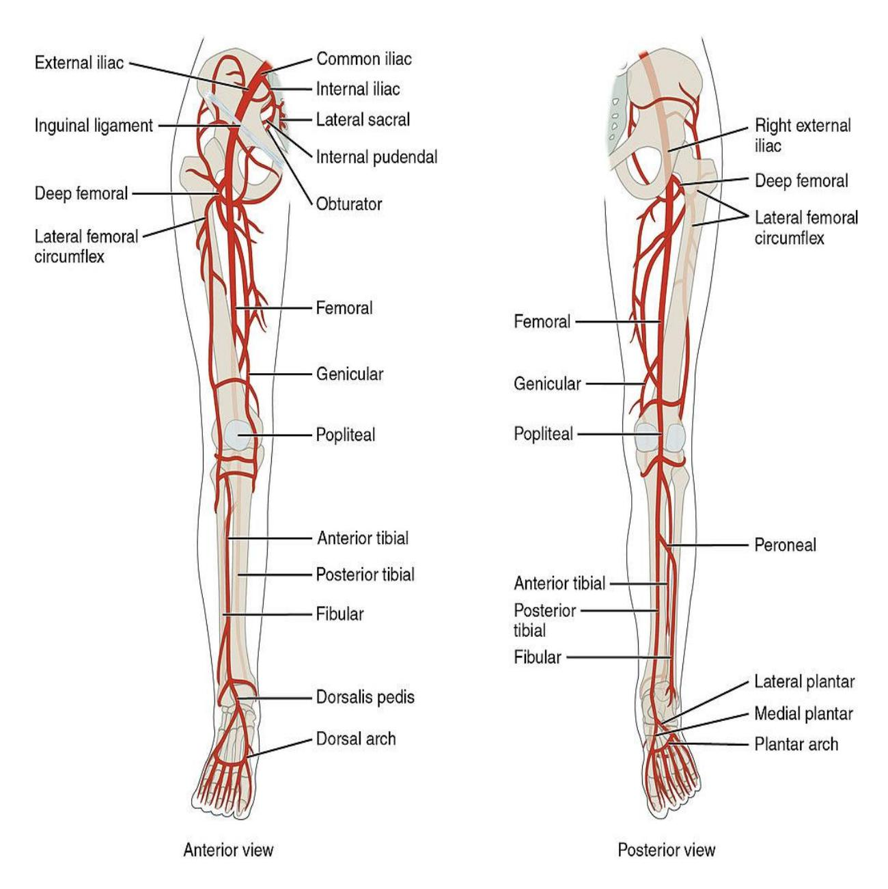

**Figure 17.7** Arteries of the Lower Limbs.

## **Specific Veins of the Systemic System Terms**

-   Superior vena cava

-   Right and Left (R/L) Brachiocephalic

-   (R/L) Internal Jugular

-   (R/L) External Jugular

-   (R/L) Subclavian

-   (R/L) Axillary

-   (R/L) Brachial

-   (R/L) Radial

-   (R/L) Ulnar

-   (R/L) Basilic

-   (R/L) Cephalic

-   (R/L) Median cubital

-   Inferior vena cava

-   Hepatic portal

-   (R/L) Hepatic

-   (R/L) Renal

-   (R/L) Common iliac

-   (R/L) Femoral

-   (R/L) Great saphenous

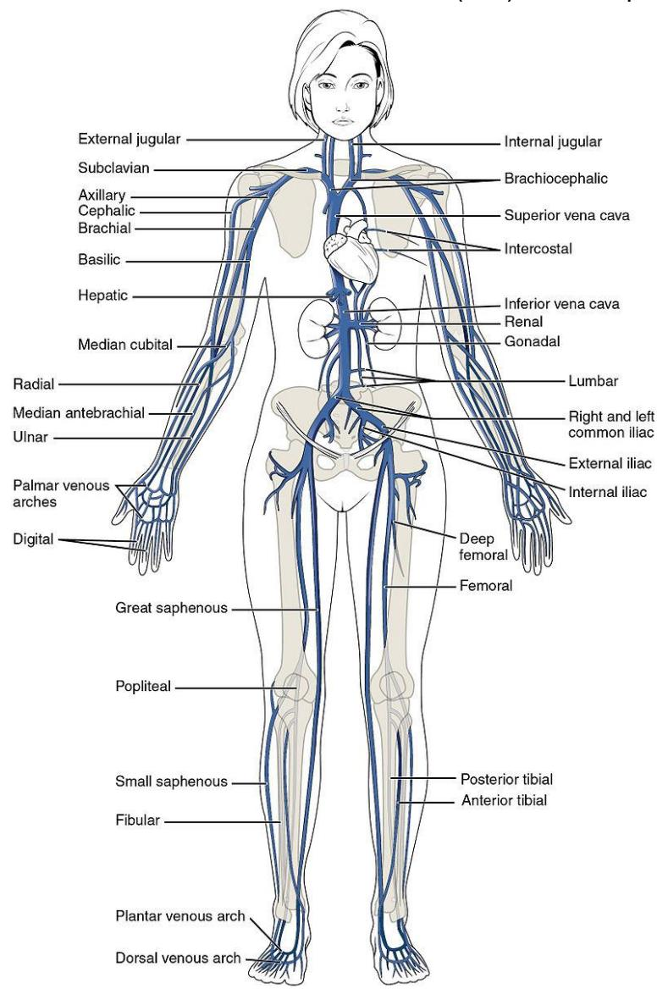

**Figure 17.8** The Major Systemic Veins.

### **Veins of the Head and Neck**

-   Superior vena cava
-   Brachiocephalic
-   Right and left internal jugular.
-   Right and left external jugular.
-   Right and left subclavian.
    -   Right and left axillary

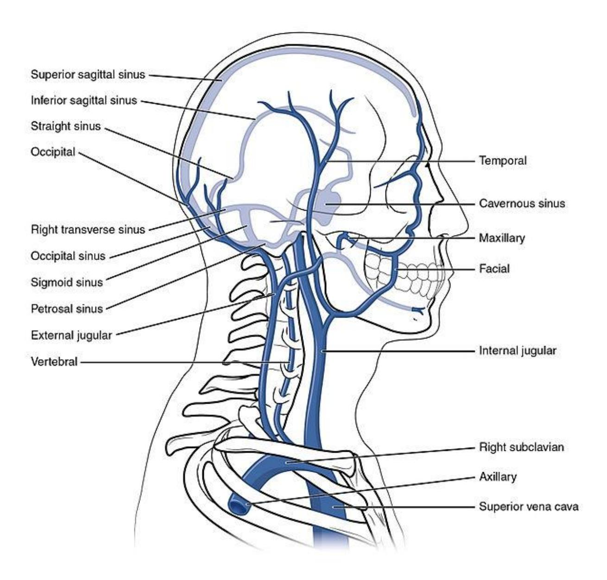

**Figure 17.9** Veins of the Head and Neck Regions.

## **Veins of the Upper Limbs**

### **Terms**

-   Axillary

-   Brachial

-   Radial

-   Ulnar

-   Basilic

-   Cephalic

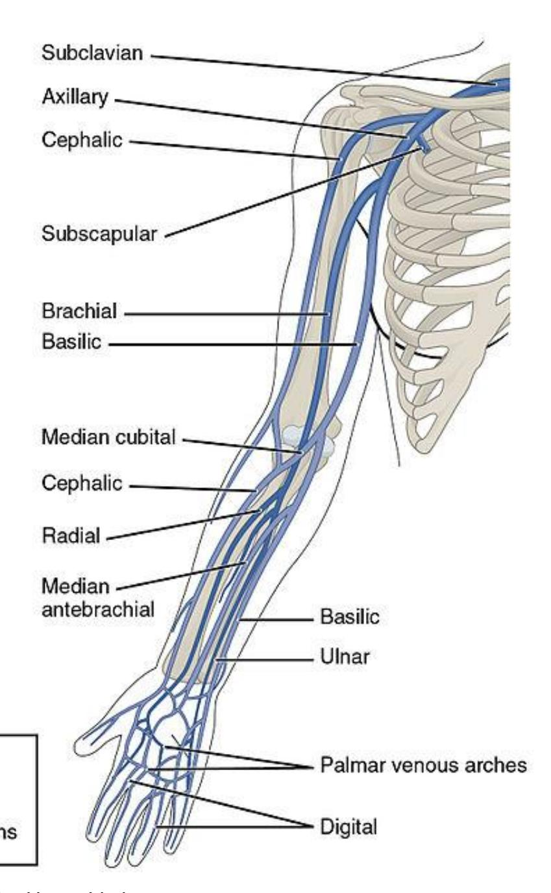

• Median cubital

**Figure 17.10** Veins of the Upper Limbs.

## **Veins of the Thorax and Abdomen**

-   Inferior vena cava

-   Hepatic portal

-   Hepatic

-   Renal

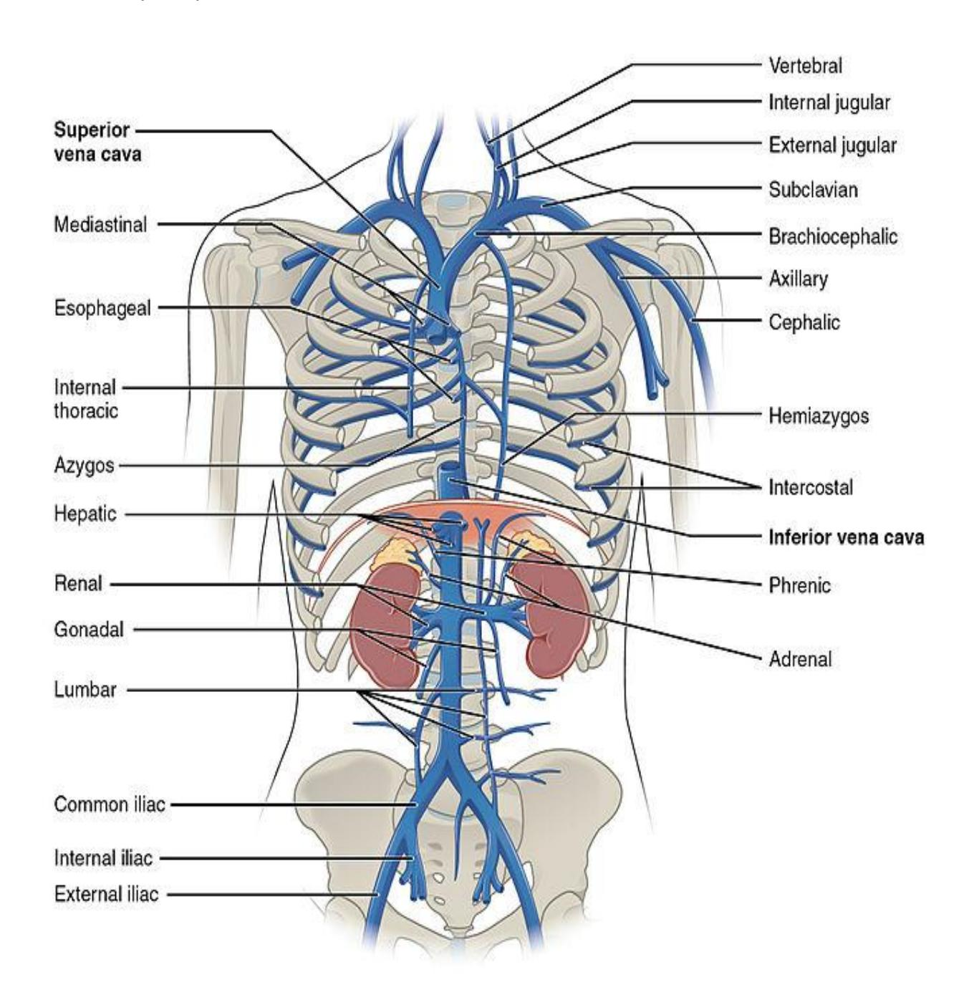

**Figure 17.11** Veins of the Thorax and Abdomen.

## **Veins of the Lower Limbs Terms**

-   Common iliac
-   Femoral

• Great saphenous

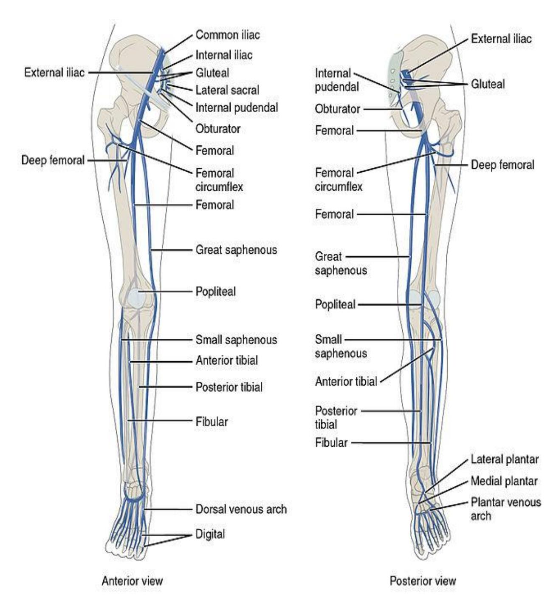

**Figure 17.12** Veins of the Lower Limbs.

## **Fetal Circulation**

### **Terms**

-   Ductus arteriosus
-   Ligamentum arteriosum
-   Foramen ovale

### **Lab Activity 17.3:**

-   Break up into your assigned groups. Obtain an unlabeled diagram of the circulatory system.
-   Use the information from your text and the following pages ( figures 17.13 17.14) to locate and identify the veins and arteries in the body.
-   Use some labelling tape to identify each vessel on the model. Have another group check your work for correctness. Have your instructor review your material as well.
-   Remember to take some pictures of your work to include in your study guide.

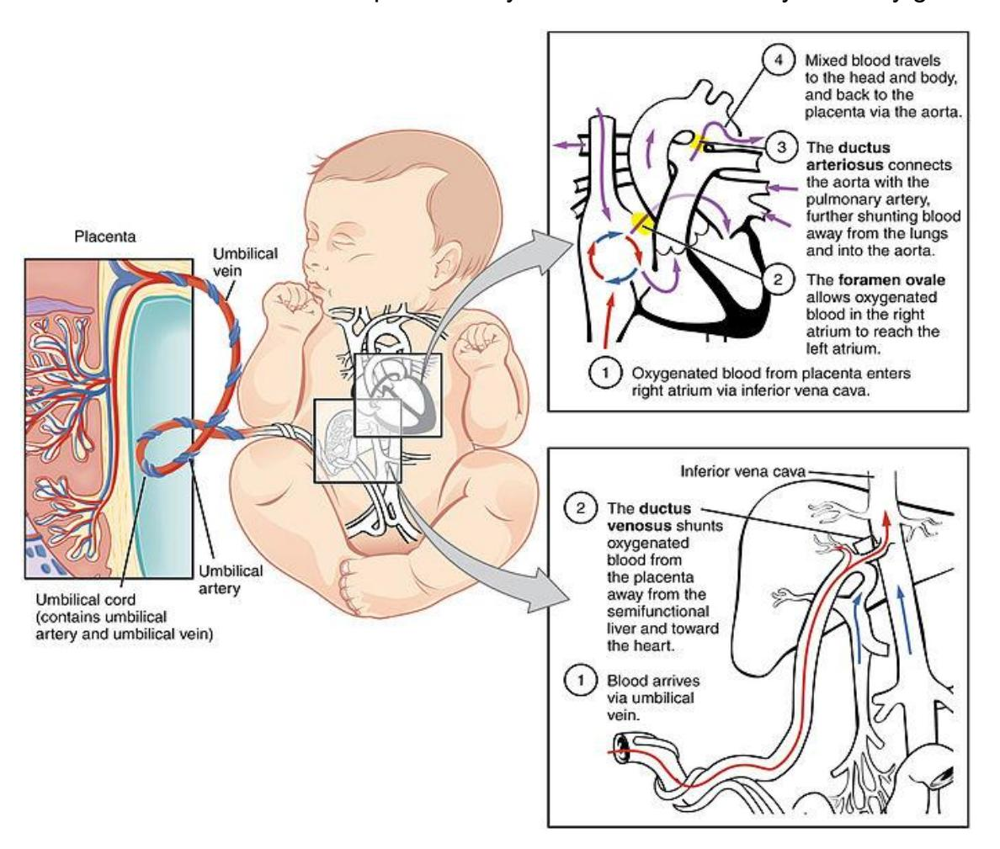

**Figure 17.13** Fetal Circulatory System.

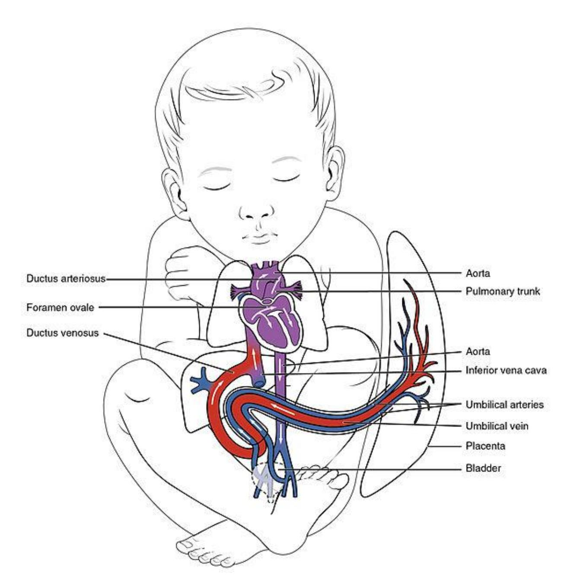

Figure 17.14 Fetal Circulation.

## **Additional Learning Resources:**

## **Heart Circulation**

-   Circulatory System and Pathway of Blood Through the Heart, Amoeba Sisters. [**https://youtu.be/\\\_vZ0lefPg\\\_0?si=9l1AmmQmi8xXpe5f**](https://youtu.be/_vZ0lefPg_0?si=9l1AmmQmi8xXpe5f).
-   Heart and Circulation Model Tour. Siebert Science. [**https://youtu.be/4eVqh7w6sbA?si=Cub\\\_-Fpw7FTfnLoi**](https://youtu.be/4eVqh7w6sbA?si=Cub_-Fpw7FTfnLoi). A good review of the components of the heart
-   Path of Blood Flow through the Heart \| Step by step through every chamber, valve, and major vessel. Siebert Science. [**https://youtu.be/n0HfMDslEQI?si=IZ9BYAZ-XU2qRwiq**](https://youtu.be/n0HfMDslEQI?si=IZ9BYAZ-XU2qRwiq){.uri}. Good review of the heart.

### **Blood Vessels and Circulation**

-   Blood vessel modes. Mr. B's Anatomy. [**https://youtu.be/0paErJ-FhF8?si=SkocT733DmsWllXq**](https://youtu.be/0paErJ-FhF8?si=SkocT733DmsWllXq). Review of the vessels on a 3-D lab model.
-   Wire Man (Blood Vessels). Simply A&P. [**https://youtu.be/i5wWHBoFRUo?si=GmcreBuYkUKNML4v**](https://youtu.be/i5wWHBoFRUo?si=GmcreBuYkUKNML4v){.uri}. [**https://www.youtube.com/watch?v=i5wWHBoFRUo**](https://www.youtube.com/watch?v=i5wWHBoFRUo){.uri}. Tutorial of the blood vessels using the wireman model.
-   The circulatory system part 2: blood vessels. Professor Dave explains. [**https://youtu.be/uCNHpK1Xtd8?si=DRDjz5So86Qyzs5F**](https://youtu.be/uCNHpK1Xtd8?si=DRDjz5So86Qyzs5F){.uri}. Review of the structure of the blood vessels.

## **Quizzes**

• Circulatory system musical quiz (Heart quiz), Sciencemusicvideos. [**https://youtu.be/T2iVqTckmPQ?si=OAPfIMh44l3S4fKD**](https://youtu.be/T2iVqTckmPQ?si=OAPfIMh44l3S4fKD){.uri}.

## **Post Lab Activities**

## **Check Your Understanding**

### **Post Lab Activity 17.1**

### **Labeling**

From the preceding lab activities fill in the boxes with the correct names of the blood vessels delivering or draining blood to the regions below.

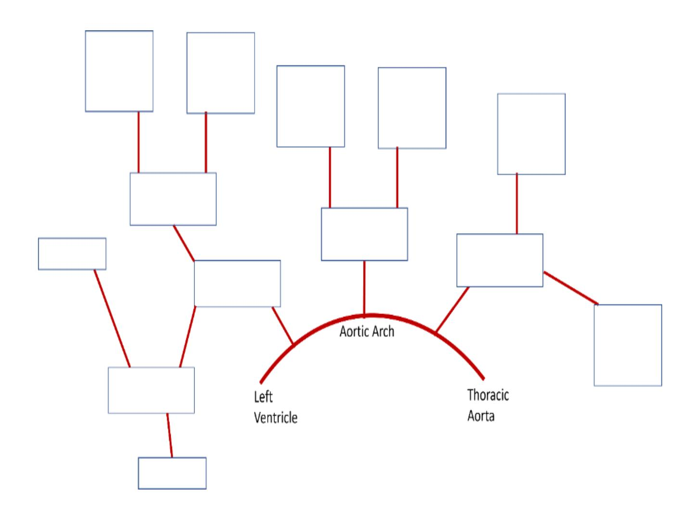

**Figure 17.15** Arteries of the Head and Neck.

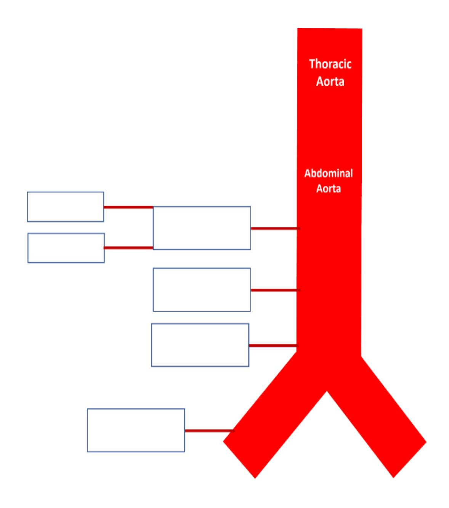

**Figure 17.16** Arteries of the Thorax and Abdomen.

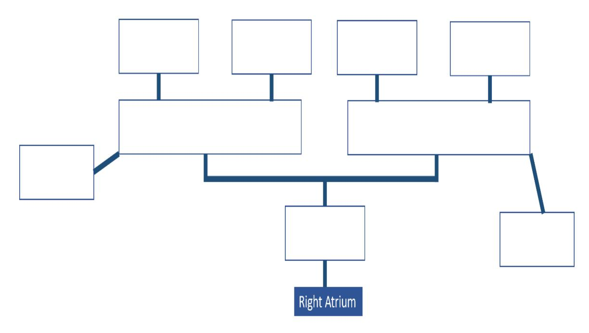

**Figure 17.17** The Veins of the Head and Neck.

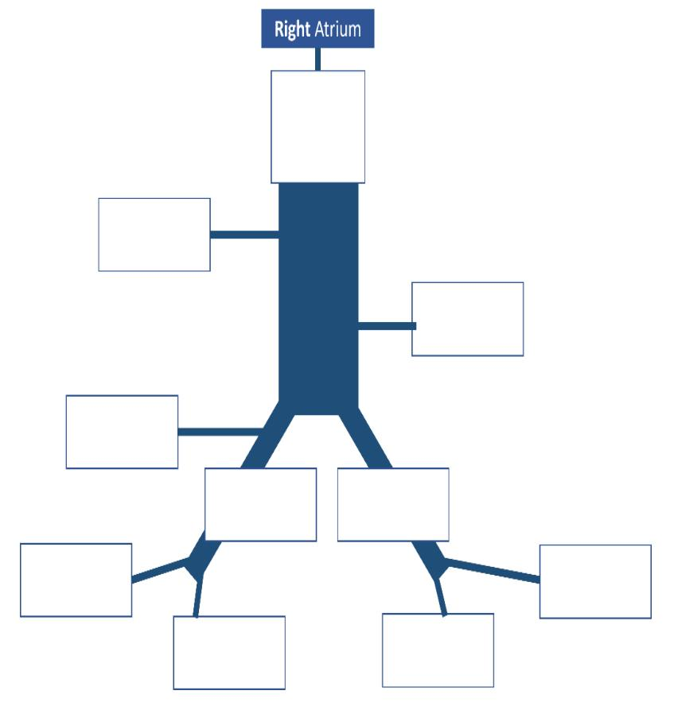

**Figure 17.18** Veins of the Thorax and Abdomen.

### **Post Lab Activity 17.2**

### **Crossword puzzles**

**Figure 17.19** Blood Vessels.

### **Across**

-   1 the two classes of veins include \_\_\_\_ and \_\_\_. (5,7)

-   4 The middle layer of a blood vessel is made up of a mixture of \_\_\_ \_\_ and \_\_\_\_ (Connective tissue type). (6,6,7)

-   6 the blood pressure during relaxation of the ventricles. (9)

-   9 Carry blood away from the heart (8)

-   10 the name of the innermost wall of a blood vessel: \_\_\_ \_\_ or \_\_\_ \_\_\_ (6,7,0,6,6)

-   11 Carry blood to the heart. (5)

-   12 \_\_\_ arteries are closest to the heart. They function to absorb the shock to minimize the difference between the systolic and diastolic pressures. (7)

-   15 The name of the middle layer of the vessel. (6,5)

-   16 Precapillary sphincters are made of \_\_\_ \_\_\_. (6,6)

### **Down**

-   1 \_\_\_ refers to the narrowing of the lumen of the blood vessel. (16)

-   2 There are three classes of arteries, these are \_\_\_\_, \_\_\_\_ and \_\_\_. (7,8,10)

-   3 T he central space in a blood vessel (5)

-   5 \_\_\_ refers to the widening of the blood vessel lumen. (12)

-   7 \_\_\_ connect arterioles to venules (11)

-   8 the blood pressure during the contraction of the ventricles. (8)

-   13 A general term for the walls of blood vessels (5)

-   14 veins, especially those of the limbs, include \_\_\_ to prevent backward blood flow.

**Figure 17.20** Arteries and Veins.

### **Across**

-   3 Fill in the missing terms: abdominal aorta → \_\_\_ → common hepatic artery. (6,6)
-   6 Fill in the missing terms: left ventricle → \_\_\_ \_\_\_ → \_\_\_ \_\_\_ → left subclavian artery → left upper limb. (9,5,6,4)
-   7 Fill in the missing terms: abdominal aorta → right or left \_\_\_ → right or left ovary or testis (7,6)
-   8 Fill in the missing terms: abdominal aorta → \_\_\_ → descending colon, sigmoid colon, part of rectum. (8,10,6)

### **Down**

-   1 Fill in the missing terms: (right or left) brachial artery → (right or left) \_\_\_ → (right or left) \_\_\_ → medial forearm (8,6,5,6)
-   2 Fill in the missing terms: abdominal aorta → \_\_\_ → cecum, ascending colon, stomach, etc. (8,10,6)
-   4 Fill in the missing terms: (right or left) \_\_\_ → chest back and proximal shoulder. (10,6)
-   5 Fill in the missing terms: abdominal aorta → right or left \_\_\_ → right or left kidney (5,6)

## **Keys**

## **Figure 17.19. Blood vessels**

-   **Across:** 1 Veins venules, 4 Smooth muscle elastin, 6 Diastolic, 9 Arteries, 10 Tunica interna tunica intima, 11 Veins, 12 Elastic, 15 Tunica media, 16 Smooth muscle.
-   **Down:** 1 Vasoconstriction, 2 Elastic muscular arterioles, 3 Lumen, 5 Vasodilation, 7 Capillaries, 8 Systolic, 13 Tunic, 14 Valves.

## **Figure 17.20 Arteries and veins**

-   **Across: 3** Celiac artery, **6** Ascending aorta aortic arch, **7** Gonadal artery, **8** Inferior mesenteric artery.
-   **Down: 1** Brachial artery ulnar artery, **2** Superior mesenteric artery, **4** Subclavian artery, **5** Renal artery

**Chapter 17: Cardiovascular System; the Arteries and Veins**

| Terms | Definitions |
|----|----|
| abdominal aorta | portion of the aorta inferior to the aortic hiatus and superior to the common iliac arteries |
| adrenal artery | branch of the abdominal aorta; supp lies blood to the adrenal (suprarenal) glands |
| adrenal vein | drains the adrenal or suprarenal glands that are immediately superior to the kidneys; the right adrenal vein enters the inferior vena cava directly and the left adrenal vein enters the left renal vein |
| aorta | largest artery in the body, originating from the left ventricle and descending to the abdominal region where it bifurcates into the common iliac arteries at the level of the fourth lumbar vertebra; arteries originating from the aorta distribute blood to virtually all tissues of the body |
| aortic arch | arc that connects the ascending aorta to the descending aorta; ends at the intervertebral disk between the fourth and fifth thoracic vertebrae |
| arterial circle (also, circle of Willis) | anastomosis located at the base of the brain that ensures continual blood supply; formed from branches of the internal carotid and vertebral arteries; supplies blood to the brain |
| arteriole (also, resistance vessel) | small artery that leads to a capillary |
| artery | blood vessel that conducts blood away from the heart; may be a conducting or distributing vessel |
| ascending aorta | initial portion of the aorta, rising from the left ventricle for a distance of approximately 5 cm |
| atrial reflex | mechanism for maintaining vascular homeostasis involving atrial baroreceptors: if blood is returning to the right atrium more rapidly than it is being ejected from the left ventricle, the atrial receptors will stimulate the cardiovascular centers to increase sympathetic firing and increase cardiac output until the situation is reversed; the opposite is also true |
| axillary artery | continuation of the subclavian artery as it penetrates the body wall and enters the axillary region; supplies blood to the region near the head of the humerus (humeral circumflex arteries); the majority of the vessel continues into the brachium and becomes the brachial artery |
| axillary vein | major vein in the axillary region; drains the upper limb and becomes the subclavian vein |
| azygos vein | originates in the lumbar region and passes through the diaphragm into the thoracic cavity on the right side of the vertebral column; drains blood from the intercostal veins, esophageal veins, bronchial veins, and other veins draining the mediastinal region; leads to the superior vena cava |
| basilar artery | formed from the fusion of the two vertebral arteries; sends branches to the cerebellum, brain stem, and the posterior cerebral arteries; the main blood supply to the brain stem |
| basilic vein | superficial vein of the arm that arises from the palmar venous arches, intersects with the median cubital vein, parallels the ulnar vein, and continues into the upper arm; along with the brachial vein, it leads to the axillary vein |
| blood colloidal osmotic pressure (BCOP) p | pressure exerted by colloids suspended in blood within a vessel; a primary determinant is the presence of plasma proteins |
| blood flow | movement of blood through a vessel, tissue, or organ that is usually expressed in terms of volume per unit of time |
| blood hydrostatic pressure | force blood exerts against the walls of a blood vessel or heart chamber |
| blood pressure | force exerted by the blood against the wall of a vessel or heart chamber; can be described with the more generic term hydrostatic pressure |
| brachial artery | continuation of the axillary artery in the brachium; supplies blood to much of the brachial region; gives off several smaller branches that provide blood to the posterior surface of the arm in the region of the elbow; bifurcates into the radial and ulnar arteries at the coronoid fossa |
| brachial vein | deeper vein of the arm that forms from the radial and ulnar veins in the lower arm; leads to the axillary vein |
| brachiocephalic trunk | The brachiocephalic artery (trunk) is the first branch of your aortic arch. |
| brachiocephalic artery | single vessel located on the right side of the body; the first vessel branching from the aortic arch; gives rise to the right subclavian artery and the right common carotid artery; supplies blood to the head, neck, upper limb, and wall of the thoracic region |
| brachiocephalic vein | one of a pair of veins that form from a fusion of the external and internal jugular veins and the subclavian vein; subclavian, external, and internal jugulars, vertebral, and internal thoracic veins lead to it; drains the upper thoracic region and flows into the superior vena cava |
| bronchial artery | systemic branch from the aorta that provides oxygenated blood to the lungs in addition to the pulmonary circuit |
| bronchial vein | drains the systemic circulation from the lungs and leads to the azygos vein |
| capacitance | ability of a vein to distend and store blood |
| capacitance vessels | veins |
| capillary | smallest of blood vessels where physical exchange occurs between the blood and tissue cells surrounded by interstitial fluid |
| capillary bed | network of 10-100 capillaries connecting arterioles to venules |
| capillary hydrostatic pressure (CHP) | force blood exerts against a capillary |
| carotid sinuses | small pockets near the base of the internal carotid arteries that are the locations of the baroreceptors and chemoreceptors that trigger a reflex that aids in the regulation of vascular homeostasis |
| celiac trunk (also, celiac artery) | major branch of the abdominal aorta; gives rise to the left gastric artery, the splenic artery, and the common hepatic artery that forms the hepatic artery to the liver, the right gastric artery to the stomach, and the cystic artery to the gall bladder |
| cephalic vein | superficial vessel in the upper arm; leads to the axillary vein |
| cerebrovascular accident (CVA) | blockage of blood flow to the brain; also called a stroke |
| circle of Willis (also, arterial circle) | anastomosis located at the base of the brain that ensures continual blood supply; formed from branches of the internal carotid and vertebral arteries; supplies blood to the brain |
| common carotid artery | right common carotid artery arises from the brachiocephalic artery, and the left common carotid arises from the aortic arch; gives rise to the external and internal carotid arteries; supplies the respective sides of the head and neck |
| common hepatic artery | branch of the celiac trunk that forms the hepatic artery, the right gastric artery, and the cystic artery |
| common iliac artery | branch of the aorta that leads to the internal and external iliac arteries |
| common iliac vein | one of a pair of veins that flows into the inferior vena cava at the level of L5; the left common iliac vein drains the sacral region; divides into external and internal iliac veins near the inferior portion of the sacroiliac joint |
| compliance | degree to which a blood vessel can stretch as opposed to being rigid |
| continuous capillary | most common type of capillary, found in virtually all tissues except epithelia and cartilage; contains small gaps in the endothelial lining that permit exchange |
| deep femoral artery | branch of the femoral artery; gives rise to the lateral circumflex arteries |
| deep femoral vein | drains blood from the deeper portions of the thigh and leads to the femoral vein |
| descending aorta | portion of the aorta that continues downward past the end of the aortic arch; subdivided into the thoracic aorta and the abdominal aorta |
| diastolic pressure | lower number recorded when measuring arterial blood pressure; represents the minimal value corresponding to the pressure that remains during ventricular relaxation |
| digital arteries | arteries formed from the superficial and deep palmar arches; supply blood to the digits |
| digital veins | drain the digits and feed into the palmar arches of the hand and dorsal venous arch of the foot |
| dorsal arch (also, arcuate arch) | formed from the anastomosis of the dorsalis pedis artery and medial and plantar arteries; branches supply the distal portions of the foot and digits |
| dorsal venous arch | drains blood from digital veins and vessels on the superior surface of the foot |
| ductus arteriosus | shunt in the fetal pulmonary trunk that diverts oxygenated blood back to the aorta |
| ductus venosus | shunt that causes oxygenated blood to bypass the fetal liver on its way to the inferior vena cava |
| elastic artery (also, conducting artery) | artery with abundant elastic fibers located closer to the heart, which maintains the pressure gradient and conducts blood to smaller branches |
| external carotid artery | arises from the common carotid artery; supplies blood to numerous structures within the face, lower jaw, neck, esophagus, and larynx |
| external iliac artery | branch of the common iliac artery that leaves the body cavity and becomes a femoral artery; supplies blood to the lower limbs |
| external iliac vein | formed when the femoral vein passes into the body cavity; drains the legs and leads to the common iliac vein |
| external jugular vein | one of a pair of major veins located in the superficial neck region that drains blood from the more superficial portions of the head, scalp, and cranial regions, and leads to the subclavian vein |
| femoral artery | continuation of the external iliac artery after it passes through the body cavity; divides into several smaller branches, the lateral deep femoral artery, and the genicular artery; becomes the popliteal artery as it passes posterior to the knee |
| femoral circumflex vein | forms a loop around the femur just inferior to the trochanters; drains blood from the areas around the head and neck of the femur; leads to the femoral vein |
| femoral vein | drains the upper leg; receives blood from the great saphenous vein, the deep femoral vein, and the femoral circumflex vein; becomes the external iliac vein when it crosses the body wall |
| fenestrated capillary | type of capillary with pores or fenestrations in the endothelium that allow for rapid passage of certain small materials |
| fibular vein | drains the muscles and integument near the fibula and leads to the popliteal vein |
| filtration | (in the cardiovascular system) the movement of material from a capillary into the interstitial fluid, moving from an area of higher pressure to lower pressure |
| foramen ovale | shunt that directly connects the right and left atria and helps to divert oxygenated blood from the fetal pulmonary circuit |
| genicular artery | branch of the femoral artery; supplies blood to the region of the knee |
| gonadal artery | branch of the abdominal aorta; supplies blood to the gonads or reproductive organs; also described as ovarian arteries or testicular arteries, depending upon the sex of the individual |
| gonadal vein | generic term for a vein draining a reproductive organ; may be either an ovarian vein or a testicular vein, depending on the sex of the individual |
| great cerebral vein | receives most of the smaller vessels from the inferior cerebral veins and leads to the straight sinus |
| great saphenous vein | prominent surface vessel located on the medial surface of the leg and thigh; drains the superficial portions of these areas and leads to the femoral vein |
| hemangioblasts | embryonic stem cells that appear in the mesoderm and give rise to both angioblasts and pluripotent stem cells |
| hemiazygos vein | smaller vein complementary to the azygos vein; drains the esophageal veins from the esophagus and the left intercostal veins, and leads to the brachiocephalic vein via the superior intercostal vein |
| hepatic artery proper | branch of the common hepatic artery; supplies systemic blood to the liver |
| hepatic portal system | system specialized circulatory pathway that carries blood from digestive organs to the liver for processing before being sent to the systemic circulation |
| hepatic vein | drains systemic blood from the liver and |
| hypertension | flows into the inferior vena cava chronic and persistent blood pressure measurements of 140/90 mm Hg or above |
| hypoxia | lack of oxygen supply to the tissues |
| inferior mesenteric artery | branch of the abdominal aorta; supplies blood to the distal segment of the large intestine and rectum |
| inferior phrenic artery | branch of the abdominal aorta; supplies blood to the inferior surface of the diaphragm |
| inferior vena cava | large systemic vein that drains blood from areas largely inferior to the diaphragm; empties into the right atrium |
| intercostal artery | branch of the thoracic aorta; supplies blood to the muscles of the thoracic cavity and vertebral column |
| intercostal vein | int drains the muscles of the thoracic wall and leads to the azygos vein |
| internal carotid artery | arises from the common carotid artery and begins with the carotid sinus; goes through the carotid canal of the temporal bone to the base of the brain; combines with branches of the vertebral artery forming the arterial circle; supplies blood to the brain |
| internal elastic membrane | membrane composed of elastic fibers that separates the tunica intima from the tunica media; seen in larger arteries |
| internal iliac artery | branch from the common iliac arteries; supplies blood to the urinary bladder, walls of the pelvis, external genitalia, and the medial portion of the femoral region; in females, also provide blood to the uterus and vagina |
| internal iliac vein | drains the pelvic organs and integument; formed from several smaller veins in the region; leads to the common iliac vein |
| internal jugular vein | one of a pair of major veins located in the neck region that passes through the jugular foramen and canal, flows parallel to the common carotid artery that is more or less its counterpart; primarily drains blood from the brain, receives the superficial facial vein, and empties into the subclavian vein |
| internal thoracic artery (also, mammary artery) | arises from the subclavian artery; supplies blood to the thymus, pericardium of the heart, and the anterior chest wall |
| internal thoracic vein (also, internal mammary vein) | drains the anterior surface of the chest wall and leads to the brachiocephalic vein |
| interstitial fluid colloidal osmotic pressure (IFCOP) | pressure exerted by the colloids within the interstitial fluid |
| interstitial fluid hydrostatic pressure (IFHP) | force exerted by the fluid in the tissue spaces |
| ischemia | insufficient blood flow to the tissues |
| Korotkoff sounds | noises created by turbulent blood flow through the vessels |
| lateral circumflex artery | branch of the deep femoral artery; supplies blood to the deep muscles of the thigh and the ventral and lateral regions of the integument |
| lateral plantar artery | arises from the bifurcation of the posterior tibial arteries; supplies blood to the lateral plantar surfaces of the foot |
| left gastric artery | branch of the celiac trunk; supplies blood to the stomach |
| lumbar arteries | branches of the abdominal aorta; supply blood to the lumbar region, the abdominal wall, and spinal cord |
| lumbar veins | drain the lumbar portion of the abdominal wall and spinal cord; the superior lumbar veins drain into the azygos vein on the right or the hemiazygos vein on the left; blood from these vessels is returned to the superior vena cava rather than the inferior vena cava |
| lumen | interior of a tubular structure such as a blood vessel or a portion of the alimentary canal through which blood, chyme, or other substances travel |
| maxillary vein | drains blood from the maxillary region and leads to the external jugular vein |
| mean arterial pressure (MAP) | average driving force of blood to the tissues; approximated by taking diastolic pressure and adding 1/3 of pulse pressure |
| median antebrachial vein | vein that parallels the ulnar vein but is more medial in location; intertwines with the palmar venous arches |
| median cubital vein | superficial vessel located in the antecubital region that links the cephalic vein to the basilic vein in the form of a v; a frequent site for blood draw |
| metarteriole | short vessel arising from a terminal arteriole that branches to supply a capillary bed |
| microcirculation | blood flow through the capillaries |
| middle cerebral artery | another branch of the internal carotid artery; supplies blood to the temporal and parietal lobes of the cerebrum |
| middle sacral vein | drains the sacral region and leads to the left common iliac vein |
| muscular artery (also, distributing artery) | artery with abundant smooth muscle in the tunica media that branches to distribute blood to the arteriole network |
| myogenic response | constriction or dilation in the walls of arterioles in response to pressures related to blood flow; reduces high blood flow or increases low blood flow to help maintain consistent flow to the capillary network |
| net filtration pressure (NFP) | force driving fluid out of the capillary and into the tissue spaces; equal to the difference of the capillary hydrostatic pressure and the blood colloidal osmotic pressure |
| occipital sinus | enlarged vein that drains the occipital region near the falx cerebelli and flows into the left and right transverse sinuses, and also into the vertebral veins |
| ovarian artery | branch of the abdominal aorta; supplies blood to the ovary, uterine (Fallopian) tube, and uterus |
| ovarian vein | drains the ovary; the right ovarian vein leads to the inferior vena cava and the left ovarian vein leads to the left renal vein |
| palmar arches | superficial and deep arches formed from anastomoses of the radial and ulnar arteries; supply blood to the hand and digital arteries |
| palmar venous arches | drain the hand and digits, and feed into the radial and ulnar veins |
| parietal branches (also, somatic branches) | group of arterial branches of the thoracic aorta; includes those that supply blood to the thoracic cavity, vertebral column, and the superior surface of the diaphragm |
| perfusion | distribution of blood into the capillaries so the tissues can be supplied |
| popliteal artery | continuation of the femoral artery posterior to the knee; branches into the anterior and posterior tibial arteries |
| popliteal vein | continuation of the femoral vein behind the knee; drains the region behind the knee and forms from the fusion of the fibular and anterior and posterior tibial veins |
| posterior cerebral artery | branch of the basilar artery that forms a portion of the posterior segment of the arterial circle; supplies blood to the posterior portion of the cerebrum and brain stem |
| posterior communicating artery | branch of the posterior cerebral artery that forms part of the posterior portion of the arterial circle; supplies blood to the brain |
| posterior tibial artery | branch from the popliteal artery that gives rise to the fibular or peroneal artery; supplies blood to the posterior tibial region |
| posterior tibial vein | forms from the dorsal venous arch; drains the area near the posterior surface of the tibia and leads to the popliteal vein |
| precapillary sphincters | circular rings of smooth muscle that surround the entrance to a capillary and regulate blood flow into that capillary |
| pulmonary artery | one of two branches, left and right, that divides off from the pulmonary trunk and leads to smaller arterioles and eventually to the pulmonary capillaries |
| pulmonary circuit | system of blood vessels that provide gas exchange via a network of arteries, veins, and capillaries that run from the heart, through the body, and back to the lungs |
| pulmonary trunk | single large vessel exiting the right ventricle that divides to form the right and left pulmonary arteries |
| pulmonary veins | two sets of paired vessels, one pair on each side, which are formed from the small venules leading away from the pulmonary capillaries that flow into the left atrium |
| pulse | alternating expansion and recoil of an artery as blood moves through the vessel; an indicator of heart rate |
| pulse pressure | difference between the systolic and diastolic pressures |
| radial artery | formed at the bifurcation of the brachial artery; parallels the radius; gives off smaller branches until it reaches the carpal region where it fuses with the ulnar artery to form the superficial and deep palmar arches; supplies blood to the lower arm and carpal region |
| radial vein | parallels the radius and radial artery; arises from the palmar venous arches and leads to the brachial vein |
| reabsorption | (in the cardiovascular system) the movement of material from the interstitial fluid into the capillaries |
| renal artery | branch of the abdominal aorta; supplies each kidney |
| renal vein | largest vein entering the inferior vena cava; drains the kidneys and leads to the inferior vena cava |
| resistance | any condition or parameter that slows or counteracts the flow of blood |
| respiratory pump | increase in the volume of the thorax during inhalation that decreases air pressure, enabling venous blood to flow into the thoracic region, then exhalation increases pressure, moving blood into the atria |
| right gastric artery | branch of the common hepatic artery; supplies blood to the stomach |
| sepsis (also, septicemia) | organismal-level inflammatory response to a massive infection |
| septic shock (also, blood poisoning) | type of shock that follows a massive infection resulting in organism-wide inflammation |
| sigmoid sinuses | enlarged veins that receive blood from the transverse sinuses; flow through the jugular foramen and into the internal jugular vein |
| sinusoid capillary | rarest type of capillary, which has extremely large intercellular gaps in the basement membrane in addition to clefts and fenestrations; found in areas such as the bone marrow and liver where passage of large molecules occurs |
| skeletal muscle pump | effect on increasing blood pressure within veins by compression of the vessel caused by the contraction of nearby skeletal muscle |
| small saphenous vein | located on the lateral surface of the leg; drains blood from the superficial regions of the lower leg and foot, and leads to the popliteal vein |
| sphygmomanometer | blood pressure cuff attached to a device that measures blood pressure |
| splenic artery | branch of the celiac trunk; supplies blood to the spleen |
| straight sinus | enlarged vein that drains blood from the brain; receives most of the blood from the great cerebral vein and flows into the left or right transverse sinus |
| subclavian artery | right subclavian arises from the brachiocephalic artery, whereas the left subclavian artery arises from the aortic arch; gives rise to the internal thoracic, vertebral, and thyrocervical arteries; supplies blood to the arms, chest, shoulders, back, and central nervous system |
| subclavian vein | located deep in the thoracic cavity; becomes the axillary vein as it enters the axillary region; drains the axillary and smaller local veins near the scapular region; leads to the brachiocephalic vein |
| subscapular vein | drains blood from the subscapular region and leads to the axillary vein |
| superior mesenteric artery | branch of the abdominal aorta; supplies blood to the small intestine (duodenum, jejunum, and ileum), the pancreas, and a majority of the large intestine |
| superior phrenic artery | branch of the thoracic aorta; supplies blood to the superior surface of the diaphragm |
| superior sagittal sinus | enlarged vein located midsagittally between the meningeal and periosteal layers of the dura mater within the falx cerebri; receives most of the blood drained from the superior surface of the cerebrum and leads to the inferior jugular vein and the vertebral vein |
| superior vena cava | large systemic vein; drains blood from most areas superior to the diaphragm; empties into the right atrium |
| systolic pressure | larger number recorded when measuring arterial blood pressure; represents the maximum value following ventricular contraction |
| temporal vein | drains blood from the temporal region and leads to the external jugular vein |
| thoracic aorta | portion of the descending aorta superior to the aortic hiatus |
| thoroughfare channel | continuation of the metarteriole that enables blood to bypass a capillary bed and flow directly into a venule, creating a vascular shunt |
| trunk | large vessel that gives rise to smaller vessels |
| tunica externa (also, tunica adventitia) | outermost layer or tunic of a vessel (except capillaries) |
| tunica intima (also, tunica interna) | innermost lining or tunic of a vessel |
| tunica media | middle layer or tunic of a vessel (except capillaries) |
| ulnar artery | formed at the bifurcation of the brachial artery; parallels the ulna; gives off smaller branches until it reaches the carpal region where it fuses with the radial artery to form the superficial and deep palmar arches; supplies blood to the lower arm and carpal region |
| ulnar vein parallels | parallels the ulna and ulnar artery; arises from the palmar venous arches and leads to the brachial vein |
| umbilical arteries | pair of vessels that runs within the umbilical cord and carries fetal blood low in oxygen and high in waste to the placenta for exchange with maternal blood |
| umbilical vein | single vessel that originates in the placenta and runs within the umbilical cord, carrying oxygen- and nutrient-rich blood to the fetal heart |
| vascular shunt | continuation of the metarteriole and thoroughfare channel that allows blood to bypass the capillary beds to flow directly from the arterial to the venous circulation |
| vascular tone | contractile state of smooth muscle in a blood vessel |
| vascular tubes | rudimentary blood vessels in a developing fetus |
| vasoconstriction | constriction of the smooth muscle of a blood vessel, resulting in a decreased vascular diameter |
| vasodilation | relaxation of the smooth muscle in the wall of a blood vessel, resulting in an increased vascular diameter |
| vasomotion | irregular, pulsating flow of blood through capillaries and related structures |
| vein | blood vessel that conducts blood toward the heart |
| venous reserve | volume of blood contained within systemic veins in the integument, bone marrow, and liver that can be returned to the heart for circulation, if needed |
| venule | small vessel leading from the capillaries to veins |
| vertebral artery | arises from the subclavian artery and passes through the vertebral foramen through the foramen magnum to the brain; joins with the internal carotid artery to form the arterial circle; supplies blood to the brain and spinal cord |
| vertebral vein | arises from the base of the brain and the cervical region of the spinal cord; passes through the intervertebral foramina in the cervical vertebrae; drains smaller veins from the cranium, spinal cord, and vertebrae, and leads to the brachiocephalic vein; counterpart of the vertebral artery |
| visceral branches | branches of the descending aorta that supply blood to the viscera |
