# **Lymphatic System**

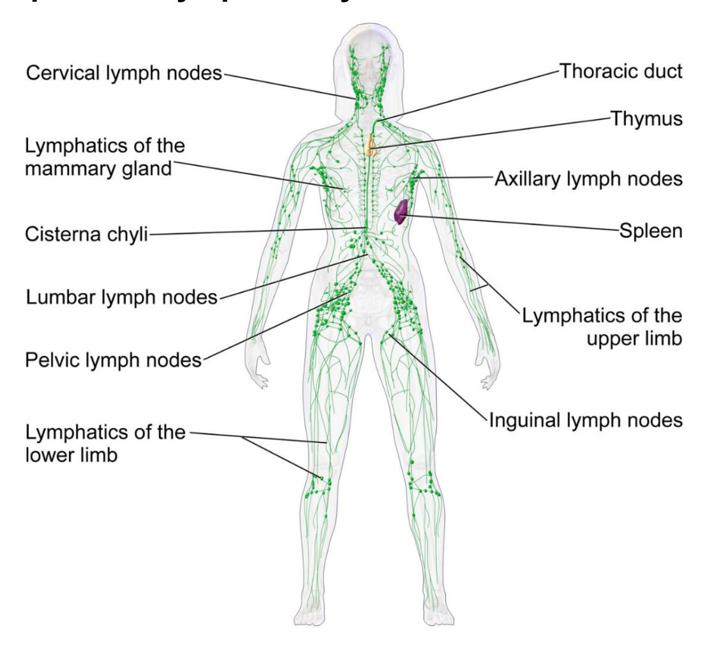

**Figure 18.1** Lymphatic System, Female.

## **Objectives:**

## **After studying this chapter, you will be able to:**

-   Identify the components and anatomy of the lymphatic system.
-   Describe the structure and function of the lymphatic tissue (lymph fluid, vessels, ducts, and organs)
-   Describe the structure and function of the primary and secondary lymphatic organs.

## **Prelab Activities**

## **Definitions:**

The **primary lymphoid organs** are the bone marrow and thymus gland. The lymphoid organs are where lymphocytes proliferate and mature.

**Secondary lymphatic organs** are sites where the lymphocytes mount and adaptive response (e.g., lymphoid nodules, lymph nodes and the spleen).

## **Lymphatic System**

-   Lymph node locations
    -   Cervical
    -   Axillary
    -   Inguinal
-   Lymphatic vessels (general)
-   Thoracic duct
    -   Cisterna chyli
-   Right lymphatic duct
-   Thymus
-   Spleen
-   Lymphatic tissue
-   Tonsils (only palatine is on models

## **Lymph Node**

-   Cortex - contains denser nodules.
-   Medulla - more diffuse
-   Afferent lymphatic vessel
-   Efferent lymphatic vessel

## **Prelab Activity 18.1**

## **Definitions**

## **Lymphatic System**

-   Primary Lymphatic System \_\_\_\_\_\_\_\_\_\_\_\_\_\_\_\_\_\_\_\_\_\_\_\_\_\_\_\_\_\_\_\_\_\_\_\_\_\_\_
-   Secondary Lymphatic System \_\_\_\_\_\_\_\_\_\_\_\_\_\_\_\_\_\_\_\_\_\_\_\_\_\_\_\_\_\_\_\_\_\_\_\_\_
-   Lymph nodes \_\_\_\_\_\_\_\_\_\_\_\_\_\_\_\_\_\_\_\_\_\_\_\_\_\_\_\_\_\_\_\_\_\_\_\_\_\_\_\_\_\_\_\_\_\_\_\_\_\_
-   Cervical \_\_\_\_\_\_\_\_\_\_\_\_\_\_\_\_\_\_\_\_\_\_\_\_\_\_\_\_\_\_\_\_\_\_\_\_\_\_\_\_\_\_\_\_\_\_\_\_\_\_\_\_\_\_\_
-   Axillary \_\_\_\_\_\_\_\_\_\_\_\_\_\_\_\_\_\_\_\_\_\_\_\_\_\_\_\_\_\_\_\_\_\_\_\_\_\_\_\_\_\_\_\_\_\_\_\_\_\_\_\_\_\_\_
-   Inguinal \_\_\_\_\_\_\_\_\_\_\_\_\_\_\_\_\_\_\_\_\_\_\_\_\_\_\_\_\_\_\_\_\_\_\_\_\_\_\_\_\_\_\_\_\_\_\_\_\_\_\_\_\_\_\_
-   thoracic \_\_\_\_\_\_\_\_\_\_\_\_\_\_\_\_\_\_\_\_\_\_\_\_\_\_\_\_\_\_\_\_\_\_\_\_\_\_\_\_\_\_\_\_\_\_\_\_\_\_\_\_\_\_\_
-   Lymphatic vessels \_\_\_\_\_\_\_\_\_\_\_\_\_\_\_\_\_\_\_\_\_\_\_\_\_\_\_\_\_\_\_\_\_\_\_\_\_\_\_\_\_\_\_\_\_\_
-   Cisterna chyli \_\_\_\_\_\_\_\_\_\_\_\_\_\_\_\_\_\_\_\_\_\_\_\_\_\_\_\_\_\_\_\_\_\_\_\_\_\_\_\_\_\_\_\_\_\_\_\_\_\_
-   Thoracic duct \_\_\_\_\_\_\_\_\_\_\_\_\_\_\_\_\_\_\_\_\_\_\_\_\_\_\_\_\_\_\_\_\_\_\_\_\_\_\_\_\_\_\_\_\_\_\_\_\_\_
-   Right lymphatic duct \_\_\_\_\_\_\_\_\_\_\_\_\_\_\_\_\_\_\_\_\_\_\_\_\_\_\_\_\_\_\_\_\_\_\_\_\_\_\_\_\_\_\_\_\_
-   Thymus \_\_\_\_\_\_\_\_\_\_\_\_\_\_\_\_\_\_\_\_\_\_\_\_\_\_\_\_\_\_\_\_\_\_\_\_\_\_\_\_\_\_\_\_\_\_\_\_\_\_\_\_\_\_\_
-   Spleen \_\_\_\_\_\_\_\_\_\_\_\_\_\_\_\_\_\_\_\_\_\_\_\_\_\_\_\_\_\_\_\_\_\_\_\_\_\_\_\_\_\_\_\_\_\_\_\_\_\_\_\_\_\_\_
-   Lymphatic tissue \_\_\_\_\_\_\_\_\_\_\_\_\_\_\_\_\_\_\_\_\_\_\_\_\_\_\_\_\_\_\_\_\_\_\_\_\_\_\_\_\_\_\_\_\_\_\_\_
-   Palatine Tonsils \_\_\_\_\_\_\_\_\_\_\_\_\_\_\_\_\_\_\_\_\_\_\_\_\_\_\_\_\_\_\_\_\_\_\_\_\_\_\_\_\_\_\_\_\_\_\_\_
-   Pharyngeal tonsil \_\_\_\_\_\_\_\_\_\_\_\_\_\_\_\_\_\_\_\_\_\_\_\_\_\_\_\_\_\_\_\_\_\_\_\_\_\_\_\_\_\_\_\_\_\_\_
-   Lingual tonsil \_\_\_\_\_\_\_\_\_\_\_\_\_\_\_\_\_\_\_\_\_\_\_\_\_\_\_\_\_\_\_\_\_\_\_\_\_\_\_\_\_\_\_\_\_\_\_\_\_\_\_

## **Lymph Node structures**

-   Cortex \_\_\_\_\_\_\_\_\_\_\_\_\_\_\_\_\_\_\_\_\_\_\_\_\_\_\_\_\_\_\_\_\_\_\_\_\_\_\_\_\_\_\_\_\_\_\_\_\_\_\_\_\_\_\_\_
-   Medulla \_\_\_\_\_\_\_\_\_\_\_\_\_\_\_\_\_\_\_\_\_\_\_\_\_\_\_\_\_\_\_\_\_\_\_\_\_\_\_\_\_\_\_\_\_\_\_\_\_\_\_\_\_\_\_
-   Capsule \_\_\_\_\_\_\_\_\_\_\_\_\_\_\_\_\_\_\_\_\_\_\_\_\_\_\_\_\_\_\_\_\_\_\_\_\_\_\_\_\_\_\_\_\_\_\_\_\_\_\_\_\_\_
-   Afferent lymphatic vessel \_\_\_\_\_\_\_\_\_\_\_\_\_\_\_\_\_\_\_\_\_\_\_\_\_\_\_\_\_\_\_\_\_\_\_\_\_\_\_\_\_
-   Efferent lymphatic vessel \_\_\_\_\_\_\_\_\_\_\_\_\_\_\_\_\_\_\_\_\_\_\_\_\_\_\_\_\_\_\_\_\_\_\_\_\_\_\_\_\_
-   Hilum \_\_\_\_\_\_\_\_\_\_\_\_\_\_\_\_\_\_\_\_\_\_\_\_\_\_\_\_\_\_\_\_\_\_\_\_\_\_\_\_\_\_\_\_\_\_\_\_\_\_\_\_\_\_\_\_
-   Nodules (germinal centers) \_\_\_\_\_\_\_\_\_\_\_\_\_\_\_\_\_\_\_\_\_\_\_\_\_\_\_\_\_\_\_\_\_\_\_\_\_\_\_\_
-   Sinus (Medullary or Cortical) \_\_\_\_\_\_\_\_\_\_\_\_\_\_\_\_\_\_\_\_\_\_\_\_\_\_\_\_\_\_\_\_\_\_\_\_\_\_

## **Prelab Activity 18.2**

## **Labeling**

Label the following parts of the lymph node:

-   Cortex
-   Medulla
-   Capsule
-   Medullary Sinus
-   Cortical Sinus
-   Afferent lymphatic vessel
-   Efferent lymphatic vessel
-   Hilum
-   Nodules (germinal centers)

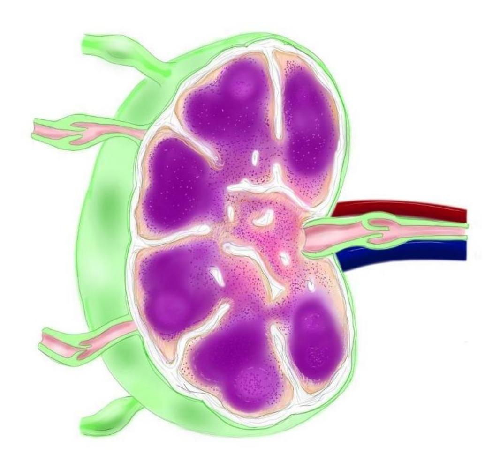

**Figure 18.2** Unlabeled Lymph Node.

## **Lab Activities**

### **Terms**

## **Lymphatic System**

-   Lymphatic vessels (general)

-   Lymph nodes

    -   Cervical
    -   Axillary
    -   Inguinal
    -   Thoracic

-   Right lymphatic duct

-   Thoracic duct

-   Cisterna chyli

-   Lymphatic tissue

    -   Tonsils
        -   Pharyngeal
        -   Palatine
        -   Lingual
    -   Thymus
    -   Spleen

## **Lab Activity 18.1:**

-   In your assigned group. Obtain a 3-D model of the lymphatic system and a whole-body model from the classroom lab supplies.
-   Use the information from your text and the following pages to locate and identify the organs and features above. Also be able to identify the function of the organs and tissues.
-   Use some labelling tape to identify each bone's markings and have another group check your work for correctness. Have your instructor review your material as well.
-   Remember to take some pictures of your work to include in your study guide.

## **Drainage**

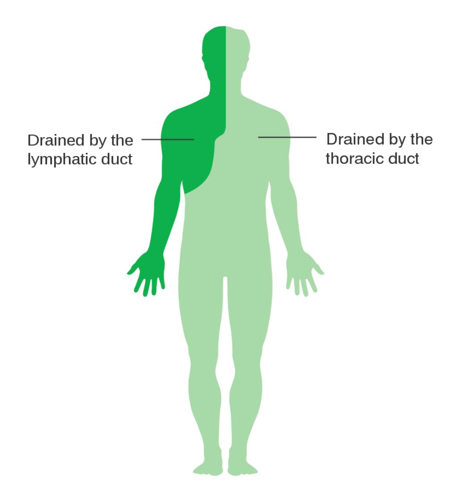

**Figure 18.3** Drainage Pattern of the Lymphatic System.

## **Lymphatic System Structures**

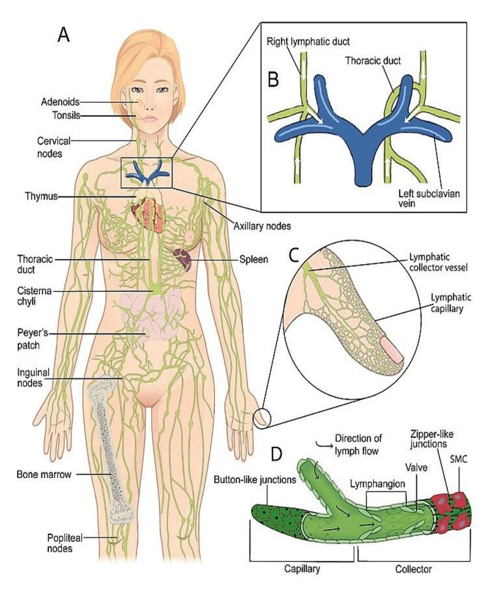

**Figure 18.4** Lymphatic System Anatomy.

## **Lymph Capillaries**

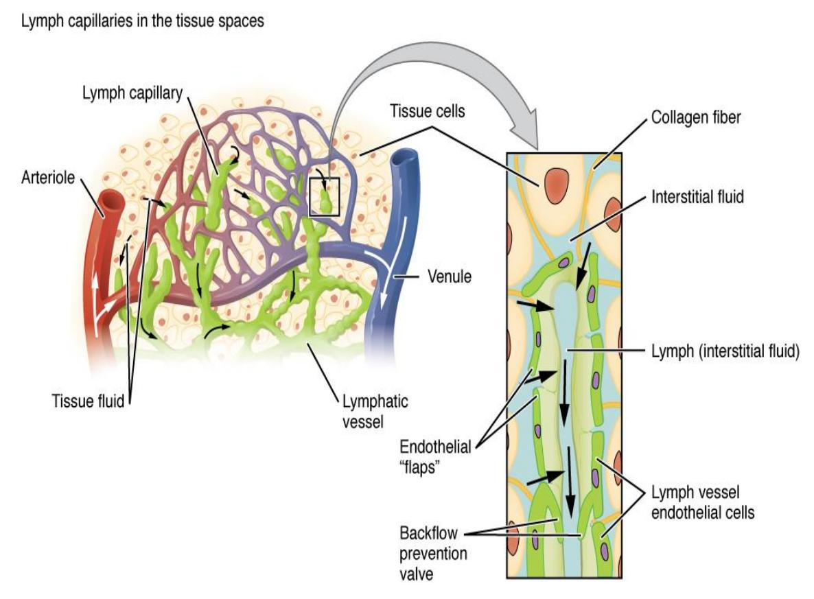

**Figure 18.5** Lymph Capillaries.

## **Lymph Node**

### **Terms**

-   Afferent lymphatic vessel

-   Capsule

-   Cortex (contains denser nodules)

-   Medulla (more diffuse)

-   Sinus (Medullary or Cortical)

-   Nodules (germinal centers)

-   Efferent lymphatic vessel

-   Hilum

## **Lab Activity 18.2:**

As a working group, obtain a 3-D model of the lymph node from the classroom lab supplies. Use the information from your text and figure 18.6.

-   Locate and identify features of the lymph node listed above. Also be able to identify the function of the features.
-   Use some labelling tape to identify each bone's markings and have another group check your work for correctness. Have your instructor review your material as well.
-   Remember to take some pictures of your work to include in your study guide.

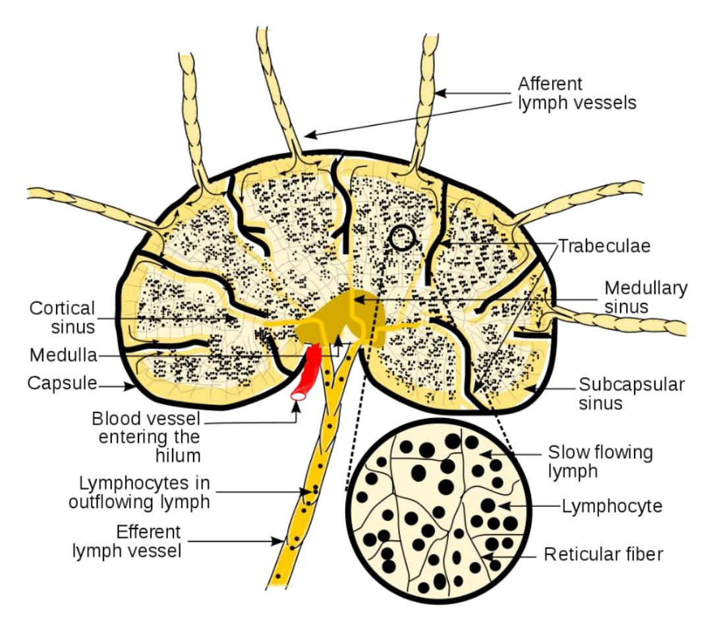

**Figure 18.6** Lymph Node.

## **Lymph Node Histology**

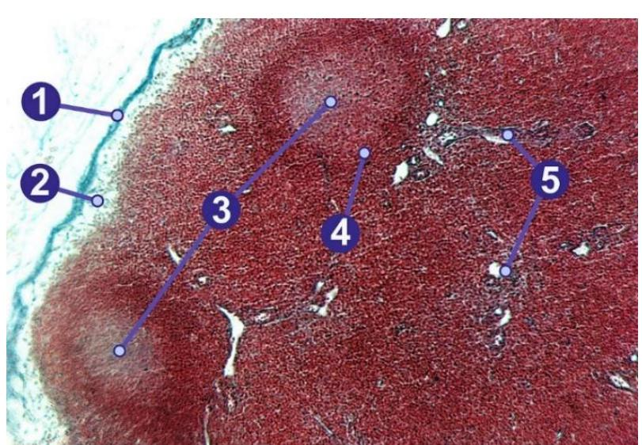

**Figure 18.7** Lymph Node. Cross-section of a lymph node with sections labelled.1) Capsule; 2) Subcapsular sinus; 3) Germinal center; 4) Lymphoid nodule; 5) Trabeculae.

## **Tonsils and Throat**

## **Lab Activity 18.3:**

Obtain a 3-D model of the mid-sagittal section of the head from the classroom lab supplies.

-   Use the information from your text and the following pages to locate and identify the tonsils. Also be able to identify the function of the tonsils.
-   Use labelling tape to identify each bone's markings and have another group check your work for correctness. Have your instructor review your material as well.
-   Remember to take some pictures of your work to include in your study guide.

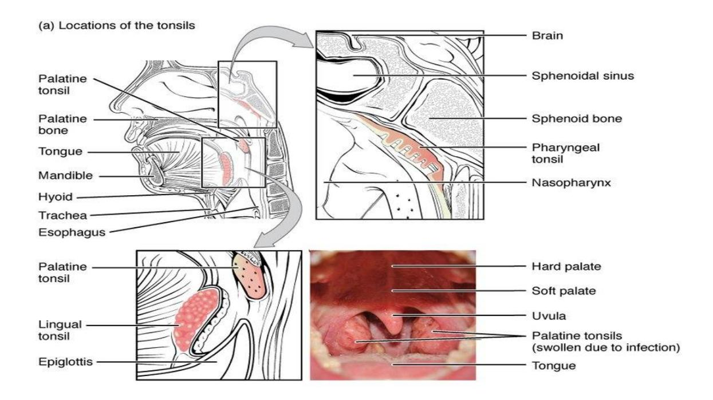

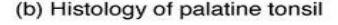

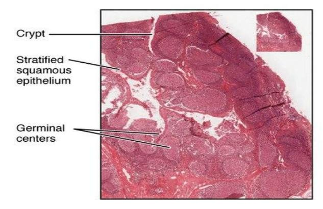

**Figure 18.8** Tonsils and throat.

## **Spleen**

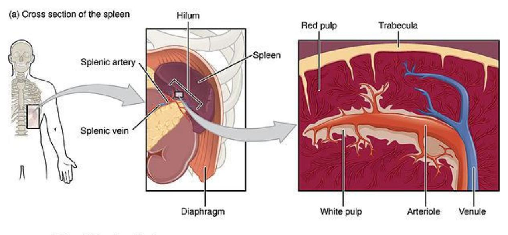

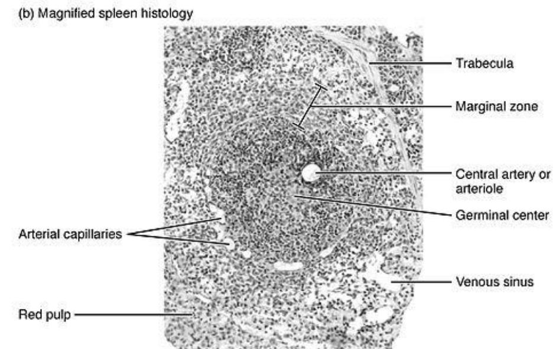

Figure 18.9 The Spleen.

## **Thymus**

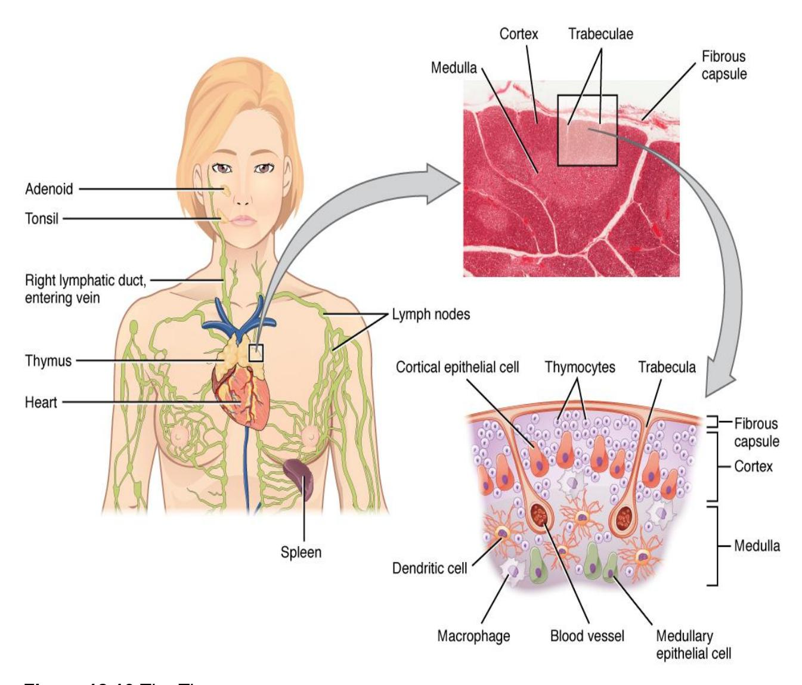

Figure 18.10 The Thymus.

## **Post Lab Activities**

## **Test your understanding.**

## **Post Lab Activity 18.1**

## **Identification.**

-   From the following microphotographs identify the following.
    -   The organ in the picture.
    -   The hormones it releases.
    -   The target organ the hormones have an effect upon.

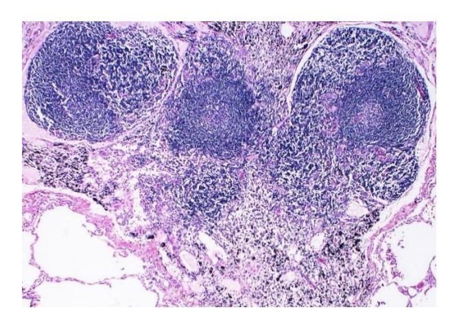

**Figure 18.11**

Answer: \_\_\_\_\_\_\_\_\_\_\_\_\_\_\_\_\_\_\_\_\_\_\_\_

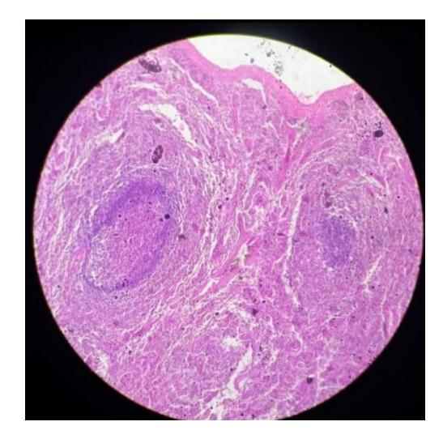

**Figure 18.12**

Answer: \_\_\_\_\_\_\_\_\_\_\_\_\_\_\_\_\_\_\_\_\_\_\_\_

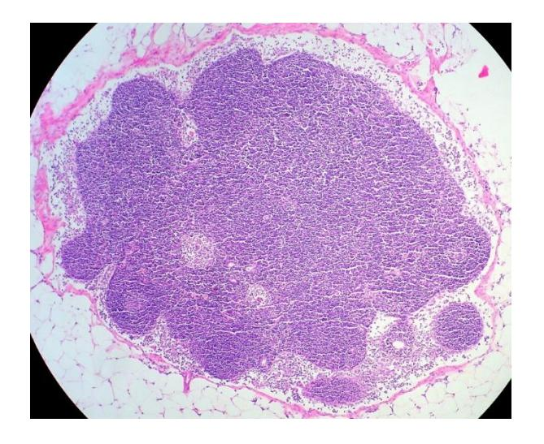

**Figure 18.13**

Answer: \_\_\_\_\_\_\_\_\_\_\_\_\_\_\_\_\_\_\_\_\_\_\_\_

## **Post Lab Activity 18.2**

## **Labeling**

• Label all of the structures of the lymph node

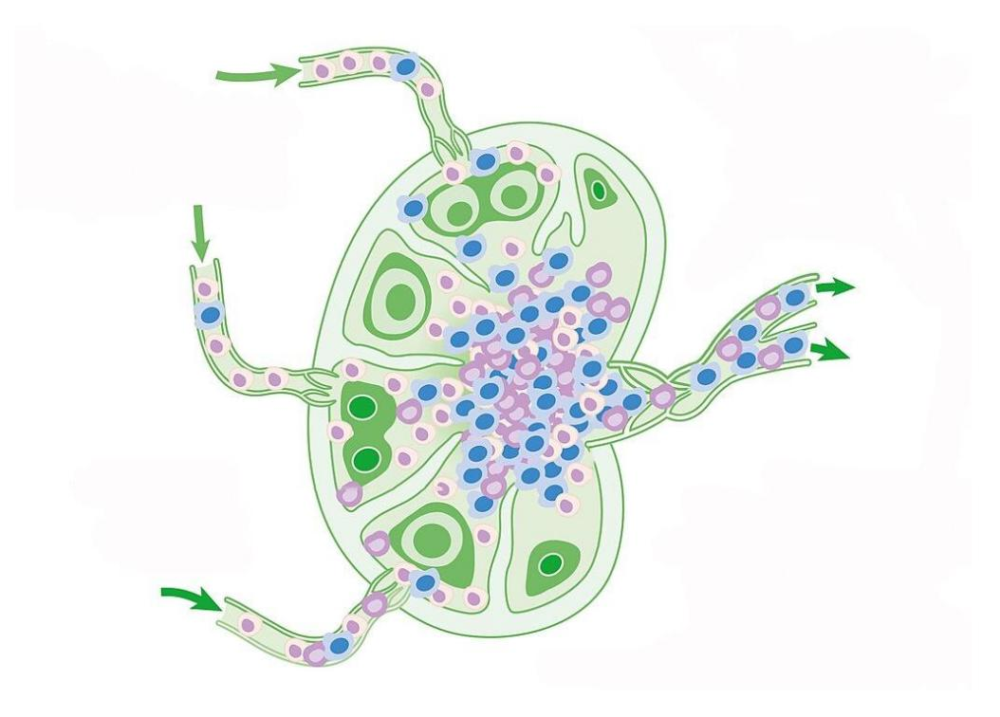

**Figure 18.14** Unlabeled Diagram of the Lymph Node.

Identify and label the structures and organs of the lymphatic system.

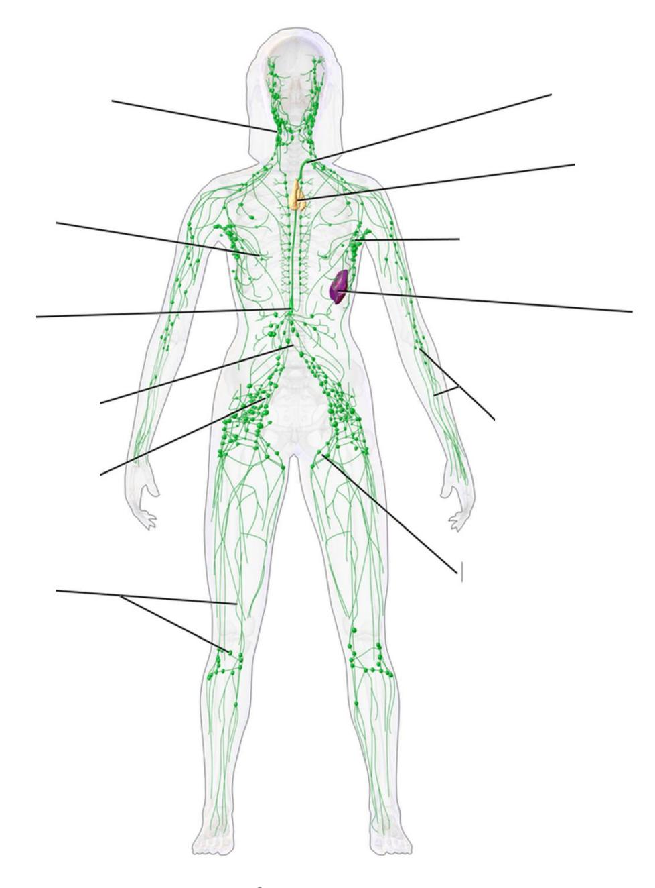

**Figure 18.15** Unlabeled Lymphatic System

## **Post Lab Activity 18.3**

## **Crosswords**

Complete the following crossword puzzles.

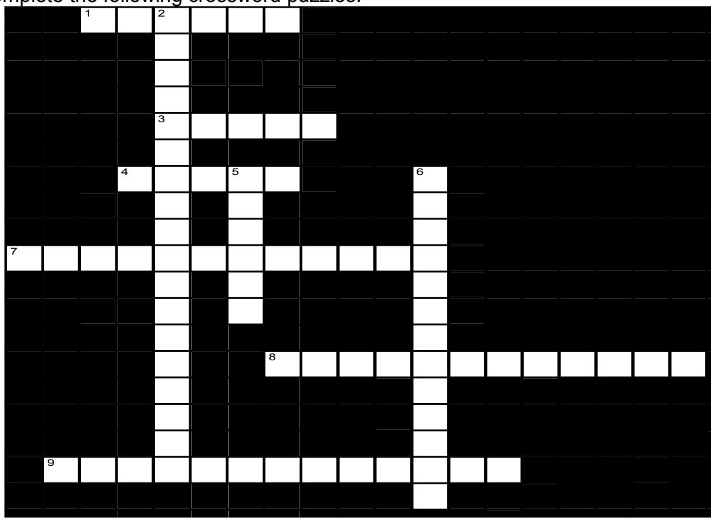

**Figure 18.16** Lymphatic System, Anatomy

### **Across**

-   **1** Lymphatic capillaries are extremely \_\_\_ and can collect not only fluid but also proteins or cells. (6)
-   **3** The walls of the lymphatic collecting vessels, like those of blood vessels, have (how many) tunics? (5)
-   **4** The fluid in the lymphatic system is called \_\_\_. (5)
-   **7** The \_\_\_ \_\_\_ collects lymph from the bulk of the body, including one entire side of the body and regions on the opposite side below the thorax. (8,4)

### **Down**

-   **8** Lymph can only flow in onedirection because of \_\_\_-\_\_\_ \_\_\_ in the lymphatic vessels. (3-3,6)
-   **9** \_\_\_ are specialized lymph capillaries in the \_\_\_ of the small intestine. (8,5)
-   **2** the \_\_\_ \_\_\_ \_\_\_ collects lymph only from a small portion of one side of the body. (5,9,4)
-   **5** One of the major functions of the lymphatic system is to \_\_\_ the interstitial fluid (6)
-   **6** Lymph from the legs, several abdominal organs and the lower torso enters the left lymphatic (a.k.a. thoracic) duct via a dilated sac called the \_\_\_ \_\_\_ (8,5)

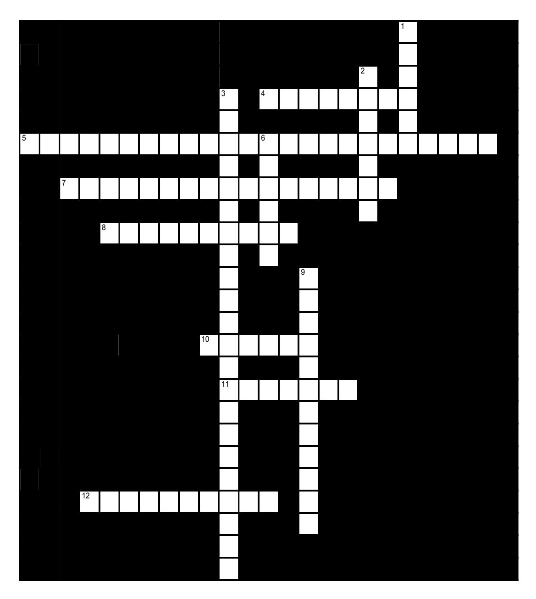

**Figure 18.17** Lymphatic System, Anatomy 2

### **Across**

-   4 The \_\_\_ tonsils are the tonsils found on each side of the pharynx. (8)

-   5 One of the functions of the lymph nodes is to filter out \_\_\_ or \_\_\_. (10,14)

-   7 The \_\_\_ or \_\_\_ tonsil is the tonsil found in the rear wall of the nasopharynx. (7,10)

-   8 \_\_\_ \_\_\_ are the small, roughly oval structures that occur along lymphatic vessels. (5,5)

-   10 The \_\_\_ is a lymphatic organ located medial to the lungs, immediately anterior to the heart (6)

-   11 T-cells are found in the center portion of the lymph node which is the \_\_\_. (7)

-   12 Blood vessels and lymphatic vessels enter the spleen and the lymph nodes through the \_\_\_ or \_\_\_. (5,5)

### **Down**

-   1 The largest lymphatic organ is the \_\_\_. (6)

-   2 The pair of tonsils at the base of the tongue are the \_\_\_ tonsils. (7)

-   3 Encapsulated organs which contain both lymphatic nodules and diffuse lymphatic tissue are the \_\_\_ \_\_\_, \_\_\_ and \_\_\_. (5,5,6,6)

-   6 The outer layer of the lymph node is called the \_\_\_. (6)

-   9 The \_\_\_ consist of \_\_\_ (how many) clusters of lymphatic nodules, arranged in in a ring, in the mucosa of the larynx. (7,5)

## **Keys to the Crossword Puzzles.**

## **Figure 18.16. Lymphatic system, anatomy**

-   **Across: 1** Porous, **3** Three, **4** Lymph, **7** Thoracic duct, **8** One-way valves, **9** Lacteals villi.
-   **Down: 2** Right lymphatic duct, **5** Purify, **6** Cisterna chyli.

#### **Figure 18.17. Lymphatic system, anatomy 2**

-   **Across: 4** Palatine, **5** Impurities microorganisms, **7** Adenoid pharyngeal, **8** Lymph nodes, **10** Thymus, **11** Medulla, **12** Hilum hilus.
-   **Down: 1** Spleen, **2** Lingual, **3** Lymph nodes thymus spleen, **6** Cortex, **9** Tonsils seven.

**Chapter 18: Lymphatic System Glossary**

| Terms | Definitions |
|-------------------|-----------------------------------------------------|
| active immunity | immunity developed from an individual's own immune system |
| acute inflammation | inflammation occurring for a limited time period; rapidly developing |
| adaptive immune response | response relatively slow but extremely specific and effective immune response controlled by lymphocytes |
| afferent lymphatic vessels | vessels lead into a lymph node |
| antibody | antigen-specific protein secreted by plasma cells; immunoglobulin |
| antigen | molecule recognized by the receptors of B and T lymphocytes |
| antigen presentation | binding of processed antigen to the protein-binding cleft of a major histocompatibility complex molecule |
| antigen processing | internalization and digestion of antigen in an antigen-presenting cell |
| antigen receptor | two-chain receptor by which lymphocytes recognize antigen |
| antigenic determinant (also, epitope) | one of the chemical groups recognized by a single type of lymphocyte antigen receptor |
| B cells | lymphocytes that act by differentiating into an antibody-secreting plasma cell |
| barrier defenses | antipathogen defenses deriving from a barrier that physically prevents pathogens from entering the body to establish an infection |
| bone marrow | tissue found inside bones; the site of all blood cell differentiation and maturation of B lymphocytes |
| bronchus-associated lymphoid tissue (BALT) | lymphoid nodule associated with the respiratory tract |
| central tolerance | B cell tolerance induced in immature B cells of the bone marrow |
| chemokine | soluble, long-range, cell-to-cell communication molecule |
| chronic inflammation | inflammation occurring for long periods of time |
| chyle | lipid-rich lymph inside the lymphatic capillaries of the small intestine |
| cisterna chyli | bag-like vessel that forms the beginning of the thoracic duct |
| class switching | ability of B cells to change the class of antibody they produce without altering the specificity for antigen |
| clonal anergy | process whereby B cells that react to soluble antigens in bone marrow are made nonfunctional |
| clonal deletion | removal of self-reactive B cells by inducing apoptosis |
| clonal expansion | growth of a clone of selected lymphocytes |
| clonal selection | stimulating growth of lymphocytes that have specific receptors |
| clone | group of lymphocytes sharing the same antigen receptor |
| complement | enzymatic cascade of constitutive blood proteins that have antipathogen effects, including the direct killing of bacteria |
| constant region | domain part of a lymphocyte antigen receptor that does not vary much between different receptor types |
| Cortex | (of lymph node) contains denser nodules |
| cytokine | soluble, short-range, cell-to-cell communication molecule |
| cytotoxic T cells (Tc) | T lymphocytes with the ability to induce apoptosis in target cells |
| delayed hypersensitivity (type IV) | T cell-mediated immune response against pathogens infiltrating interstitial tissues, causing cellular infiltrate |
| early induced immune response | response includes antimicrobial proteins stimulated during the first several days of an infection |
| effector T cells | immune cells with a direct, adverse effect on a pathogen |
| efferent lymphatic vessels | lead out of a lymph node |
| erythroblastosis fetalis | disease of Rh factor-positive newborns in Rh-negative mothers with multiple Rh-positive children; resulting from the action of maternal antibodies against fetal blood |
| fas ligand | molecule expressed on cytotoxic T cells and NK cells that binds to the fas molecule on a target cell and induces it do undergo apoptosis |
| Fc region | (in an antibody molecule) the site where the two termini of the heavy chains come together; many cells have receptors for this portion of the antibody, adding functionality to these molecules |
| germinal centers | clusters of rapidly proliferating B cells found in secondary lymphoid tissues |
| graft-versus-host disease | (in bone marrow transplants) occurs when the transplanted cells mount an immune response against the recipient |
| granzyme | apoptosis-inducing substance contained in granules of NK cells and cytotoxic T cells |
| heavy chain | larger protein chain of an antibody |
| helper T cells (Th) | T cells that secrete cytokines to enhance other immune responses, involved in activation of both B and T cell lymphocytes |
| high endothelial venules | vessels containing unique endothelial cells specialized to allow migration of lymphocytes from the blood to the lymph node |
| histamine | vasoactive mediator in granules of mast cells and is the primary cause of allergies and anaphylactic shock |
| IgA | antibody whose dimer is secreted by exocrine glands, is especially effective against digestive and respiratory pathogens, and can pass immunity to an infant through breastfeeding |
| IgD | class of antibody whose only known function is as a receptor on naive B cells; important in B cell activation |
| IgE | antibody that binds to mast cells and causes antigen-specific degranulation during an allergic response |
| IgG | main blood antibody of late primary and early secondary responses; passed from carrier to unborn child via placenta |
| IgM | antibody whose monomer is a surface receptor of naive B cells; the pentamer is the first antibody made blood plasma during primary responses |
| immediate hypersensitivity (type I) | IgE-mediated mast cell degranulation caused by crosslinking of surface IgE by antigen |
| immune system | series of barriers, cells, and soluble mediators that combine to response to infections of the body with pathogenic organisms |
| immunoglobulin | protein antibody; occurs as one of five main classes |
| immunological memory | ability of the adaptive immune response to mount a stronger and faster immune response upon re-exposure to a pathogen |
| inflammation | basic innate immune response characterized by heat, redness, pain, and swelling |
| innate immune response | rapid but relatively nonspecific immune response |
| interferons | early induced proteins made in virally infected cells that cause nearby cells to make antiviral proteins |
| light chain | small protein chain of an antibody |
| lymph | fluid contained within the lymphatic system |
| lymph node | one of the bean-shaped organs found associated with the lymphatic vessels |
| lymphatic capillaries | smallest of the lymphatic vessels and the origin of lymph flow |
| lymphatic system | network of lymphatic vessels, lymph nodes, and ducts that carries lymph from the tissues and back to the bloodstream. |
| Lymphatic tissue | Tissue making up the lymphatic system. |
| lymphatic trunks | large lymphatics that collect lymph from smaller lymphatic vessels and empties into the blood via lymphatic ducts |
| lymphocytes | white blood cells characterized by a large nucleus and small rim of cytoplasm |
| lymphoid nodules | unencapsulated patches of lymphoid tissue found throughout the body |
| macrophage | ameboid phagocyte found in several tissues throughout the body |
| macrophage oxidative metabolism | metabolism turned on in macrophages by T cell signals that help destroy intracellular bacteria |
| major histocompatibility complex (MHC) | gene cluster whose proteins present antigens to T cells |
| mast cell | cell found in the skin and the lining of body cells that contains cytoplasmic granules with vasoactive mediators such as histamine |
| Medulla | (of lymph node) more diffuse nodules |
| memory T cells | long-lived immune cell reserved for future exposure to a pathogen |
| MHC class I | found on most cells of the body, it binds to the CD8 molecule on T cells |
| MHC class II | found on macrophages, dendritic cells, and B cells, it binds to CD4 molecules on T cells |
| MHC polygeny | multiple MHC genes and their proteins found in body cells |
| MHC polymorphism | multiple alleles for each individual MHC locus |
| monocyte | precursor to macrophages and dendritic cells seen in the blood |
| mucosa-associated lymphoid tissue (MALT) | lymphoid nodule associated with the mucosa |
| naive lymphocyte | mature B or T cell that has not yet encountered antigen for the first time |
| natural killer cell (NK) | cytotoxic lymphocyte of innate immune response |
| negative selection | selection against thymocytes in the thymus that react with self-antigen |
| neutralization | inactivation of a virus by the binding of specific antibody |
| neutrophil | phagocytic white blood cell recruited from the bloodstream to the site of infection via the bloodstream |
| opsonization | enhancement of phagocytosis by the binding of antibody or antimicrobial protein |
| passive immunity | transfer of immunity to a pathogen to an individual that lacks immunity to this pathogen usually by the injection of antibodies |
| pattern recognition receptor (PRR) | leukocyte receptor that binds to specific cell wall components of different bacterial species |
| perforin | molecule in NK cell and cytotoxic T cell granules that form pores in the membrane of a target cell |
| peripheral tolerance | mature B cell made tolerant by lack of T cell help |
| phagocytosis | movement of material from the outside to the inside of the cells via vesicles made from invaginations of the plasma membrane |
| plasma cell | differentiated B cell that is actively secreting antibody |
| polyclonal response | response by multiple clones to a complex antigen with many determinants |
| positive selection | selection of thymocytes within the thymus that interact with self, but not non-self, MHC molecules |
| primary adaptive response immune | system's response to the first exposure to a pathogen |
| primary lymphoid organ | site where lymphocytes mature and proliferate; red bone marrow and thymus gland |
| psychoneuroimmunology | study of the connections between the immune, nervous, and endocrine systems |
| regulatory T cells (Treg) (also, suppressor T cells) | class of CD4 T cells that regulates other T cell responses |
| right lymphatic duct | drains lymph fluid from the upper right side of body into the right subclavian vein |
| secondary adaptive response | immune response observed upon re-exposure to a pathogen, which is stronger and faster than a primary response |
| secondary lymphoid organs | sites where lymphocytes mount adaptive immune responses; examples include lymph nodes and spleen |
| sensitization | first exposure to an antigen |
| seroconversion | clearance of pathogen in the serum and the simultaneous rise of serum antibody |
| severe combined immunodeficiency disease (SCID) | genetic mutation that affects both T cell and B cell arms of the immune response |
| spleen | secondary lymphoid organ that filters pathogens from the blood (white pulp) and removes degenerating or damaged blood cells (red pulp) |
| T cell | lymphocyte that acts by secreting molecules that regulate the immune system or by causing the destruction of foreign cells, viruses, and cancer cells |
| T cell tolerance | process during T cell differentiation where most T cells that recognize antigens from one's own body are destroyed |
| T cell-dependent antigen | antigen that binds to B cells, which requires signals from T cells to make antibody |
| T cell-independent antigen | antigen binds to B cells, which do not require signals from T cells to make antibody |
| Th1 cells | cells that secrete cytokines that enhance the activity of macrophages and other cells |
| Th2 cells | cells that secrete cytokines that induce B cells to differentiate into antibody-secreting plasma cells |
| thoracic duct | large duct that drains lymph from the lower limbs, left thorax, left upper limb, and the left side of the head |
| thymocyte | immature T cell found in the thymus |
| thymus | primary lymphoid organ, where T lymphocytes proliferate and mature |
| tissue typing | typing of MHC molecules between a recipient and donor for use in a potential transplantation procedure |
| tonsils | lymphoid nodules associated with the nasopharynx |
| type I hypersensitivity | immediate response mediated by mast cell degranulation caused by the crosslinking of the antigen-specific IgE molecules on the mast cell surface |
| type II hypersensitivity | cell damage caused by the binding of antibody and the activation of complement, usually against red blood cells |
| type III hypersensitivity | damage to tissues caused by the deposition of antibody-antigen (immune) complexes followed by the activation of complement |
| variable region | domain part of a lymphocyte antigen receptor that varies considerably between different receptor types |
