# **Respiratory System**

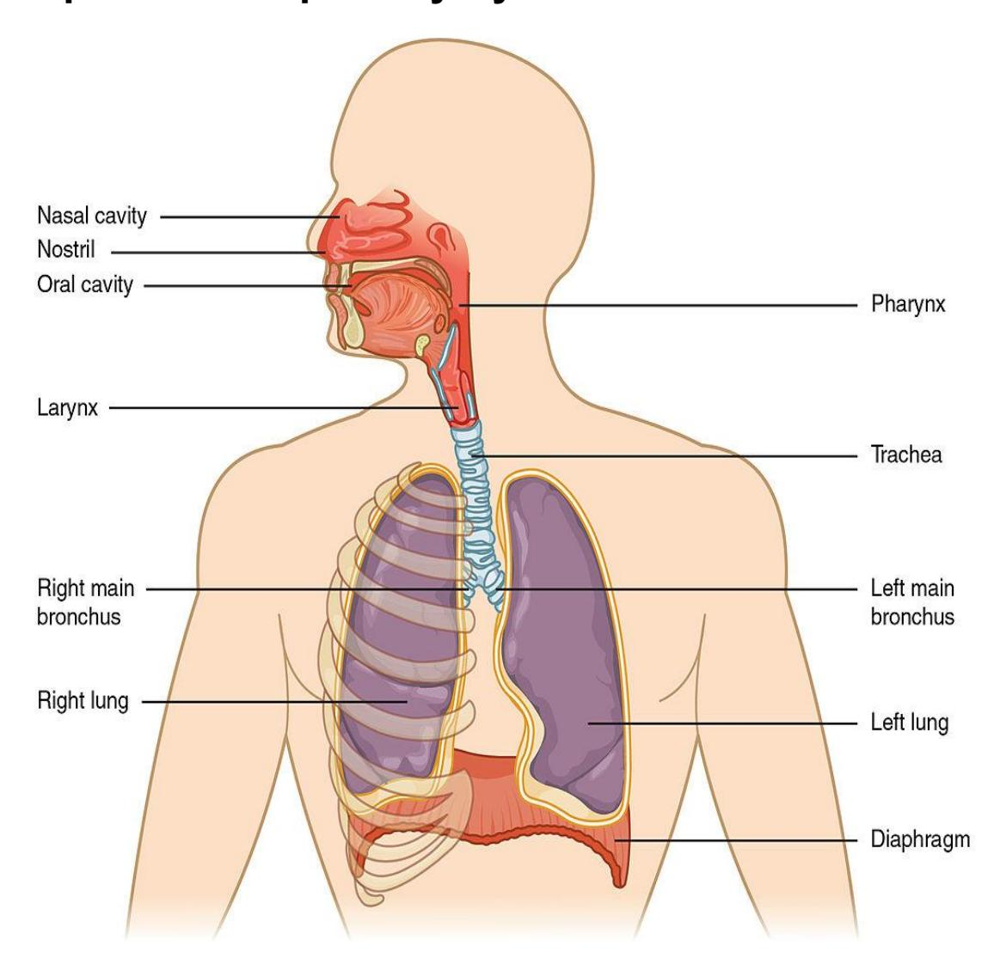

**Figure 19.1** The Respiratory System Organs.

## **Objectives**

In this lab session you will be using models to study the respiratory system anatomy. You will also use a Spirometer to determine the volumes of the respiratory system.

## **By the end of this lesson, you will be able to:**

1.  Identify the major respiratory system structures on a model, or diagram.
2.  Describe the functions of each structure within the respiratory system.
3.  Identify the following structures of the Upper Respiratory Tract:

## **Sagittal Head and Pharynx**

-   Nostril

-   Nasal cavity

-   Conchae superior, middle, inferior

-   Meatus superior, middle, inferior Hard palate

-   Soft palate

-   Uvula

-   Tongue

-   Frontal sinus

-   Sphenoidal sinus

-   Palatine tonsil

-   Pharynx

    -   Nasopharynx
        -   Oropharynx
        -   Laryngopharynx

-   Hyoid bone

-   Larynx

    -   Glottis
    -   Epiglottis

-   Esophagus

-   Trachea

## **Identify the following structures of the Larynx:**

-   Hyoid bone

-   Thyroid cartilage

-   Cricoid cartilage

-   Epiglottis

-   Arytenoid cartilages

-   Tracheal cartilages

-   Glottis (space)

-   Vestibular folds (false vocal cords)

-   Vocal folds (true vocal cords)

## **Identify the following structures of the Lower Respiratory Tract: Lower Respiratory Tract**

-   Trachea

-   Primary (main) bronchus

-   Secondary (lobar) bronchus

-   Tertiary (segmental) bronchus

-   Bronchiole

-   Alveolar duct

-   Alveolar sac

-   Alveolus

-   Pleural cavity

-   Parietal & visceral pleura

-   Right lung (3 lobes)

-   Left lung (2 lobes)

-   Pulmonary arteries

-   Pulmonary veins

-   Diaphragm

## **Identify and describe the mechanics of ventilation.**

-   Spirometry
-   Tidal volume
-   Vital capacity

## **Prelab Activities:**

## **Prelab Activity 19.1**

## **Define the following terms**

## **Sagittal Head and Pharynx**

-   Nostril \_\_\_\_\_\_\_\_\_\_\_\_\_\_\_\_\_\_\_\_\_\_\_\_\_\_\_\_\_\_\_\_\_\_\_\_\_\_\_\_\_\_\_\_\_\_\_\_\_\_\_\_\_\_\_\_
-   Nasal cavity \_\_\_\_\_\_\_\_\_\_\_\_\_\_\_\_\_\_\_\_\_\_\_\_\_\_\_\_\_\_\_\_\_\_\_\_\_\_\_\_\_\_\_\_\_\_\_\_\_\_\_
-   Conchae - superior, middle, inferior \_\_\_\_\_\_\_\_\_\_\_\_\_\_\_\_\_\_\_\_\_\_\_\_\_\_\_\_\_\_\_\_
-   Meatus - superior, middle, inferior \_\_\_\_\_\_\_\_\_\_\_\_\_\_\_\_\_\_\_\_\_\_\_\_\_\_\_\_\_\_\_\_\_\_
-   Hard palate \_\_\_\_\_\_\_\_\_\_\_\_\_\_\_\_\_\_\_\_\_\_\_\_\_\_\_\_\_\_\_\_\_\_\_\_\_\_\_\_\_\_\_\_\_\_\_\_\_\_\_\_
-   Soft palate \_\_\_\_\_\_\_\_\_\_\_\_\_\_\_\_\_\_\_\_\_\_\_\_\_\_\_\_\_\_\_\_\_\_\_\_\_\_\_\_\_\_\_\_\_\_\_\_\_\_\_\_
-   Uvula \_\_\_\_\_\_\_\_\_\_\_\_\_\_\_\_\_\_\_\_\_\_\_\_\_\_\_\_\_\_\_\_\_\_\_\_\_\_\_\_\_\_\_\_\_\_\_\_\_\_\_\_\_\_\_\_
-   Tongue \_\_\_\_\_\_\_\_\_\_\_\_\_\_\_\_\_\_\_\_\_\_\_\_\_\_\_\_\_\_\_\_\_\_\_\_\_\_\_\_\_\_\_\_\_\_\_\_\_\_\_\_\_\_\_
-   Frontal sinus \_\_\_\_\_\_\_\_\_\_\_\_\_\_\_\_\_\_\_\_\_\_\_\_\_\_\_\_\_\_\_\_\_\_\_\_\_\_\_\_\_\_\_\_\_\_\_\_\_\_\_
-   Sphenoidal sinus \_\_\_\_\_\_\_\_\_\_\_\_\_\_\_\_\_\_\_\_\_\_\_\_\_\_\_\_\_\_\_\_\_\_\_\_\_\_\_\_\_\_\_\_\_\_\_
-   Palatine tonsil \_\_\_\_\_\_\_\_\_\_\_\_\_\_\_\_\_\_\_\_\_\_\_\_\_\_\_\_\_\_\_\_\_\_\_\_\_\_\_\_\_\_\_\_\_\_\_\_\_\_
-   Nasopharynx \_\_\_\_\_\_\_\_\_\_\_\_\_\_\_\_\_\_\_\_\_\_\_\_\_\_\_\_\_\_\_\_\_\_\_\_\_\_\_\_\_\_\_\_\_\_\_\_\_\_
-   Oropharynx \_\_\_\_\_\_\_\_\_\_\_\_\_\_\_\_\_\_\_\_\_\_\_\_\_\_\_\_\_\_\_\_\_\_\_\_\_\_\_\_\_\_\_\_\_\_\_\_\_\_\_\_
-   Laryngopharynx \_\_\_\_\_\_\_\_\_\_\_\_\_\_\_\_\_\_\_\_\_\_\_\_\_\_\_\_\_\_\_\_\_\_\_\_\_\_\_\_\_\_\_\_\_\_\_\_
-   Hyoid bone \_\_\_\_\_\_\_\_\_\_\_\_\_\_\_\_\_\_\_\_\_\_\_\_\_\_\_\_\_\_\_\_\_\_\_\_\_\_\_\_\_\_\_\_\_\_\_\_\_\_\_\_
-   Epiglottis \_\_\_\_\_\_\_\_\_\_\_\_\_\_\_\_\_\_\_\_\_\_\_\_\_\_\_\_\_\_\_\_\_\_\_\_\_\_\_\_\_\_\_\_\_\_\_\_\_\_\_\_\_\_
-   Larynx\_\_\_\_\_\_\_\_\_\_\_\_\_\_\_\_\_\_\_\_\_\_\_\_\_\_\_\_\_\_\_\_\_\_\_\_\_\_\_\_\_\_\_\_\_\_\_\_\_\_\_\_\_\_\_\_
-   Trachea \_\_\_\_\_\_\_\_\_\_\_\_\_\_\_\_\_\_\_\_\_\_\_\_\_\_\_\_\_\_\_\_\_\_\_\_\_\_\_\_\_\_\_\_\_\_\_\_\_\_\_\_\_\_
-   Esophagus \_\_\_\_\_\_\_\_\_\_\_\_\_\_\_\_\_\_\_\_\_\_\_\_\_\_\_\_\_\_\_\_\_\_\_\_\_\_\_\_\_\_\_\_\_\_\_\_\_\_\_\_
-   Larynx \_\_\_\_\_\_\_\_\_\_\_\_\_\_\_\_\_\_\_\_\_\_\_\_\_\_\_\_\_\_\_\_\_\_\_\_\_\_\_\_\_\_\_\_\_\_\_\_\_\_\_\_\_\_\_\_
-   Hyoid bone \_\_\_\_\_\_\_\_\_\_\_\_\_\_\_\_\_\_\_\_\_\_\_\_\_\_\_\_\_\_\_\_\_\_\_\_\_\_\_\_\_\_\_\_\_\_\_\_\_\_\_\_
-   Thyroid cartilage \_\_\_\_\_\_\_\_\_\_\_\_\_\_\_\_\_\_\_\_\_\_\_\_\_\_\_\_\_\_\_\_\_\_\_\_\_\_\_\_\_\_\_\_\_\_\_\_
-   Cricoid cartilage \_\_\_\_\_\_\_\_\_\_\_\_\_\_\_\_\_\_\_\_\_\_\_\_\_\_\_\_\_\_\_\_\_\_\_\_\_\_\_\_\_\_\_\_\_\_\_\_
-   Epiglottis \_\_\_\_\_\_\_\_\_\_\_\_\_\_\_\_\_\_\_\_\_\_\_\_\_\_\_\_\_\_\_\_\_\_\_\_\_\_\_\_\_\_\_\_\_\_\_\_\_\_\_\_\_\_
-   Arytenoid cartilages \_\_\_\_\_\_\_\_\_\_\_\_\_\_\_\_\_\_\_\_\_\_\_\_\_\_\_\_\_\_\_\_\_\_\_\_\_\_\_\_\_\_\_\_\_
-   Tracheal cartilages \_\_\_\_\_\_\_\_\_\_\_\_\_\_\_\_\_\_\_\_\_\_\_\_\_\_\_\_\_\_\_\_\_\_\_\_\_\_\_\_\_\_\_\_\_\_
-   Glottis (space) \_\_\_\_\_\_\_\_\_\_\_\_\_\_\_\_\_\_\_\_\_\_\_\_\_\_\_\_\_\_\_\_\_\_\_\_\_\_\_\_\_\_\_\_\_\_\_\_\_
-   Vestibular folds (false vocal cords) \_\_\_\_\_\_\_\_\_\_\_\_\_\_\_\_\_\_\_\_\_\_\_\_\_\_\_\_\_\_\_\_\_\_
-   Vocal folds (true vocal cords) \_\_\_\_\_\_\_\_\_\_\_\_\_\_\_\_\_\_\_\_\_\_\_\_\_\_\_\_\_\_\_\_\_\_\_\_\_\_

## **Lower Respiratory Tract**

-   Trachea \_\_\_\_\_\_\_\_\_\_\_\_\_\_\_\_\_\_\_\_\_\_\_\_\_\_\_\_\_\_\_\_\_\_\_\_\_\_\_\_\_\_\_\_\_\_\_\_\_\_\_\_\_\_
-   Primary (main) bronchus \_\_\_\_\_\_\_\_\_\_\_\_\_\_\_\_\_\_\_\_\_\_\_\_\_\_\_\_\_\_\_\_\_\_\_\_\_\_\_\_\_
-   Secondary (lobar) bronchus \_\_\_\_\_\_\_\_\_\_\_\_\_\_\_\_\_\_\_\_\_\_\_\_\_\_\_\_\_\_\_\_\_\_\_\_\_\_\_
-   Tertiary (segmental) bronchus \_\_\_\_\_\_\_\_\_\_\_\_\_\_\_\_\_\_\_\_\_\_\_\_\_\_\_\_\_\_\_\_\_\_\_\_\_
-   Bronchiole \_\_\_\_\_\_\_\_\_\_\_\_\_\_\_\_\_\_\_\_\_\_\_\_\_\_\_\_\_\_\_\_\_\_\_\_\_\_\_\_\_\_\_\_\_\_\_\_\_\_\_\_\_
-   Alveolar duct \_\_\_\_\_\_\_\_\_\_\_\_\_\_\_\_\_\_\_\_\_\_\_\_\_\_\_\_\_\_\_\_\_\_\_\_\_\_\_\_\_\_\_\_\_\_\_\_\_\_\_
-   Alveolar sac \_\_\_\_\_\_\_\_\_\_\_\_\_\_\_\_\_\_\_\_\_\_\_\_\_\_\_\_\_\_\_\_\_\_\_\_\_\_\_\_\_\_\_\_\_\_\_\_\_\_\_
-   Alveolus\_\_\_\_\_\_\_\_\_\_\_\_\_\_\_\_\_\_\_\_\_\_\_\_\_\_\_\_\_\_\_\_\_\_\_\_\_\_\_\_\_\_\_\_\_\_\_\_\_\_\_\_\_\_\_
-   Pleural cavity \_\_\_\_\_\_\_\_\_\_\_\_\_\_\_\_\_\_\_\_\_\_\_\_\_\_\_\_\_\_\_\_\_\_\_\_\_\_\_\_\_\_\_\_\_\_\_\_\_\_
-   Parietal & visceral pleura \_\_\_\_\_\_\_\_\_\_\_\_\_\_\_\_\_\_\_\_\_\_\_\_\_\_\_\_\_\_\_\_\_\_\_\_\_\_\_\_\_
-   Right lung (3 lobes) \_\_\_\_\_\_\_\_\_\_\_\_\_\_\_\_\_\_\_\_\_\_\_\_\_\_\_\_\_\_\_\_\_\_\_\_\_\_\_\_\_\_\_\_\_
-   Left lung (2 lobes) \_\_\_\_\_\_\_\_\_\_\_\_\_\_\_\_\_\_\_\_\_\_\_\_\_\_\_\_\_\_\_\_\_\_\_\_\_\_\_\_\_\_\_\_\_\_
-   Pulmonary arteries \_\_\_\_\_\_\_\_\_\_\_\_\_\_\_\_\_\_\_\_\_\_\_\_\_\_\_\_\_\_\_\_\_\_\_\_\_\_\_\_\_\_\_\_\_\_
-   Pulmonary veins \_\_\_\_\_\_\_\_\_\_\_\_\_\_\_\_\_\_\_\_\_\_\_\_\_\_\_\_\_\_\_\_\_\_\_\_\_\_\_\_\_\_\_\_\_\_\_\_
-   Diaphragm \_\_\_\_\_\_\_\_\_\_\_\_\_\_\_\_\_\_\_\_\_\_\_\_\_\_\_\_\_\_\_\_\_\_\_\_\_\_\_\_\_\_\_\_\_\_\_\_\_\_\_\_

## **Know the mechanics of ventilation**

-   Spirometry \_\_\_\_\_\_\_\_\_\_\_\_\_\_\_\_\_\_\_\_\_\_\_\_\_\_\_\_\_\_\_\_\_\_\_\_\_\_\_\_\_\_\_\_\_\_\_\_\_\_\_\_
-   Tidal volume\_\_\_\_\_\_\_\_\_\_\_\_\_\_\_\_\_\_\_\_\_\_\_\_\_\_\_\_\_\_\_\_\_\_\_\_\_\_\_\_\_\_\_\_\_\_\_\_\_\_\_
-   Vital capacity \_\_\_\_\_\_\_\_\_\_\_\_\_\_\_\_\_\_\_\_\_\_\_\_\_\_\_\_\_\_\_\_\_\_\_\_\_\_\_\_\_\_\_\_\_\_\_\_\_\_

## **Prelab Activity 19.2**

Identify and label the structures of the respiratory system.

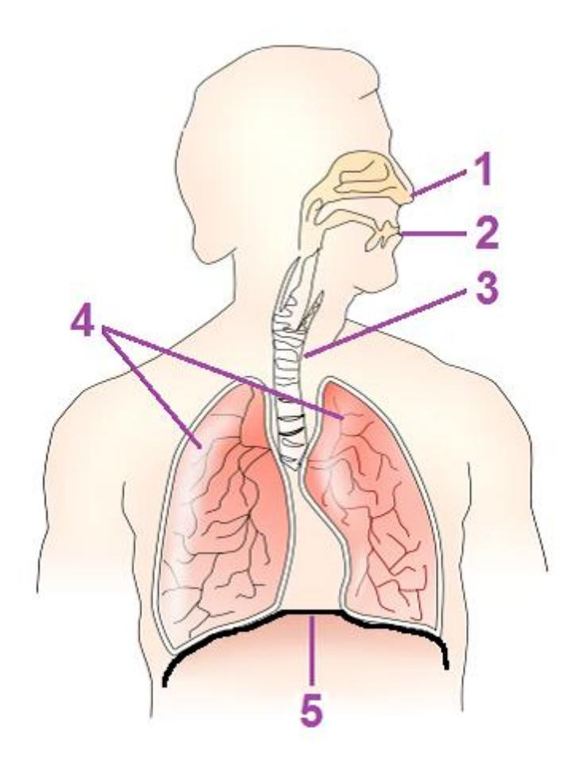

**Figure 19.2** The Respiratory System, Unlabeled.

|     |     |
|-----|-----|
| 1   | 4   |
| 2   | 5   |
| 3   |     |

## **Lab Activities**

## **Organs and structures of the Respiratory system.**

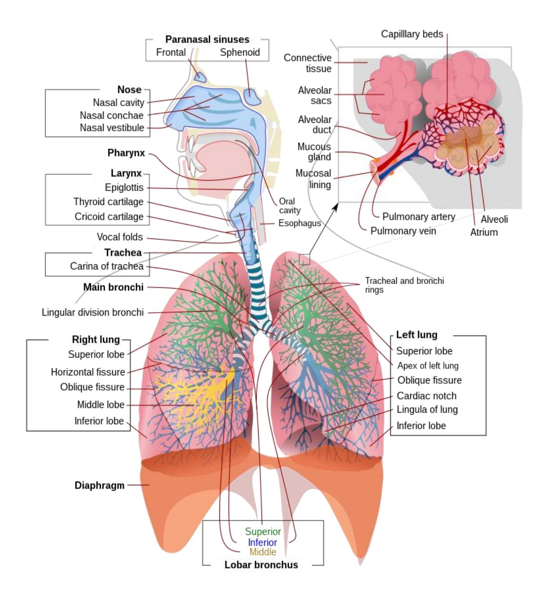

**Figure 19.3** Complete Respiratory System.

## **Upper Respiratory Tract: Sagittal Head and Pharynx**

-   Nostril
-   Nasal cavity
-   Conchae
    -   superior, middle, inferior
-   Respiratory Meatuses
    -   superior, middle, inferior
-   Hard palate
-   Soft palate
-   Uvula
-   Tongue
-   Frontal sinus
-   Sphenoidal sinus
-   Palatine tonsil
-   Pharynx
    -   Nasopharynx
    -   Oropharynx
-   Laryngopharynx
-   Hyoid bone
-   Larynx
    -   Glottis
    -   Epiglottis
    -   Thyroid cartilage
    -   Cricoid cartilage
    -   Arytenoid cartilages
    -   Tracheal cartilages
    -   Glottis (space)
    -   Vestibular folds (false vocal cords)
    -   Vocal folds (true vocal cords)
    -   Trachea
    -   Esophagus

## **Lab Activity 19.1**

Break up into your assigned groups. Obtain a 3-D model of the mid-sagittal head model and the Hubbard^TM^ Scientific respiratory system model

-   Using the information from your text and the following figures (19.3 19.6) locate and identify the organs and structures of the upper and lower respiratory system.
-   Use some labelling tape to identify each vessel layer or structures. Have another group check your work for correctness. Have your instructor review your material as well.
-   Remember to take some pictures of your work to include in your study guide.

### **Upper and Lower Respiratory Systems**

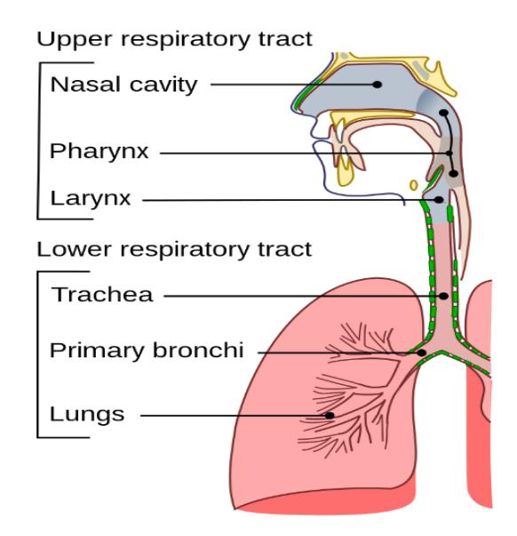

**Figure 19.4** The Upper and Lower Respiratory Conducting Passages.

## **Upper Respiratory Tract**

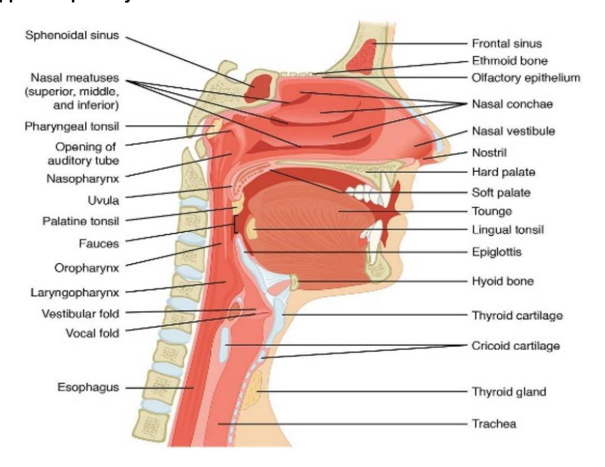

**Figure 19.5** The Anatomy of the Nose, Pharynx, Mouth, and Larynx.

## **Divisions of the Pharynx**

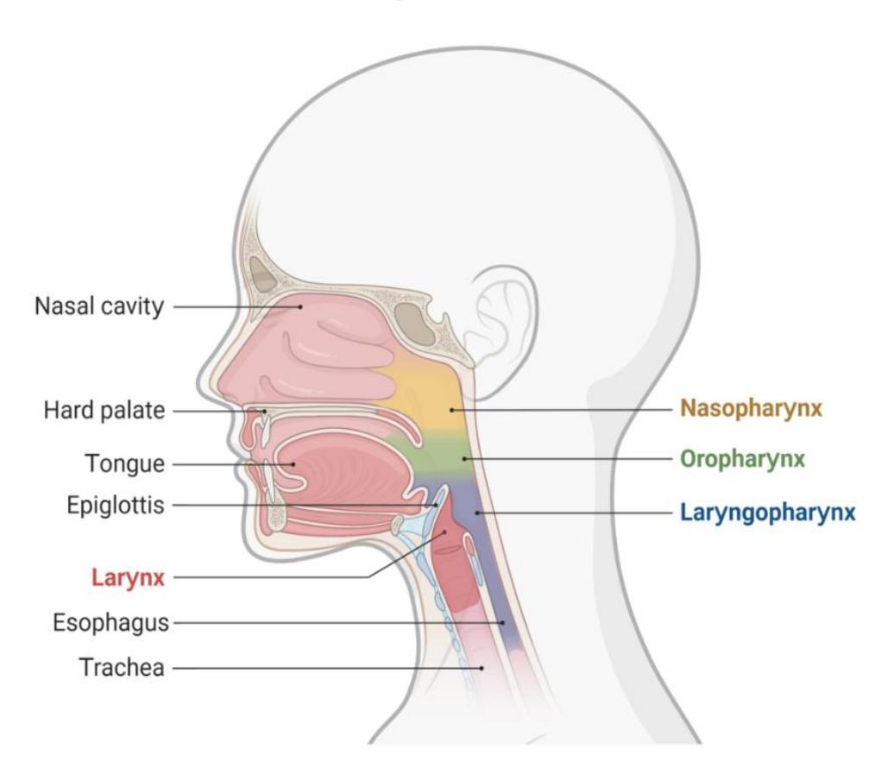

**Figure 19.6** The Structure of the Pharynx and Larynx.

## **Lab Activity 19.2**

Break up into your assigned groups. Obtain a 3-D model of the mid-sagittal head model and the Hubbard^TM^ Scientific respiratory system model

-   Using the information from your text and figure 19.7, locate and identify the organs and structures of the lower respiratory system.
-   Use some labelling tape to identify each vessel layer or structures. Have another group check your work for correctness. Have your instructor review your material as well.
-   Remember to take some pictures of your work to include in your study guide.

## **Lower Respiratory Tract**

-   Trachea

-   Primary (main) bronchus

-   Secondary (lobar) bronchus

-   Tertiary (segmental) bronchus

-   Bronchiole

-   Alveolar duct

-   Alveolar sac

-   Alveolus

-   Pleural cavity

-   Parietal & visceral pleura

-   Right lung (3 lobes)

-   Left lung (2 lobes)

-   Pulmonary arteries

-   Pulmonary veins

-   Diaphragm

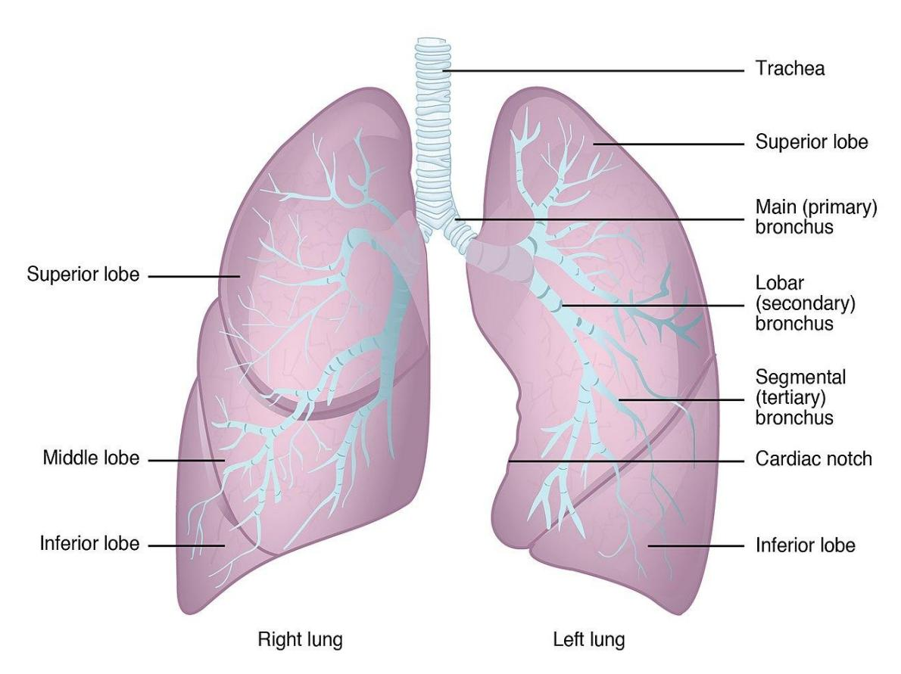

**Figure 19.7** Gross Anatomy of the Lungs.

Working with your assigned groups, obtain a 3-D model of the larynx and/or the larynx with bronchial tree.

-   Using the information from your text and the following figures (19.8 & 19.9) locate and identify the organs and structures of the larynx and the bronchial tree.

-   Use some labelling tape to identify each vessel layer or structures. Have another group check your work for correctness. Have your instructor review your material as well.

-   Remember to take some pictures of your work to include in your study guide.

-   Larynx

    -   Glottis
    -   Epiglottis
    -   Thyroid cartilage
    -   Cricoid cartilage
    -   Arytenoid cartilages
    -   Tracheal cartilages
    -   Glottis (space)

-   Vestibular folds (false vocal cords)

-   Vocal folds (true vocal cords)

-   Trachea

-   Esophagus

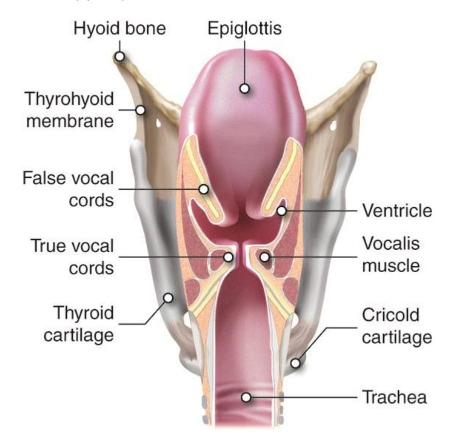

**Figure 19.8** Posterior View of the Larynx.

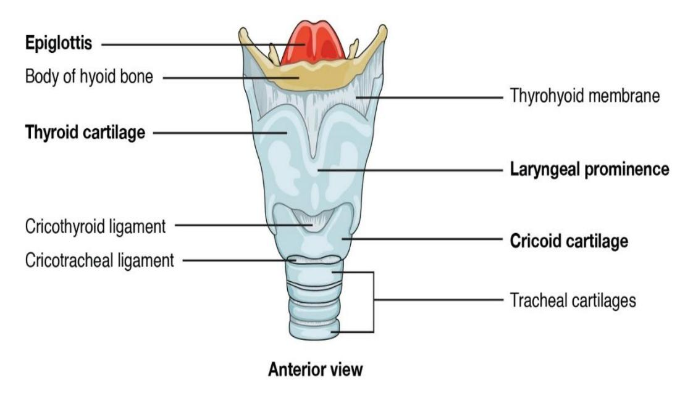

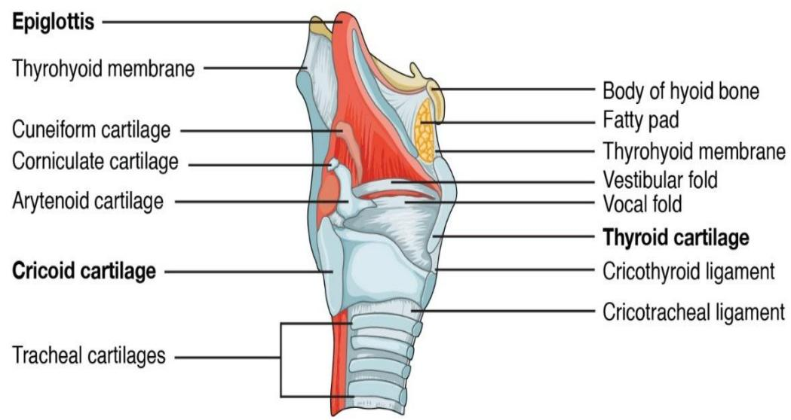

Right lateral view

Figure 19.9 The Larynx, Anterior and Mid-Sagittal Views.

## **Respiratory physiology**

Know and identify the stages of ventilation.

-   Spirometry
-   Tidal volume
-   Vital capacity

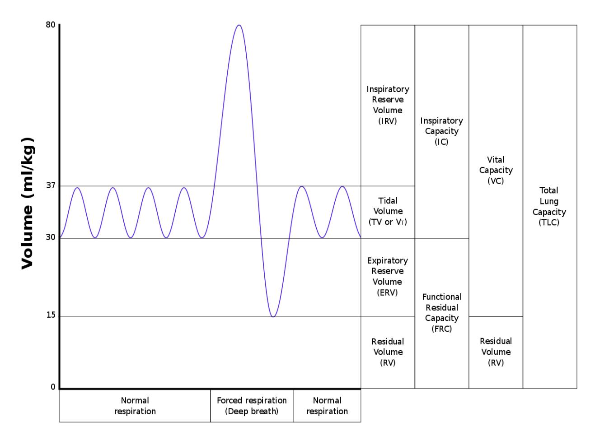

**Figure 19.10** Typical Output from a Spirometer.

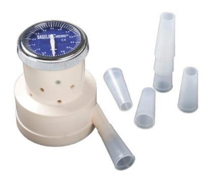

**Figure 19.11** Buhl spirometer with mouthpieces.

## **Lab Activity 19.3 (Optional):**

Measuring your lung volumes

### **Steps**

1.  Initial steps: Setting up the spirometer.

-   Obtain a Buhl spirometer and a mouthpiece.
-   Place the mouthpiece on the tip of the port extending out of the spirometer's body.
-   Exhale several times to practice how to use the spirometer correctly.

2.  Measuring tidal volume (TV):

-   Set the spirometer to "0."
-   Standing , inhale normally and exhale several times to determine your normal breath pattern then when you have inhaled, exhale into the spirometer. Do not force your breath.
-   Since the spirometer begins to measure the exhaled volume at 1000ml you will have to repeat this procedure three times. After the third time record the total volume then divide that by three to obtain your average tidal volume.

3.  Measuring expiratory reserve volume (ERV).

-   Reset the dial to "0."
-   Exhale and inhale several times using your tidal volume without measuring your exhalation.
-   Standing; at the bottom of the tidal volume, end of one cycle, place the mouthpiece of the spirometer in your mouth.
-   Exhale as much air as you can from your lungs.
-   Warning: do not take an extra-large inhalation before measuring this volume, it will skew your results.
-   Record the volume of this attempt.
-   You need to take two more measurements. It is recommended to take a break between each measurement.
-   Reset the spirometer to "0" before each measurement,
-   Record the next two attempts, add all three measurements then divide by three to obtain the average expiratory reserve volume.

4.  Measuring the vital capacity (VC):

-   Reset the spirometer to "0."
-   Breath several times using your normal tidal volume.
-   Inhale as much as you can then exhale into the spirometer all of the air that you can. Breath out as much air as you can for as long as you are able.
-   Write own your measurement and reset the spirometer to "0."
-   Take two more measurements, write down your measurements of your vital capacity after each exhalation then reset your dial to '0' after each exhalation.

5.  Calculating the inspiratory reserve volume:

-   At this point you now have three measurements:
    -   Tidal volume
    -   Expiratory reserve volume
    -   Vital capacity
-   To obtain your inspiratory reserve (IRV)
    -   You will use the following formula Vital capacity (VC = Inspiratory capacity (IRV) = Tidal volume (TV) + expiratory reserve volume (ERV)
        -   VC = IRV + TV + ERV.
    -   To calculate your Inspiratory reserve volume, you need to modify the above calculation to:
        -   IRV = VC (TV + ERV)

6.  After calculating your data, compare your values to your lab mates.
    a.  How do your values compare to the other lab members?
    b.  How do the female lung volumes compare with the male members?
    c.  How would age affect the results?
    d.  How might exercise, smoking or vaping affect your lung volumes?

## **Post Lab Activities**

## **Test your understanding**

## **Post Lab Activity** 19.1

## **Labeling**

Label the diagram of the respiratory system and the lung volumes using the terms previously listed in this chapter.

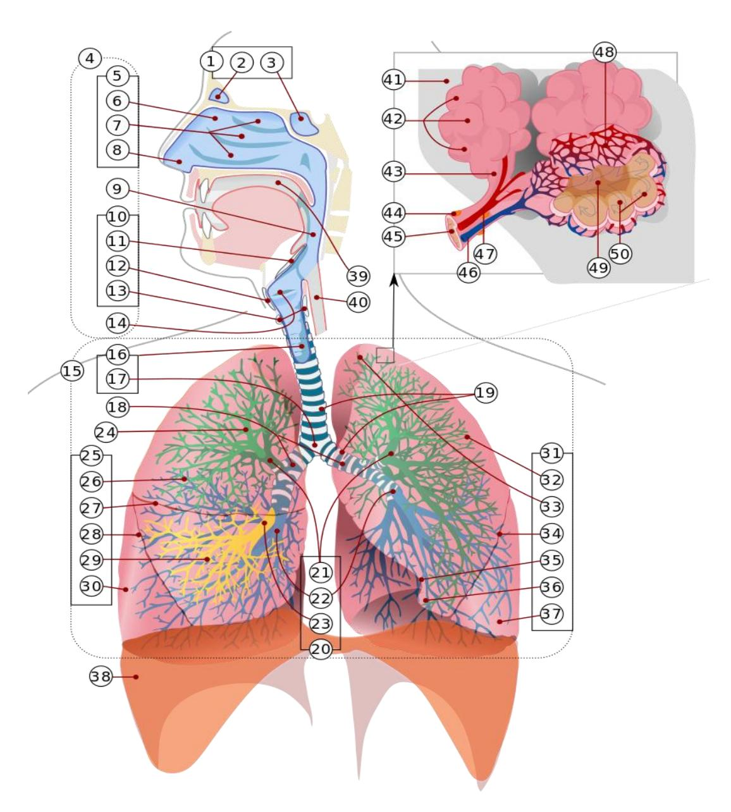

**Figure 19.12** The Human Respiratory System, Numbered.

**Table 19.1 Respiratory Anatomy Identifications**

| Number | Structure |
|--------|-----------|
| 1      |           |
| 2      |           |
| 3      |           |
| 4      |           |
| 5      |           |
| 6      |           |
| 7      |           |
| 8      |           |
| 9      |           |
| 10     |           |
| 11     |           |
| 12     |           |
| 13     |           |
| 14     |           |
| 15     |           |
| 16     |           |
| 17     |           |
| 18     |           |
| 19     |           |
| 20     |           |
| 21     |           |
| 22     |           |
| 23     |           |
| 24     |           |
| 25     |           |
| 26     |           |
| 27     |           |
| 28     |           |

**Table 19.1 Respiratory Anatomy Identifications continued**

| Number | Structure |
|--------|-----------|
| 29     |           |
| 30     |           |
| 31     |           |
| 32     |           |
| 33     |           |
| 34     |           |
| 35     |           |
| 36     |           |
| 37     |           |
| 38     |           |
| 39     |           |
| 40     |           |
| 41     |           |
| 42     |           |
| 43     |           |
| 44     |           |
| 45     |           |
| 46     |           |
| 47     |           |
| 48     |           |
| 49     |           |
| 50     |           |

## **Volumes of the Lung.**

Label this diagram.

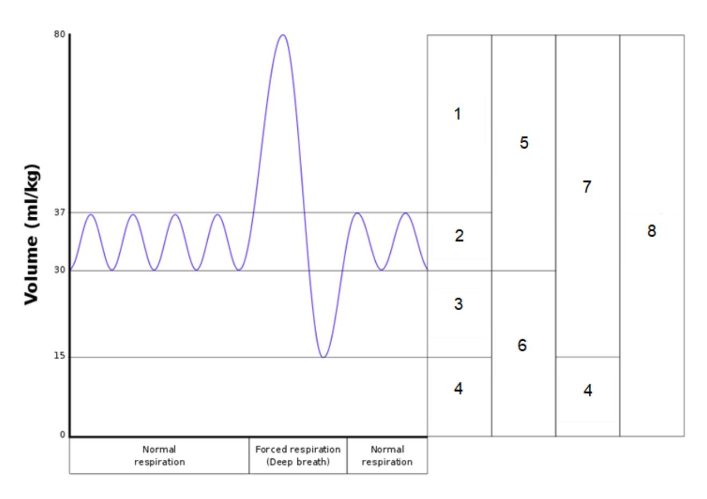

**Figure 19.13** Spiromete**r** Output; enumerated.

**Table 19.2 Respirometry Lung Volumes**

| Number | Lung volume |
|--------|-------------|
| 1      |             |
| 2      |             |
| 3      |             |
| 4      |             |
| 5      |             |
| 6      |             |
| 7      |             |
| 8      |             |

## **Post Lab Activity** 19.2

## **Identification**

## **The larynx and trachea**

Identify and label the structures that make up or are associated with the larynx and the trachea.

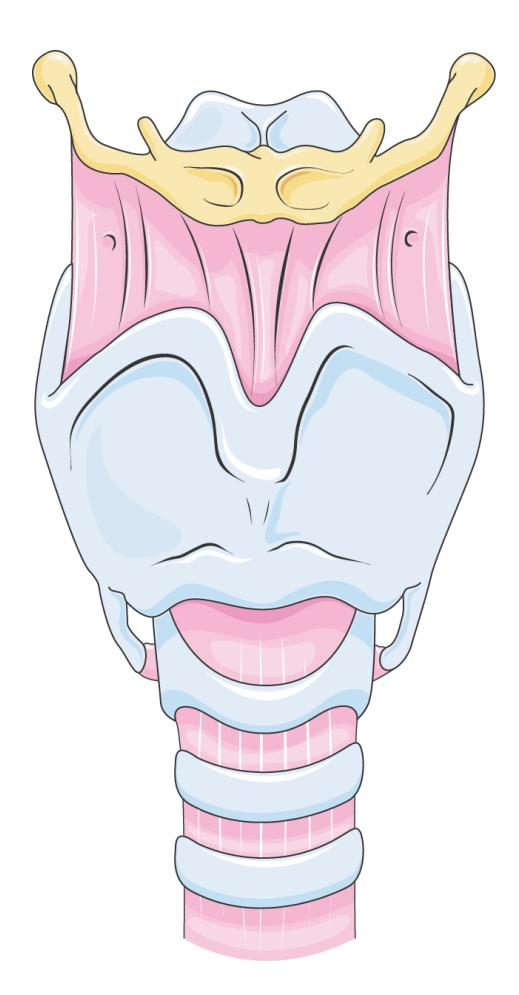

**Figure 19.14** The Larynx.

## **Post Lab Activity 19.3: Crosswords:**

Complete the following crossword puzzles.

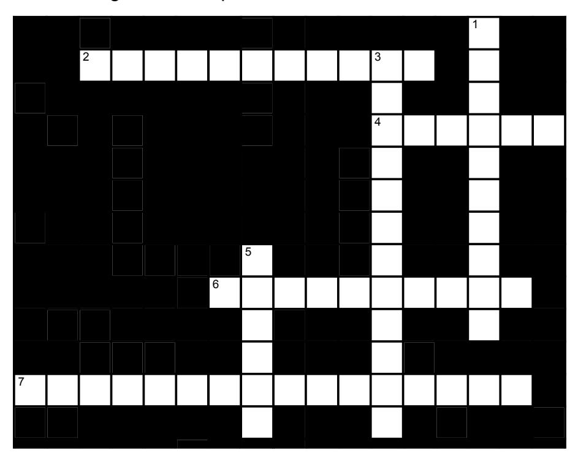

**Figure 19.15** Respiratory-1

### **Across**

-   2 The \_\_\_\_\_ is the region of the pharynx that only serves as an air passageway. (11)
-   4 The \_\_\_\_ divides the nasal cavity into the right and left sides. (6)
-   6 The nostrils are also known as the \_\_\_\_. (singular \_\_\_\_) (5,5)
-   7 The superior boundary of the larynx is the \_\_\_\_\_ \_\_\_\_\_, above which is the laryngopharynx. Inferior to the larynx is the \_\_\_\_\_. (5,4,7)

### **Down**

-   **1** Hair , mucus and cilia which line the nasal cavity prevent \_\_\_ and \_\_\_ from entering the lungs. (4,6)
-   **3** Air enters the nose and encounters the \_\_\_\_ \_\_\_\_\_, which creates turbulence thereby increasing the chances that airborne contaminants will contact the nasal mucosa rather than flowing directly into the lungs. (5,7)
-   **5** The casual phrase "voice box" refers to the \_\_\_\_. (6)

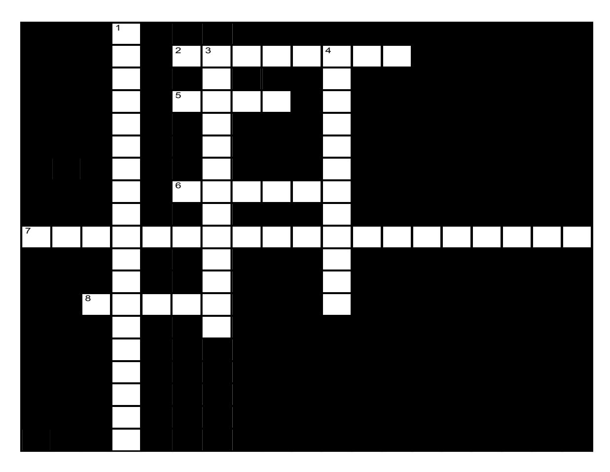

**Figure 19.16** Respiratory-2

### **Across**

-   **2** The top of the lung is \_\_\_\_\_; the bottom is the \_\_\_\_\_: (4,4)
-   **5** The \_\_\_\_\_ lung is divided into two lobes. (4)
-   **6** Serous Membranes which surround the lungs are called the \_\_\_\_\_. (6)
-   **7** \_\_\_\_\_ \_\_\_\_\_ is the process of gas exchange between the blood and the lungs. (8,11)
-   **8** The \_\_\_\_\_ lung is divided into three lobes. (5)

### **Down**

-   **1** \_\_\_\_\_ \_\_\_\_\_ is the process of gas exchange between the fluids of the body and the cells. (8,11)
-   **3** Each lung is surrounded by its own \_\_\_\_\_ \_\_\_\_\_. (7,6)
-   **4** \_\_\_\_\_, which are located at the end of each alveolar duct, are chambers connected to several alveoli. (8,4)

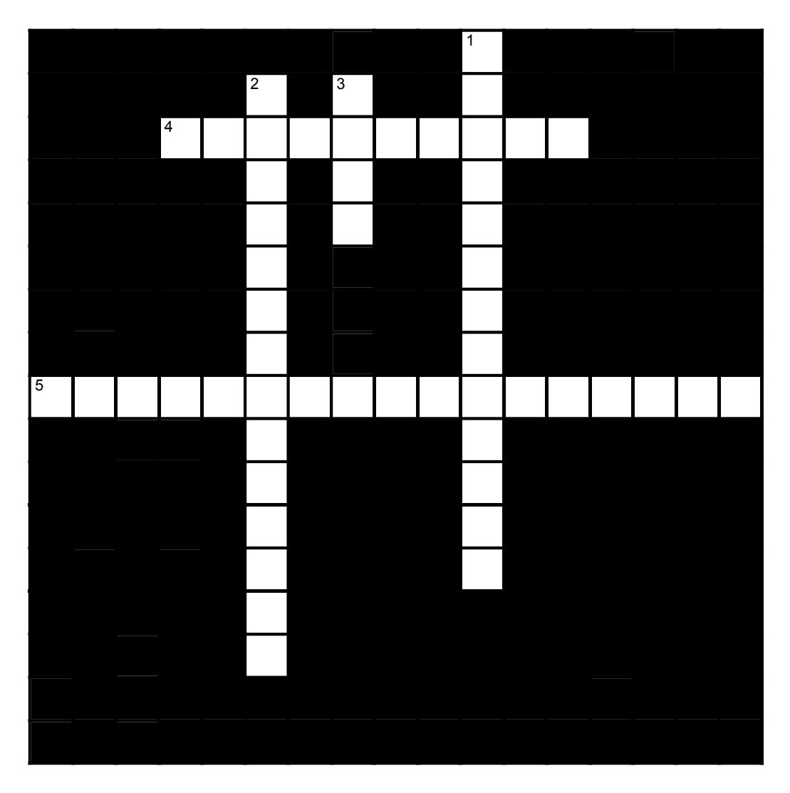

**Figure 19.17** Respiratory-3

### **Across**

-   **4** Pulmonary function tests evaluate respiratory function using a(n) \_\_\_\_\_ to measure respiratory volumes and capacities. (10)

-   **5** The \_\_\_\_ \_\_\_\_ \_\_\_\_ is the maximum amount of air that can fill the lungs. (5,4,8)

### **Down**

-   **1** The maximum amount of air that can be expelled after fully inhaling. (5,8)

-   **2** The \_\_\_\_ \_\_\_\_ is the amount of air inhaled during a normal, relaxed breath. In an average adult it is about \_\_\_\_\_ ml. (5,6,3)

-   **3** Each molecule of hemoglobin can carry (how many) molecules of oxygen. (4)

### **Keys to crossword puzzles**

#### **Respiratory-1**

• **Across: 2** Nasopharynx, **4** Septum, **6** Nares naris, **7** Hyoid bone trachea.

• **Down: 1** Dust debris, **3** Nasal conchae, **5** Larynx.

#### **Respiratory-2**

• **Across: 2** Apex base, **5** Left, **6** Pleura, **7** External respiration, **8** Right.

• **Down: 1** Internal respiration, **3** Pleural cavity, **4** Alveolar sacs.

#### **Respiratory-4**

• **Across: 4** Spirometer, **5** Total lung capacity.

• **Down: 1** Vital capacity, **2** Tidal volume 500, **3** Four.

**Chapter 19: Respiratory System Glossary**

| Terms | Definitions |
|------------------|------------------------------------------------------|
| acclimatization | process of adjustment that the respiratory system makes due to chronic exposure to high altitudes |
| acute mountain sickness (AMS) | condition that occurs a result of acute exposure to high altitude due to a low partial pressure of oxygen |
| ala (plural = alae) | small, flaring structure of a nostril that forms the lateral side of the nares |
| alar cartilage | cartilage that supports the apex of the nose and helps shape the nares; it is connected to the septal cartilage and connective tissue of the alae |
| alveolar dead space | air space within alveoli that are unable to participate in gas exchange |
| alveolar duct | small tube that leads from the terminal bronchiole to the respiratory bronchiole and is the point of attachment for alveoli |
| alveolar macrophage | immune system cell of the alveolus that removes debris and pathogens |
| alveolar pore | opening that allows airflow between neighboring alveoli |
| alveolar sac | cluster of alveoli |
| alveolus | small, grape-like sac that performs gas exchange in the lungs |
| anatomical dead space | air space present in the airway that never reaches the alveoli and therefore never participates in gas exchange |
| apex | tip of the external nose |
| Arytenoid cartilage |  |
| apneustic center | network of neurons within the pons that stimulate the neurons in the dorsal respiratory group; controls the depth of inspiration |
| atmospheric pressure | amount of force that is exerted by gases in the air surrounding any given surface |
| Bohr effect | relationship between blood pH and oxygen dissociation from hemoglobin |
| Boyle's law | relationship between volume and pressure as described by the formula: P1V1 = P2V2 |
| bridge | portion of the external nose that lies in the area of the nasal bones |
| bronchial bud | structure in the developing embryo that forms when the laryngotracheal bud extends and branches to form two bulbous structures |
| bronchial tree | collective name for the multiple branches of the bronchi and bronchioles of the respiratory system |
| bronchiole | branch of bronchi that are 1 mm or less in diameter and terminate at alveolar sacs |
| bronchoconstriction | decrease in the size of the bronchiole due to relaxation of the muscular wall |
| bronchodilation | increase in the size of the bronchiole due to contraction of the muscular wall |
| bronchus | tube connected to the trachea that branches into many subsidiaries and provides a passageway for air to enter and leave the lungs |
| carbaminohemoglobin | bound form of hemoglobin and carbon dioxide |
| carbonic anhydrase (CA) | enzyme that catalyzes the reaction that causes carbon dioxide and water to form carbonic acid |
| cardiac notch | indentation on the surface of the left lung that allows space for the heart |
| central chemoreceptor | one of the specialized receptors that are located in the brain that sense changes in hydrogen ion, oxygen, or carbon dioxide concentrations in the brain |
| chloride shift | facilitated diffusion that exchanges bicarbonate (HCO3 - ) with chloride (Cl - ) ions |
| conducting zone | region of the respiratory system that includes the organs and structures that provide passageways for air and are not directly involved in gas exchange |
| cricoid cartilage | portion of the larynx composed of a ring of cartilage with a wide posterior region and a thinner anterior region; attached to the esophagus |
| Dalton's law | statement of the principle that a specific gas type in a mixture exerts its own pressure, as if that specific gas type was not part of a mixture of gases |
| dorsal respiratory group (DRG) | region of the medulla oblongata that stimulates the contraction of the diaphragm and intercostal muscles to induce inspiration |
| dorsum nasi | intermediate portion of the external nose that connects the bridge to the apex and is supported by the nasal bone |
| epiglottis | leaf-shaped piece of elastic cartilage that is a portion of the larynx that swings to close the trachea during swallowing |
| esophagus |  |
| expiration (also, exhalation) | process that causes the air to leave the lungs |
| expiratory reserve volume (ERV) | amount of air that can be forcefully exhaled after a normal tidal exhalation |
| external nose | region of the nose that is easily visible to others |
| external respiration | gas exchange that occurs in the alveoli |
| fauces | portion of the posterior oral cavity that connects the oral cavity to the oropharynx |
| Frontal sinus | One of the four pairs of paranasal sinuses that are situated behind the brow ridges |
| fibroelastic membrane | specialized membrane that connects the ends of the C-shape cartilage in the trachea; contains smooth muscle fibers |
| forced breathing (also, hyperpnea) expiration | mode of breathing that occurs during exercise or by active thought that requires muscle contraction for both inspiration and expiration |
| foregut | endoderm of the embryo towards the head region |
| functional residual capacity (FRC) | sum of ERV and RV, which is the amount of air that remains in the lungs after a tidal expiration |
| glottis | opening between the vocal folds through which air passes when producing speech |
| Haldane effect | relationship between the partial pressure of oxygen and the affinity of hemoglobin for carbon dioxide |
| Henry's law | statement of the principle that the concentration of gas in a liquid is directly proportional to the solubility and partial pressure of that gas |
| Hard palate | The relatively hard, bony anterior portion of the palate. |
| hilum | concave structure on the mediastinal surface of the lungs where blood vessels, lymphatic vessels, nerves, and a bronchus enter the lung |
| Hyoid bone | A U-shaped bone at the base of the tongue that supports the tongue muscles. |
| hyperpnea | increased rate and depth of ventilation due to an increase in oxygen demand that does not significantly alter blood oxygen or carbon dioxide levels |
| hyperventilation | increased ventilation rate that leads to abnormally low blood carbon dioxide levels and high (alkaline) blood pH |
| inspiration (also, inhalation) | process that causes air to enter the lungs |
| inspiratory capacity (IC) | sum of the TV and IRV, which is the amount of air that can maximally be inhaled past a tidal expiration |
| inspiratory reserve volume (IRV) | amount of air that enters the lungs due to deep inhalation past the tidal volume |
| internal respiration | gas exchange that occurs at the level of body tissues |
| intra-alveolar pressure (intrapulmonary pressure) | pressure of the air within the alveoli |
| intrapleural pressure | pressure of the air within the pleural cavity |
| laryngeal prominence | region where the two laminae of the thyroid cartilage join, forming a protrusion known as 'Adam's apple' |
| laryngopharynx | portion of the pharynx bordered by the oropharynx superiorly and esophagus and trachea inferiorly; serves as a route for both air and food |
| larynx | The part of the respiratory tract between the pharynx and the trachea, having walls of cartilage and muscle and containing the vocal cords enveloped in folds of mucous membrane. |
| laryngotracheal bud | bud forms from the lung bud, has a tracheal end and bulbous bronchial buds at the distal end |
| larynx cartilaginous | structure that produces the voice, prevents food and beverages from entering the trachea, and regulates the volume of air that enters and leaves the lungs |
| lingual tonsil | lymphoid tissue located at the base of the tongue |
| lung | organ of the respiratory system that performs gas exchange |
| lung bud | median dome that forms from the endoderm of the foregut |
| Maxillary sinus | Largest of the four paranasal sinuses, and drains into the middle meatus of the nose |
| meatus | one of three recesses (superior, middle, and inferior) in the nasal cavity attached to the conchae that increase the surface area of the nasal cavity |
| naris (plural = nares) | opening of the nostrils |
| nasal bone | bone of the skull that lies under the root and bridge of the nose and is connected to the frontal and maxillary bones |
| Nasal cavity |  |
| nasal septum | wall composed of bone and cartilage that separates the left and right nasal cavities |
| nasopharynx | portion of the pharynx flanked by the conchae and oropharynx that serves as an airway |
| nostril | Large, air-filled space above and behind the nose in the middle of the face |
| olfactory pit | invaginated ectodermal tissue in the anterior portion of the head region of an embryo that will form the nasal cavity |
| oropharynx | portion of the pharynx flanked by the nasopharynx, oral cavity, and laryngopharynx that is a passageway for both air and food |
| oxygen-hemoglobin dissociation curve | graph that describes the relationship of partial pressure to the binding and disassociation of oxygen to and from heme |
| oxyhemoglobin (Hb- O2) | bound form of hemoglobin and oxygen |
| palatine tonsil | one of the paired structures composed of lymphoid tissue located anterior to the uvula at the roof of isthmus of the fauces |
| paranasal sinus | one of the cavities within the skull that is connected to the conchae that serve to warm and humidify incoming air, produce mucus, and lighten the weight of the skull; consists of frontal, maxillary, sphenoidal, and ethmoidal sinuses |
| parietal pleura | outermost layer of the pleura that connects to the thoracic wall, mediastinum, and diaphragm |
| partial pressure | force exerted by each gas in a mixture of gases |
| peripheral chemoreceptor | one of the specialized receptors located in the aortic arch and carotid arteries that sense changes in pH, carbon dioxide, or oxygen blood levels |
| pharyngeal tonsil | structure composed of lymphoid tissue located in the nasopharynx |
| pharynx | region of the conducting zone that forms a tube of skeletal muscle lined with respiratory epithelium; located between the nasal conchae and the esophagus and trachea |
| philtrum | concave surface of the face that connects the apex of the nose to the top lip |
| pleural cavity | space between the visceral and parietal pleurae |
| pleural fluid | substance that acts as a lubricant for the visceral and parietal layers of the pleura during the movement of breathing |
| pneumotaxic center | network of neurons within the pons that inhibit the activity of the neurons in the dorsal respiratory group; controls rate of breathing |
| pulmonary artery | artery that arises from the pulmonary trunk and carries deoxygenated, arterial blood to the alveoli |
| Pulmonary veins | the veins that transfer oxygenated blood from the lungs to the heart |
| pulmonary plexus | network of autonomic nervous system fibers found near the hilum of the lung |
| pulmonary surfactant | substance composed of phospholipids and proteins that reduces the surface tension of the alveoli; made by type II alveolar cells |
| pulmonary ventilation | exchange of gases between the lungs and the atmosphere; breathing |
| quiet breathing (also, eupnea) | mode of breathing that occurs at rest and does not require the cognitive thought of the individual |
| residual volume (RV) | amount of air that remains in the lungs after maximum exhalation |
| respiratory bronchiole | specific type of bronchiole that leads to alveolar sacs |
| respiratory cycle | one sequence of inspiration and expiration |
| respiratory epithelium | ciliated lining of much of the conducting zone that is specialized to remove debris and pathogens, and produce mucus |
| respiratory membrane | alveolar and capillary wall together, which form an air-blood barrier that facilitates the simple diffusion of gases |
| respiratory rate | total number of breaths taken each minute |
| respiratory volume | varying amounts of air within the lung at a given time |
| respiratory zone | includes structures of the respiratory system that are directly involved in gas exchange |
| root | region of the external nose between the eyebrows |
| thoracic wall compliance | ability of the thoracic wall to stretch while under pressure |
| thyroid cartilage | largest piece of cartilage that makes up the larynx and consists of two laminae. |
| Soft palate |  |
| Sphenoid sinus | a paired paranasal sinus occurring within the body of the sphenoid bone. |
| Thyroid cartilage | the soft tissue constituting the back of the roof of the mouth. |
| tidal volume (TV) | amount of air that normally enters the lungs during quiet breathing |
| tongue | The fleshy, movable, muscular organ, attached in most vertebrates to the floor of the mouth, which is the principal organ of taste, an aid in chewing and swallowing, and, in humans, an important organ of speech. |
| total dead space sum of the anatomical dead space and alveolar dead space | total dead space sum of the anatomical dead space and alveolar dead space |
| total lung capacity (TLC) | total amount of air that can be held in the lungs; sum of TV, ERV, IRV, and RV |
| total pressure | sum of all the partial pressures of a gaseous mixture |
| trachea | tube composed of cartilaginous rings and supporting tissue that connects the lung bronchi and the larynx; provides a route for air to enter and exit the lung |
| trachealis muscle | smooth muscle located in the fibroelastic membrane of the trachea |
| transpulmonary pressure | pressure difference between the intrapleural and intra-alveolar pressures |
| true vocal cord (vocal folds) | one of the pair of folded, white membranes that have a free inner edge that oscillates as air passes through to produce sound |
| type I alveolar cell | squamous epithelial cells that are the major cell type in the alveolar wall; highly permeable to gases |
| type II alveolar cell | cuboidal epithelial cells that are the minor cell type in the alveolar wall; secrete pulmonary surfactant |
| uvula | a conic projection from the back edge of the middle of the soft palate, composed of connective tissue containing a number of racemose glands, and some muscular fibers. |
| ventilation | movement of air into and out of the lungs; consists of inspiration and expiration |
| ventral respiratory group (VRG) | region of the medulla oblongata that stimulates the contraction of the accessory muscles involved in respiration to induce forced inspiration and expiration |
| vestibular fold | part of the folded region of the glottis composed of mucous membrane; supports the epiglottis during swallowing |
| visceral pleura | innermost layer of the pleura that is superficial to the lungs and extends into the lung fissures |
| vital capacity (VC) | sum of TV, ERV, and IRV, which is all the volumes that participate in gas exchange |
