# **Digestive System**

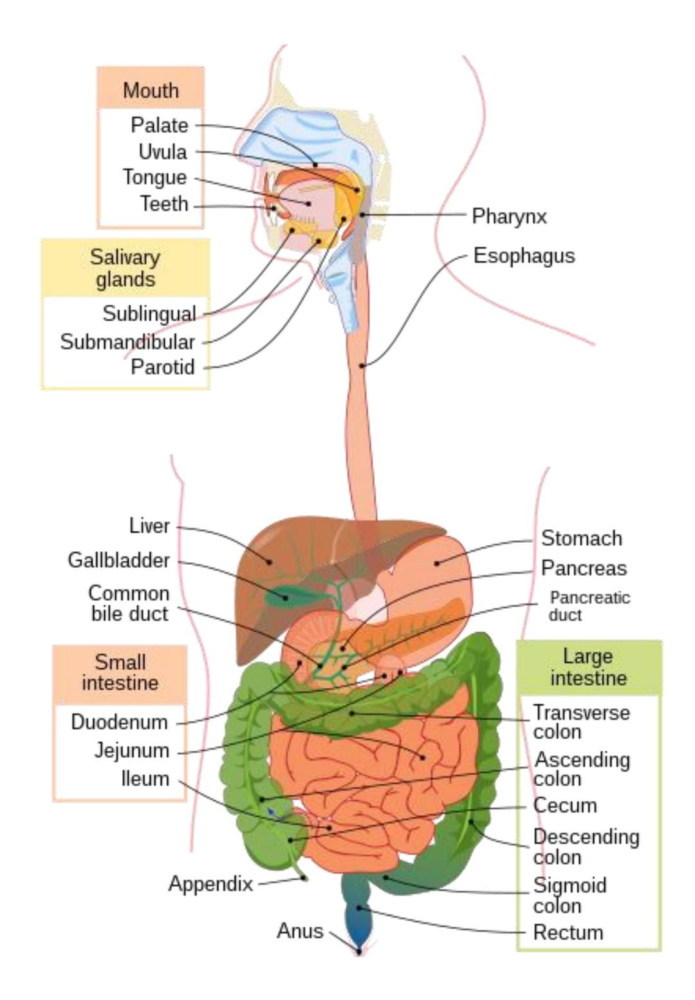

**Figure 20.1** The Digestive System.

## **Objectives**

In these laboratory exercises, you will be studying the structure of the organs of the digestive system via models, diagrams, and histology images.

By the end of this lab, you should:

-   Describe the overall function of the digestive system.
-   Describe the functions of the individual organs and structures of the digestive system.
-   Identify the individual organs of the alimentary canal on a model, in a picture or diagram or in a specimen, and describe the function of each.
-   Identify (on a model, in a picture or diagram, or in a microscope slide) and describe the histological structure of the alimentary canal, and the specific components (layers) that comprise it.
    -   Mucosa
    -   Submucosa
    -   Muscularis externa
    -   Serosa or adventitia
-   Identify the accessory organs of digestion on a model, in a picture or diagram, or in a specimen, and describe the function of each.
-   List and identify the histological specializations of the stomach and the small intestine and describe how these specializations contribute to the function of each organ.
-   Identify the histological structure of the stomach, small intestine, pancreas, and liver.
-   List select digestive enzymes involved in the digestion of proteins, fats, and carbohydrates, and identify their site of origin.

## **Digestive System Terms**

### **Alimentary Canal**

-   Mucosa
    -   Epithelium
    -   Lamina propria
    -   Muscularis mucosa
-   Submucosa
-   Muscularis externa
    -   Circular layer
    -   Longitudinal layer
-   Serosa/adventitia
-   Myenteric plexus
-   Villi
-   Lacteals
-   Capillary loops

## **Mouth and Esophagus**

-   Salivary glands
    -   Parotid gland
    -   Submandibular gland
    -   Sublingual gland
-   Oral cavity
-   Tongue
-   Hard palate
-   Soft palate
-   Uvula
-   Esophagus
-   Lower esophageal sphincter

## **Teeth**

-   Incisor (2/quad)
-   Canine (cuspid) (1/quad)
-   Premolar (bicuspid) (2/quad)
-   Molar (3/quad)
-   Enamel
-   Dentin
-   Pulp cavity
-   Crown
-   Root
-   Periodontal ligament
-   Gingiva

### **Stomach**

-   Cardia
-   Cardiac sphincter
-   Fundus
-   Body
-   Greater curvature
-   Lesser curvature
-   Pylorus
-   Rugae
-   Pyloric sphincter

### **Small Intestine**

-   Duodenum
-   Jejunum
-   Ileum
-   Circular folds
-   Villi
-   Duodenal papillae

## **Large Intestine**

-   Ileocecal valve
-   Ileocecal sphincter
-   Cecum
-   Appendix
-   Ascending colon
-   Transverse colon
-   Descending colon
-   Sigmoid colon
-   Rectum
-   Anus
-   Internal anal sphincter
-   External anal sphincter
-   Haustra
-   Taeniae coli

## **Other Structures**

-   Peritoneum
    -   Mesentery
    -   Greater omentum
-   Pancreas
    -   Main pancreatic duct
-   Gall bladder
    -   Cystic duct
-   Liver
    -   L./R. hepatic ducts
    -   Common hepatic duct
    -   Common bile duct
    -   Hepatopancreatic ampulla

## **Prelab Activities**

### **Prelab Activity 20.1**

For this exercise you need to define the following terms using your textbook or another reliable academic resource.

### **Definitions**

-   Alimentary Canal \_\_\_\_\_\_\_\_\_\_\_\_\_\_\_\_\_\_\_\_\_\_\_\_\_\_\_\_\_\_\_\_\_\_\_\_\_\_\_\_\_\_
-   Muscularis mucosa \_\_\_\_\_\_\_\_\_\_\_\_\_\_\_\_\_\_\_\_\_\_\_\_\_\_\_\_\_\_\_\_\_\_\_\_\_\_\_\_\_\_\_\_\_\_
-   Submucosa \_\_\_\_\_\_\_\_\_\_\_\_\_\_\_\_\_\_\_\_\_\_\_\_\_\_\_\_\_\_\_\_\_\_\_\_\_\_\_\_\_\_\_\_\_\_\_\_\_\_\_\_
-   Muscularis externa \_\_\_\_\_\_\_\_\_\_\_\_\_\_\_\_\_\_\_\_\_\_\_\_\_\_\_\_\_\_\_\_\_\_\_\_\_\_\_\_\_\_\_\_\_\_
-   Serosa/adventitia \_\_\_\_\_\_\_\_\_\_\_\_\_\_\_\_\_\_\_\_\_\_\_\_\_\_\_\_\_\_\_\_\_\_\_\_\_\_\_\_\_\_\_\_\_\_\_
-   Enteric plexus \_\_\_\_\_\_\_\_\_\_\_\_\_\_\_\_\_\_\_\_\_\_\_\_\_\_\_\_\_\_\_\_\_\_\_\_\_\_\_\_\_\_\_\_\_\_\_\_\_\_
-   Salivary glands \_\_\_\_\_\_\_\_\_\_\_\_\_\_\_\_\_\_\_\_\_\_\_\_\_\_\_\_\_\_\_\_\_\_\_\_\_\_\_\_\_\_\_\_\_\_\_\_\_
    -   Parotid gland \_\_\_\_\_\_\_\_\_\_\_\_\_\_\_\_\_\_\_\_\_\_\_\_\_\_\_\_\_\_\_\_\_\_\_\_\_\_\_\_\_\_\_\_\_
    -   Submandibular gland \_\_\_\_\_\_\_\_\_\_\_\_\_\_\_\_\_\_\_\_\_\_\_\_\_\_\_\_\_\_\_\_\_\_\_\_\_\_\_
    -   Sublingual gland \_\_\_\_\_\_\_\_\_\_\_\_\_\_\_\_\_\_\_\_\_\_\_\_\_\_\_\_\_\_\_\_\_\_\_\_\_\_\_\_\_\_
-   Esophagus \_\_\_\_\_\_\_\_\_\_\_\_\_\_\_\_\_\_\_\_\_\_\_\_\_\_\_\_\_\_\_\_\_\_\_\_\_\_\_\_\_\_\_\_\_\_\_\_\_\_\_\_
-   Lower esophageal sphincter \_\_\_\_\_\_\_\_\_\_\_\_\_\_\_\_\_\_\_\_\_\_\_\_\_\_\_\_\_\_\_\_\_\_\_\_\_\_\_
-   Stomach \_\_\_\_\_\_\_\_\_\_\_\_\_\_\_\_\_\_\_\_\_\_\_\_\_\_\_\_\_\_\_\_\_\_\_\_\_\_\_\_\_\_\_\_\_\_\_\_\_\_\_\_\_\_
    -   Cardia \_\_\_\_\_\_\_\_\_\_\_\_\_\_\_\_\_\_\_\_\_\_\_\_\_\_\_\_\_\_\_\_\_\_\_\_\_\_\_\_\_\_\_\_\_\_\_\_\_\_
    -   Cardiac sphincter \_\_\_\_\_\_\_\_\_\_\_\_\_\_\_\_\_\_\_\_\_\_\_\_\_\_\_\_\_\_\_\_\_\_\_\_\_\_\_\_\_\_
    -   Fundus \_\_\_\_\_\_\_\_\_\_\_\_\_\_\_\_\_\_\_\_\_\_\_\_\_\_\_\_\_\_\_\_\_\_\_\_\_\_\_\_\_\_\_\_\_\_\_\_\_\_
    -   Body \_\_\_\_\_\_\_\_\_\_\_\_\_\_\_\_\_\_\_\_\_\_\_\_\_\_\_\_\_\_\_\_\_\_\_\_\_\_\_\_\_\_\_\_\_\_\_\_\_\_\_\_
    -   Pylorus \_\_\_\_\_\_\_\_\_\_\_\_\_\_\_\_\_\_\_\_\_\_\_\_\_\_\_\_\_\_\_\_\_\_\_\_\_\_\_\_\_\_\_\_\_\_\_\_\_\_
    -   Pyloric sphincter \_\_\_\_\_\_\_\_\_\_\_\_\_\_\_\_\_\_\_\_\_\_\_\_\_\_\_\_\_\_\_\_\_\_\_\_\_\_\_\_\_\_
-   Small Intestine \_\_\_\_\_\_\_\_\_\_\_\_\_\_\_\_\_\_\_\_\_\_\_\_\_\_\_\_\_\_\_\_\_\_\_\_\_\_\_\_\_\_\_\_\_\_\_\_\_
    -   Duodenum \_\_\_\_\_\_\_\_\_\_\_\_\_\_\_\_\_\_\_\_\_\_\_\_\_\_\_\_\_\_\_\_\_\_\_\_\_\_\_\_\_\_\_\_\_\_\_
    -   Jejunum \_\_\_\_\_\_\_\_\_\_\_\_\_\_\_\_\_\_\_\_\_\_\_\_\_\_\_\_\_\_\_\_\_\_\_\_\_\_\_\_\_\_\_\_\_\_\_\_\_
    -   Ileum \_\_\_\_\_\_\_\_\_\_\_\_\_\_\_\_\_\_\_\_\_\_\_\_\_\_\_\_\_\_\_\_\_\_\_\_\_\_\_\_\_\_\_\_\_\_\_\_\_\_\_
-   Large Intestine \_\_\_\_\_\_\_\_\_\_\_\_\_\_\_\_\_\_\_\_\_\_\_\_\_\_\_\_\_\_\_\_\_\_\_\_\_\_\_\_\_\_\_\_
    -   Cecum \_\_\_\_\_\_\_\_\_\_\_\_\_\_\_\_\_\_\_\_\_\_\_\_\_\_\_\_\_\_\_\_\_\_\_\_\_\_\_\_\_\_\_\_\_\_\_\_\_\_
    -   Appendix \_\_\_\_\_\_\_\_\_\_\_\_\_\_\_\_\_\_\_\_\_\_\_\_\_\_\_\_\_\_\_\_\_\_\_\_\_\_\_\_\_\_\_\_\_\_\_\_
    -   Ileocecal sphincter \_\_\_\_\_\_\_\_\_\_\_\_\_\_\_\_\_\_\_\_\_\_\_\_\_\_\_\_\_\_\_\_\_\_\_\_\_\_\_\_\_
    -   Ascending colon \_\_\_\_\_\_\_\_\_\_\_\_\_\_\_\_\_\_\_\_\_\_\_\_\_\_\_\_\_\_\_\_\_\_\_\_\_\_\_\_\_\_
    -   Transverse colon \_\_\_\_\_\_\_\_\_\_\_\_\_\_\_\_\_\_\_\_\_\_\_\_\_\_\_\_\_\_\_\_\_\_\_\_\_\_\_\_\_\_
    -   Descending colon \_\_\_\_\_\_\_\_\_\_\_\_\_\_\_\_\_\_\_\_\_\_\_\_\_\_\_\_\_\_\_\_\_\_\_\_\_\_\_\_\_
    -   Sigmoid colon \_\_\_\_\_\_\_\_\_\_\_\_\_\_\_\_\_\_\_\_\_\_\_\_\_\_\_\_\_\_\_\_\_\_\_\_\_\_\_\_\_\_\_\_
    -   Rectum \_\_\_\_\_\_\_\_\_\_\_\_\_\_\_\_\_\_\_\_\_\_\_\_\_\_\_\_\_\_\_\_\_\_\_\_\_\_\_\_\_\_\_\_\_\_\_\_\_
    -   Anus \_\_\_\_\_\_\_\_\_\_\_\_\_\_\_\_\_\_\_\_\_\_\_\_\_\_\_\_\_\_\_\_\_\_\_\_\_\_\_\_\_\_\_\_\_\_\_\_\_\_\_\_
    -   Internal anal sphincter \_\_\_\_\_\_\_\_\_\_\_\_\_\_\_\_\_\_\_\_\_\_\_\_\_\_\_\_\_\_\_\_\_\_\_\_\_\_
    -   External anal sphincter \_\_\_\_\_\_\_\_\_\_\_\_\_\_\_\_\_\_\_\_\_\_\_\_\_\_\_\_\_\_\_\_\_\_\_\_\_

## **Other Structures**

-   Mesentery \_\_\_\_\_\_\_\_\_\_\_\_\_\_\_\_\_\_\_\_\_\_\_\_\_\_\_\_\_\_\_\_\_\_\_\_\_\_\_\_\_\_\_\_\_\_\_\_\_\_\_\_\_
-   Greater omentum \_\_\_\_\_\_\_\_\_\_\_\_\_\_\_\_\_\_\_\_\_\_\_\_\_\_\_\_\_\_\_\_\_\_\_\_\_\_\_\_\_\_\_\_\_\_\_
-   Pancreas \_\_\_\_\_\_\_\_\_\_\_\_\_\_\_\_\_\_\_\_\_\_\_\_\_\_\_\_\_\_\_\_\_\_\_\_\_\_\_\_\_\_\_\_\_\_\_\_\_\_\_\_\_
-   Liver \_\_\_\_\_\_\_\_\_\_\_\_\_\_\_\_\_\_\_\_\_\_\_\_\_\_\_\_\_\_\_\_\_\_\_\_\_\_\_\_\_\_\_\_\_\_\_\_\_\_\_\_\_\_\_\_\_
-   Gall bladder \_\_\_\_\_\_\_\_\_\_\_\_\_\_\_\_\_\_\_\_\_\_\_\_\_\_\_\_\_\_\_\_\_\_\_\_\_\_\_\_\_\_\_\_\_\_\_\_\_\_\_

## **Prelab Activity 20.2**

Identify and label the four major layers of the alimentary canal.

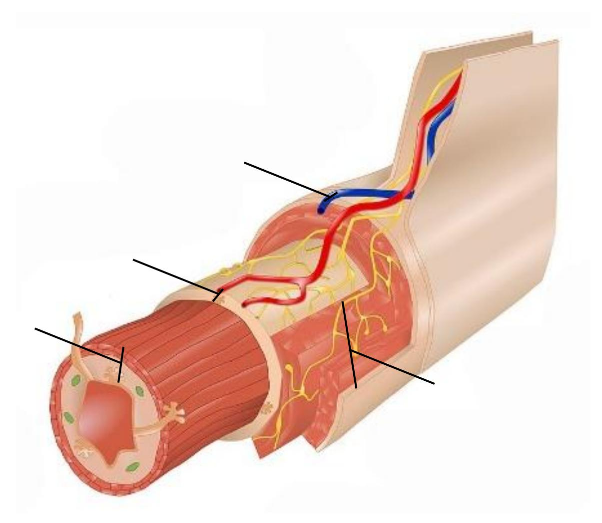

**Figure 20.2** Layers of the Digestive Tract.

## **Prelab Activity 20.3**

Identify and label the anatomical features of the mouth, pharynx, and larynx.

Complete Table 20.1 with the name of the structure, region, feature, or organ that corresponds to each label on the diagram below.

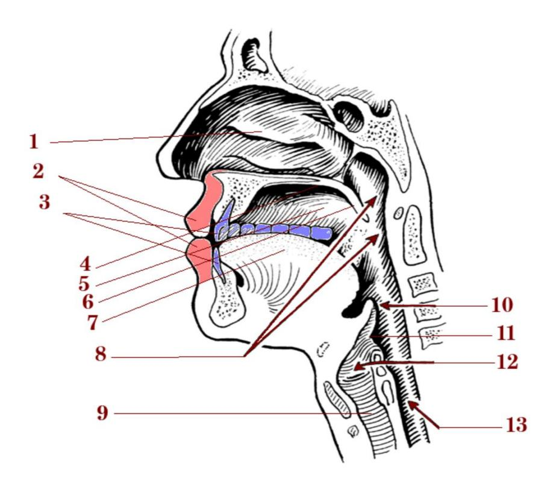

**Figure 20.3** Human Vocal Organs in the Oral/Nasal Cavities and Trachea.

**Table 20.1 Features of the Digestive System (Midsagittal Head)**

|     |     |
|-----|-----|
| 1   | 8   |
| 2   | 9   |
| 3   | 10  |
| 4   | 11  |
| 5   | 12  |
| 6   | 13  |
| 7   |     |

## **Prelab Activity 20.4**

Identify the components of the alimentary canal.

Fill in Table 20.2 with the name of the structure, region, or organ that corresponds to each label on the diagram below of the digestive tract.

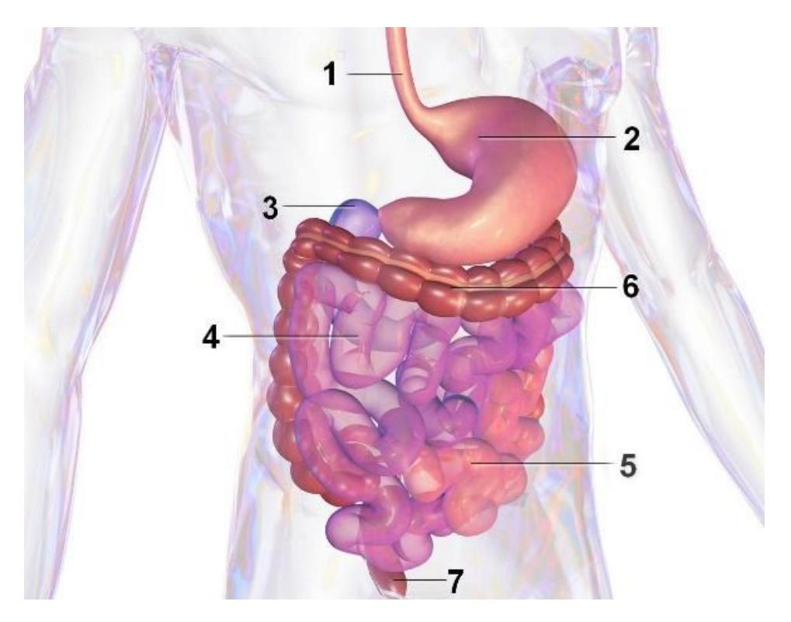

**Figure 20.4** The Digestive Tract.

**Table 20.2 Organs within the Digestive Tract**

|     |     |
|-----|-----|
| 1\. | 2\. |
| 3\. | 4\. |
| 5\. | 6\. |
| 7\. |     |

## **Prelab Activity 20.5**

Identifying anatomical structures of the stomach.

Fill in the table below with the name of the digestive system structure, region, feature, or organ that corresponds to each label on the model.

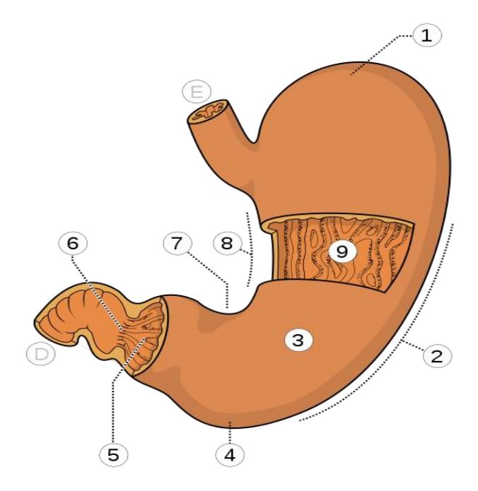

## **Anatomy of the Stomach**

**Table 20.3 Identification of the Anatomy of the Stomach**

| Structure Label | Name |
|-----------------|------|
| 1               |      |
| 2               |      |
| 3               |      |
| 4               |      |
| 5               |      |
| 6               |      |
| 7               |      |
| 8               |      |
| 9               |      |
| D               |      |
| E               |      |

## **Prelab Activity 20.6**

Identifying anatomical features of the gastrointestinal tract.

Fill in the table below with the name of the digestive system structure, region, feature, or organ that corresponds to each label on the model at the left.

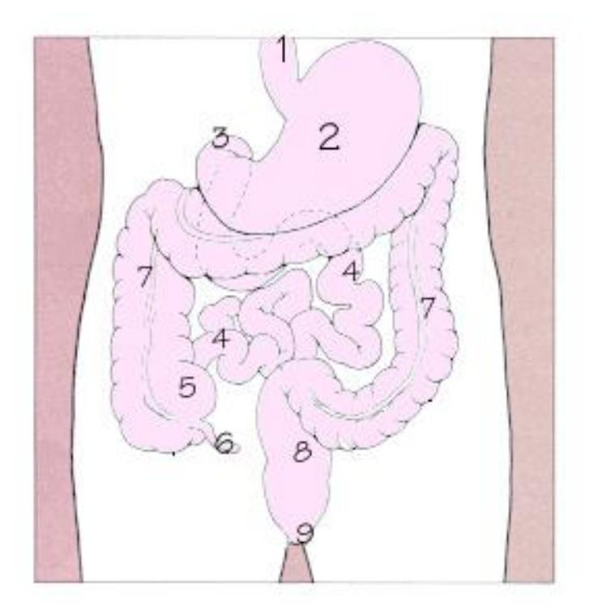

**Figure 20.6** Alimentary Canal.

**Table 20.4 Identification of the Components of the Digestive Tract**

| Letter | Name |
|--------|------|
| 1      |      |
| 2      |      |
| 3      |      |
| 4      |      |
| 5      |      |
| 6      |      |
| 7      |      |
| 8      |      |
| 9      |      |

## **Prelab Activity 20.7**

Functions of the organs of the gastrointestinal tract (alimentary canal). Fill in the table with their functions in the alimentary canal / digestive system organs.

**Table 20.5 Functions of Select Organs in the Digestive Tract**

| Structure       | Function |
|-----------------|----------|
| Mouth           |          |
| Esophagus       |          |
| Stomach         |          |
| Small Intestine |          |
| Large Intestine |          |
| Liver           |          |
| Gall Bladder    |          |

## **Prelab Activity 20.8**:

Identify the following components of the digestive system.

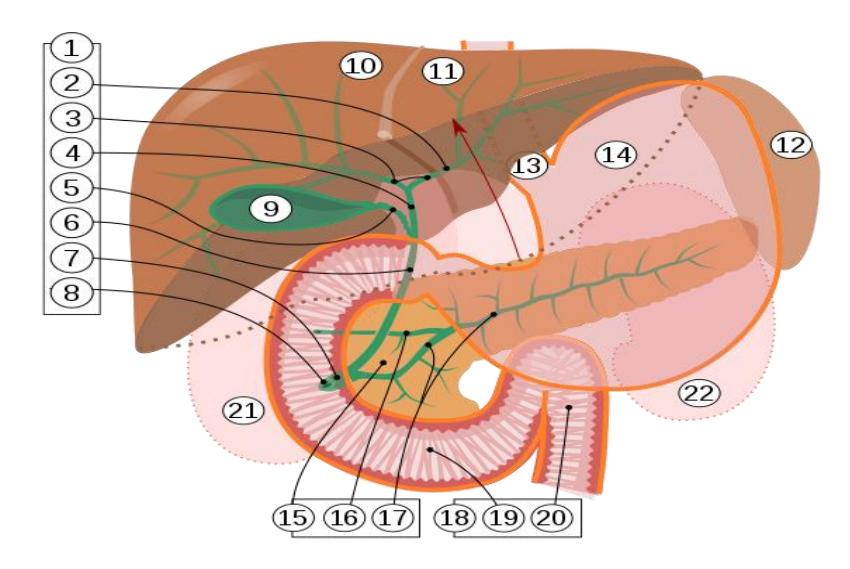

**Figure 20.7** Biliary System.

**Table 20.6 Structures within the Biliary System**

| Structure Number | Structure Name |
|------------------|----------------|
| 3                |                |
| 4                |                |
| 5                |                |
| 6                |                |
| 9                |                |
| 10               |                |
| 12               |                |
| 14               |                |
| 15               |                |
| 18               |                |
| 19               |                |
| 20               |                |

### **Prelab Activity 20.9**.

Identify and label the structures of the large intestine.

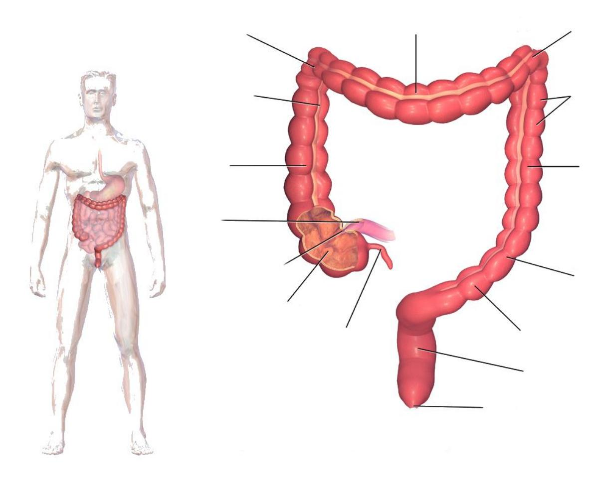

**Figure 20.8** The Large Intestine.

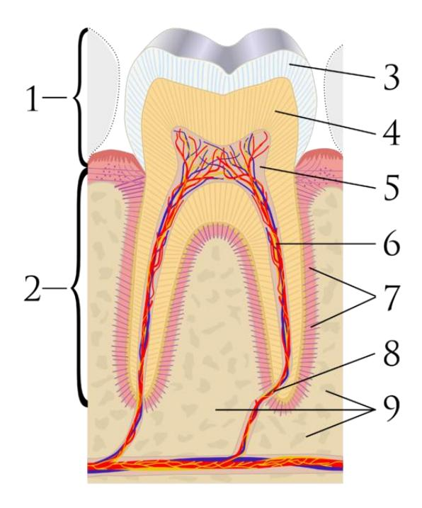

**Figure 20.9** Cross Section of a Tooth.

## **Prelab Activity 20.10**

Identify the structures of the tooth in the diagram above.

**Table 20.7 Structures of the tooth**

| Structure Number | Structure Name |
|------------------|----------------|
| 1                |                |
| 2                |                |
| 3                |                |
| 4                |                |
| 5                |                |
| 6                |                |
| 7                |                |
| 8                |                |
| 9                |                |

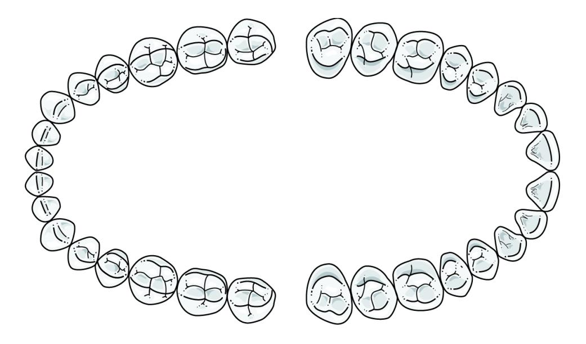

**Figure 20.10** Adult Teeth.

### **Prelab Activity 20.11**.

Identify and label the teeth found in the adult mouth. Circle and identify the different sets of teeth.

## **Lab Activities**

## **Organs and systems**

## **Alimentary Canal Terms**

-   Mucosa
    -   Epithelium
    -   Lamina propria
    -   Muscularis mucosa
-   Submucosa
-   Muscularis externa
    -   Circular layer
    -   Longitudinal layer
-   Serosa/adventitia
-   Enteric plexus
-   Villi
-   Lacteals
-   Capillary loops

## **Lab Activity 20.1**

-   Gather into your assigned study groups and obtain the 3D microanatomy digestive system and intestinal villi models from the storage area in the laboratory.
-   Identify and label structures on the model from the list above. You may have to use your text to assist with these identifications.
-   Take pictures of your finished work for your review later. Also palpate the models to enable you to learn the layers and their names more quickly.

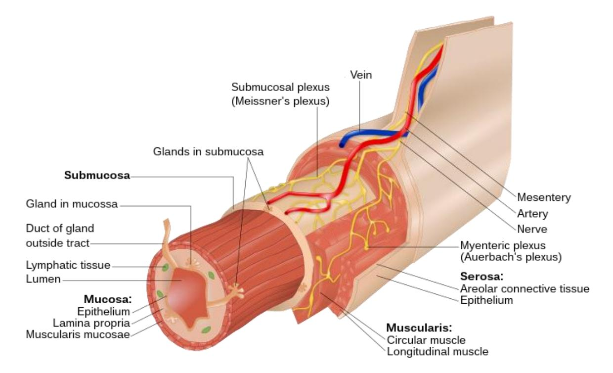

**Figure 20.12** Layers of the Gastrointestinal Tract.

## **Mouth and Esophagus Terms**

-   Oral cavity

-   Tongue

-   Hard palate

-   Soft palate

-   Uvula

-   Esophagus

-   Lower esophageal sphincter

-   Salivary glands

    -   Parotid gland
    -   Submandibular gland
    -   Sublingual gland

## **Lab Activity 20.2**

-   Obtain a 3D medial head section, a human head as well as a human digestive model from the storage area in the laboratory.
-   Identify and label structures on the model from the list above. You may have to use your text to assist with these identifications.
-   Locate and label the structures listed above on the models.

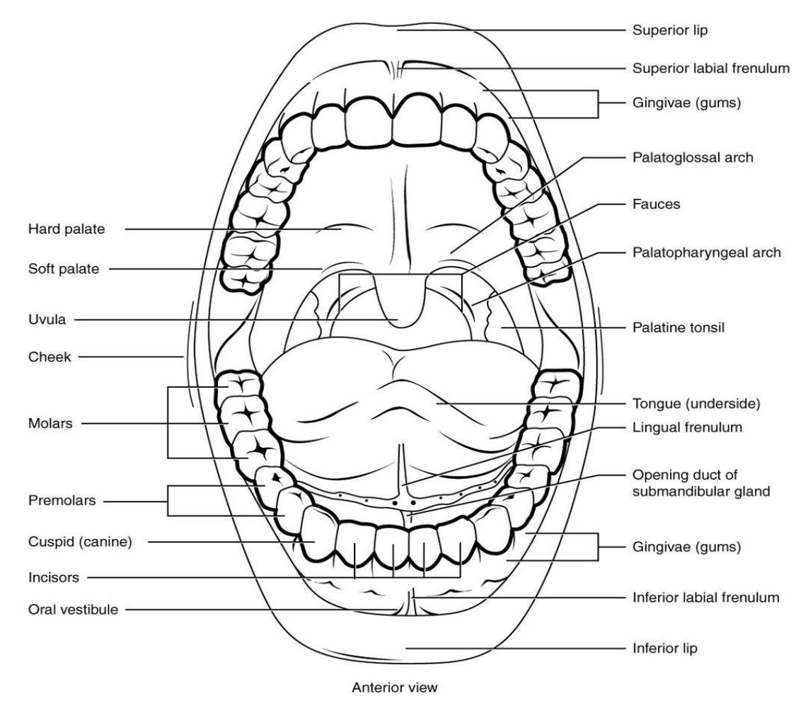

**Figure 20.13** The Structures of the Mouth.

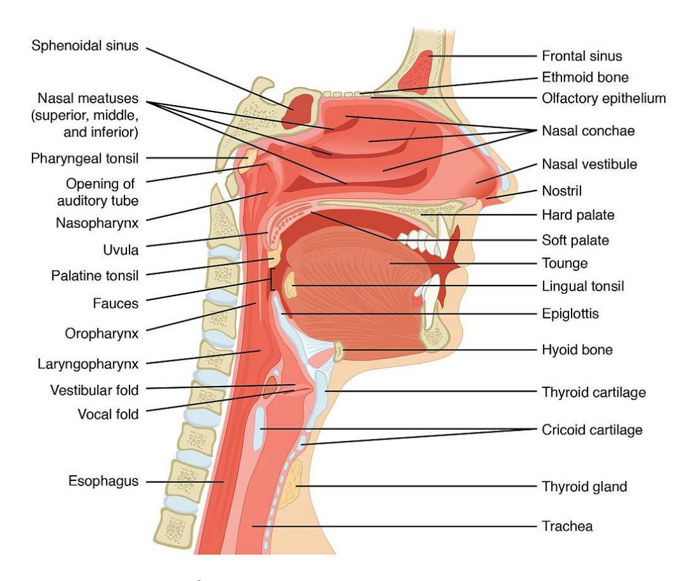

**Figure 20.14** Anatomy of the Mouth and Esophagus.

### **The Salivary Glands**

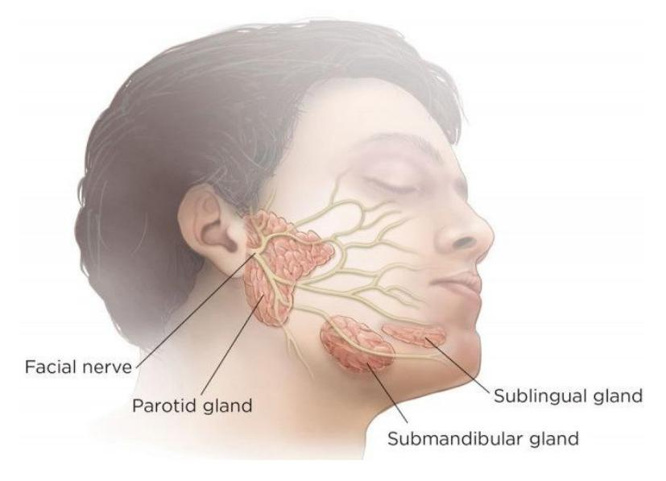

**Figure 20.15** The Salivary Glands.

## **Lab Activity 20.3**

-   Form into your assigned study groups and obtain a 3D model of the teeth from the storage area in the laboratory.
-   Identify and label the types of teeth on the model from the list below. You should be able to identify each tooth type from an individual specimen in the upcoming practical.
-   Locate and label the structures of an individual tooth as noted in figure 20.17. Be able to identify the structures based on either a 3D model or a diagram.

## **Tooth Types**

-   Incisor (2/quad)

-   Canine (cuspid) (1/quad)

-   Premolar (bicuspid) (2/quad)

-   Molar (3/quad)

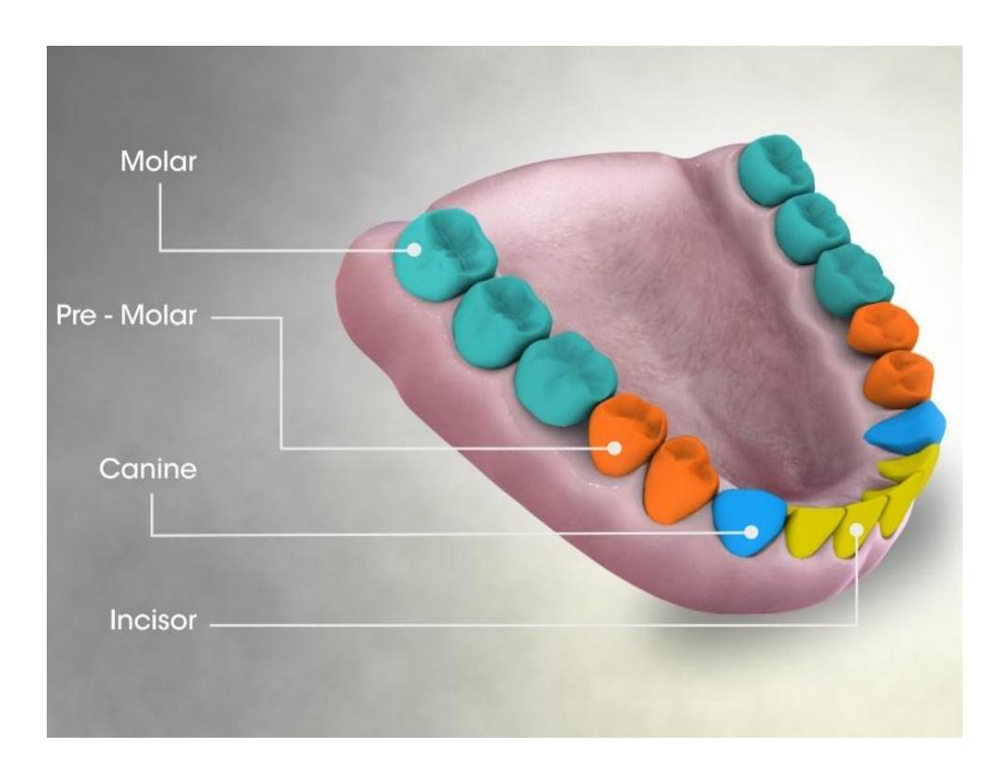

**Figure 20.16** Types, or Sets, of Teeth.

## **Tooth Anatomy**

-   Enamel

-   Dentin

-   Pulp cavity

-   Crown

-   Root

-   Periodontal ligament

-   Gingiva

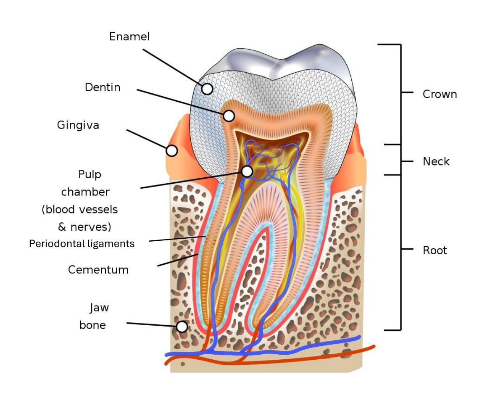

**Figure 20.17** Diagram of a Molar

## **Digestive Organs**

## **Lab Activity 20.4**

-   Obtain a human digestive model and a from the storage area in the laboratory.
-   Identify and label structures on the stomach on the model using the list below. You may have to use your text to assist with these identifications.
-   Locate and label the structures listed below on the model.

### **Stomach Structures**

-   Cardia

-   Cardiac sphincter

-   Fundus

-   Body

-   Greater curvature

-   Lesser curvature

-   Pylorus

-   Rugae

-   Pyloric sphincter

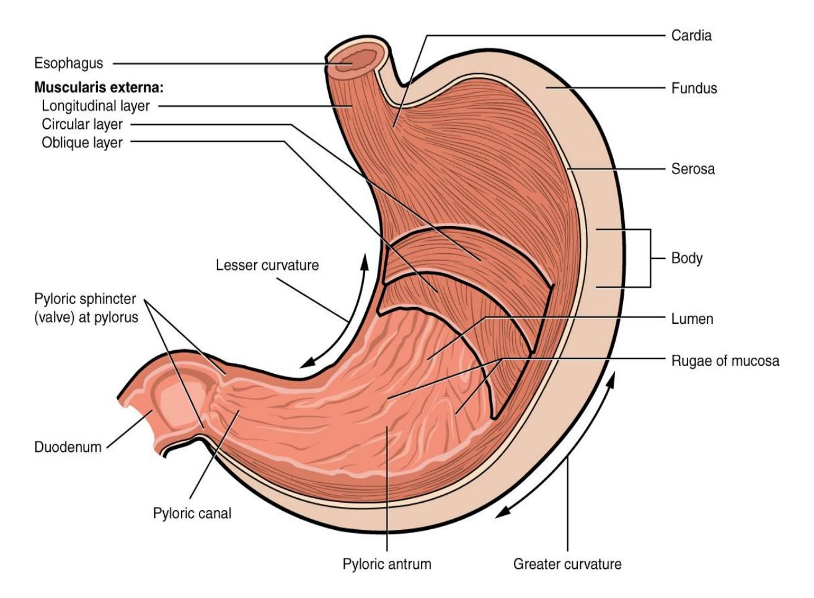

**20.18** Anatomy of the Stomach.

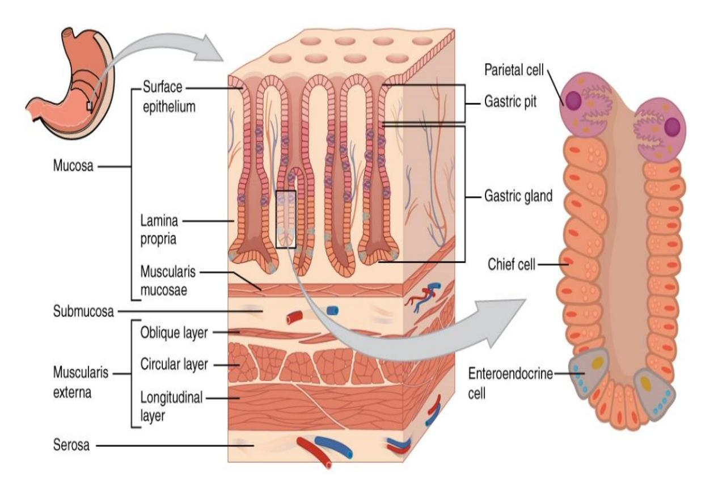

Figure 20.19 The Layers of the Stomach.

## **Small Intestine Anatomy**

### **Terms**

-   Duodenum

-   Jejunum

-   Ileum

-   Circular folds

-   Villi

-   Duodenal papillae

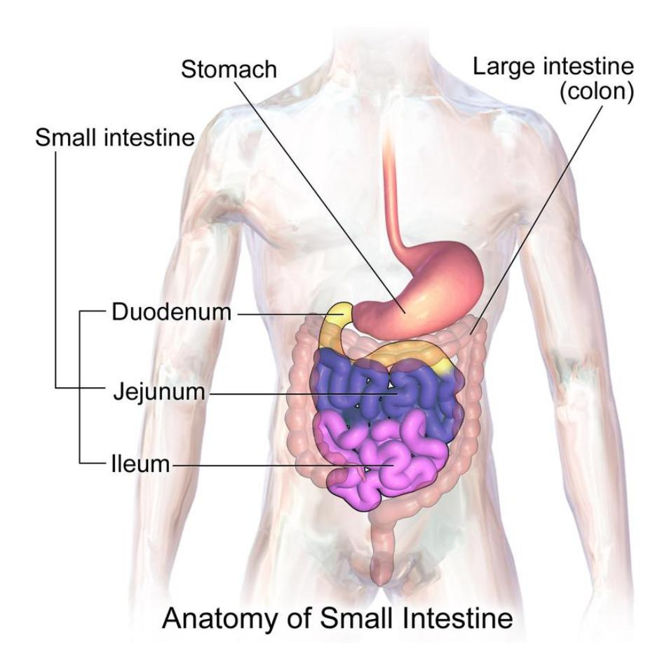

**Figure 20.20** The Small Intestine Anatomy

## **Lab Activity 20.5**

Obtain a model of the digestive system and the intestinal villi from the storage area.

-   Using the human digestive model and the intestinal villi models, identify and label the sections of the small intestine and structures of a villus on the model(s) using the list below. You may have to use your text along with figures 20.20 to 20.21 to assist with these identifications.
-   Locate and label the structures listed below on the model.

Photograph your work for later reference.

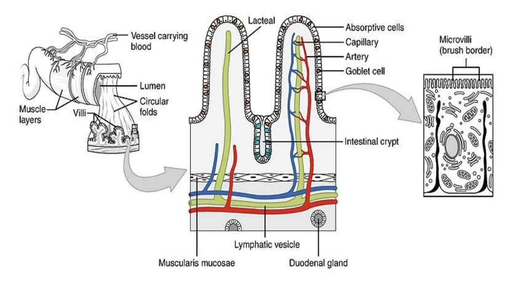

**Figure 20.21** The Small Intestine Villi Histology.

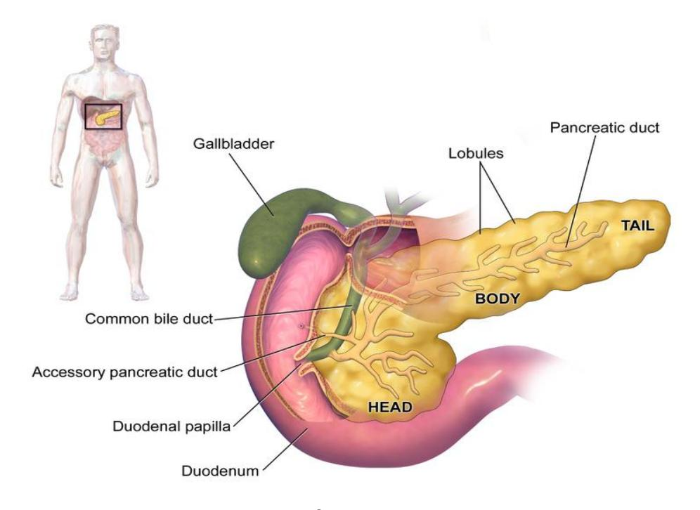

**Figure 20.22** The Duodenal Papilla of the Pancreas.

### **Large Intestine:**

## **Large Intestine Anatomy**

### **Terms**

-   Cecum
-   Appendix
-   Ileocecal valve
-   Ileocecal sphincter
-   Ascending colon
-   Transverse colon
-   Descending colon
-   Sigmoid colon
-   Rectum
-   Anus
-   Internal anal sphincter
-   External anal sphincter
-   Haustra
-   Taeniae coli

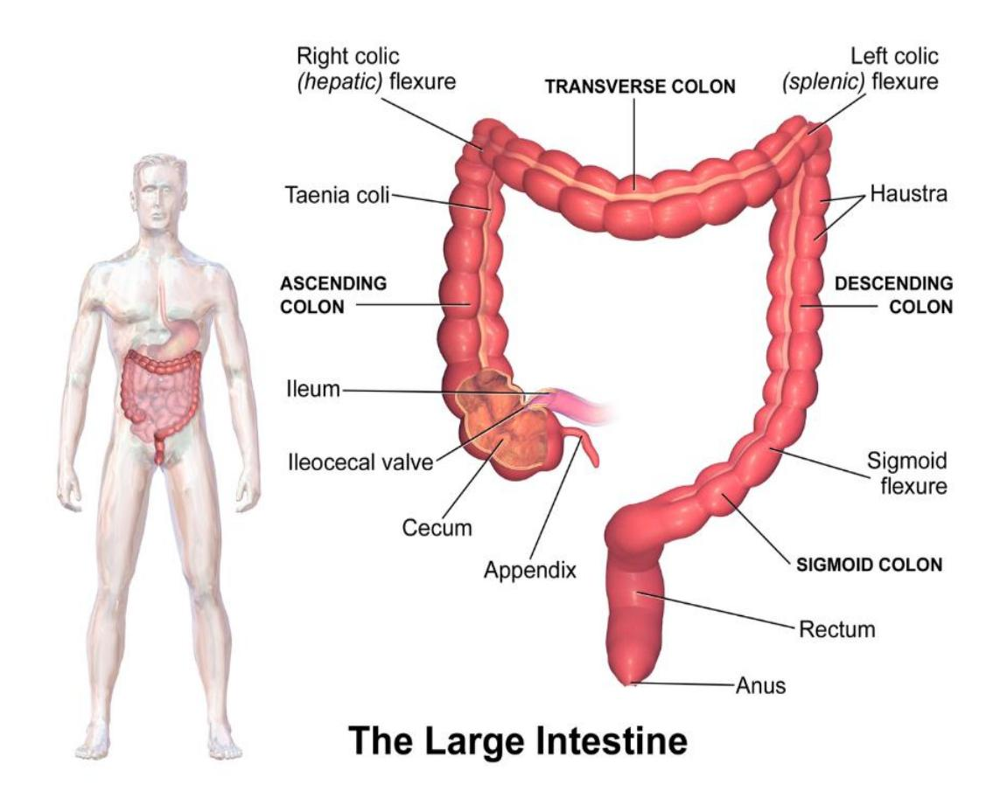

**Figure 20.23** The large Intestine.

### **Lab Activity 20.6**

Using the human digestive model, identify and label the sections of the small intestine and structures of a villus on the model(s) using the list below. You may have to use your text along with figures 20.23 and 20.24 to assist with these identifications.

-   Locate and label the structures listed below on the model.
-   Photograph your work for later reference.

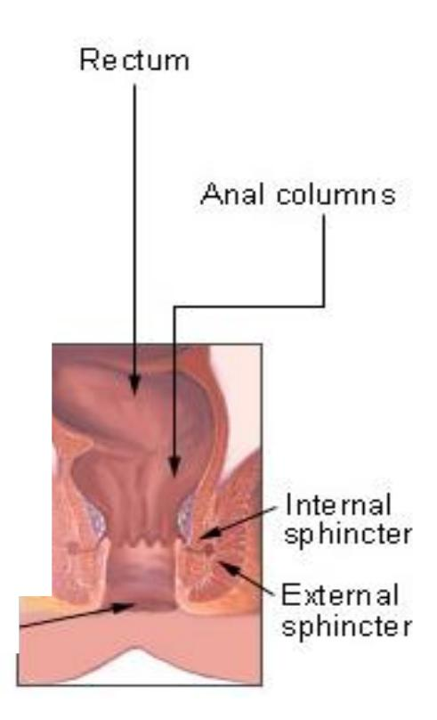

**Figure 20.24** Large Intestine Internal and External Sphincters.

## **Accessory Organs:**

### **Terms**

-   Liver
    -   L./R. hepatic ducts
    -   Common hepatic duct
    -   Common bile duct
    -   Hepatopancreatic ampulla (Duodenal papilla)
-   Gall bladder
    -   Cystic duct
-   Pancreas
    -   Main pancreatic duct
-   Mesentery
-   Greater omentum

## **Lab Activity 20.7**

-   Using the human digestive model you acquired from the storage area, identify, and label the accessory structures using the list below. You may have to use your text along with figures 20.25 to 20.28 to assist with these identifications.
-   Locate and label the structures listed below on the model. Remember to palpate the model to help reinforce the information in your memory.
-   Photograph your work for later reference.

## **Accessory Structures**

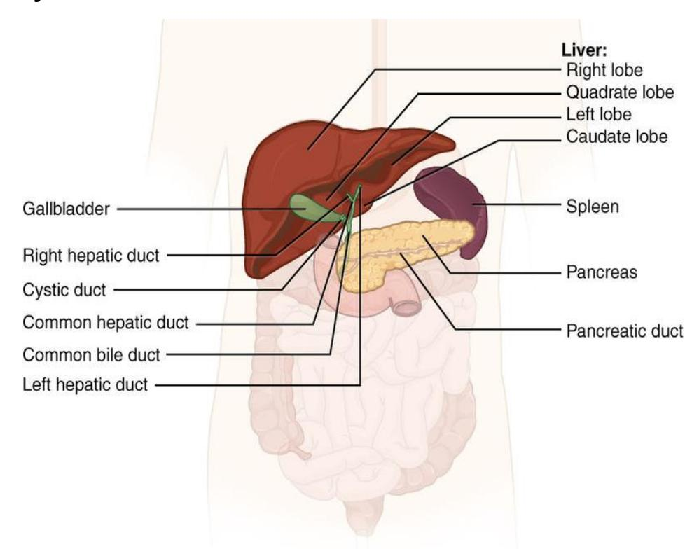

**Figure 20.25** Accessory Digestive Organs.

## **Mesentery**

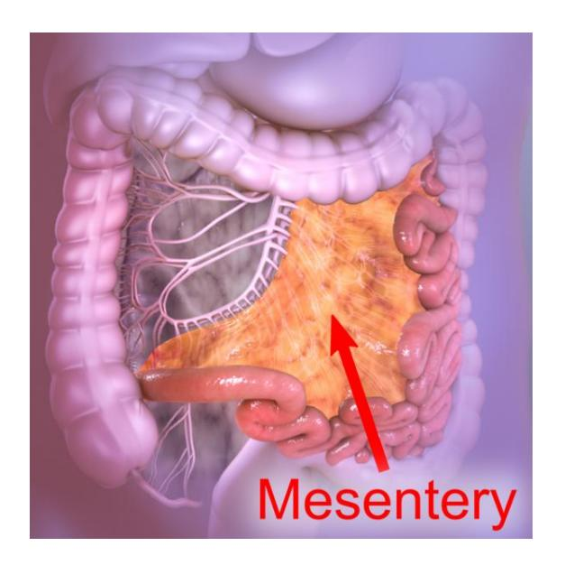

**Figure 20.26** The Structure of Mesentery Spread Across the Intestines.

## **Greater Omentum**

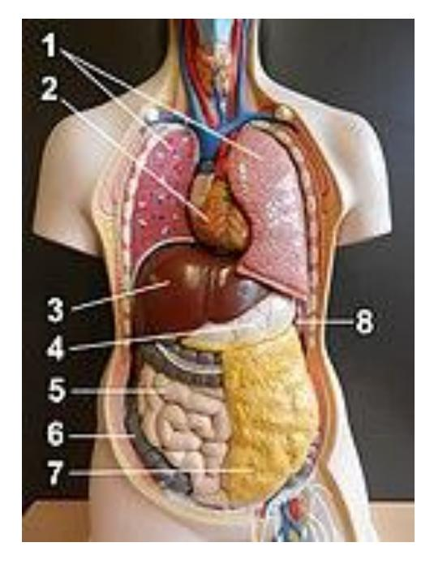

**Figure 20.27** Organs of the Thorax and Abdominal Regions. Key: Greater omentum - 7

### **Pancreas:**

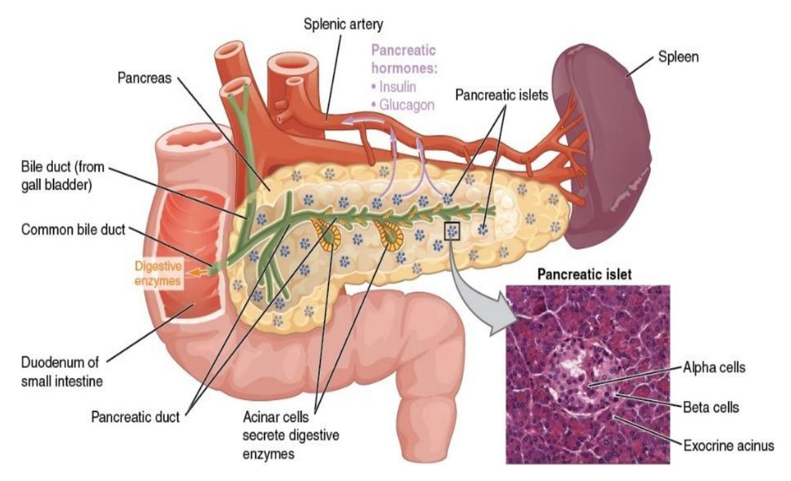

**Figure 20.28** The Pancreas.

## **Supporting internet videos**

## **Digestive system introduction**

-   Digestive System Plaque. Dr. Lotz. [https://youtu.be/8OI1QrYI4HU?si=g8qilk4DFacMKieK.](https://youtu.be/8OI1QrYI4HU?si=g8qilk4DFacMKieK)
-   Professor Long 2402 Lab Digestive Tract Anatomy. Professor Bob Long Human Anatomy and Physiology. <https://youtu.be/zLpqVkxTM5w?si=lnwCA1w6oocJUEAo>**.**

## **Review Video**

• Digestive Tract Anatomy \| Review and Practice. Anatomy Hero. [https://youtu.be/OJyfuXVOs4g?si=xhWD3ch6SiUZTVKx.](https://youtu.be/OJyfuXVOs4g?si=xhWD3ch6SiUZTVKx) Note: MISTAKE: Early in the video the presenter said "pharyngeal tonsil" when she should have said palatine

## **How the Body Works**

## **The Architecture of the Liver**

• Daniel Izzo, You Tube.<https://youtu.be/Gn-ibhGE7PI>

## **The Small Intestine**

-   Small Intestine & Nutrient Absorption. Anatomy and Physiology for Paramedics. [https://youtu.be/dmjypoW-USE?si=GPYVevvSZQVre3PO.](https://youtu.be/dmjypoW-USE?si=GPYVevvSZQVre3PO)
-   Small Intestine Anatomy (Parts, Topography, Structures, Layers). Taim Talks Med. [https://youtu.be/j0XVr2Tla-c?si=KvK\\\_BGBnOY1rdHmq.](https://youtu.be/j0XVr2Tla-c?si=KvK_BGBnOY1rdHmq)
-   Small Intestine(anatomy). Sam Webster). [https://youtu.be/ClOTBwFNnQ?si=PbjxloCXd0JiCms7.](https://youtu.be/ClOTBwFN-nQ?si=PbjxloCXd0JiCms7)

### **The Large Intestine:**

• The large intestine (anatomy): Sam Webster. [https://youtu.be/lWw8iOkGe9g?si=gf7GikG2Q\\\_vGoRLQ.](https://youtu.be/lWw8iOkGe9g?si=gf7GikG2Q_vGoRLQ)

## **Post Lab Activities**

## **Check Your Understanding**

## **Post Lab Activity 20.1**

### **Identifications**

Identify the structures found in figures 20.29 to 20.32.

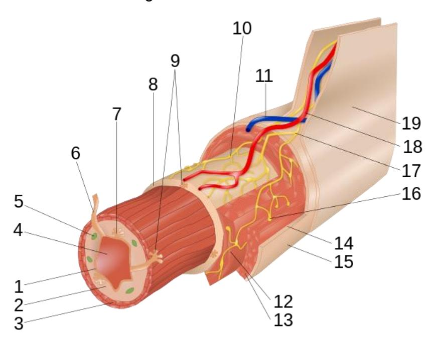

**Figure 20.29** Cross Section of the Small Intestine.

**Table 20.8 Structures and Layers of the Smal Intestine**

| Number(s)          |     |
|--------------------|-----|
| 1-3 collectively   |     |
| 1                  |     |
| 2                  |     |
| 3                  |     |
| 8                  |     |
| 12-13 collectively |     |
| 12                 |     |
| 14-15 collectively |     |
| 16                 |     |

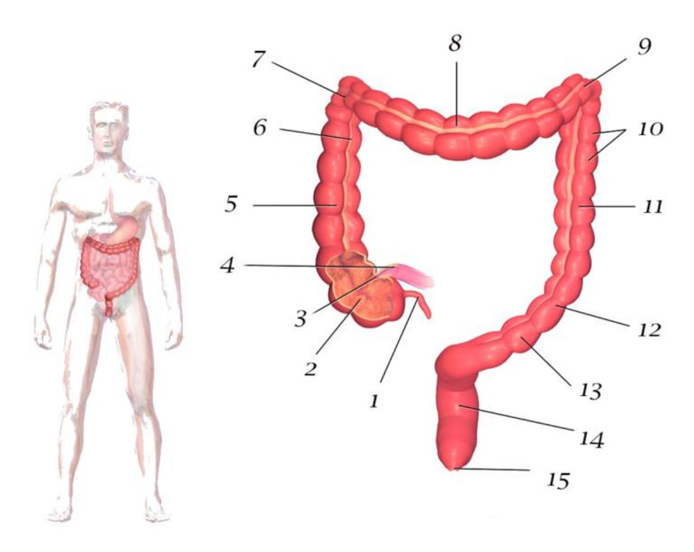

**Figure 20.30** The Anatomy of the Large Intestine.

**Table 20.9 Identification of the Structures in the Large Intestine**

| Number | Intestinal identification |
|--------|---------------------------|
| 1      |                           |
| 2      |                           |
| 3      |                           |
| 4      |                           |
| 5      |                           |
| 6      |                           |
| 7      |                           |
| 8      |                           |
| 9      |                           |
| 10     |                           |
| 11     |                           |
| 12     |                           |
| 13     |                           |
| 14     |                           |
| 15     |                           |

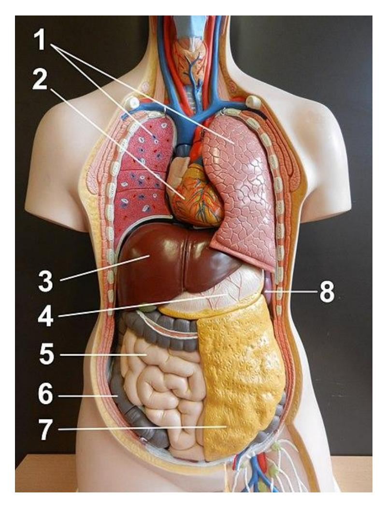

**Figure 20.31** The Digestive System.

**Table 20.10. Word Bank for Figure 20.31**

| Word Bank |   |   |   |
|----|----|----|----|
| Salivary glands | Sublingual gland | Parotid gland | Submandibular gland |
|  | Oral cavity | Tongue | Hard palate |
| Soft palate | Uvula | Esophagus | Lower esophageal |
|  |  |  | sphincter |
| Teeth | Incisor | Canine | Premolar |
| Molar | Gingiva | Enamel | Dentin |
| Pulp cavity | Crown | Root | Periodontal ligament |
| Stomach | Cardiac sphincter | Fundus | Cardia |
| Body | Greater curvature | Lesser curvature | Pylorus |
| Rugae | Pyloric sphincter | Ileum | Jejunum |
| Small Intestine | Duodenum | Duodenal papillae | Circular folds |
| Villi | Ileocecal sphincter | Cecum | Haustra |
| Large Intestine | Ileocecal valve | Ascending colon | Transverse colon |
| Descending colon | Appendix | Rectum | Anus |
| Internal anal sphincter | Sigmoid colon | Taeniae coli | External anal sphincter |

Identify and describe the function of the structures in figure 20.32.

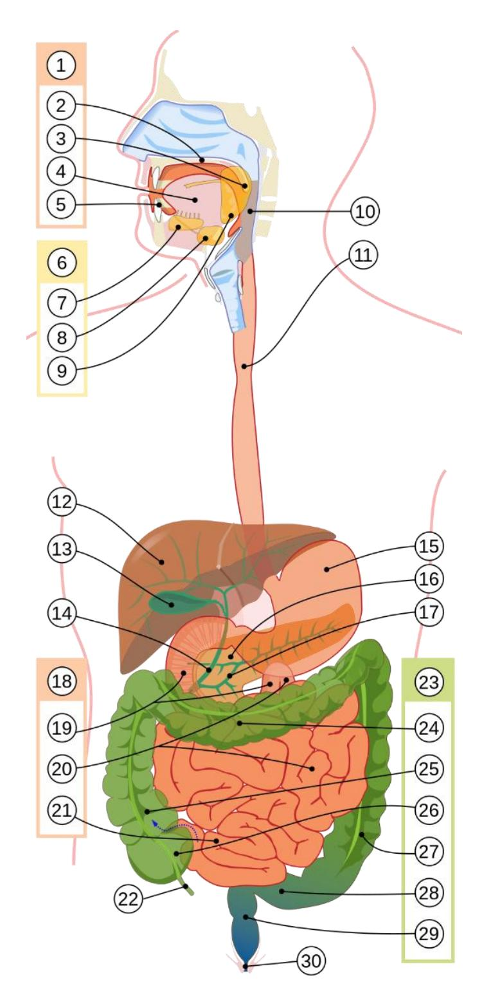

**Figure 20.32** The Digestive System, Unlabeled.

## **Post Lab Activity 20.2**

### **Review Questions**

Answer the following questions:

1.  Which of these organs is not considered an accessory digestive structure?
    a.  mouth
    b.  salivary glands
    c.  pancreas
    d.  liver
2.  Which of the following membranes covers the stomach?
    a.  falciform ligament
    b.  mesocolon
    c.  parietal peritoneum
    d.  visceral peritoneum
3.  Which of these is most associated with villi?
    a.  haustra
    b.  lacteals
    c.  bacterial flora
    d.  intestinal glands
4.  In which part of the alimentary canal does most digestion occur?
    a.  stomach
    b.  small intestine
    c.  ascending colon
5.  Which part of the large intestine attaches to the appendix?
    a.  cecum
    b.  ascending colon
    c.  transverse colon
    d.  descending colon
6.  Which of these is most associated with villi?
    a.  haustra
    b.  lacteals
    c.  bacterial flora
    d.  intestinal glands
7.  Where does the chemical digestion of starch begin?
    a.  mouth
    b.  esophagus
    c.  stomach
    d.  small intestine
8.  Where are most of the fat-digesting enzymes produced?
    a.  small intestine
    b.  gallbladder
    c.  liver
    d.  pancreas
9.  During a hockey game, the puck hits a player in the mouth, knocking out all eight of his most anterior teeth. Which teeth did the player lose and how does this loss affect food ingestion?

### **Post Lab Activity 20.3**

### **Crossword Puzzles**

Complete the following crossword puzzles.

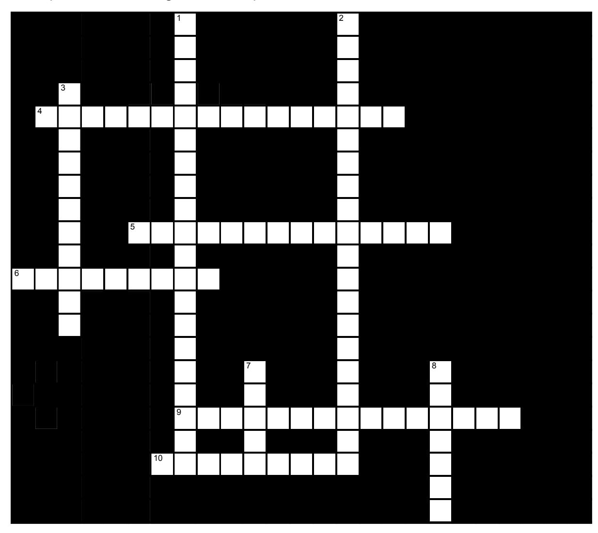

**Figure 20.33** Digestive System-1

### **Across**

-   4 The organs of the digestive system which are found in the abdominal cavity, and the cavity itself, are lined by a(n) \_\_\_\_ membrane, the \_\_\_\_. (6,10)

-   5 The most visible mesentary, upon dissection, is the folded layer wich hangs like a curtin from the stomach and transverse colon; it is called the \_\_\_\_ \_\_\_\_. (7,7)

-   6 The \_\_\_\_ is the "dangily" part of the soft palate; together with the sft palate it prevents \_\_\_ from entering the nose as one swalows. (5,4)

-   9 the gastrointstinal tract is sometimes called the \_\_\_\_ \_\_\_\_. (10,5)

-   10 The \_\_\_\_ holds abdominal organs in place and prevents them from shifting within the abdominal cavity. In addition , fat accumulates within its folds. (9)

### **Down**

-   1 The roof of the oral cavit is divided into two parts, the bony \_\_\_\_ \_\_\_\_ and the \_\_\_\_ \_\_\_\_. (4,6,4,6)

-   2 The \_\_\_\_ are double layered extensions of the peritoneum which connect the abdominal organs to the abdominal walls. Collectively these extensions are called the \_\_\_\_\_ (11,9)

-   3 The peritoneal cavity is located between the visceral and parietal layers of the peritoneum and is filled with \_\_\_\_ \_\_\_\_ (6,5)

-   7 The central are aof the gastrointestinal tract is called the \_\_\_\_. (5)

-   8 The posterior part of the mouth leads into the \_\_\_\_. (7)

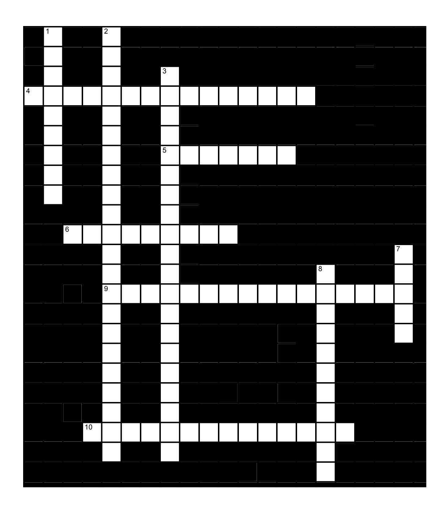

**Figure 20.34** Digestive, Alimentary Canal

### **Across**

-   4 The gastrointestinal tract is sometimes called the \_\_\_\_ \_\_\_\_. (10,5)
-   5 The posterior part of the mouth leads into the \_\_\_\_. (7)
-   6 The \_\_\_\_ holds abdominal organs in place and prevents them from shifting within the abdominal cavity. In addition, fat accumulates within its folds. (9)
-   9 The organs of the digestive system which are found in the abdominal cavity, and the cavity itself, are lined by a(n) \_\_\_\_ membrane, the \_\_\_\_. (6,10)
-   10 The most visible mesentery, upon dissection, is the folded layer which hangs like a curtain from the stomach and transverse colon; it is called the \_\_\_\_ \_\_\_\_. (7,7)

### **Down**

-   1 The \_\_\_\_ is the "dangly" part of the soft palate; together with the soft palate it prevents \_\_\_ from entering the nose as one swallows. (5,4)
-   2 The \_\_\_\_ are double layered extensions of the peritoneum which connect the abdominal organs to the abdominal walls. Collectively these extensions are called the \_\_\_\_\_ (11,11)
-   3 The roof of the oral cavity is divided into two parts, the bony \_\_\_\_ \_\_\_\_ and the \_\_\_\_ \_\_\_\_. (4,6,4,6)
-   7 The central cavity of the gastrointestinal tract is called the \_\_\_. (5)
-   8 The peritoneal cavity is located between the visceral and parietal layers of the peritoneum and is filled with \_\_\_\_ \_\_\_\_ (6,5)

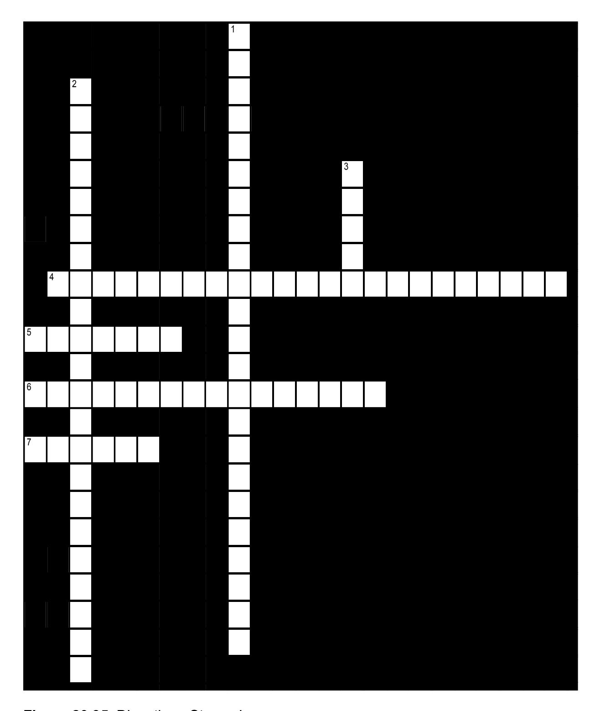

**Figure 20.35** Digestive - Stomach

### **Across**

-   4 The upper opening of the stomach is the \_\_\_ or \_\_\_ opening. (16,7)

-   5 The lower region of the stomach is called the \_\_\_\_. (7)

-   6 The lower esophageal sphincter is also known as the \_\_ \_\_\_. (7,9)

-   7 The part of the stomach that is superior to the cardiac sphincter is the \_\_\_\_. (6)

### **Down**

-   1 The esophagus connects the \_\_\_ to the \_\_\_ and has a(n) \_\_\_ at each end to control the entry and exit of food and drink. (7,7,9)

-   2 The esophagus is a tube lying anterior to the \_\_\_ and posterior to the \_\_\_\_ and the \_\_\_\_. (9,6,7)

-   3 The interior of the empty stomach is wrinkled; these wrinkles of folds are called \_\_\_\_. (5)

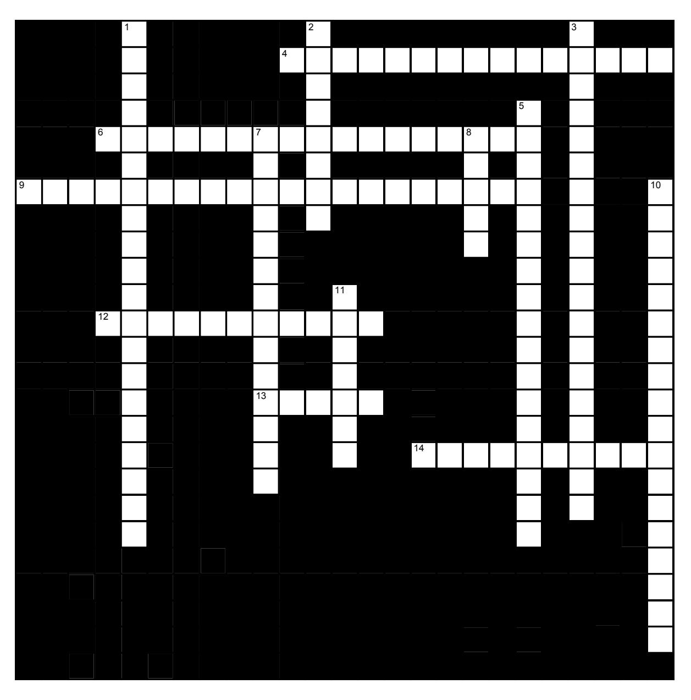

**Figure 20.36** Digestive; Intestines and Accessory organs

### **Across**

-   4 The pancreas is a long, roughly triangular organ nested in the curve of the \_\_\_, lying posterior to the \_\_\_\_. (8,7)

-   6 The pancreas is essentially two glands in one: It has both \_\_\_ and \_\_\_ functions (9,0,8)

-   9 The small intestine is divided anatomically into three regions. Listed in order as food moves they are the \_\_\_, \_\_\_ and \_\_\_. (8,7,5)

-   12 Dilute bile is produced by the liver and transferred to the \_\_\_\_. (11)

-   13 The \_\_\_ are pancreatic cell clusters which secrete digestive enzymes. (5)

-   14 The anal canal is a passageway which conducts feces out of the rectum. It includes two \_\_\_\_; the inner one is involuntary, the outer is voluntary. (10)

### **Down**

-   1 The large intestine is divided into five regions. Approximately one half of the \_\_\_ is found on the left side of the body; from there feces reach the \_\_\_ their final storage place prior to their exit through the \_\_\_\_ \_\_\_\_. (5,6,4,5)

-   2 The 25 cm \_\_\_\_ is the C-shaped portion of the small intestine into which the stomach empties. (8)

-   3 The tenia are ribbons of \_\_\_ \_\_\_ running along the length of the large intestine. They cause the formation of puckered pouches called \_\_\_ along the entire length of the large intestine. (6,6,7)

-   5 The \_\_\_ \_\_\_ is a vestigial organ roughly the size of one's index finger, suspended from the cecum. (9,8)

-   7 Entry of chyme into the large intestine is controlled by the \_\_\_ \_\_\_ which is found at the juncture of the ileum and the large intestine. (9,5)

-   8 The longest and terminal portion of the small intestine. (5)

-   10 The great length of the small intestine is necessary for \_\_\_ \_\_\_. (8,10)

-   11 The second longest portion of the small intestine is the \_\_\_\_. This section is located in the middle of the small intestine. (7)

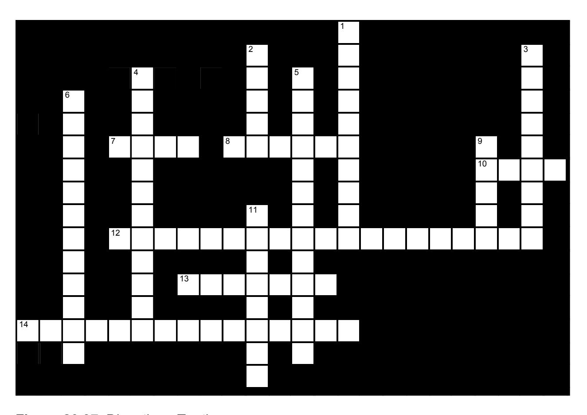

**Figure 20.37** Digestive - Teeth

### **Across**

-   **7** The boundary between the tooth crown and the root is the \_\_\_\_\_\_ (4)
-   **8** The outer layer of a tooths root is the \_\_\_\_ (6)
-   **10** The part of the tooth below the gums (4)
-   **12** Teeth are held in their sockets by \_\_\_\_ \_\_\_\_ (10,9)
-   **13** \_\_\_\_ are teeth which tear (7)
-   **14** \_\_\_\_ and \_\_\_\_ are teeth which grind (9,6)

### **Down**

-   **1** The \_\_\_\_ salivary glands are located beneath the tongue (10)

-   **2** How many pairs of salivary glands are found in the mouth? (5)

-   **3** The socket in the jaw which holds a tooth is called a(n) \_\_\_\_. (9)

-   **4** The submandibular glands are salivary glands located \_\_\_ to each side of the mandible. (12)

-   **5** The parotid glands are located \_\_\_ to the masseter muscle. (13)

-   **6** The crown of the tooth is composed of a core of living tissue called \_\_\_\_ surrounded by a layer of nonliving \_\_\_\_ (6,6)

-   **9** The part of the tooth above the gums (5)

-   **11** \_\_\_\_ are teeth which cut (8)

## **Keys to the Crosswords:**

## **Figure 20.31 Digestive System-1**

-   **Across: 4** serous membrane, **5** greater omentum, **6** uvula, food, **9** alimentary canal, **10** mesentary
-   **Down: 1** hard palate, soft palate, **2** mesentaries, mesentary, **3** serous fluid, **7** lumen, **8** trachea

## **Figure 20.32 Digestive; alimentary canal**

-   **Across: 4** Serous periteonum, **5** Greater omentum, **6** Uvula food, **9** Alimentary canal, **10** Mesentary.
-   **Down: 1** Hard palate soft palate, **2** Mesentaries mesentary, **3** Serous fluid, **7** Lumen, **8** Pharynx.

### **Figure 20.33 Digestive; stomach**

-   **Across: 4** Cardiac sphincter, **6** Pylorus, **7** Vertebrae larynx trachea.
-   **Down: 1** Pharynx stomach sohincter, **2** Gastroesophegeal cardiac, **3** Fundus, **5** Rugae.

## **Figure 20.34 Digestive; Intestines and accessory organs**

-   **Across: 4** Duodenum stomach, **6** Endocrine exocrine, **9** Duodenum jejunum ileum, **12** Gallbladder, **13** Acini, **14** Sphincters.
-   **Down: 1** Colon rectum anal canal, **2** Duodenum, **3** Smooth muscle haustra, **5** Vermiform appendix, **7** Ileocecal valve, **8** Ileum, **10** Nutrient absorption, **11** Jejunum.

### **Figure 20.35 Digestive - Teeth**

-   **Across: 7** Neck, **8** Dentin, **10** Root, **12** Peridontalligamentts, **13** Canines, **14** Premolars molars.
-   **Down: 1** Sublingual, **2** Three, **3** Gomphosit, **4** Inferomedial, **5** Posteroateral, **6** Dentin enamel, **9** Crown, **11** Incisors.

### **Chapter 20: Digestive System Glossary**

| Terms | Definitions |
|----|----|
| absorption | passage of digested products from the intestinal lumen through mucosal cells and into the bloodstream or lacteals |
| accessory digestive organ | includes teeth, tongue, salivary glands, gallbladder, liver, and pancreas |
| accessory duct (also, duct of Santorini) | duct that runs from the pancreas into the duodenum |
| acinus | cluster of glandular epithelial cells in the pancreas that secretes pancreatic juice in the pancreas |
| alimentary canal | continuous muscular digestive tube that extends from the mouth to the anus |
| aminopeptidase | brush border enzyme that acts on proteins |
| anal canal | final segment of the large intestine |
| anal column long fold of mucosa in the anal canal | anal column long fold of mucosa in the anal canal |
| anal sinus | recess between anal columns |
| appendix (vermiform appendix) | coiled tube attached to the cecum |
| ascending colon | first region of the colon |
| bacterial flora | bacteria in the large intestine |
| bile | alkaline solution produced by the liver and important for the emulsification of lipids |
| bile canaliculus | small duct between hepatocytes that collects bile |
| bilirubin | main bile pigment, which is responsible for the brown color of feces |
| body | mid-portion of the stomach |
| bolus | mass of chewed food |
| brush border | fuzzy appearance of the small intestinal mucosa created by microvilli |
| cardia (also, cardiac region) | cardia (also, cardiac region the cardiac orifice (esophageal hiatus) |
| Cardiac sphincter | surrounds the lower part of the esophagus at the junction between the esophagus and the stomach. |
| cecum | pouch forming the beginning of the large intestine |
| cementum | bone-like tissue covering the root of a tooth |
| central vein | vein that receives blood from hepatic sinusoids |
| cephalic phase (also, reflex phase) | initial phase of gastric secretion that occurs before food enters the stomach |
| chemical digestion | enzymatic breakdown of food |
| chief cell | gastric gland cell that secretes pepsinogen |
| chylomicron | large lipid-transport compound made up of triglycerides, phospholipids, cholesterol, and proteins |
| chyme | soupy liquid created when food is mixed with digestive juices |
| circular fold (also, plica circulare) | deep fold in the mucosa and submucosa of the small intestine |
| colon | part of the large intestine between the cecum and the rectum |
| common bile duct | structure formed by the union of the common hepatic duct and the gallbladder's cystic duct |
| common hepatic duct | duct formed by the merger of the two hepatic ducts |
| crown | portion of tooth visible superior to the gum line |
| cuspid (also, canine) | pointed tooth used for tearing and shredding food |
| cystic duct | duct through which bile drains and enters the gallbladder |
| deciduous tooth | one of 20 'baby teeth' |
| defecation | elimination of undigested substances from the body in the form of feces |
| deglutition | three-stage process of swallowing |
| dens tooth | dens tooth |
| dentin | bone-like tissue immediately deep to the enamel of the crown or cementum of the root of a tooth |
| dentition | set of teeth |
| deoxyribonuclease | pancreatic enzyme that digests DNA |
| descending colon | part of the colon between the transverse colon and the sigmoid colon |
| dipeptidase | brush border enzyme that acts on proteins |
| duodenal gland (also, Brunner's gland) | Mucous secreting gland in the duodenal submucosa |
| duodenum | first part of the small intestine, which starts at the pyloric sphincter and ends at the jejunum |
| enamel | covering of the dentin of the crown of a tooth |
| enteroendocrine cell | gastric gland cell that releases hormones |
| enterohepatic circulation | recycling mechanism that conserves bile salts |
| enteropeptidase | intestinal brush-border enzyme that activates trypsinogen to trypsin |
| epiploic appendage | small sac of fat-filled visceral peritoneum attached to teniae coli |
| esophagus | muscular tube that runs from the pharynx to the stomach |
| external anal sphincter | voluntary skeletal muscle sphincter in the anal canal |
| fauces | opening between the oral cavity and the oropharynx |
| feces | semisolid waste product of digestion |
| flatus | gas in the intestine |
| fundus | dome-shaped region of the stomach above and to the left of the cardia |
| G cell | gastrin-secreting enteroendocrine cell |
| gallbladder | accessory digestive organ that stores and concentrates bile |
| gastric emptying | process by which mixing waves gradually cause the release of chyme into the duodenum |
| gastric gland | gland in the stomach mucosal epithelium that produces gastric juice |
| gastric phase | phase of gastric secretion that begins when food enters the stomach |
| gastric pit | narrow channel formed by the epithelial lining of the stomach mucosa |
| gastrin | peptide hormone that stimulates secretion of hydrochloric acid and gut motility |
| gastrocolic reflex | propulsive movement in the colon activated by the presence of food in the stomach |
| gastroileal reflex | long reflex that increases the strength of segmentation in the ileum |
| gingiva | gum |
| Greater curvature | long, convex, lateral surface of the stomach |
| Greater omentum | a large apron-like fold of visceral peritoneum that hangs down from the stomach. |
| haustral contraction | slow segmentation in the large intestine |
| haustrum | small pouch in the colon created by tonic contractions of teniae coli |
| hepatic artery | artery that supplies oxygenated blood to the liver |
| hepatic lobule | hexagonal-shaped structure composed of hepatocytes that radiate outward from a central vein |
| hepatic portal vein | vein that supplies deoxygenated nutrient-rich blood to the liver |
| hepatic sinusoid | blood capillaries between rows of hepatocytes that receive blood from the hepatic portal vein and the branches of the hepatic artery |
| hepatic vein | vein that drains into the inferior vena cava |
| hepatocytes | major functional cells of the liver |
| hepatopancreatic ampulla (also, ampulla of Vater) | bulb-like point in the wall of the duodenum where the bile duct and main pancreatic duct unite |
| hepatopancreatic sphincter (also, sphincter of Oddi) | sphincter regulating the flow of bile and pancreatic juice into the duodenum |
| hydrochloric acid (HCl) | digestive acid secreted by parietal cells in the stomach |
| ileocecal sphincter | sphincter located where the small intestine joins with the large intestine |
| ileum | end of the small intestine between the jejunum and the large intestine |
| incisor | midline, chisel-shaped tooth used for cutting into food |
| ingestion | taking food into the GI tract through the mouth |
| internal anal sphincter | involuntary smooth muscle sphincter in the anal canal |
| intestinal gland (also, crypt of Lieberkuhn) | gland in the small intestinal mucosa that secretes intestinal juice |
| intestinal juice | mixture of water and mucus that helps absorb nutrients from chyme |
| intestinal phase | phase of gastric secretion that begins when chyme enters the intestine |
| intrinsic factor | glycoprotein required for vitamin B12 absorption in the small intestine |
| jejunum | middle part of the small intestine between the duodenum and the ileum |
| labial frenulum | midline mucous membrane fold that attaches the inner surface of the lips to the gums |
| labium | lip |
| lactase | brush border enzyme that breaks down lactose into glucose and galactose |
| lacteal | lymphatic capillary in the villi large intestine terminal portion of the alimentary canal |
| laryngopharynx | part of the pharynx that functions in respiration and digestion |
| left colic flexure (also, splenic flexure) | point where the transverse colon curves below the inferior end of the spleen |
| Lesser curvature | the shorter, concave, medial surface of the stomach, |
| lingual frenulum | mucous membrane fold that attaches the bottom of the tongue to the floor of the mouth |
| lingual lipase | digestive enzyme from glands in the tongue that acts on triglycerides |
| lipoprotein lipase | enzyme that breaks down triglycerides in chylomicrons into fatty acids and monoglycerides |
| liver | largest gland in the body whose main digestive function is the production of bile |
| lower esophageal sphincter | smooth muscle sphincter that regulates food movement from the esophagus to the stomach |
| main pancreatic duct (also, duct of Wirsung) | duct through which pancreatic juice drains from the pancreas |
| major duodenal papilla | point at which the hepatopancreatic ampulla opens into the duodenum |
| maltase | brush border enzyme that breaks down maltose and maltotriose into two and three molecules of glucose, respectively |
| mass movement | long, slow, peristaltic wave in the large intestine |
| mastication | chewing |
| mechanical digestion | chewing, mixing, and segmentation that prepares food for chemical digestion |
| mesentery | an organ that attaches the intestines to the posterior abdominal wall, consisting of a double fold of the peritoneum. |
| mesoappendix | mesentery of the appendix |
| micelle | tiny lipid-transport compound composed of bile salts and phospholipids with a fatty acid and monoacylglyceride core |
| microvillus | small projection of the plasma membrane of the absorptive cells of the small intestinal mucosa |
| migrating motility | complex form of peristalsis in the small intestine |
| mixing wave | unique type of peristalsis that occurs in the stomach |
| molar | tooth used for crushing and grinding food |
| motilin | hormone that initiates migrating motility complexes |
| motility | movement of food through the GI tract |
| mucosa | innermost lining of the alimentary canal |
| mucosal barrier | protective barrier that prevents gastric juice from destroying the stomach itself |
| mucous neck cell | gastric gland cell that secretes a uniquely acidic mucus |
| muscularis | muscle (skeletal or smooth) layer of the alimentary canal wall |
| myenteric plexus (plexus of Auerbach) | major nerve supply to alimentary canal wall; controls motility |
| nucleosidase | brush border enzyme that digests nucleotides |
| oral cavity (also, buccal cavity) | mouth |
| oral vestibule | part of the mouth bounded externally by the cheeks and lips, and internally by the gums and teeth |
| oropharynx | part of the pharynx continuous with the oral cavity that functions in respiration and digestion |
| palatoglossal arch | muscular fold that extends from the lateral side of the soft palate to the base of the tongue |
| palatopharyngeal arch | muscular fold that extends from the lateral side of the soft palate to the side of the pharynx |
| pancreas | accessory digestive organ that secretes pancreatic juice |
| pancreatic amylase | enzyme secreted by the pancreas that completes the chemical digestion of carbohydrates in the small intestine |
| pancreatic juice | secretion of the pancreas containing digestive enzymes and bicarbonate |
| pancreatic lipase | enzyme secreted by the pancreas that participates in lipid digestion |
| pancreatic nuclease | enzyme secreted by the pancreas that participates in nucleic acid digestion |
| parietal cell | gastric gland cell that secretes hydrochloric acid and intrinsic factor |
| parotid gland | one of a pair of major salivary glands located inferior and anterior to the ears |
| pectinate line | horizontal line that runs like a ring, perpendicular to the inferior margins of the anal sinuses |
| pepsinogen | inactive form of pepsin |
| Periodontal ligament | the fibrous connective tissue found between the roots of the teeth and the inner wall of the bone socket. |
| peristalsis | muscular contractions and relaxations that propel food through the GI tract |
| permanent tooth | one of 32 adult teeth |
| pharynx | throat |
| phosphatase | brush border enzyme that digests nucleotides |
| porta hepatis | 'gateway to the liver' where the hepatic artery and hepatic portal vein enter the liver |
| portal triad | bile duct, hepatic artery branch, and hepatic portal vein branch |
| premolar (also, bicuspid) | transitional tooth used for mastication, crushing, and grinding food |
| propulsion | voluntary process of swallowing and the involuntary process of peristalsis that moves food through the digestive tract |
| pulp cavity | deepest portion of a tooth, containing nerve endings and blood vessels |
| pyloric antrum | wider, more superior part of the pylorus |
| pyloric canal | narrow, more inferior part of the pylorus |
| pyloric sphincter | sphincter that controls stomach emptying |
| pylorus | lower, funnel-shaped part of the stomach that is continuous with the duodenum |
| rectal valve | one of three transverse folds in the rectum where feces is separated from flatus |
| rectum | part of the large intestine between the sigmoid colon and anal canal |
| reticuloendothelial cell (also, Kupffer cell) | phagocyte in hepatic sinusoids that filters out material from venous blood from the alimentary canal |
| retroperitoneal | located posterior to the peritoneum |
| ribonuclease | pancreatic enzyme that digests RNA |
| right colic flexure (also, hepatic flexure) | point, at the inferior surface of the liver, where the ascending colon turns abruptly to the left |
| root | portion of a tooth embedded in the alveolar processes beneath the gum line |
| ruga (plural: rugae) | fold of alimentary canal mucosa and submucosa in the empty stomach and other organs |
| saccharolytic fermentation | anaerobic decomposition of carbohydrates |
| saliva | aqueous solution of proteins and ions secreted into the mouth by the salivary glands |
| salivary amylase | digestive enzyme in saliva that acts on starch |
| salivary gland | an exocrine gland that secretes a digestive fluid called saliva |
| salivation | secretion of saliva |
| segmentation | alternating contractions and relaxations of non-adjacent segments of the intestine that move food forward and backward, breaking it apart and mixing it with digestive juices |
| serosa | outermost layer of the alimentary canal wall present in regions within the abdominal cavity |
| sigmoid colon | end portion of the colon, which terminates at the rectum |
| small intestine | section of the alimentary canal where most digestion and absorption occurs |
| soft palate | posterior region of the bottom portion of the nasal cavity that consists of skeletal muscle |
| stomach | alimentary canal organ that contributes to chemical and mechanical digestion of food from the esophagus before releasing it, as chyme, to the small intestine |
| sublingual gland | one of a pair of major salivary glands located beneath the tongue |
| submandibular gland | one of a pair of major salivary glands located in the floor of the mouth |
| submucosa | layer of dense connective tissue in the alimentary canal wall that binds the overlying mucosa to the underlying muscularis |
| submucosal plexus (plexus of Meissner) | nerve supply that regulates activity of glands and smooth muscle |
| sucrase | brush border enzyme that breaks down sucrose into glucose and fructose |
| tenia coli | one of three smooth muscle bands that make up the longitudinal muscle layer of the muscularis in all of the large intestine except the |
| terminal | end |
| tongue | accessory digestive organ of the mouth, the bulk of which is composed of skeletal muscle |
| transverse colon | part of the colon between the ascending colon and the descending colon |
| upper esophageal sphincter | skeletal muscle sphincter that regulates food movement from the pharynx to the esophagus |
| Valsalva's maneuver | voluntary contraction of the diaphragm and abdominal wall muscles and closing of the glottis, which increases intra-abdominal pressure and facilitates defecation |
| villus | projection of the mucosa of the small intestine |
| voluntary phase | initial phase of deglutition, in which the bolus moves from the mouth to the oropharynx |
| α-dextrin | breakdown product of starch |
| α-dextrinase | brush border enzyme that acts on α- dextrins |
