# **Urinary System**

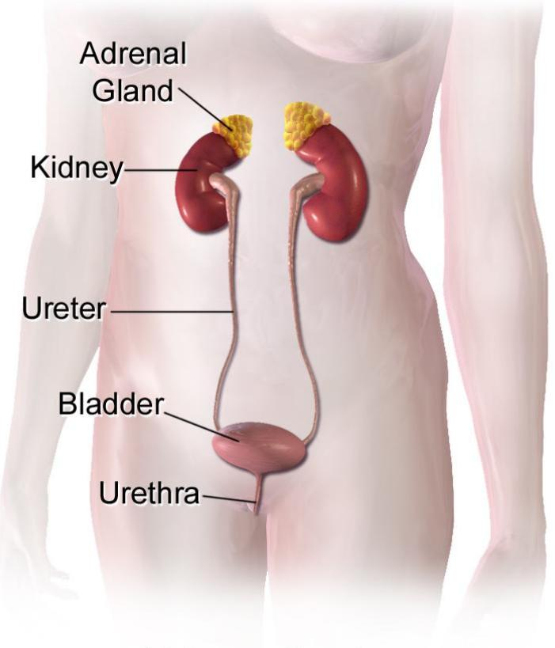

**Figure 21.1** The female urinary system.

In this laboratory, you will use models and diagrams to study the anatomy of the urinary system. Specifically, you will examine the gross and microscopic anatomy of the human urinary system.

## **Learning Objectives for this lab:**

By the end of this lab, you will be able to:

-   Describe the function of the male and female urinary systems.

-   Identify the organs of the urinary system on a model or a diagram and describe the function of each.

-   To identify the following on a dissected kidney:

    -   Hilum
    -   Cortex
    -   Medulla
    -   Medullary pyramids

-   Major and minor calyces

-   Pelvis

-   Renal columns

-   Renal capsule

-   Trace the blood supply of the kidney from the renal artery to the renal vein.

-   Describe the anatomy of a nephron.

-   Identify and describe the anatomical features of the nephron. These should include:

    -   Glomerulus
    -   Glomerular capsule
    -   Renal tubule

-   Proximal convoluted tubule

-   Nephron loop

-   Distal convoluted tubule

-   To compare the course and length of the urethra in the male and female urinary systems.

-   Identify the following structures of importance found in the lists below:

## **Terms to Learn:**

## **Kidney Structures**

-   Renal capsule

-   Renal cortex

-   Renal columns

-   Renal medulla

-   Renal pyramids

-   Renal papillae

-   Hilum

-   Renal sinus

-   Minor calyces

-   Major calyces

-   Renal pelvis

## **Nephron**

-   Renal corpuscle

-   Afferent arteriole

-   Efferent arteriole

-   Glomerulus

-   Glomerular (Bowman's) capsule

-   Proximal convoluted tubule

-   Nephron loop (loop of Henle)

    -   Descending limb
    -   Ascending limb

-   Distal convoluted tubule

-   Collecting duct

-   Papillary duct

### **Blood Flow**

-   Renal artery

-   Segmental artery

-   Interlobar artery

-   Arcuate artery

-   Cortical radiate (interlobular) artery

-   Afferent arteriole

-   Glomerulus

-   Efferent arteriole

-   Peritubular capillaries

-   Vasa recta

-   Cortical radiate (interlobular) vein

-   Arcuate vein

-   Interlobar vein

-   Renal vein

## **Storage and Elimination**

-   Ureter
-   Urinary bladder
    -   Detrusor muscle
    -   Trigone
-   Urethra
-   Transitional epithelium

## **Prelab Activities**

## **Prelab Activity 21.1**

-   Kidney \_\_\_\_\_\_\_\_\_\_\_\_\_\_\_\_\_\_\_\_\_\_\_\_\_\_\_\_\_\_\_\_\_\_\_\_\_\_\_\_\_\_\_\_\_\_\_\_\_\_\_\_\_\_\_
-   Ureter \_\_\_\_\_\_\_\_\_\_\_\_\_\_\_\_\_\_\_\_\_\_\_\_\_\_\_\_\_\_\_\_\_\_\_\_\_\_\_\_\_\_\_\_\_\_\_\_\_\_\_\_\_\_\_\_
-   Bladder \_\_\_\_\_\_\_\_\_\_\_\_\_\_\_\_\_\_\_\_\_\_\_\_\_\_\_\_\_\_\_\_\_\_\_\_\_\_\_\_\_\_\_\_\_\_\_\_\_\_\_\_\_\_
-   Detrusor muscle \_\_\_\_\_\_\_\_\_\_\_\_\_\_\_\_\_\_\_\_\_\_\_\_\_\_\_\_\_\_\_\_\_\_\_\_\_\_\_\_\_\_\_\_\_\_\_
-   Trigone \_\_\_\_\_\_\_\_\_\_\_\_\_\_\_\_\_\_\_\_\_\_\_\_\_\_\_\_\_\_\_\_\_\_\_\_\_\_\_\_\_\_\_\_\_\_\_\_\_\_\_\_\_\_
-   Urethra \_\_\_\_\_\_\_\_\_\_\_\_\_\_\_\_\_\_\_\_\_\_\_\_\_\_\_\_\_\_\_\_\_\_\_\_\_\_\_\_\_\_\_\_\_\_\_\_\_\_\_\_\_\_\_

## Kidney Structures

-   Renal capsule \_\_\_\_\_\_\_\_\_\_\_\_\_\_\_\_\_\_\_\_\_\_\_\_\_\_\_\_\_\_\_\_\_\_\_\_\_\_\_\_\_\_\_\_\_\_\_\_\_
-   Renal cortex \_\_\_\_\_\_\_\_\_\_\_\_\_\_\_\_\_\_\_\_\_\_\_\_\_\_\_\_\_\_\_\_\_\_\_\_\_\_\_\_\_\_\_\_\_\_\_\_\_\_
-   Renal columns \_\_\_\_\_\_\_\_\_\_\_\_\_\_\_\_\_\_\_\_\_\_\_\_\_\_\_\_\_\_\_\_\_\_\_\_\_\_\_\_\_\_\_\_\_\_\_\_
-   Renal medulla \_\_\_\_\_\_\_\_\_\_\_\_\_\_\_\_\_\_\_\_\_\_\_\_\_\_\_\_\_\_\_\_\_\_\_\_\_\_\_\_\_\_\_\_\_\_\_\_\_
-   Renal pyramids \_\_\_\_\_\_\_\_\_\_\_\_\_\_\_\_\_\_\_\_\_\_\_\_\_\_\_\_\_\_\_\_\_\_\_\_\_\_\_\_\_\_\_\_\_\_\_\_
-   Renal papillae \_\_\_\_\_\_\_\_\_\_\_\_\_\_\_\_\_\_\_\_\_\_\_\_\_\_\_\_\_\_\_\_\_\_\_\_\_\_\_\_\_\_\_\_\_\_\_\_\_
-   Hilum \_\_\_\_\_\_\_\_\_\_\_\_\_\_\_\_\_\_\_\_\_\_\_\_\_\_\_\_\_\_\_\_\_\_\_\_\_\_\_\_\_\_\_\_\_\_\_\_\_\_\_\_\_\_\_\_
-   Renal sinus \_\_\_\_\_\_\_\_\_\_\_\_\_\_\_\_\_\_\_\_\_\_\_\_\_\_\_\_\_\_\_\_\_\_\_\_\_\_\_\_\_\_\_\_\_\_\_\_\_\_\_
-   Minor calyces \_\_\_\_\_\_\_\_\_\_\_\_\_\_\_\_\_\_\_\_\_\_\_\_\_\_\_\_\_\_\_\_\_\_\_\_\_\_\_\_\_\_\_\_\_\_\_\_\_\_
-   Major calyces \_\_\_\_\_\_\_\_\_\_\_\_\_\_\_\_\_\_\_\_\_\_\_\_\_\_\_\_\_\_\_\_\_\_\_\_\_\_\_\_\_\_\_\_\_\_\_\_\_\_
-   Renal pelvis \_\_\_\_\_\_\_\_\_\_\_\_\_\_\_\_\_\_\_\_\_\_\_\_\_\_\_\_\_\_\_\_\_\_\_\_\_\_\_\_\_\_\_\_\_\_\_\_\_\_\_

## **Prelab Activity 21.2**

Complete table 21.1 by identifying the structures in figure 21.2.

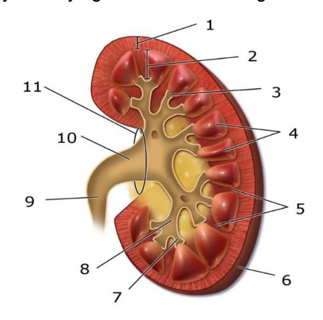

**Figure 21.2** Unlabeled kidney.

## **Word bank: Kidney**

-   Renal pyramid

-   Interlobular artery

-   Renal artery

-   Renal vein

-   Renal hilum

-   Renal pelvis

-   Ureter

-   Minor calyx

-   Renal capsule

-   Inferior extremity

-   Superior extremity

-   Interlobar vein

-   Nephron

-   Renal sinus

-   Major calyx

-   Renal papilla

-   Renal column

**Table 21.1 Identification of the Structures in the Kidney**

| Number | Identification |
|--------|----------------|
| 1      |                |
| 2      |                |
| 3      |                |
| 4      |                |
| 5      |                |
| 6      |                |
| 7      |                |
| 8      |                |
| 9      |                |
| 10     |                |
| 11     |                |

## **Prelab Activity 21.3**

Using your text or the information in this workbook, label the diagram of the nephron below.

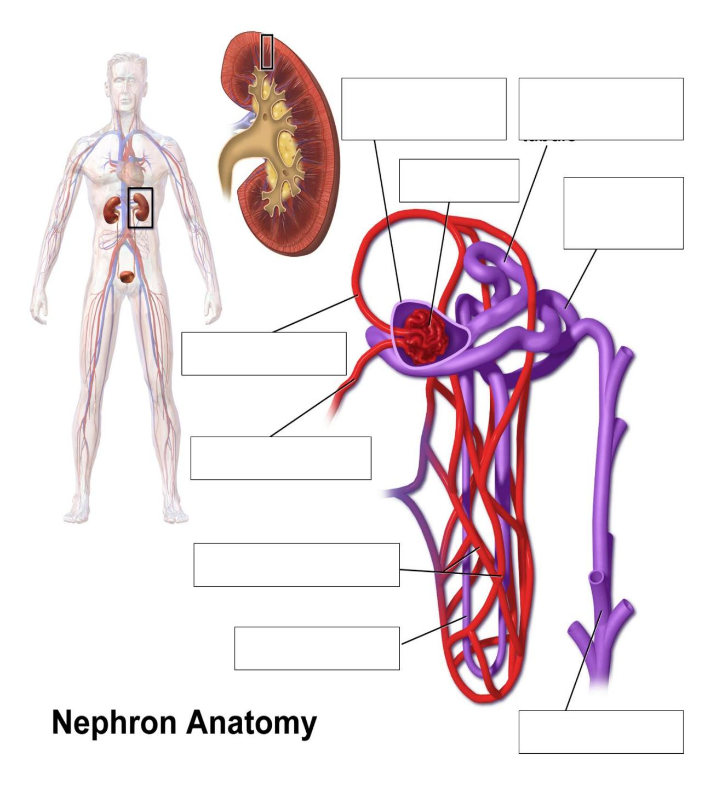

**Figure 21.3** Nephron Anatomy.

## **Lab Activities**

## **Introduction to the kidney**

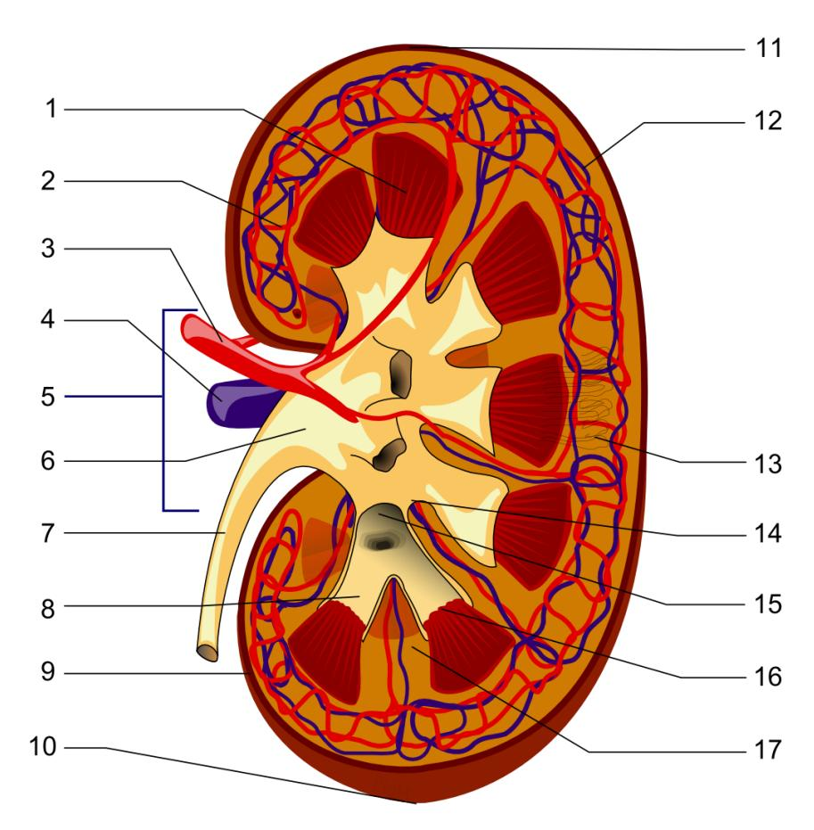

**Figure 21.4** Structures of the Kidney..

### **Structures of the Kidney Word Bank:**

-   Renal pyramid

-   Interlobular artery

-   Renal artery

-   Renal vein

-   Renal hilum

-   Renal pelvis

-   Ureter

-   Minor calyx

-   Renal capsule

-   Inferior extremity

-   Superior extremity

-   Interlobar vein

-   Nephron

-   Renal sinus

-   Major calyx

-   Renal papilla

-   Renal column

## **Lab Activity 21.1**

Gather in your assigned groups. Obtain a free-standing 3d model of the urinary system of the male.

-   Identify and label the structures listed below. Palpate the models as you identify the structures to assist in your learning the kidney structures.
-   Have the group next to you review your identifications for their correctness.
-   Take pictures of your finished work for review later on.

## **Urinary system**

-   Kidney

-   Ureter

-   Bladder

-   Urethra

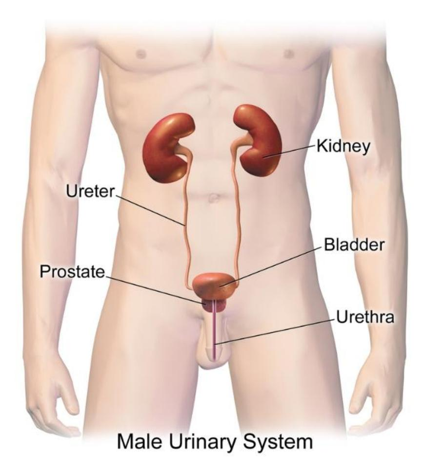

**Figure 21.5** The Male Urinary System.

### **Lab Activity 21.2:**

Obtain a 3d model of the microanatomy of the kidney, a human kidney section and a free-standing kidney model.

-   Identify and label the structures listed below. Palpate the models as you identify the structures to assist in your learning the kidney structures.
-   Have the group next to you review your identifications for their correctness.
-   Take pictures of your finished work for review later on.
-   If you have time create a 5ive-minute video reviewing the structures of the kidney.

## **Kidney Structure**

-   Renal capsule

-   Renal cortex

-   Renal columns

-   Renal medulla

-   Renal pyramids

-   Renal papillae

-   Hilum

-   Renal sinus

-   Minor calyces

-   Major calyces

-   Renal pelvis

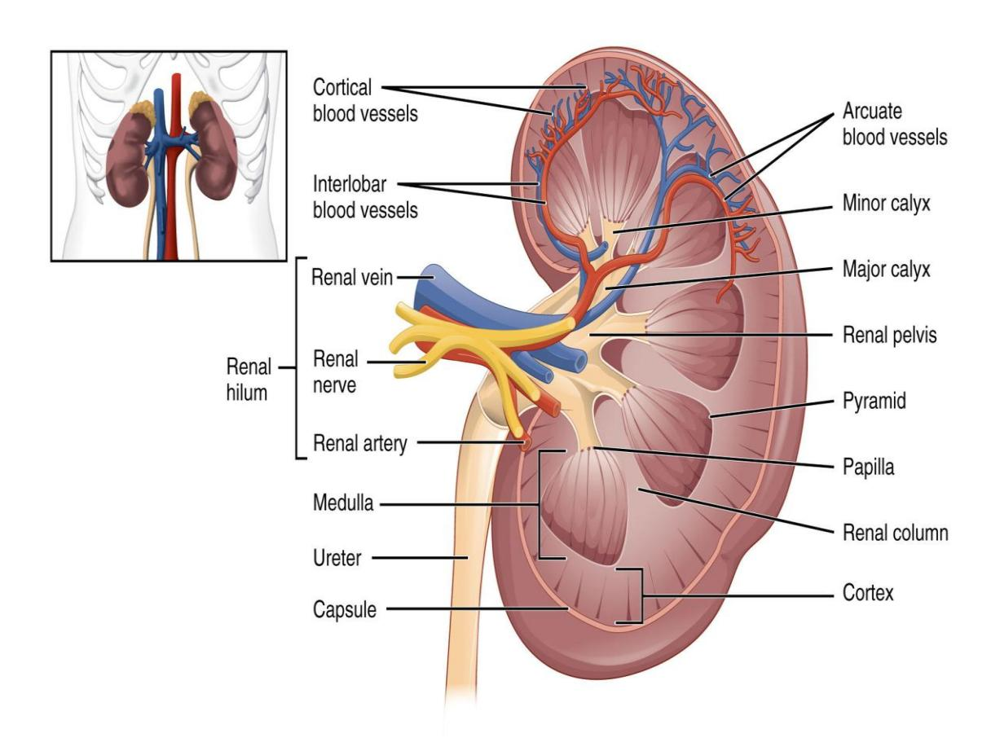

**Figure 21.6** The Kidney.

### **Lab Activity 21.3**

Obtain a 3d model of human kidney model with nephrons, blood vessels and renal corpuscle and/or the microanatomy kidney model.

-   Identify and label the structures listed below. Palpate the models as you identify the structures to assist in your learning the kidney structures.
-   Have the group next to you review your identifications for their correctness.
-   Take pictures of your finished work for review later on.
-   If you have time create a 5ive-minute video reviewing the structures of the kidney.

## **Nephron**

-   Renal corpuscle

-   Afferent arteriole

-   Efferent arteriole

-   Glomerulus

-   Glomerular (Bowman's) capsule

-   Proximal convoluted tubule

-   Nephron loop (loop of Henle)

    -   Descending limb
    -   Ascending limb

-   Distal convoluted tubule

-   Collecting duct

-   Papillary duct

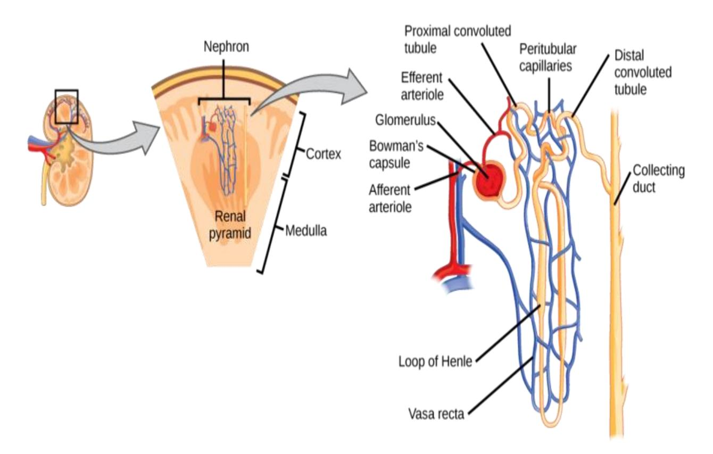

**Figure 21.7** The Nephron.

### **Lab Activity 21.4:**

Obtain a 3d model of human kidney model with nephrons, blood vessels and renal corpuscle and/or the microanatomy kidney model.

-   Identify and label the structures listed below.
-   Have the group next to you review your identifications for their correctness.
-   Take pictures of your finished work for review later on.

### **Blood Flow**

-   Renal artery

-   Segmental artery

-   Interlobar artery

-   Arcuate artery

-   Interlobular (Cortical radiate) artery

-   Afferent arteriole

-   Glomerulus

-   Efferent arteriole

-   Peritubular capillaries

-   Vasa recta

-   Interlobular (Cortical radiate) vein

-   Arcuate vein

-   Interlobar vein

-   Renal vein

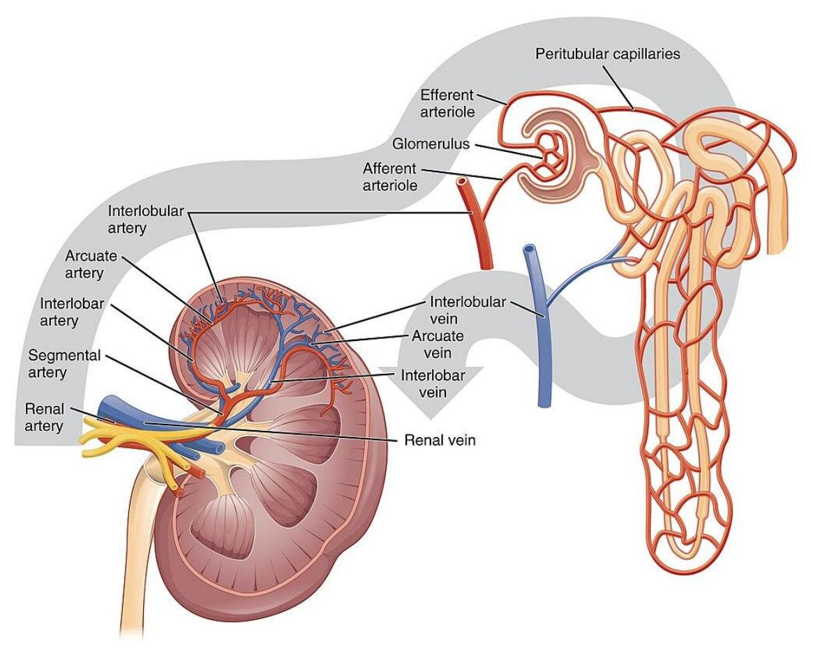

**Figure 21.8** Blood Flow in the Kidney.

## **Lab Activity 21.5:**

Obtain a free-standing 3d model of the urinary system of the male and/or a dual sex urinary system model.

-   Identify and label the structures listed below. Palpate the models as you identify the structures to assist in your learning the kidney structures.
-   Have the group next to you review your identifications for their correctness.
-   Take pictures of your finished work for review later on.

## **Storage and Elimination**

## **Terms**

-   Ureter
-   Urinary bladder
    -   Detrusor muscle
    -   Trigone
-   Urethra
-   Transitional epithelium

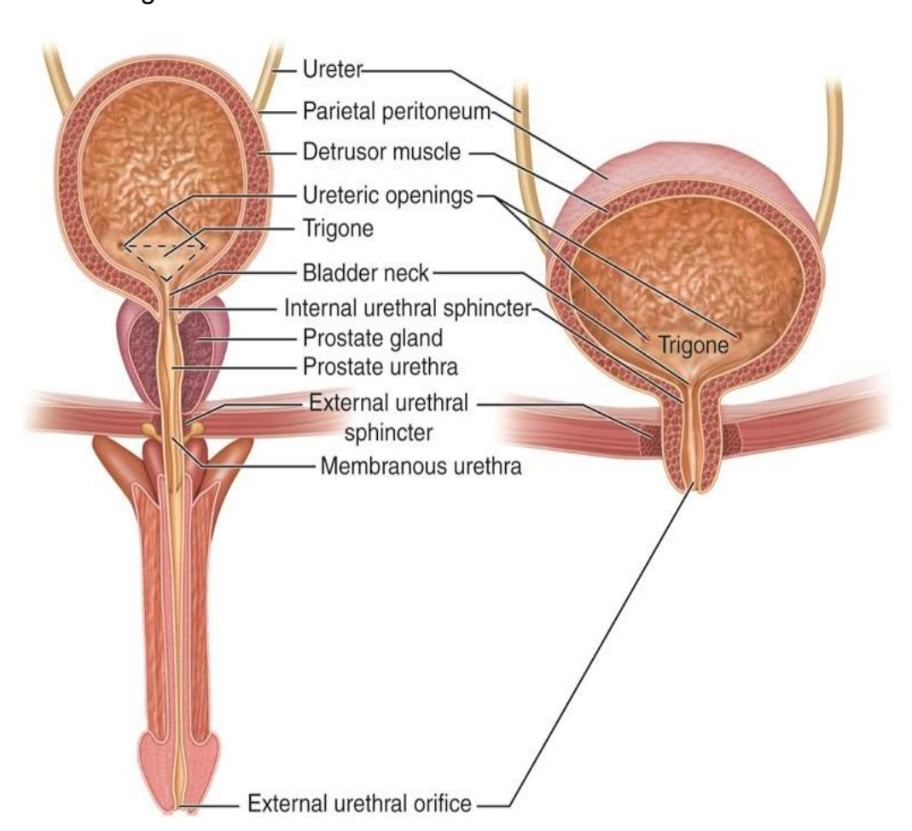

**Figure 21.9** The Male and Female Urinary Tracts.

## **Lab Activity 21.6 (Optional)**

-   Under the direction of your instructor, obtain a microscope from the storage cabinet.
-   Locate obtain a slide of the transitional epithelium of the bladder.
-   Focus on the slide using the 400 x magnification.
-   Have the group next to you review your identifications for their correctness.
-   Take pictures of your finished work for review later on.

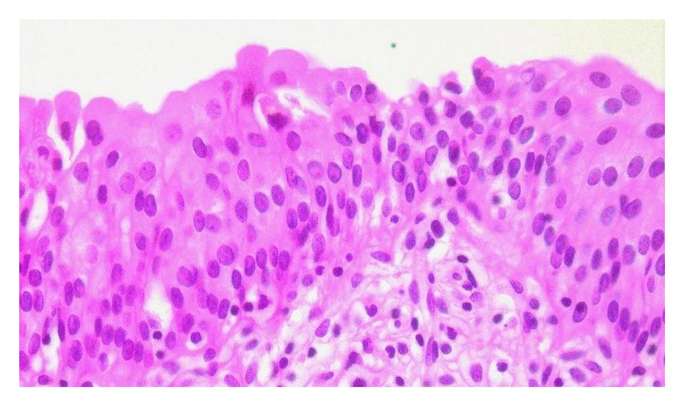

**Figure 21.10** Transitional Epithelium Found in the Bladder.

## **Lab Activity 21.7: Urinalysis**

Performing a urinalysis

In this procedure you will test simulated urine from several patients.

1.  Obtain five test tubes. Place the test tubes in a test tube rack and label the test tubes for patient A, B. C, D, and E.
2.  Fill each test tube with the following simulated solutions: one filled with simulated urine from patient A, B, C, D, and E. label each test tube
3.  Visually determine the color and transparency of each patient's sample. Record your observations in table \_\_\_\_. Determine whether the sample is clear or cloudy.

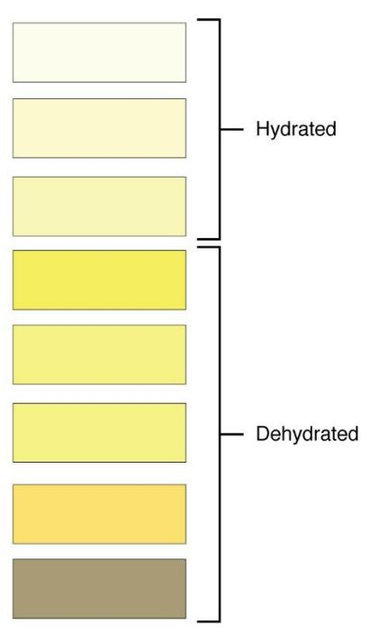

**Figure 21.11** Color Results of the Relative Amount of Dehydration in a Urine Sample.

4.  Obtain a urinalysis test strip.

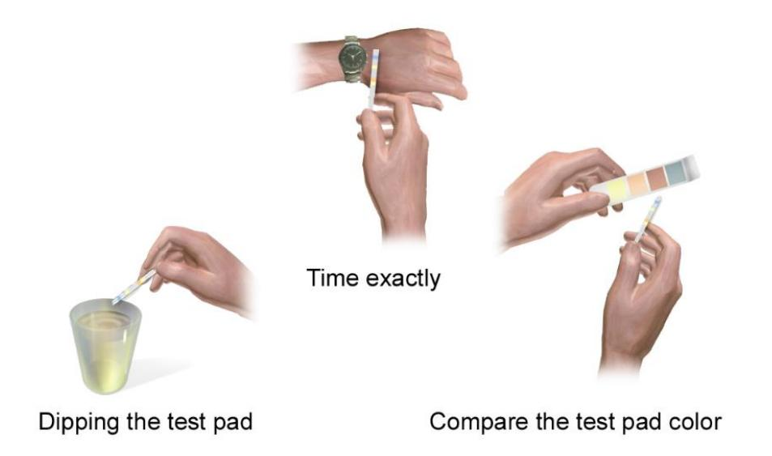

**Figure 21.12** A Medical Illustration Depicting a Ketone Urine Test.

5.  Dip the quickly into the urine sample for patient A. Make sure that the entire strip is immersed into the solution, covering all of the test pads.

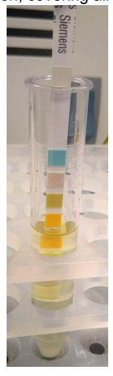

**Figure 21.13** A Urine Test Strip is Immersed into the Sample.

6.  Place Patient A's test strip\[ on a paper towel marked "A." Set the strip on its side and gently tap the strip to remove any excess fluid.
7.  Allow the strip to dry for 30 seconds.
8.  Compare the color of the strips to the color of the blocks on the Siemens Healthcare bottle. Record the results in table 21.2.

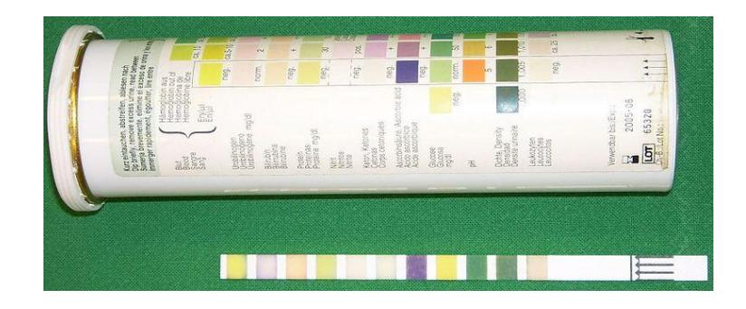

**Figure 21.14** Comparison of a Color Strip to the Label on a Test Strip Container.

Repeat steps 1-8 for the samples from patients B-E

Fill in the following table and answer the following questions:

**Table 21.2 Urinalysis Results**

| Characteristics | Normal | Possible abnormal results pathologies | Patient A | Patient B | Patient C | Patient D | Patient E |
|----|----|----|----|----|----|----|----|
| Color | Light yellow to amber | Dehydration, liver disease, muscular breakdown |  |  |  |  |  |
| Clarity | Clear | infection |  |  |  |  |  |
| pH | 4.6-8 | Acidosis, alkalosis |  |  |  |  |  |
| Glucose | Negative | Diabetes mellitus |  |  |  |  |  |
| Ketosis bodies | Negative | Diabetes mellitus |  |  |  |  |  |
| Nitrites | Negative | Urinary tract infection |  |  |  |  |  |
| Protein | Negative - trace | Kidney disease |  |  |  |  |  |
| Blood/hemoglobin | Negative | Trauma, infection, tumor, kidney stones |  |  |  |  |  |
| Specific gravity | 1.003- 1.035 | Low: excessive fluid intake elevated: dehydration |  |  |  |  |  |

### **Questions:**

-   What conditions might they have?

-   Which results may indicate that your patient is taking diuretics?

## **Post Lab Activities Check Your Understanding**

### **Post Lab Activity: 21.1**

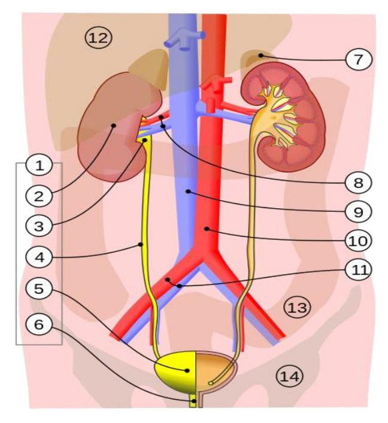

**Figure 21.15** The Urinary system.

Identify the structures in figure 21.15.

**Table 21.2 Structures of the urinary system**

| Number | Structure identification |
|--------|--------------------------|
| 1      |                          |
| 2      |                          |
| 3      |                          |
| 4      |                          |
| 5      |                          |
| 6      |                          |
| 7      |                          |
| 8      |                          |
| 9      |                          |
| 10     |                          |
| 11     |                          |
| 12     |                          |
| 13     |                          |
| 14     |                          |

Identify all of the structures in figure 21.16.

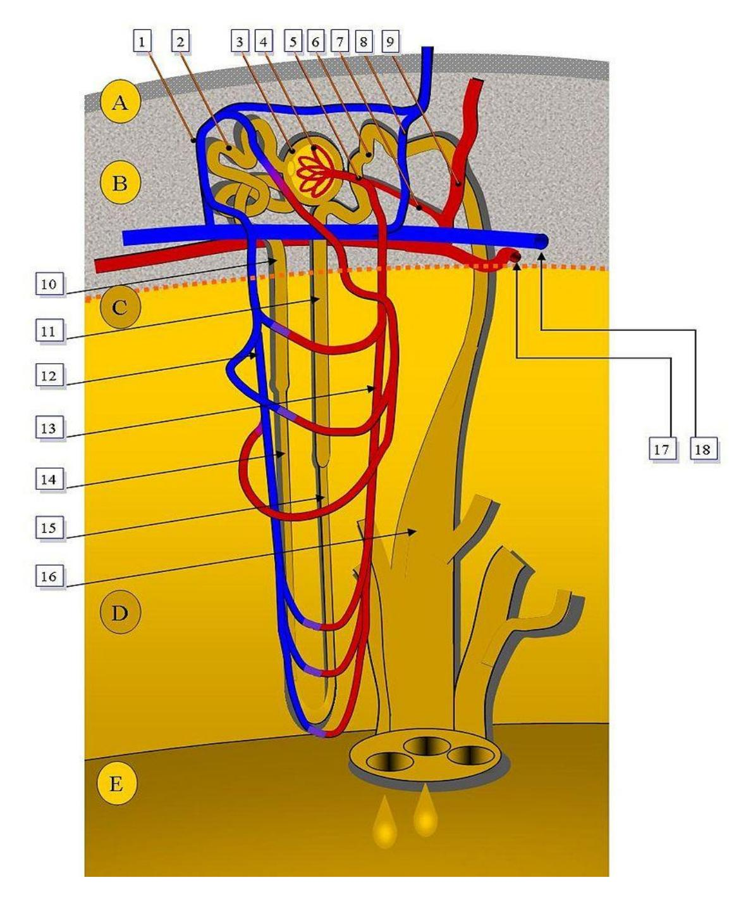

**Figure 21.16** Juxtamedullary Nephron.

Match the number or letter in figure 21.16 with the structure listed in the following table.

Table 21.2 Structures of the Nephron.

| Number or letter | Structure                        |
|------------------|----------------------------------|
|                  | Afferent arteriole               |
|                  | Arcuate artery                   |
|                  | Arcuate vein.                    |
|                  | Ascending limb of Loop of        |
|                  | Henle                            |
|                  | Bowman's capsule                 |
|                  | Collecting duct                  |
|                  | Cortex                           |
|                  | Corticomedullary junction        |
|                  | Descending limb of Loop of Henle |

| Number or letter | Structure                  |
|------------------|----------------------------|
|                  | Distal convoluted tubule   |
|                  | Efferent arteriole         |
|                  | Glomerulus                 |
|                  | Interlobular vein          |
|                  | Interlobular artery        |
|                  | Medulla                    |
|                  | Minor calyx                |
|                  | Peritubular capillaries    |
|                  | Proximal convoluted tubule |

## **Label the structures in Figure 21.17.**

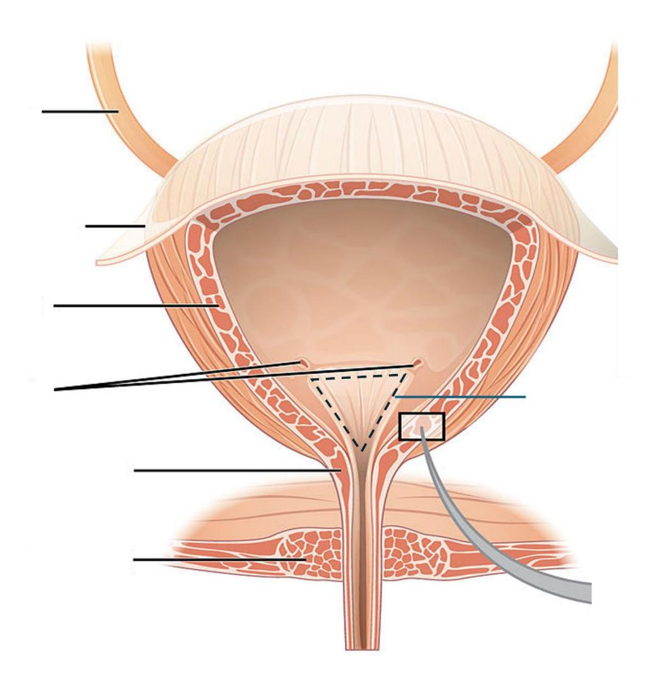

**Figure 21.17** .The Bladder.

## **Post Lab Activity: 21.2**

## **Answer the following questions**

-   Trace the path of urine from its point of filtration to its secretion out of the body.

-   What is unique about the location of the kidneys in the abdominopelvic cavity?

## **Post Lab Activity: 21.3**

## **Crosswords**

Complete the following crossword puzzles:

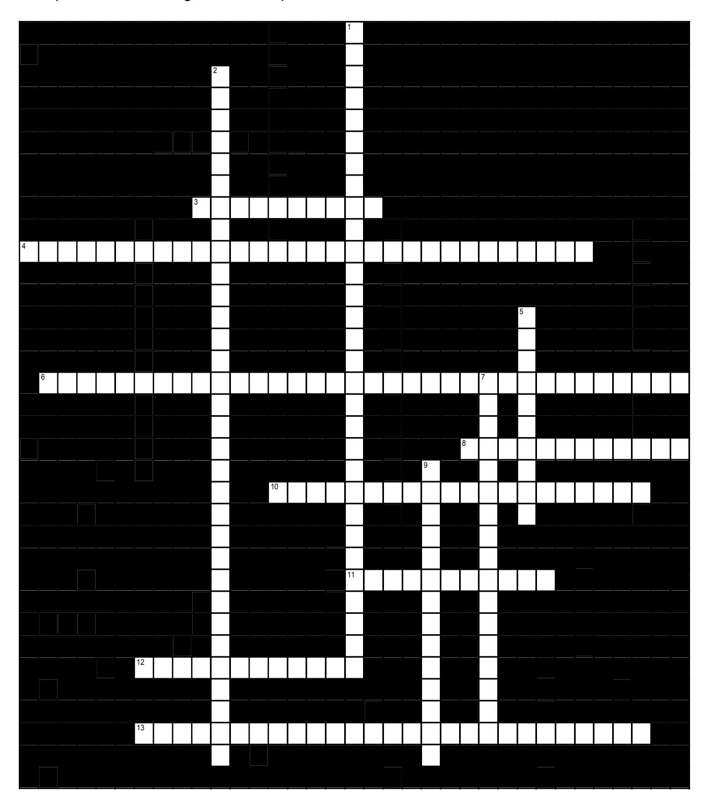

**Figure 21.18** Renal anatomy 1.

### **Across**

**3** The medial surface is concave and has a(n) \_\_\_ (or \_\_\_) where ureters, blood vessels, nerves and lymphatics enter and leave the kidney. (5,5)

**4** Blood leaves the glomerulus via the \_\_\_ arterioles, which take it to a second capillary bed called the \_\_\_ \_\_\_. (8,11,11)

**6** Each renal pyramid projects into a tube within the renal sinus which conducts urine out from the kidney. The projection itself is called the \_\_\_ \_\_\_; the tube which it enters is called a(n) \_\_\_ \_\_\_ (the plural is "\_\_\_ \_\_\_') (5,7,5,5,5,7)

**8** The kidneys are encased in a fibrous layer of connective tissue called the \_\_\_ \_\_\_. (5,7)

**10** The renal cortex surrounds the \_\_\_; columns of corticular tissue extend toward the hilum, separating it into distinct regions called \_\_\_. (7,5,8)

**11** Most of the blood reaching the kidneys flows to the \_\_\_ \_\_\_, where it is filtered. (5,6)

**12** Columns of tissue in the corticular region that extend to the hilum are called the \_\_\_. (5,7)

**13** Urine is formed by each of two \_\_\_. From each, a muscular tube called the \_\_\_ propels urine to the \_\_\_ where it is stored until its release. Then it flows out of the body through the \_\_\_. (7,6,7,7)

### **Down**

**1** Many small arteries arise in the cortex and are called the \_\_\_ arteries; these supply blood to the \_\_\_ arterioles and the \_\_\_\_. (12,8,10)

**2** The kidneys are \_\_\_ to the peritoneum. Each lies in the \_\_\_ \_\_\_ region, anterior to the \_\_\_ \_\_\_, but the right is slightly lower than the left to make room for the \_\_\_. (9,5,6,4,3,5)

**5** Several minor calyces merge to form a(n) \_\_\_. (5,5)

**7** Blood flows to the renal cortex through the \_\_\_ arteries, then arches around the renal lobes just below the cortex via the \_\_\_ arteries. (10,7)

**9** Each renal pyramid and the corticular tissue surrounding it is called a(n) \_\_\_. The term "\_\_\_' refers to these units. (5,4,5)

Figure 21.19 Renal anatomy 2.

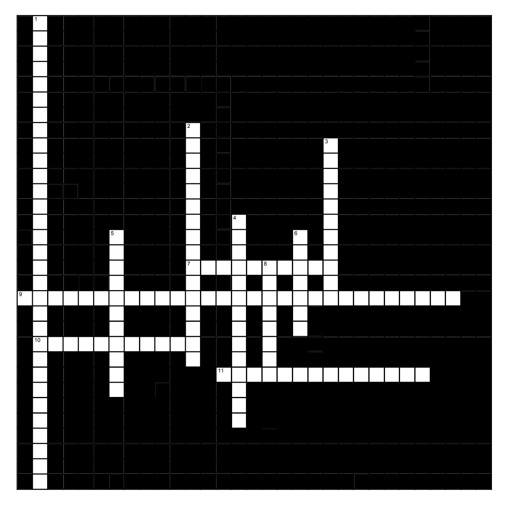

**Figure 21.19** Renal anatomy 2.

### **Across**

**7** In \_\_\_ the liquid components of the blood are separated from the formed elements and large molecules. (10)

**9** There are three processes involved in urine formation: \_\_\_, \_\_\_ and \_\_\_ (10,10,9)

**10** \_\_\_ is another word for urination (11)

**11** The muscular layer which comprises the bulk of the bladder is the \_\_\_ muscle. It consists of \_\_\_ muscle fibers arranged in three layers. (8,6)

### **Down**

**1** In males, the urethra has three regions: the \_\_\_ urethra under the bladder, the \_\_\_ ( or \_\_\_) urethra within the penis and the \_\_\_ urethra which connects them. (9,6,6,10)

**2** Blood to the glomerulus is supplied by the \_\_\_\_\_ arteriole and leaves by the \_\_\_\_\_ arteriole. (16)

**3** Resorption of calcium is controlled by \_\_\_ It is not unusual that the resorption of most minerals is controlled by \_\_\_\_\_. (3,8)

**4** When peritubular cells in the kidney become hypoxic, they secrete \_\_\_ to stimulate the formation of more oxygen-carrying red blood cells. (14)

**5** Calcium resorption is controlled by \_\_\_ hormone. (11)

**6** At the base of the bladder the two ureter openings and the urethral opening form a triangle; the region of the bladder encompassed by this triangle is called the \_\_\_. (7)

**8** In females the outer urethral opening is immediately \_\_\_ to the vaginal opening. (8)

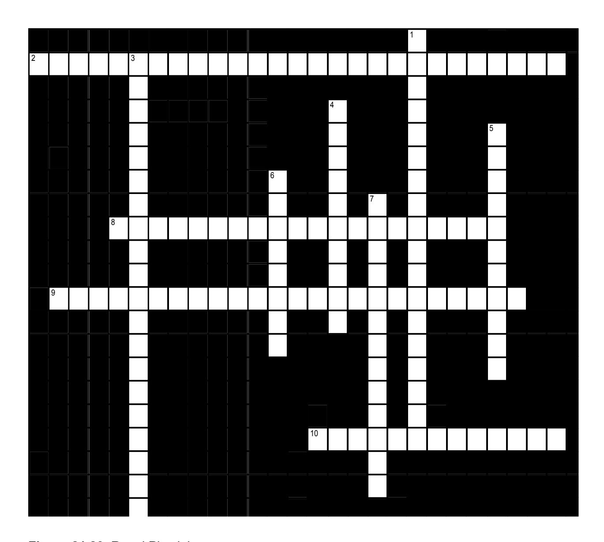

**Figure 21.20** Renal Physiology.

### **Across**

**2** The tubular portion of the nephron is divided into several sections both functionally and conceptually; the tube farthest from the renal corpuscle is the \_\_\_ \_ Its primary function is to resorb \_\_\_\_. (6,10,6,5)

**8** Each nephron has two major parts: the \_\_\_ \_\_\_ in the cortex and a thin \_\_\_, u- shaped the center, which extends from the cortex into the medulla and back. (5,9,6)

**9** The renal corpuscle has two arts: the central portion is a tangled ball of capillaries called the \_\_\_. The surrounding outer portion, a double-walled, cup- like chamber is called the\_\_\_ \_\_\_. (10,7,7)

**10** \_\_\_ \_\_\_ forces liquid to leave the capillaries in the glomerulus, while the formed elements and large molecules remain behind. (5,8)

### **Down**

**1** There are two types of nephrons, the glomerulus of \_\_\_\_ nephrons is near the medulla and the tubule of these nephrons travels \_\_\_ into the renal pyramid. (14,4)

**3** The proximal and distal tubules of the nephron are connected by a hairpin-like loop called the \_\_\_ \_\_ \_\_\_. Its primary function is to resorb \_\_\_ and \_\_\_. (4,2,5,5,4)

**4** There are two types of nephrons, most are \_\_\_ nephrons. Each of these has a glomerulus which is near the outer surface of the cortex. (10)

**5** The function of the renal corpuscle is to \_\_\_ \_\_\_ in the first step of urine formation. (6,5)

**6** \_\_\_ are structures within the kidney that actually sort the substances which should be kept or discarded. (8)

**7** Glomerular capillaries contain many \_\_\_ through which liquid can pass. (13)

## **Keys**

## **Crosswords**

## **Figure 21.18. Renal Anatomy 1**

-   **Across**: **3** Hilum hilus, **4** Efferent peritubular capillaries, **6** Renal papilla minor calyx minor calyces, **8** Renal capsule, **10** Medulla renal pyramids, **11** Renal cortex, **12** Renal columns, **13** Kidneys ureter bladder urethra.
-   **Down**: **1** Interlobular afferent glomerulus, **2** Posterior upper lumbar 12th rib liver, **5** Major calyx, **7** Interlobar arcuate, **9** Renal lobe lobar.

#### **Figure 21.19. Renal Anatomy 2**

-   **Across: 7** Filtration, **9** Filtration resorption secretion, **10** Micturition, **11** Detrusor smooth.
-   **Down: 1** Prostatic spongy penile membranous, **2** Afferent efferent, **3** PTH hormones, **4** Erythropoietin, **5** Parathyroid, **6** Trigone, **8** Anterior.

#### **Figure 21.20. Renal Physiology**

-   **Across: 2** PTH hormones, **8** Prostatic spongy penile membranous, **9** Filtration resorption secretion, **10** Anterior.
-   **Down: 1** Juxtamedullary, deep, **3** Loop of Henle, water, salt, **4** Corticular, **5** Filter, blood, **6** Nephrons**, 7** Fenestrations,

### **Figure 21.16 Juxtamedullary Nephron Key:**

1.  Renal pyramid
2.  Interlobular artery
3.  Renal artery
4.  Renal vein
5.  Renal hilum
6.  Renal pelvis
7.  Ureter
8.  Minor calyx
9.  Renal capsule
10. Inferior extremity
11. Superior extremity
12. Interlobar vein
13. Nephron
14. Renal sinus
15. Major calyx
16. Renal papilla
17. Renal column

### **Chapter 21: Urinary System Glossary**

| Terms | Definitions |
|----|----|
| Afferent arteriole | an arteriole that feeds blood into the glomerulus in the nephron |
| anatomical sphincter | smooth or skeletal muscle surrounding the lumen of a vessel or hollow organ that can restrict flow when contracted |
| angiotensin I | protein produced by the enzymatic action of renin on angiotensinogen; inactive precursor of angiotensin II |
| angiotensin II | protein produced by the enzymatic action of ACE on inactive angiotensin I; actively causes vasoconstriction and stimulates aldosterone release by the adrenal cortex |
| Arcuate vein | a vessel of the renal circulation located at the border of the renal cortex and renal medulla |
| angiotensin- converting enzyme (ACE) | enzyme produced by the lungs that catalyzes the reaction of inactive angiotensin I into active angiotensin II |
| angiotensinogen | inactive protein in the circulation produced by the liver; precursor of angiotensin I; must be modified by the enzymes renin and ACE to be activated |
| anuria | absence of urine produced; production of 50 mL or less per day |
| aquaporin | protein-forming water channels through the lipid bilayer of the cell; allows water to cross; activation in the collecting ducts is under the control of ADH |
| Bowman's capsule (glomerular capsule) | cup-shaped sack lined by a simple squamous epithelium (parietal surface) and specialized cells called podocytes (visceral surface) that participate in the filtration process; receives the filtrate which then passes on to the PCTs |
| brush border | formed by microvilli on the surface of certain cuboidal cells; in the kidney it is found in the PCT; increases surface area for absorption in the kidney |
| calyces | cup-like structures receiving urine from the collecting ducts where it passes on to the renal pelvis and ureter |
| cortical nephrons | nephrons with loops of Henle that do not extend into the renal medulla |
| Corticular radiate vein (interlobar vein) | veins of the renal circulation which drain the renal lobes. |
| countercurrent | multiplier system involves the descending and ascending loops of Henle directing forming urine in opposing directions to create a concentration gradient when combined with variable permeability and sodium pumping |
| detrusor muscle | smooth muscle in the bladder wall; fibers run in all directions to reduce the size of the organ when emptying it of urine |
| distal convoluted tubules | portions of the nephron distal to the loop of Henle that receive hypoosmotic filtrate from the loop of Henle and empty into collecting ducts |
| diuretic | compound that increases urine output, leading to decreased water conservation |
| efferent arteriole | arteriole carrying blood from the glomerulus to the capillary beds around the convoluted tubules and loop of Henle; portion of the portal system |
| endothelins | group of vasoconstrictive, 21-amino acid peptides; produced by endothelial cells of the renal blood vessels, mesangial cells, and cells of the DCT |
| external urinary sphincter | skeletal muscle; must be relaxed consciously to void urine |
| fenestrations | small windows through a cell, allowing rapid filtration based on size; formed in such a way as to allow substances to cross through a cell without mixing with cell contents |
| filtration slits | formed by pedicels of podocytes; substances filter between the pedicels based on size |
| forming urine | filtrate undergoing modifications through secretion and reabsorption before true urine is produced |
| glomerular filtration rate (GFR) | rate of renal filtration |
| glomerulus | tuft of capillaries surrounded by Bowman's capsule; filters the blood based on size |
| glycosuria | presence of glucose in the urine; caused by high blood glucose levels that exceed the ability of the kidneys to reabsorb the glucose; usually the result of untreated or poorly controlled diabetes mellitus |
| hilum | a depression or fissure in an organ where structures such as blood vessels and nerves enter or exit |
| incontinence | loss of ability to control micturition |
| intercalated cell | specialized cell of the collecting ducts that secrete or absorb acid or bicarbonate; important in acid-base balance |
| Interlobar vein | See corticular radiate vein |
| internal urinary sphincter | smooth muscle at the juncture of the bladder and urethra; relaxes as the bladder fills to allow urine into the urethra |
| inulin | plant polysaccharide injected to determine GFR; is neither secreted nor absorbed by the kidney, so its appearance in the urine is directly proportional to its filtration rate |
| juxtaglomerular apparatus (JGA) | located at the juncture of the DCT and the afferent and efferent arterioles of the glomerulus; plays a role in the regulation of renal blood flow and GFR |
| juxtaglomerular cell | modified smooth muscle cells of the afferent arteriole; secretes renin in response to a drop in blood pressure |
| juxtamedullary nephrons | nephrons adjacent to the border of the cortex and medulla with loops of Henle that extend into the renal medulla |
| leaky tight junctions | tight junctions in which the sealing strands of proteins between the membranes of adjacent cells are fewer in number and incomplete; allows limited intercellular movement of solvent and solutes |
| leukocyte esterase | enzyme produced by leukocytes that can be detected in the urine and that serves as an indirect indicator of urinary tract infection |
| loop of Henle | descending and ascending portions between the proximal and distal convoluted tubules; those of cortical nephrons do not extend into the medulla, whereas those of juxtamedullary nephrons do extend into the medulla |
| macula densa | cells found in the part of the DCT forming the JGA; sense Na+ concentration in the forming urine |
| Major calyces | a larger funnel-shaped structure in the kidney that receives urine from two or more minor calyces. |
| medulla (renal medulla) | inner region of kidney containing the renal pyramids |
| mesangial contractile cells | cells found in the glomerulus; can contract or relax to regulate filtration rate |
| micturition | urination or voiding |
| minor calyces | minor calyces form a cup-shaped drain around the apex of the renal pyramids. |
| myogenic mechanism | mechanism by which smooth muscle responds to stretch by contracting; an increase in blood pressure causes vasoconstriction and a decrease in blood pressure causes vasodilation so that blood flow downstream remains steady |
| nephrons | functional units of the kidney that carry out all filtration and modification to produce urine; consist of renal corpuscles, proximal and distal convoluted tubules, and descending and ascending loops of Henle; drain into collecting ducts |
| net filtration pressure (NFP) | Pressure of fluid across the glomerulus; calculated by taking the hydrostatic pressure of the capillary and subtracting the colloid osmotic pressure of the blood and the hydrostatic pressure of Bowman's capsule |
| oliguria | below normal urine production of 400-500 mL/day |
| osteomalacia | softening of bones due to a lack of mineralization with calcium and phosphate; most often due to lack of vitamin D; in children, osteomalacia is termed rickets; not to be confused with osteoporosis |
| pedicels | finger-like projections of podocytes surrounding glomerular capillaries; interdigitate to form a filtration membrane |
| peritubular capillaries | second capillary bed of the renal portal system; surround the proximal and distal convoluted tubules; associated with the vasa recta |
| physiological sphincter | sphincter consisting of circular smooth muscle indistinguishable from adjacent muscle but possessing differential innervations, permitting its function as a sphincter; structurally weak |
| podocytes | cells forming finger-like processes; form the visceral layer of Bowman's capsule; pedicels of the podocytes interdigitate to form a filtration membrane |
| polyuria | urine production in excess of 2.5 L/day; may be caused by diabetes insipidus, diabetes mellitus, or excessive use of diuretics |
| principal cell | cell found in collecting ducts and possess channels for the recovery or loss of sodium and potassium; under the control of aldosterone; also have aquaporin channels under ADH control to regulate recovery of water |
| proximal convoluted tubules (PCTs) | tortuous tubules receiving filtrate from Bowman's capsule; most active part of the nephron in reabsorption and secretion |
| renal columns | extensions of the renal cortex into the renal medulla; separates the renal pyramids; contains blood vessels and connective tissues |
| renal corpuscle | consists of the glomerulus and Bowman's capsule |
| renal cortex | outer part of kidney containing all of the nephrons; some nephrons have loops of Henle extending into the medulla |
| renal fat pad | adipose tissue between the renal fascia and the renal capsule that provides protective cushioning to the kidney |
| renal hilum | recessed medial area of the kidney through which the renal artery, renal vein, ureters, lymphatics, and nerves pass |
| renal papillae | medullary area of the renal pyramids where collecting ducts empty urine into the minor calyces |
| Renal pelvis |  |
| renal pyramids | six to eight cone-shaped tissues in the medulla of the kidney containing collecting ducts and the loops of Henle of juxtamedullary nephrons |
| Renal vein | large-caliber veins that drain blood filtered by the kidneys into the inferior vena cava. |
| renin | enzyme produced by juxtaglomerular cells in response to decreased blood pressure or sympathetic nervous activity; catalyzes the conversion of angiotensinogen into angiotensin I |
| retroperitoneal | behind the peritoneum; in the case of the kidney and ureters, between the parietal peritoneum and the abdominal wall |
| sacral micturition center | group of neurons in the sacral region of the spinal cord that controls urination; acts reflexively unless its action is modified by higher brain centers to allow voluntary urination |
| specific gravity | weight of a liquid compared to pure water, which has a specific gravity of 1.0; any solute added to water will increase its specific gravity |
| systemic edema | increased fluid retention in the interstitial spaces and cells of the body; can be seen as swelling over large areas of the body, particularly the lower extremities |
| Transitional epithelium | a type of stratified epithelium. Transitional epithelium is a type of tissue that changes shape in response to stretching. |
| trigone | area at the base of the bladder marked by the two ureters in the posterior-lateral aspect and the urethral orifice in the anterior aspect oriented like points on a triangle |
| tubuloglomerular feedback | feedback mechanism involving the JGA; macula densa cells monitor Na+ concentration in the terminal portion of the ascending loop of Henle and act to cause vasoconstriction or vasodilation of afferent and efferent arterioles to alter GFR |
| ureter | The long, narrow duct that conveys urine from the kidney to the urinary bladder |
| urethra | transports urine from the bladder to the outside environment |
| Urinary bladder | An elastic, muscular sac situated in the anterior part of the pelvic cavity in which urine collects before excretion |
| urinalysis | analysis of urine to diagnose disease |
| urochrome | heme-derived pigment that imparts the typical yellow color of urine |
| vasa recta | branches of the efferent arterioles that parallel the course of the loops of Henle and are continuous with the peritubular capillaries; with the glomerulus, form a portal system |
