# **Reproductive System: The Male Reproductive System**

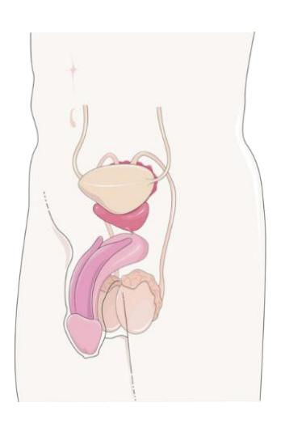

**Figure 22.1** The Male Reproductive System.

## **Objectives**

In this laboratory, you will use models, diagrams, and histological samples to study the anatomy of the male reproductive system. As you study this organization, remember that a male's reproductive system is responsible for not just producing male gametes, but also transporting for these gametes to the female reproductive tract, as well as secreting the reproductive hormone testosterone.

## **Learning Objectives:**

By the end of this lesson, you will be able to:

-   Identify the general functions of the male's reproductive tract.
-   Identify and describe the structures and functions that contribute to the male's reproductive system. You will have to identify each in a model, diagram, or in a specimen.
-   Follow the pathway taken by sperm from its site of formation to the body's exterior.
-   Understand the microanatomical organization of the testis and sperm.
-   List and describe the hormones regulating the production of sperm and identify their origin.
-   Identify the following structural and functional components of the important structures listed below:

### **Male Reproductive System**

-   Testes

    -   Seminiferous tubules
    -   Spermatozoa
    -   Scrotum

-   Epididymis

-   Ductus deferens

-   Spermatic cord

-   Ejaculatory duct

-   Urethra

-   Prostatic urethra

-   Membranous urethra

-   Spongy urethra

-   Penis

    -   Corpora cavernosa
    -   Corpus spongiosum

-   Glans penis

-   Prepuce

-   External urethral orifice

### **Sperm cell**

-   Acrosome
-   Head

## **Accessory structures**

-   Seminal gland

-   Prostate gland

-   Midpiece

-   Flagellum

-   Bulbourethral gland

## **Prelab Activities**

## **Male Reproductive System**

## **Prelab Activity 22.1: Definitions**

Complete the essential definitions before you come into the lab:

-   Testes \_\_\_\_\_\_\_\_\_\_\_\_\_\_\_\_\_\_\_\_\_\_\_\_\_\_\_\_\_\_\_\_\_\_\_\_\_\_\_\_\_\_\_\_\_\_\_\_\_\_\_\_\_\_\_\_\_\_
    -   Seminiferous tubules \_\_\_\_\_\_\_\_\_\_\_\_\_\_\_\_\_\_\_\_\_\_\_\_\_\_\_\_\_\_\_\_\_\_\_\_\_\_\_\_\_\_
    -   Spermatozoa \_\_\_\_\_\_\_\_\_\_\_\_\_\_\_\_\_\_\_\_\_\_\_\_\_\_\_\_\_\_\_\_\_\_\_\_\_\_\_\_\_\_\_\_\_\_\_\_
-   Scrotum \_\_\_\_\_\_\_\_\_\_\_\_\_\_\_\_\_\_\_\_\_\_\_\_\_\_\_\_\_\_\_\_\_\_\_\_\_\_\_\_\_\_\_\_\_\_\_\_\_\_\_\_\_\_\_\_\_
-   Epididymis \_\_\_\_\_\_\_\_\_\_\_\_\_\_\_\_\_\_\_\_\_\_\_\_\_\_\_\_\_\_\_\_\_\_\_\_\_\_\_\_\_\_\_\_\_\_\_\_\_\_\_\_\_\_\_
-   Ductus deferens \_\_\_\_\_\_\_\_\_\_\_\_\_\_\_\_\_\_\_\_\_\_\_\_\_\_\_\_\_\_\_\_\_\_\_\_\_\_\_\_\_\_\_\_\_\_\_\_\_\_\_
-   Spermatic cord \_\_\_\_\_\_\_\_\_\_\_\_\_\_\_\_\_\_\_\_\_\_\_\_\_\_\_\_\_\_\_\_\_\_\_\_\_\_\_\_\_\_\_\_\_\_\_\_\_\_\_\_
-   Ejaculatory duct \_\_\_\_\_\_\_\_\_\_\_\_\_\_\_\_\_\_\_\_\_\_\_\_\_\_\_\_\_\_\_\_\_\_\_\_\_\_\_\_\_\_\_\_\_\_\_\_\_\_\_
-   Urethra \_\_\_\_\_\_\_\_\_\_\_\_\_\_\_\_\_\_\_\_\_\_\_\_\_\_\_\_\_\_\_\_\_\_\_\_\_\_\_\_\_\_\_\_\_\_\_\_\_\_\_\_\_\_\_\_\_\_
-   Prostatic urethra \_\_\_\_\_\_\_\_\_\_\_\_\_\_\_\_\_\_\_\_\_\_\_\_\_\_\_\_\_\_\_\_\_\_\_\_\_\_\_\_\_\_\_\_\_\_\_\_\_\_\_
-   Membranous urethra \_\_\_\_\_\_\_\_\_\_\_\_\_\_\_\_\_\_\_\_\_\_\_\_\_\_\_\_\_\_\_\_\_\_\_\_\_\_\_\_\_\_\_\_\_\_\_
    -   Spongy urethra \_\_\_\_\_\_\_\_\_\_\_\_\_\_\_\_\_\_\_\_\_\_\_\_\_\_\_\_\_\_\_\_\_\_\_\_\_\_\_\_\_\_\_\_\_\_
-   Penis \_\_\_\_\_\_\_\_\_\_\_\_\_\_\_\_\_\_\_\_\_\_\_\_\_\_\_\_\_\_\_\_\_\_\_\_\_\_\_\_\_\_\_\_\_\_\_\_\_\_\_\_\_\_\_\_\_\_\_
    -   Corpora cavernosa \_\_\_\_\_\_\_\_\_\_\_\_\_\_\_\_\_\_\_\_\_\_\_\_\_\_\_\_\_\_\_\_\_\_\_\_\_\_\_\_\_\_\_
    -   Corpus spongiosum \_\_\_\_\_\_\_\_\_\_\_\_\_\_\_\_\_\_\_\_\_\_\_\_\_\_\_\_\_\_\_\_\_\_\_\_\_\_\_\_\_\_
-   Glans penis \_\_\_\_\_\_\_\_\_\_\_\_\_\_\_\_\_\_\_\_\_\_\_\_\_\_\_\_\_\_\_\_\_\_\_\_\_\_\_\_\_\_\_\_\_\_\_\_\_\_\_\_\_\_
-   Prepuce \_\_\_\_\_\_\_\_\_\_\_\_\_\_\_\_\_\_\_\_\_\_\_\_\_\_\_\_\_\_\_\_\_\_\_\_\_\_\_\_\_\_\_\_\_\_\_\_\_\_\_\_\_\_\_\_\_
-   External urethral orifice \_\_\_\_\_\_\_\_\_\_\_\_\_\_\_\_\_\_\_\_\_\_\_\_\_\_\_\_\_\_\_\_\_\_\_\_\_\_\_\_\_\_\_\_\_
-   Sperm cell \_\_\_\_\_\_\_\_\_\_\_\_\_\_\_\_\_\_\_\_\_\_\_\_\_\_\_\_\_\_\_\_\_\_\_\_\_\_\_\_\_\_\_\_\_\_\_\_\_\_\_\_\_\_\_
-   Acrosome \_\_\_\_\_\_\_\_\_\_\_\_\_\_\_\_\_\_\_\_\_\_\_\_\_\_\_\_\_\_\_\_\_\_\_\_\_\_\_\_\_\_\_\_\_\_\_\_\_\_\_\_\_\_\_\_
-   Head \_\_\_\_\_\_\_\_\_\_\_\_\_\_\_\_\_\_\_\_\_\_\_\_\_\_\_\_\_\_\_\_\_\_\_\_\_\_\_\_\_\_\_\_\_\_\_\_\_\_\_\_\_\_\_\_\_\_\_
-   Midpiece \_\_\_\_\_\_\_\_\_\_\_\_\_\_\_\_\_\_\_\_\_\_\_\_\_\_\_\_\_\_\_\_\_\_\_\_\_\_\_\_\_\_\_\_\_\_\_\_\_\_\_\_\_\_\_\_\_
-   Flagellum \_\_\_\_\_\_\_\_\_\_\_\_\_\_\_\_\_\_\_\_\_\_\_\_\_\_\_\_\_\_\_\_\_\_\_\_\_\_\_\_\_\_\_\_\_\_\_\_\_\_\_\_\_\_\_\_

## **Accessory structures**

-   Seminal gland \_\_\_\_\_\_\_\_\_\_\_\_\_\_\_\_\_\_\_\_\_\_\_\_\_\_\_\_\_\_\_\_\_\_\_\_\_\_\_\_\_\_\_\_\_\_\_\_\_\_\_\_
-   Prostate gland \_\_\_\_\_\_\_\_\_\_\_\_\_\_\_\_\_\_\_\_\_\_\_\_\_\_\_\_\_\_\_\_\_\_\_\_\_\_\_\_\_\_\_\_\_\_\_\_\_\_\_\_
-   Bulbourethral gland \_\_\_\_\_\_\_\_\_\_\_\_\_\_\_\_\_\_\_\_\_\_\_\_\_\_\_\_\_\_\_\_\_\_\_\_\_\_\_\_\_\_\_\_\_\_\_\_

## **Prelab Activity 22.2: Identifications:**

Identify and label the structures found in figures 22.2 and 22.3.

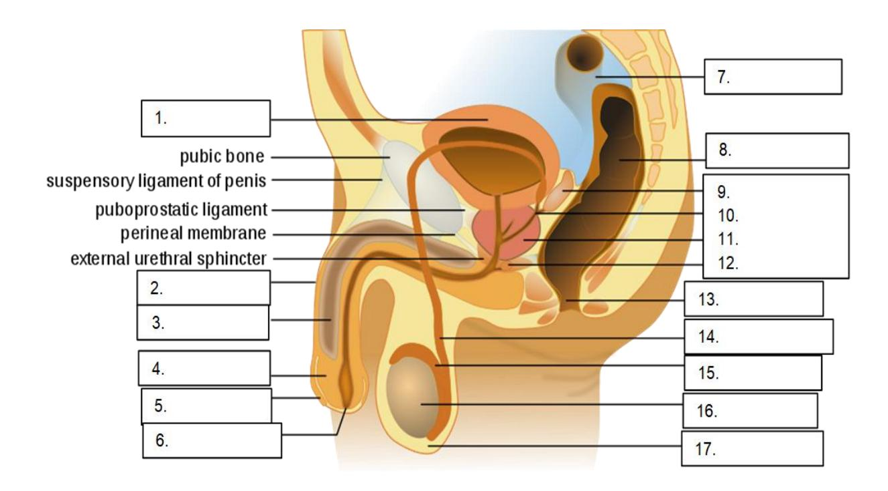

**Figure 22.2** Male Anatomy, Unlabeled.

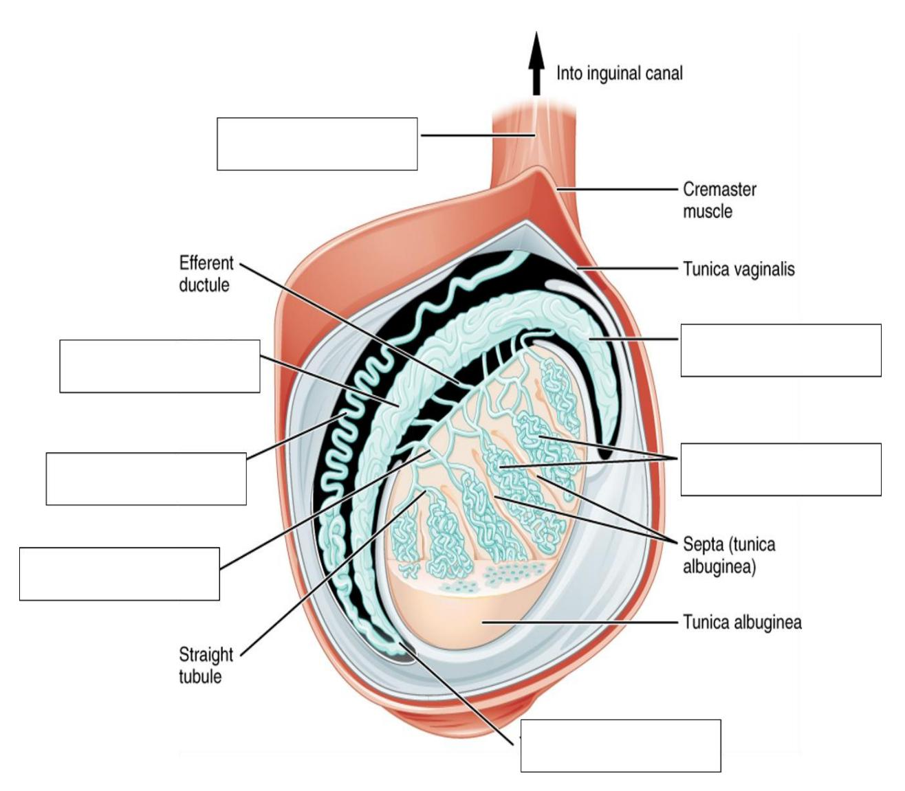

Figure 22.3 Human Testicle, Unlabeled.

## **Lab Activities**

## **Lab Activity 22.1**:

-   Obtain a 3D free-standing model or Hubbard Scientific plaque of the male reproductive system from the storage area.
-   Identify and label, using labeling tape, all of the reproductive structures listed in the lists below for figure 22.2.
-   Ask your instructor to confirm the correctness of your identifications.
-   Create an enumerated model using the labeling tape to use as a practice quiz. Invite the neighboring group to take the practice quiz during the lab.
-   Photograph your work for later use as a study guide.
-   If time allows make a five-minute video reviewing the parts and functions of the male reproductive system.

## **Male Reproductive System Terms**

-   Testes

    -   Seminiferous tubules
    -   Spermatozoa
    -   Scrotum

-   Epididymis

-   Ductus deferens

-   Spermatic cord

-   Ejaculatory duct

-   Urethra

    -   Prostatic urethra
    -   Membranous urethra
    -   Spongy urethra

-   Penis

    -   Corpora cavernosa
    -   Corpus spongiosum

-   Glans penis

-   Prepuce

-   External urethral orifice

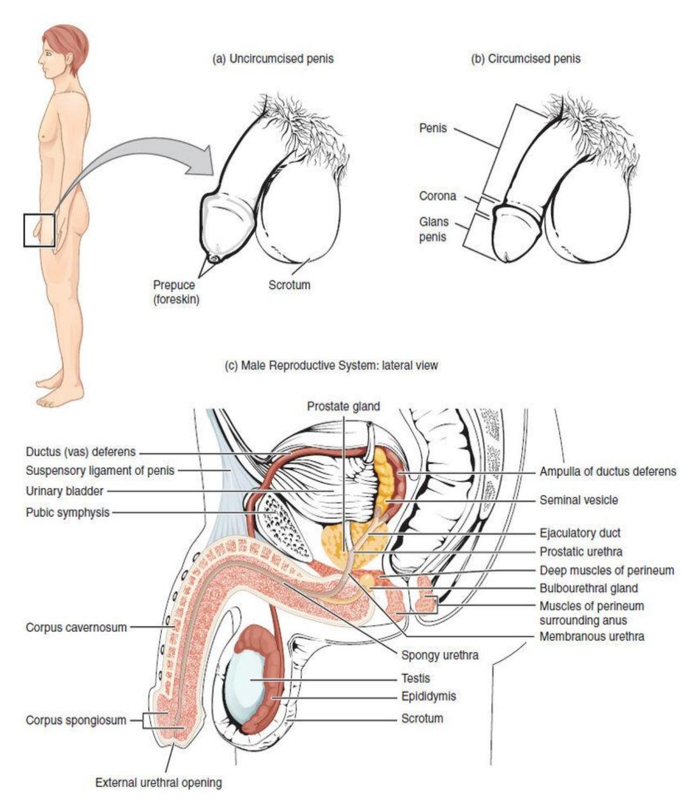

**Figure 22.4** Male Reproductive Structures.

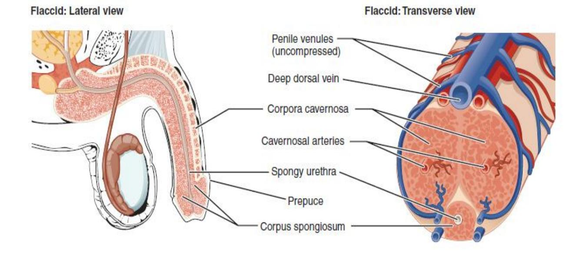

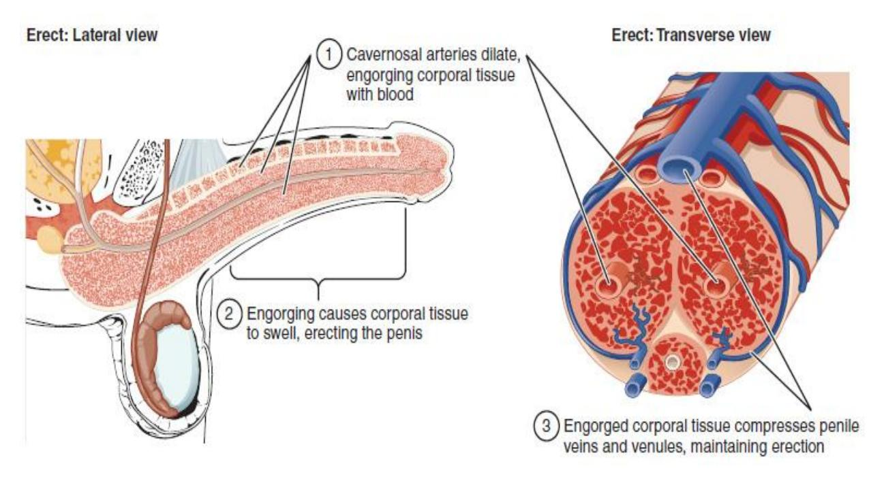

Figure 22.5 The Penile Erectile Tissue.

Obtain a 3D free-standing model of the testes and epididymis from the storage area.

-   Identify and label, using labeling tape, all of the reproductive structures listed in the lists below for figure 22.2.
-   Ask your instructor to confirm the correctness of your identifications.
-   Photograph your work for later use as a study guide.
-   If time allows make a five-minute video reviewing the parts and functions of the male reproductive system.

## **Testicular structure Terms**

-   Testes
    -   Seminiferous tubules
    -   Spermatozoa
-   Epididymis
-   Ductus deferens
-   Spermatic cord

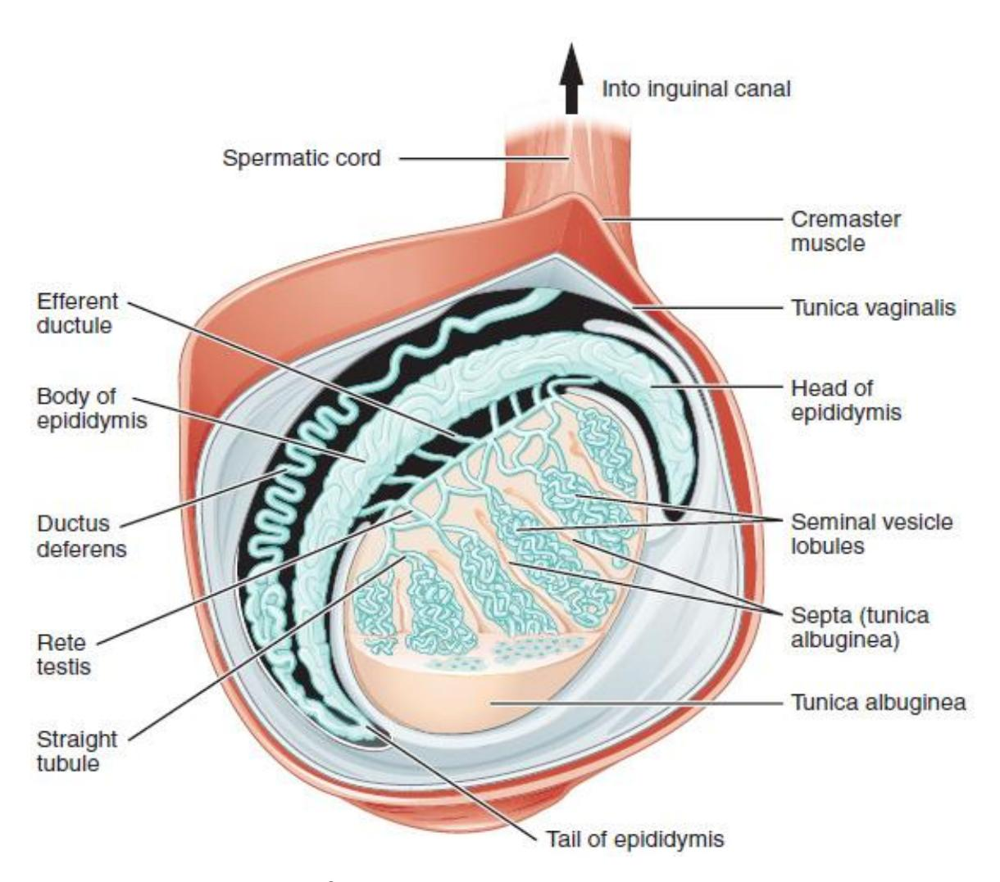

**Figure 22.6** Illustration of the Human Testicle.

## **Lab Activity 22.3:**

Using a Hubbard Scientific plaque of the male reproductive system from the storage area, identify and label, using labeling tape, all of the components of a sperm cell listed in the lists below for figure 22.5.

-   Photograph your work for later use as a study guide.
-   If time allows make a five-minute video reviewing the parts and functions of the male reproductive system.
-   Microscope identification: optional:
    -   With the direction of your instructor get a microscope and a slide of bull sperm from the storage cabinet in the lab.
    -   Focus on the sperm at 400X and identify the parts of a sperm cell.

## **Sperm Cell Terms**

-   Acrosome

-   Head

-   Midpiece

-   Flagellum

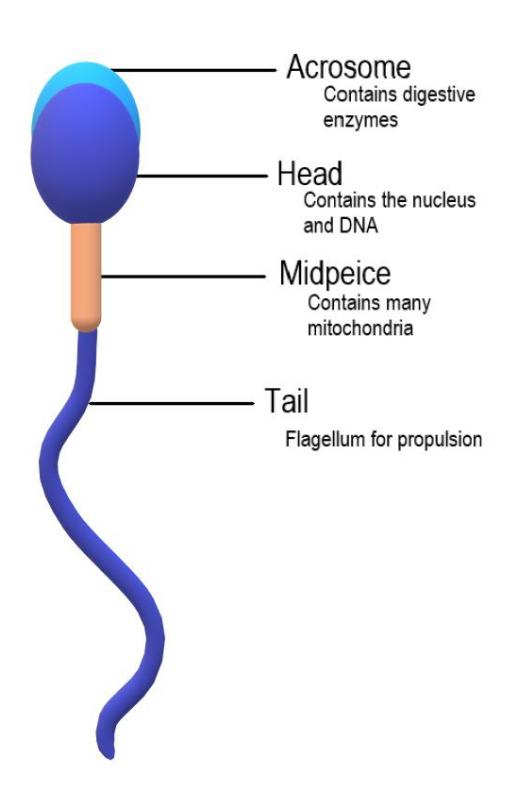

**Figure 22.7** Anatomy of the Sperm Cell.

## **Review links**

-   Male Reproductive System Models Ohio University Human Anatomy Professor Klein's College Human Anatomy & Physiology. [**https://youtu.be/xuh6cutU-Q0?si=CRmqJLcup1KrHkDE**](https://youtu.be/xuh6cutU-Q0?si=CRmqJLcup1KrHkDE){.uri}.
-   https://youtu.be/gRYmvZek8as?si=3Gea7ZAuYHI7ZFpGThis video explains the male reproductive system. Mainly the penis and testes which are the most important organs of this system. A review of the male reproductive model using a freestanding model. Dr. R. Droual. . [https://www.dnatube.com/video/5258/Male-Reproductive-Model.](https://www.dnatube.com/video/5258/Male-Reproductive-Model) Note: to initiate and/or download this video you need to skip the ad.
-   Watch this review of the male reproductive system. Quick visual anatomy models review. Doc4teaching Health Science. [https://youtu.be/VF9w9F1FOiE?si=uwj0emMznB5KmPsm.](https://youtu.be/VF9w9F1FOiE?si=uwj0emMznB5KmPsm)
-   Watch this **video (http://openstaxcollege.org/l/spermpath)** to explore the structures of the male reproductive system and the path of sperm that starts in the testes and ends as the sperm leave the penis through the urethra. Where is sperm deposited after they leave the ejaculatory duct?

## **Post Lab Activities**

## **Test your understanding.**

## **Post Lab Activity 22.1**

Identify the structures in figure 22.8

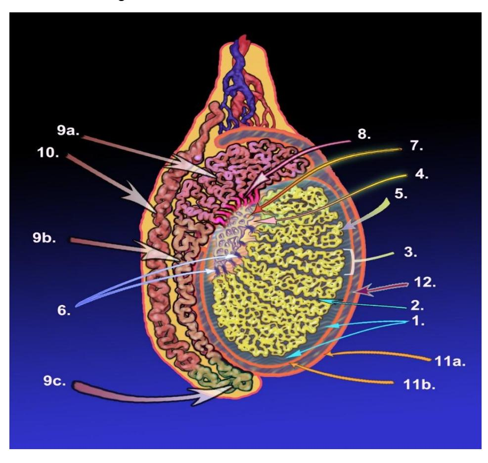

**Figure 22.8** An Illustration of an Adult Human Testicle

**Table 22.1: Identify the Following Structures of the Testicle**

| Structure Number | Structure Name |
|------------------|----------------|
| 5                |                |
| 7                |                |
| 9 (a, b, c)      |                |
| 10               |                |

Identify the structures in figure 22.9.

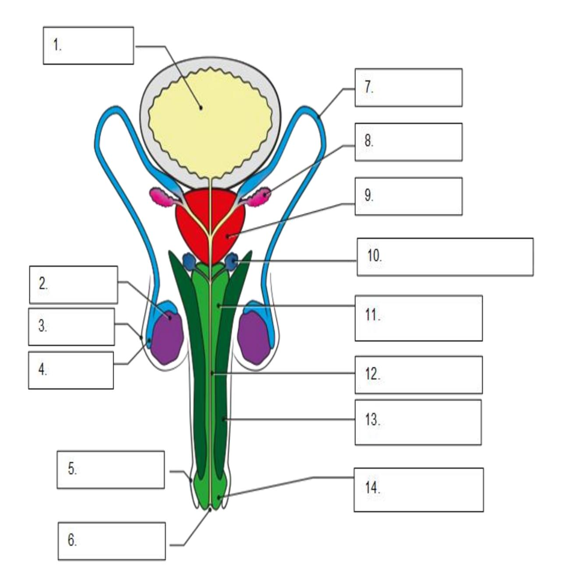

**Figure 22.9** Male Reproductive System with Labels for Identification.

## **Post-lab activity 22.2**

Fill in the table below with the appropriate structure identification.

| Structure name  | is  | directional term | to  | Second structure name |
|-----------------|-----|------------------|-----|-----------------------|
| scrotum         | Is  | posterior        | to  | penis                 |
| testes          | is  | inferior         | to  |                       |
|                 | is  | superior         | to  | prostate              |
| pubic symphysis | is  | anterior         | to  |                       |
|                 | is  | distal           | to  | prostate gland        |
|                 | is  | lateral          | to  | urethra               |

## **Post Lab Activity 22.3:**

Complete the questions below.

1.  What are male gametes called?

    a.  ova
    b.  sperm
    c.  testes
    d.  testosterone

2.  Leydig cells \_\_\_\_\_\_\_\_.

    a.  secrete testosterone.
    b.  activate the sperm flagellum.
    c.  support spermatogenesis
    d.  secrete seminal fluid.

3.  Briefly explain why mature gametes carry only one set of chromosomes.

4.  What special features are evident in sperm cells but not in somatic cells, and how do these specializations function?

5.  What do each of the three male accessory glands contribute to the semen?

6.  Follow the path of the sperm from its origin to its ejaculation in the vagina. Include all structures of the male reproductive tract that the sperm must swim traverse.

Note: There is no Post Lab Activity 22.4

## **Post Lab Activity 22.5: Crossword Puzzles**

Complete the following crossword puzzles.

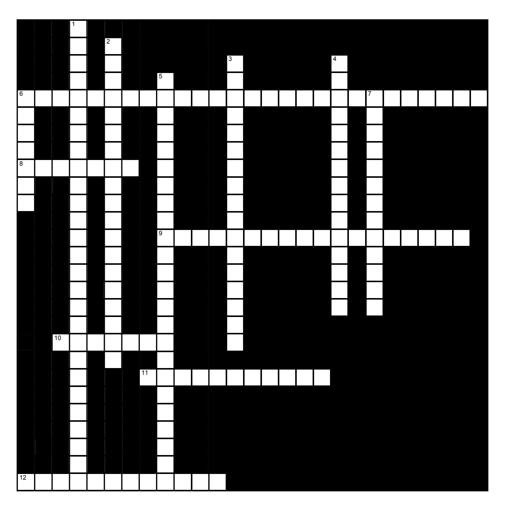

**Figure 22.10** Testes

### **Across**

**6** The testes are initially formed in the \_\_\_ cavity; but because sperm can only be produced if the testes temperature is \_\_\_ than the body, they descend before birth into the \_\_\_. (14,6,7)

**8** The \_\_\_ are regions that house the coiled seminiferous tubules. (7)

**9** Two types of cells are found in the seminiferous tubules, the \_\_\_ cells produce \_\_\_. (13,5)

**10** The primary sex organs in the male are the organs that actually produce \_\_\_. (7)

**11** Interstitial endocrine cells which surround the seminiferous tubules are called \_\_\_ \_\_\_. These produce male sex hormones. (6,5)

**12** Sperm, the gametes produced by the male, are produced by the \_\_\_ or \_\_\_. (6,6)

### **Down**

**1** Two types of cells are found in the seminiferous tubules, the \_\_\_ or \_\_\_ cells support and \_\_\_ the sperm. (20,7)

**2** Sperm production occurs in the \_\_\_ \_\_\_ (12,7)

**3** The \_\_\_\_ is a comma-shaped organ adjoining each testis. This is where sperm \_\_\_\_. (10,7)

**4** The production of sperm is called \_\_\_. (15)

**5** Sperm are stored up to several months in the tail of the \_\_\_ and the \_\_\_ \_\_\_ after which they are destroyed (10,6,8)

**6** When the male becomes sexually aroused, peristaltic contractions conduct sperm to the \_\_\_, the widest part of the ductus deferens and the final storage site for the sperm prior to ejaculation. (7)

**7** The ductus deferens, blood vessels, lymphatic vessels and nerves enter or leave the scrotom inside the \_\_\_ \_\_\_, a connective tissue tube. (9,4)

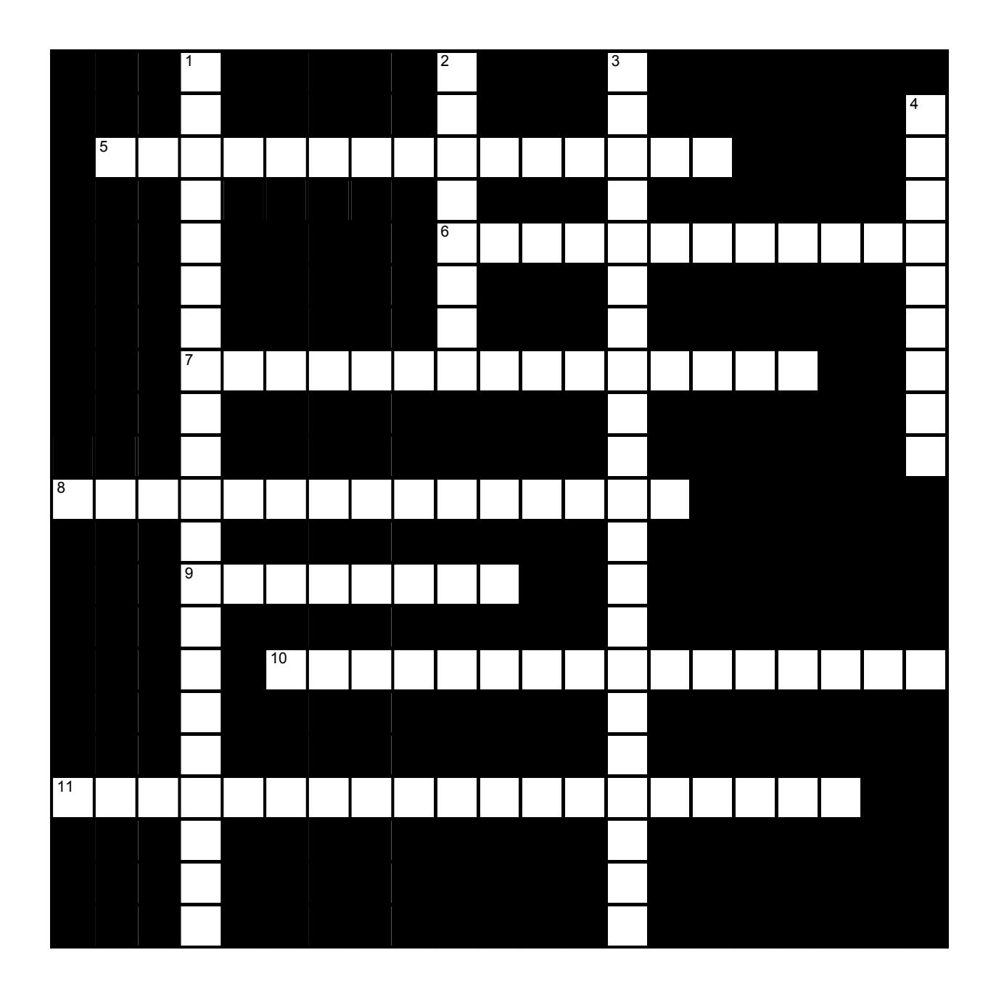

**Figure 22.11** Reproductive Anatomy

### **Across**

**5** The \_\_\_ \_\_\_ are adjacent to the ampulla of the ductus deferens, behind the bladder. They produce a bit more than half of the liquid which forms the semen. (7,8)

**6** Sperm maturation depends on \_\_\_, the hormone which controls it. (12)

**7** The glans penis is hidden by an encircling fold of skin called the \_\_\_ or \_\_\_. (7,8)

**8** The \_\_\_ gland is inferior to the bladder, surrounding the \_\_\_, and produces a bit less than half of the liquid which forms the semen. (8,7)

**9** In addition to the DNA, the tip of the sperm also contains the \_\_\_, a specialized lysosome which contains enzymes that allow the sperm to penetrate and egg's surface. (8)

**10** The urethra travels through one of the erectile bodies, the \_\_\_ \_\_\_. (6,10)

**11** The sperm is a specialized cell which swims well by using ATP supplied by many mitochondria in the \_\_\_; a long \_\_\_, or flagellum for propulsion; and a bullet shaped \_\_\_ which contains the \_\_\_, the genetic material. (8,4,4,3)

### **Down**

**1** Semen is a mixture of three major components: \_\_\_ fluid which contains fructose, buffers and factors that activate the sperm; \_\_\_ secretions, which include an antibiotic; and of course, the \_\_\_. (7,9,5)

**2** The penis consists largely of three long cylinders consisting of \_\_\_ tissue. (8)

**3** When a male becomes sexually excited and is approaching orgasm, the \_\_\_ or \_\_\_ glands secrete an alkaline, clear mucus into the urethra to neutralize any acidity remaining from the urine, preparing the way for the sperm. (13,8)

**4** The seminal vesicles, bulbourethral glands, and prostate glands are called the \_\_\_\_ organs. (9)

## **Keys**

## **Figure 22.10 Testes**

-   **Across: 6** Abdominopelvic cooler scrotum, **8** Lobules, **9** Spermatogenic sperm, **10** Gametes, **11** Leydig cells, **12** Testes testis.
-   **Down: 1** Sertoli sustentacular protect, **2** Seminiferous tubules, **3** Epididymis matures, **4** Spermatogenesis, **5** Epididymis ductus deferens, **6** Ampulla, **7** Spermatic cord.

## **Figure 22.11 Reproductive Anatomy**

-   **Across: 5** Seminal vesicles, **6** Testosterone, **7** Prepuce foreskin, **8** Prostate urethra, **9** Acrosome, **10** Corpus spongiosum, **11** Midpiece tail head DNA.
-   **Down: 1** Seminal prostatic sperm, **2** Erectile, **3** Bulbourethral Cowper's, **4** Accessory

### **Chapter 22 Reproductive Anatomy Glossary**

| Terms | Definitions |
|----|----|
| blood-testis barrier | tight junctions between Sertoli cells that prevent bloodborne pathogens from gaining access to later stages of spermatogenesis and prevent the potential for an autoimmune reaction to haploid sperm |
| bulbourethral glands (also, Cowper's glands) | glands that secrete a lubricating mucus that cleans and lubricates the urethra prior to and during ejaculation |
| corpus cavernosum | either of two columns of erectile tissue in the penis that fill with blood during an erection |
| corpus luteum | transformed follicle after ovulation that secretes progesterone |
| corpus spongiosum (plural = corpora cavernosa) | column of erectile tissue in the penis that fills with blood during an erection and surrounds the penile urethra on the ventral portion of the penis |
| ductus deferens (also, vas deferens) | duct that transports sperm from the epididymis through the spermatic cord and into the ejaculatory duct; also referred as the vas deferens |
| ejaculatory duct | duct that connects the ampulla of the ductus deferens with the duct of the seminal vesicle at the prostatic urethra |
| epididymis (plural = epididymides) | coiled tubular structure in which sperm start to mature and are stored until ejaculation |
| flagellum of sperm | a hair-like appendage that protrudes from animal sperm cells to provide motility. |
| gamete | haploid reproductive cell that contributes genetic material to form an offspring |
| glans penis | bulbous end of the penis that contains a large number of nerve endings |
| gonadotropin- releasing hormone (GnRH) | hormone released by the hypothalamus that regulates the production of follicle-stimulating hormone and luteinizing hormone from the pituitary gland |
| gonads | reproductive organs (testes and ovaries) that produce gametes and reproductive hormones |
| granulosa cells | supportive cells in the ovarian follicle that produce estrogen |
| Head of sperm | the oval anterior end of a spermatozoon, which contains the male pronucleus and is surrounded by the acrosome. |
| inguinal canal | opening in abdominal wall that connects the testes to the abdominal cavity |
| Leydig cells | cells between the seminiferous tubules of the testes that produce testosterone; a type of interstitial cell |
| Midpiece of sperm | the central region of a sperm cell located between the head and the tail. It plays a vital role in the sperm's motility and energy production. |
| penis | male organ of copulation |
| prepuce (also, foreskin) | flap of skin that forms a collar around, and thus protects and lubricates, the glans penis; also referred as the foreskin |
| prostate gland | doughnut-shaped gland at the base of the bladder surrounding the urethra and contributing fluid to semen during ejaculation |
| puberty | life stage during which a male or female adolescent becomes anatomically and physiologically capable of reproduction |
| scrotum | external pouch of skin and muscle that houses the testes |
| secondary sex characteristics | physical characteristics that are influenced by sex steroid hormones and have supporting roles in reproductive function |
| semen | ejaculatory fluid composed of sperm and secretions from the seminal vesicles, prostate, and bulbourethral glands |
| seminal vesicle | seminal vesicle gland that produces seminal fluid, which contributes to semen |
| seminiferous tubules | tube structures within the testes where spermatogenesis occurs |
| Sertoli cells | cells that support germ cells through the process of spermatogenesis; a type of sustentacular cell |
| sperm (also, spermatozoon) | male gamete |
| spermatic cord | bundle of nerves and blood vessels that supplies the testes; contains ductus deferens |
| spermatid | immature sperm cells produced by meiosis II of secondary spermatocytes |
| spermatocyte | cell that results from the division of spermatogonium and undergoes meiosis I and meiosis II to form spermatids |
| spermatogenesis | formation of new sperm, occurs in the seminiferous tubules of the testes |
| spermatogonia (singular = spermatogonium) | diploid precursor cells that become sperm |
| spermiogenesis | transformation of spermatids to spermatozoa during spermatogenesis |
| testes (singular = testis) | male gonads |
| Urethra/urethral orifice | (aka the urinary meatus) is the opening of the penis or vulva where urine exits the urethra during urination. |
| Wolffian duct | duct system present in the embryo that will eventually form the internal male reproductive structures |
