# **Reproductive System: Female Reproductive System**

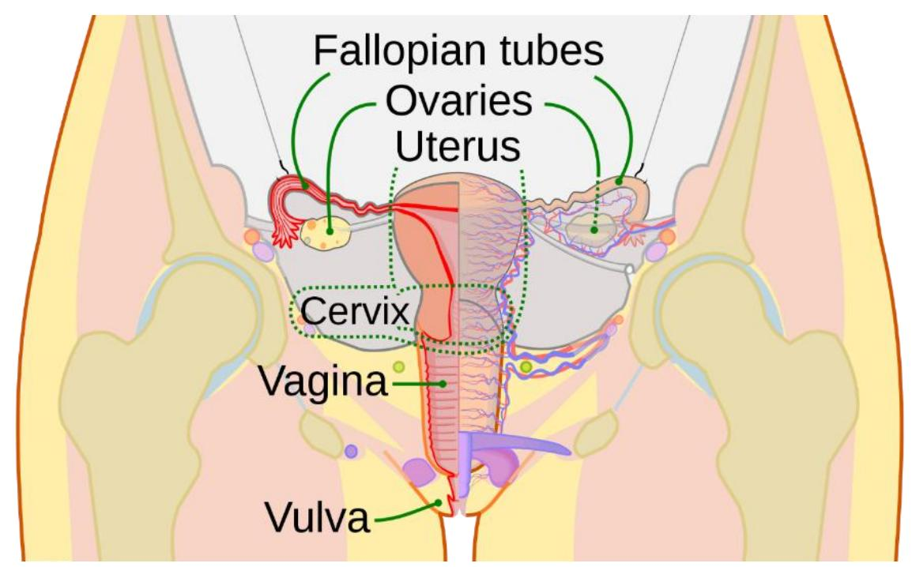

**Figure 23.1** Female Reproductive System.

## **Objectives**

In this laboratory, you will use models and diagrams to study the anatomy of the female reproductive system.

By the end of this lab session, you will be able to:

-   Identify the general functions of the female reproductive tract.
-   Identify and describe the structures and functions that contribute to the female reproductive system. You will have to identify each in a model, diagram, or in a specimen.
-   List and describe the hormones regulating the production of the ovum and identify their origin.
-   Identify the following structural and functional structures listed below:

### **Ovaries**

-   Primordial follicle

-   Primary follicle

-   Secondary follicle

-   Mature follicle

-   Ruptured follicle

-   Corpus luteum

-   Corpus albicans

## **Fallopian (Uterine) Tubes**

-   Fimbriae
-   Ampulla

## **Uterus**

-   Body
-   Fundus
-   Cervix
-   Perimetrium

### **Vulva**

-   Mons pubis
-   Labia majora
-   Labia minora
-   Vestibule

### **Breast**

-   Mammary gland

-   Areola

-   Lactiferous duct

-   Infundibulum

-   Myometrium

-   Endometrium

    -   Stratum basalis
    -   Stratum functionalis

-   Clitoris

-   Urethra/urethral orifice

-   Vagina/vaginal opening

-   Adipose tissue

-   Nipple

-   Suspensory ligament

## **Prelab Activities**

## **Prelab Activity 23.1**

-   Ovaries \_\_\_\_\_\_\_\_\_\_\_\_\_\_\_\_\_\_\_\_\_\_\_\_\_\_\_\_\_\_\_\_\_\_\_\_\_\_\_\_\_\_\_\_\_\_\_\_\_\_\_\_\_\_
-   Uterus \_\_\_\_\_\_\_\_\_\_\_\_\_\_\_\_\_\_\_\_\_\_\_\_\_\_\_\_\_\_\_\_\_\_\_\_\_\_\_\_\_\_\_\_\_\_\_\_\_\_\_\_\_\_\_
-   Cervix \_\_\_\_\_\_\_\_\_\_\_\_\_\_\_\_\_\_\_\_\_\_\_\_\_\_\_\_\_\_\_\_\_\_\_\_\_\_\_\_\_\_\_\_\_\_\_\_\_\_\_\_\_\_\_
-   Vagina \_\_\_\_\_\_\_\_\_\_\_\_\_\_\_\_\_\_\_\_\_\_\_\_\_\_\_\_\_\_\_\_\_\_\_\_\_\_\_\_\_\_\_\_\_\_\_\_\_\_\_\_\_\_\_
-   Vulva \_\_\_\_\_\_\_\_\_\_\_\_\_\_\_\_\_\_\_\_\_\_\_\_\_\_\_\_\_\_\_\_\_\_\_\_\_\_\_\_\_\_\_\_\_\_\_\_\_\_\_\_\_\_\_\_
-   Ovaries \_\_\_\_\_\_\_\_\_\_\_\_\_\_\_\_\_\_\_\_\_\_\_\_\_\_\_\_\_\_\_\_\_\_\_\_\_\_\_\_\_\_\_\_\_\_\_\_\_\_\_\_\_\_
-   Primordial follicle \_\_\_\_\_\_\_\_\_\_\_\_\_\_\_\_\_\_\_\_\_\_\_\_\_\_\_\_\_\_\_\_\_\_\_\_\_\_\_\_\_\_\_\_\_\_\_
-   Primary follicle \_\_\_\_\_\_\_\_\_\_\_\_\_\_\_\_\_\_\_\_\_\_\_\_\_\_\_\_\_\_\_\_\_\_\_\_\_\_\_\_\_\_\_\_\_\_\_\_\_
-   Secondary follicle \_\_\_\_\_\_\_\_\_\_\_\_\_\_\_\_\_\_\_\_\_\_\_\_\_\_\_\_\_\_\_\_\_\_\_\_\_\_\_\_\_\_\_\_\_\_\_
-   Mature follicle \_\_\_\_\_\_\_\_\_\_\_\_\_\_\_\_\_\_\_\_\_\_\_\_\_\_\_\_\_\_\_\_\_\_\_\_\_\_\_\_\_\_\_\_\_\_\_\_\_
-   Ruptured follicle \_\_\_\_\_\_\_\_\_\_\_\_\_\_\_\_\_\_\_\_\_\_\_\_\_\_\_\_\_\_\_\_\_\_\_\_\_\_\_\_\_\_\_\_\_\_\_
-   Corpus luteum \_\_\_\_\_\_\_\_\_\_\_\_\_\_\_\_\_\_\_\_\_\_\_\_\_\_\_\_\_\_\_\_\_\_\_\_\_\_\_\_\_\_\_\_\_\_\_\_\_
-   Corpus albicans \_\_\_\_\_\_\_\_\_\_\_\_\_\_\_\_\_\_\_\_\_\_\_\_\_\_\_\_\_\_\_\_\_\_\_\_\_\_\_\_\_\_\_\_\_\_\_\_
-   Fallopian (Uterine) Tubes \_\_\_\_\_\_\_\_\_\_\_\_\_\_\_\_\_\_\_\_\_\_\_\_\_\_\_\_\_\_\_\_\_\_\_\_\_\_\_\_
-   Fimbriae \_\_\_\_\_\_\_\_\_\_\_\_\_\_\_\_\_\_\_\_\_\_\_\_\_\_\_\_\_\_\_\_\_\_\_\_\_\_\_\_\_\_\_\_\_\_\_\_\_\_\_\_\_
-   Ampulla \_\_\_\_\_\_\_\_\_\_\_\_\_\_\_\_\_\_\_\_\_\_\_\_\_\_\_\_\_\_\_\_\_\_\_\_\_\_\_\_\_\_\_\_\_\_\_\_\_\_\_\_\_\_
-   Infundibulum \_\_\_\_\_\_\_\_\_\_\_\_\_\_\_\_\_\_\_\_\_\_\_\_\_\_\_\_\_\_\_\_\_\_\_\_\_\_\_\_\_\_\_\_\_\_\_\_\_\_
-   Uterus \_\_\_\_\_\_\_\_\_\_\_\_\_\_\_\_\_\_\_\_\_\_\_\_\_\_\_\_\_\_\_\_\_\_\_\_\_\_\_\_\_\_\_\_\_\_\_\_\_\_\_\_\_\_
-   Body \_\_\_\_\_\_\_\_\_\_\_\_\_\_\_\_\_\_\_\_\_\_\_\_\_\_\_\_\_\_\_\_\_\_\_\_\_\_\_\_\_\_\_\_\_\_\_\_\_\_\_\_\_\_\_\_
-   Fundus \_\_\_\_\_\_\_\_\_\_\_\_\_\_\_\_\_\_\_\_\_\_\_\_\_\_\_\_\_\_\_\_\_\_\_\_\_\_\_\_\_\_\_\_\_\_\_\_\_\_\_\_\_\_\_
-   Cervix \_\_\_\_\_\_\_\_\_\_\_\_\_\_\_\_\_\_\_\_\_\_\_\_\_\_\_\_\_\_\_\_\_\_\_\_\_\_\_\_\_\_\_\_\_\_\_\_\_\_\_\_\_\_\_
-   Perimetrium \_\_\_\_\_\_\_\_\_\_\_\_\_\_\_\_\_\_\_\_\_\_\_\_\_\_\_\_\_\_\_\_\_\_\_\_\_\_\_\_\_\_\_\_\_\_\_\_\_\_\_
-   Myometrium \_\_\_\_\_\_\_\_\_\_\_\_\_\_\_\_\_\_\_\_\_\_\_\_\_\_\_\_\_\_\_\_\_\_\_\_\_\_\_\_\_\_\_\_\_\_\_\_\_\_\_
-   Endometrium \_\_\_\_\_\_\_\_\_\_\_\_\_\_\_\_\_\_\_\_\_\_\_\_\_\_\_\_\_\_\_\_\_\_\_\_\_\_\_\_\_\_\_\_\_\_\_\_\_\_
-   Stratum basalis \_\_\_\_\_\_\_\_\_\_\_\_\_\_\_\_\_\_\_\_\_\_\_\_\_\_\_\_\_\_\_\_\_\_\_\_\_\_\_\_\_\_\_\_\_\_\_\_
-   Stratum functionalis \_\_\_\_\_\_\_\_\_\_\_\_\_\_\_\_\_\_\_\_\_\_\_\_\_\_\_\_\_\_\_\_\_\_\_\_\_\_\_\_\_\_\_\_\_
-   Vulva \_\_\_\_\_\_\_\_\_\_\_\_\_\_\_\_\_\_\_\_\_\_\_\_\_\_\_\_\_\_\_\_\_\_\_\_\_\_\_\_\_\_\_\_\_\_\_\_\_\_\_\_\_\_\_\_
-   Mons pubis \_\_\_\_\_\_\_\_\_\_\_\_\_\_\_\_\_\_\_\_\_\_\_\_\_\_\_\_\_\_\_\_\_\_\_\_\_\_\_\_\_\_\_\_\_\_\_\_\_\_\_
-   Labia majora \_\_\_\_\_\_\_\_\_\_\_\_\_\_\_\_\_\_\_\_\_\_\_\_\_\_\_\_\_\_\_\_\_\_\_\_\_\_\_\_\_\_\_\_\_\_\_\_\_\_
-   Labia minora \_\_\_\_\_\_\_\_\_\_\_\_\_\_\_\_\_\_\_\_\_\_\_\_\_\_\_\_\_\_\_\_\_\_\_\_\_\_\_\_\_\_\_\_\_\_\_\_\_\_
-   Vestibule \_\_\_\_\_\_\_\_\_\_\_\_\_\_\_\_\_\_\_\_\_\_\_\_\_\_\_\_\_\_\_\_\_\_\_\_\_\_\_\_\_\_\_\_\_\_\_\_\_\_\_\_\_
-   Clitoris \_\_\_\_\_\_\_\_\_\_\_\_\_\_\_\_\_\_\_\_\_\_\_\_\_\_\_\_\_\_\_\_\_\_\_\_\_\_\_\_\_\_\_\_\_\_\_\_\_\_\_\_\_\_\_
-   Urethra/urethral orifice \_\_\_\_\_\_\_\_\_\_\_\_\_\_\_\_\_\_\_\_\_\_\_\_\_\_\_\_\_\_\_\_\_\_\_\_\_\_\_\_\_\_\_
-   Vagina/vaginal opening \_\_\_\_\_\_\_\_\_\_\_\_\_\_\_\_\_\_\_\_\_\_\_\_\_\_\_\_\_\_\_\_\_\_\_\_\_\_\_\_\_\_
-   Breast \_\_\_\_\_\_\_\_\_\_\_\_\_\_\_\_\_\_\_\_\_\_\_\_\_\_\_\_\_\_\_\_\_\_\_\_\_\_\_\_\_\_\_\_\_\_\_\_\_\_\_\_\_\_\_
-   Mammary gland \_\_\_\_\_\_\_\_\_\_\_\_\_\_\_\_\_\_\_\_\_\_\_\_\_\_\_\_\_\_\_\_\_\_\_\_\_\_\_\_\_\_\_\_\_\_\_\_
-   Areola \_\_\_\_\_\_\_\_\_\_\_\_\_\_\_\_\_\_\_\_\_\_\_\_\_\_\_\_\_\_\_\_\_\_\_\_\_\_\_\_\_\_\_\_\_\_\_\_\_\_\_\_\_\_\_
-   Lactiferous duct \_\_\_\_\_\_\_\_\_\_\_\_\_\_\_\_\_\_\_\_\_\_\_\_\_\_\_\_\_\_\_\_\_\_\_\_\_\_\_\_\_\_\_\_\_\_\_\_
-   Adipose tissue \_\_\_\_\_\_\_\_\_\_\_\_\_\_\_\_\_\_\_\_\_\_\_\_\_\_\_\_\_\_\_\_\_\_\_\_\_\_\_\_\_\_\_\_\_\_\_\_\_
-   Nipple \_\_\_\_\_\_\_\_\_\_\_\_\_\_\_\_\_\_\_\_\_\_\_\_\_\_\_\_\_\_\_\_\_\_\_\_\_\_\_\_\_\_\_\_\_\_\_\_\_\_\_\_\_\_\_
-   Suspensory ligament \_\_\_\_\_\_\_\_\_\_\_\_\_\_\_\_\_\_\_\_\_\_\_\_\_\_\_\_\_\_\_\_\_\_\_\_\_\_\_\_\_\_\_\_

## **Definitions**

Complete the essential definitions before you come into the lab:

## **Prelab Activity 23.2**

### **Identifications**

Using the diagrams in this manual and your text, identify and label the structures found in figures 23.2 and 23.3.

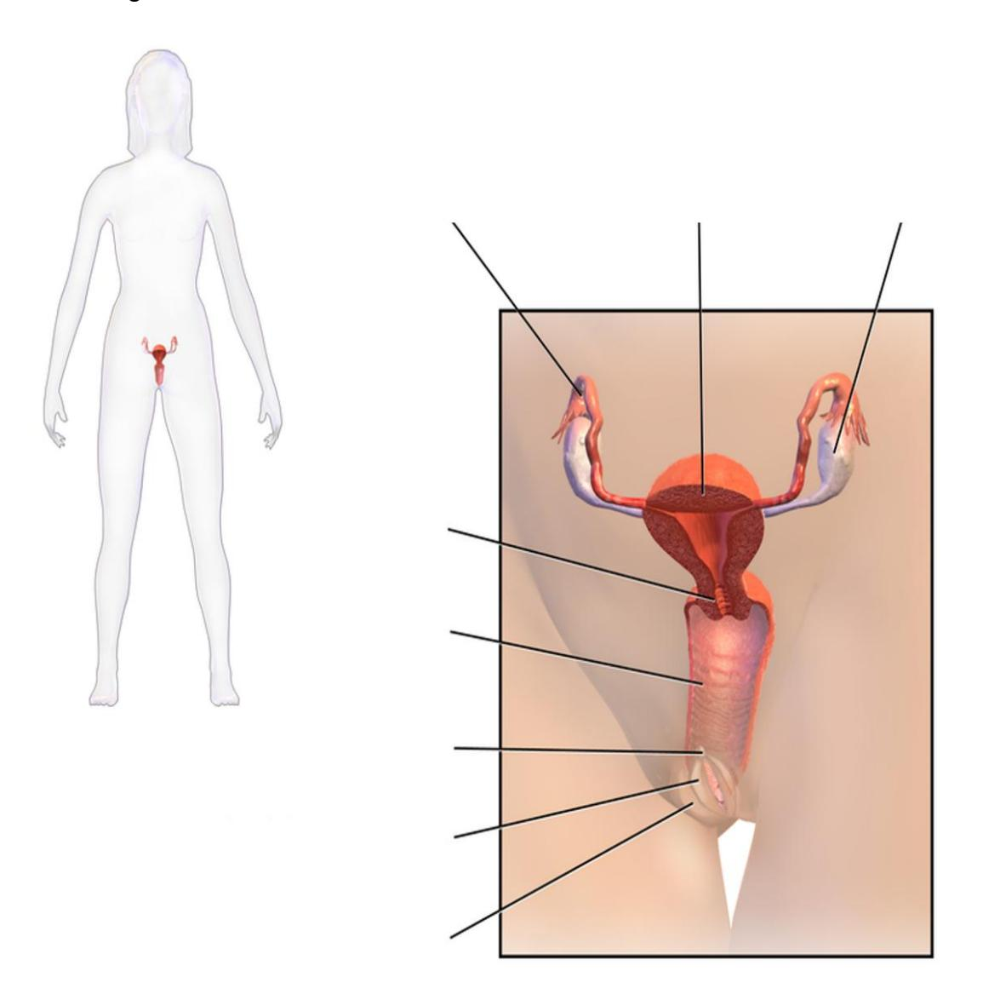

**Figure 23.2** The Female Reproductive System.

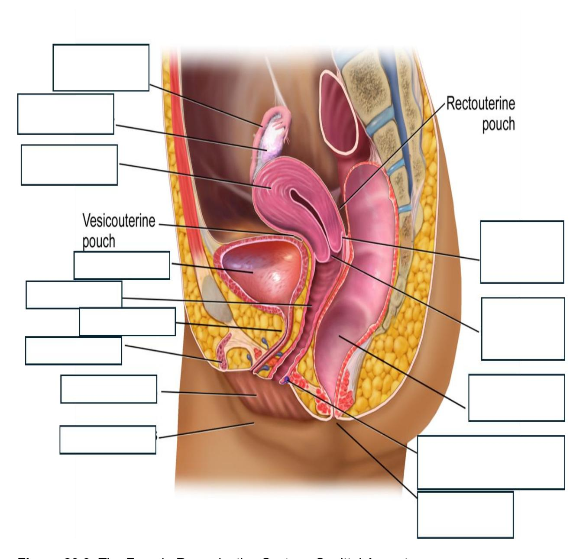

**Figure 23.3** The Female Reproductive System, Sagittal Aspect.

## **Lab Activities**

## **Lab Activity 23.1**

Obtain a 3D free-standing model and/or Hubbard Scientific display of the female reproductive system from the storage area.

-   Identify and label, using labeling tape, all of the reproductive structures listed in the lists below for figure 23.4 to 23.6.
-   Ask your instructor to confirm the correctness of your identifications.
-   Create an enumerated model using the labeling tape to use as a practice quiz. Invite the neighboring group to take the practice quiz during the lab.
-   Photograph your work for later use as a study guide.
-   If time allows make a five-minute video reviewing the parts and functions of the male reproductive system.

## **Female System**

-   Ovaries

-   Uterus

-   Cervix

-   Vagina

-   Vulva

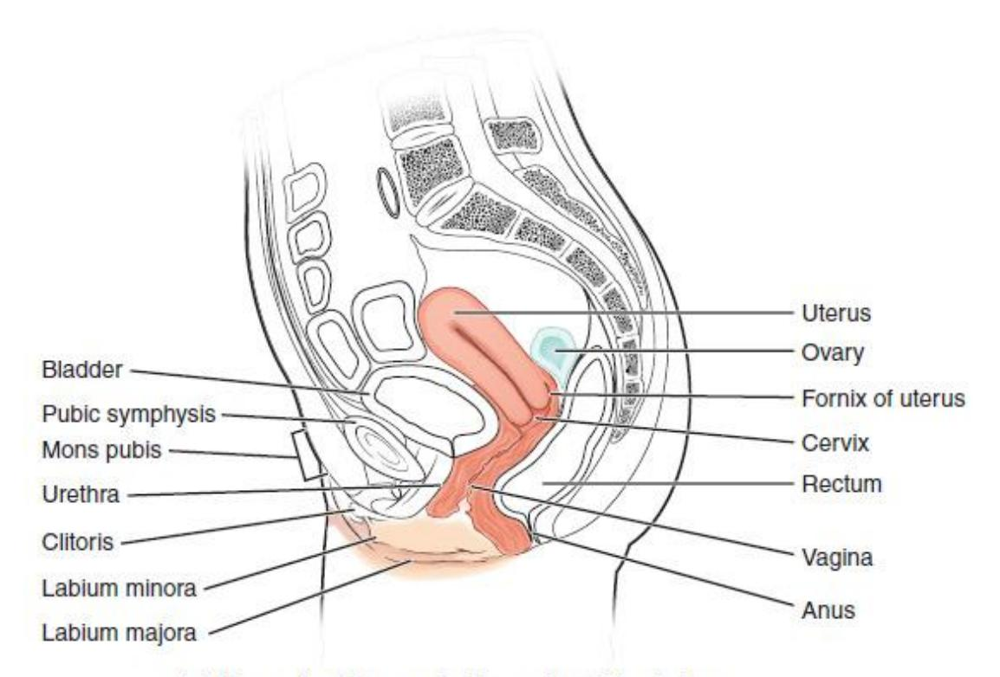

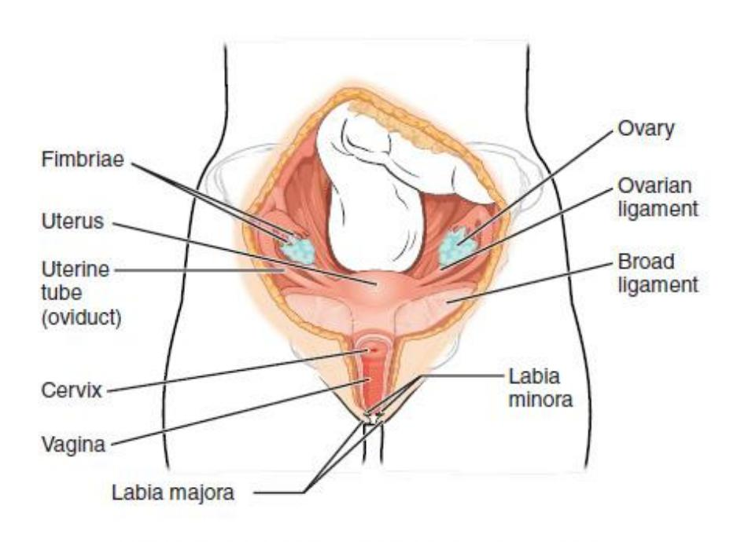

**Figure 23.4** Labelled Female Reproductive System, Sagittal and Coronal Views.

### **Ovaries**

-   Primordial follicle (oocyte)
-   Primary follicle (oocyte)
-   Secondary follicle (oocyte)
-   Mature follicle (ovum)
-   Ruptured follicle
-   Corpus luteum
-   Corpus albicans

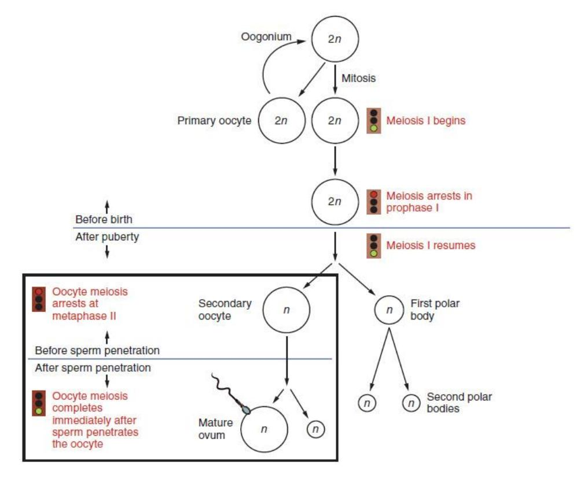

**Figure 23.5** Illustration of Oogenesis.

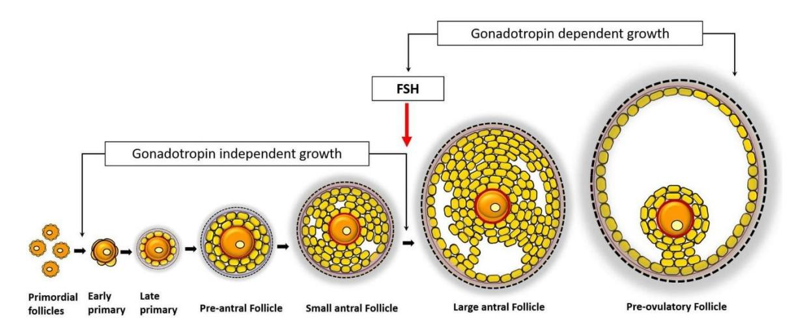

**Figure 23.6** Follicular Stages in the Ovary.

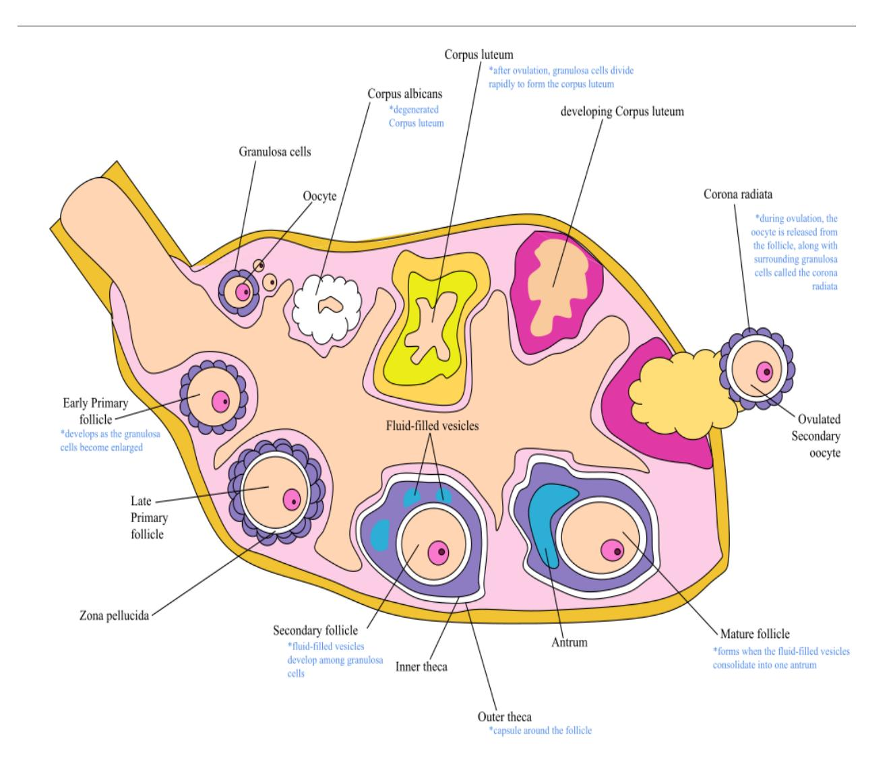

Figure 23.7 Oogenesis.

## **Fallopian (Uterine) Tubes**

### **Terms**

-   Fimbriae
-   Ampulla

## **Infundibulum**

## **Uterus**

-   Body

-   Fundus

-   Cervix

-   Perimetrium

-   Myometrium

-   Endometrium

    -   Stratum basalis
    -   Stratum functionalis

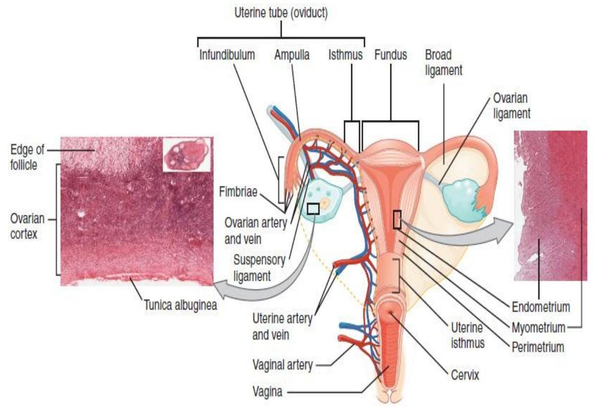

**Figure 23.8** Anterior View of the Female Uterus.

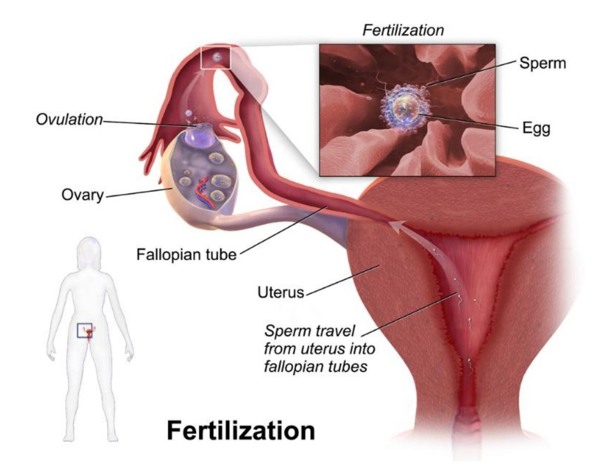

Figure 23.9 Fertilization.

## **External structures**

## **Lab Activity 23.2**

Obtain a 3D free-standing model or Hubbard Scientific plaque of the female reproductive system from the storage area.

-   Identify and label, using labeling tape, all of the reproductive structures listed in the lists below for figure 23.7 and 23.8.
-   Ask your instructor to confirm the correctness of your identifications.
-   Create an enumerated model using the labeling tape to use as a practice quiz. Invite the neighboring group to take the practice quiz during the lab.
-   Photograph your work for later use as a study guide.

## **Vulva**

-   Mons pubis

-   Labia majora

-   Labia minora

-   Vestibule

-   Clitoris

-   Urethra/urethral orifice

-   Vagina/vaginal opening

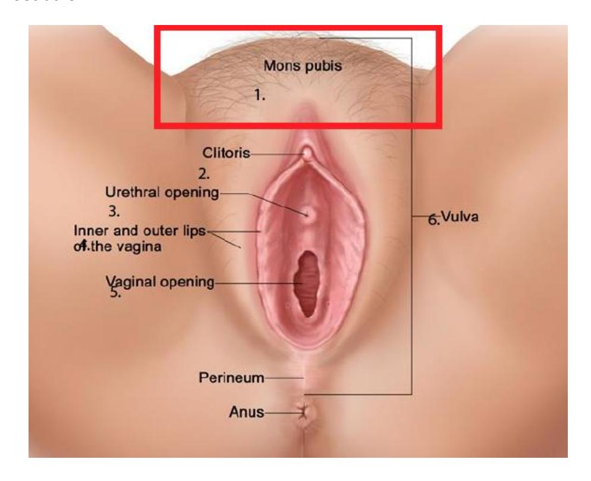

**Figure 23.10** Structures of the Vulva.

## **Lab Activity 23.3:**

Obtain a 3D display of the female reproductive system from the storage area.

-   Identify and label, using labeling tape, all of the reproductive structures listed in the lists below for figure 23.9 and 23.10.
-   Ask your instructor to confirm the correctness of your identifications.
-   Create an enumerated model using the labeling tape to use as a practice quiz. Invite the neighboring group to take the practice quiz during the lab.
-   Photograph your work for later use as a study guide.

## **Breast Terms**

-   Nipple

-   Areola

-   Mammary gland (lobule)

-   Lactiferous duct

-   Adipose tissue

-   Suspensory ligament

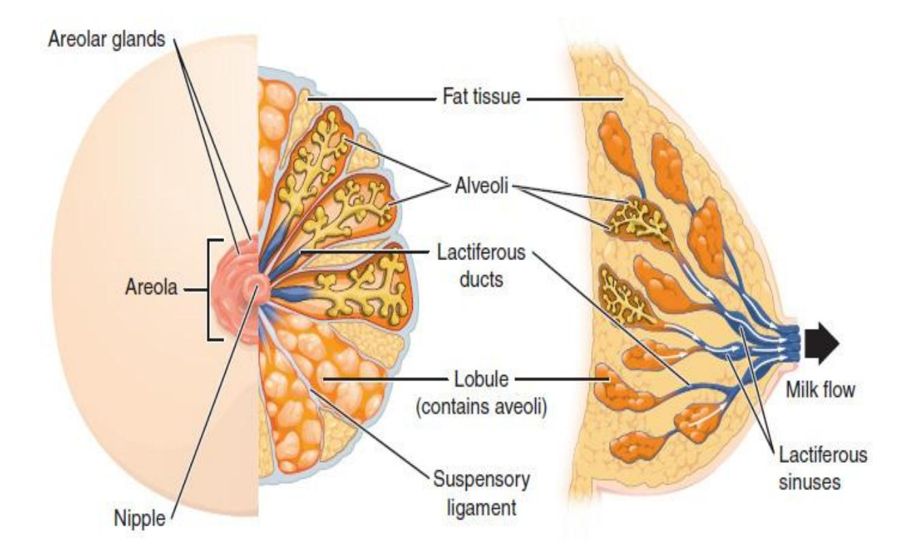

**Figure 23.11** Female Breast Illustration.

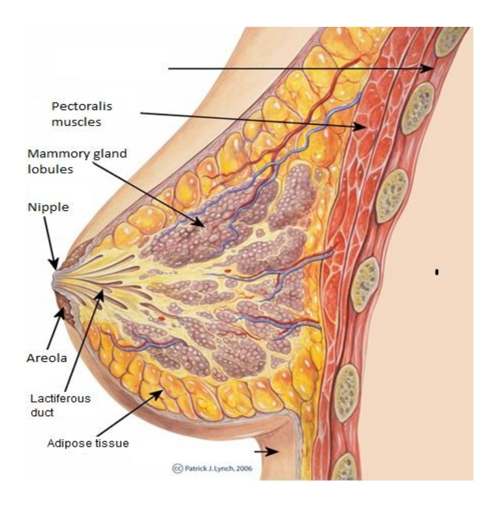

Figure 23.12 Diagram of the Sagittal View of the Breast.

## **Review Links**

### **General introduction:**

-   Professor Long 2402 Lab Female Reproductive Anatomy. Professor Bob Long - Human Anatomy and Physiology. [https://youtu.be/T2ArZIfWgmk?si=n4uhfj\\\_m2sjv6hix.](https://youtu.be/T2ArZIfWgmk?si=n4uhfj_m2sjv6hix) [https://www.youtube.com/watch?v=T2ArZIfWgmk.](https://www.youtube.com/watch?v=T2ArZIfWgmk)
-   Female Reproductive System Model. Dr. Lotz. [https://youtu.be/gRYmvZek8as?si=3Gea7ZAuYHI7ZFpG.](https://youtu.be/gRYmvZek8as?si=3Gea7ZAuYHI7ZFpG)

## **Anatomy of Breast**

-   ANATOMY OF BREAST. All For Medical Students. [**https://youtu.be/JrejhICOHFc?si=838jWz0Pokxa8Sv6**](https://youtu.be/JrejhICOHFc?si=838jWz0Pokxa8Sv6){.uri}.
-   2402 Lab Mammary Gland. [**Dr. Dan's Anatomosphere**](https://www.youtube.com/@dr.dansanatomosphere3313). https://youtu.be/EajZpm2krcY?si=BZgBCGh5eETglwgJ.

### **Practical review:**

-   Female Reproductive Anatomy \| Review and Practice. Anatomy Hero. [https://youtu.be/JfOn477MUzw?si=F\\\_3w3C339at56xCV.](https://youtu.be/JfOn477MUzw?si=F_3w3C339at56xCV)
-   Watch this video **(http://openstaxcollege.org/l/ovulation)** to observe ovulation and its initiation in response to the release of FSH and LH from the pituitary gland. What specialized structures help guide the oocyte from the ovary into the uterine tube?

## **Post-Lab Activities Test your recall**

## **Post Lab Activity 23.1**

**Crossword Puzzles**

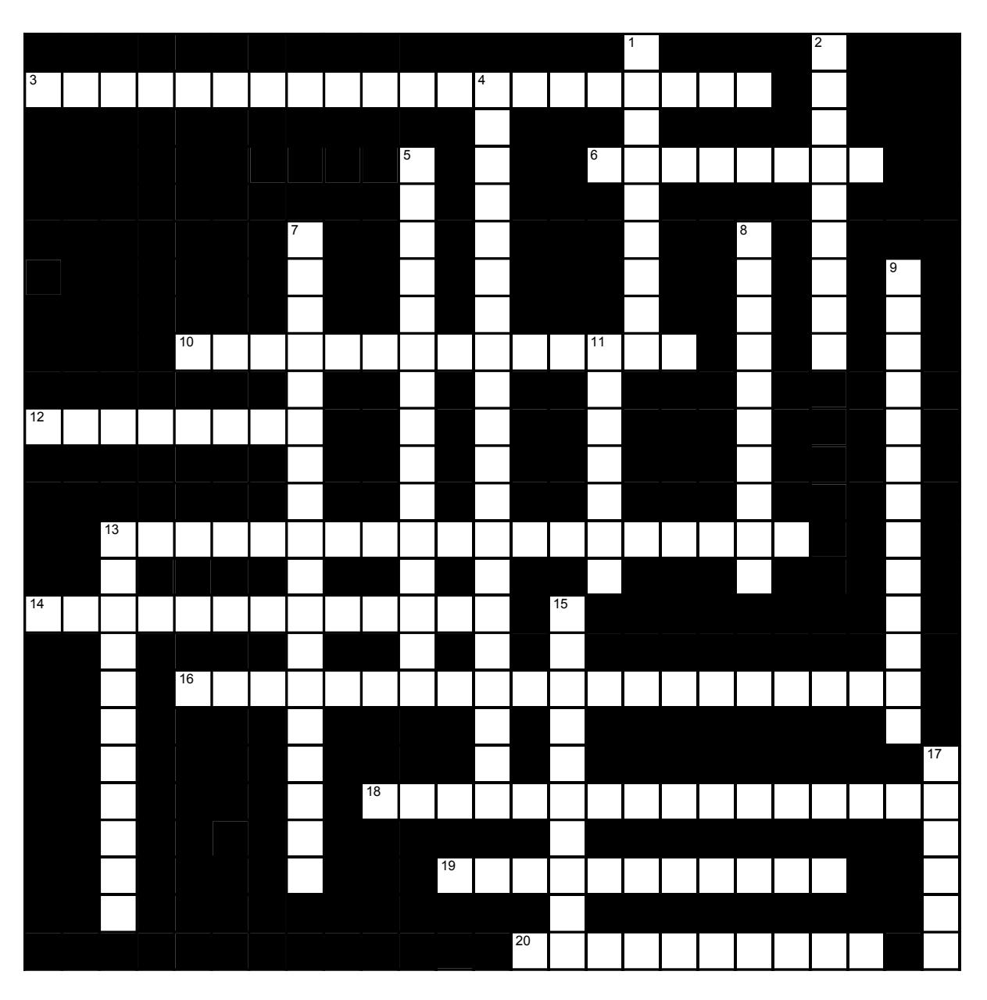

**Figure 23.13** Female Reproductive Anatomy 1

### **Across**

**3** The ovaries are within the \_\_\_\_ cavity on each side of the medial plane and just above the level of the pubis. (14,6)

**6** If pregnancy occurs, the corpora luteum is maintained until the \_\_\_ is functional. (8) 10 If pregnancy does not occur the corpus luteum degenerates and forms a small white scar called the \_\_\_ \_\_\_ (6,8)

**12** During the first two weeks of each menstrual cycle, one ovarian antral follicle develops into a fully mature "\_\_\_" follicle while the others die. (8)

**13** \_\_\_ \_\_\_ are the earliest developmental stage and can be dormant for decades. (10,9)

**14** The cells of the dominant Graafian follicle which remain in the ovary after ovulation increase in size and form a yellow endocrine gland called the \_\_\_ \_\_\_ (7,6)

**16** The corpora luteum secretes two hormones: (12,8)

**18** After puberty and through middle age, cyclic hormonal changes control a roughly \_\_\_ (number of days) \_\_\_ day cycle. It includes a few days of mild bleeding, the onset of which is noted and is thus distinguished as \_\_\_ \_\_\_. (13,3)

**19** The innermost layer of the uterus is the \_\_\_. (11)

**20** The thick muscular layer of the uterus is the \_\_\_. (10)

### **Down**

**1** The rupture of a Graafian follicle and release of a secondary oocyte is called \_\_\_. (9)

**2** On rare occasions, two follicles mature and rupture together. Conception and birth resulting from these events gives rise to \_\_\_ twins. (9)

**4** The uterine tubes widen to form the \_\_\_. This region possesses fingerlike structures called \_\_\_. (12,8)

**5** The bottom of the ovary is anchored to the uterus by the \_\_\_ \_\_\_. (7,8)

**7** An extension of the broad ligament projects from the top of the ovary to the pelvic wall and is called the \_\_\_ \_\_\_. (10,8)

**8** \_\_\_, the gametes produced by the female , are produced by the \_\_\_. (3,7)

**9** All of the internal female reproductive organs, including the ovary, are held in place by the \_\_\_ \_\_\_. (5,8)

**11** The longest region of the uterine tube is the wide \_\_\_ ; it is here the sperm, and the oocyte usually meet. (7)

**13** The outermost layer of the uterus is the \_\_\_. (11)

**15** From the uterine tube, whether it has been fertilized or not, the oocyte enters the \_\_\_ of the uterus. From there it proceeds to the \_\_\_ of the uterus, where it will stay if it is fertilized. (6,4)

**17** The \_\_\_ of the uterus is a small donut-shaped gateway, closed my mucus to protect the uterus until ovulation makes conception possible. (6)

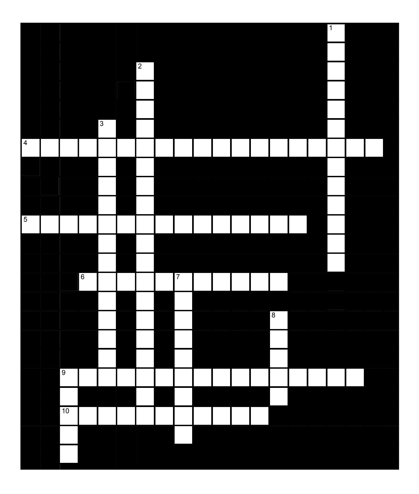

**Figure 23.14** Female reproductive anatomy 2

### **Across**

**4** The endometrium of the uterus has two layers: the \_\_\_ \_\_\_ is the functional layer which cyclically grows and develops a rich blood supply, then degenerates. (7,12)

**5** The labia minora meet anteriorly to form a the \_\_\_, a hood-like covering the \_\_\_\_ (7,8)

**6** On either side of the labia minora are the \_\_\_ \_\_\_ which are large ridges filled with adipose tissue. (5,6)

**9** The vagina opens into an indentation called the \_\_\_ It is immediately posterior to the \_\_\_. (9,7)

**10** The vestibule is flanked on either side by thin folds of sensitive skin call the \_\_\_ \_\_\_. (5,6)

### **Down**

**1** The upper end of the vagina extends upward to surround the cervix, forming a recess called the \_\_\_ \_\_\_. (7,6)

**2** If fertilization has not occurred the egg will be washed into the lower region of the uterus, the \_\_\_ , into the \_\_\_ and finally out the \_\_\_. (7,6,6)

**3** The endometrium of the uterus has two layers: farther from the lumen of the uterus is the \_\_\_, from which the functional layer grows. (7,7)

**7** The area immediately anterior to the labia majora is the \_\_\_ \_\_\_. (4,5)

**8** The outer opening of the vagina is sometimes closed or partially closed at birth by a membrane called the \_\_\_\_. (5)

**9** Taken together, the external female genitalia are referred to as the \_\_\_\_. (5)

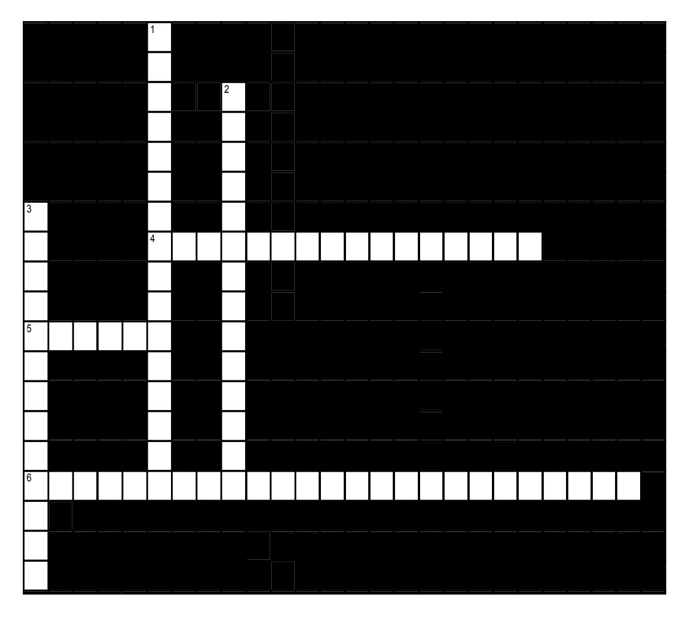

**Figure 23.15** Female reproductive accessory organs

### **Across**

**4** Each mammary gland consists of 15-25 cone shaped \_\_\_. lobes, the point of each cone lies within the nipple. Milk that is produced in each is secreted through a \_\_\_ duct which opens on the nipple's surface. (5,11)

**5** The milk is drawn from the breast by suction as the baby suckles. Each nipple is surrounded by a circular, sometimes pigmented band called the \_\_\_. (6)

**6** In non-lactating women, most of the breasts' mass is composed of \_\_\_ \_\_\_. The \_\_\_ \_\_\_ mammary glands, which actually produce the milk, enlarges during lactation, however.

### **Down**

**1** The mammary glands are surrounded by adipose tissue and held in place by a netlike set of ligaments called the \_\_\_ \_\_\_. (7,9)

**2** Each lobe within a mammary gland contains smaller \_\_\_\_. During lactation, these structures contain glandular \_\_\_ which produces milk. (These structures collapse and are dormant in the absence of lactation). (7,7)

**3** The function of the \_\_\_ \_\_\_ is to provide milk for the newborn. (7,6)

## **Post Lab Activity 23.2**

## **Review questions**

-   What are the female gonads called?

    a.  oocytes
    b.  ova
    c.  oviducts
    d.  ovaries

-   Trace the pathway of ejaculated sperm from the vagina to the oocyte. Include all structures of the female reproductive tract that the sperm must swim through to reach the egg.

-   Explain the hormonal regulation of the phases of the menstrual cycle.

## **Post Lab Activity 23.3**

## **Matching:**

**Table 23.1 Female Reproductive Structures Matching**

| Answer | Terms | Letter | Definition |
|---------------|---------------|---------------|-----------------------------|
|  | Testes | A | Fingerlike projections from the fallopian tube that assist ova in entering the tube |
|  | Broad ligament | B | Primary reproductive organ that produces and matures ova and estrogen/progesterone |
|  | Cervix | C | Muscular organ that is known as the womb; connects fallopian tubes to the vagina |
|  | Ductus (vas) deferens | D | Structure that sits posterior to the testes within the scrotum, stores sperm until fully matured |
|  | Epididymis | E | Connective tissue structure that holds the female reproductive organs in place in the pelvic cavity |
|  | Fimbriae | F | Sac that hangs at the root of the penis and holds the testes |
|  | Labia majora & minora | G | Copulatory organ of female reproduction, also known as the birth canal |
|  | Ovaries | H | Produces seminal fluids and can be palpated through the anterior wall of the rectum |
|  | Penis | I | Primary reproductive organ that produces and matures sperm cells and testosterone |
|  | Prostate gland | J | Copulatory organ of reproduction that contains erectile bodies to assist distribution of sperm |
|  | Scrotum | K | Inferior opening of the uterus, contains glands that help lubricate the vagina |
|  | Seminal vesicle | L | Tubes connect the uterus with the peritoneal cavity near each ovary |
|  | Uterine (fallopian) tube | M | Produces seminal fluids and is located on the posterior aspect of the ejaculatory duct |
|  | Uterus | N | Pair of skin folds that help protect the opening of the vagina in the perineal region |
|  | Vagina | O | Tube enters the abdomen and travels along the base of the bladder and transports sperm |

## **Post Lab Activity 23.4 Labeling:**

Label the following diagrams (figures 23.13 to 23.16) of the female reproductive system.

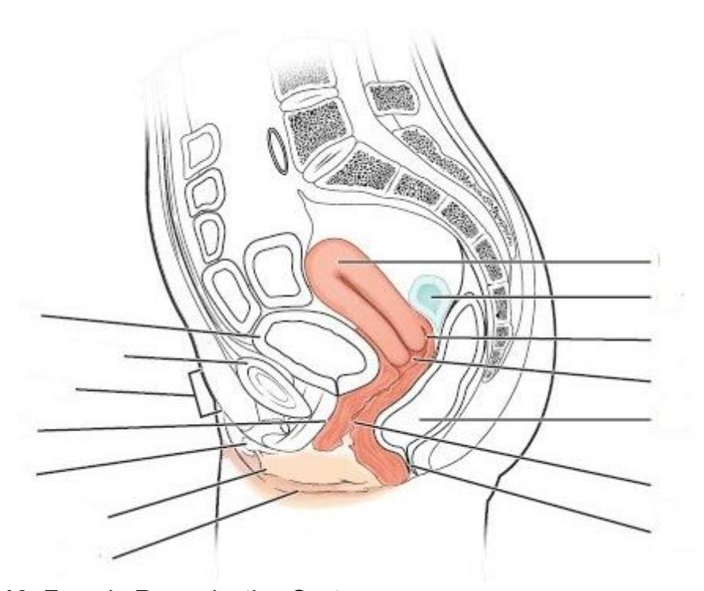

**Figure 23.13** Female Reproductive System.

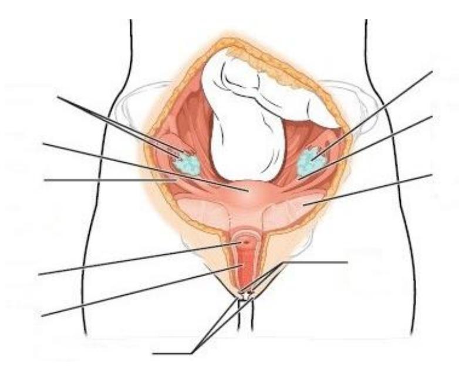

**Figure 23.14** Female Reproductive System

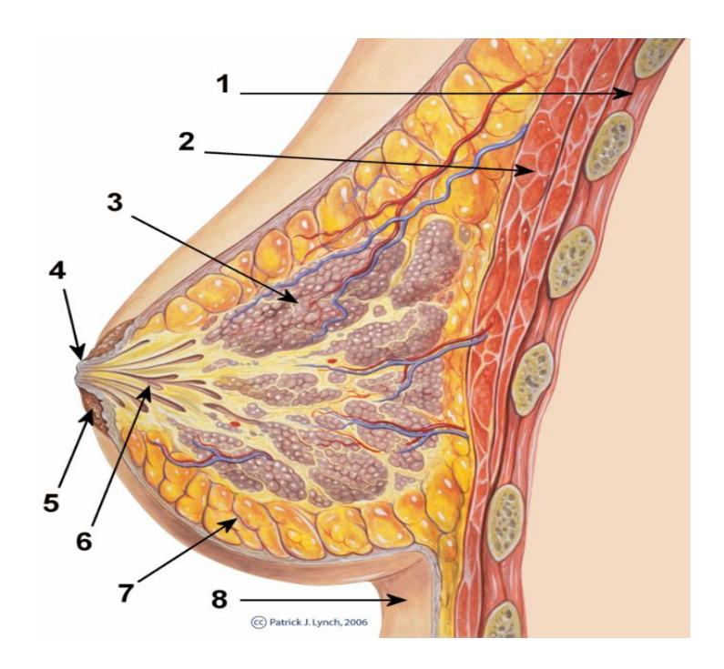

**Figure 23.15** Unlabeled Diagram of the Breast.

**Table 23.2 Breast Anatomy Identification**

| Number | Structure |
|--------|-----------|
| 2      |           |
| 3      |           |
| 4      |           |
| 5      |           |
| 6      |           |
| 7      |           |

Identify and label the stages of oogenesis.

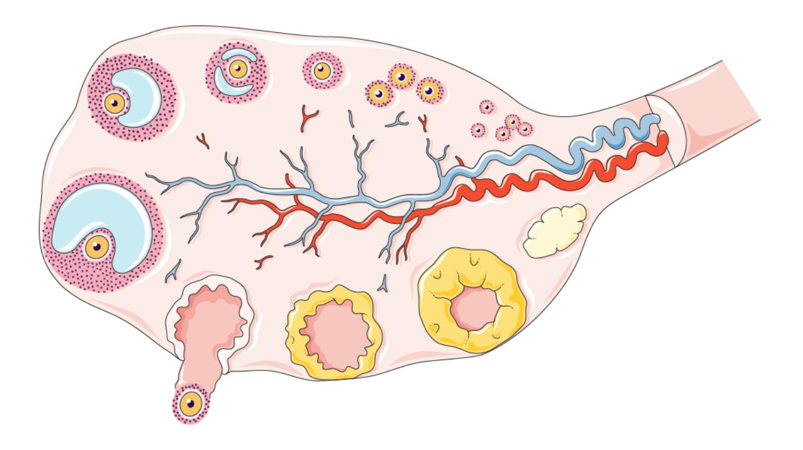

**Figure 23.16** Stages of Ovulation

#### **Word Bank**

### **Chapter 23: The Female Reproductive System Glossary**

| Terms | Definitions |
|-------------------|-----------------------------------------------------|
| adipose tissue of breast | tissue is located in the breast (breast tissue) |
| alveoli (of the breast) | milk-secreting cells in the mammary gland |
| ampulla (of the uterine tube) | middle portion of the uterine tube in which fertilization often occurs |
| antrum | fluid-filled chamber that characterizes a mature tertiary (antral) follicle |
| areola | highly pigmented, circular area surrounding the raised nipple and containing areolar glands that secrete fluid important for lubrication during suckling |
| Bartholin's glands (also, greater vestibular glands) | glands that produce a thick mucus that maintains moisture in the vulva area; also referred to as the greater vestibular glands |
| body of uterus | middle section of the uterus |
| broad ligament | wide ligament that supports the uterus by attaching laterally to both sides of the uterus and pelvic wall |
| bulbourethral glands (also, Cowper's glands) | glands that secrete a lubricating mucus that cleans and lubricates the urethra prior to and during ejaculation |
| cervix | elongate inferior end of the uterus where it connects to the vagina |
| clitoris (also, glans clitoris) | nerve-rich area of the vulva that contributes to sexual sensation during intercourse |
| corpus albicans | nonfunctional structure remaining in the ovarian stroma following structural and functional regression of the corpus luteum |
| corpus cavernosum | either of two columns of erectile tissue in the penis that fill with blood during an erection |
| corpus luteum | transformed follicle after ovulation that secretes progesterone |
| endometrium | inner lining of the uterus, part of which builds up during the secretory phase of the menstrual cycle and then sheds with menses |
| fimbriae | fingerlike projections on the distal uterine tubes |
| follicle | ovarian structure of one oocyte and surrounding granulosa (and later theca) cells |
| folliculogenesis | development of ovarian follicles from primordial to tertiary under the stimulation of gonadotropins |
| fundus (of the uterus) | domed portion of the uterus that is superior to the uterine tubes |
| gamete | haploid reproductive cell that contributes genetic material to form an offspring |
| gonadotropin- releasing hormone (GnRH) | hormone released by the hypothalamus that regulates the production of follicle-stimulating hormone and luteinizing hormone from the pituitary gland |
| gonads | reproductive organs (testes and ovaries) that produce gametes and reproductive hormones |
| granulosa cells | supportive cells in the ovarian follicle that produce estrogen |
| Head of sperm | the oval anterior end of a spermatozoon, which contains the male pronucleus and is surrounded by the acrosome. |
| hymen | membrane that covers part of the opening of the vagina |
| infundibulum (of the uterine tube) | wide, distal portion of the uterine tube terminating in fimbriae |
| isthmus | narrow, medial portion of the uterine tube that joins the uterus |
| labia majora | hair-covered folds of skin located behind the mons pubis |
| labia minora | thin, pigmented, hairless flaps of skin located medial and deep to the labia majora |
| lactiferous ducts | ducts that connect the mammary glands to the nipple and allow for the transport of milk |
| lactiferous sinus | area of milk collection between alveoli and lactiferous duct |
| mammary glands | glands inside the breast that secrete milk |
| menarche | first menstruation in a pubertal female |
| menses | shedding of the inner portion of the endometrium out though the vagina; also referred to as menstruation |
| menses phase | phase of the menstrual cycle in which the endometrial lining is shed |
| menstrual cycle | approximately 28-day cycle of changes in the uterus consisting of a menses phase, a proliferative phase, and a secretory phase |
| mons pubis | mound of fatty tissue located at the front of the vulva |
| Mullerian duct | duct system present in the embryo that will eventually form the internal female reproductive structures |
| myometrium | smooth muscle layer of uterus that allows for uterine contractions during labor and expulsion of menstrual blood |
| nipple | a raised region of tissue on the surface of the breast from which, in lactating females, milk from the mammary gland leaves the body through the lactiferous ducts to nurse an infant. |
| oocyte | cell that results from the division of the oogonium and undergoes meiosis I at the LH surge and meiosis II at fertilization to become a haploid ovum |
| oogenesis | process by which oogonia divide by mitosis to primary oocytes, which undergo meiosis to produce the secondary oocyte and, upon fertilization, the ovum |
| oogonia | ovarian stem cells that undergo mitosis during female fetal development to form primary oocytes |
| ovarian cycle | approximately 28-day cycle of changes in the ovary consisting of a follicular phase and a luteal phase |
| ovaries | female gonads that produce oocytes and sex steroid hormones (notably estrogen and progesterone) |
| ovulation | release of a secondary oocyte and associated granulosa cells from an ovary |
| ovum | haploid female gamete resulting from completion of meiosis II at fertilization |
| perimetrium | outer epithelial layer of uterine wall |
| polar body | smaller cell produced during the process of meiosis in oogenesis |
| primary follicles | ovarian follicles with a primary oocyte and one layer of cuboidal granulosa cells |
| primordial follicles | least developed ovarian follicles that consist of a single oocyte and a single layer of flat (squamous) granulosa cells |
| proliferative phase | phase of the menstrual cycle in which the endometrium proliferates |
| puberty | life stage during which a male or female adolescent becomes anatomically and physiologically capable of reproduction |
| rugae (of the vagina) | folds of skin in the vagina that allow it to stretch during intercourse and childbirth |
| secondary follicles | ovarian follicles with a primary oocyte and multiple layers of granulosa cells |
| secondary sex characteristics | physical characteristics that are influenced by sex steroid hormones and have supporting roles in reproductive function |
| secretory phase | phase of the menstrual cycle in which the endometrium secretes a nutrient- rich fluid in preparation for implantation of an embryo |
| suspensory ligaments | bands of connective tissue that suspend the breast onto the chest wall by attachment to the overlying dermis |
| tertiary follicles (also, antral follicles) | ovarian follicles with a primary or secondary oocyte, multiple layers of granulosa cells, and a fully formed antrum |
| theca | cells estrogen-producing cells in a maturing ovarian follicle |
| Urethra/urethral orifice | (aka the urinary meatus) is the opening of the penis or vulva where urine exits the urethra during urination. |
| uterine tubes (also, fallopian tubes or oviducts) | ducts that facilitate transport of an ovulated oocyte to the uterus |
| uterus | muscular hollow organ in which a fertilized egg develops into a fetus |
| vagina (vaginal opening) | tunnel-like organ that provides access to the uterus for the insertion of semen and from the uterus for the birth of a baby |
| vulva | external female genitalia |
